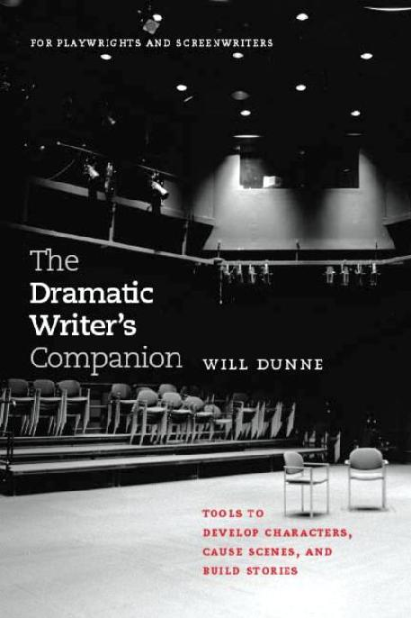
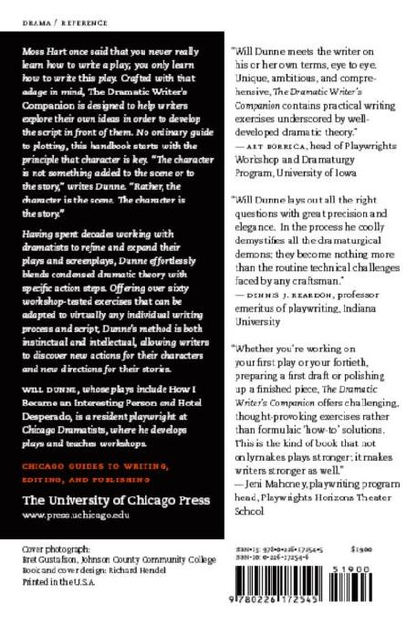

**Title:** The Dramatic Writer's Companion
**Authors:** Will Dunne
**Language:** en
**Date:** 2010-01-26T13:55:00+00:00
**Identifier:** c13dfb0c-92df-4f8e-b629-5cfa8da031b8

# 

On Writing, Editing, and
Publishing

Jacques Barzun

Telling About Society

Howard S. Becker

Tricks of the Trade

Howard S. Becker

Writing for
Social Scientists

Howard S. Becker

Permissions,
A Survival Guide

Susan M. Bielstein

The Craft of Translation

John Biguenet and
Rainer Schulte, editors

The Craft of Research

Wayne C. Booth,
Gregory G. Colomb,
and Joseph M.
Williams

Glossary of
Typesetting Terms

Richard Eckersley,
Richard Angstadt,
Charles M. Ellerston,
Richard Hendel, Naomi
B. Pascal, and Anita
Walker Scott

Writing Ethnographic
Fieldnotes

Robert M. Emerson,
Rachel I. Fretz, and
Linda L. Shaw

Legal Writing
in Plain English

Bryan A. Garner

From Dissertation
to Book

William Germano

Getting It Published

William Germano

A Poet's Guide to Poetry

Mary Kinzie

The Chicago Guide to
Collaborative Ethnography

Luke Eric Lassiter

How to Write a BA Thesis

Charles Lipson

Cite Right

Charles Lipson

The Chicago Guide
to Writing about
Multivariate Analysis

Jane E. Miller

The Chicago Guide to
Writing about Numbers

Jane E. Miller

Mapping It Out

Mark Monmonier

The Chicago Guide to
Communicating Science

Scott L. Montgomery

Indexing Books

Nancy C. Mulvany

Developmental Editing

Scott Norton

Getting into Print

Walter W. Powell

The Subversive
Copy Editor

Carol Fisher Sailer

A Manual for Writers of
Research Papers, Theses,
and Dissertations

Kate L. Turabian

Tales of the Field

John Van Maanen

Style

Joseph M. Williams

A Handbook of
Biological illustration

Frances W. Zweifel

# 

# 

WILL DUNNE

In honor Of LLOYD RICHARDS

and with gratitude to MARY f. MCCABE

# 

[About This Guide](#page0015) xv

[Exercises at a Glance](index_split_000_split_004.html#page0025) xxiii

[DEVELOPING YOUR CHARACTER](index_split_000_split_005.html#page0029) I

[STAGE I: FLESHING OUT THE BONES](index_split_000_split_004.html#page0025)

[Basic Character Builder 3](index_split_000_split_006.html#page0031)

[Begin to create a new character by fleshing out key physical, psychological, and social traits and by identifying some of the important experiences that have shaped the character by the time the story begins.](index_split_000_split_001.html#page0003)

[What the Character Believes 8](index_split_000_split_008.html#page0037)

[The character's personal beliefs have a huge impact on how he or she sees the world, makes decisions, and behaves. Twenty topics lead you through an exploration of this credo and-like the next two parallel exercises-ask you to respond through your character's unique perceptions and voice.](index_split_000_split_001.html#page0003)

[Where the Character Lives io](index_split_001_split_004.html#page0120)

[Whether or not story action actually takes place in the character's home, it is a personal domain that can reveal much about who your character is and isn't. Twenty questions lead you through this exploration.](index_split_000_split_001.html#page0003)

[Where the Character Works 12](index_split_000_split_012.html#page0043)

[The activities, culture, and experience of work provide another key source of character information-even if this work doesn't figure prominently in the story action. Twenty questions lead you through this exploration.](index_split_000_split_001.html#page0003)

[Getting Emotional 15](index_split_000_split_014.html#page0047)

[Dramatic characters tend to be driven by strong feelings. Learn more about your character by exploring his or her primal emotions-anger, fear, and love-and the stimuli that trigger them.](index_split_000_split_030.html#page0091)

[Into the Past 19](index_split_000_split_016.html#page0053)

[One key to a great story is a great backstory. What has your character experienced in the past that will shed new light on his or her behavior now? Starting at the precise moment the story begins, this exercise leads you backward through time, step by step, to discover important truths.](index_split_000_split_001.html#page0003)

[Defining Trait 22](index_split_000_split_018.html#page0056)

[What are the bold strokes of your character-positive or negative-and how do these dominant traits inform and affect story events? This exercise helps you explore the causes and effects of the character traits that matter most.](index_split_000_split_001.html#page0003)

[STAGE 2: GETTING TO KNOW THE CHARACTER BETTER](index_split_000_split_004.html#page0025)

[Allies: Then and Now 25](index_split_000_split_020.html#page0061)

[Drama is about human relationships and how they function under pressure. This exercise defines different types of allies, such as "the dangerous ally," and asks you to find examples of each in your character's life.](index_split_000_split_001.html#page0003)

[Adversaries: Then and Now 30](index_split_000_split_022.html#page0067)

[This exercise picks up where the previous one left off, defining different types of adversaries, such as "the friendly foe," and asks you to find examples of each in your character's life.](index_split_000_split_001.html#page0003)

[Characters in Contrast 35](index_split_000_split_024.html#page0074)

[Compare two of your principle characters in categories ranging from key strengths (such as "extra special talent") to key weaknesses (such as "extra special lack of talent"). You may find similarities and differences that help you better understand both characters and their relationship.](index_split_000_split_001.html#page0003)

[Finding the Character's Voice 41](index_split_000_split_026.html#page0082)

[A fully developed character has a unique way of expressing thoughts and feelings. Explore some of the long-term and short-term factors that can affect this voice. Then compare the voices of any two of your characters.](index_split_000_split_001.html#page0003)

[Three Characters in one 46](index_split_000_split_028.html#page0087)

[See what truths, lies, and delusions you can uncover by exploring a character from three different perspectives: that of the character, that of someone who knows the character well, and that of an objective outside observer.](index_split_000_split_001.html#page0003)

[The Secret Lives of Characters 49](index_split_000_split_030.html#page0091)

[The secrets that characters keep suggest a lot about what they value and what they fear. Explore different types of character secrets and how they might affect the direction of your story.](index_split_000_split_001.html#page0003)

[STAGE 3: UNDERSTANDING WHO THE CHARACTER REALLY IS](index_split_000_split_004.html#page0025)

[The Noble Character 54](index_split_000_split_032.html#page0098)

[Great characters tend to be noble in nature, even if they are also flawed and behave badly. This raise-the-bar exercise challenges you to explore the nobility of a character and build on this to create a more important story.](index_split_000_split_001.html#page0003)

[Seven Deadly Sins](index_split_001_split_000.html#page0105) 58

[Whether or not your characters are religious, the concept of "sin" offers opportunities to explore their individual strengths and weaknesses. Use the traditional seven deadly sins to develop capsule portraits of your characters.](index_split_000_split_001.html#page0003)

[The Dramatic Triangle 62](index_split_001_split_002.html#page0112)

[In a relationship between two characters, there is often a third party affecting what happens between them-even if the third party is not physically present. Learn more about a key relationship by analyzing it as a dramatic triangle.](index_split_000_split_001.html#page0003)

[Spinal Tap 68](index_split_001_split_004.html#page0120)

[The spine of the character is the root action from which all of the character's other actions flow. This big-picture exercise helps you explore a character's spine and use it to trigger new story ideas.](index_split_000_split_001.html#page0003)

[Character as Paradox 72](index_split_001_split_006.html#page0125)

[Fascinating characters tend to manifest contradictory traits and behaviors. By exploring your character as a paradox-a self-contradiction which is true-you can add to his or her complexity and generate new ideas for story action.](index_split_000_split_001.html#page0003)

[The Character You Like Least 77](index_split_001_split_008.html#page0132)

[To develop any character, you need to understand how he or she experiences the world. Try this character exploration if you find yourself with a twodimensional "bad guy" whom you are having trouble writing.](index_split_000_split_001.html#page0003)

[In So Many Words 84](index_split_001_split_010.html#page0140)

[This exercise helps you establish a big-picture view of your character and then gradually focus in on his or her most important characteristics.](index_split_000_split_030.html#page0091)

[CAUSING A SCENE](index_split_001_split_012.html#page0146) 89

[STAGE I: MAKING THINGS HAPPEN](index_split_001_split_025.html#page0188)

[Basic Scene Starter](index_split_001_split_013.html#page0148) 91

[This simple writing warm-up offers twelve basic questions that can help you prepare to write any dramatic scene.](index_split_000_split_001.html#page0003)

[Where in the World Are We?](index_split_001_split_015.html#page0154) 95

[The setting for a scene can be a rich source of story ideas if you take the time to discover what's there. This physical life exercise guides you through a visceral exploration of the place where a scene will occur.](index_split_000_split_001.html#page0003)

[The Roots of Action ioo](index_split_000_split_004.html#page0025)

[Explore the given circumstances for a scene and use this scenic context to fuel the emotions, thoughts, needs, and behavior of your characters at this particular time in your story.](index_split_000_split_001.html#page0003)

[What Does the Character Want? Io6](index_split_001_split_019.html#page0170)

[Dramatic characters act for one reason: they want something. Explore five types of objectives and figure out what specifically your character wants in any scene of your story.](index_split_000_split_001.html#page0003)

[What's the Problem? I12](#page0015)

[Conflict in drama is obstacle. Explore different types of obstacles that your character might have to face while pursuing a scenic objective.](index_split_000_split_008.html#page0037)

[Good intentions](index_split_001_split_023.html#page0184) 116

[Right or wrong, characters act in pursuit of what they perceive to be good at the time. Find the good intentions behind even the worst behavior so that you can better understand the characters you write.](index_split_000_split_001.html#page0003)

[How It Happens](index_split_001_split_025.html#page0188) 120

[Characters try different strategies-some planned, some spontaneous-to achieve their objectives. This exercise helps you figure out the beginning steps of character action in a scene.](index_split_000_split_001.html#page0003)

[Character Adjustments](index_split_001_split_027.html#page0194) 125

[Your character has a certain observable attitude or emotion that can affect how a scene begins or unfolds. Use this exercise to explore different possible adjustments for your character during the course of a scene.](index_split_000_split_001.html#page0003)

[Scene in a Sentence](index_split_001_split_029.html#page0201) 129

[No matter how many different actions and topics it involves, and regardless of its complexity, a scene is about one thing. This exercise helps you explore the main event of a scene from different angles that may lead to new story ideas.](index_split_000_split_001.html#page0003)

[STAGE 2: REFINING THE ACTION](index_split_001_split_031.html#page0208)

[Seeing the Scene](index_split_001_split_031.html#page0208) 133

[A picture is worth a thousand words. Streamline the need for dialogue by exploring new ways to literally show, not tell, your story and create a simple visual storyboard of the scenic action.](index_split_000_split_001.html#page0003)

[There and Then](index_split_001_split_033.html#page0215) 138

[In drama, the term "exposition" refers to anything that is not observable in the here and now. Use this exercise to turn expositional facts into story action that fuels your story instead of stopping it.](index_split_000_split_001.html#page0003)

[The Aha!s of the Story](index_split_002_split_001.html#page0223) 143

[Characters continually acquire new knowledge about themselves, others, and the world at large. Explore three types of character discovery and how these "aha!" moments might influence the dramatic action of a scene.](index_split_000_split_001.html#page0003)

[Heating Things Up](index_split_002_split_003.html#page0229) 148

[One way to heighten conflict is to make confrontation between your characters unavoidable. Explore different conflict techniques, from a binding disagreement to such devices as the locked cage, ticking clock, and vise.](index_split_000_split_001.html#page0003)

[The Emotional Storyboard](index_split_002_split_005.html#page0237) 153

[Character feelings are an integral part of story structure. Map out the emotional arc of each character in a scene, and explore how this emotional life both creates and grows out of the dramatic action.](index_split_000_split_001.html#page0003)

[In the Realm of the Senses 16o](index_split_002_split_007.html#page0246)

[Sense experience and sense memory are key ingredients of our participation in your story. Add visceral power to a scene-and trigger new ideas-by doing an in-depth sense study of its setting, characters, and dramatic action.](index_split_000_split_001.html#page0003)

[The Voice of the Setting](index_split_002_split_009.html#page0253) 165

[Whether indoors or out, every setting has its own voice. Explore different ways to use the nonverbal sounds of this voice to help set the scene, create a mood, or tell the story.](index_split_000_split_001.html#page0003)

[Thinking in Beats](index_split_002_split_011.html#page0262) 170

[The beat is the smallest unit of dramatic action. By doing a beat analysis of a scene you want to revise or edit, you can not only pinpoint dramaturgical problems, but also evaluate your current writing process.](index_split_000_split_001.html#page0003)

[STAGE 3: REFINING THE DIALOGUE](index_split_001_split_031.html#page0208)

[Talking and Listening](index_split_002_split_013.html#page0271) 177

[Dialogue is heightened speech that sounds like everyday conversation but isn't. Here are some general guidelines to help you revise your dialogue so that it accomplishes more with less.](index_split_000_split_001.html#page0003)

[Unspeakable Truths](index_split_002_split_015.html#page0280) 182

[What your characters don't say is just as important-and often more important-than what they do say. Explore the subtext of your characters and how to communicate it without actually stating it.](index_split_000_split_001.html#page0003)

[Universal Truths and Lies](index_split_002_split_017.html#page0285) 187

[A great story imparts not only the specifics of a plot, but also statementstrue or false-about the world we all live in. Elevate your dialogue by exploring character beliefs about the human condition, and blending these universal truths and lies into plot details.](index_split_000_split_001.html#page0003)

[The Bones of the Lines](index_split_002_split_019.html#page0289) 191

[While there are no rules for writing dialogue, certain basic principles tend to govern the power of dramatic speech. Use these principles as editing guidelines to refine your dialogue from a purely technical angle.](index_split_000_split_001.html#page0003)

[BUILDING YOUR STORY](index_split_002_split_021.html#page0297) 197

[STAGE I: TRIGGERING THE CHAIN OF EVENTS](index_split_002_split_001.html#page0223)

[Whose Story Is It? 199](index_split_002_split_022.html#page0299)

[A dramatic story may center on one, two, or more characters. Use this exercise to find the right character focus for your story if you are having trouble figuring out whose story you are writing.](index_split_000_split_001.html#page0003)

[How Will the Tale Be Told? 204](index_split_002_split_024.html#page0307)

[From what vantage point will we experience the world of your characters? Develop a point-of-view "contract" to define how you will limit-or not limit-our knowledge of story events.](index_split_001_split_008.html#page0132)

[As the World Turns 211](index_split_002_split_026.html#page0316)

[What is the world of your story? Trigger new story ideas by fleshing out the physical, cultural, and political dimensions of this realm as well as the values, beliefs, and laws that govern it.](index_split_000_split_001.html#page0003)

[Inciting Event 217](index_split_002_split_028.html#page0325)

[Every story is a quest triggered by a turning-point experience that upsets the balance of a character's life in either a good way or a bad way. Explore your story's inciting event and how it affects your character.](index_split_000_split_001.html#page0003)

[The Art of Grabbing 221](index_split_002_split_030.html#page0330)

[Great stories grab us by the throat and don't let go. Increase your story's grabbing power by looking carefully at what you have accomplished-or not accomplished-during the first ten pages.](index_split_000_split_001.html#page0003)

[STAGE 2: DEVELOPING THE THROUGHLINE](index_split_000_split_005.html#page0029)

[Step by Step 228](index_split_002_split_032.html#page0342)

[Drama is about life in transition. This exercise helps you plan the big transition of your character's dramatic journey, using a step outline to track and analyze key events.](index_split_000_split_001.html#page0003)

[Turning Points 233](index_split_003_split_000.html#page0351)

[Your character's dramatic journey is a sequence of events that can sometimes turn in unexpected directions. Learn more about your story by fleshing out two basic types of turning points.](index_split_000_split_001.html#page0003)

[What Happens Next? 240](index_split_003_split_002.html#page0362)

[Suspense is a core ingredient of any dramatic story. Use basic principles of suspense to strengthen your story and keep your audience engaged.](index_split_000_split_001.html#page0003)

[Pointing and Planting 246](index_split_003_split_004.html#page0372)

[Foreshadowing can help you strengthen your throughline by finding the relationships between story events. Use this exercise to explore how setups and payoffs can heighten suspense.](index_split_000_split_001.html#page0003)

[Crisis Decision 253](index_split_003_split_006.html#page0382)

[The crisis is when your subject, theme, character, and story all converge to create the most difficult decision your character must face. Construct this crisis decision by examining the gains and losses that hang in the balance.](index_split_000_split_001.html#page0003)

[Picturing the Arc of Action 257](index_split_003_split_008.html#page0388)

[This exercise can help you visualize the throughline of your story, find telling images of your character at the most important points of the dramatic journey, and understand how these points connect.](index_split_000_split_001.html#page0003)

[Before and After 260](index_split_003_split_010.html#page0392)

[Define your character's dramatic journey by comparing its starting point to its final destination and determine how the character has been affected by what happened.](index_split_000_split_001.html#page0003)

[Twelve-Word Solution](index_split_003_split_012.html#page0398) 264

[Work within given limits to explore your story globally and define the key events of your character's dramatic journey.](index_split_000_split_028.html#page0087)

[STAGE 3: SEEING THE BIG PICTURE](index_split_003_split_008.html#page0388)

[Main Event 267](index_split_003_split_014.html#page0402)

[No matter how complex its characters, plots, and subplots may be, a great story usually adds up to one main event. This focusing exercise helps you understand what happens-or what could happen-in your story overall.](index_split_000_split_001.html#page0003)

[Your Story as a Dog 27 1](index_split_003_split_018.html#page0416)

[By translating your story into totally different forms, such as a newspaper headline or poem, you can simplify and prioritize your story ideas, get a clearer view of the big picture, and have fun in the process.](index_split_000_split_001.html#page0003)

[The Incredible Shrinking Story 277](index_split_003_split_018.html#page0417)

[Developing a synopsis is a great focusing process that can help clarify what you are really writing about. This exercise helps you get the most out of this process by writing not just one but seven different levels of summary.](index_split_000_split_001.html#page0003)

[What's the Big idea? 280](index_split_003_split_020.html#page0422)

[As you review your script, you will probably find a number of themes woven throughout. Use this focusing exercise to figure out which of these ideas is most important, and develop a theme statement that can help guide the rest of story development.](index_split_000_split_001.html#page0003)

[What's in a Name? 285](index_split_003_split_022.html#page0428)

[This exercise might help you find a great title for your story, but its primary purpose is to use the naming process to explore the big picture of your story and figure out what matters most.](index_split_000_split_001.html#page0003)

[The Forest of Your Story 291](index_split_003_split_024.html#page0434)

[The forest is what we discover when we can finally see more than just the trees. What is the forest of your story? This summary exercise leads you through a detailed big-picture analysis of your material.](index_split_000_split_001.html#page0003)

[Ready, Aim, Focus 295](index_split_003_split_026.html#page0441)

[This focusing exercise asks you to think a lot but write only a little as you give one-word answers to big questions about your story, such as "What does your main character most want?"](index_split_000_split_001.html#page0003)

[Six Steps of Revision 297](index_split_003_split_028.html#page0443)

[The revision process is often when a script gets "written." This exercise offers a series of suggestions and reminders to help you review a completed draft of your script.](index_split_000_split_001.html#page0003)

[FIXING COMMON SCRIPT PROBLEMS](index_split_003_split_030.html#page0451) 303

[Use exercises from this guide to address such problems as False Character; Unnecessary Character; No One to Care About; Not Clear What the Character Wants; Not Enough Conflict; Not Enough at Stake; False Starts and Stops; Strategy Gone Stale; Retrospective Elucidation; Punches That Don't Land; Nothing Happening; Something Happening, But It Doesn't Matter; Lack of Focus Early On; Main Character Too Passive or Missing in Action; Offstage More Interesting Than Onstage; Weak Throughline; A Crisis That Isn't; Not Clear What Happened in the Story; A Theme That Isn't; and Way Too Many Words.](index_split_000_split_001.html#page0003)

[Glossary](index_split_003_split_031.html#page0465) 313

[Acknowledgments 3rg](index_split_003_split_032.html#page0474)

# 

Designed for dramatic writers who are developing a script or about to begin
one, this guide is a creative and analytical reference tool. It is composed
not as a linear sequence of chapters, but as a collection of self-contained
writing exercises to help you explore and refine your own unique material.
These tools can be used at any time in any order and can be repeated as
often as you like to make new discoveries. For best results, please take the
time to read this introduction, which explains more about what the guide
is and how to use it.

TO THE DRAMATIC WRITER

As a dramatic writer working on a play or screenplay, you are engaged in
the process of telling a story. It is a process both old and new-old because
its roots stretch back through centuries and offer time-tested principles to
guide you, and new because it must be adapted to an utterly unique set of
dynamics: you and the story you want to tell.

This guide is designed to help you manage both the old and the new of
the storytelling process. Written from a playwright's perspective and making room in its embrace for both playwrights and screenwriters, the guide
offers sixty-two in-depth character, scene, and story development exercises. The purpose of these tools is to spark creativity and steer analysis as
you develop your script.

TOOLS FOR LEAPING INTO BLANK PAGES

The exercises in this guide build on certain basic assumptions. First, though
stage and film are each a distinct medium, the writers of plays and screenplays are more alike than different. Both must create the blueprint for an
emotional experience that is meant to be seen and heard. Both must tackle
the idea that "less is more" and convey a lot-often a character's entire lifetime-in one audience sitting. Both must use the present to imply the past.
Both must figure out how to "show, not tell," the story so that the audience's
knowledge of it comes not from hearing explanations, but from observing and interpreting character behavior. Like storytellers of any kind, dramatic writers also must try to grab the audience from the start, keep them
interested to the end, and communicate something meaningful along the
way. It is common challenges like these that the exercises in this guide are
designed to address.

Second, though there may be no rules for creating art, dramatic stories
tend to reflect certain basic storytelling principles. For example, most plays and screenplays focus on the dramatic journey of one main character. This
journey usually consists of a series of events that change the world of the
story for better or worse. Most of these events are caused by the character's
need to accomplish something important and are shaped by the conflicts
and risks that stand in the way.

Some dramatic writers adhere faithfully to classic principles like these
and produce great works like A Streetcar Named Desire and Long Day's Journey into Night. Other writers cherry-pick such principles-using some and
ignoring others-to produce great plays like Waiting for Godot, where nothing really happens, and great films like Crash, which has no main character
or central throughline. Whether you wish to use traditional techniques or
ignore them, you can benefit from an understanding of storytelling principles that have proven to work. The exercises in this guide are designed to
remind you of such principles and give you leeway to adapt them in whatever way best fits your specific needs and story.

American playwright and director
Moss Hart once said that you never
really learn how to write a play. You
learn only how to write this play.

CHARACTER: THE HEART AND SOUL OF STORY

While emphasizing different aspects of the dramatic writing process, this
guide draws from the theory that character is the root function of scene
and story. The more you know your characters and the world they inhabit,
the better equipped you will be to discover and develop all of the other dramatic elements for your script.

Every exercise in this guide is, to some degree, a character exploration.
Even when you are working through the details of a scene or building a
story, you are making decisions about your characters: how each is unique
and how each is universal. The success of your work will depend on how
broadly and deeply you mine the truths of each character and use them
to structure the dramatic journey. Such truths are most useful when you
understand them emotionally as well as intellectually, especially when you
are in the moment of a scene and need to know what each character will
say and do next.

Plot is a critical element of any play or screenplay, but a script dictated
by plot points may end up sacrificing truth for spectacle, and result not in
drama but in melodrama. By letting the plot evolve from the characters
instead of forcing the characters into a prefabricated plot, you can keep the
focus on truths that enlighten the human condition rather than exaggerated conflicts and emotions that exist only for dramatic effect.

Herein lies the simplest yet most powerful idea underlying this collec tion of dramatic writing exercises: the character is not something added to
the scene or to the story. Rather, the character is the scene. The character
is the story.

REAL STORY SOLUTIONS

Each exercise in this guide has grown out of real issues that playwrights
and screenwriters have faced while working on scripts, side by side, in
more than fifteen hundred dramatic writing workshops that I have conducted over twenty years. Each exercise has been tested with different
writer groups and refined as needed. The result is a collection of tools that
translate dramatic theory into action steps and cover a range of topics from
a variety of angles.

Some exercises focus on development details, such as defining a character's credo or figuring out her scenic objective. Others address the big
picture of the story by helping you explore subject, theme, and throughline.
Sometimes the approach is instinctual-you work "from the heart" to find
new insights-and sometimes intellectual-you work "from the head" to
evaluate material, fix problems, and reach writing goals.

Each exercise tackles its topic in depth and provides step-by-step guidance rather than general directives. Though the guide is meant to have both
educational and motivational value, no exercise is solely a lesson or creative diversion for its own sake. Rather, each targets information that you
can import to your story so that you are always exploring your own material-not someone else's. In effect, the exercises become part of your writing process rather than something you do in addition to it.

HOW TO USE THIS GUIDE

You are welcome to sit down and read this guide from cover to cover, but
that is not the intended use. Like any reference tool, the guide invites you to
review its contents, select the specific information you need now, and use
it to produce results.

NONLINEAR DESIGN: YOU CHOOSE WHICH EXERCISE TO DO NEXT

The exercises in this guide are each self-contained, so you can try them
in any order at any time and repeat them at different times with different
results. This approach reflects the idea that there is no single way to develop
story and lets you adapt the guide to your individual writing process and
level of experience.

ORGANIZATION FOR EASE OF USE

To help you manage the guide, the exercises are divided into three areas of
content: character, scene, and story. Though character is the foundation of
scene and story, the breakdown allows a different focus for each section.

Exercises within each section have been further divided into stages I, 2,
and 3. The purpose of these numbers is not to indicate degree of difficulty,
but to suggest the general stage of script development in which an exercise
might be most appropriate, with stage i best suited to early development,
and stage 3 to later development. Attention to these numbers is optional.
They are provided mainly for those guide users who prefer a more structured approach to choosing exercises.

At the end of this guide, you will find a troubleshooting section that
highlights twenty common script problems and suggests specific exercises
to help you address them. For quick reference, you also will find a glossary
of terms to facilitate nonlinear use of this guide and also to highlight the
dramatic principles woven throughout the exercises. For example, the term
"beat" appears in many of the exercises. While it may refer elsewhere to a
pause in dialogue for dramatic effect, the term "beat" is used in this guide
only to mean "the smallest unit of dramatic action." Just as a dramatic story
is made up of scenes, a scene is made up of beats. Each beat centers on one
thing, such as one topic, one behavior, or one emotion. Beats bring variety
to the dramatic action of a scene and determine its structure and rhythm.

EXERCISE ELEMENTS TO TRIGGER DISCOVERY

As you work with the guide, you will find that each exercise offers certain
features to support your character, scene, or story exploration, including a
summary, suggestion for when to use the exercise, topic introduction, exercise introduction, detailed action steps, and recap of key messages.

Since the exercises are designed to be self-contained and useful in any
order, certain principles and questions are repeated among them. As you
develop your script, these recurring elements can often lead to new discoveries. Use any recurring theory you encounter as an opportunity to reevaluate your current writing process, and any recurring question as an opportunity to rethink your material and gain new insights about your characters
and story. Some exercises tackle the same subject, but with different levels
of depth or from different angles. Most exercises can be completed in about
thirty minutes.

EXAMPLES TO ILLUSTRATE KEY PRINCIPLES

The guide is sprinkled with hundreds of examples from dramatic works,
many of which have been developed as both plays and films. Some examples are quick references. Others include more detailed script analysis.
The dramatic works used most often or in most depth include: Angels in
America, Part One: Millennium Approaches by Tony Kushner, Ballad of the Sad
Cafe adapted by Edward Albee from a book by Carson McCullers, The Bear
by Anton Chekhov, The Beard of Avon by Amy Freed, Betrayal by Harold Pinter,
Blasted by Sarah Kane, Crimes of the Heart by Beth Henley, Doubt by John Patrick Shanley, Edmond by David Mamet, The Elephant Man by Bernard Pom- erance, Frozen by Bryony Lavery, Glengarry Glen Ross by David Mamet, Hamlet by William Shakespeare, The History Boys by Alan Bennett, Hotel Desperado
by Will Dunne, How I Became an Interesting Person by Will Dunne, In the Blood
by Suzan-Lori Parks, Long Day's Journey into Night by Eugene O'Neill, Loot by
Joe Orton, The Merchant of Venice by William Shakespeare, Of Mice and Men by
John Steinbeck, The Pianist by Wladyslaw Szpilman and Ronald Harwood,
The Piano Lesson by August Wilson, The Pillowman by Martin McDonagh, Proof
by David Auburn, Psycho by Robert Bloch and Joseph Stefano, The Real Thing
by Tom Stoppard, Search and Destroy by Howard Korder, Topdog/Underdog by
Suzan-Lori Parks, A Streetcar Named Desire by Tennessee Williams, True West
by Sam Shepard, Waiting for Godot by Samuel Beckett, Who's Afraid of Virginia
Woolf? by Edward Albee, and Wit by Margaret Edson.

GETTING STARTED

How should you begin to develop a dramatic script? Different writers
address this question in different ways. In the end, their answers indicate
not what is "correct" in the storytelling universe, but rather what works
best for them. Here are suggestions for getting started with this guide and
doing whatever works best for you.

i. Select a section. Think about where you are now in the development of
your script. Trust your instinct and pick one of three areas to tackle: character, scene, or story. Then go to the matching section in the table of contents.

• Use "Developing Your Character" to flesh out, explore, and
understand the important characters in your story. Exercises range
from a basic character builder to in-depth character analysis.

• Use "Causing a Scene" to plan, write, or revise any scene in your
story. Exercises range from a basic scene starter to more advanced
tools for refining dramatic action and dialogue.

• Use "Building Your Story" to spark global thinking and figure out how
to compose and connect dramatic events so that they add up to one
story. Exercises range from deciding whose story you're writing, to
analyzing and revising the dramatic journey that emerged.

If you don't know much about your story
yet, or if you're not sure what to try
next, go to "Developing Your Character."
The more you know your characters,
the more your story will write itself.

2. (Optional) Select a level. Choose the level of exercise that best matches
your current knowledge of the story.

• Stage i starter tools can help lay the groundwork for a new character,
new scene, or new story: you may use them any time in any order during writing or revision, but might find them most helpful during
early script development when you have the most to figure out.

• Stage 2 exploratory tools can help you learn more about a character,
scene, or story you've started. You may use them any time in any
order, but might find them most helpful during the middle to later
stages of script development when you want to get deeper into your
material.

• Stage 3 focusing tools can help you simplify, prioritize, and clarify
your thoughts about a character, scene, or whole story. You may use
them any time in any order, but might find them most helpful during
the later stages of story development when you are more familiar

with your script and have the most details to track and manage.
Some writers will choose to do stage i exercises first, stage 2 next, and
stage 3 last. Others will gain more from ignoring these numbers and intuitively creating their own system of use. For example, you may wish to try
a stage i exercise during later script development. The leap back to basics
can help shake up material that has grown stale. Or, you may wish to try
a stage 3 during early script development even though you may not yet be
prepared to complete many of the steps. The leap forward can help you
plan the story or formulate questions to guide the work ahead.

3. Select an exercise. Scan the exercise summaries in this category at this
level, and pick the most appealing one. Don't worry about whether you are
making the right choice, because, while you are using this guide, you cannot make a mistake. You can gain something useful from whichever exercise you choose to do-even if you simply select one at random.

ONGOING USE OF THE GUIDE

You can use this guide periodically or every time you sit down to work on
your story. Integrate the exercises into your writing process to help you
warm up, find and explore new ideas, and analyze and solve script problems. Remember that you can use the same exercise at different times to
find new material for your story.

As you become familiar with the guide, you
can shortcut exercise selection by using
"Exercises at a Glance" on page xxiii.

While you write and rewrite, you may wish to use the troubleshooting
section at the end of the guide to tackle specific script problems. Remember
that if the meaning of a term is unclear, you can always check the glossary
for a working definition.

Before you start any exercise in this guide, be sure you are familiar with
the following guidelines. They provide a foundation for each exercise and
are designed to help you get the most of out of this guide. For best results,
revisit these suggestions now and then, and keep them in mind each time
you do an exercise:

I. Trust your authority. A basic principle of these exercises is to proceed
with confidence and turn off the censor inside you who says your work isn't
good enough. While doing each exercise-at least for that thirty minutes or
so-you are infallible and simply cannot make a mistake. Enjoy it while it
lasts.

2. Work fast. Another basic principle is to open up and let ideas flow by
working as quickly as possible. Try to avoid thinking too much or getting
too complicated. If you get stuck on a question, jot down any answer-even
a bad one-and go on from there. Off-the-cuff responses sometimes have
surprising payoffs later.

3. Look for what's new. Some exercises may focus on material that overlaps with other material you've already discovered through another exercise or on your own. Keep taking creative leaps and try to avoid repeating
or rehashing what you already know. Use the exercises to make discoveries,
not relive them.

4. Go one step at a time. The exercises tend to work best if you don't know
where they are leading. Once you get past the introductory material and
into the action steps of the exercise, don't look ahead. Focus on here
and now.

5. Honor exercise limits. Most of the exercises are designed to be done in
one sitting. Some have word limits and other restrictions. These limits are
designed to boost your creativity, not stifle it.

6. Stay flexible. Some exercises ask you to explore several different possibilities to find one solution. For best results, complete the exercise even if
you think you've already found a solution that works. It's only an exercise,
and the exploration could lead to valuable material where you least expect it.

7. Think big. These exercises are designed ultimately to help you discover
and understand what matters most about your story. If you find yourself at
a crossroads unsure of which way to turn, always make the most dramatic
choice.

8. Have fun. While some writers suffer in garrets and slave over their stories, others enjoy their work. The value of your script will not be measured
by how much anguish you experienced in producing it. Dramatic writing
is serious stuff-and it will often be challenging-but you can have a good
time in the process.

# 

DEVELOPING YOUR CHARACTER

Stage z: Fleshing Out the Bones

Stage 2: Getting to Know the Character Better

Stage 3: Understanding Who the Character Really Is

CAUSING A SCENE

Stage z: Making Things Happen

Stage 2: Refining the Action

Stage 3: Refining the Dialogue

BUILDING YOUR STORY

Stage I: Triggering the Chain of Events

Stage 2: Developing the Throughline

Stage 3: Seeing the Big Picture

# 

Character is the heart and soul of story. This section can help you
flesh out your characters as you prepare to write, make ongoing
discoveries about them as your story unfolds, and focus on what
matters most. Use these exercises any time. You can always benefit
from knowing more about your characters, especially if you begin
to lose interest in them, get stuck in a scene, or feel unsure about
the direction in which your story should proceed.

# 

# 

THE QUICK VERSION

Start to flesh out a character

BEST TIME FOR THIS

During early story development or any time you add a new character

CHARACTER: A MIX OF PHYSICAL,
PSYCHOLOGICAL, AND SOCIAL TRAITS

You won't understand what your story is about until you understand who
your characters are. Dramatist Henrik Ibsen felt he could not begin writing a play until he knew the characters inside out-as if he had lived with
them for a month. To know a character is to know the complex blend of
physical, psychological, and social traits that make him or her unique. The
most important of these traits will be revealed to us through the character's
actions under the increasing pressure of story events.

Great stories create extreme circumstances where characters are
tested-and usually changed-and where they may do things, for better or
for worse, that they never thought possible. To write such stories, you need
to know your characters well enough to understand where in life they have
come from, how they usually behave day-to-day, in what unexpected ways
they might act under stress, and in what ways they would never under any
circumstances behave.

ABOUT THE EXERCISE

Try this first with your main character. You can repeat it later with other
principle characters in less detail. Don't overdevelop minor characters. They
may steal the show if, after they come and go, we are waiting for them to
return.

You don't need to write volumes as you answer the exercise questions. It's more about making choices and knowing what they are. For best
results:

Set up a personal palette. For each character you build, choose one or two
people whom you can use-in combination with yourself-as a source of
information. Pick people who trigger strong positive or negative feelings.
Give the character a name that embodies your choices and has special
meaning for you.

Look for what matters most. The importance of each question will depend
on the unique character you are developing. Try to find character facts that may influence story events. Don't waste time on details that will have no
impact.

Focus on when the story begins. The character will undergo changes as
the dramatic journey unfolds. The exercise is designed to help you flesh out
who the character is before those changes begin to occur.

When basing a character on someone
from your life, you may find the best
material by using his or her real name in
the early private stages of writing. Once
you establish the character-and before
others see your script-switch to a
fictitious name.

YOUR CHARACTERS PHYSICAL LIFE

Remember that "now" and "today" refer to when the story begins.

i. When was the character born and what is the character's age now?

2. Think about his or her other vital stats, such as gender, ethnicity,
height, and weight. Which of these, if any, might matter in the story?

3. How would most people describe the character's physical appearance?

4. Good or bad, what is the character's most striking physical feature?

5. How would you describe the character's strength, endurance, and
coordination when it comes to physical activity and sports?

6. What is the character's favorite sport or physical activity?

7. How is the character's health now, and what has most contributed to
this?

8. Is the character on any medication now? If so, what is it, why is the
character taking it, and how does it affect his or her behavior?

9. What significant diseases, if any, has the character had in the past and
what impact does this medical history have on the character now?

io. Has the character ever sustained a serious physical injury? If so, what
happened and how has this affected the character?

i i. Does the character have any permanent physical defects, such as
nearsightedness, or temporary ones, such as a broken leg? If so, what
are they?

12. Of the character's most defining traits, which ones run in the family?

13. Does the character use nicotine, alcohol, or recreational drugs? If
so, what is used in what quantities and how important is this in the
character's daily life?

14. What is the character's greatest physical asset?

r5. What is the character's greatest physical weakness or liability?

YOUR CHARACTERS INNER LIFE

I. What is the character's IQ and how has this affected the character?

2. How would you describe the character's imagination?

3. How does the character rate in terms of common sense and sound
judgment?

4. How would you describe the character's outlook on life?

5. Does the character tend to be dominant or submissive with others, and
why?

6. How does the character usually approach major problems?

7. What is the character's greatest talent?

8. What is the character's greatest lack of talent?

9. What is the character's biggest success in life so far?

io. What is the character's biggest failure in life so far?

i i. Up to now, what has been the character's main ambition?

12. What is the character's biggest delusion?

13. In order of importance, identify the character's three greatest fears.

14. In order of importance, name three things that make the character
really angry.

r5. What would make the character feel embarrassed, ashamed, or guilty?

16. How would you describe the character's moral standards?

17. What are three things that your character most values?

18. What are three things that your character least values?

ig. What is the character's greatest virtue?

20. What is the character's greatest vice?

2I. What are the spiritual and religious beliefs of the character?

22. Identify something unusual that the character might do-but only if
most people would not know about it.

23. Name three things the character would never, ever do.

24. What is the character's biggest secret and why has this stayed hidden?

25. What turns the character on sexually?

26. What is the character's greatest psychological strength?

27. What is the character's greatest psychological weakness?

YOUR CHARACTERS LIFE WITH OTHERS

I. Where did the character grow up and in what kind of home?

2. What was the character's social class and how did this affect the
character?

3. During the character's early years, who was in the family and how did
the character fit in with them?

4. What did the character's parents do for a living and how much did
they earn?

5. What was the greatest strength and weakness of the character's
father?

6. What was the greatest strength and weakness of the character's
mother?

7. In a nutshell, how would you describe the character's childhood?

8. Inside or outside the family, positive or negative, who had the greatest
impact on the character as a child and how would you describe this
influence?

9. What kind of schools did the character attend and how well did he or
she do?

io. What were the character's best and worst subjects in school?

i i. How popular was the character through childhood and teenage years?

12. How actively did the character participate in social organizations at
school?

13. Inside or outside the family, positive or negative, who had the greatest
impact on the character as a teenager and how would you describe this
influence?

14. Who was the character's first love, how did this relationship get
started, and-if the character is no longer in that relationship-what
ended it?

r5. What was the character's first real job, why did the character get hired,
and-if the character is no longer at that job-what caused it to end?

16. What does the character do now for a living, how much does he or she
earn, and how well suited is the character to this line of work?

17. What is the character's social class and marital status now?

18. Where does the character live now and with whom (if anyone)?

ig. How would you describe the character's home life now?

20. How has the character's sex life been lately?

2I. Publicly or secretly, whom does the character find most sexually
attractive?

22. Who is the character's best friend today, and why?

23. Who is the character's worst enemy today, and why?

24. Does the character have any hobbies now and, if so, what?

25. Other than hobbies, what does the character usually do for fun?

26. What is the last book that the character read?

27. What is the last film, if any, that the character saw?

28. When is the last time the character went to a party, whose party was
it, and what kind of time did the character have there?

29. Whether spouse, lover, best friend, coworker, family member, or
mentor, who is the most significant other person in the character's life
today, and why?

30. What is the happiest moment the character has shared with that
person?

31. What is the unhappiest moment the character has shared with that
person?

32. How would you describe the character's politics?

33. How would you describe the character's position or role in society
today?

34. If the character could change one thing about the world, what would
it be?

35. Positive or negative, what were three of the most significant turning
points in the character's life and how has each affected the character
whom we first meet?

WRAP-UP

You've begun to create a unique identity by making specific choices about
the character's physical life, inner life, and life with others. As you develop
your story, continue asking questions like these so that your character can
keep growing. Look for answers that are relevant to the dramatic journey
and can help you better understand how this character will feel and act as
the journey unfolds.

Other exercises in this section can help you flesh out specific aspects of
your character-such as belief system, home life, and work life-in more
depth. In some cases, you may be asked similar questions about the same
character and find yourself wanting to give different answers. Know that
your character is dynamic and will continue to evolve in new and often
unexpected ways as you write and rewrite your story.

To explore the character further, write a
biography that focuses on the key turning
points in his or her life. Look for examples
that will influence story action and are not
just interesting experiences in themselves.
Another useful exercise is to track a day in
the life of the character just before the story
begins. You will learn a lot by discovering
what he or she typically does from morning
to night.

# 

# 

THE QUICK VERSION

Learn more about your character by fleshing out his or her personal credo

BEST TIME FOR THIS

Any time you need to know a character better

THE CHARACTER'S CREDO: A DEEP SOURCE OF ACTION

To figure out the events of your story, you need to understand your character's belief system. This includes how your character sees the world, what
your character values and doesn't value, what pushes your character's buttons, and why your character is likely to behave a certain way under certain
circumstances.

ABOUT THE EXERCISE

Choose a character whom you wish to explore in more depth and imagine
him or her around the time the story begins. Then use free associations to
answer the following exercise questions from this character's perspective
and in this character's voice, as if you were writing dialogue. Tell the truth
as best you can. "Truth" here is whatever you, the character, believe is true
when the story begins.

YOUR CHARACTERS BELIEF SYSTEM

When the story begins, how do you, the character, feel about the following
twenty topics? For each one, try to say as much as you can in one minute
of fast writing.

A DEEPER LOOK AT THREE KEY BELIEFS

To you, the character, when the story begins:

I. Review your quick responses to the twenty exercise topics. Choose
any three topics to explore in more detail.

2. For each topic you chose, take five more minutes to continue where
you left off and express your unique point of view. Remember that there is no right or wrong way to do this. Just be specific and stay true to what you,
the character, believe. Try to include specific examples from your life to support your beliefs.

WRAP-UP

Your character's belief system is a key component of who the character is
and what makes the character tick. This system is based on what the character has experienced in life, what the character has been taught by others,
and how the character feels and thinks as a result of all this.

Like people, no two characters have identical belief systems. Each therefore will act in a unique way, especially under stress when true values tend
to show themselves-whether the character likes it or not.

It's easiest to understand values that you
and the character share, but what about
values you don't share? Take extra time to
explore these key differences and what led
the character to embrace them.

# 

# 

THE QUICK VERSION

Find important clues to your character's identity by exploring his or her
home

BEST TIME FOR THIS

Any time you need to know a character better

YOUR CHARACTER'S HOME:

A GOLD MINE OF PERSONAL INFORMATION

The more you know your characters, the more your story will write itself.
This exercise helps you flesh out your principle characters by exploring
their most personal domains: their homes. Whether or not these dwellings
figure directly into the story action, they are telling places that can reveal a
lot about who your characters really are.

ABOUT THE EXERCISE

Choose a character whom you wish to explore in more depth and imagine him or her around the time the story begins. Then answer the exercise
questions from this character's perspective and in this character's voice, as
if you were writing dialogue. Tell the truth as best you can. "Truth" here is
whatever you, the character, believe is true when the story begins.

YOUR CHARACTERS HOME LIFE

To you, the character: when the story begins:

i. Where is your home located? If you were to get mail there, what
information would be on it: your name and full mailing address.

2. What type of place is it-for example, house, apartment, trailer, hotel
room, palace, cave, tent, forest, or space station-and how long have
you lived there?

3. Identify the different rooms or distinct areas of your home-for
example, living room, kitchenette, bathroom, patio.

4. How would you describe your neighborhood or immediate surroundings?

5. What is your financial relationship to your home-for example, do you
own, rent, or stay there for free?

• If you pay, what's the monthly cost and how easily do you manage

this?
• If it's "free," what are you expected to provide instead of money?

6. Who else, if anyone, lives with you? Write each one's name and relationship-for example, lover, husband, or cellmate. If you have
pets, include them, too.

7. Briefly describe your home relationships:

• If you live alone, how do you like being by yourself?

• If you live with others, how well do you get along?

8. Briefly describe how your home usually looks-for example, neat or
messy, immaculate or filthy, cluttered or sparse, fixed up or run down.

9. Which is your favorite room or area at home, and why?

io. What room or area of your home do you like least, and why?

i I. Name three of your favorite possessions at home. Tell what each one
is, where you keep it, and why you like it so much.

12. Name three of the possessions that you most want to get rid of someday.
Tell what each one is, where you keep it, and why you dislike it.

13. What was the most memorable intimate encounter you've ever had in
your home? Include when this happened and who was involved.

14. Aside from that, what's one of the happiest experiences you've ever had
in your home? Include when this happened and who was involved.

r5. What was the most memorable violent, criminal, or terrible act in your
home? Include when this happened and who was involved.

16. Aside from that, what's one of the most frightening experiences you've
ever had in your home? Include when this happened and who was
involved.

17. What's one of the saddest experiences you've ever had in your home?
Include when this happened and who was involved.

18. Name an object in your home-a physical item-that you keep secret
from most people. Include where you have it now and why it's hidden.

19. Name something you do-or have done-in your home that most
people don't know about. Tell who else, if anyone, was involved, and
why it's a secret.

20. Summing it all up, how do you feel about your home?

0 If you're happy living there, what do you most enjoy about it?

• If you're unhappy there, what's wrong and where would you rather
live?

WRAP-UP

The character's home is an often overlooked source of important character information. By answering these questions-even the simplest ones
about address, living unit, and rooms-you've had to make many specific
and complex choices about your character's life. By responding as the character, you've also taken this research out of the realm of the academic and
into the world of your story. This has given you a chance not only to search
for leads to new story ideas, but also to develop more of your character's
unique outlook, personality, and voice.

# 

# 

THE QUICK VERSION

Learn more about your character by exploring his or her work life

BEST TIME FOR THIS

Any time you need to know a character better

YOUR CHARACTER'S TRADE AND THE IMPACT IT'S MADE

Even if you never show us your character on the job, you can discover a
lot of useful story information by exploring what the character does-or
did-for a living. Whether it's frying fries at a fast-food stand or ruling a
nation from a throne, work is a profound influence that affects and reflects
the character's social class, lifestyle, economics, power base, and opportunities for growth. Work also determines how the character spends a significant amount of time and whom the character meets and doesn't meet on
a regular basis. All of this can affect to some degree the character's view of
society, value system, and perhaps even vocabulary and dress.

Ideally, your character is unique, and no generalization always applies,
but different trades tend to suggest different traits among those who ply
them. For example, a temp secretary earning minimum wage might see
the world differently from a corporate executive raking in top dollar. An
accountant might prize organization more than an artist, who might value
breaking rules. A computer programmer might speak and dress differently
from a church minister, lawyer, or horse jockey. Know your character's trade
and the impact it's made. You'll have a better handle on your character during the story-even when work is the last thing on his or her mind.

ABOUT THE EXERCISE

Choose a character whom you wish to explore in more depth and imagine him or her around the time the story begins. Then answer the exercise
questions from this character's perspective and in this character's voice, as
if you were writing dialogue. Tell the truth as best you can. "Truth" here is
whatever you, the character, believe is true when the story begins.

YOUR CHARACTERS WORK LIFE

To you, the character: when the story begins:

i. Think about general work categories. What is your profession? Or, if
you are currently unemployed or retired, what type of work have you
mostly done?

2. What type of establishment do you work in, what is it called, and
where is it located in relationship to your home?

3. How do you get to work, and how long is the commute each way?

4. What are your usual working hours?

5. What is your specific job title and how long have you had this
particular job?

6. Name two or three qualifications that you needed to get this job.

7. How much do you usually make each month, and how does this pay fit
your current needs and lifestyle?

8. What is one of your greatest strengths on the job?

9. What is one your greatest weaknesses on the job?

io. Overall, how well suited are you for the type of work that you do?

i i. Give a specific example of one of your greatest successes on the job.

12. Give a specific example of one of your greatest failures on the job.

13. Give a specific example of how you have fun either on the job or with
your coworkers after hours.

14. Think about the people you interact with during work-for example,
your boss, coworkers, customers, or suppliers. Whom do you like most,
and why?

15. Think again about the people you interact with during work. Whom do
you like least, and why?

16. What is one of the greatest secrets that you keep from your coworkers,
and why do you keep this hidden?

17. What is one of your greatest fears or concerns related to your job?

18. Think about your answers to the questions so far. What do you like
most about the type of work that you do?

ig. Overall, what do like least about the type of work that you do?

20. If you could be doing any other type of work, what would it be, and why?

If your character has a job that you have
never had, you may gain new story insights
by taking the time to research that line of
work. Talk to people who do it. What do they
most like and dislike about the job? What's
unique about it? How does it affect the rest
of their lives?

WRAP-UP

If your character has a full-time job, it could account for a third of his or
her waking life. You may now have a better knowledge of how that valuable time is spent, what it's like for your character, and what impact it has made. Remember that characters function with a logic and motivation that
reflects a whole life-not just the one we see during story events.

By responding as the character, you've taken your research out of the
realm of the academic and into the realm of the dramatic. So, while learning about his or her work life, you have also developed more of your character's outlook, personality, and unique voice.

# 

# 

THE QUICK VERSION

Explore causes and effects of a character's emotional life

BEST TIME FOR THIS

Any time you need to know a character better or find new story ideas

USING EMOTION TO WEAVE STORY

When we see a great play or film, we are not just told the story, we experience it. We live through the characters and share their feelings. In the end,
we may say that we are "moved." This is a movement which is primarily
emotional and which pulls us from a place of detachment to a place of
involvement. We start out with no knowledge of the characters and end up
not only knowing them well, but also caring about them.

Dramatic characters can stir our feelings because they are themselves
emotional in nature. When they have strong needs and face increasing
pressures, they tend to experience a gamut of feelings that reveal different
dimensions of who they are and lead them to different paths of action.

When choosing subjects to write about, look
for people, events, and issues that trigger
strong feelings in you. These will most likely
lead to your best writing, and your passion
for the subject can help carry you through
many of the challenges of developing story.
Since you also need to bring analytical
vision to your work, however, beware of
personal subjects that still feel too close or
emotionally overwhelming. These will be
great to write about later when you have
enough psychological distance to understand
them more clearly.

Whether positive or negative, emotions signal that a limit has been
reached or crossed. The character has been shaken out of complacency to
feel sympathy or love, irritation or anger, anxiety or fear. The stimulus may
have been internal-such as an idea or memory-or external-such as a
physical event or social interaction. Either way, the emotion can produce
physical and psychological responses that can, in turn, affect the charac ter's behavior and speech. Emotion is thus both a cause and an effect of
dramatic action, as well as an essential fabric of story.

ABOUT THE EXERCISE

You are about to explore causes and effects of a character's three defining
emotions: anger, fear, and love. Use the same character for the whole exercise, and try it first with your main character. For best results, stay true to
what you already know about the character, but remember to keep looking
for new insights in each round.

YOUR CHARACTER AND ANGER

I am so angry because ...

What makes your character really mad? Anger is a powerful emotion
that can range from annoyance to rage, and what stirs it can reveal much
about who your character is. Use these steps to find three examples of what
causes-or could cause-extreme anger in your character:

i. Actual story. Fireworks erupt in the Alexander Payne film Sideways
when Stephanie finds out that her devoted new boyfriend Jack is secretly
engaged to someone else-and the wedding is this weekend. Imagine how
different characters might explain their anger in a similar situation. One
might say: "I am so angry because ... he's a selfish heartless bastard who
lied to me and used me." Another might say: "I am so angry because ... now
I'll never be able to trust anyone ever again." And yet another might say: "I
am so angry because ... we had tickets for Vegas this weekend and they're
not refundable."

Find the time in your story when your character gets most angry. Identify
the reason for this anger in a line that begins "I am so angry because. .."
and is completed in your character's unique voice. See if you can find an
explanation that surprises you.

2. Backstory. Step into the past. Find an important time when the character got boiling mad. Try to see and feel what happened as if it were
now. Then let the character explain it in a line that begins "I am so angry
because ..." Look for an explanation that ties somehow to the here and
now of the story.

3. Possible story. Return to the present and, as an exercise, find something new that would make sense for your unique character: an example
of anger that is not actually in the script now but could possibly be added.
Identify the cause of this possible anger in a line that begins "I am so angry
because ..." and is completed in the unique voice of your character.

Because I am so angry ...

Strong feelings can lead characters to do things-good or bad-that they
might not otherwise have done: tell the truth, tell a lie, give up drugs, cheat
on a test, rescue someone from a burning building, or rob a bank. Emotion can thus evolve from an effect of experience to a cause of it. Use these steps
to explore possible effects of your character's anger:

I. Key anger. Look back at your three anger examples and choose one to
explore further-no longer as a response but as a stimulus.

2. Responses to anger. Imagine your character feeling this anger and
wanting to do something about it. Any number of responses is possible.
Each would reflect a different side of the character. When betrayed by a
lover, for example, one character might decide, "Because I am so angry ...
I'll never speak to him or even look at his face ever again." Another might
say, "Because I am so angry... I'll go out and meet someone new." And yet
another might say, "Because I am so angry ... I'll find him wherever he is
and beat him to a pulp."

Each of these emotional responses would trigger a different chain of
events. In Sideways, Stephanie goes for the third possibility and ends up
breaking Jack's nose-an injury he will have to explain to his fiancee as
they prepare for the wedding.

Imagine three things your character might do as a result of the specific
anger you are exploring. Think of them as separate possibilities rather than
as a sequence of steps. Identify each in a line that begins "Because I am so
angry ..." and is completed in your character's unique voice. Even if you are
working with the actual story example, take creative leaps and look for new
discoveries about what your character might do.

YOUR CHARACTER AND FEAR

I am so afraid because ...

What makes your character afraid? Fear is another powerful emotion,
and may range from caution to terror. Use these steps to find three examples of what causes-or could cause-extreme fear in your character:

I. Actual story. Find a time in your story now when your character is
afraid. Explain why in the character's voice: "I am so afraid because. .."

2. Backstory. Find a time in the backstory when your character got scared.
Explain why in the character's voice: "I am so afraid because. .."

3. Possible story. Find an example of fear that is not actually in the story
now but could possibly be added. Explain the cause of this possible fear in
the character's voice: "I am so afraid because ..."

Because I am so afraid ...

How might fear affect your character's actions at a critical time? Use
these steps to explore some specific possibilities:

I. Key fear. Look back at your three fear examples and choose one to
explore further-no longer as a response but as a stimulus.

2. Responses to fear. Imagine your character doing something as a result
of this fear. Find three separate alternatives that could make sense for your
character and identify each in his or her voice: "Because I am so afraid ..."

YOUR CHARACTER AND LOVE

I am so loving because ...

What would lead your character to love? The subject of countless stories
through centuries of storytelling, love is a powerful emotion that may range
from simple caring to true romance to spiritual love. Use these steps to find
three examples of what causes-or could cause-love in your character.

I. Actual story. Find a time in your story when your character feels love.
Explain why in his or her voice: "I am so loving because ..."

2. Backstory. Find a time in the backstory when your character felt love.
Explain why in his or her voice: "I am so loving because ..."

3. Possible story. Find a new example of love that could possibly be added
to the story. Then explain the cause of this possible love in the character's
voice: "I am so loving because .. .

Because I am so loving ...

Love can make one foolish or wise, honest or deceitful, generous or possessive. It can turn cowards into heroes, and beasts into beauties. Use these
steps to explore specific ways that love might affect your character:

I. Key love. Look back at your three love examples and choose one to
explore further-no longer as a response but as a stimulus.

2. Responses to love. Imagine your character wanting to do something as
a result of this love. In your character's voice, identify three separate alternatives that would make sense for him or her: "Because I am so loving..."

WRAP-UP

As you work on your script, continue to look for new opportunities to use
emotions like anger, fear, and love to shape and reflect the dramatic action.
Remember that there is no generic cause for any one emotion and no
generic effect. You will learn a lot about your characters from how they feel
in a certain situation, why they feel that way, and what they do about it.

# 

# 

THE QUICK VERSION

Explore the backstory of an important character

BEST TIME FOR THIS

During early story development

PAST IS PRESENT

A key ingredient of a great story is a great backstory. You don't need to know
every single thing that ever happened in the character's past, but if you are
aware of the most significant relationships and events in this history, you
will have a rich source of material to tap as you chart the character's dramatic journey in the present.

ABOUT THE EXERCISE

Try this with your main character or a principle character. As you step back
through time, focus on what's relevant to your story. If your character is in
mourning like Madame Popova, the melodramatic widow in Anton Chekhov's comedy The Bear, for example, you might find more story action by
going back to the time of death and seeing what actually happened.

STEP I: SET THE CLOCK ...

... to the "point of attack" time for your story. This is simply when the story
begins. At a certain moment, something happens-a nervous soldier on a
moonlit night hears a noise and asks "Who's there?"-and a chain of dramatic events is set into motion.

Your main character may or may not be present to your audience at
the point-of-attack time. In Hamlet, for example, the title character is elsewhere doing something as the soldiers gather in the moonlight to wait for a
ghost. In Who's Afraid of Virginia Woolf? on the other hand, we meet the main
characters right away as they trip home at 2:oo a.m. from a Saturday-night
party.

Most stories communicate a general sense of the point-of-attack time,
but not a precise one, because the details of this time often don't matter
to the audience. However, this is an exercise where time is of the essence,
so the first step is to decide exactly and precisely when your story begins.
Think about that opening moment and define it in time by identifying
the hour of the day, day of the week, month, date, and year-for example,
11:57 a.m., Friday, April 1, 1894.

Whether or not your character is present to the audience at this time,
he or she is somewhere in the world of the story. Locate the character and
answer the following seven questions. Then move to step 2.

AT THIS MOMENT IN TIME

I. What is your character doing now? Whether it's trivial or profound,
positive or negative, your character is doing something. Even just the act
of sitting usually involves more than that: perhaps the character is resting,
waiting, thinking, daydreaming, praying, listening to something, or watching something. The activity may or may not involve others. Briefly describe
what your character is doing-for example, Madame Popova is dabbing
tears from her eyes with a handkerchief as she studies a large photograph
of her deceased husband Nikolai Mikhailovich.

2. Where is your character doing this? This may be a setting where important story action occurs, or it may be some place in the offstage world of
the character. Briefly describe the setting-for example, the drawing room
of Madame Popova's house in the country. Though it's a lovely spring morning outside, the curtains are drawn. The room feels like a tomb, stale and
musty.

3. When is your character doing this? You have been given a general time
frame. Flesh it out by adding specific circumstances-for example, today is
the seven-month anniversary of her husband's death.

4. Who else, if anyone, is here and what are they doing? If others are present, identify them in relation to your character and briefly describe what
they are doing-for example, the only other person here now is Lookah, her
elderly manservant. He is trying desperately to cheer her up.

5. How does your character feel now? This may or may not be a moment
of high emotion. Either way, the character feels something. Describe it-for
example, Madame Popova is in deep mourning, as if her husband had just
died the night before.

6. What is your character thinking about now? Whether it's deep thought
or an idle daydream, something is on the character's mind. Briefly describe
it-for example, Madame Popova is thinking about Nikolai Mikhailovich,
and how lonely and dead she feels without him.

7. What is the next thing your character says? Your character's next line
may be self-directed or to someone else. It may be the launch of a new
subject or a response to something just said. It may occur here and now,
or later on. In any event, it's the next line out of your character's mouth.
Identify whom is being addressed and write the line-for example, to Loo-
kah, who has been admonishing her for never leaving the house, Madame
Popova says, "And I will never go out. Why should I? My life is over. He lies in
his grave. I have buried myself in these four walls. We are both dead."

STEP 2: MOVE THE CLOCK BACK ...

... one day from the point-of-attack time, give or take a few hours. Go back
and answer the same "At this moment in time" questions again. Look for
what's important and what's new here and now.

STEP 3: MOVE THE CLOCK BACK ...

... one week from the point-of-attack time, give or take a few hours or even
a day. Answer the "At this moment in time" questions again.

STEP 4: MOVE THE CLOCK BACK ...

... one month from the point-of-attack time, give or take a few days. Answer
the "At this moment in time" questions again.

STEP 5: MOVE THE CLOCK BACK ...

... one year from the point-of-attack time, give or take a few days or weeks.
Answer the "At this moment in time" questions again.

STEP 6: MOVE THE CLOCK BACK ...

... five years from the point-of-attack time, give or take a few weeks or
months. Answer the "At this moment in time" questions again.

STEP 7: MOVE THE CLOCK BACK ...

... ten years from the point-of-attack time, give or take a few weeks or
months. Answer the "At this moment in time" questions again.

WRAP-UP

The backstory offers a wealth of ideas and insights for your story. However, when you spend time figuring out the backstory, you may find yourself wanting to write as much of it as possible into the story so nothing
is wasted. This can lead to a lot of explanations and enlightened analyses
from the characters, and can be the dramatic equivalent of meeting a windbag at a party who wants to tell you his life story.

To keep the dramatic journey moving forward, try not to explain the past
so much as suggest it. Remember that we will be making inferences about
your characters and their lives as we follow story events and read between
the lines. We are more likely to be emotionally engaged when we are leaning forward, piecing clues together, and figuring out the characters rather
than being told about them.

# 

# 

THE QUICK VERSION

Explore one of your character's dominant traits and its impact on the story

BEST TIME FOR THIS

Any time you need to know a character better

THE BOLD STROKES OF THE CHARACTER

A complex character has a wealth of physiological, psychological, and
sociological traits that are revealed scene by scene through the character's
actions. Among these traits, some are more important than others: they
dominate the mix and often play a pivotal role in story events.

For example, certain physiological traits may come to mind first when
you think of Helen Keller from The Miracle Worker or the title characters of
Hunchback of Notre Dame or Edward Scissorhands. However, when you think
of Ophelia from Hamlet, McMurphy from One Flew Over the Cuckoo's Nest, or
Norma Desmond from Sunset Boulevard, your strongest associations might
be psychological traits. And, when you think of Walter Lee Younger from
A Raisin in the Sun or the title characters of Norma Rae or Erin Brockovich, your
strongest associations might be sociological traits.

Whether inherited or acquired, positive or negative, what traits most
loudly and clearly define your characters? How might these traits alter the
course of the story?

ABOUT THE EXERCISE

This discovery exercise can help you find new story ideas by exploring a
defining trait of an important character. You may wish to do the exercise
more than once to explore other traits of the same character or other traits
of other characters. For best results, think of "defining trait" as a dominant
feature of character identity that has-or could have-a significant impact
on the dramatic journey. Most of the exercise examples are from Long Day's
Journey into Night by Eugene O'Neill.

A TRAIT THAT DEFINES YOUR CHARACTER

In O'Neill's play, a defining trait of the father, James Tyrone, is his attitude
toward money: he is a cheapskate. Many people may be stingy, and this
quality may not matter much except occasionally to irritate others. In
O'Neill's play, however, James Tyrone's stinginess is paramount to the story. It's what has led to the ruin of his family and will incite the here-and-now
crisis that erupts around the failing health of his son Edmund.

Think about the physiological, psychological, and sociological dimensions of your character, both positive and negative, and select a defining
trait to investigate. Then describe it in a word or phrase. If your character
were Helen Keller, for example, you might write "deaf mute." If your character were Ophelia, you might write "mentally unbalanced." If your character
were Walter Lee Younger, you might write "economically deprived."

THE ROOTS OF THE DEFINING TRAIT

I. Primary Cause. Why is James Tyrone so stingy? The reasons lie in a
backstory which we can infer from story events. Perhaps he grew up in a
poor family with barely enough to eat and much suffering from lack along
the way. This childhood poverty could have made him fearful of ending up
that way again and might be the main reason for his stinginess now.

Think about your character's defining trait and how it might have developed. Its causes may be rooted in heredity or environment or both, and may
trace back to the recent or distant past. You can probably find a number
of different reasons that this trait has become so prominent now in your
character's identity, but what is the main reason? Take a creative leap, find
an explanation that makes sense, and briefly describe the primary cause of
your character's defining trait.

2. Secondary Causes. Other factors besides childhood poverty may have
contributed to James Tyrone's penny pinching. Perhaps his rise to fame as
a commercial actor gave him a taste of wealth that makes it even more
unbearable to lose. The fact that his income was tied to an unstable careerthe life of an actor on the road-also must have made his good fortune
seem all the more impermanent and easy to lose.

The roots of your character's defining trait probably include a number
of other contributing factors as well. Take another creative leap, look for
explanations that make sense, and briefly describe at least two secondary
causes of this trait.

THE EFFECTS OF THE DEFINING TRAIT

I. Backstory. James Tyrone's stinginess has led him to make a lot of bad
decisions that have, in turn, led to major family crises in the past. For example, when his wife Mary took ill, he searched for the cheapest doctor he
could find and ended up with a quack who overprescribed morphine. Mary
became addicted, had to be institutionalized, and has been struggling with
addiction, on and off, ever since. Her addiction is, in part, an effect of her
husband's stinginess.

Think about your character's dominant trait and how it may have affected the world of your character before the story begins. If you haven't thought much about the backstory, this is a prime time to do so. Take a
creative leap, look for specific examples from the past that make sense, and
briefly describe one important positive or negative consequence of your
character's dominant trait.

2. Actual story. After the curtain goes up on Long Day's Journey into Night,
James Tyrone's stinginess has an immediate impact on much of what we
see. Some of the effects are small. In the dark of night, for example, he has
a fit if anyone lights more than one lamp in the house. Other effects of his
stinginess are far more significant. When his youngest son Edmund is diagnosed with tuberculosis, James Tyrone wants to send him to the cheapest
possible treatment center. In other words, he would rather risk his son's
health than spend the money needed for proper medical care. This decision unleashes the family's demons. It sends the older son Jamie into a
drunken stupor, pushes his wife Mary back into morphine addiction, and
leaves Edmund feeling alone and helpless.

Think about the effects of your character's dominant trait during the
here and now of the story. If you haven't worked out much of the actual
story events yet, this is an opportunity to explore some possibilities. Take
a creative leap, look for specific examples from the story that make sense,
and briefly describe one important positive or negative consequence of your
character's dominant trait.

3. Potential story. Think about your character's dominant trait and how
it could affect your story in ways you have not yet considered. Let this final
step of the exercise be your biggest creative leap yet. Look for at least one
new positive or negative event that could possibly occur as a result of your
character's dominant trait. Try to make a choice that surprises you but still
makes sense in the unique world of your story. Briefly describe what might
happen.

WRAP-UP

As you develop your story, the dominant traits of your characters can guide
you through deeper more complex explorations of who the characters are,
what they have experienced in the past, and how they might behave and
influence events in the present. These bold strokes also give you a simple
way to compare and contrast your characters so that you can see how they
work together as a story population.

# 

# 

THE QUICK VERSION

Use ally relationships to explore a character and find new story ideas

BEST TIME FOR THIS

After you are well into the story

HUMAN RELATIONSHIPS: THE HEART OF DRAMA

Through drama, we see how certain individuals connect or fail to connect
in times of stress. We also see what they gain or lose in the process. Consider the relationships that have shaped your character's identity by the
time the story ends. Among them, you will find significant allies who tried
to help the character and either succeeded or failed. These relationships
can be a rich source of character and story development.

Some allies may be family members or friends. Others may be less personally involved in the character's life. Either way, their power depends on
the resources they have to offer. Such resources may be tangible-such
as money, tools, or information-or intangible-such as wisdom, love,
or political influence-and their worth is measured by the unique world
around them. In most stories, for example, a box of dirt would have little
value. In Dracula, however, where the title character must sleep by day in a
coffin filled with earth from his homeland, a box of dirt is key to survival
and he who guards it is a critical ally.

ABOUT THE EXERCISE

Use this exercise to explore the past and present allies of your main character or a principle character. As you do this, remember that the distinction
between "ally" and "adversary" is not always easy to draw. Human behavior
may change from day to day, a friend may cause harm, a foe may do good,
or an action that seemed wrong at first may turn out to be right over time.
This exercise gives you definitions to simplify all this so that you can learn
more about your character's allies and how they might influence the dramatic journey-even if they do so from the backstory. For best results:

Define "ally" as anyone who wants to help the character. For the purposes of
this exercise, therefore, allies are defined not by the results of their actions
but by their intentions: they mean well. Allies may be individuals, such as a
classmate, sweetheart, or spouse, or groups with a common purpose, such
as a baseball team, business corporation, or law enforcement agency. Over
time, allies may evolve into adversaries, and vice versa.

Interpret freely. As you explore ally categories, translate terms such as
"close," "distant," "powerful," and "weak" any way that feels appropriate.
A powerful ally might be a world leader in one story and captain of the
patrol boys in another. Over time, one character may fit more than one
category.

Remember that this exercise is designed to spark creativity, not test organizational skills. If you're not sure who fits what category, just make a choice
that feels right and move on. Keep your focus on information that could
carry into the story and help you understand why or how things happen.

YOUR CHARACTERS ALLIES-THEN

Who are the most influential allies from your character's past? Use the following categories to trigger ideas as you explore the backstory:

Basic types of allies

Allies may be powerful or weak, close or distant. These qualities may
combine in different ways to create at least four basic types of allies.

I. Close, powerful ally. This is the greatest of friends: one who has not
only a strong personal investment in your character, but also the means to
provide the kind of help that makes a difference. Suppose that the character is Jake and that one of his greatest past allies was his Uncle Billy. When
Jake's mother couldn't afford to send Jake to college, Uncle Billy provided
the cash to send him to beauty school. The result: Jake found a purpose in
life-to become a beautician.

Who in your character's past acted as a close powerful ally? Identify the
name and relationship. Then give an example of what this ally did for your
character and what important effect resulted from that action.

2. Powerful but distant ally. This ally has the means to provide help, but
isn't invested enough in your character's personal life to be an automatic
source of support. Assistance must somehow be earned. A powerful but
distant ally in Jake's life was Mrs. Jordon, an upper-middle-class woman
for whom his mother did weekly ironing. After much pleading, Mrs. Jordon
agreed to hire Jake as her chauffeur for the summer. The result: he began
to see how the other half lives and developed a strong thirst for the rich
life.

Who in your character's past acted as a powerful but distant ally? Identify the name and relationship. Then give an example of what this ally did
and what important effect resulted from that action.

3. Close but weak ally. This friend means well and has a strong personal
investment in your character, but often lacks the resources necessary to
solve problems effectively. A close but weak ally in Jake's past was his
mother Linda Louise. When Jake got arrested for possession of marijuana,
Linda Louise couldn't handle the stress and got dead drunk instead of raising bail money. The result: Jake spent not one but two nights in the county jail, where he met a guy named Stomper who would later introduce him to
a life of petty crime.

Who in your character's past acted as a close but weak ally? Identify
the name and relationship. Then give an example of what this ally did and
what important effect resulted from that action.

4. Weak, distant ally. Though on your character's side, this friend is minimally involved in your character's personal life and has limited resources
available. A weak distant ally in Jake's life, for example, was his father Joe.
When Jake was seven, after a strange Christmas dinner, Joe took out the
garbage and never returned. The result: Jake grew up with longing for a
father, anger toward the world, and a deep fear of abandonment.

Who in your character's past acted as a weak distant ally? Identify the
name and relationship. Then give an example of what this ally did and
what important effect resulted from that action.

More complex types of allies

Whether powerful or weak, close or distant, some allies may have other
distinctive characteristics that set them apart from the others in their category. For example:

I. Dangerous ally. This friend wants to be on your character's side and is
full of the best intentions, but tends to cause more harm than good. A dangerous ally whom Jake met in the past, for example, was Art, an ex-con running a small-time extortion ring. After Jake dropped out of beauty school, Art
took him on as a protege and, like a father, taught him everything he knew.
The result: Jake became hopelessly entrenched in a life of petty crime.

Who in your character's past acted as a dangerous ally? Identify the
name and relationship. Then give an example of what this ally did and
what important effect resulted from that action.

2. Adversarial ally. An ally is, by the exercise definition, one who wants
to help. Sometimes, however, it is not assistance but opposition that your
character needs for his or her own good-such as when the character is
acting in error or doing something potentially harmful.

If your character is trying to punish the wrong person for an injustice,
for example, or use dangerous drugs, or commit a criminal act, one trying
to stop this effort may be an adversarial ally who has the action of a foe, to
thwart, but the intention of a friend, to help. This is one who believes "You'll
thank me for this some day." In Jake's life, Ms. Chin, his math teacher, was
an adversarial ally who wouldn't let Jake coast through her class as a D
student. Ms. Chin pushed, punished, and harassed Jake ruthlessly through
senior year. The result: Jake earned his only A in high school and acquired
a love of numbers.

Who in your character's past acted as an adversarial ally? Identify the
name and relationship. Then give an example of what this ally did and
what important effect resulted from that action.

YOUR CHARACTERS ALLIES-NOW

Continue to think about your character's key allies as you look ahead to
the story. For quick reference to types of allies used in the exercise, see the
table.

I. Start of story. Think about the allies you have identified from the backstory and how your character might see these relationships as the story
begins. When Jake's story begins, for example, he might see his three most
important allies as (I) Mrs. Baker, his client and powerful but distant ally;
(2) Art, his boss and dangerous ally; and, (3) Linda Louise, his mother and
close but weak ally. From your character's point of view-right or wrongas the story begins:

• Who are the character's three most significant allies now in order of
importance? For each, identify the ally's name, relationship, and type.

• For each ally, write a "because" statement to explain why he or she
seems important-for example, "Because Mrs. Baker has agreed to
slip Jake extra cash if he secretly gives the incriminating videotapes
to her."

• Briefly describe what these relationships suggest about your character's values, beliefs, and situation here and now-for example, "Jake
values money above all else, naively believes he can outwit his boss,
and is putting himself into greater jeopardy than he could ever
imagine."

2. Midpoint. If story events matter, your character's life is affected as the
dramatic journey unfolds. Some things change. Some don't. Take a leap
forward and think about what's happening or could be happening halfway
through the story. From your character's point of view-right or wrong-at
this midpoint:

• Who are the character's three most significant allies now in order of
importance? For each, write the ally's name, relationship, and type.
These may be the same allies in the same order as before, the same
allies in a new order, or a new set of allies. Or, one type of ally may
have become another-for example, a powerful ally once close may
now be distant.

• Write a "because" statement to tell why each ally seems important now.

• Briefly describe what these relationships suggest about your character's values, beliefs, and situation here and now.

3. End of story. Ideally, your character's life has been profoundly changedor profoundly unchanged-by the time the dramatic journey ends. Take
another leap forward. Think about what's happening or could be happening
at the end of the story. Compare this with life at the start of the story. From
your character's point of view-right or wrong-as the story nears an end:

• Who are the character's three most significant allies now in order of
importance? For each, write the ally's name, relationship, and type.

• Write a "because" statement to tell why each ally seems
important now.

• Briefly describe what these relationships suggest about your character's values, beliefs, and situation here and now. How has the character changed as a result of the dramatic journey?

WRAP-UP

This exercise builds on the saying: "Birds of a feather flock together." You
can learn a lot about your character by looking carefully at his or her most
important allies and how these alliances change-or don't change-over
time. Out of these key relationships come much of your character's experience of the world and many of the forces that will govern what happens
during the dramatic journey.

# 

# 

THE QUICK VERSION

Use adversarial relationships to explore a character and develop story
ideas

BEST TIME FOR THIS

After you are well into the story

THOSE WHO OPPOSE

Your character's dramatic journey is affected not only by allies who try to
provide help, but also by adversaries who try to stop the character from
achieving vital objectives. Some foes may be fierce: they have made an
intense, uncompromising commitment to stop, defeat, or destroy your
character-perhaps a rival in love, political enemy, or home invader. Other
foes may be more restrained in their approach: they stand opposed to the
character but limit their efforts to block the character's progress-perhaps
an ex-spouse, business rival, or angry neighbor. Like allies, adversaries may
be strong or weak in resources and may pop up anywhere-in the character's family, work life, social world, or community.

ABOUT THE EXERCISE

Who are your character's most significant adversaries? This exercise complements the previous one by helping you learn more about your character's past and present foes and how they might influence the dramatic journey-even if they do so from the backstory. For best results:

Define "adversary" as anyone who tries to defeat or destroy your character. For the purposes of this exercise, therefore, adversaries are defined not
by the results of their actions but by their intentions: they aim to thwart.
Adversaries may be individuals acting alone or united in groups. Over time,
an adversary may become an ally, and vice versa.

Interpret freely. As you explore the categories suggested below, translate
terms such as "fierce," "restrained," "powerful," and "weak" any way that
feels appropriate. In one world, a powerful adversary might be a prosecutor with evidence to convict. In another, it might be an overbearing mother
with a psychological hold on her lonely daughter. Over time, one character
may fit more than one category.

Remember that this exercise is designed to spark creativity, not test organizational skills. If you're not sure who fits what category, just make a choice that feels right and move on. Keep your focus on information that could
carry into the story and help you understand why or how things happen.

YOUR CHARACTERS ADVERSARIES-THEN

Who are the most significant adversaries from your character's past? Use
the following categories to trigger ideas as you explore the backstory.

Basic types of adversaries

Adversaries may be fierce or restrained, and either poor or rich in resources. These qualities may combine in different ways to create at least
four basic types of adversaries:

I. Fierce, powerful adversary. This is the worse kind of enemy to have:
one who is actively committed to your character's demise and has the ability to wreak this destruction. Suppose that the character is Jake and that
one of his fierce, powerful allies was Guy Blanchard, a classmate at Byford
High who also happened to be son of the principal. Guy hated Jake for reasons he never explained and managed to make everyone believe that Jake
had stolen important records from the principal's office. The result: Jake got
expelled from Byford and ended up in reform school.

Who in your character's past acted as a fierce, powerful adversary? Identify the name and relationship. Then give an example of what the foe did to
your character and what important effect resulted from that action.

2. Powerful but restrained adversary. Though able to defeat or destroy
your character totally, this foe may not care enough to do so or has another
more pressing agenda. In either case, the adversary restrains from full
attack. A powerful but restrained adversary in Jake's life, for example, was
the Honorable Judge Anderson Black. The judge could have sent Jake to
prison on fraud charges, but chose to award him parole in exchange for a
Florida vacation secretly financed by Jake's boss Art. The result: Jake came
to believe that society is corrupt from top to bottom and everyone in it has
a price.

Who in your character's past acted as a powerful but restrained adversary? Identify the name and relationship. Then give an example of what the
foe did and what important effect resulted from that action.

3. Fierce adversary with weak resources. This foe doesn't have the means
to totally defeat or destroy your character, but won't stop trying and may
score lucky hits. When Jake was still in beauty school, for example, an envious student named Bob became one of his worst rivals. During the school's
annual hairstyling competition, Bob tried to eliminate Jake by putting a
sleeping pill into his coffee. The result: Jake got extremely tired and, instead
of winning the competition as everyone expected, placed second to Bob's
third.

Who in your character's past acted as a fierce adversary with weak resources? Identify the name and relationship. Then give an example of
what the foe did and what important effect resulted from that action.

4. Restrained adversary with weak resources. This is a back-burner foe
who doesn't have the motivation or means to cause significant harm, but
still manages to make life unpleasant for your character. Jake's sister Jill
was such an adversary. She disapproved of his lifestyle and used his mother's birthday-the only time they still gathered each year-to expose Jake
as a crook in front of the family. The result: Jake rarely goes home to Milwaukee.

Who in your character's past acted as a restrained adversary with weak
resources? Identify the name and relationship. Then give an example of
what the foe did and what important effect resulted from that action.

More complex types of adversaries

Whether fierce or restrained, rich or poor in resources, some foes may
have certain characteristics that set them apart from the others in their
category. For example:

I. Beneficial adversary. Though acting with malice and seeking to inflict
harm, this foe takes actions that lead unexpectedly to benefits for your character. One of Jake's most helpful enemies was his older brother Johnny, who
used to make him pay weekly protection money to avoid getting beaten up.
The result: Jake joined the work force at an early age, starting as a paper
boy, and developed a sense of self-reliance and pride of accomplishment
unmatched in his family.

Who in your character's past acted as a beneficial adversary? Identify the
name and relationship. Then give an example of what the foe did and what
important effect resulted from that action.

2. Friendly foe. An adversary is, by the exercise definition, one who wants
to defeat or destroy your character. Some adversaries may do this by posing
as friends who help the character in the short term in order to defeat the
character in the long term. These false friends often cloak lies and deceptions
in wit, charm, and friendship to encourage self-destructive traits, such as
jealousy; self-destructive behavior, such as binge eating or drinking; and misguided courses of action, such as plotting to rob a bank to get out of debt.

In any case, the friendly foe's real intention is malicious, like that of a
wolf in sheep's clothing. In Jake's life, one friendly foe was Buck Burke, a
high school associate with eyes for Jake's fiancee Susan Mae Bender. Buck
led Jake to believe incorrectly that Susan Mae had been unfaithful to him.
The result: Jake broke off the engagement and moved from Milwaukee to
Chicago.

Who in your character's past acted as a friendly foe? Identify the name
and relationship. Then give an example of what this foe did and what
important effect resulted from that action.

YOUR CHARACTERS ADVERSARIES-NOW

Continue to think about your character's key adversaries as you look ahead
to the story. For quick reference to types of adversaries, see the table.

I. Start of story. Think about the adversaries you identified from the
backstory and how your character might see these relationships as the
story begins. When Jake's story begins, for example, he might see his top
foes as: (I) Stomper, his partner in crime and fierce, powerful adversary;
(2) the Chicago Police Department, a frequent pursuer and powerful but
restrained adversary; and, (3) Edie Shaw, a client and friendly foe. From your
character's point of view-right or wrong-as the story begins:

• Who are the character's three most significant adversaries now in
order of importance? For each, identify the foe's name, relationship,
and type.

• For each adversary, write a "because" statement to explain why he or
she seems important-for example, "Because Stomper is jealous of
Jake's relationship with their boss Art and is out to get Jake."

• Briefly describe what these relationships suggest about your
character's values, beliefs, and situation here and now-for example,
"Jake values his advantageous position in the business, believes that
Stomper is not to be trusted, and is plotting to get Stomper before
Stomper gets him."

2. Midpoint. As the dramatic journey unfolds, some things will change
and some won't. Take a leap forward and think about what's happening or
could be happening halfway through the story. From your character's point
of view-right or wrong-at this midpoint:

• Who are the character's three most significant adversaries now in
order of importance? For each, write the foe's name, relationship,
and type. These may be the same adversaries in the same order
as before, the same adversaries in a new order, or a new set of
adversaries. Or, one type of adversary may have become another for example, a powerful but restrained adversary may now be a fierce
enemy.

• Write a "because" statement to tell why each foe seems important now.

• Briefly describe what these relationships suggest about your character's values, beliefs, and situation here and now.

3. End of story. Take another leap forward. Think about what's happening
or could be happening at the end of the story and how this compares with
what was happening when the story began. From your character's point of
view-right or wrong-as the story ends:

• Who are the character's three most significant adversaries now in
order of importance? For each, write the foe's name, relationship,
and type.

• Write a "because" statement to tell why each foe seems important now.

• Briefly describe what these relationships suggest about your character's values, beliefs, and situation here and now. How has the character changed as a result of the dramatic journey?

WRAP-UP

As you develop your story, keep thinking about who stands in your character's way, what motivates such opposition, and how this resistance affects
the character's dramatic journey in a positive or negative way. If a character starts to feel flat or passive, it may be a sign that you have not created
adversaries who are fierce enough and powerful enough to force the character to a more intense and meaningful level of action.

# 

# 

THE QUICK VERSION

Learn more about two important characters by comparing them

BEST TIME FOR THIS

After you have a working sense of the main character

THE DRAMATIC VALUE OF SIMILARITY AND CONTRAST

Whether friends or foes, characters in a relationship tend to be in some
ways alike and in some ways different. Their similarities help explain what
draws them together and motivates them to interact. Their differences
make them each distinct and offer sources of conflict for the story.

Think about the traits, qualities, and beliefs of your characters. How well
have you balanced the similarities and differences among them? If two
characters are allies, for example, we need to see enough overlap between
them to believe their relationship. If the characters are too alike, however,
they may seem only like slightly different versions of each other and their
dramatic functions may feel redundant.

If two characters are adversaries, we need to see enough contrast between them to understand why they fail to fit together. If the characters are
too different, however, we may have trouble believing that they could ever
end up in the same story.

Contrast also helps define characters by showing what they are not. For
example, plays like Buried Child and films like Rocky Horror Picture Show introduce us to unusual families. In each case, their oddity is measured by the
contrast that results when ordinary people enter their worlds, such as the
son's girlfriend in Buried Child or the stranded newlyweds in Rocky Horror. In
the play Lakeboat, we meet a crew of men who have lost their dreams. We
understand this loss by seeing it in contrast to the bright future awaiting
the college student who has come aboard for a summer job.

ABOUT THE EXERCISE

Use this exercise to compare your main character to another principle character in your story. You may wish to repeat the exercise with the main character and other principles, one at a time, so you can better understand how
the main character fits into-and is defined by-the population of the story.
For best results:

Focus on both similarities and differences. You are about to compare two
characters in twenty-one categories. In each, decide first whether the char acters are more alike or different in this area. Then look for appropriate
examples that help explain why the characters connect or don't connect
during the story.

Focus on character traits, qualities, or beliefs that could possibly affect the
story. Try to avoid choices that will have no influence on story events and
are only for their own sake.

List your responses in columns. Create one list for each character so that
you can easily see how they compare. You will be asked first to respond
objectively as the writer and later subjectively as each character.

Exercise examples are from Topdog/Underdog by Suzan-Lori Parks. The
characters in contrast are Lincoln and Booth.

HOW THE WORLD SEES YOUR CHARACTERS

For each character, respond objectively as the all-seeing, all-knowing
writer:

I. Inherited physical trait. The physical traits of your characters can have
a significant effect on how they behave in your story. Some of these traitssuch as gender, age, race, ethnicity, body type, and identifying facial features-have been determined by birth. In Topdog/Underdog, Lincoln and
Booth have inherited certain physical similarities: they are both African
American males in their thirties and they are biologically brothers. Birth
also has determined that Lincoln is the "older brother" to Booth. These ties
are part of what keeps them together and pushes them apart as they vie to
be "topdog" in each other's eyes. Think about how your characters compare
and contrast physically. For each character, identify an important inherited
physical trait that could affect story events.

2. Acquired physical trait. Some of the physical traits, qualities, states,
or conditions of your characters have been not inherited, but acquired
as a result of environment, lifestyle, and experience. Such traits may be
as temporary as a sunburn or as permanent as a scar. Lincoln and Booth
both exhibit a manner of dress that physically reflects their professions
and approaches to life. Lincoln enters the play in whiteface and an Abraham Lincoln costume, an outfit that he wears at the arcade shooting booth
where he works as a target for customers pretending to be assassins.
Later, Booth arrives home in a big coat that conceals two new suits-he
wears one inside the other-sleeves full of shoes and belts, pockets full of
neckties and whiskey, and pants hiding folded shirts and a pornographic
magazine-all goods from a day's shoplifting. Think again about how your
characters compare and contrast physically. For each character, identify
an acquired physical trait, quality, state, or condition that might matter in
the story.

3. Psychological trait. Lincoln and Booth are psychologically opposites in
many ways. The pessimist Lincoln sees himself as a victim of bad luck. He
has lost his parents, his business partner, and his wife. He has no money and no home of his own. When the play begins, he sees little in his future,
except a hearse. The optimist Booth, on the other hand, has reached a point
in life where he wants more than he has now. He is hungry for success and
determined at all costs to achieve it. Are your two characters psychologically similar or different? For each character, identify an important psychological trait.

4. Social trait. Lincoln and Booth are alike in their inability to maintain
meaningful relationships with women. Lincoln has lost his wife Cookie,
and Booth has been unsuccessful in wooing his ex-girlfriend Grace. "She's
in love with me again," he tells his brother, "but she don't know it yet." The
loneliness of the brothers keeps them dependent on each other for daily
companionship. Are your characters socially similar or different? For each
character, identify a key social trait.

5. Economics. Lincoln and Booth are also alike in their lack of spending power. Lincoln cannot afford a place of his own and has to stay at his
brother's, where he must sleep at night in a recliner. Booth has managed to
establish a home. However, it's only a seedily furnished room with no running water, and he needs his brother's income to pay the weekly rent. Are
your characters economically similar or different? Identify the economics
of each character.

6. Morality. Lincoln and Booth have defined their personal morality
to suit their needs. Lincoln used to be a con artist-a three-card monte
dealer-who saw his partner get shot and killed in front of him. This experience scared Lincoln into giving up the cards and trying to make an "honest living." Booth, on the other hand, is a petty thief with no qualms about
stealing what he wants or hustling others out of their cash. Are your characters morally similar or different? For each character, identify a key moral
stance.

7. Extra special talent. This is something at which your characters excel
that could possibly affect what happens in the story. Lincoln is the best
three-card monte dealer around. He has a magical gift for "throwing the
cards." Booth has a knack for shoplifting or, as he calls it, "boosting." He can
steal anything that will fit into his deep pockets or under his coat. Think
about the special gifts of your characters and how they compare. For each
of your characters, identify an extra special talent.

8. Extra special lack of talent. This is something which your characters
cannot do well at all that could possibly affect what happens in the story.
Lincoln has a hard time holding on to what he has managed to acquirewhether it's the Chinese takeout "skrimps" he had intended to eat for dinner, his job at the shooting arcade, or his wife Cookie. Booth has a dream
of being a three-card monte dealer, but no dealer skills to back it up. His
attempts at the three-card monte routine are "studied and awkward." In
effect, he is unable to realize his dreams on his own. For each of your characters, identify an extra special lack of talent.

What the character cannot do is sometimes
more important-and more telling-than
what the character can do.

9. A distinguishing personal asset. This is a trait that you haven't already
identified; it defines something important about your characters and gives
them a clear advantage in certain situations. Lincoln's troubled past has
left him with a wisdom that enables him at times to transcend the trials
of his existence. Even when he is working as a target in a shooting booth,
he can muster up a sense of peacefulness and meaningful contemplation.
Meanwhile Booth has drive and purpose. When life defeats him, as it often
does, he always manages to get back on his feet. He's the type who never
gives up. For each of your characters, identify a distinguishing personal
asset.

io. A distinguishing personal liability. This is a trait that you haven't
already identified; it also defines something important about your characters and puts them at a clear disadvantage in certain situations. Though
Lincoln has sworn off the cards, for example, he is still addicted to them.
Their presence in the room is a constant source of temptation despite the
danger they pose. Booth's liability is his explosive temper. His inability to
keep it in check may explain many of his problems with women as well as
his feuding with his brother. For each of your characters, identify a distinguishing personal liability.

i i. Greatest single virtue. Lincoln and Booth are alike in their loyalty to
each other. Despite their rivalry and bickering, each has come to the other's
aid in times of trouble. What is the greatest virtue of each of your characters?

12. Greatest single vice. Lincoln and Booth are also alike in their jealousy
of each other. Despite the brotherly tie, they both constantly try to best the
other. What is the greatest vice of each of your characters?

13. Greatest life ambition. Before the play begins, Lincoln's greatest ambition is to earn an honest living that will bring him the simple pleasures of
life, such as a bed of his own. Booth's ambitions are loftier. He wants "topdog" status in society so he can live high on the hog with his ex-girlfriend
Grace at his side. Think about what your characters want most out of life as
your story begins. For each of your characters, identify his or her greatest
ambition so far.

14. Greatest fear. Lincoln fears the dangers of the hustling world so much
that he has given up the thing he does best: throwing the cards. Booth fears
being alone. He would rather retreat to fantasies inspired by pornography
rather than face the fact that his ex-girlfriend no longer wants him. Think
about how your characters compare and contrast. What is each one's greatest fear?

15. Greatest anger. Lincoln and Booth are alike in the ire they feel toward
being betrayed by a loved one, especially each other. Their anger stems from
being abandoned by their parents. What most angers each of your characters?

16. Greatest secret. Interesting characters tend to have interesting secrets-some of which are revealed during the story and some of which
are not. What your character chooses to hide from everyone or from most
people reveals much and can be a powerful source of story ideas. One of
Lincoln's biggest secrets is that he has become sexually dysfunctional. One
of Booth's biggest secrets is that he knows about Lincoln's problem because
he, Booth, slept with Lincoln's wife. What is the greatest secret of each of
your characters?

17. Most unusual fact. Among the unusual facts that make Lincoln and
Booth unique are the names they have had to carry through life, with Lincoln named after president Abraham Lincoln and Booth named after the
assassin John Wilkes Booth. What's particularly odd is that their father gave
them these names as a joke. What is most unusual about each of your characters?

HOW YOUR CHARACTERS SEE THEMSELVES

Now switch to the subjective-and not necessarily accurate-viewpoint of
each character in self-reflection, and answer in their unique voices, as if
writing dialogue. In a few sentences for each character, sum up the following beliefs:

i. Philosophy of love. When the story begins, what important conclusions
has each character drawn about love?

2. Family philosophy. What has each character come to believe about
family based on his or her experiences before the story begins?

3. Political philosophy. How would each character sum up his or her political beliefs when the story begins?

4. Spiritual philosophy. What does each character have to say about God,
religion, spirituality, or the meaning of life?

WRAP-UP

Think about how your two characters compare and contrast. How similar
or different are they? Think also about how they fit or don't fit together in
the story. When all is said and done, do you see them primarily as friends
or foes? You can analyze your findings in many ways, as long as they make
sense to you and serve the story. A few thoughts to keep in mind about your
findings:

• If your characters are mostly friends, do they have enough similarities
to form a believable union, and enough differences to make them
each distinct? Even if opposites attract, there are usually some
points of commonality that explain how two individuals fit together. If your characters seem too different, you may need to get a better
understanding of them and how they connect. If they seem too
much alike, you may need to rethink some of their traits, qualities,
and beliefs to make them each more unique and interesting.

• If your characters are mostly foes, do they have enough contrast to fuel
the conflict between them, and enough similarity to explain why
they have to deal with each other? If the characters are too similar,
you may need to focus more on the differences that contribute to the
problems between them. If the characters are too different, you may
need to focus more on the commonality that has trapped them in
this adversarial relationship.

# 

# 

THE QUICK VERSION

Hone and contrast the unique voices of two characters

BEST TIME FOR THIS

Any time you need to know a character better

SPEECH: A KEY TO CHARACTER IDENTITY

Imagine three characters talking in a room: Nora Helmer from A Doll's House,
Blanche DuBois from A Streetcar Named Desire, and Hester La Negrita from In
the Blood. Even if the room suddenly went dark, we would always know who
was speaking, because each of these characters has such a distinct voice.
"Voice" here refers not to vocal quality but rather the manner in which a
character expresses personal thoughts and feelings.

Ideally, your characters do not all talk the way you do. Nor do they all
talk like one another. Each has an individual voice-a unique way of saying
things-that like a fingerprint identifies the character and sets him or her
apart from everyone else in the story. This voice grows out of who the character is and finds its shape through the word choices, figures of speech, references, and other language strategies that the character uses consciously
or subconsciously in speech.

How distinct are the voices of your
characters? One measure is the ease with
which you can take a set of lines from
one character and give them to another
character during editing. If dialogue can be
easily reassigned, you have not yet found
the voices of your characters.

ABOUT THE EXERCISE

Though speech is its focus, this exercise is not about writing dialogue so
much as getting to know your characters. Ideally, a unique and consistent
voice will emerge from each of them as you develop your story. Several factors will shape this voice. Some are long-term factors that affect the character at the story level. Some are short-term factors that affect the character
at the scenic level.

Use this exercise to explore such influences on any two of your characters. By focusing on two characters rather than just one, you may gain a better sense of the contrast-or lack of contrast-between them. The greater
the contrast in character voice, the greater the differentiation in character identity. Begin by choosing two characters whose voices you wish to
explore in more depth.

LONG-TERM FACTORS THAT CAN
SHAPE A CHARACTERS VOICE

Among factors that influence how characters talk, some are so deeply part
of the character's identity that they usually don't change over the course of
the story. First and foremost, the character's unique traits and basic values
will color most of his or her dialogue, including how the character communicates with others, what subjects the character stresses or ignores, and
how the character explains or describes things. Within each character's
deep identity, any or all of the following long-term factors can influence
how the character talks:

I. Ethnicity. Your character's racial and cultural background may affect
the character's voice in many ways. For example, the character may speak
in a certain dialect and use cultural idioms and references. Voice also may
be affected by whether the character is speaking in his or her native language.

2. Age. Children tend to speak differently from adults. Elders tend to
speak differently from teenagers. Does the character's age have any bearing
on his or her art of expression?

3. Geography. Some terms and expressions, especially slang, are regional
or local in nature. In the United States, for example, the vocabulary, style,
and rhythms of a southerner might be different from those of a northerner.

4. History. The events that have happened or not happened during the
character's life may also affect personal expression, particularly in the use
of slang and local references. If your story takes place in a different time
period, country, or planet, you need to consider how these elements may
affect the character's voice.

5. Attitude toward life. Does your character tend to be an optimist or pessimist? This general attitude can affect what topics the character chooses
and how positively or negatively the character describes them.

6. Education. A high-school dropout tends to speak differently from a
PhD. Your character's word choices and syntax may reveal the character's
educational background without your having to explain it.

7. Occupation. Your character's work life may include jargon and technical terms that affect the character's word choices and use of metaphors or
similes to describe life outside of work. For example, a banker might speak
differently from a rock musician, or undertaker, or prostitute, or computer
technician.

8. Lifestyle. Language choices can be affected by how easy or how hard
life has been, how hip or not hip the character may be, and other personal
lifestyle factors. If the character belongs to any social subcultures, such as
a drug subculture, racetrack subculture, or sexual subculture, he or she may
use terms and metaphors common in these microworlds.

9. Special interests. Hobbies and other special interests can affect how
your character sees others and communicates with them. For example, a
sports enthusiast might tend to use sports terms and analogies to express
ideas and feelings.

To. Political beliefs. Politics can also influence how characters express
themselves, the reverence or irreverence with which they speak about institutions or society, and the terms they use. Is the character conservative or
liberal? Politically correct or incorrect? Racist? Sexist? Ageist? Homophobic?

i I. Religious beliefs. The character's spiritual beliefs or lack of them may
matter as well. Does the character use religious references and analogies to
express ideas and feelings? How otherworldly or worldly is the character's
speech?

SHORT-TERM INFLUENCES ON A CHARACTERS VOICE

Some of the factors that influence a character's voice are short-lived: they
come and go with the dramatic moment, sometimes on a moment-bymoment basis, such as:

i. Who the listener is. Characters tend to speak in different ways to
different people. How the character addresses the boss at work, for example, might be quite different from how the character addresses an intimate friend, an attractive stranger in a single's bar, or a door-to-door salesperson. The current relationship with the listener may also matter. Are they
on good terms or bad terms?

2. Current physical state. The character's physical condition can affect
word choices, expression, and sentence construction. Is the character
healthy, or under the weather, or deathly ill? High or sober? Tired or alert?

3. Current emotional state. How your character feels may influence personal expression as well. For example, fear, anger, surprise, suspicion, joy,
sorrow, and other emotions affect how efficiently or inefficiently, how verbose or terse, how friendly or cold your character will be.

4. Current mental state. Your character's intellectual abilities and psychological functions are dynamic and can become impaired under stress. This
factor can affect how well or poorly your character communicates with
others and how interested or uninterested the character may be in certain
subjects.

5. This particular setting. The immediate environment may affect how
characters express themselves to others, just as characters in a funeral parlor tend to speak differently from characters at a football game, or characters in the bedroom tend to speak differently from characters in church.

6. This particular time. The time of day, such as early morning or late at
night, and other circumstances, such as just before a political revolution or
just after one, all can affect word choices, sentence constructions, and use
of metaphors and references to express ideas and feelings.

7. This particular topic. The subject at hand is often a key influence as
well. The character may speak passionately about some subjects and dispassionately about others. Some topics may be easy to discuss and others,
very difficult.

8. Dramatic elements now at work. The character's current objective, problem, motivation, and strategy also affect how things are said or not said,
and can change from scene to scene or from moment to moment within a
scene.

HOW YOUR CHARACTERS' VOICES COMPARE

Get ready to translate ten generic statements into the unique voices of your
characters. Translate each statement twice: first into Character i's voice and
then into Character 2'S voice. You can imagine the characters in the same
situation or different situations speaking to the same listener or different
listeners. The focus here is on how they each talk, not on how they share
experiences. Look for as much contrast between their individual voices as
possible, using these three steps for each generic statement:

i. Read the generic statement and think about what it expresses. Imagine this statement as subtext for a single line of dialogue or a monologue.

2. Imagine the character in an appropriate situation from your story or
backstory and identify an appropriate listener. Think about what's going on
in the situation you chose. Remember that the listener may be an onstage
or offstage character, friend or foe, close relationship or stranger.

3. Think again about the long-term and short-term factors that can
shape the character's voice. Then translate the generic statement into
a speech that reflects the unique voice of each character. Depending on
what's appropriate for this character in this situation with this listener, this
speech may range from a word or two to an in-depth monologue.

TEN STATEMENTS FOR TRANSLATION

LISTENING AGAIN TO EACH CHARACTERS VOICE

In the last section, you focused on two characters, how they express themselves and how their voices contrast. As a last step:

i. Go back and read all ten speeches that you wrote for Character i. Listen
for continuity in this single voice. Do all of these lines really sound as if
they're coming from the same character? If any speech does not seem true
to this character, why not? How might the speech be changed?

2. Do the same quick analysis for Character 2.

If you have already begun to use these same characters in your script, you
can try this same type of analysis with a scene in which they appear. First
read only Character i's speeches, then only Character 2's. How strong are
the two different voices that emerge?

WRAP-UP

Ideally, each character's voice is so distinct that it would not make sense
coming out of anyone else's mouth. Finding this voice is an important and
ongoing part of the character development process. As you write and edit
your script, continue to listen to your characters and how they distinguish
themselves from one another in their speech. If their voices at times seem
to blur, you may need to rethink the long-term and short-term factors at
work and make some of these factors matter more.

# 

# 

THE QUICK VERSION

Analyze a character from three different points of view

BEST TIME FOR THIS

After you have a working sense of who the characters are

THE VALUE OF CHARACTER OPINIONS-RIGHT OR WRONG

When characters look at themselves, one another, or the world around
them, they may or may not reach similar conclusions about what they see.
Each has a certain opinion that reflects the character's unique identity,
life experience, needs, problems, feelings, and present circumstances. Few
characters are always right or always wrong. Most have some ability to be
accurate or mistaken, to embrace the facts or flee from them, to uncover
truths or foster delusions. Right or wrong, their perceptions say a lot about
who they each are and how they fit together.

ABOUT THE EXERCISE

Get ready to look at one character from three different perspectives: that
of the character, that of another character in the story, and that of a more
objective observer from outside the story, such as yourself. Among these
perspectives, each point of agreement or disagreement is an opportunity to
learn more not only about the chosen characters but also about their relationship. Exercise examples are from A Streetcar Named Desire by Tennessee
Williams. To begin:

Choose Character i. This will be your focus for the entire exercise. Use a
principle character, preferably your main character, and write down his or
her name-for example, Blanche.

Choose Character 2. Find someone from the story who knows Character
i well-or at least thinks so. This second character might be a friend who
tends to see the good in Character I, or a foe who tends to see the bad, or
someone in between who is less biased. Identify Character 2's name and
relationship-for example, Stanley, her brother-in-law.

Use yourself as the objective outside observer. Remember that you are the
final word on what's true and not true in the world of your story.

THREE DIFFERENT VIEWS OF THE SAME CHARACTER

Answer each question three times: first as Character I, then as Character 2,
and then as an outside observer. Look for similarities and contrasts in these
responses.

i. One word. If Blanche had to describe herself in one word, she might say
"genteel." Her brother-in-law Stanley, on the other hand, might say "whore."
An outside observer might say "needy." In one word-noun or adjectivehow would your Character i be described from each of the three perspectives?

2. Ttuo words. If a second word were added to the first for greater meaning, Blanche might describe herself as a "genteel aristocrat." Stanley might
see her not just as a "whore" but as a "phony whore." An outside observer
might see her not just as "needy" but as "desperately needy." From each
of the three perspectives describing Character I, add a second word that
qualifies and adds significant meaning to the first word.

3. Description. If Blanche could be a little more verbose, she might
describe herself as a genteel and misunderstood aristocrat unjustly abandoned in a cold, cruel world. Stanley might see her as a phony, lying, homewrecking whore who must be driven out. An outside observer might see
her as a needy lost soul desperate for the love and kindness the world has
denied her. From each of the three perspectives, write a brief description of
Character i that includes the original two words-or versions of them-in
any order.

4. Metaphor. A metaphor is a figure of speech in which a subject is
described poetically by suggesting its resemblance to something else-for
example, a person might be a sly fox, diamond in the rough, or ray of sunshine. The implied comparison tells us something important about the subject. Blanche might see herself as a lily waiting to bloom. Stanley might
see her as a rat running around loose in his cupboard. An outside observer
might see her as a streetcar named "Desire." From each of the three perspectives, find an apt metaphor to describe Character I.

5. Positive action. From Blanche's perspective, one of her most positive
actions in the story is to try to convince Stella to leave Stanley. Why might
Blanche see that as good? Because he is a Neanderthal. From Stanley's point
of view, one of Blanche's most positive actions is to allow herself to be institutionalized. Why might he see that as good? Because it finally gets her out
of his hair. For an outside observer, one of Blanche's most positive actions
might be to woo Mitch. Why? Because she is trying to pick up the pieces of
her life and build a new future. From each of the three perspectives, identify
a positive action of Character i and explain why it's a good thing.

6. Negative action. From Blanche's point of view, one of her most negative actions in the story is to come to Stella's home in the first place. Why
might Blanche see this as bad? Because it's a one-room hovel with no room
for her. Stanley might agree that her coming there was a bad thing. Why? Because she is a threat to his marriage. An outside observer might say that
one of Blanche's most negative actions is to insult Stanley. Why is this a
bad thing? Because she creates an enemy whom she cannot conquer. From
each of the three perspectives, identify a negative action of Character i and
explain why it's a bad thing.

7. Positive trait. If Blanche had to name one of her greatest assets, she
might say it's her cultural refinement. From Stanley's point of view, one
of Blanche's assets might be a shapely figure. For an outside observer, one
asset might be her ability to wield fragility like a powerful weapon. In your
story, from each of the three perspectives, identify an important positive
trait of Character I.

8. Negative trait. If Blanche had to name one of her greatest liabilities,
she might say that it's the tawdry past she must keep hidden. From Stanley's perspective, one of Blanche's negative traits is her high-and-mighty
manner. For an outside observer, one weakness might be her inability to
face the truth. In your story, from each of the three perspectives, identify an
important negative trait of Character I.

9. Summary. Think about your responses to the exercise questions. What
have you learned about Character i? What have you learned about Character 2? What have you learned about the relationship between them? Sum
up your key discoveries.

WRAP-UP

Whether they are thinking about themselves, each other, or the world
around them, your characters have different views of the dramatic events
that are unfolding. Try to stay aware of these individual perceptions, how
they compare and contrast, and how they might influence not only what's
happening now in the story but also what might happen next.

# 

# 

THE QUICK VERSION

Explore character secrets and their potential impact on your story

BEST TIME FOR THIS

Any time you need to know a character better

THE DRAMA OF SECRETS

Whether they are hiding something good or bad, secret keepers are engaged
in dramatic action. They have an objective (to conceal), a problem (the risk
of exposure), and a motivation (enough at stake to require privacy). Having
secrets implies vulnerability (someone will be affected in an unwanted way
if the secret is exposed), inner life (the keeping of a secret is often woven
with strong emotion), and power (to keep a secret from others is to limit
and control their knowledge in order to achieve a certain end). The dramatic nature of secrets may help explain why so many dramatic characters
have them.

To know what characters are hiding is to know them in a more profound
way, since their secrets often suggest a lot about what they value and what
they fear. What are the secrets of your characters? How might these secrets
affect character behavior and story events?

ABOUT THE EXERCISE

Use this exercise to explore the secrets of your characters and find new
story ideas. For best results:

Develop two work lists. For A, list the names of your onstage characters. If
you have a large cast, limit the list to the six most important characters. For
B, list the names of at least three offstage characters from the past or present who may significantly influence the onstage story.

In each round, imagine a certain type of secret and use it to uncover an
important truth that at least one of your characters is hiding at any time
in your story or backstory. As you choose characters to explore, focus first
on the A list and use the B list as a backup. Feel free to choose the same
character any number of times. In the end, you may find that some of your
characters have many secrets, and others have none.

Focus on each secret two ways. First express it in the character's voice.
Then analyze it from an objective third-person point of view. Remember
that, if a particular type of secret doesn't fit your story, it could still have an
important function in the backstory.

CHARACTER CONFIDENTIAL

I. I've got a secret about who I am. For example, I am Joe in Angels in
America. I'm married to Harper and most people think of me as straight, but
I am secretly gay.

Which of your characters is concealing important information about his
or her identity at any point in your story or backstory? What self-truth is
being hidden? Remember to state the secret in your character's voice.

• What values does this secret imply? Secrets tend to suggest certain
aspects of the secret keeper's value system. Joe's efforts to hide
his sexual identity imply that he considers heterosexuality more
desirable than homosexuality. This view reflects his Mormon
upbringing and conservative Republican background. Joe's secrecy
also implies that he values having a certain image at home, at work,
and in public. Think about your character's secret. What values does
it suggest?

• What fears does this secret imply? Secrets are often mixed with the
worry that something important will be lost if the secret is not
properly managed. Joe's secrecy suggests a fear of being rejected
by his family, coworkers, and friends as well as a concern about
damaging his political career. Justified or not, what fears are implied
by your character's secrecy?

• What actions might this secret trigger? Secrets may lead characters to
do things they might not otherwise do. Some of these actions can be
telling indicators of the character's true nature. Joe's secret leads him
to marry someone he doesn't love and to lead a double life of furtive
sexual activity with other men. What might your character do as a
result of his or her secret? Look for new story possibilities that make
sense for your character.

2. I've got a secret about how I am. I am Blanche in A Streetcar Named
Desire. When I first arrive in the French Quarter, no one else here knows that
I'm penniless and homeless, that I lost my teaching job due to a sex scandal, and that I have been working as a prostitute.

Which of your characters is concealing important information about his
or her current situation? State the secret in your character's voice.

Blanche's efforts to hide her dire circumstances suggest that she values
her reputation, and fears the shame and isolation that could result from
exposure. Her secret leads her to tell lies, drink in private, and use elaborate
deceptions to manipulate others into helping her. What values and fears
are implied by your character's secret? What might your character do as a
result of this secret?

3. I've got a secret about something I did in the past. I am Claudius in Hamlet. I killed Hamlet's father, the king, so I could marry his wife and assume
the throne of Denmark.

Which of your characters is covering up a significant deed-good or
bad-from the recent or distant past? What did the character do? State the
secret in your character's voice.

Claudius's secret suggests that he values power above all else and that
he fears the disgrace and punishment that his crime, if discovered, could
produce. His secret motivates him to exile the suspicious Hamlet and to
plot his death. What values and fears are implied by your character's secret?
What might your character do as a result of this secret?

4. I've got a secret about something I am doing now. I am Emma in Betrayal
and I am having an affair with my husband's best friend Jerry.

Which of your characters is covering up a current activity? What is the
character secretly doing?

Emma's secret suggests that she treasures the freedom to follow her
heart's desire, but still values her marriage enough to hide uncomfortable
truths that may damage it. Her secrecy also implies a fear of losing her husband's love and respect. The secret leads her down a trail of omissions and
lies to a rented flat in another town which she and Jerry use for afternoon
trysts. What values and fears are implied by your character's secret? What
might your character do as a result of this secret?

5. I've got a secret about something I plan to do in the future. I am Boy Willie at the beginning of The Piano Lesson and I am planning to sell the family
piano, even though I only own half of it and I know my sister will refuse to
sell the other half. The money will go toward buying some land in Mississippi that my ancestors once worked as slaves.

Which of your characters has a secret plan in the works? What is the
plan?

Boy Willie's plan implies that he values the future more than the past: he
would sacrifice an important family heirloom and his relationship with his
sister in order to gain the social status and income that a landowner can
achieve. His plan also implies a fear of ending up on the "bottom of life" if
he does nothing to advance himself. The secret has led him to return to his
Pittsburgh home after three years with a truck and a friend to get the piano.
What values and fears are implied by your character's secret? What might
your character do as a result of this secret?

6. I've got a secret about something I desire. I am Sister Aloysius in Doubt.
I can't say this openly because of the scandal it could cause, but I want to
find out if the new priest Father Flynn is having an inappropriate relationship with one of the students in my school.

Which of your characters has a secret desire? What is it?

Aloysius's secret implies that she values her duties as a school principal
and the image of the school and church in her community. Her secret also
implies the fear of a child in danger. As a result of her secret, Aloysius puts
her staff on high alert for any unusual activity in the school and focuses aggressively on a questionable report about Flynn. What values and fears
are implied by your character's secret? What might your character do as a
result of this secret?

7. I've got a secret about you and me (something we share). I am George in
Who's Afraid of Virginia Woolf? and you are my wife Martha. We have been
sharing a secret for years: we have an imaginary son. He is part of a game
we love to play.

Which of your characters share a secret about themselves? What is it?
George and Martha's secret suggests that they value their relationship
and the intimacy that a shared fantasy can nurture. Their secret also suggests fears of reality and separation. The secret leads them to play elaborate
and competitive games to keep their fantasy world alive. What values and
fears are implied by the secret your characters share? What might they do
as a result of this secret?

8. I've got a secret about you (something you don't know). I am Cole in The
Sixth Sense and I see dead people. You are my child psychologist Dr. Malcolm
Crowe. You don't realize it, but you are a ghost unable to face the fact that
you were murdered two years ago by a former patient.

Which of your characters know something about someone else that the
other character does not realize? What is the secret?

Cole's secret suggests that he values his personal safety and that he
fears what might happen if this unpredictable stranger were to find out
the truth about himself. Cole's secret leads him to be cautious, withdrawn,
and uncooperative in his meetings with Dr. Crowe. What values and fears
are implied by your character's secret? What might your character do as a
result of this secret?

9. I've got a secret about my family. I am Dodge in the backstory of Buried Child. Though my wife Hallie and I no longer sleep together, she is now
pregnant. This news triggers the revelation that she has had an incestuous
relationship with my son Tilden.

Which of your characters has a family secret? What is it?

The desire to hide the incest of his wife and son suggests that Dodge
values family and fears the destruction of his home. The secret leads him
to drown the unwanted child and bury it in the backyard. What values and
fears are implied by your character's secret? What might your character do
as a result of this secret?

ro. I've got a secret about something that happened in my community. I am
Vicarro in 27 Wagons Full of Cotton (adapted later into the film Baby Doll). I
will not report this to the authorities, but I know that my neighbor burned
down my cotton gin in order to boost his own cotton business.

Which of your characters has a secret about one or more others in the
community? What is the secret?

Vicarro's secrecy suggests that he values both revenge and vigilante justice. His secrecy also implies the fear that an enemy who has hurt him may not only go free, but also prosper. The secret leads Vicarro to exact his
revenge by seducing his neighbor's wife. What values and fears are implied
by your character's secret? What might your character do as a result of this
secret?

WRAP-UP

One key to a fascinating character is a fascinating secret life that drives
character behavior but is not revealed until it has raised important questions that we in the audience want answered. As you work on your script,
continue to look for hidden truths that may help explain why your characters see the world a certain way, or have certain feelings, or do certain
things. These truths can not only deepen your understanding of the characters, but also open the door to unexpected story ideas.

# 

# 

THE QUICK VERSION

Add dramatic impact to your story by raising the bar for your main character

BEST TIME FOR THIS

After you have a working sense of who the characters are

CHARACTERS OF GOLD AND SILVER

Great characters tend to be noble in nature. Even if they ultimately reach an
unhappy end, such as Ophelia, or succumb to terrible deeds, such as Macbeth, they have a greatness of spirit that makes their flaws ever the more
tragic or loathsome. From Didi and Gogo in Waiting for Godot to George and
Martha in Who's Afraid of Virginia Woolf?, great characters are full of contradictions, with their noble qualities a sharp contrast to their weaknesses
and crimes.

Among dictionary definitions of "noble," one that comes closest to
describing great characters is "having eminence, high moral qualities, or
ideals." Even if these high qualities and ideals are mixed with petty needs
and base traits, their presence elevates the character and adds importance
and dimension to the story.

Some great characters remain noble from beginning to end. Some lose
their nobility as the dramatic journey unfolds. Some acquire it along the
way. Regardless of their journeys, they reveal their nobility to us at some
time. It may be expressed as an ongoing approach to life that we see
throughout the story, or it may be fleeting, a nobility that rises up only in a
single moment of critical importance.

Whether it is expressed in love, courage,
compassion, or other qualities, the nobility
of a character is almost always a form of
generosity.

Even Shylock, often considered one of the greediest of villains, can be
seen as a noble character when we first meet him in The Merchant of Venice.
He is a man trying to defend his money and possessions in an environment
where, because of his Jewish heritage, he cannot own land and is excluded
from many professions. In his eagerness for acceptance, he is willing to lend
money without interest to an abusive anti-Semite and, to create a "merry
bond," asks for only a symbolic collateral-a pound of flesh-to protect the loan. His reliance on contracts reflects his respect for law and yearning for
justice, and his unhappiness later over the loss of a turquoise ring shows a
capacity to value sentiment over monetary value. However, Shylock's nobility is consumed by rage as he suffers insult, prejudice, the betrayal of a
daughter, and other abuses from a powerful society that refuses to recognize his generosity or accept him as an equal member.

The nobility of characters is often tested-and measured-by the kinds
of decisions they make. Sometimes it is the nature of the decision itself that
reveals the truth. For example, Shylock's decision in the end to demand the
pound of flesh for his unpaid debt puts the life of Antonio, the debtor, in
jeopardy and shows us that Shylock's loss of nobility is complete.

Sometimes it is the size of the decision that tests the character. As a
general rule, the greater the number of people affected by a decision, the
greater the decision is. For example, an alcoholic must decide whether or
not to stop drinking. This is important because her well-being is at risk. The
importance escalates, however, if the alcoholic is pregnant-now the wellbeing of the fetus is also at risk-or if the alcoholic is a surgeon who must
rely on clarity and precision to save lives. Why do so many stories focus on
doctors, police, lawyers, politicians, kings, and queens? Because they make
decisions that have consequences beyond themselves.

You don't need to write about a pregnant surgeon with a drinking problem to create these dynamics. Look for ways to structure your character
relationships and story events so that your main character must make a
decision with multiple and far-reaching effects. Even if it's only one or two
others who will be affected, a decision with more than one consequence
will up the stakes for your character and make us more likely to await its
outcome.

Another dictionary definition for "noble" is "not corroding or deteriorating rapidly; precious; pure; said of metals, especially gold and silver." What
is the gold or silver of your character? If your character's journey is upward,
the presence of this trait may play a key role in the character's success. If
your character's journey is downward, the loss or erosion of this trait may
be what's responsible for the character's failure.

ABOUT THE EXERCISE

This exercise can help you explore the actual and potential nobility of a
character. Try it first with your main character. For best results, build on
what you know so far to find new possibilities for your story.

WHO YOUR CHARACTER IS NOW

i. Noble trait. Have you given your main character at least one noble
trait? You may define "noble" any way you wish, as long as you personally see it as a lofty quality: a characteristic of greatness among the many
qualities that make up who your character is. This noble trait may already be present in your character when the story begins, or it may be acquired
through the dramatic journey. It may be a trait which survives when tested
or which collapses under stress. In a word or phrase, identify your character's most noble trait now-for example, wisdom. There is no wrong answer
and "most noble" is relative to the character's world.

2. Noble deed. Have you given your character the opportunity to perform
at least one noble deed during the story? The operative word here is "opportunity." Whether the character actually performs this noble deed or not, the
opportunity to rise to greatness will not only make the story more interesting, but also expand the dimensions of your work and make the character's
final success or failure all the more meaningful.

In a sentence or so, give a specific example of a noble deed that your
character has the opportunity to perform at any time in the story. Try to tie
this opportunity to the noble trait you just named. Remember that you're
focusing here on opportunity and not necessarily actual action. Whether
your character seizes the opportunity or not, it is a time when we see the
character's most noble trait being tested. In The Silence of the Lambs, for example, one of Hannibal Lecter's most noble qualities is wisdom. This is
tested when he has the opportunity to help FBI agent Clarice Starling figure
out the identify of a serial killer at large.

WHO YOUR CHARACTER COULD BE

i. Noble trait. Think some more about your character. For the sake of
exercise, be creative and imagine a totally new noble trait or quality for
this character: something that you haven't considered yet but that could
possibly be added to this unique character's nature-either coming into the
story or acquired during the story. In a word or phrase, what new noble trait
could you possibly give this character?

If you went with this choice, would it be a new trait that already exists
when the story begins, or would it be acquired during the story as a result
of what your character experiences?

2. Noble deed. Think about your story events and how they could unfold
in a somewhat different way. In a sentence, give a specific example of a new
noble deed that your character could have the opportunity to perform at
any time during the story. Try to tie this opportunity to the new noble trait
you just named. Again, focus on opportunity and not necessarily actual
action. Whether your character would seize the opportunity or not, it would
be a time when we could see the character's new noble trait being tested.
Identify the potential example in one sentence: this is an opportunity that
is not in your story now.

HOW YOUR CHARACTER COULD AFFECT OTHERS

i. Critical decision. Think about the important decisions your character
makes during the story. Does the character ever have to make a decision that immediately and critically affects at least one other character? In other
words, is there an important decision with a significant ripple effect?

• If you answered "yes" to the ripple effect:

- Identify who else is immediately and critically affected by your
character's decision. For each person affected, write his or her
name and relationship to the character.

- Describe the decision and include specifically what alternatives
your character must choose between.

• If you answered "no" to the ripple effect:

- Imagine new possibilities. If the story were to unfold somewhat
differently, who else could be critically affected by a decision of
your character? For each person that could possibly be affected,
write his or her name and relationship to the character.

- Be creative and think about a possible new decision that your
character would have to make: a decision that could have a
significant ripple effect on the other character or characters
you just named. Identify the options that your character could
possibly face.

2. More critical decision. Think about the actual or possible decision you've
just been exploring. Is there any way to make this decision bigger and more
important by increasing or expanding its effects? For example, you could
make the decision bigger and more important by having it affect a greater
number of people, or by having it affect the same people but in a more critical way. As an exercise, how might you increase the size and scope of your
character's decision?

WRAP-UP

This has been an exercise in growing your character: finding new ways to
make him or her taller so that your work will be more likely to command
our attention, stir up our deepest feelings, and mean something important
to us during and after the story. Keep looking for opportunities to raise the
bar for your character-even if he or she is a tragic figure who fails to meet
the challenges of the journey.

# 

# 

THE QUICK VERSION

Examine character strengths and weaknesses

BEST TIME FOR THIS

After you have a working sense of who your characters are

THE VIRTUES OF SIN

From Shannon in Night of the Iguana, to Reverend Parris in The Crucible, to
the title character of Elmer Gantry, preachers in drama have warned us
about the evils and dangers of sin. From a dramatic writer's perspective,
however, the temptation to sin is an opportunity to test the strengths and
weaknesses of characters and to reveal something important-positive or
negative-about their true natures.

Even if your characters are not religious, you can use the concept of sin
as a tool for character development. And, since you are a dramatic writer,
you may find the best material by tackling the most dramatic of sins: the
seven deadly ones. Through the ages, the traditional seven deadly sinsenvy, gluttony, greed, lust, pride, sloth, and wrath-have provided fodder
for countless dramatic stories, such as the classic drama Faustus by Christopher Marlowe and the modern comedy Sin by Wendy McLeod.

ABOUT THE EXERCISE

To begin, choose a character whom you have begun to develop and want to
know in more depth. You may wish to explore more than one character at
the same time so that you can compare weaknesses and strengths as you
think about character sins.

"Sin" here is defined as "fault" or "wrong" in the broadest sense: any
thought, word, or deed that could lead to a downfall of any kind-if not
moral, then perhaps physical, economic, or social. Since the sins under
scrutiny are "deadly," the focus will be on extreme faults and wrongs, and
significant outcomes.

THE TRADITIONAL SEVEN DEADLY SINS

Think about your character in relationship to each of the seven deadly sins:

I. Envy is a feeling of discontent and ill will due to someone else's
success or possessions. To envy is to have a resentful dislike of someone
because he or she has something desirable. In Amadeus by Peter Shaffer, for example, the composer Salieri orchestrates Mozart's fall from grace because
of his envy of Mozart's talent.

2. Gluttony is the act or habit of eating or drinking way too much. In The
Merry Wives of Windsor by William Shakespeare, gluttony is among the sins
most noticeably embodied by the portly character of Falstaff.

3. Greed is an excessive desire for acquiring or having, or, put another
way, the longing for more than one needs or deserves. In Cat on a Hot Tin
Roof by Tennessee Williams, greed for Big Daddy's future estate is what pits
family members against one another.

4. Lust is excessive sexual desire. To lust is to seek unrestrained pleasure-even at the cost of harm to oneself or others. In A View from the Bridge
by Arthur Miller, a father risks the well-being of his whole family because of
the lust that has tainted his affection for his daughter.

5. Pride can be a positive attribute, but it becomes negative when there's
too much of it. The sin of pride is an excessive belief in one's own worth or
merit: an exaggerated self-esteem, conceit, or vanity. In King Lear, by William Shakespeare, it may be pride that keeps the king from facing the error
of his ways.

6. Sloth is extreme sluggishness. When one is slothful, one is disinclined
to work or exert oneself. In Anton Chekhov's play, The Cherry Orchard, the
aristocratic ennui of Mrs. Ranevsky and her family leads to the loss of their
beloved estate.

7. Wrath is emotional agitation that is aroused by great displeasure and
leads to loss of self-control. In Electra by Sophocles, a wrathful woman is
consumed by obsessive dreams of retribution for her husband's death.

THE SINS OF YOUR CHARACTER

List the seven deadly sins. Then do a quick armchair analysis of your character by answering the following questions about his or her relationship to
these sins:

I. Most likely sins. Think about your character's weaknesses. Of the seven
deadly sins, which two would your unique character be most inclined to
commit if circumstances led to temptation? As you select the two most
likely sins, do not feel confined by actual scenarios from your story. Think
about the whole life of the character. Remember that the past is a rich
source of character information, and that the present and future are full of
possibilities you haven't considered yet. Write a i beside your character's
most likely sin, and 2 beside your character's second most likely sin.

2. Least likely sins. Now think about the same character's strengths. Of
the seven deadly sins, which two would your character be least inclined to
commit? As before, think about the character's whole life. Write a 7 beside
your character's least likely sin and a 6 beside the second least likely sin.

3. Middle sins. Though you have written only four numbers, your choices already reflect a wealth of information about your character. The most likely
sins reveal defining character weaknesses. The least likely sins reveal defining character strengths. But what about the middle sins that didn't make
it to either ranking? This gray zone may suggest an area that you need to
explore further. Look again at these three middle sins. In what order might
they be most likely to occur? Trust your first instinct and write a 3, 4, and 5
beside the three remaining sins on your list.

A DEEPER LOOK AT CHARACTER STRENGTHS AND WEAKNESSES

Use the following steps to find new story ideas. For best results, do the full
set of steps at least three times. Focus first on a most likely sin (i or 2), then
on a middle sin (3, 4, or 5), and finally on a least likely sin (6 or 7). Each will
tell you something different about your character. In each round, trust your
first instinct and imagine your character at an important time in his or her
life-past, present, or future-without feeling constrained by the dictates
of your plot.

i. Setting. Think about your unique character and the particular sin you
are exploring now. Locate a setting in which you could imagine the character being tempted to commit this sin. See if you can find a place that feels
integral to this specific character and this specific temptation. Identify the
setting and briefly describe it from your character's point of view.

2. Circumstances. Think about when the temptation might strike. Briefly
identify the time of this temptation and the specific circumstances under
which it might occur. The ingredients of this temptation are keys to your
character's needs, values, and beliefs as well as his or her weaknesses.

3. Other characters. Who else, if anyone, is involved in this particular
temptation or sin? Identify the name and relationship of any others who
played an important role in this experience. Then describe the others from
your character's point of view.

4. Physical life. Imagine that a certain physical object or element is pivotal to either the temptation or the sin. Identify this physical object or element, and briefly describe it from the character's point of view.

5. Sense memory. Imagine yourself as the character looking back at the
temptation or the sin. Find one sense memory of this experience: something significant and specific that you can see, or hear, or smell, or taste, or
feel. Identify it and describe it from your character's point of view.

6. Action and motivation. In this specific time and place, and under this
particular set of circumstances, would your character succumb to the temptation of this sin or not? Imagine what might happen and sum it up in a few
sentences from your character's point of view. Include why the character
finally gave in to this temptation or finally resisted it.

7. Consequences. Long term or short term, what was the most important
result of your character's action? Look for an outcome that might affect how your story unfolds. Describe this outcome from your character's point
of view. Include how your character feels now about what happened.

WRAP-UP

To know your characters is to know what they are most likely to do in life,
what they might be willing to do under certain circumstances, and what
they would never do.

In this exercise, you have been using a broad concept of "sin" to find
out more about your character's inclinations and limits. Your ranking of the
seven deadly sins offers a telling capsule portrait of what you now know.

# 

# 

THE QUICK VERSION

Flesh out a two-character relationship as a triangle that involves a third
party

BEST TIME FOR THIS

After you are well into the story

THE GEOMETRY OF CHARACTER RELATIONSHIPS

When you put two characters into a story, you create a relationship that
shows how they fit or don't fit together. Such relationships are often tested
by the demands of the story and undergo changes that affect each character in a positive or negative way. If you were to look at the geometry of this
relationship, you might see it as a line that connects two points. It might be
a short line that holds the characters close, or a long line that keeps them
apart and makes communication difficult.

If you were to broaden your view of the relationship and think about its
most immediate influences, you might imagine any number of geometric
shapes to describe its complexity. From a storytelling perspective, one of
the most powerful ways to view a character relationship is not as a line
connecting two points but as a triangle connecting three points. The metaphor suggests that, in a relationship between any two characters at any
given time, there is often a third party affecting what happens between
them: there is a dramatic triangle at work.

Almost every two-character relationship is a dramatic triangle that
includes a third party. Sometimes this third party is physically present, as
in Beth Henley's Crimes of the Heart, where the relationship between two
sisters in a small Mississippi town is reconfigured by the return of a third
sister who has been living in Los Angeles. In many cases, however, the third
party to the relationship is not physically present. In Samuel Beckett's Waiting for Godot, for example, the title character never appears, yet influences
almost everything that happens between the two men waiting for him. In
Sam Shepard's True West, the feud between two brothers is greatly defined
by their offstage father. In David Lindsay-Abaire's Rabbit Hole, the tentative
relationship between two sisters is governed by a dead child who was son
to one and nephew to the other.

Dramatic triangles are dynamic. The role of third party can be played
by different characters from scene to scene, or even from moment to
moment within a scene. As you develop your script, keep in mind that the relationship between any two characters may be bigger than the both of
them. There is almost always someone else present-physically or psychologically. Your awareness of this presence can lead to many new character
insights and story ideas.

ABOUT THE EXERCISE

You will need a two-character relationship to explore as a dramatic triangle.
If it is an important relationship, it will probably change over the course of
the story, so, for the sake of the exercise, you will also need to find a specific
point in time to analyze these two characters in relationship to each other.
For best results, find an important time between them-for example, in the
backstory, or near the beginning or end of an act. Your analysis may later
lead to a scene, but, for now, think of this as character exploration more
than scene development.

Exercise examples are from Alan Bennett's The History Boys. Character i
is Hector, a sixty-something maverick teacher of general studies at an allboys English school. Character 2 is Posner, an eighteen-year-old boy who
will soon be taking university admission exams. Their relationship: Posner
is Hector's student and also one of the few students in the school that Hector does not find physically attractive. Their relationship will be examined
at the end of act i, when, alone in the classroom, they suddenly find themselves in an intense moment of connection which leaves Hector in flight,
and Posner in confusion.

To begin, identify your Characters i and 2, the nature of their relationship, and the specific point in time when you will focus on it.

CIRCUMSTANCES RELEVANT TO
THE CHARACTER RELATIONSHIP

As The History Boys approaches the end of act I, there have been a number
of important developments in the individual lives of Hector and Posnerfor example:

• Hector drives a motorcycle and likes to give rides to his favorite
students after school. However, the headmaster recently received
a report that Hector had been seen "fiddling" with a student on
the back of his bike while they were stopped at a street light. The
headmaster has since informed Hector that, to avoid scandal, he
must submit his resignation at the end of the term. For Hector,
who loves teaching more than anything else, this is akin to a death
sentence.

• Posner has recently come to the conclusion that he is gay and has a
crush on a fellow student named Dakir, who couldn't care less about
him. Posner is now suffering the pangs of unrequited love.

Think about the character relationship you are exploring. What's been going
on lately in the lives of the characters outside of this relationship? For each character, identify at least one important fact that could affect how he or
she interacts with the other character.

HOW THE TWO CHARACTERS FIT TOGETHER NOW

You might describe your characters' relationship as personal or professional, positive or negative, deep or shallow. You may see it as a relationship with no future, or a long-term commitment with far-reaching effects.
Regardless of how you define this connection, it is what either holds the
characters together or pushes them apart, and it provides a context for
what they do in the story. Use the following questions to flesh out your
characters' relationship at this time in the story or backstory:

The relationship between Characters i and 2

i. While Hector often has strong personal feelings about his boys, he has
never seen Posner as anything more than one of the crowd. Their relationship has been more academic than personal. Building on what you know
about your Characters i and 2, how would you describe their relationship?

2. The last significant experience that Hector and Posner shared was
a French lesson where Posner played the singing madam of a brothel-in
French-while other boys played prostitutes and johns. For Hector, unusual
lessons like this are routine, but for Posner, it was a moment in the sun
that boosted his confidence and fueled his desire for more attention from
his teachers. This desire has motivated Posner to memorize and recite an
extra-long poem for Hector. Written by Thomas Hardy, the poem is called
"Drummer Hodge" and it's one of Hector's favorites. What is the last significant experience that your two characters shared either onstage or off?
What was one important outcome of this experience for either or both of
them?

3. The importance of a relationship between any two characters at any
given time is often not equal. One values the relationship more than the
other. The relationship between Hector and Posner means much more to
Posner, the student, than to Hector, the teacher. This fact will contribute
to Posner's need to impress Hector by reciting the Hardy poem perfectly.
Which of your two characters places the most importance on their relationship? How might this fact motivate his or her behavior in the story?

Character i in the relationship

i. Different relationships nurture different traits and qualities. One relationship can bring out a character's good side while another brings out the
bad side. The teacher-student relationship fosters something noble in Hector: a true desire to instill in others the love of knowledge. Think about how
your characters' relationship affects your Character i physically, psychologically, or socially. Identify one important trait or quality that this relationship fosters.

2. Hector likes Posner's singing voice and his ability in class to act out
melodramatic scenes from famous movies. What does your Character i like
most about your Character 2?

3. Hector doesn't dislike Posner, but tends to ignore him because of the
boy's small stature and general lack of charisma. What does your Character
i like least about your Character 2?

4. Hector feels disappointed when Posner is present. Hector would rather
be alone with one of his pet students. How does your Character i feel about
your Character 2 at the time you have chosen? Why does Character i feel
this way?

5. Posner doesn't know that Hector is being forced to resign at the end of
the term. Identify one important fact about your Character i that the other
character does not know at this time. Look for a fact that could affect story
action and see if you can discover something new.

Character 2 in the relationship

i. For Posner, the teacher-student relationship brings out his need to
please and be liked. Think about how your characters' relationship affects
your Character 2 physically, psychologically, or socially. Identify one important trait or quality that this relationship fosters.

2. Posner is emotionally stirred by Hector's love of knowledge for its own
sake. What does your Character 2 like most about your Character I?

3. Posner dislikes Hector's disregard of him. Posner is one of the few boys
who never gets asked to ride on Hector's motorcycle after school. What does
your Character 2 like least about your Character i?

4. Though Posner is a bit of a traitor-he has begun to ally himself with
one of Hector's faculty rivals-Posner is still in awe of Hector. The teacher
is one of the most unusual and inspiring people that Posner has ever met.
How does your Character 2 feel about your Character i at the time you have
chosen? Why does Character 2 feel this way?

5. Hector doesn't know that Posner has a crush on his fellow student
Dakir and is suffering the pangs of unrequited love. Identify one important
fact about Character 2 that Character i does not know at this time. Look for a
fact that will affect story action and see if you can discover something new.

THE RELATIONSHIP AS A DRAMATIC TRIANGLE

As act i of The History Boys nears an end, the relationship between Hector
and Posner is influenced by a third party, who, in this case, is not a real person but a fictional one: the subject of the Thomas Hardy poem that Posner
recites and that Hector uses to teach a lesson. In effect, the third party in
their dramatic triangle is Drummer Hodge, an unknown drummer boy who
dies as a casualty of war and is buried without ceremony in a foreign land.
Both Hector and Posner relate to this boy in a way that will deepen their
relationship to each other-though only for a moment.

Think about your characters' relationship as a dramatic triangle. If your
Character i is one point of the triangle, and Character 2 is a second point,
who is the third point at the time you have chosen? Identify the third party
who will influence your characters' relationship from onstage or off. As you
do this, see if you can make any new discoveries about your characters and
how they connect or don't connect. Who will influence them most now?
Will this character's presence be physical or psychological?

EXPLORING THE DRAMATIC TRIANGLE

If you are focused on only two characters, you have created one relationship
to help you make the story happen. By adding just one more character to the
mix, even if only an offstage character, the number of relationships-and
story opportunities-quadruples. In addition to the relationship between
Characters i and 2, there now exists a relationship between Characters i
and 3, 2 and 3, and the whole group of I, 2, and 3. Here are some questions
to help you flesh out the additional relationships that the dramatic triangle
has created:

The relationship between Characters i and 3

i. Since Hector is a teacher and Drummer Hodge is a fictional character
in a poem that will be taught, the relationship between them is academic.
What is the nature of the relationship between your Characters i and 3?
Objectively define it.

2. Hector sees the drummer boy as a symbol of the tragedy and waste of
war, and as a metaphor for his own feelings now as he faces the loss of his
job. Building on what you know about your characters, how would you subjectively describe the relationship between Characters i and 3?

3. When the subject of the poem "Drummer Hodge" comes up, Hector is
enlivened. Hardy is one of his favorite writers. How does your Character i
feel about your Character 3? Why does Character i feel this way?

4. The drummer boy will become a important tool for Hector to escape
his problems and arouse Posner's thirst for knowledge. How will your Character 3 influence Character I?

The relationship between Characters 2 and 3

i. The relationship between Posner and Drummer Hodge is academic.
How would you objectively define the relationship between your Characters
2 and 3?

2. Posner sees the poem about the drummer boy as an opportunity to
impress his teacher. Building on what you know about your Characters 2
and 3, how would you subjectively describe their relationship?

3. Posner feels sorry for the drummer boy and curious about his fate in
the lonely foreign grave. How does your Character 2 feel about your Character 3? Why does Character 2 feel this way?

4. Posner will recite the poem perfectly and the drummer boy in it will
move Posner emotionally: he will become more vulnerable to feelings of
being separate and alone, and "not in the swim." How will your Character 3
influence your Character 2?

The group relationship between Characters r, 2, and 3

i. Literally or figuratively, Hector, Posner, and Drummer Hodge are all
casualties of war. Hector is embroiled in the school scandal that is threatening to end everything he loves. Posner is suffering from unrequited love.
The drummer boy has been killed and buried without even a coffin in a foreign land. What is the strongest common denominator between your three
characters?

2. One of the most positive aspects of the relationship between Hector,
Posner, and Drummer Hodge is the emotional strength that comes from
realizing that human misery is not new or uncommon: others through the
ages have suffered similar problems. What is the most positive aspect of
the relationship between your three characters?

3. One of the most negative aspects of the relationship between Hector,
Posner, and Drummer Hodge is its painfully short life. Like a blinding flash,
the warmth and comfort of this relationship will come and go. What is the
most negative aspect of the relationship between your three characters?

4. In the dramatic triangle of Hector, Posner, and Drummer Hodge, the
closest two characters are Hector and the drummer boy. Hector empathizes
and identifies with the fictional boy more than he does with the real-life
boy. Of your three characters at the time in the story that you have chosen,
which two are the closest?

5. In the dramatic triangle of Hector, Posner, and Drummer Hodge, Hector has the most power. He is the teacher in charge of the classroom and
has the most knowledge about the poem. In your dramatic triangle at this
time in the story, which of your three characters has the most power?

6. Hector and Posner connect through their individual empathy with the
lost drummer boy. This will move Hector to reach out literally to Posner for
a type of connection that Posner is not ready to understand or accept. During this offer, the power will shift to Posner, for it will be the student-not
the teacher-who decides whether a deeper relationship will develop. In
your dramatic triangle, what is the biggest change that occurs-or could
occur-between your characters at this time in the story? What does this
change reveal about each of your characters?

WRAP-UP

Remember the power of three as you explore character relationships and
how they are affected by other characters and story events. Keep in mind,
too, that a third party who is not physically present in a dramatic triangle
can sometimes be a more potent force than one who is.

# 

# 

THE QUICK VERSION

Use the root action or "spine" of a character to find new story material

BEST TIME FOR THIS

After you are well into the story

ROOT ACTION: THE SPINE OF THE CHARACTER

Dramatic characters tend to be active beings. They do things because they
want things, and they cause stories to happen. From a technical point of
view, their behavior has two functions: to show us who they really areespecially when they say one thing but do another-and to move the
dramatic journey forward. In a great story, these functions have been so
seamlessly combined that one rarely occurs without the other: character
revelation and story movement go hand in hand.

Dramatic action may include physical tasks, such as rescuing a climber
from a ledge of Mount Everest or chasing a smuggler through the streets
of San Francisco. More often than not, however, it refers to interpersonal
behavior in which one character is trying to affect another character in
some important way. This action is dramatic if it is blocked by significant
obstacles and driven by high stakes so that the characters must try various
and increasingly risky strategies to get what they want.

Through the course of a story, a multidimensional character will act
many different ways for many different reasons. Even if some of these
actions seem contradictory-and they often do in a great character-they
all flow from the same source: the root action or "spine" of the character.

If you look deep enough into the soul of any character, you can find one
primal need that broadly defines who the character is and fundamentally
drives what he or she does, though not always in obvious ways. By identifying this fountainhead of behavior, you can get a clearer big picture not only
of your character, but also of the dramatic journey and what could happen
in it.

ABOUT THE EXERCISE

To do this exercise, you need a working sense of your story and the character whom you will explore in more depth. You may wish to try this exercise
with each of your principle characters, starting with your main character,
and see how they compare and contrast. For best results, build on what you
already know about each character.

FINDING THE SPINE OF YOUR CHARACTER

I. Identify important actions. What are the doings of your character? In
John Steinbeck's Of Mice and Men, the main character George does a number
of things. Most involve his slow-witted partner Lennie. For example, George
takes away the dead mouse Lennie wants to pet, inspires him with tales
about the farm they hope to own one day, tries to teach him how to keep
out of trouble at their new job, works to stop a fight between Lennie and the
boss's son Curley, and, in the end, after Lennie has accidentally murdered
Curley's wife, puts a pistol to the back of Lennie's head and kills him at a
peaceful riverside before Curley can exact a vicious revenge.

Think about what your character does in your story and list as many specific actions as you can-up to about a dozen-in whatever order they come
to you. Identify each action in a present-tense phrase that starts with a verb.
Remember that the focus is not on what the character says or explains, but
rather on what the character does. Look for what matters most.

2. Prioritize actions. Look at your list of character doings. Which ones
speak loudest to you right now and seem most interesting? Pick five and
number them in order of their importance from i to 5, with i meaning most
important.

3. Find a connection. These five doings-especially the number i actionare key clues to your character's spine. When viewed together in order of
importance, they begin to suggest a common denominator: a basic need of
some kind that your character wants to satisfy. If two of the most important actions seem contrary or contradictory, one is pointing to that need
while the other is masking it by pointing away. You need to figure out which
of the two directions leads to the real need which is actually driving both
behaviors.

In Of Mice and Men, George stokes up plans and dreams, gives advice, and
solves problems-all for his partner Lennie, who has trouble taking care
of himself. What connects these actions is a need to keep Lennie out of
trouble so that they can earn enough money to defeat poverty and loneliness, and achieve their dream of owning a farm together. One of George's
most important doings is the killing of Lennie at the end of the story-an
action that seems contradictory to his earlier efforts to protect Lennie from
harm. Yet the story has brought George to a crisis where the shooting is an
act not of destruction but of protection. It's George's only way to save Lennie from an angry lynch mob.

Think about the five most important doings of your character and find
one specific need that relates directly or indirectly to all of them.

4. Extract one action. You can boil the specific need down to a simple
infinitive that describes one action. For example, the analysis of George's
need-"to keep Lennie out of trouble so that they can earn enough money
to defeat poverty and loneliness, and achieve their dream of owning a farm
together"-can be boiled down to the infinitive "to protect." This sums up what George is doing most of the time during the story. It also reflects his
overall story objective. What infinitive best sums up what your character is
doing most of the time during your story?

5. Explore the action. You may have discovered the spine of your character in the infinitive you just chose. Or, you may want to see if there is a
more precise and descriptive way to express the root action. For example,
suppose that the common denominator is "to protect." With the help of
some imagination and a thesaurus, this action can be restated to highlight
different ways to protect, from providing shade to providing safeguard to
providing defense:

Each of these is a more precise version of "to protect" and-literally and
figuratively-may begin to suggest new traits, actions, and images for the
character. George protects Lennie by teaching him how to act, rewarding
good behavior, punishing bad behavior, and getting him to sleep at night by
telling him the same bedtime story over and over. Though couched in the
terms of migrant farmworkers, these are the kinds of things a parent typically does for a child. The way George protects, therefore, is "to father." His
story decisions and actions all flow from this root action: he fathers Lennie,
fathers their plans and dreams, and fathers solutions when their best laid
plans go astray.

In the same story, Lennie spends a lot of time trying to touch things that
look soft and pretty, such as mice, puppies, rabbits, and the shiny blonde hair
of Curley's wife. The root action or spine of the character Lennie might be
"to pet." It is the primal source of his decisions and actions in the story. Curley, on the other hand, is not only the boss's son but also an ex-boxer who
likes to pick fights, especially with those like Lennie who are taller than
him. The root action or spine of the character Curley might be "to poke."

What is the root action or spine of your character?

TAPPING THE SPINE OF YOUR CHARACTER

I. Use the spine to find new traits. Think more about the root action you
just identified and the different traits that could literally and figuratively
flow from it. If George's spine is "to father," for example, he might-like a
loving parent-be a provider with beans for the hungry and dreams for the
distressed. He might also have a tendency-like a frustrated parent-to be
scolding and guilt producing when he feels disobeyed or let down. Try to
find one positive and one negative new trait that could possibly flow from
your character's root action or spine.

2. Use the spine to find new actions. Think about specific character actions
that are not in your story now but might be added because they could flow
literally or figuratively from this same spine. If George's root action is "to
father," for example, he might do such things as stop Lennie from drinking
bad river water, speak for Lennie when he is being questioned by Curley, and
warn Lennie to avoid Curley's wife after she flirts with him. See what new
possibilities you can discover by identifying three specific actions-positive
or negative-that could possibly be added to your story later because they
flow from the character spine.

3. Use the spine to find a new image. What new images of your character
come to mind when you think about the root action within the specific
world of your story? Many images in Of Mice and Men show us George as one
who fathers. One of the most memorable is the early image of him flinging away the dead mouse that Lennie has reluctantly surrendered from his
pocket. Find one interesting new image of your character that reveals the
root action and could possibly be added to your story later. Describe the
image in detail.

WRAP-UP

By identifying the root action of your most important characters, you have
a simple way to understand who they each are and how they compare and
contrast. You also have a new source of story ideas and a guide to steer your
characters in the directions most appropriate for them.

# 

# 

THE QUICK VERSION

Use paradox to learn more about a character and find new story ideas

BEST TIME FOR THIS

After you have a working sense of who the characters are

WHEN SOMETHING IS WHAT IT'S NOT

A paradox is a statement that seems unbelievable or absurd, but is actually
true. In short, it tells us that one thing is its opposite-that love is hate, that
generosity is greed, that truth is a lie. Complex characters often embody a
number of paradoxes because they thrive on contradictions. One could say,
for example, that Macbeth embodies the paradox "success is failure." He
shows this to be true by struggling so ruthlessly for success that he destroys
himself. His success is his failure.

The title character of David Mamet's play Edmond embodies the same
paradox in reverse. He shows us that "failure is success." Edmond exits his
marriage, enters a seamy underworld, commits murder, and ends up in
prison where he is being assaulted by his cell mate, yet in this imprisonment finds his true place and salvation. His failure is his success.

Because it appears to be a self-contradiction, a paradox is a mystery that
needs to be untangled in order to be understood. This untangling occurs
when we can finally see that the paradox is true in spite of itself-when we
understand, for example, the failure of Macbeth's success or the success of
Edmond's failure.

ABOUT THE EXERCISE

Try this first with your main character. Then repeat it later with other principle characters, one at a time. For best results, be flexible. Remember that
paradox offers new ways to look at your character, and stay open to new
possibilities as you explore and untangle the paradox you create. This is
primarily an exercise in discovery. Complete each step before moving on to
the next one. If you feel stuck, make up a quick answer. Even if it's not the
best response, it may trigger valuable new ideas later.

STATING THE PARADOX

Create a paradox which your character could conceivably demonstrate to
be true:

i. Dominant characteristics. A multidimensional character manifests
many different traits-both positive and negative-during the course of
a story. These characteristics may be physical, psychological, or social. All
are in some way important, but not equally so. Some traits dominate the
mix so much that they define who the character is. Ideally we discover
these defining traits not through explanations but through the inferences
we make as we observe the character's behavior, especially in times of
stress.

Think about the dominant traits that your character exhibits in the story
now. For example, a character may be ambitious, self-destructive, delicate
as a flower, or clumsy as an oaf. Identify three of your character's strongest defining traits and try to include at least one positive and one negative
among them.

2. Defining trait. Think about the three defining traits you named. Choose
one of them as the basis for a paradox that your character embodies-or
could potentially embody-in your story. As you do this, keep in mind that
you will be working with opposites. Circle the trait you want to explore further. For example, a character might be defined as "delicate as a flower in
bloom."

3. Root of the defining trait. Whether positive or negative, this defining
trait is rooted in a general quality, condition, desire, or feeling. Depending
on how you see the character, for example, you might trace the defining
trait back to a

• quality, such as honesty, cowardice, beauty, evil, or truth;

• condition, such as freedom, injustice, friendship, chaos, or wealth;

• desire, such as ambition, greed, hunger, revenge, or atonement; or

• feeling, such as love, hate, anger, fear, or guilt.

Identify the general root of your character's defining trait, express this root
as a noun-try to find an interesting one-and be specific. For example, the
trait "delicate as a flower in bloom" might be traced back to a condition of
fragility.

4. Opposite trait. A paradox shows that opposites are the same. Think
about the noun you just chose, identify its opposite, and express it as a
second noun. For example, the opposite of fragility is strength. Be sure you
have a clear opposite. If you have trouble finding one, you may need to go
back and rethink your choices so far.

5. Paradox. A paradox is a statement with a subject and contradictory
complement linked by "is" or "are." In the paradox "losing is winning," the
subject is "losing" and the complement is "winning." Look at the contradictory nouns you chose for your paradox. One will be the subject and one,
the complement, but which is which? It makes a difference. For example,
"fragility is strength" might produce a Blanche DuBois from A Streetcar
Named Desire. However, if you reverse it to "strength is fragility," you could end up with Lennie from Of Mice and Men, an oaf who doesn't know his
own power and inadvertently kills what he only wants to pet. State your
paradox now.

EXPLORING THE PARADOX

Flesh out the terms of the paradox within the context of the story:

i. Factors contributing to the defining trait. Whether it is now the subject
or complement of the paradox, the first noun you chose reflects a defining
trait of the character that may be inborn (a product of heredity) or acquired
(a result of life experience) or both. For example, contributing factors to
Blanche's fragility might include

• a wealthy upbringing on a plantation where she may have been
routinely pampered and protected from hardship by her parents;

• genteel society of the upper-class 193os and 1940s South that
expected her to act the role of a fragile belle with the grace and
beauty of a flower; or

• personal successes she achieved by being indirect and manipulative
rather than forthright and honest, especially in the company of men.

Name three factors that have contributed to your character's defining trait.
Tly to include new material from your character's present or past.

2. Actions that reveal the defining trait. We learn who characters are by
observing what they do, particularly when they are under stress. In Streetcar, Blanche demonstrates her fragility when she

• must gulp down whiskey to steady her nerves after discovering that
her married sister's cramped, shabby apartment has little room for a
third party;

• takes long, steamy baths in the apartment's only bathroom to help
herself recover from the "nervous exhaustion" she claims to suffer
from; and

• requires paper lanterns over the lightbulbs to shield herself from
their harsh and telling glare.

How does your character reveal the defining trait? Identify three specific
actions that demonstrate this dimension of your character. If you can't find
three actual examples from your story now, use hypothetical examples that
could make sense if added later.

3. Factors contributing to the opposite trait. Now look at the contradictory
noun in your paradox. This may or may not describe an important aspect
of your character so far. Either way, imagine that it does and that certain
factors are responsible. For example, strength is the opposite of Blanche's
fragility. Three contributing factors might be

• her ability to pick up the pieces and go on with her life after the
suicide of her young husband;

• survival skills that she developed from having to fend for herself and
endure a life of prostitution after losing her job and her home; and

• the desperation that drives her to seek any refuge at any cost: she is
at the end of her rope and it's a last call for strength in a cold, cruel
world.

Drawing from your story as it stands now or as it could become later, identify three factors that have contributed to your character's contradictory
dimension.

4. Actions that reveal the opposite trait. This other side of your character
also can be revealed through behavior. For example, Blanche shows us her
strength when she successfully

• convinces Stella to let her move in despite the fact that Blanche
will be physically and emotionally imposing on Stella's marriage to
Stanley;

• uses a facade of youth, refinement, and innocence to charm Mitch
and manipulate him into asking her out on a date; and

• repeatedly defends herself against Stanley's barbs, accusations, and
threats instead of cowering before him.

Identify three examples of how your character demonstrates the contradictory dimension. If you can't find three actual examples from your story
now, use hypothetical ones that could make sense if added later.

UNTANGLING THE PARADOX

Think about the contradictory dimensions you have been exploring in your
character. Ideally, the two opposites combine into one and the same thing
revealed at one and the same time. In other words, at some point or at
any number of points in the dramatic journey, the opposites coexist simultaneously as true, each itself and the other. These are the moments of
enlightenment.

In Streetcar, Blanche demonstrates that fragility is strength. She does this
by using her southern-belle gentility and helplessness to impose herself
on others and manipulate them to give her what she wants-whether it's
a place to live, a date, a marriage proposal, or a stolen kiss from a young
newspaper delivery boy. In each of these moments, Blanche is both weak
and powerful at once-her fragility is her strength-and it is in these
moments that the paradox is untangled.

Sum up your work in the exercise by explaining how your paradox is-or
could be-shown as true through what your character does. This is a simple
explanation of how the two opposites could coexist simultaneously in one
action.

WRAP-UP

Through this exercise, you may have discovered that your character already
embodies a paradox. If so, be sure that your vision of the character is clear
and that you have found the best ways to show us the paradox through dramatic action. For example, you may need to develop the character's contradictory side more fully.

On the other hand, you may have learned that your character does not
yet embody a paradox. If so, consider using this tool to continue exploring
new material. You may create a more complex and fascinating personality,
and a character who affects story events in ways we don't expect.

# 

# 

THE QUICK VERSION

Flesh out your story's least sympathetic character

BEST TIME FOR THIS

When a character seems like nothing more than an evildoer

LEARNING TO LOVE YOUR CHARACTERS, ESPECIALLY THE BAD ONES
To write any character, you need to put yourself in the character's place
and see how the world looks and feels from that unique perspective. This
approach is especially important when developing a character who has
undesirable traits or does terrible things. If you do not fully understand
the character's needs and motivations, you may find yourself with a twodimensional "villain" who fails to emerge from the page in an interesting
and believable way.

From Iago in Othello, to Nurse Ratched in One Flew Over the Cuckoo's Nest,
to Hannibal Lecter in The Silence of the Lambs, drama is populated by characters whom we love to hate or fear. These often are the ones who engage
us most as we observe their misbehavior and wait to see if they get their
just deserts.

Stock villains-such as the heartless
landlord or evil stepsister-are the stuff
of fables, but in a complex dramatic story
they are the products of writers who did not
know their characters well enough to write
them. In the end, the antagonists whom we
hate or fear most are often those whom the
writer loved most.

Some characters may be wicked, selfish, or ruthlessly bent on power, and
their negative traits may rage openly or lie hidden behind a facade of beauty
or charm. If you have such characters in your story, you need to get on their
side long enough to write them. If you do not understand the problems they
have suffered and the good they have in mind, their bad deeds may seem to
us only like hollow plot devices orchestrated by the author.

ABOUT THE EXERCISE

Whom do you like least in your story? How well do you really know this
character? How clearly have you experienced life through his or her skin?
Use this exercise to find out more about an unlikable character whom you
have already begun to develop. This character does not need to be a "villain," but simply one who seems to have no redeeming qualities and has
become difficult to write. Exercise examples are from the Alfred Hitchcock
film Psycho based on a novel by Robert Bloch and screenplay by Joseph Stefano.

A DEEPER LOOK AT YOUR CHARACTERS PAST

Choose a "bad guy" to explore-for example, Norman Bates-and begin to
think about the traits and actions that make the character difficult to like.
Focus first on the character's past and see if you can uncover any new facts
or insights that may lead to a different understanding of the character's
present.

i. Past misfortunes. Unlikable character traits and deeds often can be
traced back to painful life experiences that have affected the character's
physical, mental, and/or emotional development. When Norman Bates
was only five years old, for example, his father died. After that, his mother
became clingy and demanding. Then, after years of letting Norman diligently care for her as if they were the only two people in the world, she
betrayed Norman by taking on a lover. Think about the misfortunes your
character has suffered. What are the three worst things that have happened
to him or her before the story begins?

• Negative impact. Painful experiences often leave scars. The loss of
his father forced Norman at the age of five to realize that death can
strike at any time and take away those we love most. This awareness
filled him with an anxiety that has never ceased and still brings a
stutter to his speech. His mother's insatiable dependency forced
him to lose contact with the outside world and grow up to be a
friendless, socially awkward young man trapped inside the walls of
his mother's needs. When one day he discovered her in bed with a
strange man-a contradiction of all she had taught him-Norman
was left with the devastating realization that even your own mother
can betray you and that sex can be a dangerous threat to family
intimacy.

Think about your character's three misfortunes and identify a
negative impact that each has made on your character.

• Positive impact. Painful experiences also can lead to character
strengths. The loss of Norman's father made him the "man of
the house" at an early age and showed him the importance of
responsibility. Caring for his mother and later the Bates Motel taught
him the value of hard work and attention to details. The isolation that accompanied these duties has molded him into a resourceful
young man who can entertain himself with solitary hobbies such
as bird watching and taxidermy. The discovery of his mother's illicit
affair helped him finally see the truth behind her hypocrisy and gave
him the power briefly to escape her constant control. Think about
your character's three misfortunes and identify a positive impact
that each has made on your character.

2. Bad deeds in the past. Ten years ago, when Norman discovered his
mother in bed with a lover, he poisoned them both. Then, instead of giving
his mother a proper burial, he hid her body in the house. As time went by,
he began secretly to dress, speak, and act like her. Think about your character's backstory. Relatively speaking, what are the three worst things your
character has done before the story begins? These actions may or may not
be related to the past misfortunes you just identified.

• Emotional and intellectual viewpoint. By exploring the emotional life
that fuels a character's bad deed, you may gain a better understanding of why and how this deed occurs. It also is important to know
what desire the character is trying to satisfy. Whether right or
wrong, and regardless of how they may feel about it later, characters
act for one basic purpose: to acquire or achieve something that
they perceive to be good at the time, just as a liar may be seeking
protection. Or a sadist may be seeking pleasure. Or a suicide may be
seeking peace.

Each of Norman's past actions stemmed from a unique emotional
and intellectual viewpoint that reflected his life experiences up
to that time. The double murder was fueled by jealousy and the
need to release the unbearable stress of knowing that he had been
betrayed by his closest ally. Hiding his mother's body was an action
born in guilt and love, and shaped by a desire to keep her near. His
assimilation of her personality mixed the love of his mother with the
fear of losing her, and the need to keep her alive in whatever way he
could. Try to see the world from your character's unique emotional
and intellectual viewpoint. For each of the three bad deeds from
the past, how did your character feel? What "good" was he or she
pursuing at the time of action?

• Negative traits. We get to know who characters really are by observing
their behavior-particularly under stress-and making inferences
about what we have seen. Ultimately, what characters do is more
telling than what they say, especially when their actions contradict
their words.

Bad deeds imply character traits or qualities that are negative.
Norman's murder of his mother and her lover shows that Norman
has not only a rabid jealous streak but also a violent side. Hiding her
corpse suggests that he cannot face her death or his guilt for causing it, and that he has made a habit of living in denial. His assimilation
of his mother's personality suggests that he is psychotic. Think about
your character's three bad deeds. What negative traits or qualities do
they imply?

• Positive traits. If bad deeds can be triggered by a desire for good, they
also can imply character traits or qualities that are positive. You
may need to search deeper to find something positive within the
character's negative behavior. Norman's murders were heinous acts,
but suggest a good son who has heeded his mother's teachings about
justice, family, and traditional sexual mores. Keeping her corpse
implies that, despite his transgressions, he can be loving and loyal to
the end. His assimilation of her personality shows that he is creative
(he has devised a unique way to preserve her) and generous (he is
willing to give up half of himself to keep his mother alive). Think
about your character's three bad deeds from the past. What positive
traits or qualities do they imply?

A DEEPER LOOK AT YOUR CHARACTER IN THE STORY

Now think about your same character after the story starts. Continue to look
for new facts or insights that may help you find the sympathy or empathy
you need to write a believable character who can add power to your script.

i. Misfortunes in the story. Dramatic characters tend to find themselves
in trying situations that test their limits. In Psycho, Norman's mother half
viciously scolds him because he found a motel guest attractive and invited
her up for supper. Much to his horror, Norman later discovers that the jealous mother has murdered the motel guest in the shower. Later, despite his
meticulous disposal of the criminal evidence, Norman finds himself being
interrogated by a detective named Arbogast who has come in search of
the missing woman. Think about what your character experiences in your
story. Relatively speaking, what are the three worst things that happen to
him or her?

• Negative impact. Besides interfering with Norman's supper plans,
the scolding from his mother makes him feel guilty for having
betrayed her. It also makes him feel dirty for having had "cheap
erotic" thoughts. The discovery later of Marion's body in the shower
upsets him on different levels: not only has an innocent person
died violently, but her murder, if discovered, could lead to disastrous
consequences for his mother. The detective's unexpected arrival is a
frightening disruption in Norman's life and a very real confirmation
that his relationship with his mother is at risk. Norman ends up
confused, stuttering, and lying badly. Think about your character's
three worst experiences in the story and identify a negative impact
that each makes on your character.

• Positive impact. Norman's scolding from "Mother" stirs up a healthy
desire to rebel against her oppressive rules and befriend a hungry
woman who has come in from the rain. Norman serves supper to
her in the privacy of the motel office, where they have a heartfelt
exchange about the traps in which they each live. Later, after
Norman learns of his mother's crime, his love for her proves to be
unconditional. With exacting care, he cleans up the evidence that
could incriminate her. The detective's grilling tests Norman's love
even further and confirms that he will do anything to preserve the
sacred bond with his mother. For each of your character's three
worst experiences, identify a positive outcome.

2. Bad deeds in the story. The mother in Norman murders Marion Crane
while she is taking a shower in her cabin. Next, Mother murders Arbogast,
the detective who has come to the Bates Motel searching for Marion. Then
Mother attempts to kill Marion's sister Lila who also has come looking for
her. What are the three worst things that your character does during your
story? These actions may or may not be related to the misfortunes you just
identified.

• Emotional and intellectual viewpoint. When Norman murders Marion,
he is acting as a mother who feels jealous about the "strange young
girl" in her motel and wants to protect her son from the woman's
"ugly appetite." When Mother kills Arbogast, it is not jealousy but
fear that drives a desire to protect herself from harm. When Mother
attempts to kill Lila, it is again fear that motivates the attack and the
desire to preserve the status quo. For each of your character's three
bad deeds, identify the character's unique emotional and intellectual
viewpoint.

• Negative traits. The murder of Marion Crane shows that Norman
cannot handle his own sexual appetite, that his emotions are still
dangerously out of control, and that half of him remains capable
of extreme brutality. The murder of Arbogast and the attempted
murder of Lila reflect these same traits and also show an escalation
of Norman's obsessive need to hide and deny the truth. While the
murder of Marion is a crime of passion, the subsequent attacks are
more the acts of a cold-blooded killer eliminating enemies. Think
about your character's three bad deeds from the story. What negative
traits or qualities do they imply?

• Positive traits. Behind Marion's gruesome death is a loving mother
who will do anything to protect her son from sexual depravity, and a
devoted son who will do anything to keep his mother happy. Behind
Arbogast's murder is a protector determined to guard her home from
a dangerous intruder. Behind the attempt on Lila's life is a fighter
with the courage and stamina to stand up to two more intruders Lila in the house and her accomplice Sam in the motel office. Think
about your character's three bad deeds from the story. What positive
traits or qualities do they imply?

REEVALUATING THE CHARACTER

You've been exploring different sides of your character, past and present,
with a focus on finding good among his or her bad traits and behaviors.
Continue to look for new character information as you address these summary questions:

i. In Norman's life, perhaps the most unfair thing that happens to him is
the death of his father. This early loss is what shapes the rest of Norman's
existence and traps him in a symbiotic relationship with his mother. Past or
present, what is the most unfair thing that happens to your character?

2. One of Norman's most endearing qualities is the kindness he sometimes shows to others-whether it's a mother in need or a hungry stranger
on a rainy night. What is your character's most endearing trait or quality?

3. Perhaps Norman's most admirable trait is his sense of duty. He will do
everything it takes to fulfill his responsibilities, from tending to a mother
who "goes a little mad sometimes," to changing the unused beds in the
motel every week to avoid dampness in the sheets. What is your character's
most admirable trait or quality?

4. One of Norman's most fascinating traits is his dual personality. What
is your character's most fascinating trait or quality?

5. From a certain angle, Norman's discovery of Marion's murder might
be viewed as one of his saddest moments in the story: he has been left
alone again in a cruel world with a mother who is out of control. As you
look at the world of your story, what do you see as the saddest moment for
your character?

6. One of Norman's most forgivable faults is the mental illness that now
prevents him from distinguishing between illusion and reality. What is your
character's most forgivable weakness or fault?

7. One of Norman's most generous acts in the story is to befriend Marion
when she first arrives at the motel in distress. In fact, it is his homespun
wisdom that leads to her change of heart about the cash she stole in Phoenix. What is your character's most generous or loving deed?

8. One of Norman's most courageous acts in the story is to stand up to
the aggressive private detective and attempt to get rid of him in order to
avoid further violence. What is your character's most courageous deed?

9. The greatest good that Norman pursues in the story is the safety of
his mother. He is literally selfless in his quest to keep her alive and well.
What is the greatest good that your character pursues in your story?

io. What's most at stake for Norman in the story is survival: his mother's and his own. What is personally most at stake for your character?

WRAP-UP

If you cannot see a character as anything but a "bad guy," you have made
a judgment that can override many other story possibilities-often important ones-and result in a character who feels flat and predictable. Remember to love your bad characters as much as the good ones, and try to see the
world of the story from each character's unique perspective.

# 

# 

THE QUICK VERSION

Identify what matters most about an important character

BEST TIME FOR THIS

After you are well into the story

WHO EXACTLY ARE THESE CHARACTERS?

How are your characters each universal? How are they each unique? What
matters most about them? Ideally, the principle characters in your story
are both empathetic (they have universal traits that we understand at a gut
level) and engaging (they have unique traits that set them apart from the
crowd). As you write and particularly as you rewrite, it's important to know
which traits best define each character and to show us these traits through
the action of the story.

ABOUT THE EXERCISE

Try this exercise with your main character first. You may wish to repeat it
later with your other principle characters one at a time so that you can see
how they compare. For best results, remember to honor the exercise word
limits. Their purpose is to help you gradually sharpen focus on the character. Exercise examples are based on an interpretation of Berniece from The
Piano Lesson by August Wilson.

KEY CHARACTER FACTS

To begin, think about these character elements:

I. Most important onstage relationship. In The Piano Lesson, Berniece interacts onstage with her uncles Doaker and Wining Boy, her eleven-year-olddaughter Maretha, her would-be suitor Avery, her brother Boy Willie, and
his friends Lymon and Grace. While Berniece is closest to her daughter, the
onstage relationship that commands most of her attention is that of Boy
Willie, whose return after three years summons up the ghosts of the past
and threatens all that she holds dear. Think about your character's onstage
relationships. Identify and describe the most important one.

2. Most important offstage relationship. One of the most important people
in Berniece's backstory was her husband Crawley, who was killed by sheriff's men three years ago while he was helping Boy Willie gather some stolen wood. She is still in deep mourning over this loss. Her grief and anger
keep her at a distance from almost everyone around her now. Think about relationships from your character's offstage or past life-such as family
members, old friends, or old rivals-who have had a profound influence
on your character's development and worldview. Identify and describe one
of the most important of these offstage relationships, including how it still
affects your character here and now.

3. Strengths. In The Piano Lesson, we discover that Berniece has the courage to stand up to her brother, who wants to sell the family piano that
they both own and that she wants desperately to keep. Identify one of the
greatest strengths that your character will demonstrate in action during
the story.

4. Weaknesses. In The Piano Lesson, we also discover that Berniece is afraid
of ghosts, whether it's the one who appears to be haunting her upstairs
room, or the ancestors whose images have been carved into the family
piano and may be conjured up if she were to play it again. Identify one of
the greatest weaknesses or vulnerabilities that your character will demonstrate in action during the story.

5. Universal traits. How is your character like the rest of us? Most dramatic characters have universal needs. These translate into a core set of
physical, psychological, and social traits that define characters as human
and enable us to empathize with them-even if we sometimes disagree
with them. Among Berniece's universal characteristics is the need to guard
the legacy of her family. Identify one of your character's universal traits and
look for the most significant and profound example.

6. Unique traits. How is your character least like the rest of us? All characters have certain physical, psychological, and social traits that define
them as distinct individuals unlike anyone else in their story. Berniece has
the power of a priestess who can conjure up the ghosts of her ancestors
by playing the family piano. However, she has not touched the piano since
her mother died years ago. In a few words, describe one of your character's
most unique characteristics.

7. Most important values. What matters most to your character in life?
Right or wrong, our values are the product of our experiences and often
explain why we feel and behave the way we do. In order of importance, for
example, here are three things that Berniece values and that often motivate
her behavior: (I) her family's past, (2) her daughter's future, and (3) her independence. In order of importance, what are three things that your character most values and that most motivate him or her during the story?

8. Least important values. What matters least to your character in life?
While many characters manifest common human values, they may have
low regard for some of the things that most people tend to hold in esteem.
This disinterest or disdain may motivate them to pursue unusual courses
of action. Here are three commonly valued things that are not valued by
Berniece: (i) brotherly ties, (2) what other people think, and (3) marriage.
What are three things that your character least values during the story?

9. Backstory experiences. How does the past influence the way your character thinks, feels, and behaves in the present? Many of the character's
decisions and actions during the story, especially during times of stress, can
be traced back to significant experiences that he or she had before the story
begins. Whether positive or negative, these experiences were key turning
points that helped shape who the character is now. One of the most significant experiences from Berniece's past is the loss of her husband three
years ago. This has redefined her relationship with her brother Boy Willie,
whom she holds responsible for her husband's death. It was Boy Willie who
orchestrated the robbery that led to the fatal shooting. Briefly identify one
of the most significant turning points from your character's past and its
impact on your character in the present.

io. Contradiction. Great characters often embody contradictions. Here
they seem one way. There they seem the opposite. For example, Berniece
treasures family, yet does not hesitate to threaten her brother's life. Name
two contradictory traits or behaviors that your character manifests-or
could manifest-during the story.

i i. Comparison. Similes and metaphors are poetic comparisons that
enable us to communicate a lot in only a few words. For example, Berniece
is like a sacred piano that has not played music in many years. Write a
poetic comparison-either simile or metaphor-that captures the essence
of your character.

12. Change. If a dramatic journey matters, it has a significant impact:
it changes something fundamental about the character who drives it.
Berniece starts out as one who can guard her family's past, but not build
upon it. She ends up as one who has accepted the role handed down to her
long ago by her mother: to carry the family legacy into the future. Briefly
describe how your character changes because of what happens or doesn't
happen in the story.

SIX NARRATIVE PORTRAITS OF YOUR CHARACTER

You have now explored your character in some detail. This has been a
warm-up to help you write a few narrative descriptions of the character.
Keep in mind that these will be personal portraits and not plot summaries.

First portrait. Describe your character in about ioo words. As you do this,
you can repeat any of the details you found during the first part of this
exercise and add whatever new information feels appropriate. Remember
to honor the word limits. They are designed to pull focus on what matters
most.

Second portrait. Some of the traits and facts in the first portrait are more
important than others. Sharpen your focus on the character by revising
your description down to a length of about 5o words. As you do this, you
may simply eliminate half of the words in the first portrait or use new ones,
but honor the limit.

Third portrait. Review your shortened summary and cut it in half again.
Try to retain the most important parts of the description, within a length
of about 25 words. As before, you may simply eliminate words or use new
ones.

Fourth portrait. Continue to sharpen focus on the character as before by
revising the portrait down to a sentence of exactly io words-no more and
no less.

Fifth portrait. Revise the portrait down to exactly three words-no more
and no less. You may use new words if you wish. They may either work
together as a phrase or read separately like items on a list.

Sixth portrait. Revise the portrait down to one word. You may simply
choose one of the three words from the fifth portrait or find a new word
that best sums up the character.

WRAP-UP

What is the most interesting discovery that you made about your character? How is he or she universal? How is he or she unique? Use what you
have learned about the character to guide your scene and story decisions as
you develop your script.

# 

Scenes are the steps of a dramatic journey. Ideally, each scene
centers on one main event that reveals new information about the
characters, changes the world of the story, and brings the dramatic
journey closer to its destination. Use these scene development
exercises during writing or revision to flesh out the elements of
dramatic action, add power and depth to scenic events, and refine
your dialogue.

# 

# 

THE QUICK VERSION

Integrate a basic set of questions into your process for developing a scene

BEST TIME FOR THIS

During scene planning

THE SCENE: A BASIC BUILDING BLOCK OF DRAMA

Every dramatic story is a quest of some kind. No matter how complex the
quest may be, it traditionally boils down to one main character trying to
achieve one overriding, all-important goal. This goal may be tangible-such
as a pot of gold, secret formula, or kingdom-or intangible-such as truth,
love, justice, or freedom. Either way, a series of dramatic events occurs as
the character pursues the goal and encounters obstacles that make it difficult to attain.

If enough is at stake, the character tries different strategies to overcome
these obstacles, and sometimes succeeds and sometimes fails. This action
continues under increasing pressure until a crisis is reached and the character must make a decision that triggers climactic action, reveals important
truths about the character, and often changes him or her in a meaningful
way. In the end, the quest succeeds or fails as a result of everything that has
happened along the way.

These story dynamics reflect the three most basic principles of dramatic
action: desire (what the character wants), motivation (why the character
wants it), and obstacle (anything that might prevent the character from
achieving the objective). The same principles are at work on a smaller scale
in each scene of the story.

A scene is a unit of dramatic action caused by a character who wants
something, has an important reason to pursue it here and now, and must
deal with whatever problems stand in the way. The action typically takes
place in one setting in real time, and adds up to a dramatic event. For example, something is begun or ended. Or, something is accomplished or fails
to be accomplished. Whether positive or negative, the main event of the
scene changes the world of the story in a significant way, and moves the
character closer to, or further from, completing the quest.

From a technical point of view, each scene breaks down into smaller
units of action called beats. Each beat has a single focus, such as a certain
character need, behavior, or topic. Some beats may reflect the inner work ings of the character's heart and mind, but most represent strategies, or tactics, that the character tries in order to achieve an objective. For a detailed
look at beats, see "Thinking in Beats" later in this guide.

As you develop the main event of a scene, you need to think about how
this event fits into the larger sequence of events that add up to the story.
You also need to think about how this event breaks down into the smaller
components of moment-to-moment dramatic action. Each scene thus
requires an eye on the big picture as well as the details of the ever-changing
here and now.

ABOUT THE EXERCISE

There is no "correct" way to develop a scene, and it's important to find a
process that works best for you. More likely than not, you will gain much
from taking the time to warm up before you leap into the scene and begin
making discoveries in the moment. By doing some preparation first and
getting a feel for the scene dynamics, your writing process may be faster,
easier, and more productive.

TWELVE QUESTIONS FOR YOUR CHARACTER

The main character of a scene is the one who drives most of the dramatic
action and makes the scene happen. In most cases, the main character of
the scene is also the main character of the story, but not always. Use the
following questions to flesh out the main character of any scene you are
about to write. If you wish, you can adapt these same questions to the other
characters in the scene as well.

I. Who are you? (character). This is the most important question because
the character is the story. In any scene, the lines of dialogue and beats of
action all flow from who the character is. To create a dramatic event, you
need to know your character inside out. If he or she has changed since the
story began, you also need to know what specific changes have occurred
and how this redefines the character here and now.

2. Where are you? (setting). You can find a lot of story action by making
specific choices about the physical setting for a scene. To say only that
it takes place in the character's "home," for example, is to miss the creative opportunities that might arise from knowing exactly where in the
home your characters will interact, whether they are in the kitchen, bedroom, attic, or backyard. Take the time to know what's in the setting as
well. Think visually, and look for the truth in objects. Is there an object
here, common or uncommon, that could be pivotal to the dramatic action
of the scene?

3. When are you? (time and given circumstances). The hour of the day, time
of the week, and season of the year can all influence how a scene unfolds.
Sometimes the time frame includes special circumstances-such as a holiday, birthday, or funeral-that can heighten this influence. Know exactly when the scene takes place and whether this time includes any immediate
circumstances that may affect the character's entrance or behavior.

4. What's your situation here and now? (social, political, economic life). The
world of the story is in constant flux. If there are any important social,
political, or economic dynamics currently at work, make sure you know
what they are and how they could affect your character in the scene.

5. How do you feel? (physical and emotional life). It's easier to put yourself
into your character's shoes when you know how the character feels both
physically and emotionally, especially when the scene begins.

6. What are you thinking about? (intellectual life). What is not said in a
scene can be just as important as what is said. Know what's on the character's mind at this time in the story. Stay aware of what the character cannot
say during the scene. Look for opportunities to suggest, not explain, any
important conclusions that the character has reached.

7. What do you want from the other character? (desire or objective). This
is another key question because the character's scenic objective is what
makes the scene happen. In some cases, the character enters with this
objective in mind. In other cases, the character enters with something else
in mind and the scenic objective is aroused because of what happens early
on. Know what your character wants and what triggered this need. Know,
too, that once the scenic objective is achieved or fails to be achieved, the
scene is over.

8. Why do you want that? (motivation). Dramatic characters tend to be
driven by high stakes which make it increasingly important in the story
to achieve their scenic objectives. If properly motivated, characters will
fight hard to get what they want. Who characters are and aren't, what
they believe and don't believe, what they have experienced and not experienced-all contribute to their motivations in the scene. Make sure the
stakes are high enough to make the scene happen.

9. What's the problem? (obstacle or conflict). The character's pursuit of a
goal begins to generate dramatic action when the character meets obstacles
or conflicts that make the objective difficult to achieve. There is always a
problem to be solved. The size of such problems tends to grow as the story
continues, with life getting worse and worse as the action unfolds.

io. How will you deal with the problem? (strategy or tactics). If the scenic
objective is important enough and if the central conflict is big enough, the
character will probably need to try different strategies in order to tackle the
objective. These changes of behavior show different sides of the character
and create the beats, or units of action, of the scene.

i i. How will the past influence you now? (exposition or backstory). Every
scene fits into a continuum of experience that began long before the story
did and will continue after it ends. Drama shows us the "here and now" and
suggests the "there and then." Know how the recent and distant past will
affect your character in the present tense of the scene.

12. What will happen as a result of all this? (main event). Though much
may be discussed and much may occur, each scene adds up to one main
event. This is a stepping stone in the main character's dramatic journey: a
turning point-positive or negative-that moves the character closer to the
final destination of the story. Know what happens in the scene.

WRAP-UP

This basic set of questions can be applied not only to your scenes but also
to your whole story. As you prepare to write or rewrite, keep your primary
focus on who your characters are (question I). Then make sure you know
what they want (question 7), why they will do everything possible to achieve
that objective here and now (question 8), and what specific obstacles stand
in the way (question 9).

# 

# 

THE QUICK VERSION

Explore the physical life of a setting and use it to find new story ideas

BEST TIME FOR THIS

During scene planning

FINDING YOUR STORY IN THE PHYSICAL LIFE OF THE SCENE

No matter what your story is about, and no matter where your characters
happen to be now, they are rooted in a physical life that reflects certain
truths about them, their world, and the dramatic journey that is unfolding.
At any given moment, physical life includes the setting and time of a scene,
the objects in this setting, and the physical elements that define or govern
this place. You can often discover exciting new story ideas by taking the
time to explore a scene's physical context.

For example, imagine a desk drawer stuffed with papers. What do they
suggest? Are they unpaid bills? Old love letters? Pages of an unfinished
novel? Each answer leads to a different story. Or imagine the drawer not full
of papers, but hiding a gold key. What does that suggest? Who put it there?
And why? In either scenario, knowing what's in the desk drawer might be
integral to scene planning. In other cases, the contents of the drawer may
be totally irrelevant. So may the desk.

Physical life helps paint a picture of who your characters are, where they
live, how they live, and what's happening-with little or no dialogue. Think
of the upright piano in The Piano Lesson hand carved with mask-like figures
resembling ancient African totems. Sitting in a parlor in Pittsburgh in the
193os, the piano becomes not only a focal point of dramatic action but also
the symbol of an African American family's past that stretches back to the
days of slavery and personal family tragedies.

Or, think of Babe in Crimes of the Heart wandering the house with a loose
noose around her neck, or Lieutenant Colonel Kilgore in Apocalypse Now
standing fearlessly among battlefield explosions to enjoy the smell the
napalm in Nam while others flee. Physical life images like these instantly
reveal a lot about the characters, bring visual power to the story, and reduce
the need for words of explanation.

ABOUT THE EXERCISE

Use this exercise to flesh out the physical life of a scene, and find objects
and elements that can trigger or influence dramatic action. To do the exer cise, you need to know who will be in the scene and have at least a rough
idea of what will happen.

You also need to know where and when the scene will take place. Remember that setting and time do matter. Interaction in a bedroom is
different from interaction at a bus station. Outdoors is different from indoors. Day is different from night. Be sure to make the most appropriate
choices for your characters and action. If you have used this setting before
in your story, focus on how the place has changed.

Exercise examples are from my play Hotel Desperado. Character i is Max, a
drifter in his twenties who is haunted by a violent past and has now ended
up by chance in a strange and sleazy residence hotel. Character 2 is Bolton,
an elderly ex-con, who is a permanent resident here. Their relationship:
they met recently in the hotel lobby. What happens in the scene: Bolton
comes to believe that Max is a criminal. Setting and time: Max's hotel room
just before midnight.

EXPLORING THE SETTING OF YOUR SCENE

A quick way to understand the physical life of a scene is to put your characters in a specific place that you yourself have actually been-for example,
it's not just a hotel room. It's a real hotel room where you once stayed. This
approach lets you know automatically what's it like there and where things
are. If it's not possible or appropriate to use a setting you have experienced
firsthand, your writing will be easiest if you can picture the place clearly in
your mind's eye.

For either approach, think about the setting you chose to explore and
how this location is unique. Try to be as specific as possible as you answer
the following questions. Remember that big discoveries can evolve from
small details.

I. Which physical elements here might affect the scene? It may be important to know, for example, that there are two locked doors, that the room is
overheated, that it has a foul smell, or that fireworks are exploding in the
distance. Explore the setting through your senses:

• See it. Visualize the setting. Look around carefully. Find three
interesting images and describe them briefly-such as a broken
alarm clock on the bedside table, an old Bible in the drawer with a
phone number written in blue ink on the inside cover, and a small
blood stain in the carpet.

• Listen to it. Name at least two sounds that you can hear in this place,
however faintly, and describe them-such as a scratching sound
inside the wall, and the muffled sound of a TV from the room below.

• Smell it. Name at least one smell, pleasant or unpleasant, in this
place-such as a hint of lilac bubble bath or a strong whiff of dirty
socks.

• Taste it. Is there anything here to be tasted? If so, find it, identify it, and describe its taste-such as cold, acidic coffee with too much
sugar.

• Touch it. Imagine running your hand over parts of this place or the
things in it. You might focus on texture, or surface temperature, or
other sensations of touch. Describe an interesting one-such as the
sheet of the bed gritty with sand and damp with perspiration.

• Feel it. Now try to feel the place again with your whole self. Focus
this time on the general atmosphere, mood, temperature, or feeling
of the place from either a physical or intuitive point of view and
describe what it feels like-for example, cold and drafty, or gloomy,
or claustrophobic.

For an in-depth sense study of a scene, try
"In the Realm of the Senses" later in this
guide.

2. What objects matter most? Whether it's a lottery ticket in a coat pocket
or a mostly empty takeout box of fried chicken, objects are real, they're concrete, and they help root your story in the here and now. They become most
important when they motivate character behavior, influence the course of
dramatic action, and help turn the story in unexpected directions. In your
setting, think about the following:

• Objects we can see. Some of the objects in your setting will be
clearly visible when the scene begins. Without repeating a previous
response, look around again. Identify two or three objects that could
play a key role in the dramatic action, and tell where these things
are located when the scene begins-for example, an opened bottle of
bourbon on the floor beside the bed, a leather belt draped across the
back of a chair, and an old seascape calendar on the wall with all of
the pages ripped off.

• Objects we can't see. Some objects are not in view when the scene
begins. They may be simply out of sight or intentionally hidden.
Look at the room again, but this time with X-ray vision. Find one
interesting thing in the room that cannot be readily seen because it
is either intentionally or unintentionally out of view. Tell what and
where it is-for example, a gun hidden under the pillow of the bed.

3. What lies beyond? There is always more world beyond what we can
see in front of us during a scene. Knowing what's out there may help you
find more story. If there are two doors in a bedroom, for example, it may be
important to know that one leads to a bathroom where someone is hiding.
It also may be important to know that beyond these walls lies a Chicago
ghetto, or an African jungle, or a beach leading to the Mediterranean. If the
setting is outside, look around in every direction. If the setting is inside, go to the windows or doors and look out. Describe what lies beyond the immediate setting of the scene.

4. How does the time now affect this place? Think again about when your
characters will be in this setting and make more specific choices about the
hour, day, month, and season. Even if you don't identify this precise time
in the scene, it may affect the lighting, temperature, weather, and other
physical elements as well as the atmosphere and mood that we will experience. Identify specifically when the scene occurs and how this time might
affect the dramatic action. For example, it's approaching midnight on a cold
rainy Easter Sunday in April. The mood is dark and lonely. The characters
are tired, uncomfortable, on edge.

ANALYZING THE SETTING OF YOUR SCENE

You've begun to flesh out the physical life of a place that your characters
will inhabit during a scene. Now look again at your findings:

i. From any character's point of view, what is the most pleasant physical feature of this place? Interpret "pleasant" any way you wish, and either repeat a
previous response or find a new one. From Max's point of view, for example,
the most pleasant thing about this hotel room is the deadbolt lock on the
door.

2. From any character's point of view, what is the most unpleasant physical
feature of this place? Interpret "unpleasant" any way you wish, and either
repeat a previous response or find a new one. From Max's point of view, the
most unpleasant thing here is the blood stain in the carpet.

3. From an objective point of view, what is the most striking physical feature
of this place? Interpret "striking" any way you wish, and either repeat a previous response or find a new one. To an objective outsider, the most striking
feature of the hotel room might be the scratching sound inside the wall.

4. What are the three most intriguing physical elements? As a way of summing up your work or perhaps still adding new ideas, identify the three
most interesting physical elements of your setting-for example, the gun
under the pillow, the blood stain in the carpet, and the scratching sound in
the wall.

5. How might each of these elements affect the scene? Physical life can trigger a scene (perhaps the scratching sound inside the wall has prompted
Max to ask for Bolton's help) or affect the emotional landscape (the sight of
the blood stain has put Max on edge) or turn the action in unexpected directions (Bolton finds the gun, thinks that Max is the one who hid it under the
pillow, and threatens to have him thrown out of the hotel). Think about the
three most intriguing physical elements you identified and briefly describe
how each could play an important role in your scene. Look for possibilities
that go beyond incidental stage business to the realm of what is essential
to the dramatic action.

6. What is the most important physical element here? This is a summary
of your findings. Of the three physical elements you explored, which one
could be pivotal to the scene because of how it affects your characters or
motivates their behavior? For example, the scene might center on the hidden gun, and who did or did not hide it under Max's pillow. Briefly describe
how the most important physical element in your setting will be pivotal to
your scene.

When writing physical life into a scene, be
selective and precise. In the end, one good
physical element will serve you better than
a truckload.

WRAP-UP

Physical life is an important and often overlooked source of story. Here are
some physical life tips to keep in mind when you are looking for new story
ideas or feel stuck in the middle of a scene:

• Try changing one important physical element in the setting: alter
something, add something, or take something away.

• Find an object that has been hidden there without your realizing it.
Let your characters surprise you. Make the object pivotal to the story
action.

• Take an important object away from one character and give it to
another character.

• Make a radical change in where or when the scene takes place.

# 

# 

THE QUICK VERSION

Explore the immediate given circumstances for a scene

BEST TIME FOR THIS

During scene planning

UNDERSTANDING THE UNIQUE CONTEXT OF EACH SCENE

The immediate given circumstances for a scene reflect what has happened
so far in the world of the story and what exists here and now as a result of
that history. Some circumstances trace back to the distant past. Some stem
from what just happened in the last scene, or since the last scene, or-if
this is the first scene-in the recent backstory. The given circumstances
for each scene differ from those for every other scene because they keep
changing as, event by event, the story unfolds.

To know the immediate given circumstances is to know the roots of
action for the scene. It is to know how the world of the story at the beginning of this scene differs from how it was at the beginning of the last scene.
It is to know how the characters will enter the scene because of what they
were just doing. It is to know what other positive or negative factors from
the past will influence their behavior here and now.

ABOUT THE EXERCISE

Think about your characters just before they enter the scene. What have
they each been doing? What do they each know or believe now? How do
they feel? Use this exercise to address questions like these as you prepare
to write a scene. Before you can begin, you need to know who will be in your
scene, what their relationship is, and what will happen between them. As
you explore the scenic context, stay open to possibilities you haven't considered before. Try to discover something new.

Exercise examples are from the opening scene of Joe Orton's classic
black comedy Loot. Character i is Fay, a practical, emotionally distant home
nurse. Character 2 is McLeavy, an elderly Catholic whose wife died three
days ago while under Fay's care. The scenic event: Fay launches a plan to
seduce McLeavy by persuading him to put his deceased wife behind him
and marry again as soon as possible.

CURRENT SITUATION IN THE WORLD OF YOUR STORY

What circumstances are at work in the lives of the characters when your
scene begins? There may be any number of interesting developments, but
the only ones that currently matter are those which could be roots of action
for this particular scene.

i. Physical circumstances. In any story, characters exist in a specific reality
where certain physical laws, conditions, and events may influence their
behavior. In the opening of Loot, one of the most important physical circumstances-indeed the circumstance on which the whole scene rests-is
the death of Mrs. McLeavy. Other related physical circumstances are the
presence in the room of Mrs. McLeavy's coffin, Mrs. McLeavy's clothing, particularly her fluffy slippers, and a large wardrobe cabinet which is normally
open but now, for reasons unknown to the characters, is locked. Each of
these physical elements will influence the dramatic action of the scene. For
example, Fay will try three times to open the cabinet. Its lock will finally
motivate her to summon McLeavy's son for the key. Think about the current situation in the world of your story. Describe any immediate physical
circumstances-personal or environmental-that could affect what will
happen between the characters in your scene.

2. Psychological circumstances. The character's inner world is another key
influence on dramatic action. This is the realm of emotions, perceptions,
beliefs, thoughts, desires, strengths, and weaknesses. In the opening of
Loot, certain psychological circumstances will be critical to the scene. Mr.
McLeavy is suffering from the loss of his wife. He has been a widower for
only three days and must now face the harsh reality of the funeral today. All
this has left him sad, confused, and vulnerable. Fay, on the other hand, feels
no sorrow or remorse over the death of Mrs. McLeavy. (In fact, we will find
out later that Fay was responsible for the old woman's hasty departure.) Fay
is now psychologically at the top of her game with an eye on Mrs. McLeavy's
fluffy slippers and her husband's estate. Briefly identify any psychological
circumstances that could influence your scene.

3. Social circumstances. Social dynamics-how people interact, what
rules they live by, how they fit or don't fit into a community-are another
key influence. Social values, customs, and expectations can play a defining
role in how and why dramatic events occur. Important social factors are
woven throughout the opening of Loot and define the relationship between
the characters in different ways: lower class and middle class, employee
and employer, hunter and prey. It is the social realm that brings Fay to the
McLeavy household as a nurse, dictates that the death of the patient terminates her contract, and brings a sense of urgency to the launch of her
swindle. It is also the social realm that makes it initially unthinkable for
McLeavy to marry so soon after his wife's death. He is described as "the
leading Catholic layman within a radius of forty miles," and it would trigger a scandal if he were to give in to Fay's charms. Briefly describe any social
circumstances that could influence what happens in your scene.

4. Economic circumstances. Economics-who has spending power and
who doesn't-is the focus of many dramatic stories, and Loot is no exception. As its title suggests, money is what makes the world of Loot go
round. The most significant economic factors in the opening scene are
Mr. McLeavy's access to wealth and Fay's lack of access to it. Are there any
important economic circumstances at work when your scene begins? If so,
briefly describe them.

S. Political circumstances. Politics-who has power and who doesn't-is
often a significant ingredient in character relationships and interactions.
The opening of Loot presents a mix of power dynamics. Fay controls the
situation at hand-she has no problem putting on Mrs. McLeavy's slippers
and claiming them for herself-and she drives most of the dialogue and
action. Fay is in charge of the here and now. McLeavy, on the other hand,
has the power in the long term. He may be malleable now due to sorrow
and confusion, and unable to stop Fay from saying and doing whatever she
wants, but, in the end, he is the one with the money. It is McLeavy-not
Fay-who will ultimately decide Fay's fate by saying yes or no to her proposal. Think about the power structure of your world. What are the most
important political circumstances at work when your scene begins?

A CLOSER LOOK AT CHARACTER IBS PAST

The main character of a scene is the one who drives most of the action and
makes the scene happen. In the opening scene of Loot, Character i is Fay.
Who is the main character of your scene? Begin to focus more on this character as you continue to explore how the recent and distant past may affect
him or her during the scene.

i. Recent past. Just before Loot begins, Fay has been working for the last
six months in the McLeavy household as a nurse in charge of Mrs. McLeavy's
home care. During this time, she secretly convinced Mrs. McLeavy to change
her will and direct her half of the family estate to Fay. The other half of the
estate, however, is still in the hands of Mr. McLeavy. Three days ago, in an
effort to get that fortune out of Mr. McLeavy's hands, Fay turned him into
an eligible bachelor by secretly killing his wife with a generous dose of poison.

Think about what has happened just before your scene begins and find
the last significant event in the character's dramatic journey. This may have
occurred in the last scene, since the last scene, or in the recent backstory.
Briefly identify Character i's last significant experience.

• Information acquired. Fay's nursing experience has given her the
chance to observe the McLeavy household closely, get the lay of
the land, and obtain personal information from family members,
including Mrs. McLeavy on her deathbed. Fay has learned, for example, that Mr. McLeavy is a devout Catholic and prominent
member of St. Kilda's parish. This information will shape the
seduction she launches: she will portray herself as a devout Catholic
and Mrs. McLeavy as a false Catholic not worth mourning for more
than a fortnight. Fay's presence in the home also has enabled her to
evaluate Mr. McLeavy's bank accounts, his vulnerability as an aging
man about to lose his wife, and his unspoken attraction to Fay.

Think some more about the last significant experience in your
character's dramatic journey. Whether correct or incorrect, what
new information did the character acquire from this experience?
Briefly identify any new "facts" that the character learned from the
last experience-for example, from the last scene-and that will
influence his or her behavior in this scene.

• Conclusions reached. The knowledge that Fay gained during her time
in the McLeavy household has led her to conclude that her plan to
get Mr. McLeavy's money will succeed. This belief motivates her to
launch her plan now and steer Mr. McLeavy's thoughts to the subject
of remarrying someone like herself as soon as possible.

Think about what your character learned from the last significant
experience. Identify one new conclusion that the character has
reached as a result of that information: a belief-right or wrongthat may influence him or her in the scene.

2. Distant past. The immediate given circumstances for a scene are
often laced with threads that stretch back to the distant past. In Loot, Fay
has a history of marrying and murdering for money. This profession began
years ago when marriage to her first husband failed and she decided not to
divorce him but to shoot him. Her success in getting away with murder and
inheriting a windfall set the stage for a life of crime. With seven successful
murders behind her, Fay is cold-blooded and confident in the here and now
of the scene.

Think about what happens in your scene. See if you can find an experience from the distant past-from years or even decades ago-that could
influence your character now, even if he or she is not aware of this influence. Identify the past experience and how it might affect your character
in the scene.

A CLOSER LOOK AT CHARACTER 21 S PAST

Every character in a scene is influenced, to some degree, by the recent and
distant past. In the opening of Loot, the second most important-and, in
this case, the only other-character is Mr. McLeavy. Who is the second most
important character in your scene? Focus next on this character as you continue to explore how the past may affect him or her during the scene. If
there are other characters in your scene and if it feels appropriate, you can
use the following steps to flesh them out later as well.

I. Recent past. Three days before the opening of Loot, McLeavy's ailing
wife of many years, the mother of his son, died. Think about what has happened just before your scene begins and briefly identify the last significant
onstage or offstage event in this character's dramatic journey.

• Information acquired. McLeavy has been told by Fay that his wife's
death was due to natural causes. This information will dissuade
him from suspecting anything unusual about the death. As a result,
he is now primarily concerned about the funeral arrangements,
particularly the floral displays. In fact, as an enthusiast of roses, his
only comment on his wife's death is that he's "glad she died in the
right season for roses."

Think some more about the last significant experience in your
character's dramatic journey. Identify any new "facts"-right or
wrong-that the character learned and that may influence him or
her in the scene.

• Conclusions reached. The discovery of his wife's death and the
information that it was due to natural causes has led McLeavy to
believe that the matter of his wife is over and done with, and that he
will live out the rest of his life as a lonely widower. This belief adds
to the resistance he displays in the opening scene when Fay suggests
a different type of future for him-as her husband.

Think about what your character learned from his or her last
significant experience. Identify one new conclusion that the
character has reached as a result of that information: a belief-right
or wrong-that may influence him or her in the scene.

2. Distant past. Long ago in the world of Loot, McLeavy once met and
kissed the pope. This experience sealed his commitment to the Catholic
church and triggered his quest to be a lay Catholic leader in his community.
His religious background will make him strongly resistant to Fay's advances
and scheming in the opening scene.

Think about what happens in your scene. See if you can find an experience from the distant past that could influence your character now-even
if he or she is not aware of this influence. Identify the past experience and
how it might affect your character in the scene.

THE SCENIC CONTEXT: WHAT MATTERS MOST

In Loot, the given circumstances that most affect the opening scene are:
(I) Fay is a cold-blooded killer driven by greed; (2) McLeavy is a wealthy
Catholic mourning the recent loss of his beloved wife; and (3) Fay secretly
murdered his wife and is planning to murder McLeavy as well after marrying him and inheriting his half of the estate.

These three facts woven together create a scenic context from which
character objectives, problems, motivations, and actions will grow. It is
important to note, however, that not all of these critical facts are revealed to the audience at this time. By the end of the scene, we know only that
McLeavy is a wealthy Catholic mourning the loss of his wife and that Fay
has a desire to marry McLeavy. It will not be until later in the story that we
discover that Fay is a cold-blooded killer with McLeavy's life and loot on her
mind. The importance of the immediate given circumstances is not measured, therefore, by how much time is devoted to them in the dialogue of
the scene. Rather, their importance is measured by how much they affect
the characters here and now.

Think about the context for your scene. Regardless of whether or not
they are revealed during the scene, what are the most important given circumstances?

WRAP-UP

To write a scene, you need to know the circumstances that will fuel the
dramatic action. It is especially important to know the most immediate of
these circumstances-what happened just prior to the scene-so that you
know what the characters have most recently experienced, and how they
are thinking and feeling as a result of this. By taking the time to explore the
scenic context, you also may find it easier to determine the scene's point of
attack: when exactly it should begin.

# 

# 

THE QUICK VERSION

Flesh out the main objective of the character who drives a scene

BEST TIME FOR THIS

When you are planning, writing, or rewriting a scene

DESIRE AS A KEY TO UNDERSTANDING CHARACTER

Like people, characters do not act or even speak unless they want something. This desire may be conscious or unconscious, physical or psychological, healthy or unhealthy. Know what your main character wants most in
life and you will have a better understanding of what your story is about.
Know what the character wants in each scene and you will have a better
understanding of who the character is. Know what the character wants in
each beat and you will have a better understanding of how the character
will behave next.

A "beat" is a unit of dramatic action in a
scene. If you are not familiar with beats, see
"Thinking in Beats" later in this guide

Character desires come in different sizes and operate at different levels.
Whether they are driving a whole story (story goal), a whole scene (scenic
objective), or only a beat of a scene (beat action), these dramatic needs are
what make the character active and cause things to happen. Most character objectives, particularly at the scenic and beat level, are behavioral. They
reflect the desire to affect another character in an important way. While
countless behavioral objectives are possible, all fall into four basic categories: to make the other character feel good, to make the other character
feel bad, to find out something important from the other character, or to
convince the other character of something important.

Some objectives are physical. They focus on not another character but a
physical task, such as getting the room ready for the start of the day (Endgame) or trying to stick a birthday candle onto a cookie so you can secretly
celebrate your birthday (Crimes of the Heart).

The only time that the story is not driven by objectives is during those moments, if any, when a character retreats in monologue to a world of
imagery in order to explore innermost thoughts and feelings, or to relive a
memory, as Edmund does in Long Day's Journey into Night when he recalls his
exhilarating life at sea.

ABOUT THE EXERCISE

Choose a scene to develop and use this exercise to figure out the main
objective that will drive it. Exercise examples are from scene 5 of Betrayal
by Harold Pinter.

YOUR CHARACTERS SCENIC OBJECTIVE

Answer these questions about the scene you are focused on now:

i. Main character of the scene. This is who drives most of the action and
makes something important happen. The main character of the scene is
usually also the main character of the story. In some scenes, however, the
main character of the story may not be present or may be the object of
action rather than the cause of it. In such cases, the main character of the
scene is someone other than the main character of the story. In scene 5 of
Betrayal, the main character of the scene is Robert. Who is the main character of your scene?

2. Key influences. Each scene centers around one main event that changes
the world of the story and is caused by the main character in pursuit of a
scenic objective. To choose this objective and write the scene, you need to
know what's happening in the world of the story at this precise and unique
point in time, particularly for the main character of the scene. Consider
such factors as:

• Backstory. Think about what's happened in the character's life before
the story begins. Are there any significant events from the past that
might affect what your character wants now?

• Immediate given circumstances. Think about what's happened in
the story so far and particularly in the last scene. What is the
character's current situation as this scene begins. Are there any key
circumstances-positive or negative-that will affect what your
character wants now?

• Character relationship. Unless the characters here are strangers, they
know each other to some degree and have been together before. Is
there anything from their shared history-especially from the last
time they were together-that will affect what your character wants
in this scene?

• Setting. Think about where the scene takes place and what important
objects and other physical elements may be present. Is there
anything about this environment that might affect your character's
scenic objective?

• Physical and emotional life. How does your character feel when the
scene begins and how might this affect your character's scenic
objective?

• Intellectual life. Focus on what your character knows and believes at
this time in the story. What is the character thinking about when
the scene begins and how might this affect your character's scenic
objective?

3. Specific stimulus. While many influences combine to shape the character's needs, each scene is triggered by a specific turning point-a decision, discovery, idea, emotion, interaction, or external event-that occurs
either before the scene or during it. If the stimulus occurs prior to the scene,
the character enters knowing what he or she wants to accomplish. If the
stimulus occurs during the scene, the character acquires the objective as a
result of what happens early on.

In the world of Betrayal, while Robert and Emma are on vacation, for example, Robert goes to an American Express office to cash travelers checks,
accidentally discovers a letter addressed in his best friend's handwriting to
his wife, and suspects that they are having an affair. This discovery occurs
offstage and triggers the scene which takes place the next day in Robert
and Emma's hotel room. What specific turning-point experience triggers
your scene? Does this stimulus occur before the scene or during it?

4. Possible character needs. Regardless of when it is aroused, the scenic
objective remains intact until it is either achieved or thwarted, and this
success or failure signals the scene's end. The scenic objective not only
drives the scene, therefore, but holds it together. This does not imply that
the character may act only one way during the scene. One scenic objective
can produce many different strategies, which, in turn, create different beats
of action.

To find your character's scenic objective, think about the specific stimulus
for your scene and how it might affect your character's needs here and now.
Take a few moments to explore different possibilities. Imagine that what
will drive most of the scenic action is your character's need for one of the
following:

• To make the other character feel good-for example, to flatter, seduce,
impress, comfort, or cheer up. If Robert has begun to suspect that
his wife Emma is having an affair with his best friend Jerry, he might
want to try to win her back. This could be the scenic objective for a
tender love scene in which the affair is never mentioned. Suppose
that your character had a "feel good" objective in your scene. What
would it be?

• To make the other character feel bad-for example, to threaten, warn,
frighten, scold, or make feel guilty. Robert's reaction to the possibility
of being betrayed could trigger a more vengeful reaction. Instead of trying to win Emma back, he might want to punish her and make
her feel rotten and ashamed for what she has done. Suppose that
your character had a "feel bad" objective in your scene. What would
it be?

• To find out something important from the other character-for example,
to ask questions directly, probe indirectly, or inspire confession. If
Robert suspects that Emma and Jerry have betrayed him, he might
want to learn if it's true and, if so, how long the affair has been going
on and how serious it has become. Suppose your character had a
"find out" objective in your scene. What would it be?

• To convince the other character of something important-for example, to
prove a point beyond all doubt. This is not the same as "explaining"
things. Like the other three behavioral objectives, it is an emotionally
charged need to achieve an important end. Robert's reaction to his
discovery might be to convince Emma that, for the sake of their
children, she must end the affair. Suppose your character had a
"convince" objective in your scene. What would it be?

• To complete a significant physical task-for example, to obtain an object
of importance or make a meaningful change in the physical life of
the character or environment. Unlike the four behavioral objectives,
this physical goal may or may not demand a specific response from
the other character. Perhaps Robert knows that his wife now has
the suspicious letter he noticed at American Express. His physical
objective might be to get the letter from her so that he can read it
for himself. Suppose your character has a physical objective in your
scene. What would it be?

5. Conscious need. To act with intent, characters must know what they
want-or at least think so. In the Betrayal scene, Robert's conscious objective is to find out if Emma is having the affair and, if so, how serious it has
become. Now that you have explored different possibilities for your scene,
choose the conscious objective that makes the most sense for your character at this time in your story.

6. Subconscious need (if any). Some characters also have a more powerful
subconscious need that is different from the conscious objective and rules
the action. While Robert wants to find out how badly he has been betrayed,
he may also have a subconscious desire to punish his wife for her infidelity.
This deeper desire drives him to play a cruel cat-and-mouse game with her
throughout the scene. Is there any subconscious objective at work in your
scene? If so, what?

7. Motivation. Dramatic action will result when your character takes
steps to pursue the scenic objective and encounters obstacles that make it
difficult to achieve. To deal with these conflicts, the character must be properly motivated, with stakes important enough and urgent enough to make compromise or surrender unthinkable. What's at stake for Robert are his
two most important relationships: with his wife and his best friend. He will
do everything he can to learn the full truth about them. In your scene, what
is at stake for your character?

8. First action. The character's first action in the scene may or may not be
driven by the scenic objective, depending on when this need is aroused:

• If the scenic objective was triggered prior to the scene, the character's first
action is driven by this need whether we realize it or not. When the
Robert and Emma scene begins, Robert knows exactly what he wants
to find out. His first action is not to ask her about the affair, however,
but only to bring up the subject of Jerry in a seemingly innocent way.
He is laying the groundwork for a trap which will later force Emma
to confess.

• If the scenic objective is triggered during the scene, the character's first
action is driven by a different need-usually of lesser importance.
This keeps the character active until the scenic objective is sparked
and begins to drive the action. Suppose that Robert were to discover
the suspicious letter not at American Express the day before, but in
the hotel room during the scene. His first action might be simply to
find a misplaced tourist map. This lesser objective could initiate his
interaction with Emma and lead to the unexpected discovery of the
letter.

Whether your character's scenic objective is triggered before the scene or
during it, what is your character's first action?

As you write, let your character's scenic
objective lead you to spontaneous
discoveries about each new beat rather
than try to plot out the beats in advance.

9. Character information. We learn who dramatic characters are by observing them in action and making inferences about what they do. What
they want tells us a lot about who they are. Robert's conscious need to learn
the truth about the affair shows the importance he places on his marriage
to Emma and his friendship with Jerry. His subconscious desire to torment
Emma in the process shows how much he has been hurt by the betrayal.
Think about what your character wants in your scene. What does this reveal about the character?

WRAP-UP

You can use these steps to figure out any character's scenic objective. Over
time, you can adapt this process to your own needs and do it more instinctively. Once you know the scenic objective, keep your character focused on
it. Remember that one goal can produce many different behaviors, and that the other characters and audience may not always know what the character is really doing. Allow the other characters to change objectives as often
as makes sense in their responses to your main character's actions. Be sure
to stop the scene when it ends, that is, when the scenic objective has been
achieved or utterly failed.

# 

# 

THE QUICK VERSION

Flesh out the conflict of a scene

BEST TIME FOR THIS

When you are planning, writing, or rewriting a scene

CONFLICT: A TOOL TO TEST AND REVEAL CHARACTER

Conflict in drama is anything that makes a character's objective difficult to
achieve. Simply put, conflict is obstacle. It's whatever the character must
overcome in order to succeed. Conflict is often equated with argumentwhich is indeed a common and obvious type of conflict-but obstacles can
take many other forms as well. In fact, anything, even love, can be a problem if it gets in the way of what a character wants. For example, after learning that her boyfriend is married, she wants to leave him, but she can't
because, even though he lied to her, she still loves him.

Conflict reveals and heightens the character's objective. Without obstacles, we don't feel the importance of the character's needs. You can
explain these needs in a speech, but it won't mean much dramatically,
because we are getting the information intellectually rather than emotionally. For example, a man wants to pay his taxes. He writes a check to the IRS
and puts it in the mail. No problem. And no drama. Suppose, however, that
he owes much more than he can pay, that he's facing a prison sentence if he
doesn't settle up within thirty days, and that no one will lend him money
because of his bad credit. This is what incites the play Search and Destroy by
Howard Korder. As we watch the character deal with these obstacles and go
to increasingly unscrupulous means to get cash, no explanations are necessary. We can see what he's after and how important it is to him.

We often find out who people really are by observing their behavior
under stress. Conflict has a way of exposing our true values and testing
our commitment to what we claim is important to us. In drama, slowly rising conflict puts more and more pressure on the character and strips away
superficialities. It tests the character and forces him or her to take bigger
risks. This helps us see who the character really is.

When push comes to shove, for example, we discover that one who
exuded bravado is really a coward, or that one who has cowered often is
really a hero. Meanwhile the characters are affected by what they do and
how the world responds to them. They change-for better or for worsebecause of what they've been through.

ABOUT THE EXERCISE

Choose a scene to develop and use this exercise to flesh out the conflict
of the scene. Exercise examples are from scene 2 of Glengarry Glen Ross by
David Mamet.

YOUR CHARACTER IN CONFLICT

To explore possibilities for scenic conflict, consider elements like these:

i. Main character's scenic objective. A dramatic scene typically centers on
one character pursuing one overriding scenic objective and encountering
obstacles that make it difficult to achieve. Before you can define the conflict
in your scene, you need to know what the main character's scenic objective is. This spine of action will determine what is and isn't a problem here
and now. In Glengarry Glen Ross, the main character of the scene is Moss. His
main objective is to convince his coworker Aaronow to steal important files
from their real estate office and sell them to a competitor. Who drives most
of your scene and what does this main character want most?

2. Another character's needs. In a dramatic story, the forces of conflict
tend to be complex and challenging. They can arise from many different
sources. The most common source of conflict is the other character: one
who wants something contrary or contradictory to what the main character
wants. Suppose Moss wants to convince Aaronow to rob the office. Aaronow becomes an obstacle to that objective if he wants instead to stay out of
trouble. His desire for safety poses a major threat to Moss's success in the
scene. In your scene, how might another character's needs pose obstacles
to the scenic objective?

3. Another character's traits. The main character's scenic objective also
may be threatened by the physical, psychological, or social traits of the other
character. These obstacles may be inherent in the other character, such as
defining personality traits, or temporary, such as current physical or emotional states. Since Aaronow is far from genius level, for example, it will be
difficult for Moss to instruct him in the plan. Aaronow is also depressedhe has just lost a real estate sale-and this will make him unresponsive to
anything but his own gloom. At the same time, Aaronow is fearful. Though
he will be attracted to the prospects of instant wealth, he also will be overly
cautious about even discussing-let alone pulling off-a betrayal of the
bosses who rule his life. In your scene, how might the other character's
traits get in the way of the scenic objective?

4. Main character's inner world. Conflict also may rise from within the
character who is pursuing the objective. Personal characteristics (such as
self-delusion, altered state of consciousness, or physical weakness) and
emotional states (such as fear, guilt, doubt, or confusion) can make characters their own worst enemy. For example, Moss's view of the world is
steeped in a bigotry and anger that can distract him from his goal. He also
has problems articulating his thoughts clearly. Think about the main char acter of your scene. What inner conflicts might make the objective difficult
to achieve?

5. External situation. Characters often find themselves in situations with
social, economic, political, physical, or other dimensions that make their
objectives difficult to achieve. For example, Moss and Aaronow live in a cutthroat sales world which has turned them into desperate and ruthless men.
To convince Aaronow to rob the office, Moss must overcome the legal risk
of proposing a crime and the professional risk of stirring up mutiny. Moss's
objective is also made difficult by the plan itself, which asks Aaronow to do
all of the dirty work and assume most of the risk while Moss is elsewhere
having dinner. How might the circumstances of the scene pose obstacles to
the scenic objective?

THE CENTRAL CONFLICT OF THE SCENE

In drama, problems tend to travel in packs and multiply like mad. Conflict
is often a combination of obstacles that arise on many different levels all at
the same time. Together, they represent the opposing forces that the character must face, with one force central to the struggle. The main problem
for Moss, for example, is Aaronow's resistance to the plan. Think about the
possible conflicts you have identified for your scene. Which of these would
you pick-or how would you combine any of them-to identify the central conflict? This is the biggest problem that must be overcome in order to
achieve the scenic objective.

THE OPENING PROBLEM

In drama, there is always trouble afoot-even when the scene is just beginning. The opening problem is usually large enough to put something at
stake for someone, and yet small enough to allow room for the conflict to
grow. The opening problem for Moss is not Aaronow's resistance to the robbery scheme, but rather Aaronow's depression over missing a sale. Before
the scheme can even be presented, Moss must figure out a way to fire up
Aaronow and make him receptive to betraying their bosses. Think about
the possible conflicts you have explored so far and identify the opening
problem of your scene. This will begin to define the jumping-off point for
action.

WRAP-UP

As you write the scene, keep conflict ever present. Let it grow and change
as the action develops and turns the story into new and unexpected directions. Some conflicts will be resolved. Some won't. Either way, new problems and obstacles will emerge and make life increasingly difficult for the
main character. If conflict drops out, the story will begin to feel talky and
wooden. Scenes tend to work best:

• When conflict equals the objective. If the problem is too small or too large, we predict the outcome and lose interest in the story because
we're way ahead of the character. We know that a simple problem
will be easily solved and that an impossible problem will never be
solved. However, if there is a slight chance that a difficult problem
might be solved, we remain engaged to see what will happen.
To create strong character objectives, create strong conflicts. If a
character objective seems weak, you may need to strengthen the
problem.

• When conflict slowly rises rather than leaps to a crisis. In drama,
things build-from small to large, from ordinary to extraordinary.
If the drama starts in crisis or peaks too early, it will have nowhere
to go after that and will have to keep repeating the same dynamic.
We will lose interest in the story because it's more and more of the
same. By starting small and letting the forces of conflict rise slowly,
you can allow plenty of room to build tension and to keep moving
the character-and us-into new territory. Often a story will begin
with a minor problem of the main character or a major problem of a
minor character.

In addition, we can't read the character's mind unless you
explain it to us. But drama is not the realm of explanation. Ideally,
we observe the character's behavior and make inferences about
what the character feels and thinks. We need time to watch the
character in action and understand his or her motivations. This lets
us participate emotionally in the transition to crisis. Ideally, conflict
does not leap to crisis so quickly that we don't understand what
happened. Instead, it slowly builds, step by step, so that we can stay
with the character the whole way.

• When conflict leads to action, not inaction. Dramatic characters,
particularly main characters of stories, know what they want and
have high stakes behind that need. Conflicts are stimuli that cause
these characters to take new and often unexpected courses of
action. To keep us emotionally engaged, dramatic characters do
not compromise or give up their objectives. They do not become
passive-at least not for long. The most interesting person in the
story is usually the one who is most active.

• When conflict generates a variety of behavior. It is often conflict that
forces a character's strategies to change. Conflict becomes static
when characters stay too long with a strategy that clearly doesn't
work. Obstacles give characters a reason to keep changing strategies,
and this creates different units of action. In combination with the
scenic objective, conflict creates the beats, or units of action, of the
scene.

# 

# 

THE QUICK VERSION

Give your characters compelling reasons to pursue their objectives

BEST TIME FOR THIS

When you want to heighten the conflict of a scene

BATTLE OF THE GOOD GUYS

In drama, one of the most common sources of conflict is the other character. When that character wants something contrary or contradictory to
what this character wants, and when they both have something vital at
stake, conflict is inevitable. In myths, fables, action stories, and other genres
that present the world in simple, larger-than-life terms, one of these characters is often a hero and the other a villain. Their interaction becomes a
battle between a "good guy" and a "bad guy."

However, two characters with opposing needs do not necessarily have to
fit this mold. In fact, the most dynamic and complex conflict often results
when both characters see themselves as right, and act with the best of
intentions. Their interaction becomes a battle between a "good guy" and a
"good guy." While the characters may not agree on what "good" is, the desire
to achieve their version of it can fuel a conflict of dramatic proportions.

ABOUT THE EXERCISE

Use this exercise to write or revise any scene where two or more characters face a common problem, but have opposing views about how to solve
it. For example, a family has outgrown its home. The father wants to sell
the house and buy a larger one, but the mother wants to stay and build an
addition.

The goal is to create a confrontation between the characters by making sure that each one's objective is not only important and urgent, but
also-from the character's perspective-good and right. If their motivations
are strong enough and noble enough, the characters will find themselves
locked together in the problem. Neither will be willing to compromise or
give up, and the conflict will rise to a dramatic level.

To begin, choose a scene to write or edit. In order to explore character
motivations in the scene, you need to know who the characters are, what
problem they face here and now, and what each character wants from the
other as a result of the problem.

UNDERSTANDING CHARACTER MOTIVATIONS

To create the strongest conflict, give each character something good to fight
for-or at least something each perceives as good at this particular time in
the story. Use these questions to help you explore your character motivations.

I. Review character objectives. Look at how you stated the objective for
each character. For best results, be sure that each goal is positive. Suppose
a man wants to convince his wife to move to a new house, but she does not
want to leave this one. The latter objective is stated as a negative-"does
not want"-and becomes dramatically stronger when restated as a positive
that gives the character something to work toward: she wants to convince
her husband of what a wonderful home they already have. If either of your
characters has a negative objective, restate it as a positive.

Imagine a man in the ocean being hunted
by a shark and swimming frantically
toward land. If the man is a dramatic
character, he will gain the most power
not from a negative objective-to get
away from the shark-but from a positive
objective-to reach the shore.

2. Look at the situation again through Character is eyes:

• Think about Character i's objective. Why is this a good thing to fight
for at this time? Define the logic that leads Character i to perceive
the objective as a positive goal.

• Think about what's at stake for Character I. Why is the objective
not only good, but also important? In other words, what will make
compromise or surrender seem impossible?

3. Look at the situation again through Character 2's eyes:

• Think about Character 2'S objective. Why is this a good thing to fight
for at this time? Define the logic that leads Character 2 to perceive
the objective as a positive goal.

• Think about what's at stake for Character 2. Why is the objective not
only good, but also important? In other words, what will make the
character want to fight to the finish to achieve this objective?

4. Establish urgency. To create a battle of "good guys," you need to make
sure that your characters cannot avoid the conflict. Why must this scene
driven by these characters with these objectives and these motivations take
place here and now? In other words, why is the situation urgent? Why can't
the characters avoid each other or put this whole thing off until later?

S. Create a three-word summary of the scene. For each character, find one
word to identify the "good" that he or she will fight for in the scene. Then
add the word "versus" between the two "goods" so that you have a threeword summary of the scene-for example, "Comfort versus stability," or
"Freedom versus security," or "Pleasure versus health."

6. Write the scene. Use your summary as a guide to develop the scene
around opposing characters who each have good intentions. If the situation
is important and urgent, the characters will now fight to the finish for what
they see as right.

WRAP-UP

Even the most heinous of acts can be driven by a good intention. For some,
an act of destruction may be seen as an act of justice. An act of deception
may be seen as an act of protection. An act of punishment may be seen as
an act of salvation. No matter what they do, characters always move toward
what they perceive as good at the time-even if they later change their
minds and regret what they have done.

Find the right balance between motivation
and objective. If the motivation feels too
small to justify the objective, the character's
actions may seem silly or melodramatic:
"He had no real reason to go to all that
trouble." If the motivation feels too big, the
character's actions may seem illogical or
unbelievable: "With so much at stake, she
would have tried harder."

To understand the good your character is after, try to see the situation
truly and fully through the character's eyes. Know what deep needs are
driving the struggle to achieve that good, and make sure that the stakes are
high enough. If you find that you need to raise the stakes in a scene, try one
of the following:

• Reach for a higher good. In great drama, high stakes are at risk, such
as friendship or health. When the stakes don't feel high enough,
you can up the ante by endangering a higher good. For example,
instead of friendship, try putting love at risk. Or, instead of health,
try putting survival at risk.

• Make a good more valuable. Stakes that are great in quality, scarce in
quantity, unique in nature, first of a kind, or last of a kind tend to be
extra valuable and give characters more steadfast reasons to fight
for them. In Romeo and Juliet, what's at stake is not only love but great
love. In Raiders of the Lost Ark, what's at stake is not only a sacred artifact but the one and only Ark of the Covenant that housed the
tablets of the Ten Commandments.

• Broaden the impact. Motivation often increases when more people
may be affected by the gain or loss in question. In Cape Fear, a man
fighting against a maniac for survival is engaged in an important
struggle, but it is even more critical since the lives of his family are
at risk as well. In Erin Brockovich, a legal clerk works to expose a big
corporation as the cause of contaminated water in the area. Her
fight is valiant, but its importance soars when it means justice for
hundreds of people whose health has been affected.

# 

# 

THE QUICK VERSION

Begin to develop appropriate strategies for a character pursuing a scenic
objective

BEST TIME FOR THIS

During scene planning, writing, or revision

ONE OBJECTIVE, MULTIPLE STRATEGIES

Once you know a character's objective, conflict, and motivation for a scene,
you are ready to explore the strategies that he or she will employ in this
particular situation. The result is a dramatic action plan that the character
may try to work out in advance but is mostly improvised as certain strategies fail or produce unexpected results. The need to keep revising the plan
is fueled by the character's commitment to achieve the objective as well as
any subconscious desires at work.

Because different strategies are usually needed to achieve an objective
that is important and difficult, the "how" of action is dynamic: it keeps
changing as the character is forced to manage the unexpected and try
something new. One scenic objective, therefore, does not confine a character to one subject or one type of behavior. Instead, it can be the fountainhead for a complex variety of topics and actions. In the end, these changing
strategies are the very stuff of the story itself: the behavior we observe and
dialogue we hear.

For example, in scene r5 of The Elephant Man, a play by Bernard Pomer-
ance later made into a film by David Lynch, Merrick-the physically disfigured title character-is visited by Ross, who once employed him in a
sideshow. Since their last encounter, Merrick has become a celebrated figure in London and friend of the rich and famous, while Ross has sunk into
oblivion. The main character of the scene is Ross. His objective is to strike
up a new business relationship with Merrick. This will not be easy, however, since Ross has proven to be a despicable person who kept Merrick
in a cage, treated him like an animal, and then robbed him and left him
to die when the sideshow failed. What's at stake for Ross now is his own
well-being.

This combination of elements produces a series of different strategies
for Ross: he asks for Merrick's forgiveness, proposes the idea of being his
manager with a io percent commission, tries to make Merrick feel sorry for him, goes back to selling the deal, offers to help Merrick find a prostitute,
grovels in a more desperate attempt to win Merrick's sympathy, and finally
offers to reduce the commission to 5 percent. Though his action plan fails,
it creates a rich, multibeat scene that shows much about both characters
and the different worlds they have come to inhabit.

Ross's action plan is unique to him but illustrates a structure that is typical in dramatic stories. The first action is what the character sees as either
the least demanding or most timely step. For Ross, a desperate man who
has behaved badly, the most timely step is to bridge the divide between
Merrick and himself. Until Ross can put the past behind them, he will have
no chance to even pitch his idea, let alone convince Merrick to accept it.
Ross must begin by apologizing. This is also his easiest job in the scene,
since his apology consists only of words, not real remorse, and since, as it
turns out unexpectedly, Merrick has already forgiven him.

The second step of action is what the character perceives to be the next
easiest or next most timely thing to do after the success or failure of the
first step. For Ross, this means dropping the subject of the past and getting
to the reason for his visit: the great deal he has to offer. This step is more
difficult than the apology, because the stakes have gone up: this is something that Ross really cares about.

As Ross steps from trying to promote his business scheme, to admitting
that he's old and sickly, to offering himself as a pimp, to confessing his fear
of dying in the poorhouse, his strategies continue to become increasingly
difficult. Each new step is a greater personal challenge with more at stake.
By the time he reaches the final step-the offer to shrink his commission
to 5 percent-he has exposed the full, humiliating truth about himself: he
is not a shrewd businessman with a profitable deal but a lost soul willing to
settle for any crumb that anyone will throw his way.

We learn a lot about characters by how they try to achieve their objectives: what strategies they choose and don't choose, how well they execute
these strategies, how they manage the unexpected, and how they think
and act under rising pressure. Ideally, if you give two characters the same
objective and put them into the same situation, you will end up with two
different action plans, because each will draw from-and reflect-a unique
set of values, beliefs, and life experience. Think about what your character wants in the scene you are working on now. How will your character
attempt to get that? What will this process reveal about him or her?

ABOUT THE EXERCISE

To do this exercise, you need to have made some basic choices about the
main character of your scene. You should know this character's objective
and motivation, and have a sense of the conflict that will make the objective difficult to achieve.

Use the following steps to brainstorm possible strategies your character
might try in pursuit of the objective. It can be helpful to think about such
strategies in advance, but don't plan them in too much detail or attempt
to impose your plan on characters who don't want to cooperate after the
scene has begun. If you make compelling new discoveries while writing the
scene, trust your instinct and see where they lead you instead of forcing
yourself to conform to a scenic plan.

As you step through the exercise, remember that a "beat" is a unit of dramatic action in a scene and that a change of beat often reflects a change of
strategy. If you are not familiar with beats, see "Thinking in Beats" later in
this guide.

YOUR CHARACTERS FIRST STRATEGY

I. Action. Start to think about how your character will try to achieve the
scenic objective in this particular situation. To figure out the first step of
action, you need to consider who the character is and what he or she would
perceive as the least demanding or most timely thing to do here and now.
Try to look beyond the generic to find a choice that says something telling
about your character.

• Briefly identify the first strategy-for example, to patch things up by
asking for forgiveness.

• What does this strategy reveal about your character?

• Can the first strategy be refined or revised to show something more
interesting about your character? If so, how?

• Consider your character's unique perspective. What results would
this character logically expect from taking this first action in this
situation?

2. Reaction. Imagine different possible outcomes of the character's first
step. A second strategy will be needed if either of the following happens:

• The first strategy succeeds but is not a final step in achieving the
objective. There is more to do.

• The first strategy fails. If this is the case, identify at least one
unexpected result of the strategy and why it occurred.

A second strategy is not needed if your character achieved the objective
as a result of the first step. The scene is over and consists of only one beat.
Choose the outcome that feels right for your scene and, if appropriate, begin
to think about the next step of action.

YOUR CHARACTERS SECOND STRATEGY

I. Action. Your character's second strategy is what your character now
sees as the least demanding or most timely step after the success or failure
of the first step.

0 Briefly identify the second step of your character's action plan.

• How is this strategy different from the first strategy?

• For your unique character here and now, what makes the second step
more challenging than the first step? How have the stakes gone up?

• What new information does the second strategy reveal about your
character?

• Can the second strategy be refined or revised to show something
more interesting about your character? If so, how?

• Consider your character's unique perspective. What results would
this character logically expect from taking this second action in this
situation?

2. Reaction. Imagine different possible outcomes of the character's second strategy. A third strategy will be needed if either of the following happens:

• The second strategy succeeds but is not a final step in achieving the
objective. There is still more to do.

• The second strategy fails to produce the desired outcome. If this is
the case, identify the actual outcome and why it occurred.

A third strategy is not needed if your character has achieved the objective
as a result of the second step. The scene is over and consists of only two
beats.

DISCOVERING ADDITIONAL STRATEGIES AS YOU WRITE

You have now fleshed out ideas for two beats of action. This has given you
a jumping-off point for the scene and a sense of what the first beat change
will be. After you begin writing the scene, work in the moment with your
character to find any additional strategies that he or she might try in pursuit of the objective. Remember that this changing plan of action will continue until the character finally succeeds or reaches a point of utter failure.

As you switch to new strategies, keep looking for the next easiest or next
most timely step for this unique character and aim to make each new step
more difficult than the one before so that the stakes keep slowing rising.

WRAP-UP

In the realm of character strategies, the term "easiest" is relative to the
character and the situation. If you are thirsty and need water, for example,
the easiest course of action would probably not be to climb into a spaceship
and fly light-years away to a distant planet. Instead, you would probably
just go into your kitchen and pour a glass of water at the sink. If you are the
title character from The Man Who Fell to Earth, however, you would have to
reevaluate, because you would be living on a planet where water is in short
supply. For you, the easiest course of action would be the spaceship and the
long journey-and that would only be the first step.

As you develop your script, keep looking for strategic choices that reveal
important information about your character. Try to avoid generic responses
and remember that character strategies are the stuff of each scene. They determine how the action unfolds, what types of behavior your characters
manifest, what topics they discuss, and what sides of their unique personalities are revealed in the process. Most importantly, character strategies
help you show, not tell, the story. What can we learn about your characters
by observing the pursuit of their objectives?

# 

# 

THE QUICK VERSION

Explore character feelings and attitudes that influence scenic action

BEST TIME FOR THIS

During scene planning, writing, or revision

HOW CHARACTERS BEHAVE: A QUESTION OF ATTITUDE

Dramatic characters are emotional beings who care enough about their dramatic journeys to make us care about them, too. As they try different strategies to achieve their objectives, they have to keep making personal adjustments to the various positive and negative ways that the world responds to
their efforts.

For example, a college graduate starting an important new job may be
awed by her colleagues at first. She may grow cold toward a group who
snubs her and then hostile to one who tries to get her fired. The adjustments from "awed" to "cold" to "hostile" reflect an emotional dynamic that
changes as the character makes new discoveries about the situation at
hand.

In drama, an "adjustment" is the feeling or attitude that a character visibly manifests at any given time in a scene. Some character adjustments are
involuntary: the new employee's initial awe and later hostility are emotional
responses that she cannot suppress. Other adjustments are voluntary: she
chooses to act cold toward those who snub her. In some cases, what we
observe is the true state of the character: a boy acts excited because he is
excited. In other cases, what we see is only a facade used to implement a
strategy: a girl acts friendly to someone she dislikes in order to obtain information. Or a man acts cocky to mask his insecurity.

Adjustments often tie to the discoveries that
characters make as they pursue their scenic
objectives. Whether large or small, positive
or negative, each new discovery is a moment
of evaluation that either reinforces the
current adjustment or leads to a new one.

By focusing on adjustments, particularly the opening adjustment of each
character in a scene, you can gain a clearer sense of how each will maneuver the action. Suppose that the character's objective is to convince his sis ter to lend him money, and that his first strategy is to tout the importance
of family. If he is used to getting what he wants from his sister, his opening adjustment might be confident. Or, if he and his sister tend to disagree
on money matters, he might instead be cautious. Or, if he is stressed out
by financial pressures, his opening adjustment might be anxious. Whether
voluntary or involuntary, true or false, each adjustment suggests a different
way to use family relationships as a step toward asking for a loan.

ABOUT THE EXERCISE

Choose a scene that you want to write or revise. Focus on one character at a
time, and use the following steps to find his or her adjustment at the start
of the scene. You also can use this exercise to explore emotional and attitudinal changes that might occur as the scene unfolds. However, it is usually
best not to plan such changes too much in advance, but to discover them in
the moment as you write.

To do this exercise, you need to know what the character wants and what
problem he or she faces as the scene starts. You also need to know how the
character will begin to work toward his or her objective in spite of the problem. In other words, you need to know the character's opening strategy.

As you step through the exercise, remember that a "beat" is a unit of dramatic action in a scene and that a change of beat often reflects a change of
adjustment. If you are not familiar with beats, see "Thinking in Beats" later
in this guide.

EACH CHARACTERS OPENING ADJUSTMENT IN THE SCENE

Focus first on Character i, the main character of the scene. Then repeat the
steps as indicated for anyone else present when the scene begins.

i. Choose an opening adjustment. Think about the character's objective,
problem, and strategy when the scene starts. Use the table to help you find an opening adjustment that best fits this character here and now in the
story.

2. Analyze the adjustment:

• Is the adjustment a conscious choice that the character has made or
an involuntary emotional or personal response to the circumstances
at hand?

• Is the adjustment a true state of the character here and now, or
a false front to carry out a strategy or hide vulnerability? If the
adjustment is a true state, why does the character feel that way? If
the adjustment is a false front, why is the character projecting it and
how does the character really feel?

3. Explore new possibilities:

• To learn something new about the scene and how it might unfold,
repeat step i with a different answer. Then repeat step 2 and
respond appropriately.

• You now have two sets of answers for step i and possibly also for
step 2. Repeat step i again with yet another answer. As you do this,
push yourself to find a third adjustment as different as possible
from your original choice. Remember that this is only an exercise
to explore story possibilities. Then repeat step 2 again and respond
appropriately.

4. Explore the adjustment of whoever else is in the scene. For each of the
other characters in the scene, repeat steps i and 2.

THE FIRST BEAT OF THE SCENE

Use the best of what you found to imagine what happens in the opening
beat of the scene. Try to see it in your mind's eye. Remember that this beat
will be driven by one character's strategy to achieve an objective and that
the dramatic action will be influenced by each character's adjustment. The
beat will end when the first strategy succeeds, reaches the failure point, or
gets interrupted. When you have a working sense of what happens in this
first unit of action, go to the next part of the exercise.

THE SECOND BEAT

Answer these questions after you have thought through the first beat of the
scene:

i. Did the character's first strategy succeed or fail, and why?

2. What has the character discovered as a result of this success or
failure?

3. How does the character feel as a result of this discovery?

4. Does the character still have the same problem or has a new obstacle
emerged? If a new conflict is present, what is it?

5. What is the character's second strategy after the success or failure of
the first strategy?

6. What is the character's adjustment now? Use the table again to find
an adjustment that best fits your character. If the adjustment will stay the
same, think about changing another character's adjustment so that the
dynamics of the next beat will be different.

7. Is the new adjustment a conscious choice that the character has made
or an involuntary emotional or personal response to the current situation?

8. Is the new adjustment a true state of the character or a false front to
carry out a strategy or hide vulnerability? If the adjustment is a true state,
why does the character feel that way? If the adjustment is a false front, why
is the character projecting it and how does the character really feel?

LAUNCHING THE SCENE

By taking the time to explore character adjustments, you have a working
sense of how the first two beats of the scene might unfold. Use the best of
what you found to write these beats and the dramatic action that ensues.
Remember that the scene will end when the character driving it finally
achieves or fails to achieve the scenic objective. Until then, look at each
new character strategy as an opportunity to explore new adjustments and
find new story material. Try to find these emotional and attitudinal changes
instinctively without leaving the moment of the scene. Go back to the table
of adjustments only if you get stuck.

WRAP-UP

Adjustments show how characters feel-or appear to feel-as they try
to overcome obstacles and get what they want. These emotionally based
attitudes keep shifting as the character continues to make new discoveries about the world of the story beat by beat, scene by scene. Adjustments
often determine the outcome of a scene. Positive adjustments may help
some characters succeed. Negative adjustments may cause some characters to fail.

For the dramatic writer, adjustments are tools to bring variety to character behavior at the scenic level and to show, not tell, the story. As you
develop scenes, try to stay aware of each character's ever-changing adjustment to the here and now, and be particularly mindful of each character's
opening adjustment. Whether it is a true display of the character's inner life
or a posture tied to a character strategy, this jumping-off place can help you
leap into the action and make something specific happen from the time the
scene begins.

# 

# 

THE QUICK VERSION

Define and explore the main event of a scene

BEST TIME FOR THIS

During scene planning, writing, or revision

CENTERING A SCENE ON ONE MAIN EVENT

The scene you are developing now will be one of the events in your character's dramatic journey. Ideally, though many actions may be taken and
many topics discussed, the scene will center around one turning-point
experience that changes the world of the story in a significant way, reveals
something new about the characters, and moves the story forward. What
will be the main event of the scene? How will this grow out of past events?
How will it pave the way for future events?

ABOUT THE EXERCISE

To do this exercise, you need to have a rough idea of what might happen in
your scene. From this starting point, you can explore new possibilities and
determine how to shape the event in a way that works best for your story.
Stay open to new ideas and feel free to keep revising your core description
of the scene.

Exercise examples are from scene 25 of Frozen by Bryony Lavery. The
scene takes place in the visiting room of a prison. Character i is Nancy, a
middle-aged, middle-class woman whose daughter was murdered twenty
years ago during a series of brutal killings in London. Character 2 is Ralph,
the killer, who has since been arrested and jailed. Though Nancy and Ralph
have had a horrific connection for two decades, this is the first time they
have ever met face to face. What happens in the scene: Nancy forgives
Ralph for the murder of her daughter.

THE MAIN EVENT OF THE SCENE

Think about what's happened in your story so far: who your characters
are, where they are now in the dramatic journey, and where they might be
heading from here. Then flesh out the following:

i. Core description. In one simple sentence, as short as possible, describe
the main event of the scene as best you can. Think of this as a high-level,
bare-bones, core description of what happens-for example, "Nancy for gives Ralph." That's a three-word synopsis. How economically can you sum
up your scenic event? Try it now and remember that this is only a starting
point.

• Reality check. If you used more than twelve words in your core
description, you are getting way too complicated. Reduce it now to
twelve words or fewer. What really matters most?

2. Prior event. The events of your story have a cause-and-effect relationship that strengthens the throughline and holds the dramatic journey
together. Think about the scenic event you described as the result of at least
one previous event-something that happened earlier in the story or backstory. Then try this:

• Copy your core description-for example, "Nancy forgives Ralph." If
you wish to edit your summary, keep it to twelve words or fewer.

• Add a clause that taps the power of the word "because" and
describes a prior event that caused or contributed to the current
event-for example, "Nancy forgives Ralph ... because her daughter
Ingrid convinced her that it's the only way Nancy can move on with
her life after twenty years of emotional paralysis."

3. Character trait. Dramatic events are caused not only by what happened earlier but also by who the characters are now. Think about the traits
of your characters and their physical, intellectual, and emotional states at
this particular time in the story. Focus on one personal factor that could
contribute to what happens in the current scene. Then try this:

• Recopy your core description-for example, "Nancy forgives Ralph."
If you wish to edit your summary, keep it to twelve words or fewer.

• Add a clause that taps the power of the word "because" and
describes a character trait or condition that contributes to what
happens in the scene-for example, "Nancy forgives Ralph ...
because she is desperate enough to try anything that might free her
from her anger and grief."

4. Something more. Try to shake up your thinking about the scene and
see it in a new way. Imagine that there is actually more to it than you first
envisioned. Perhaps the action goes further, or something greater happens,
or something new is revealed. As you look for new ideas, don't be afraid to
take creative leaps-big ones-but stay true to your characters. Then try
this:

• Recopy your core description-for example, "Nancy forgives Ralph."
If you wish to edit your summary, keep it to twelve words or fewer.

• Add a clause that taps the power of the word "and" and describes a
new possibility for the scene, something greater or more that could
happen-for example, "Nancy forgives Ralph ... and he strikes back
at her with an uncontrollable burst of hostility and rage."

5. Something different. What if your scene had a different truth and perhaps a different focus from what you first envisioned? As an exercise, imag ine that your core description needs to be qualified in some way so that the
true meaning or true impact of the scene becomes clear. Then try this:

• Recopy your core description-for example, "Nancy forgives Ralph" If
you wish to edit your summary, keep it to twelve words or fewer.

• Add a clause that taps the power of the word "but" and qualifies
or brings new meaning to the dramatic action of the scene-for
example, "Nancy forgives Ralph ... but only after she has forced him
to see the reality of his crimes and suffer unbearable anguish."

6. Future impact on Character i. In the chain of events that add up to a
dramatic story, each event is not only the effect of a previous event, but
also the cause of a new one. Because that happened then, this is happening
now. And, because this is happening now, something else will happen later.
The events connect. As you write a scene, therefore, it can be helpful to
know where it will lead. Consider possible results of the scenic event: how
it might affect Character i, change the world of the story, and move the dramatic journey forward. Then try this:

• Recopy your core description-for example, "Nancy forgives Ralph."
If you wish to edit your summary, keep it to twelve words or fewer.

• Add a clause that taps the power of the word "consequently" and
describes one important future impact of the scene on Character I:
an effect that we will see in the next scene or later on-for example,
"Nancy forgives Ralph.... Consequently, she will be freed from the
anger and grief that has frozen her for twenty years."

7. Future impact on Character 2. If a scenic event matters, it will affect
everyone present. Think some more about the possible consequences of
your scenic event and how it might affect the second most important character here. Then try this:

• Recopy your core description-for example, "Nancy forgives Ralph."
If you wish to edit this summary, keep it to twelve words or fewer.

• Add a clause that again taps the power of the word "consequently"
but this time describes an important future impact of the scene on
Character 2: an effect we will see in the next scene or later on-for
example, "Nancy forgives Ralph.... Consequently, he will experience
such remorse that he will hang himself in his prison cell."

ONE-SENTENCE SUMMARY OF THE SCENE

You've now developed seven different summaries of the scene you want to
develop. Summary i is a core description of the main event. Summaries 2
and 3 focus on why this event occurs. Number 4 explores the possibility of
adding more content; 5 suggests unexpected meaning; and 6 and 7 identify
important results of the event. By looking at the scene from these different
high-level angles, you may have learned something new about it or clarified
your thinking about what happens.

To complete the exercise, write a one-sentence synopsis of the scene as you see it now. You can repeat or combine any part of the first seven
summaries or write a brand new synopsis. Focus on what matters most. Be
sure to keep the synopsis short so that it can serve as an at-a-glance guide
while you write the scene-for example, "Nancy forces Ralph to experience
unbearable remorse for his crimes and then forgives him for the murder of
her daughter."

WRAP-UP

The goal of this exercise has been to get a clear, big-picture view of the scene
you will write next and to explore possibilities for how it might unfold and
where it might lead. Nothing is set in stone, and you may wish to change
this synopsis as you go along, but for now you have a working context for
the scene: a guide to steer you through the blank page ahead.

# 

# 

THE QUICK VERSION

Develop a simple visual storyboard of a scene

BEST TIME FOR THIS

During scene planning, writing, or revision

A PICTURE IS WORTH A THOUSAND WORDS-OR MORE

We receive most of our information about the world through our eyes.
Whether the images around us seem positive or negative, familiar or new,
they tell us a lot, affect us deeply, and leave lasting impressions. Visual
imagery is a key tool of the dramatic writer because it taps into the power
of sight and offers an economical and emotionally charged way to show,
not tell, a story. What we often leave the theater with are not the brilliant
lines of dialogue we heard, but the images we saw, such as:

• A magnificent angel dangling in the air over a bedridden young man
in Angels in America, Part One: Millennium Approaches

• A woman raising her fist in a defiant pose of survival with the
smoking ruins of her home behind her in Gone with the Wind

• A retired chauffeur spoon-feeding his aged ex-employer in Driving
Miss Daisy

• A young boy paralyzed in fear as he watches his brother drowning in
a backyard washtub in Ray

• A woman holding her mother's hand to a steaming hot stovetop in
The Beauty Queen of Leenane

• A man waking up in a forest and discovering that donkey ears have
sprouted from his head in A Midsummer Night's Dream

• A woman sobbing over the dead body of her son while picking up
stolen money strewn about the room in The Grifters

Images like these speak a thousand words about the characters we see and
the dramatic situations in which they find themselves. What memorable
images have you created in your story? How can you make your script more
visual?

ABOUT THE EXERCISE

Use this discovery exercise to find new visual material for a scene that you
have written or mostly written. For best results, look for something new in
each exercise response and avoid rehashing what you already know. Keep exploring the scene from different angles so that, in the end, you will have
a variety of images from which to choose.

Exercise examples are from scene 4 of Angels in America, Part One: Millennium Approaches by Tony Kushner. Character i is Prior, a young man who
"occasionally works as a club designer or caterer, otherwise lives very modestly but with great style off a modest trust fund." Character 2 is Louis, also
known as Lou, "a word processor for the Second Circuit Court of Appeals."
Their relationship: lovers of four years. What happens in the scene: Prior
reveals that he has KS, or Kaposi's sarcoma, an AIDS-related disease that, in
the mid-rg8os, was usually fatal.

TRANSLATING YOUR SCENE INTO
A SIMPLE VISUAL STORYBOARD

I. Divide the scene into three parts. Break the scene down into a beginning, middle, and end. These parts do not have to be of equal length or
importance, but each is different from the other two: the end is different
from the beginning because of what happens in the middle. Think of each
part as a scene within the scene and briefly describe what's happening in
it. For example:

• Beginning: Two lovers, Louis and Prior, gossip about Louis's familythey have just left the funeral of his grandmother-and end up in a
spat.

• Middle: Prior reveals that he has KS.

• End: Louis rushes off to rejoin his family for his grandmother's burial
and leaves the frightened Prior behind.

2. Name each part. As a focusing exercise, give each part of the scene a
title that highlights what's going on. For example:

• Beginning: "T\,vo Guys at a Funeral"

• Middle: "I'm Going to Die"

• End: "Am I Going to Die Alone?"

3. Find an image for each part. Imagine each of your three titles as the
caption for an image that depicts a key moment of action in your scene.
Describe each image briefly. For example:

• Title: "Twvo Guys at a Funeral." Image: Louis and Prior sit on a bench
outside a funeral home both dressed in funereal finery, talking.

• Title: "I'm Going to Die." Image: Prior with his jacket off and a
rolled-up sleeve shows Louis a dark purple spot on the underside of
his arm near the shoulder.

• Title: "Am I Going to Die Alone?" Image: Louis races off in a panic
while Prior, looking terrified, sits alone on the bench with his hand
over the mark on his arm.

4. Evaluate the storyboard so far. Think about the three images in sequence
and the story that they show. For example, the visual story of Louis and
Prior depicts two guys who start out together and end up apart because of something that one reveals. Without dialogue, we may not know that the
two men are lovers, that the purple mark on one's arm is the symptom of a
fatal disease, or that one is left with the fear of dying alone. Nevertheless,
we can "see" that this is a scene where a physical revelation changes the
dynamics of a relationship from positive to negative. In your scene, consider the following:

• What story do your three images show without dialogue? Try to
look at your sequence with fresh eyes and see what is really being
depicted. If the sequence consists of "talking heads," for example, it
shows only that people are engaged in conversation. The visuals are
not serving the story.

• In some scenes, characters end up exactly where they started,
and that is itself the point: they're stuck. In most scenes, however,
something important changes. Compare your third image to your
first image. As you do this, compare where the characters are, how
they appear, and what they are doing. Is the third image clearly
different from the first? If not, how can you create a greater visual
contrast between them?

• Ideally, the second image shows what causes the change that takes
place in the scene and links the other two images. Suppose Prior
had simply told Louis about his diagnosis. The dialogue would have
moved the story forward, but the picture of this critical moment
would have consisted only of two people talking. By not only telling
Louis about the disease but also showing it to him, the scene
presents instead the powerful image of Prior unveiling the lesion
on his arm. Look again at what's happening in the second image of
your sequence. Does it present a dramatic picture of what changes
the dynamics of the scene? If not, how can you create a more telling
middle image that links the first and third images?

5. Find three new images. Look again at the three captions you wrote for
your scenes within the scene. As an exercise, take a creative leap and imagine that each caption describes a totally different image of the same characters engaged in the same scenic event. For example, another image for
"Tivo Guys at a Funeral" might be Prior hugging Louis tenderly, and Louis
looking back to see if anyone from the family can see this display of affection. Briefly describe a brand-new image for each of your three captions. TYy
to surprise yourself, but stay true to your characters and story.

6. Evaluate the new images. Think about the three new images and the
story they show. How does it differ from the story shown by the first set of
images? For example:

• Do the new images create a different focus in the dramatic action,
change the meaning of what's happening, or reveal new character
information?

• Do the new images suggest any new ideas for how the scene unfolds?

• Do you see the opportunity to strengthen any image so that it is
more dramatic or shows the story more clearly? If so, take a moment
to revise your work now.

7. Pick the best image for each part. You have now created six possible
images for your scene: two for the beginning, two for the middle, and two
for the end. Pick the best image in each pair so that you end up with three
images again in sequence.

8. Reevaluate the captions. Look again at the captions you have written. If
you have found a new emphasis for the dramatic action or learned something new about your characters or story, you may want to revise the captions to reflect these discoveries. If so, revise the captions now so that they
work better with the current sequence of visuals. You now have a simple
storyboard of your scene.

9. Find an unexpected detail in each image. Each of these three images offers many details-some of which you've already discovered and some of
which you haven't. If you were to zoom in on the image of Prior showing
Louis the sore on his arm, you might suddenly notice that the purple lesion
has the shape of a mouth print. For each of your three images, zoom in and
find an interesting visual detail that you did not see until now. Briefly describe it. Try to surprise yourself, but stay true to your characters and story.

io. Title the visual details. The close-up of the deadly purple lesion on
Prior's arm suggests a caption: "The Wine-Dark Kiss of the Angel of Death."
These words actually end up in the dialogue of the scene. It's one of the
ways that Prior communicates the seriousness of his condition. Look again
at your three new visual details and give each a caption that highlights
what's most interesting or dramatic about it.

ii. Identify the most important moment. As you've explored your scene
visually at different levels of detail, you've been thinking about your characters and what they do. In the Louis and Prior scene, the moment when Prior
reveals his KS is tragic and memorable. Even more important to the story,
however, is the moment afterward when Prior confesses his reason for not
revealing the deadly diagnosis sooner: he was afraid that Louis would leave
him. What is the single most important moment in your scene?

12. Convert the most important moment into an image. When Prior finally
lets down his guard and confesses his fear, he is a man standing helplessly outside a funeral parlor with his suit jacket off, shirt sleeve undone,
and arm stained with a kiss of death. The lover to whom he has turned for
comfort is now walking away so that the space between them is widening. The lover looks as angry as Prior looks scared. Find a visual image that
embodies the single most important moment in your scene and describe
it in detail. This picture will most likely be near the end of the scene. If it
overlaps with the ending image you already have, try to find something
new about it.

WRAP-UP

The pictures you create in your story can go a long way toward revealing
character and moving the dramatic journey forward. Use the best of the
imagery you found to strengthen the visual power of your scene. As you
continue working on your script, keep looking for opportunities to show,
not tell, your story, especially at those times when your characters find
themselves in extreme situations. These are the bold strokes of the story
and will have the most impact on us in the audience if we can literally "see"
them happen.

# 

# 

THE QUICK VERSION

Reveal background information without stopping the story

BEST TIME FOR THIS

During scene revision

UNLEASHING THE POWER OF EXPOSITION

While drama shows us the "here and now" of the characters, exposition
tells us about the "there and then." It explains anything we cannot observe
directly, such as what happened before the story began, what happened
between this scene and the last one, or what's happening elsewhere now
in the world of the story. Exposition also encompasses the inner lives of
the characters: their deepest thoughts, memories, and feelings. In short, it's
anything that has to be explained to the audience.

Exposition is essential to any story-the past shapes who the characters
are and what they want now-but it can be a challenge to explain things
without stripping away the emotional life of the story and bringing it to a
halt. The goal is to weave facts from the past into the story so seamlessly
that we receive this background information without realizing it. Here are a
few tips for managing exposition:

Start with action in progress, not explanation. Get the lines of action into
motion and establish the opening problem, even if it's a small one. Don't
begin the scene with a bunch of exposition that feels like a setup.

Raise questions first. Use the "here and now" of the characters to stir up
curiosity about the "there and then." If we are wondering about a character's past, for example, we'll be happy when something about it is finally
explained. Make the exposition a payoff instead of an intrusion.

Stay in the present. Exposition tends to works best when it is not the
main topic at hand. Instead of dwelling on information for its own sake,
focus instead on the character's objective and use the exposition to support
it. As a result, we will learn about the past or offstage world only because of
what the character is trying to accomplish in the present.

Imply, don't explain. The best way to reveal exposition is often through
implication. Give us hints and clues that suggest rather than explain the
information you want us to know. If we are trying to piece these clues
together and figure things out, you've got us where you want us: leaning
forward and involved in your story.

Say less. Parcel out exposition in bits and pieces, and weave it into the action when it is appropriate to do so. Remember that we are smart enough
to piece these fragments together even when they are not fully and logically articulated in chronological order. Less is more.

Use subtext. Much can be revealed by what is not said during a scene. A
character's silence, evasiveness, or refusal to deal with a certain issue can
tell us a lot. Think about what's going on between the lines.

Let images say it for you. Remember that a picture is worth a thousand
words and that much can be conveyed through the physical life of the story:
the setting, the objects that reside or don't reside in it, even the clothing
that the characters wear. Whenever possible, try to "show, not tell," the story.

Beware of foils. A "foil" is a character who exists only to ask the right
questions so that the other character can conveniently dish out all the
information that the author wants us to know. You may have a foil on your
hands if a character does little but ask question after question.

Beware of characters who speak only for the sake of the audience. Such characters love to sit around and discuss what everyone already knows. They
dwell on the obvious, relive memories-often in great detail-and brilliantly analyze themselves and each other. Their retrospective elucidation
is information-packed, but often feels so phony and contrived that we don't
care about what we learn.

Keep the characters up to speed with the audience. Don't make us wait while
one character reports to another character what the rest of us saw happen
in an earlier scene. An easy way to avoid such repetition is to start the new
scene later-after the uninformed character has been brought up to speed.
The only time such rehashing works is when there is something new about
it-for example, the teller misrepresents the facts because he is lying, mistaken, or deluded about what happened.

Force out the facts. Information that has to be forced out of a character
can be more interesting than information freely given. By suggesting that
the character has something to hide, you can create dramatic tension that
makes us want to get in on the secret.

Avoid cliches. Watch out for overused methods of inserting exposition
into the story. A classic exposition cliche is the "feather duster" scene in
which an old-fashioned play would open with servants dusting the room
and gossiping in great detail about the family they serve, thus setting up
the story for everyone in the audience. Today, the term "feather duster"
applies to any scene in which characters talk to each other only to impart
plot details. Other exposition devices that have become shopworn include
letters, telegrams, television and radio news broadcasts, and telephone
answering machine messages. If you feel it necessary to use one of these
devices, try to find a unique way of handling it.

Dramatic writers sometimes view exposition as a necessary evil. When
managed well, however, exposition can be a powerful tool to motivate
present-tense action and turn the story in new directions. Properly moti vated, a sudden revelation can heighten drama and set action on an unexpected course for both the characters and the audience. In short, exposition
is not to be avoided: it is to be unleashed.

Dramatic action implies that, however
fascinating the past may have been, the
present is even more fascinating. That's
why the story takes place here and nownot there and then.

ABOUT THE EXERCISE

Use this exercise to revise a scene that feels expositional-for example, it
reveals important information about the past but does so in a way that
drags down the action. You can also adapt this exercise to any new scene
you are planning.

THE EXPOSITIONAL FACTS IN THE SCENE

To begin, read through the scene you want to revise and identify the expositional information revealed in it. This includes facts about the past, the
offstage world of the story, or the deepest inner workings of the characters.
For example, here are a few expositional facts that come to light during the
opening scene of The Real Thing by Tom Stoppard. Each of these occurred
before the scene begins:

• Max and Charlotte are an English couple whose marriage is in
trouble. Charlotte has been traveling a lot lately and claims it's for
business, but Max suspects her of having an affair.

• Charlotte is due back any moment from her latest trip, which, she
claimed, was to Switzerland. While she was gone, however, Max
found her passport-proof that she could not really be visiting a
foreign country.

• After returning home from each of her phony trips, Charlotte has
tried to forestall suspicion by presenting Max with a "souvenir" from
the country she supposedly visited.

List the expositional facts that you want to reveal in your scene and focus
particularly on those that seem to be getting in the way of what's happening here and now.

THE FACTS THAT MATTER MOST

Look at the list of expositional facts from your scene:

i. Is all of this background information absolutely necessary for your
story to be understood and experienced by an audience? See if you can
eliminate any of your expositional facts without damaging the story
throughline. Remember that less is more.

2. Of the facts that remain, are all of them really and truly needed in this
particular scene? See if any might work better in an earlier or later part of
the story.

3. In the opening scene of The Real Thing, Max's discovery of Charlotte's
passport is among the most important background information revealed.
Look at the list of expositional facts that still remain for your scene. Which
are the most important? Number them in order of their significance to the
story and use the next part of this exercise to analyze them with the appropriate level of attention.

WEAVING EXPOSITION INTO THE DRAMATIC ACTION

Use these steps to evaluate each of your most important expositional facts.
Analyze one fact at a time.

i. Before Max's discovery of his wife's passport is revealed, the curiosity
of both Charlotte and the audience is stirred when she returns home and
Max greets her with an erratic rush of questions about her trip. Why is he
acting so strangely? The news about his discovery answers this question
and thus works as payoff which we welcome. Think about your expositional
fact. What question might this answer? How might you raise this question
in our minds before you pay it off?

2. Max reveals his discovery because he wants to find out whether or
not his wife is actually having an affair-a scenic objective which he ultimately fails to achieve. Nevertheless, the objective gives him a reason to
bring up the passport and make news of its discovery pivotal to what's happening here and now. Think about the character in your scene who reveals
the expositional fact. What does this character want? How can exposition
be used to support this objective?

3. After Charlotte is grilled about her trip abroad, the simple announcement about the forgotten passport speaks volumes about her deception.
Consider the amount of information that your expositional fact entails. Can
you reduce it to fewer words by focusing on what matters most? Can you
explain less and imply more about it? Are there any new clues you can add
to the scene so that this fact can be presented in a more streamlined way?
If it is a major or complicated fact that requires detail, can you boil it down
to bits and pieces that are revealed here and there throughout the scene
instead of all at once?

4. Max's discovery is embodied in the passport itself-a physical object-which he produces at the appropriate time as evidence of his find.
This creates a telling image that is rooted in the physical life of the story
and makes it unnecessary to debate whether or not he is telling the truth.
Think about your characters in the unique physical life of your scene. Can
you translate your expositional fact into an interesting image that speaks
for itself and reduces the need for dialogue?

5. Look again at how your exposition is being revealed. Is one of the char acters acting as a foil-asking question after question-so that the other
character can conveniently deliver this information? If so, how can you turn
the foil into an active character with an objective and problem?

6. Is your exposition a rehashing of something the characters already
know, such as a "remember when" retelling of a memory they share? In
other words, are they discussing this information only for the benefit of the
audience? If so, how else can you reveal the fact so that something new is
happening here and now? Is this really the best time in the story to bring
out this information?

7. Does the expositional fact include any information that the audience
already knows? If so, can you start the scene later so that the audience
doesn't have to sit and wait while your characters update each other? Can
the scene start later so that this repetition can occur offstage?

8. Can any of this information be suggested by what the characters
don't say? Look for opportunities to convert explanations into silences and
implications. Keep in mind the emotional life of the actors, which later may
make many of your lines feel redundant and unnecessary.

9. If one character is explaining something to another, what might motivate the teller to try to conceal this fact or at least part of it? What might
force the character to reveal this information anyway? See if you can use
conflict to make the revelation of the fact more dramatic.

io. If you are using a letter, telegram, television or radio broadcast, telephone answering machine message, or other cliche to reveal this fact, is the
device really necessary? How else might you reveal this information?

i i. Take a creative leap and see if you can find any new, interesting ways
to reveal your information-for example, through the physical life of the
scene, the needs and behaviors of the characters, or the nature and course
of the dramatic event unfolding here and now.

WRAP-UP

How you handle exposition is a sign of your skill and experience as a dramatic writer. When presenting information about the "there and then," try
to show, not tell, as much as possible, and remember that less is more when
explanations absolutely must be made.

# 

# 

THE QUICK VERSION

Explore scene dynamics by fleshing out three types of character discovery

BEST TIME FOR THIS

During scene planning, writing, or revision

CHARACTER DISCOVERY: A LINK TO WHAT WILL HAPPEN NEXT

Most of the turns in a dramatic story are the effects of important discoveries that the characters make about themselves, each other, or the world at
large. Such discoveries may translate into good news or bad news, and may
prove to be accurate or inaccurate over time. In each case, the character
experiences an aha!-a new realization, insight, or conclusion-that leads
to a change in behavior and a shift, large or small, in the dramatic journey.

At the story level, aha!s are often turning-point experiences that can trigger a new scene or, if extraordinary enough in impact, a new act. It is often
a character discovery that launches a dramatic journey or brings it to its
close, or both. At the scenic level, aha!s can result in new beats: new units
of dramatic action in which a different topic, emotion, or character strategy comes into play because of what the character has just learned. As you
develop your script, it is important to understand the aha!s of the story: to
know what they are, where they came from, and where they might lead.

ABOUT THE EXERCISE

Use this exercise to explore your characters as discoverers who cause a dramatic event to unfold. Choose a scene to develop, and focus on one character at a time. Imagine what he or she might learn as the scene unfolds, and
how these discoveries might influence the dramatic action. As you do this,
stay true to the character, but be willing to surprise yourself.

Exercise examples are from Proof by David Auburn. The main character
is Catherine, twenty-five, a mathematics student who gave up college and
social life to stay at home and be the sole caregiver of her father. He is Robert, in his fifties, a world-renowned genius in mathematics who became
mentally disturbed years ago and has since spent most of his time writing
in notebooks.

A KEY SELF-DISCOVERY

Throughout any dramatic story, characters make certain discoveries about
themselves. Whether positive or negative, accurate or inaccurate, these aha!s may be triggered internally or externally, and may center on something physiological (I've had too much too drink), psychological (I'm falling in
love), or sociological (I can't pay the rent).

In Proof, the opening scene takes place late at night on Catherine's
twenty-fifth birthday. Robert tries to convince his depressed daughter to
stop moping around and get on with her life. One of the most important
discoveries that Catherine makes in this scene is a self-discovery: she realizes that, like her father, she may be going mad. Think about what happens
in your scene. Identify one of the most important self-discoveries that your
character makes-or could possibly make-at any time during the dramatic action. Whether true or false, this is a realization, insight, or conclusion that could have significant consequences. What is it?

i. Trigger. Catherine's discovery of her potential madness arises near the
end of the exchange with her father when, in a stunning dramatic moment,
she-and we in the audience-realize that Robert isn't really there. In fact,
he died a week ago of heart failure, his funeral is tomorrow, and she's been
alone this whole time. Yet here she has been seemingly talking with him
and drinking the champagne he brought for her birthday. As she pieces the
clues together, Robert spells out the conclusion for her: having late chats
with your dead father is a "bad sign." What triggers your character's selfdiscovery?

• Emotional impact. The realization of her mental instability leaves
Catherine feeling confused, frightened, and alone. What is the
immediate emotional impact of your character's self-discovery?

• Behavioral impact. As a result of questioning her sanity, Catherine
has begun to mistrust herself and, by extension, everyone around
her. When Hal, one of her father's former students, enters, she
turns on him with suspicion. Hal has been here for the past
three days reviewing her father's notebooks to see if there is any
important information that should be published for posterity.
Catherine accuses Hal of wanting to steal her father's work. What
action does your character take as a result of his or her selfdiscovery?

2. Later consequence. Catherine's self-discovery stirs up an insecurity and
mistrust that she will have to battle for the rest of the play. Even after she
later opens her heart to Hal, she will retreat to mistrust when he and her
sister are both skeptical of the revelation she makes at the end of the first
act: the most extraordinary proof of a math theorem in her father's notebooks was actually written by Catherine. Think about the self-discovery you
are exploring. What possible later impact might it have on the character's
dramatic journey?

3. Analysis. Is Catherine really going mad? While she does exhibit signs
of mental instability, she also learns to manage her personal relationships,
and to come to terms with her mathematical genius. The accuracy of her self-discovery, therefore, remains unresolved. When it first occurs, it seems
like a negative turn in her life. Yet, over time, the questioning of her sanity
leads to positive outcomes, such the ability to use her vulnerability to trust
and love Hal. Think about the self-discovery you are exploring. How true or
false is it, and why? How positive or negative is it, and why? Could it lead
to more unforeseen results and have a greater impact on the character's
dramatic journey?

A KEY DISCOVERY ABOUT THE WORLD OF THE STORY

Characters also learn things about the specific world around them. These
discoveries may center on other people (my next door neighbor is a drug
dealer), organizations (the company plans to downsize the staff), places (this condominium site was once a sacred burial ground), or things (that lottery ticket in my
pocket is worth five million dollars).

In Proof, Catherine's worst fear about Hal appears to be true when she
learns that he was trying to smuggle one of her father's notebooks out
of the house. Identify an important discovery that any of your characters
makes-or could possibly make-at any time in the scene about a person,
place, or thing in the world of the story.

i. Trigger. Catherine learns about the smuggled notebook when it accidentally falls out of Hal's jacket as he is leaving the house. What triggers
the discovery that your character makes about someone or something in
the world of your story?

2. Emotional impact. Catherine's belief that Hal may have betrayed both
her father and herself makes her angry. What is the immediate emotional
impact of your character's discovery?

3. Behavioral impact. After seeing the notebook fall out of Hal's jacket,
Catherine overreacts and calls the police to have him arrested. What action
does your character take as a result of his or her discovery?

4. Later consequence. Catherine's rash reaction to the hidden notebook
leads her not only to apologize to Hal the next night but also to seduce
him. In effect, she swings from one extreme to another in her relationship
with him. Think about the discovery you are exploring. What possible later
impact might it have on your character's dramatic journey?

5. Analysis. The discovery of Hal's theft proves later to be false. Though
he was, in fact, secretly removing the notebook, his purpose was to have it
wrapped as a birthday present for Catherine, since it contains a birthday
inscription from her father long ago. At first, the discovery seems negative
and creates a hassle for Hal with the police, but it leads inadvertently to
a positive result: the connection that Catherine and Hal make when she
acknowledges her error and apologizes to him. How true or false is your
character's discovery, and why? How positive or negative is it, and why?
Could it lead to more unforeseen results and have a greater impact on the
character's dramatic journey?

A KEY UNIVERSAL DISCOVERY

Sometimes characters acquire knowledge that leads them to discoveries
that are universal in scope. Whether positive or negative, true or false, these
realizations, insights, and conclusions reflect what the character believes
about such big topics as human nature (like father, like son), society (power
corrupts), or spirituality (death is only a transition to another type of life).

When Proof opens, Catherine has been doing nothing for the past few
years except take care of her father. Over the past month, she has wasted
her time, often sleeping past noon and getting up only to eat junk food and
read magazines. When her father confronts her with this reality, Catherine
is forced to see a universal truth about the value of time: "When you throw
days away, you never know what else you throw away with them-the work
you lost, the ideas you didn't have, the discoveries you never made." Identify an important universal discovery that your character makes-or could
possibly make-at any time in the scene: a truth or belief that transcends
the specific world of the character to include the world we all inhabit.

i. Trigger. In Proof, Catherine comes to realize that each day matters and
must be well lived. This discovery is triggered by her father's reprimand
after observing her unproductive and melancholy behavior over the past
month. What triggers the universal discovery that your character makes?

2. Emotional impact. Catherine's insight about the importance of time
makes her feel regretful about the "thirty-three and a quarter days" that
she has virtually thrown away with her idleness. What is the immediate
emotional impact of your character's discovery?

3. Behavioral impact. Shaken by the failure of doing nothing, Catherine
will feel compelled to act-and to do so decisively-when she discovers Hal
trying to smuggle out one of her father's notebooks. Her universal discovery thus fuels her phone call to the police. What action does your character
take as a result of his or her universal discovery?

4. Later consequence. Catherine's discovery about the importance of living life fully contributes to her decision later to pursue Hal romantically
and to trust him with an extraordinary proof of a mathematical theorem
she has written. Think about the discovery you are exploring. What possible
later impact might it have on the character's dramatic journey?

5. Analysis. Catherine's universal discovery is one which many of us
might see as true. For her, it provides an accurate assessment of her current
situation and an upturn in her personal growth, since it stimulates her to
start making changes that will lead to more meaningful relationships with
others. How true or false is your character's universal discovery, and why?
How positive or negative is it, and why? Could it lead to more unforeseen
results and have a greater impact on the character's dramatic journey?

WRAP-UP

As they pursue their objectives and deal with the conflicts that stand in the
way, characters are continually experiencing aha!s that lead them to new
visions of themselves, others, and the world at large. Such discoveries often
overlap, with one leading to another, just as a discovery about someone else
(my father is a mad genius) can lead to a self-discovery (I may be a mad genius
as well) and ultimately a universal discovery (genius and madness may both
be hereditary). As you enter any new scene, keep track of what your characters know and believe now, how they acquired this knowledge, and, most
importantly, what they will do as a result of it.

# 

# 

THE QUICK VERSION

Explore different ways to force a character confrontation

BEST TIME FOR THIS

When you want to heighten conflict in a scene

WHAT'S BAD FOR THE CHARACTER MAY BE GOOD FOR THE STORY
Drama is the art of showdown. To make conflict grow, you need not only to
present your characters with problems, but also to create unavoidable reasons for them to confront each other in search of solutions. If a conflict can
be easily ignored or delayed, or if it can be diffused through compromise,
your characters will have little reason to trouble themselves. It is when they
are stuck in a conflict with opposing needs and something vital at stake
that they rise to the level of dramatic action.

We know that a simple problem will be
easily solved and that an impossible
problem will never be solved. If a problem
is too small or too large, therefore, we
predict the outcome and lose interest in the
story. However, if there is a slight chance
that a difficult problem might be solved,
we remain engaged to see what happens.

ABOUT THE EXERCISE

Use any of the following conflict techniques to add dramatic tension to a
scene. For best results, approach each technique as an opportunity to look
at your story from a different angle and brainstorm new ideas. Even if you
end up not using the technique in this particular scene, you may uncover
valuable character and story material that you want to keep.

BINDING DISAGREEMENT:

A PROBLEM THAT CANT BE IGNORED

A sure way to trigger a confrontation between your characters is to join
them in a "binding disagreement." Such unions are made up not of legal
terms, but of needs, obstacles, and motivations. To create a disagreement, give your characters contrary or contradictory objectives. And, to make the
disagreement binding, make sure that the motivations to achieve these
objectives are so compelling that neither character can walk away from the
fight. The mutual determination to overcome an opposing force will bind
the characters not only to the conflict, but also to each other, and a showdown will inevitably occur.

In Sam Shepard's True West, for example, two brothers each want to be
best. Since only one can by definition be "best," however, each brother's
objective becomes an obstacle that the other must try to overcome. This
begins a competitive series of challenges that escalates into a deadly faceoff because each brother has high stakes at risk-survival-and cannot
give up the fight.

To heat up a scene, start with the basic step of joining your characters
through a conflict that neither can ignore. If you have already attempted
this and it didn't work, try changing something about the binding disagreement. For example:

I. Give the characters irreconcilable needs so that one character's objective cannot succeed unless the other character's objective fails. Think about
what your characters want now. If their needs are not irreconcilable, how
can you change them so that they are?

2. Make sure that strong obstacles are in place. If you have created truly
opposing needs, you have automatically given each character the most
common conflict in drama: the other character. Review the objectives you
just chose. How does each pose an obstacle to the other character? What
other conflicts might add to each character's struggle here and now?

3. Motivate a fight to the finish. When the going gets tough, even the
tough don't get going-unless they have a reason to do so. Think about
what's at stake in your scene. In a binding disagreement, the stakes must
be high enough to make compromise or surrender seem impossible to both
characters. What is at stake for each of your characters now? How might
you raise these stakes even higher?

A number of scenic elements-such as setting, time, circumstances, character traits, and character actions-offer other opportunities to heighten
conflict. Consider using any of the following techniques in combination
with a binding disagreement.

THE LOCKED CAGE: NO ONE CAN LEAVE NOW

It's hard for characters to avoid each other's needs when they are physically
confined in the same space. This "locked cage" may come in many forms,
such as a prison cell (Kiss of the Spider Woman), concentration camp (Bent),
sinking ocean liner (Titanic), spaceship (Alien), deserted island (Swept Away),
the afterlife (No Exit), phone booth (Phone Booth), or even just an old house
in the country (Night of the Living Dead). Whether the confinement is due to
iron bars, endless sea, or hungry zombies wandering around outside, a cage can be dramatically helpful because it prevents the characters from fleeing
when conflict begins.

To heat things up in your scene, imagine putting your characters into a
locked cage:

i. Look at the current setting. If your characters are not physically confined, how might this place be changed-at least temporarily-so they cannot escape? Remember that, with a few creative alterations, just about anywhere can become a cage. In It Had to Be You, for example, a man suddenly
finds himself trapped in his date's apartment because of a blizzard outside.

2. Think about the unique world of your story. If you wanted to cage your
characters for this scene, is there a better setting available? If so, what is it
and how would this change of setting affect the dramatic action?

A TICKING CLOCK: TIME IS RUNNING OUT

Sometimes what heats up conflict is not the confinement of a cage but the
ticking of a clock. The looming deadline works wonders in such films as
Run, Lola, Run! where a woman must beat the clock to save the day, and
Waiting for Guffman, where the director of a small-town pageant must get
the show ready by performance time.

Imagine using a "ticking clock" to heat things up in your scene:

i. If your characters face a deadline, how might you increase the urgency
or importance of it? For example, can you make the deadline closer or the
consequences more dire if the characters fail to meet it?

2. If the characters do not face a looming deadline, how might you
change the story so they do? What would be the consequences of not beating the clock?

THE VISE: THE WALLS ARE CLOSING IN

Pressing situations can cause confrontations between characters who
might otherwise try to avoid their differences. Circumstances close in like
a vise and build pressure that becomes unbearable. In Waiting for Lefty, a
Depression-era taxi driver returns home to find himself in a vise: his furniture has been repossessed, his kids have gone to bed without supper, and
there isn't even enough cash to resole his daughter's shoes. These pressures pit him against his wife, who wants him to stop making excuses for
years of hardship and start demanding a decent wage from the taxi owners and union racketeers. The vise has closed in: he must organize a labor
strike or lose his family.

Imagine heating up your scene by putting your characters into a vise:

I. Think about the given circumstances for the scene. What facts might
you add or change to make this situation more urgent for each character?

2. Brainstorm one new thing that each character might do, say, or reveal
during the scene to put even greater pressure on the other character.

3. What is the breaking point that will make confrontation unavoidable?

A PROVOKING QUALITY: YOU SHOULDN'T BE THIS WAY

A character may have a personal trait, quality, state, or condition that is
perceived by another character-correctly or not-as an unavoidable reason for confrontation. In Angels in America, a deadly lesion appears on a
young man's arm. This physical condition provokes a showdown with his
lover, who cannot handle the demands of being a caretaker or the horror of
becoming a witness to death.

In Long Day's Journey into Night, a father is so cheap that he would rather
send his ill son to a third-rate doctor than pay the cost for a good one. This
psychological trait-his obsession with saving money-provokes a showdown with the oldest son, who fears for his brother's life.

In the film Monster, a woman suddenly finds herself in a deadly battle
with a stranger because of her profession: she is a prostitute. This sociological trait is perceived by the man-a psychopath-as a license for violence
and murder.

Imagine using a character attribute to heat things up in your scene:

i. From personal appearance to health to sobriety or lack of it, your characters have physical qualities that affect how they look, act, and feel. These
attributes may be inherited or acquired, permanent or temporary. For any
character in the scene, what physical trait, quality, state, or condition could
trigger an unavoidable confrontation here and now?

2. Your characters each have psychological traits that affect their attitudes, temperament, interests, ambitions, morality, sex life, and emotions.
For any character in the scene, what psychological trait-positive or negative-could trigger an unavoidable confrontation?

3. The sociology of your characters includes their home life, work life,
social life, economics, politics, religion, and role or lack of role in society. For
any character in the scene, what sociological trait could trigger an unavoidable confrontation?

4. Whether physical, psychological, or social, what new personal attribute could you give to any character to make confrontation unavoidable
here and now?

THE UNFORGIVABLE SIN: YOU SHOULD NEVER DO THAT

Sometimes it is not who characters are but what they do that causes
trouble. They break a moral, legal, or personal law that has been defined
as sacred. In some cases, this law is widely recognized and honored in the
world of the story, and any violation of it makes confrontation legally or
morally necessary. In Hamlet, for example, a man who wants to rule a country secretly murders the king and marries his wife. This crime is an "unforgivable sin" that raises the king's ghost from the dead and ultimately leads
to an unavoidable and deadly showdown with the king's son.

Alternatively, the law in question may be a personal one that most
people would not honor or perhaps even recognize as a serious limit. In The Beauty Queen of Leenane, a plain, lonely woman attempts to leave home
and get married. This breaks a personal law that has been defined by her
manipulative mother and which makes it wrong for the daughter to be anywhere other than at her mother's side. The result of this unforgivable sin is
an inescapable and frightening power struggle between them.

In some stories, it is not an unforgivable sin but only the perception of
one that causes problems. Either through error, deception, or self-delusion,
one character wrongly believes that another character has crossed a legal,
moral, or personal boundary and must be confronted. In Othello, a man bent
on revenge misleads another man to believe that his wife has been unfaithful. This perceived transgression forces the husband to confront and kill the
blameless wife.

Imagine using an unforgivable sin to heat things up in your scene:

i. What is a legal or moral law that could be broken by one of your characters just before the scene or during it? How and why would this unforgivable sin make confrontation unavoidable now?

2. What is a personal law that could be defined by one character as
important and broken by the other just before the scene or during it? How
and why would this unforgivable sin make confrontation unavoidable
now?

3. What is a perceived unforgivable sin that could force your characters
into a showdown? Would this misconception be the result of error, deceit,
or self-delusion and how would it make confrontation unavoidable now?

WRAP-UP

When conflict arises, characters need reasons to deal with each other and
fight for what they want, especially if they find themselves in trying circumstances that may push them to emotional extremes. As you develop
your script, keep the "binding disagreement" in mind and consider other
conflict techniques-such as the locked cage, ticking clock, vise, provoking
quality, or unforgivable sin-to heat up the dramatic action when tension
has begun to falter.

# 

# 

THE QUICK VERSION

Use the emotional life of your characters to flesh out a dramatic event

BEST TIME FOR THIS

During scene planning

CHARACTER EMOTIONS: INTEGRAL THREADS OF DRAMATIC STORY
The emotions of the character are integral to story structure because they
ground the character in the present, and tie it to the past and future-all at
once and at a gut level. By exploring character emotion, therefore, you can
learn a lot about not only the character but also the story. Use simple questions like these to guide you:

• How does the character feel now? This critical and often overlooked
question focuses on the ever-changing present moment of the
character. Whatever the character says or does at this moment
is being influenced, to some degree, by the character's emotional
life-or lack of it.

• Why does the character feel that way? This question reflects the
character's past. The stimulus for the emotion may have been recent
(something that just happened in this scene) or distant (something
that happened before the scene or even long ago in the backstory).
The stimulus may have been internal (a character perception or
memory) or external (something that someone else said or did).
To know your character is to know what triggered the character's
emotion, and why.

• What will character do as a result of this feeling? This question shifts
the focus to the future: what will happen in this scene or later in the
story as a result of the character's feelings now? If the emotion is
strong enough, it can produce physical and psychological responses
that affect the character's needs, speech, and behavior. From a
dramatic viewpoint, character emotion is of little use until it leads to
observable character action of some kind.

If a scene is of any length, and if it has more than one beat, and if it rises
above the level of monotony, the character will experience different emotions during the course of the scene. Some of these feelings will be more
important than others.

Suppose that a scene has three parts-beginning, middle, and endand that the character's primary emotion in the scene is hate. For begin ning, middle, and end, you could show hate, hate, and hate. That sounds
pretty dramatic. However, the emotional redundancy may make the scene
stale and predictable. Imagine how much more dynamic the scene might
be if it showed emotional variety, perhaps an escalation of feeling, such
as irritation, anger, and hate, or a dramatic change, such as hate, surprise,
and sympathy, or-in less happy circumstances-tenderness, surprise,
and hate.

Emotions are complex phenomena that can be interpreted different
ways. You may learn more about the character and the scene if you look
beyond the surface of each emotion for deeper meaning. Some say that all
human emotions can be viewed ultimately as a form of anger, fear, or love.
Whether or not you agree with this theory psychologically, it provides a
useful tool for exploring emotions dramatically.

For example, your character's primary emotion in a scene might be hate.
If you were writing Mississippi Burning, you might see this hate as a form
of anger. If you were writing The Laramie Project, however, you might add a
different depth to the gay bashers' hate by seeing it as a form of fear. Or, if
you were writing Who's Afraid of Virginia Woolf? you might even see hate as
a form of love.

ABOUT THE EXERCISE

This exercise can help you explore the emotional lives of your characters
and use these feelings to create a simple storyboard for a scene. The storyboard in this case will not be a sequence of images, but rather a sequence of
emotions that suggest the scenic movement.

While characters may experience any number of feelings in a scene, this
exercise asks you to focus on the most important emotion that the character feels during each of three scene parts: beginning, middle, and end.
These parts may not be of equal length or importance, but each differs from
the other two: the end is different from the beginning because of what happens in the middle. This simple breakdown can help you find the broad
strokes of a dramatic event and how it happens. Before you begin, you need
to know who will be in the scene, what their relationship is, and what the
main event of the scene will be. Your concept of the main event may change
as you work through the exercise.

Examples are based on an interpretation of the opening scene of act 2
of The Pillowman by Martin McDonagh. The play takes place in an unnamed
totalitarian state where a writer is being interrogated by police about the
gruesome content of his short stories and their similarities to a series of
local child murders. The second act begins in the police holding cell.

Character i is Katurian, who is, by day, a cleaner in a slaughterhouse
and, by night, a passionate writer of children's stories about torture, murder, and other abuse. He has written over four hundred of these twisted
tales and, so far, published one of them. Character 2 is Michal, his mentally impaired brother whom Katurian has cared for since they were teenagers.
The main event of the scene: Katurian discovers that three of the fictional
murders in his stories have inspired the childlike Michal to commit three
real-life copycat murders.

EMOTIONAL STORYBOARD OF CHARACTER I

Focus first on the main character of the scene-for example, Katurian-and
answer these questions to help you explore his or her emotional life in the
scene:

I. Primary emotion. Characters experience different emotions at different
times, and these feelings vary in intensity, impact, and importance. In the
McDonagh scene, the primary emotion that Katurian feels is horror, which,
for him, is a form of fear. He is in danger of losing everything he values.
Interpret "primary" any way you wish and identify your character's primary
emotion in the scene. Then interpret the emotion by imagining it as a form
of anger, fear, or love. Which would it be? What would this tell you about
the character?

• Storyboard. Katurian's horror occurs mostly in the middle of the
scene. Where in your scene-beginning, middle, or end-does your
character's primary feeling mostly occur? By making a choice now,
you will begin to define a focus for the scene and how it unfolds.

• Stimulus. A key cause of Katurian's horror is Michal's revelation
that he has reenacted three murders from Katurian's stories. The
stimulus for Katurian's horror is thus immense: not only has his
brother killed innocent children, but the deaths were inspired by
Katurian's own writing. Identify the stimulus for your character's
primary emotion.

• Behavioral impact. One of the most immediate results of Katurian's
horror is the need to know what exactly happened and why. The
emotion thus triggers a new beat action: to find out from Michal
the full and horrible truth. Think about your character's primary
emotion. Identify at least one important effect of this emotion on
your character's behavior later in this scene or, if appropriate, later in
the story.

2. Second emotion. Katurian's second most important emotion in the
scene is protectiveness, which, for him, might be a form of love-and a big
shift from the horror he feels elsewhere in the scene. What is the second
most important emotion that your character experiences in your scene? If
you were to view this as a form of anger, fear, or love, which would it be?
What would this suggest?

• Storyboard. Katurian's protectiveness is aroused near the scene's end
when he is able to forgive his brother for his crimes. Where in your
scene does the character's second emotion occur? Choose one of the
two remaining blanks in the character's emotional storyboard.

• Stimulus. One cause of Katurian's protectiveness is his relationship
with Michal: Katurian has always been his brother's keeper. This
responsibility stems from Katurian's understanding that Michal
has a diminished mental capacity and is not fully responsible for
his actions. Briefly identify an important cause of your character's
second emotion.

• Behavioral impact. One effect of Katurian's protectiveness is the need
to save Michal from the sadistic police who will soon return, and, in
a gesture that echoes Of Mice and Men, to protect him by smothering
him to death with a pillow. The scene ends with Katurian tenderly
kissing his dead brother. The feeling of protectiveness will also lead
into the next scene, when Katurian will sacrifice his own life-he
will confess to murders he did not commit-in order to bargain
with the police and protect his stories from being destroyed. Briefly
identify at least one way that your character's second emotion will
affect his or her behavior.

3. Third emotion. This exercise asks you to fill in three blanks of a character's emotional storyboard: beginning, middle, and end. If Katurian feels
horror in the middle and protectiveness in the end, the remaining blank in
his emotional storyboard is the beginning. Katurian's primary emotion here
is relief which, for him, might be a form of love.

• Storyboard. Fill in the remaining blank in your character's emotional
storyboard by identifying the emotion that your character feels
here. If this feeling were a form of fear, anger, or love, which would
it be?

• Stimulus. When the scene begins, Katurian and Michal are reunited
in a cell while the police go elsewhere. This gives Katurian the
chance to confront his worst fear: he asks Michal to swear that he
did not kill any children. Michal obliges by swearing that he did not.
This response is the cause of Katurian's relief. It will be undone
later when Katurian learns the truth. Identify the stimulus for your
character's third emotion.

• Behavioral impact. Katurian's relief fosters the hope that he and
Michal can still find a way out of this bad situation. This hope, in
turn, leads to a plan which begins with Katurian's instruction to
Michal to not sign any papers. Briefly identify at least one way that
your character's third emotion will affect his or her behavior.

Among the different feelings he experiences in the scene, Katurian moves
from relief in the beginning, to horror in the middle, to protectiveness in
the end. This sequence suggests an emotional arc which reveals that Katurian is under incredible stress, that in spite of his macabre stories his moral
compass is still intact, and that he loves and understands his brother. Think
about the emotional arc that you found for your character in your scene.
What does this arc reveal to you now about your character?

EMOTIONAL STORYBOARD OF CHARACTER 2

Now focus on the emotional arc of the second most important character
in the scene-for example, Michal. If there are more than two characters
in your scene, and if it feels appropriate, you can try this exercise with the
other characters as well.

I. Primary emotion. In a strong contrast to Katurian's primary emotion
of horror, Michal's primary emotion in the scene is amusement, which, for
him, might be a form of love. What is the primary emotion that your second
character feels in the scene? If this feeling were a form of fear, anger, or
love, which would it be?

• Storyboard. Michal's amusement occurs mostly in the beginning of
the scene. In which part of your scene-beginning, middle, or enddoes your character most feel the primary emotion?

• Stimulus. What triggers Michal's amusement is the reunion with his
brother after being separated, and the sight of Katurian hugging his
leg. Michal's amusement also stems from his childlike view of the
world. Here he is a murder suspect being imprisoned in a totalitarian
state by sadistic police, and his main concern is that they put lettuce
on his ham sandwich. What is the stimulus for your character's
primary emotion?

• Behavioral impact. One effect of Michal's amusement is the desire to
play a trick on his brother. This is why Michal at first denies being
the child killer. What is an important behavioral effect of your
character's primary emotion?

2. Second Emotion. Michal's second most important emotion is anger,
which, for him, might be a form of fear. What is your character's second
most important emotion in the scene and might this be a form of fear,
anger, or love?

• Storyboard. Michal's anger occurs mostly in the middle of the scene.
In which part of your scene-beginning, middle, or end-does your
character most feel the second emotion?

• Stimulus. When Katurian learns the truth, he smashes Michal's head
against the stone floor of the cell. More than the physical pain, the
realization that his brother would turn against him-and possibly
leave him-is what triggers Michal's anger. What is one important
cause of your character's second emotion?

• Behavioral impact. One effect of Michal's anger is to attack Katurian
where it hurts most: Michal says that Katurian is not only mean like
their vicious parents, but also a bad writer. What is an important
effect of your character's second emotion?

3. Third Emotion. Michal is amused in the beginning of the scene and
angry in the middle. The remaining blank in his emotional storyboard is
the end. Here Michal feels contentment, which, for him, might be a form
of love.

• Storyboard. Fill in the remaining blank in your character's emotional
storyboard by identifying the emotion that your character feels
here. If this feeling were a form of fear, anger, or love, which would
it be?

• Stimulus. The cause of Michal's contentment is the story that his
brother is telling him. It's written by Katurian and one of Michal's
favorites: "The Little Green Pig." What is the stimulus for your
character's third emotion?

• Behavioral impact. One effect of Michal's contentment is that,
oblivious to his hopeless situation, he falls asleep like a child
listening to a bedtime story. This enables Katurian to save him from
the police by smothering him to death with a pillow. What is an
important effect of your character's third emotion?

Michal moves from amusement in the beginning of the scene, to anger in
the middle, to contentment in the end. This emotional arc reveals him as
one who has limited ways of understanding the world, is not fully responsible for his actions, and loves his brother. What does your second character's emotional arc reveal to you now?

COMBINING THE TWO EMOTIONAL STORYBOARDS

If the McDonagh scene were broken down into a simple emotional storyboard with three parts, it might show the following:

i. In the beginning, Katurian is relieved and Michal is amused. After the
trials of act i, life for the two brothers now seems to be looking up. As a
focusing exercise, this part might be subtitled "A Light at the End of the
Tunnel."

2. In the middle, Katurian is wracked with horror and Michal is having a
tantrum. In contrast to the first part, things have taken a dramatic turn for
the worse. This section might be subtitled "The Horrible Truth."

3. In the end, Katurian feels protective and Michal feels content. Their
turmoil has now settled into a final resolution as the brothers return to
their traditional roles with each other. This part might be called "Goodnight,
Sweet Prince."

In effect, the emotional lives of the characters both create-and evolve
from-the scene's throughline. Look at how the emotional arcs of your
characters connect and don't connect as they move from the beginning,
to the middle, to the end of your scene. Think about the throughline that
this suggests. As a focusing exercise, write a telling subtitle for each of the
scene's three parts. Then write the scene.

WRAP-UP

Great dramatic works are often filled with provocative ideas-they make
us think-yet great dramatic works are not primarily intellectual in nature. They are woven from human emotion and designed to create experience:
to make us feel. It is through our emotional responses that we discover the
intellectual content of the story. A key to stirring these responses in the
audience later is to make character emotion an integral and organic part of
scene development now.

# 

# 

THE QUICK VERSION

Do an in-depth sense study of a scene

BEST TIME FOR THIS

During scene planning, writing, or revision

DRAMA AS SENSORY EXPERIENCE

In a play or film, we literally see and hear the story. Our senses of sight and
hearing are active. In some cases, other senses are stirred as well-even if
only in our minds. Through sense memory and emotional involvement with
the characters, we may smell, taste, or feel what's happening in a scene.
Whether it is real or vicarious, sense experience is a powerful component
of any dramatic scene and, like most other components, can be shaped and
composed to heighten the story's impact.

ABOUT THE EXERCISE

Use this exercise to plan a new scene or revise an old one by exploring
the setting, characters, and dramatic action viscerally. For best results, you
need to decide who is in the scene and have at least a rough idea of what
will happen. Even if your decisions later change, they will give you a starting point for an in-depth sense study.

Exercise examples are based on an interpretation of the opening scene of
Sarah Kane's visceral play Blasted, which explores the relationship between
a rape in a hotel room and the destruction of a city during war. Character i in this scene is Ian, a middle-aged man from Wales who works as
hack reporter for a tabloid newspaper. Ian is a cancer-riddled cynic who
has already lost one lung, and is smoking and drinking himself to death.
Character 2 is Cate, in her twenties, an innocent lower-middle-class woman
from South London who stutters under stress and is subject to epileptic seizures. She is unemployed and lives with her mother. Their relationship: Ian
and Cate were once lovers. This is the first time they've been alone since he
ditched her without an explanation. What happens in the scene: Ian tries
unsuccessfully to seduce Cate.

SKETCHING OUT THE SCENIC CONTEXT

To pave the way for your sense study, think about your scene and briefly
identify the following:

I. Given circumstances. In the world of Blasted, a number of given circumstances are at work when the opening scene begins:

• Ian's miserable health and cynicism have left him feeling depressed,
lonely, and sexually frustrated. This circumstance contributes to
why he has suddenly invited Cate to a hotel and now wants to
seduce her.

• Cate agreed to meet Ian because he sounded so happy and because
she is by nature a caretaker. However, she no longer loves him. This
fact will fuel her resistance to his sexual advances and later put her
in danger.

Think about how the past affects the present. Identify a few of the most
important given circumstances for your scene. Try to see how each circumstance will be relevant to the scenic action-for example, how it might
affect character objectives, problems, motivations, or strategies.

2. Setting. The play Blasted takes place in one setting: a hotel room which
will undergo significant changes when, in scene 3, a bomb from the street
demolishes the premises. For now, it is simply an expensive hotel room in
the city of Leeds. Briefly define the setting for your scene. Ideally, this is a
place which-because of what it is and how it is-will help you show, not
tell, your story.

3. Time. Scene i of Blasted takes place in the evening. It is springtime just
before a civil war. Briefly describe when your scene takes place.

WHAT DO YOU SEE?

We typically receive most of our information about the world through sight.
Imagine your scene unfolding as a visual experience. Use what you see in
your mind's eye to create the following portraits:

i. Still life. Imagine that, if you could freeze your scene at any time and
study any of its visual details, you would find an interesting still-life image
that reveals something important about what's going on. It's a "still life"
because it focuses on things, not characters. In the opening of Blasted, for
example, one might find a still life of roses perfectly arranged in a crystal glass vase on a table. Next to the vase is a bottle of gin from a hotel
minibar and a pile of tabloid newspapers with salacious headlines, such as
"British Tourist Slaughtered in Sick Murder Ritual." For this scene of sleazy
seduction, a still life of roses, gin, and tabloids might be titled "Tools of the
Trade." For your scene, find one telling still life from any time in the dramatic action. Describe the image and give it a title that adds meaning.

2. Portrait of Character I. Imagine next that you could freeze your scene
at any time to find a portrait image of your Character I. It is a "portrait"
because it paints a telling picture of who this character is. A portrait of Ian
from the scene might show him with a glass of gin in his hand staring
out the window of the hotel room. His face and posture suggest one who has given up on himself. Only his eyes still seem alive. They are burning
with hatred and disgust because he despises what he sees outside. This
portrait might be titled "I Hate the World." As you continue to explore your
scene visually, find a telling portrait of your Character i from any time in
the scene. Describe the image and give it a title.

3. Portrait of Character 2. A portrait of Cate from the same scene would be
quite different from that of Ian. She is a young woman, full of life, bouncing up and down on a big bed. Her face is lit up with joy as if she has never
seen a bed like this before. She is giggling and having a wonderful time.
This portrait might be titled "Joy Is an Island." As you continue to explore
your scene visually, find a telling portrait of your Character 2 from any time
in the scene. Describe the image and give it a title.

4. Double Portrait. A portrait of two characters can reveal something
interesting about not only each character but also their relationship. A
double portrait of Ian and Cate might show him standing at the bathroom
door with only a white towel wrapped around his waist. He is holding a
revolver at his side and looking at Cate. She is sitting on the edge of the bed
sucking her thumb and looking uncertainly at the gun. This double portrait might be titled "Ian and Cate Suddenly See Each Other." Find a telling
portrait of your Characters i and 2 at any time in the scene. Whether they
are interacting or each in his or her own world, they are both in the same
image. Describe it and give it a title.

WHAT DO YOU HEAR?

Most places are full of sounds. Some come from the place itself and the
people who occupy it; some come from the world beyond. In the opening
of Blasted, we might hear such sounds as traffic from the street outside, the
glug-glug-glug of gin pouring out of a bottle, the gulping down of the gin,
the ringing of the telephone, the running of the bathroom shower, terrible
coughing and spitting, the pop of a champagne cork, a knock at the door,
the thud of Cate's body hitting the carpet in an epileptic faint, the sound of
spring rain. Other than the voices of the characters speaking, what might
you hear in your scene? Listen for sounds near and far, loud and quiet, and
identify them.

To explore the dramatic potential of sound
in more detail, try "The Voice of the Setting"
later in this guide.

WHAT DO YOU SMELL?

If you could smell the opening of Blasted, two aromas would stand out. One
is pleasant: a perfume from the flowers so delightful that it brings a smile
to Cate's face as she sniffs the bouquet. The other smell is unpleasant: the odor of Ian's body, which is strong and vile because of the toxins he excretes
through his ever-sweating pores-even after he takes a shower. He cannot escape his own stink. In your scene, are there any smells-pleasant or
unpleasant-coming from the characters, the setting, or the world beyond?
See if you can find at least one or two interesting smells here.

WHAT DO YOU TASTE?

In Blasted, the dominant taste is that of gin. In fact, so much gin is tasted
in the scene that Ian has to call room service and order more. Other tastes
include the sweetness of champagne, the hearty flavor of ham and cheese
sandwiches, the rancid taste of phlegm, the salty taste of skin, the burnt
flavor of tobacco, the bitter, stale taste of old cigarettes and gin from Ian's
mouth when he tries to kiss Cate. In your scene, are there any tastespleasant or unpleasant-that we might experience through the characters?
See if you can find at least one or two interesting tastes here.

WHAT DO YOU FEEL?

Through the sense of touch, we can experience tangible sensations, such as
texture and surface temperature, and atmospheric sensations, such as area
temperature and moisture. In Blasted, there is much to experience through
touch. When Cate first arrives in the classy hotel room and sees its expensive furnishings, she goes around excitedly touching everything in sight.
As the scene progresses, touch experiences include the smooth, soft bedspread, the hot water and steam of a shower, the cold steel of a revolver, the
dripping of sweat, the warmth of human flesh, the wetness of a tongue, and
the dabbing of cold gin on a warm forehead. For your scene, are there any
touches-pleasant or unpleasant-that we might experience through the
characters? See if you can identify and describe at least one or two interesting things to touch or feel.

THE SENSE EXPERIENCES THAT MATTER MOST

By exploring your scene viscerally, you have found a number of different
sights, sounds, smells, tastes, and touches. Some of these sense experiences
matter more than others. In Blasted, the three most dramatically interesting
sense experiences might be (I) the double portrait: Ian in only a white towel
holding a revolver and Cate sucking her thumb and looking uncertainly at
the gun; (2) the portrait of Cate bouncing on the bed; and, (3) the bitter, stale
taste of tobacco and gin in Ian's kiss.

Identify the three sense experiences that you find most interesting of all,
but with one limitation. As an exercise, your choices cannot all be from the
same sense category. For example, they cannot all be visual images or all be
sounds. At least two different sense categories must be represented. With
this limitation in mind, trust your instinct and list the three most interesting sense experiences in your scene.

A DEEPER LOOK AT THE MOST INTERESTING SENSE EXPERIENCES

You may find new character and story ideas by building on your most
important sense experiences and thinking about how they might affect us
in terms of the following:

i. Conclusions. Sense experience and intellect are intrinsically linked.
What we see, hear, smell, taste, and feel triggers thought that leads us to
certain conclusions-right or wrong-about ourselves and the world around
us. For example, the double portrait of Ian and Cate-him in a towel with a
revolver and her on the bed sucking her thumb-might lead us to conclude,
"These two people should not be alone together in a hotel room." The portrait of Cate bouncing on the bed might lead to the conclusion "She seems
young for her age: innocent and childlike." The taste of Ian's repulsive kiss
might lead to the conclusion "This guy is really disgusting." Think about
each of your three most important sense experiences from an observer's
point of view. For each one, identify a conclusion-right or wrong-that this
experience might trigger.

2. Questions. Sense experience can lead us intellectually to questions as
well as conclusions. The double portrait of Ian with a revolver and Cate
sucking her thumb might stir the question "Is he going to do something
bad to her?" The portrait of Cate bouncing on the bed might lead us to ask,
"Does she really have any idea what she's gotten herself into?" The taste of
Ian's repulsive kiss might make us wonder, "How much uglier will this get?"
Think about each of your three most important sense experiences from an
observer's point of view. For each, identify an important question that this
experience might raise.

3. Emotions. As we process information through our senses, a wide range
of feelings may be triggered. For us in the audience, the double portrait of
Ian and Cate might stir up an emotional response of dread. The portrait
of Cate bouncing on the bed might trigger a fleeting moment of joy. The
taste of Ian's kiss might produce a feeling of disgust. Look at each of your
three most important sense experiences from an observer's point of view.
For each one, identify an emotional response.

WRAP-UP

By creating sense experiences and evoking sense memories, you can bring
us into the world of your story in a specific, immediate, and visceral way.
Think about the sensory information you have discovered so far and the
types of conclusions, questions, and emotions that it triggers. How might
you translate these discoveries into dramatic action for your scene? What
new character and story ideas do they suggest?

# 

# 

THE QUICK VERSION

Use nonverbal sound to explore character and story ideas

BEST TIME FOR THIS

During scene planning, writing, or revision

A SOUND IS WORTH A THOUSAND WORDS

While most dramatic writers are aware of the impact that music can add
to a scene, and sometimes write specific music requests into their scripts,
many overlook the power of other nonverbal sounds. Whether live or prerecorded, nonverbal sounds can be as important to a scene as any other
dramatic element. These "sound effects" are born in the stage directions
and, when composed effectively, can not only help set the scene and create
a mood, but also add visceral force to story events. Many classic moments
in theater owe part of their legacy to a sound effect:

• In A Doll's House by Henrik Ibsen, the echoing slam of the door as
Nora walks out of her house and her marriage

• In The Cherry Orchard by Anton Chekhov, the mournful twang, like the
breaking of a harp string, that leads to stillness and then the strokes
of an ax far away in the doomed orchard

• In the blackout that ends Of Mice and Men by John Steinbeck, the
gunshot that signals George's mercy killing of Lennie at the river
bank

These are three examples of how sound adds dramatic punch to a story's
end, but this is not to imply that sound matters only in final moments.
Throughout the dramatic action of The Caretaker by Harold Pinter, for example, we hear the sound of water dripping from the ceiling into a bucket
hanging overhead. In a world where no one is able to achieve anything of
importance, the drip is an ever-present reminder of the failure and trouble
that looms over the heads of the characters.

In True West by Sam Shepard, the duel of two brothers is launched with
the gentle chirping of crickets and accented later by the yapping of coyotes
gathering beyond the walls of the house. The stage directions describe the
coyote sounds this way: "This yapping grows more intense and maniacal as
the pack grows in numbers, which is usually the case when they lure and
kill pets from suburban yards."

The sound of a man urinating into a toilet is an important and recurring
story element of Audience by Vaclav Havel. A political satire set in a Czech brewery, the play explores class struggle as a lowly and oppressed brewery
worker meets with his boss. The boss is a fat cat who drinks beer all day at
his desk and has to keep leaving the meeting to relieve himself offstage.
During each exit, the only dramatic action on stage is the sound of passing
water which grows louder and longer as the boss gets drunker and literally
pisses away the profits of the workers.

Nonverbal sound comes in many forms and can be used by dramatic
writers in many ways. Ideally, if a sound effect is specified in the stage
directions, it is not an arbitrary enhancement, but rather a judiciously chosen building block of the scene. Like each line of dialogue, each sound effect
is an essential part of the action.

Nonverbal sound can be a powerful tool for
dramatic storytelling, but use it sparingly.
Too many sound effects can steal focus
away from the story and slow the action.

ABOUT THE EXERCISE

Imagine that each of the settings in your story, like each of your characters,
has a unique voice. This "voice of the setting" includes everything we hear
beyond the spoken dialogue of the characters and beyond any music that
might be added externally as a background to the scenic action. The voice
of the setting may be urban or rural, loud or quiet, friendly or unfriendly.
It may have an influence on the characters that is big or small, positive or
negative. It is a dynamic force affected by whoever and whatever is present
as well as the time of day, the time of year, and any other circumstances at
work in the world of the story. If we have visited this setting in an earlier
scene, its voice now may be significantly different.

What is the voice of the setting for the scene you are developing now?
Use this exercise to explore this voice and how it might contribute to the
dramatic action. To do the exercise, you need to know exactly where and
when the scene takes place and have at least a rough idea of what happens. As you imagine sounds from a variety of angles, feel free to repeat
responses. The goal is not to list as many sounds as possible, but rather to
find the sounds with the greatest dramatic value.

THE UNIQUE SOUNDS OF THIS SETTING

Think about the where and when of your scene. Begin to imagine different
sounds that one might conceivably hear in this particular place at this particular time. Whether the setting is interior or exterior, its voice may include
a number of sounds made not only in this place but also all around it and
in the distance. These sounds may come from weather, environment, liv ing creatures large and small, other elements of nature, people, places, and
things of all kinds as well as from the unknown. As you explore different
sound categories, remember that they are not mutually exclusive and that
it's okay to choose the same sound more than once-even several times-if
that feels right.

I. First impressions are often the strongest. What is the first interesting
sound you hear as you imagine yourself in this setting at this time?

2. Like the ringing of a telephone or cackling of chickens, some sounds
are realistic and recognizable. Identify a few recognizable sounds that you
could conceivably hear in this setting at this time.

3. Other sounds, such as an electronic ripple or eerie thump, may be
abstract or mysterious. Imagine hearing at least one such sound in this setting at this time and briefly describe what you hear.

4. Whether it comes from near or far, some sound may be continuous
and contribute to a setting's ambience-for example, the drumming of rain
or the sound of children playing in the distance. If the voice of your setting
were to include an ongoing sound, what would it be?

5. Other nonverbal sounds may be sudden and isolated, such as the
crash of breaking dishes or the shrieking and flapping of startled birds.
What is a sudden, isolated sound that you might hear in this setting at this
time?

6. Like the wail of a fire engine siren or the explosion of a firecracker,
some sounds may be most striking because of their volume. What is a loud
sound that you might hear in this setting at this time?

7. Other sounds, like the tinkle of wind chimes or the moan of a distant foghorn, may be soft. What is a quiet sound that could conceivably be
heard in this setting at this time? (It may be quiet only because it's from far
away.)

8. Like the applause of an audience or the soothing rush of a waterfall,
some sounds may be pleasant. Interpret "pleasant" any way you wish and
identify a pleasant sound that could conceivably be heard in this setting at
this time.

9. Other sounds, like the grinding of a dentist's drill or the screech of an
alley cat, may be unpleasant. Interpret "unpleasant" as you wish and identify an unpleasant sound that could conceivably be heard in this setting at
this time.

io. Some sounds, like the ring of a doorbell or the rattle of a rattlesnake,
are calls to action. They demand a response of some kind. Among the
sounds that might be heard in this setting at this time, what is a soundpositive or negative-that would require someone to do something?

THE DRAMATIC POTENTIAL OF THIS SETTINGS VOICE

Think about what you've heard so far in your setting. Use the following
steps to see if any of these nonverbal sounds can help you set the scene, create a certain mood, or dramatize the story. For example, nonverbal sound
may help you do any of the following:

I. Establish location. Sound can help identify the setting for a scene
quickly and easily, and can be an especially useful tool on stage if the story
occurs in so many different locations that realistic set changes are not
feasible. For example, the sounds of lapping waves and squawking gulls
immediately put us at a seaside, even though we never actually see water
or a shore. Consider how easily certain locales-such as an airport, bowling
alley, or gymnasium-can be evoked by the right sound clues. Think about
where your scene takes place. If you were to use a sound to establish this
location, what sound would it be?

2. Establish time. Sound also can help define the time or circumstance of
a scene, just the crow of a rooster announces that it's dawn, the blast of a
factory whistle signals that the workday has ended, or the ringing of church
bells suggests that it's Sunday morning. Is there a sound that could help
establish when your scene takes place? If so, what sound would it be?

3. Create mood. Just as the ticking of a clock or pounding at a door may
heighten a scene's tension, or the warbling of a songbird or gurgling of a
brook may add to its peacefulness, sound can contribute much to a scene's
atmosphere. Think about the emotional feel of your scene. Is there a sound
that could help create the right mood? If so, what sound would it be?

One the loudest sounds in drama is utter
silence, such as that which precedes the
wife's confession of infidelity to her waiting
husband in Betrayal by Harold Pinter.
The emotional weight of the silence makes
the confession one of the most dramatic
moments in the play.

4. Make something happen. Sound often helps transcend the physical
and financial limitations of a production by making it possible to stage just
about anything, such as a major battle at sea in Antony and Cleopatra by William Shakespeare, or rioting on the streets of Watts in Ttuilight: Los Angeles,
1992 by Anna Deavere Smith. Because sound has the power to evoke images,
it can work magic on stage, just as the rise and sputtering halt of an engine
sound can make a car pull up outside, or the sounds of drums, bugles, and
marching feet can make a parade pass by. Through sound effects, lions and
tigers can be prowling outside the tent, picture windows can be shattered,
and a witch's cauldron brought to a boil-all without animals, glass, or fire.
In your scene, is there any sound that could help create an important story
element that would otherwise be impractical or impossible to stage?

5. Create metaphor. Like words in a poem, nonverbal sounds can create
metaphors that help reveal character or add meaning to the story action. In one of the garden scenes in Doubt by John Patrick Shanley, the principal of a Catholic elementary school learns that the new priest on the faculty may be having an inappropriate relationship with a student. The scene
ends with the "sound of wind" ushering in a storm: a metaphor for the
emotional tempest that the principal will unleash when she confronts the
priest. Think about what happens in your scene. Is there a sound that could
work on a metaphorical level as well as a realistic one? If so, what sound
and what metaphor would it be?

6. Reduce the need for exposition. Sound offers opportunities to show,
not tell, the story. If we hear the rumbling of thunder, for example, we do
not need to be told that a storm is coming. If we hear the firing of a pistol
and sudden cheering of a crowd, no one needs to explain that the race has
begun. Think about what happens in your scene. Is there a sound that could
replace an explanation? If so, what sound and what explanation would
it be?

WRAP-UP

Keep exploring the power of sound as you make character and story choices,
and use the best of what you find to write or edit your scene. Since you are
developing a dramatic script and not a sound design, be selective with the
effects that you include in the final stage directions. Focus on those nonverbal sounds that go beyond clever enhancements to become integral units of
the dramatic action.

# 

# 

THE QUICK VERSION

Do a beat analysis of a scene

BEST TIME FOR THIS

When editing a completed scene

THE BEAT: A BASIC BUILDING BLOCK OF A SCENE

Just as a full-length dramatic story is made up of acts, and each act is made
up of scenes, each scene is made up of beats. Beats are simply the smallest units of dramatic action. They may come in different sizes and have
different functions, but most have a similar structure which mirrors the
structure of both the scene and the story.

To write a dramatic story is to think not in lines of dialogue but in beats
of action. Each beat is about one thing: a certain topic or activity. Once a
beat is introduced, it must be developed to its natural conclusion before
a new beat begins. However, there are no rules to dictate what a certain
beat's natural conclusion should be or how long it should take to reach it.
In some cases, the natural conclusion may even be the lack of a conclusion:
an interruption that leaves the matter at hand unresolved. Ideally, you will
find, shape, and end each beat instinctively as you focus on your unique
characters and the larger scenic elements-such as objective, conflict, and
motivation-which the beat will serve.

Though fundamental to the development of dramatic stories, the beat is
a concept that many dramatic writers either never learn or too often forget.
In the end, scene problems often boil down to beat problems. If a scene is
difficult to follow on an emotional level, for example, some beats may be
underdeveloped. If a scene feels static, some beats may be overdeveloped.

Thinking in beats is a subjective process that tends to work best when
it is also a subconscious process guiding writing decisions. At some point,
however, such as revision, you may learn something new about a scene by
focusing on a beat analysis of the dramatic action. This analysis can help
you not only to evaluate your work, but also to strengthen your deeper
understanding of beats as the essential building blocks of a dramatic story.

ABOUT THE EXERCISE

Use this exercise to review the concept of beats and to do a detailed beat
analysis of an important or difficult scene that you wish to revise.

THREE TYPES OF BEATS

As you break down your script, you may find any of these three basic types
of beats:

I. Behavioral. The beat is driven by a character's desire to affect another
character in some way-for example, to make the other character feel good,
to make the other character feel bad, to convince the other character of
something, or to find out something. This is, by far, the most common type
of beat. The next part of this exercise features a sample behavioral beat
from Hamlet.

2. Physical. The beat is driven by a character's need to complete a specific
physical task. This type of beat often unfolds without dialogue and is more
common on screen than on stage. Samuel Beckett's play Endgame begins
with a physical beat in which Clov prepares the sheet-covered room for a
new day.

3. Inner-life. The beat centers on a character's thoughts, feelings, or memories, and unfolds as an interior monologue. This monologue may be driven
by a self objective-such as an inner need to figure something out-or by
sheer imagery-such as a poetic description that brings a past experience
back to life. In Long Day's Journey into Night, for example, Edmund's memory
of his life at sea is an inner-life beat driven by imagery.

A SAMPLE BEAT AND HOW IT'S STRUCTURED

The following example is from the first scene of Shakespeare's classic play
Hamlet and illustrates principles common in dramatic stories today. The
opening beats of the scene have established that, at this particular time
of night for the past two nights, soldiers standing guard here at the castle
have seen a ghost. Horatio has heard about the ghost but doesn't believe it
exists. Marcellus has brought him here to prove otherwise.

Enter Ghost.

MARCELLUS. Peace, break thee off; look, where it comes again!

BERNARDO. In the same figure, like the king that's dead!

MARCELLUS. Thou art a scholar; speak to it, Horatio.

BERNARDO. Looks it not like the king? mark it, Horatio.

HORATIO. Most like: it harrows me with fear and wonder.

BERNARDO. It would be spoke to.

HORATIO. What art thou that usurp'st this time of night,
Together with that fair and warlike form
In which the majesty of buried Denmark
Did sometimes march? by heaven, I charge thee, speak!

MARCELLUS. It is offended.

HORATIO. Stay! Speak, speak! I charge thee, speak!
Exit Ghost.

MARCELLUS. 'Tis gone, and will not answer.

This is a behavioral beat about one thing: the appearance of a ghost. From a
broader technical angle, this beat lays the groundwork for the problem of the
play-something is rotten in Denmark-and raises questions that draw us
into the story. Has the king really returned from the dead? And, if so, why?
This beat also establishes an important "rule of the game": this is a world
where ghosts can appear. A closer look at this single unit of action reveals
that it has a typical beat structure which includes the following elements:

i. Stimulus. Something sets a beat into motion. The most common
stimulus for a new beat is a previous beat in the scene, so that this beat
is the direct result of that beat. In some cases, however, it is inner lifea character need, emotion, idea, or memory-that sparks a new topic or
activity. Sometimes the stimulus for a new beat is something that happens
by chance-for example, someone new enters the scene and changes the
subject. The stimulus for the sample beat from Hamlet is the entrance of
the ghost.

2. Action. Once the beat is set into motion, the basic principles of dramatic action drive it forward. In other words, someone wants something
(objective) that is difficult to achieve (obstacle), but has a reason for trying to achieve it anyway (motivation). As with the larger units of scene
and story, these dynamics work together to make the conflict slowly rise,
though the "event" taking place, at the beat level, may be a relatively small
one. All of this implies that a beat has a "main character": someone who
makes the beat happen. If the main character of the beat is also the main
character of the scene, the beat is often one step of an attempt to achieve
the scenic objective.

In the sample beat from Hamlet, the role of main character is shared by
a group: Horatio, Marcellus, and Bernardo. Acting as one, they have a clear
objective: to find out why the ghost is here. Their biggest obstacle is the
ghost's silence. Their motivation is the fear that this eerie occurrence may
be a bad omen for the kingdom.

3. Climax. This is the point beyond which the conflict can rise no further. Finding that point is a subjective process that flows from the unique
characters and their current situation. At the beat level, the climax is often
relatively simple: a line of dialogue or a physical action which indicates that
something has now been achieved or has now failed to be achieved. In the
sample beat from Hamlet, the climax-the highest point of action-is the
exit of the ghost.

4. Resolution (optional). In many cases, the beat doesn't come to a complete ending because its climax triggers the next beat, which then interrupts the action to begin something new. In some cases, however, the cli max of the beat may be followed by a line or two of dialogue or physical
action that wraps things up. The sample beat from Hamlet includes a resolution: the acknowledgment from Bernardo that their attempts to communicate with the ghost have failed.

A beat is about one thing. This may be the
simplest feature of a beat and also the most
difficult to remember during the writing
process.

HOW BEATS WORK TOGETHER

Beats in sequence add up to a scene. When you are editing a scene, it is
important to stay aware of how this sequence is composed and particularly
how the individual units of action connect or don't connect. Ideally, most
beats link through cause and effect. The sample beat from Hamlet, for example, links directly to the next beat, which begins:

BERNARDO. How now, Horatio! you tremble and look pale:
Is not this something more than fantasy?

What think you on't?

The activity in focus has now changed. The ghost has gone, so the group can
no longer question it. Bernardo and Marcellus have switched their attention, therefore, to Horatio, the most educated of the three, and his opinion
of what just happened. This beat would not have occurred, however, if the
ghost beat had not preceded it. By linking beats through cause and effect,
you can create a chain of beat events in which each beat contributes something essential to the larger main event of the scene.

In some cases, the relationship between beats is not causal. If the beat
stimulus is purely from the inner life of a character or from forces outside
the prior action of the scene, the relationship between two beats may be
psychological or coincidental. In the opening of Hamlet, for example, the
sample beat's relationship to the previous beat is coincidental, for, while
the previous beats prepared us for the appearance of a ghost, they did not
actually cause this appearance. The ghost enters of its own volition regardless of what the soldiers have been saying to one another.

ANALYZING THE BEATS OF YOUR SCENE

To do a full beat analysis, you need to know the broad strokes of your scene:
who drives most of the action, what scenic objective is being pursued, what
central conflict stands in the way, what's at stake, and what main event
occurs. Though these broad strokes may change as you look at the scene
from a beat perspective, they will provide a context within which to do the
following detailed technical analysis:

i. Mark the beats. How many beats should be in your scene and how long
should each one be? There is no formula to answer such questions, since
every scene is something new. A short scene may consist of only one beat. A
long scene may have several. The beats may be as short as one line or continue for pages. Most scenes have at least three beats so that the end can be
different from the beginning because of what happened in the middle.

Remember that each beat is about one thing and that the process of
identifying beats is subjective. As an exercise, draw lines to divide up the
beats of your scene visually and create a simple map of its beat structure.
As you do this, you may begin immediately to make discoveries about your
scene. If you find yourself unsure of where one beat ends and another
begins, for example, you may have uncovered areas that need editing and
refocusing. Or, you may realize that you don't know what a particular beat
is really about.

As you break down the scene, err on the
side of making the beats too large rather
than too small. If you chop up the scene too
much, you may find yourself getting lost in
details.

2. Give each beat a label. Think about what happens in each beat and
briefly identify what it's about. You can do this by focusing on the beat topic
(such as "the ghost appears") or the beat action (such as "to find out what
the ghost wants"). Either approach can work as long as the beat has a clear
single focus. Make sure that you know what this focus is and stick to it if
you need to reshape the dialogue or physical action later.

3. Define the beat transitions. Think about how the beats in the scene connect or don't connect. For each beat, look at the stimulus and determine
whether the transition between this beat and the prior action is causal (this
beat is the result of that beat), psychological (this beat is the result of something that a character imagined, felt, or remembered) or coincidental (this
beat starts something new and is not a result of what's happened so far in
this scene.)

4. Evaluate the beat transitions. Scenes may take an unexpected turn
now and then because of beats that arise out of the blue-for example, an
unexpected emotional outburst, a chance occurrence, or an accident-and
such surprises can be dramatically effective. True to the law of diminishing
returns, however, too many surprises defeat their own purpose. For a scene
to have a strong throughline, most of the beats need to be linked through
cause and effect. If most of your beat transitions are not causal, you may
have too many starts and stops, and a throughline that lacks continuity and
coherence.

5. Look for unnecessary beats. Each beat is a unique and essential part of
the scene's main event. Review your beat labels. Does any beat feel unnecessary because it only repeats another beat without adding anything new?
Or because it is a tangent that exists for its own sake and doesn't really
contribute to the main event? Or because it is just not that important? If
your scene has too many beats, flag those that can be either combined or
eliminated during revision.

6. Look for missing beats. As the characters interact and the main event
unfolds, we in the audience may not always understand everything that is
happening. For example, certain characters may be hiding information or
concealing their true intentions. However, we need to know enough to participate in the story emotionally and intellectually. Look at the sequence of
beats in your scene. Does the action flow in a way that will allow us to follow the transitions from beat to beat? Are there any significant gaps in this
flow that may cause confusion or distance us too much from the dramatic
action? If your scene has any missing beats, briefly note what needs to be
added during revision.

7. Evaluate the French scenes (if more than one). A "French scene" is a unit
of action that begins and ends with the entrance or exit of a character. Each
time someone important arrives or leaves, the dynamics change and a new
French scene begins. Each is a separate configuration of characters in which
something happens. If the scene you are analyzing is comprised of more
than one French scene, mark where each begins and ends. Then look at the
cluster of beats within each French scene and how they add up. What is the
event of this scene section? How does this serve the whole scene? If you
find French scenes where nothing happens, you may have underdeveloped
or missing beats in the cluster. Or, you may have unnecessary entrances or
exits interrupting the action.

Long ago in France, before the convenience
of copy machines, scripts for actors had
to be hand copied. As a way to reduce the
burden of this task, actors in rehearsal often
received only the section of a scene in which
they appeared. This led to the term "French
scene" and implies that there is something
worth rehearsing in each scene section.

8. Clean up the beat changes. A new beat may be triggered by such stimuli
as the entrance or exit of an important character, by a change of topic, or by
a change of behavior or emotion. Know where each beat begins and ends.
Don't muddy the beat changes. If two beats have a casual relationship, for
example, know which speech or physical action in the first beat triggers the second beat, and reduce or eliminate any unnecessary wordage between
that stimulus and its response. Watch out also for beats that bleed into each
other because one of the beats ended or started too soon.

9. Evaluate beat length. The amount of time you devote to each beat suggests its importance in this particular scene. Review the length of each beat
in relation to the beat label. Is the size appropriate for the content? If you
are not devoting enough time to an important topic or activity, you may
need to develop the beat further. If you are spending too much time on a
topic or activity that is not so important here and now, you may need to
streamline the beat. Flag any beats that need to be beefed up or trimmed
down during editing.

ro. Evaluate the rhythm. Beats in sequence create the rhythm of the
scene. Short beats speed up the pace and are common in comedy. Long
beats slow things down and may be more appropriate for serious subjects
and moods. For best results, aim for a variety of beats and, during editing,
stay aware of the rhythm you are creating. Make sure that it matches the
content and mood of the scene.

i I. Review common scene problems from a beat perspective. As you conclude your technical analysis of the scene, think again about the main event
and how it develops from beat to beat. If, after revision, you detect any dramaturgical problems at the scenic level, you may need to go back and look
at the beats again. For example:

• If the scene rambles or loses focus, there may still be unnecessary beats
in the chain of action. If you can remove a beat without affecting the
beats before or after, the beat in question is probably not necessary.
Remove it.

• If the scene feels disjointed or doesn't add up, one or more important
beats may still be missing.

• If the scene feels choppy or hard to follow, especially at an emotional
level, some beats may still be underdeveloped. Flesh them out more.

• If the scene feels static or overwritten, some beats may still be
overdeveloped. Trim them down to what matters most.

WRAP-UP

When you are developing the first draft of a scene, it's usually best not to
plan out all of the beats in advance but rather to find most of them instinctively as you write the scene with its broad strokes in mind. Once you have a
rough draft of the scene, you can go back and rework the beats you found.

During editing, some scenes will require more attention than others. The
level of technical analysis that you bring to each scene will depend on its
importance and how well it works. Doing occasional beat analyses can help
you stay aware of beat principles, pinpoint dramaturgical problems, and
evaluate your writing process, particularly your ability to think in beats as
you flesh out the scenes of your story.

# 

# 

THE QUICK VERSION

Strengthen the dialogue of a scene

BEST TIME FOR THIS

After completing a draft of a scene

DIALOGUE: MUCH MORE THAN EVERYDAY SPEECH

Dialogue has the form and feel of conversation, but is actually a heightened
version of everyday language-even when you are writing a story in realistic style. Effective dialogue boils thoughts and feelings down to their most
important parts and expresses them in ways that are unique to the characters. At its best, dialogue reveals who characters are rather than explains
who they are, and helps move the story forward rather than bring it to a
stop.

In some cases, dialogue uses imagery to describe poetically what a character has experienced or how a character feels. Most of the time, however,
dialogue is active: it is driven by desire and shaped by conflict and risk.
Open to the beginning dialogue of any script, and you are likely to discover
that this sense of objective and problem begins with the first line or, if not
then, almost always the second line. For example:

Play: The Seagull, by Anton Chekhov

First line (MEDVEDENKO): Why do you always wear black?

Objective: To find out more about the woman he loves.

Problem: He is puzzled by her chronic melancholy.

Screenplay: Chinatown, by Robert Towne

First line (CURLY'S VOICE): Oh, no.

Second line (GITTEs): All right, enough is enough-you can't eat the
Venetian blinds, Curly. I just had 'em installed on Wednesday.

Objective: To calm down his client Curly.

Problem: Curly is so emotionally upset that he's wrecking Gittes's office.

Play: In the Blood, by Suzan-Lori Parks

First line (HESTER): Zit uh good word or a bad word?

Objective: To find out the meaning of a word scrawled on a wall.

Problem: She doesn't know how to read.

To write dialogue is not simply to reproduce how people talk. It is to use
speech to show who characters are, what they want, and what problems and risks they face. Whether the conflict seems large (you don't understand
someone you love) or small (your client is biting the Venetian blinds), something is at stake here and now for the character who speaks. The words that
come out of the character's mouth embody a need to address this risk. They
reflect and reveal a character in action.

In the final analysis, it is the action that matters most. No matter how
brilliantly and beautifully the dialogue is written, the story is not about
what the characters say, but rather what they do. If there is a discrepancy
between a character's words and actions, the actions speak loudest. All of
this reflects the idea that we go to the theater to "see" plays and films, not
"hear" them.

Your most effective dialogue will come from your characters themselves
as you write the scene. In other words, great dialogue is not planned. It
is allowed to flow while you put yourself in the moment with characters
whom you know well. At some point, however, you need to stop and take
an analytical look at what you've put down on the page. Much of the revision process involves making choices about where to clarify, where to add,
and-more often than not-where to cut.

ABOUT THE EXERCISE

This exercise presents general guidelines to help you revise the dialogue of
a scene you've written. Remember that they are guidelines and not rules.
The terms speech and line are used interchangeably here and refer to whatever one character says at one time. It may be as short as a word or phrase
and can sometimes run on for pages, depending on the complexity and
importance of the message.

If you have trouble writing dialogue in a
scene, it may be a sign that you don't know
your characters well enough yet or that you
don't really understand the dramatic event
taking place between them.

STRENGTHENING THE DIALOGUE OF A SCENE

Keep these questions in mind as you review a scene:

I. Does each character have a unique voice? What characters say grows
out of who they are, what they have experienced in life, and what they
want now. Ten characters with the same need can find ten different ways
to express it. Some characters are educated, some aren't. Some speak formally, some use slang. Some are crude, some refined, some terse, some verbose. Most use language that reflects their lifestyle, occupation, location,
heritage, and special interests. Make sure your characters each have a dis tinct voice. If lines of dialogue are easily interchangeable, you have not yet
found the voices of your characters.

If each character does not have a unique
way of talking, go to the section "Developing
Your Character" and try "Finding the
Character's Voice."

2. Is most of the dialogue active? Except for special moments where imagery may be used to evoke extraordinary feelings or ideas, dramatic characters are almost always trying to influence whomever else is here now-to
make the other character feel good or bad, to convince the other character
of something vital, or to find out a critical piece of information.

Beware of speeches where characters are preoccupied with selfreflections, elaborate explanations, or brilliant analyses rather than affecting each other in a specific way. Know what your characters want from each
other during the scene and let these objectives guide what they say and
don't say.

3. Is the meaning clear? We may not always know what the characters
are really up to, but we should at least understand what they are saying.
If we get confused by the basic meaning of a line or by a reference, our
attention wanders from the action while we figure it out, and we may have
a hard time catching up with the story that has continued on without us.
Great dialogue communicates the information we need to know in order to
understand the characters, action, and ideas of the story here and now.

Try to reread your dialogue as if for the first time and hear what would be
communicated to an audience if these characters said these things at this
point in the story. Clean up any speeches that might be confusing because
their content is not stated clearly enough, or because they are too complicated or too detailed, or because they rely on too many references to the
past or offstage world.

Big confusion can sometimes be traced to little words, particularly pronouns used incorrectly. When you're deep into a story, it's easy to forget
what you knew in elementary school-for example, that the word "she" in
a line refers to the female most recently named. If another female has been
named since then, we will have the wrong "she" in mind as we hear the
dialogue. A good way to test the clarity of your script is to ask someone you
trust to read it and sum up what happened.

4. Does the dialogue make room for subtext? Great dialogue travels the surface of the character's thoughts and feelings, presents the most important
details, and lets us infer the rest from the clues given. This approach is the
opposite of "writing on the nose," where everything is spelled out in the
lines. Ironically, the more you explain, the less we care. For the audience,
part of being engaged is listening to the dialogue and figuring out what's not being said. If there is no subtext to be discovered, we tend not to believe
the lines we have heard.

If Max says to Benny, "I trust you," we are likely to think he doesn't,
because we assume instinctively that there must be something else going
on. If Max says, "I want you to have my house key," we read between the
lines and infer a sense of trust beneath the line. Look for dialogue in your
scene where characters make "on the nose" statements, draw conclusions,
or put forth generalizations. Some of these statements may be needed, but
most will serve you better if they are moved to subtext and suggested by
the details presented in the dialogue.

5. Does the dialogue tap the dynamics of listening as well as talking? One
speech can trigger an array of different responses, depending on who's listening and how they feel. In each case, the listener hears what's said, interprets it a certain way, and responds accordingly. During this process, we can
learn a lot about the speaker, the listener, and their relationship. Suppose
Joe says, "You look like you could use a vacation." If the other character is
Pete, a grumpy neighbor, he might interpret Joe's line as a criticism and
reply, "If I need your advice, I'll ask for it." If the other character is Joan, an
office rival, she might interpret Joe's line as a threat and reply, "You think
it's that easy to get rid of me?" Or if the other character is Maggie, Joe's wife,
she might interpret the same line as loving support and reply, "You're right,
honey. Let's go to Hawaii."

In your scene, listen to what's being said through each character's ears.
Are the responses unique and appropriate? Have you missed opportunities
to reveal character through more telling or surprising interpretations of the
lines uttered?

6. Are the characters focused on what's new rather than rehashing what
they already know? When characters sit around and relive their memories at
length or remind each other of things that should be obvious to them both,
the dialogue tends to feel expositional and phony. More often than not, it's
the writer's clumsy way to set things up for the audience. Watch for dialogue that begins with exposition flags such as "I remember ... ," "Do you
remember when ... ," and "As I said before ..." Keep the focus of the scene
on the here and now. Let the characters refer to the past and offstage world
only when it is necessary to make something happen in the present, and
keep these references as brief as possible. It is more dynamic to infer the
past than to explain it.

7. Is all of that information really necessary? Great dialogue is transparent. It envelops the audience rather than impresses them. In the end, every
speech matters because it not only reveals something important about
the character, but also advances the dramatic action. Read through your
dialogue to weed out speeches that don't perform both functions. It is not
unusual to find characters making speeches that impress the writer but
have little to do with the story. These are what screenwriter William Gold man refers to as "darlings" that get in the way of the dramatic action and
should be "killed."

If speeches can be cut without changing what happens in the rest of the
scene, it's a sign that those speeches should go. They have shifted the scene
into neutral gear. These idle moments may be small, only a line or two, or
large, a beat or more of action. Either way, they form loops of wordage that
exist only as tangents to the dramatic action rather than integral parts of
it. In some cases, it's the topic that's unnecessary. In other cases, it's not
the topic, but the amount of detail devoted to it. In a dramatic story, time is
valuable. Make every minute count by boiling the dialogue down to what is
essential for these particular characters in this particular scene.

WRAP-UP

Most of writing is rewriting, and you will probably revisit your scene many
times. A good way to review the dialogue during this process is to read each
character's lines separately and focus on what that one character is doing
in a scene. If you have a character who has only been asking questions, for
example, the dialogue may be getting stale and predictable. Remember that
characters can probe without asking questions and that too much of anything will ultimately work against the scene. For best results, try to vary the
approach and speech rhythms as much as possible while staying faithful to
your characters.

"The Bones of the Lines" later in this guide
can help you through a technical scene edit.
Try it as a final step to refine the language
of your characters and tweak the action of
a scene.

# 

# 

THE QUICK VERSION

Use subtext to reveal character and drive story action

BEST TIME FOR THIS

During scene planning, writing, or revision

READING BETWEEN THE LINES

What the characters don't say to each other is often a critical part of what
happens between them. Whether through experience, imagination, or leap
of faith, characters sometimes develop beliefs and feelings so profound,
so painful, or so secret that they cannot be uttered in dialogue and must
remain instead in the subtext of the scene. These unspeakable truths are
a rich source of dramatic action because they are powerful motivators of
what the characters do here and now.

A skillful dramatic writer can show us what's really going on by creating
a context which suggests-but never explains-the unspeakable truths. We
observe the behavior of the characters within this context, listen to what
they say, and read between the lines to infer meaning. The unspeakable
truths may be positive or negative, and may sometimes contradict what the
characters say. Some characters want to communicate their unspeakable
truth. Others want to hide it.

In Ballad of the Sad Cafe, a play adapted by Edward Albee from a novella
by Carson McCullers, we enter the world of the poor rural South where we
meet two eccentric characters: Marvin Macy and Miss Amelia. Unknown to
Miss Amelia, Marvin Macy has suddenly fallen in love with her, even though
they have never dated or even had much of a friendly exchange. When he
pays her a visit one summer night, his goal is to win her hand in marriage,
and his unspeakable truth (I love you) is a message he wants to make clear.
The ever-practical Miss Amelia also has an unspeakable truth (I want your
ten acres of timberland) which, for now, she wants to conceal.

Though these truths are never uttered aloud, the dynamics of the scene
show us that Marvin Macy really is in love and that Miss Amelia has something else in mind when she accepts his proposal of marriage. As a result,
the subtext of each character becomes knowable to a certain degree without having to be explained. We learn about Marvin Macy's (I love you) subtext through devices such as these:

• Character objective. One of the easiest ways to make subtext known is
to give the character an objective that stems from the unspeakable truth and will drive action which embodies that truth. Marvin Macy
wants to convince Miss Amelia to marry him. This simple choice
of objective goes a long way toward making his (I love you) subtext
known.

• Behavioral clues. Unspeakable truths are often revealed through the
tactics characters choose to achieve their objectives. Though Marvin
Macy never utters the words "I love you," there is no mistaking
that this is what he wants to communicate to Miss Amelia as he
attempts to portray himself as a reformed person, showcase his
thriftiness, and assure her that he is a landowner who can provide
for her.

• Emotional clues. You can suggest a lot of information by showing
us how the character feels about what's going on. Marvin Macy is
nervous. He stammers and is unsure of himself. This emotional
adjustment to his task suggests high stakes for him and helps us see
how much he loves her.

• Physical clues. The physical life of the scene offers many opportunities to show, not tell, unspeakable truths. Marvin Macy has worn his
best jacket even on the hottest of nights. He has brought precious
gifts-chitterlings and swamp flowers-as well as a silver ring which
he finally works up the courage to present. Such details help us
know and believe his (I love you) subtext.

In the same scene, Miss Amelia is more of a mystery, because, unlike
Marvin Macy, she wants to conceal her unspeakable truth (I want your land).
However, a number of clues suggest a hidden agenda in her agreement to
marry him. Even though we don't yet know what that agenda is, we sense
its presence because of what we have observed in the scene: her objective (she wants to find out why he has come here) in relationship to her
emotional adjustment (cold and suspicious), and her behavior-she spends
more time talking about land and inspecting the silver of the ring than she
does discussing the prospect of marriage. A hidden agenda like this can be
suggested by any of the following:

• Statements that appear illogical. If something said now doesn't make
sense because of something said or done earlier, we sense a subtext
contrary to the text. For example, why would Miss Amelia accept
Marvin Macy's marriage proposal when she has not shown even
the remotest sign of loving him? Her agreement to marry appears
illogical and implies that there is more going on than meets the eye.

• Actions that contradict words. You can suggest a hidden agenda by
creating contrast between what the character says and what the
character does. If the two don't match, we believe the actions more
than the words because actions speak louder. Miss Amelia says yes
to Marvin Macy's proposal, for example, but won't let him kiss her
afterward.

• Inappropriate emotions. We may suspect ulterior motives when
characters manifest emotions that do not seem to fit the situation
at hand. Miss Amelia is unfriendly toward Marvin through most of
his marriage proposal, and almost hostile after she accepts it. These
surprising emotions call into question her motive for marriage.

Whether the character wants to communicate the unspeakable truth, as
Marvin Macy does, or conceal it, as Miss Amelia does, the words that are not
spoken often ring louder than those that are. What is the unspeakable truth
for each character in your scene? How can you reveal this subtext without
explaining it? How much of this subtext do you want us to know at this
point in the story?

To have dramatic value, the subtext must
be knowable to some degree. If the subtext
is so buried that it can't be detected, we
have no way to realize that something more
is going on.

ABOUT THE EXERCISE

Use this exercise to explore the subtext for a scene that you want to write
or edit. This subtext may be an unspeakable truth that a character wants to
communicate or an unspeakable truth that a character wants to conceal.
Either way, it should be a subtext that you want us in the audience to know
or at least sense to some degree.

You can repeat this exercise for each character in the scene, but focus
on one character at a time. As you do this, look for new story ideas while
staying true to the character and his or her relationship to whoever else is
here.

FINDING THE UNSPEAKABLE TRUTH OF THE SCENE

Think about the scene you are developing and begin to view it from one
character's perspective. Imagine that, under the specific circumstances of
this scene here and now, the character has an unspeakable truth-a certain
knowledge, understanding, suspicion, desire, interest, emotion, or other
development-that is too profound, too painful, or too secret to put into
words. Yet it is a truth that will significantly influence the character in the
scene. As an exercise:

i. Identify the unspeakable truth as simply as possible-for example (I love
you) or (I want your land).

2. Tell why this truth is unspeakable. For example, Marvin Macy's love is
too profound for mere words, and Miss Amelia's true intentions, if revealed
now, would defeat her plan to acquire Marvin Macy's property.

EXPLORING THE UNSPEAKABLE TRUTH

Determine whether your character's subtext is a truth to be communicated
or a truth to be concealed. Then go to the matching step below:

i. If the unspeakable truth is to be communicated to another character in
the scene and/or to us in the audience, try these steps:

• Marvin's (I love you) subtext leads to his scenic objective: to win
Miss Amelia's hand in marriage. Think about your character's
unspeakable truth and the different desires it might arouse. Identify
an objective that could grow out of-and suggest-this unspeakable
truth, so that the character's very pursuit of this goal is a clue to the
subtext.

• Marvin's (I love you) subtext is also reflected by his courtship
strategies, such as assuring Miss Amelia of his reformed nature.
Think about your character's unspeakable truth and the different
behaviors it might foster. Identify two or three actions that could
point to your character's subtext.

• Marvin's nervousness contributes to our discovery of his (I love you)
subtext. Think about your character's unspeakable truth and the
emotions it might trigger. Identify at least one emotion that could
serve as a clue to your character's subtext.

• The gifts in Marvin's hands and the engagement ring in his pocket
also contribute to our awareness of his (I love you) subtext. Think
about the physical life of your scene. Identify one or two physical
objects or elements that could serve as a clue to your character's
subtext.

2. If the unspeakable truth is not to be revealed to another character in the
scene but suggested to us in the audience as a hidden agenda, try these
steps:

• Miss Amelia's (I want your land) subtext is not revealed until later in
the story. Yet we sense a hidden agenda now, because, after her cool
behavior toward Marvin in the scene, her offhanded acceptance of
his marriage proposal doesn't add up. Think about your character's
hidden agenda and how it might lead him or her to say something
that doesn't seem to make sense at the moment. Give an example of
a seemingly illogical statement that your character could make and
that could suggest a hidden agenda without revealing what it is.

• Though Miss Amelia accepts Marvin's marriage proposal, she won't
let him touch her. Think about how your character's unspeakable
truth might lead to a contradiction between word and deed. Give an
example of how the hidden agenda might be implied by having your
character say one thing but do its opposite.

• After accepting Marvin's proposal, Miss Amelia gets angry at his
attempt to kiss her. Think about how your character's unspeakable
truth might lead to a surprising emotional response in the scene. Give an example of an unexpected emotion that could suggest a
hidden agenda without revealing it.

WRAP-UP

If a heartfelt exchange between characters feels false or unbelievable to the
audience, or if the dialogue of a scene seems melodramatic or corny, the
problem may be that an unspeakable truth has been spoken. Putting such
truths into words betrays their significance and creates dialogue that rings
hollow because it has no subtext for the actors or audience to discover.

As you work on your story, think about the unspeakable truth in each
scene. Whether your character wants to communicate it or conceal it,
look for interesting ways to show, not tell, the subtext. By focusing on the
unspeakable truth of each scene, you can avoid "on the nose" writing and
keep us actively involved as we piece together the clues and dig deeper to
find out what is really going on.

# 

# 

THE QUICK VERSION

Elevate the dialogue of a scene by raising some lines to a universal level

BEST TIME FOR THIS

During scene revision

TWO LEVELS OF DIALOGUE

Dialogue engages us in two different ways. First, it tells us the unique
details of a world that we have never encountered before. Each character is
someone we've never met and speaks in a distinct voice that reflects who
that particular character is and how he or she fits into the specific story
being presented. These are the details that give us the plot. The focus of
these details are the plot points-the dramatic events-that allow us to follow the story step by step.

In scene 2 of Glengarry Glen Ross by David Mamet, for example, real estate
salesman Moss tries to draw his depressed coworker Aaronow into a plan
to exact revenge on their ruthless bosses Murray and Mitch and get rich
quick in the process. "Someone should rob the office," he says. The target
of the robbery is the company's real estate leads, which could then be sold
secretly to a competitor named Jerry Graff. Aaronow asks: "How many leads
have we got?" Moss replies: "The Glengarry? ... the premium leads ... ? I'd
say five thousand. Five. Five thousand leads."

Everything the characters discuss here is plot-specific. They are hatching
a particular plan that involves a particular real estate company and its rival.
The robbery they are planning is a key event of the story, with much of the
second act centering on who did or didn't steal the leads. The dialogue surrounding this robbery applies only to the unique world of this play.

Ideally, every line of dialogue moves the story forward as it reveals more
about the characters, so, in a sense, every line of dialogue is plot-specific.
However, some dialogue has a second function as well. It reaches above
and beyond the world of the story to include the world at large: the world
that we, the audience, also inhabit. This is the other way that dialogue
engages us: it presents universal statements-generalizations, adages,
laws, principles, beliefs, or advice-that are meant to apply not only to
the characters but also to us sitting in our theater seats. These are the universal truths and lies of the characters. Regardless of what the characters
think, we will see these statements as "truths" if we agree with them and
"lies" if we don't.

Great dialogue is sprinkled with universal truths and lies. We listen to
these lines differently. They make us sit up in our seats because they challenge us to think about our own life experience and either agree or disagree.
Some of these universal truths and lies are small. They offer little insights
into everyday life. Some try to be profound statements about the human
condition. For example, the world of Glengarry Glen Ross is a heartless one
driven by ruthless greed. Here are some of the universal truths and lies
sprinkled throughout the text:

• About money, Aaronow says, "People used to say that there are
numbers of such magnitude that multiplying them by two made no
difference."

• About luck, Levene says, "Bad luck. That's all it is. I pray in your life you
will never find it runs in streaks. That's what it does, that's all it's
doing. Streaks."

• About sales, Moss says, "What did I learn as a kid on Western? Don't
sell a guy one car. Sell him five cars over fifteen years."

• About taking chances in life, Roma says, "When you die, you're going to
regret the things you don't do."

• About hell, Roma says, "Bad people go to hell? I don't think so. If you
think that, act that way. A hell exists on earth? Yes. I won't live in it."

• About life, Roma says, "What I'm saying, what is our life? (Pause.)
It's looking forward or it's looking back. And that's our life. That's it.
Where is the moment? (Pause.) And what is it that we're afraid of?
Loss. What else?

• About work, Levene says, "A man's his job

• About the world today, Roma says, "I swear ... it's not a world of
men... it's a world of clock-watchers, bureaucrats, officeholders ...
what it is, it's a fucked-up world ... there's no adventure to it. (Pause.)
Dying breed. Yes it is. (Pause.) We are the members of a dying breed.
That's ... that's ... that's why we have to stick together."

• About truth, Roma says, "Always tell the truth. It's the easiest thing to
remember."

Each of these dialogue excerpts presents a universal statement. We may
accept them as either truths or lies, but either way, we must look beyond the
characters and see ourselves as well. This type of dialogue is quite different
from that about the plotting and planning of the robbery. In a great story,
most dialogue is plot-specific, but it is interwoven with great truths or great
lies that elevate our emotional experience of the story. We walk out of the
theater with much to think about.

For the dramatic writer, the key to using universal statements is to interweave them so seamlessly and appropriately into the dramatic action that
we take them in without ever leaving the story. Balance is important. Too
many universal statements will make the dialogue feel like a lecture. Too
few will make the dialogue seem trivial.

ABOUT THE EXERCISE

Try this exercise to help you revise dialogue that you have already written.
The goal is to strengthen the impact of the dialogue by blending universal
statements into the plot specifics. To begin, choose a scene with dialogue
that you want to revise and write down the names of the two most important characters in it.

WHAT YOUR CHARACTERS HAVE TO SAY ABOUT THE WORLD

I. Identify topics. Read the scene you have chosen to revise and think
about what happens. As the event of the scene unfolds, different topics
enter the dialogue. Some may relate to small, everyday matters-such as
a streak of bad luck-and some may encompass larger issues of importance-such as the meaning of life. List the general topics, large or small,
trivial or profound, that your characters discuss or mention in the dialogue
of the scene now.

2. Highlight universal topics (if any). Review what your characters have to
say now about the topics you listed. Most or all of this dialogue is probably
plot-specific ("Someone should rob the office"), but you may already have
some universal statements among these lines ("A man's his job"). Highlight any universal statements-large or small-that you find in the dialogue now.

3. Select topics to explore in more depth. Think about the two most important characters in the scene and how they each see the world. As an exercise, step out of the scene for a moment and imagine that each character
will make a universal statement about some of the topics you just listed.
Circle the most interesting topics on your list.

4. Develop universal statements. Remember that a universal truth or lie
may be large or small, and may express a generalization ("It's a world of
clock-watchers, bureaucrats, officeholders"), opinion ("Bad people go to hell?
I don't think so"), question ("What is our life? ... Where is the moment?"),
adage or law ("Don't sell a guy one car. Sell him five cars over fifteen years"),
warning ("When you die, you're going to regret the things you don't do"), or
advice ("Always tell the truth. It's the easiest thing to remember"). Such
statements are broad in scope.

Think about your unique characters: who they are, how they express
themselves, and what they each might have to say about the topics you
circled in your list. For each topic, write two universal statements-one
from each character. Think of these lines as completely separate from each
other rather than dialogue exchanges. Let each line stand on its own and
reflect what the character believes independently of the other. Express each
line briefly and in the character's unique voice. Look for similarities and
differences between the characters. When you complete this step, you will
have two sets of universal statements-and you may have learned something new about your characters in the process.

S. Integrate universal statements. Review the universal statements you
wrote. Which of these can be integrated into the scene so that they heighten
the dialogue without interrupting the dramatic action? How seamlessly can
you accomplish this?

Try to blend some of these statements into the plot specifics of the scene.
As you do this, keep in mind who is saying this to whom, how these characters each feel, what they are each thinking about, what they each want, and
why the speaker is saying this here and now.

WRAP-UP

Continue looking for opportunities to add impact to your dialogue by weaving in universal statements that speak to the audience on a higher level.
As a follow-up exercise, pick up a favorite play or screenplay. Read a scene
with the two levels of dialogue in mind-plot-specific and universal-and
see what you can learn.

# 

# 

THE QUICK VERSION

Refine the dialogue of a scene through technical analysis

BEST TIME FOR THIS

During the final stages of editing

SPEAKING, TECHNICALLY SPEAKING

Dialogue includes what your characters say, what they don't say, and what
they hear as they listen. These activities can be so emotionally charged and
can unfold in so many unique ways that no rules of diction will always hold
up. Nevertheless, certain basic principles of dialogue are usually at work in
most dramatic scenes. These principles govern to some degree how lines
operate and connect, what patterns they form, and what impact they have
on the mood and action of the scene.

From a technical viewpoint, for example, dialogue helps set the pace for
what's happening. Short speeches move the story at a faster pace and force
the characters to keep interacting. Long speeches slow the action down and
isolate the characters in their words. For most writers, short speeches work
better than long ones. Short speeches are especially important for comedy and for times of tension. Long speeches work best for special moments
where extraordinary or serious ideas are being revealed or where poetry
is elevating the language above ordinary speech. For best results, vary the
pace and rhythms of language throughout the scene.

ABOUT THE EXERCISE

This exercise asks you to step out of a scene you have completed and look
at it from a technical viewpoint so that you can see the "bones" of the lines:
the word choices, sentence constructions, line lengths, and speech patterns
that fuel the talking and listening of your characters. This more detached
viewpoint can help you look at the dialogue analytically and refine its performance. The terms speech and line are used interchangeably and refer to
whatever one character says at one time. It may be as short as a word or
phrase and can sometimes run on for more than a page, depending on the
complexity and importance of the message.

SUGGESTIONS FOR EDITING DIALOGUE

The following technical guidelines can help you through the later stages of
editing. Review these suggestions within the context of your unique writing style and script, and remember that they reflect principles worth considering, not rules which must always be obeyed. That said, many dramatic writers have found these tips helpful in crafting great dialogue:

I. Express one idea per speech. Each time your characters open their
mouths, let one-and only one-thought come out. This approach forces
the characters to keep interacting, and helps make the content clear and
crisp. It can feel awkward when two or more ideas have been worked into
the same speech. Review the lines of your scene to see if any seem too
complicated. You may need to trim content or use more exchanges to
explore it.

2. Save the best for last. Just as drama builds to a climax, a line of dialogue
builds to the most important word or words in it. By putting the operative
part at the end, you force the other character-and us-to listen to the full
line in order to grasp what's being said. This approach also lets the listener
respond immediately to what matters most.

Suppose Jack says, "If it weren't for the money, I would never have agreed
to be here doing something like this." And Jill says, "What money?" The
word that explains Jack's motivation and prompts Jill's response is "money."
When he is one third through his line, she wants to react, but must wait
artificially through the rest of the line before she can do so. This delay can
be avoided by switching the construction of Jack's line to read "I would
never have agreed to be here doing something like this if it weren't for the
money."

As you edit your scene, know what matters most in each speech and
triggers a response. Try to keep these cues at or near the ends of the lines.
This approach will build a strong stimulus-response pattern through the
scene and help keep it from feeling wordy and slow.

3. Balance everyday and elevated language. Depending on your story,
genre, and voice as a writer, your dialogue may be totally realistic or totally
poetic. Most of the time, however, a blend of the two works best. Too much
ordinary language can make the story feel flat. Too much extraordinary language can make it difficult to follow or believe. Even if you are writing a
realistic scene, look for opportunities to use metaphors and similes to bring
poetry to the lines, let your characters soar during special moments, and
say more with fewer words. A "metaphor" is a word picture that compares
one thing to another and may be either stated ("You are a mule") or inferred
("Stop braying at me"). A simile does the same thing, but uses the words like
or as ("You sound like a mule").

4. Stay true to the world of the story. Your characters exist in a certain
place, time, and culture. Know what terms, idioms, and references fit this
world. If the story is realistic and takes place in 2001, for example, a character might use a little "down time" to put on some "rap music," visit a "chat
room," and meet a vet from "Nam." If the story is realistic and takes place
in 1951, however, the use of such expressions would be jarring and weaken the authenticity of the story's world. Check your dialogue for any anachronisms or inaccurate historical references. Do research if anything is in
question.

5. Stay true to the emotional landscape of the scene. A dramatic story is
primarily an emotional experience. We don't learn the story. We live it. The
dialogue serves this experience by giving us access to the emotional lives
of the characters. We often learn more by how characters express themselves than by what they actually say. Look at your dialogue from an emotional angle to see if the word choices, sentence constructions, and speech
rhythms match how your characters feel. If they are angry or nervous, for
example, are they speaking in a way that-for them-is angry or nervous?
Try to avoid writing stage directions to the actor about how the lines should
be delivered. A good test of your dialogue is to see how it reads with all of
the stage directions removed.

6. Use the "rule of three" for important details. Dialogue is heard, not read,
so we can't go back and review it if we missed or forgot what someone said.
When a critical fact is being communicated, you can stress its importance
by thinking in threes. Suppose that Mr. Godot, an offstage character being
discussed now, will be key to action later in the story. Since we never see
Mr. Godot in this scene, we may not remember him later if he has only been
mentioned once. Why does it work to state something three times? Stating
a fact once may not be enough to make it stand out; saying it twice feels
like a mistake; and saying it four or more times feels redundant. Of the
facts presented in your scene, which will matter most later in the story?
Would any of these benefit now from the rule of three?

7. Unleash verb power. Good diction relies more on verbs of doing than
verbs of being. Verbs of doing-such as tiptoe, squeeze, and kiss-suggest
movement and change. Verbs of being-such as is, are, and were-describe
passive states. Too many verbs of being will make the dialogue feel weak
and static. Look for opportunities in your lines to transform being into
action-for example, change "She isn't here now" to "She flew out the door
a few minutes ago."

8. Avoid repetition unless it's for dramatic effect. Selective repetition of
words or lines can be a powerful way to stress information, stir emotions,
or heighten mood in a dramatic story. Most of the time, however, repetition
feels like a mistake. Try to say things well the first time so you don't need to
say them again. When a topic must be revisited for the sake of the story, it's
usually best not to repeat the same exact words. Look for different ways to
express the same information-for example, use synonyms and different
language constructions.

9. Trim the fat. The last step of the revision process is to see what else
can be cut to heighten-not diminish-the dramatic power of the scene.
Look first for any unnecessary lines that remain and then for unnecessary
words within lines. Be especially wary of the following types of dialogue:

• Lines that don't advance the action, such as "What?" "What do you
mean?" "What are you saying?" and "Tell me that again." Look for
listener interjections that only break up a long speech-for example,
"And then what?" "Really?" "No kidding!" and "What happened
after that?" If the speech is overwritten, you may be tempted to
compensate for its length by having the listener interrupt to make
comments here and there. Instead, get rid of the commentary and
shorten the speech.

• Lines that only set up or announce other lines, such as "Tell me all about
it," "Listen carefully, I'm going to explain something to you now," and
"You want to hear something funny?" Don't labor to set it up. Just
do it.

• Lines that needlessly echo the previous line. If the character asks, "When
did Jill decide to leave Jack and start running around with that liquor
dealer from Chicago?" the response doesn't need to be "Leave Jack
and start running around with that liquor dealer from Chicago? I
thought she and Jack just got engaged." The reply can simply be "I
thought she and Jack just got engaged."

• Words that slow down the stimulus-response pattern. A character may
sometimes say something that seems out of the blue and is a
delayed response to an earlier stimulus. Most of the time, however,
characters respond immediately to what has sparked their interest
or need. A lot of excess wordage can be found by knowing what
each line really answers. Look again at what triggers each speech
and remove any remaining deadwood between the stimulus and its
response. Make sure the operative words are usually at or near the
ends of the lines.

• Words that only take up space, such as "Well, "Anyway," and "As I
was saying" at the beginning of a line, or unnecessary details or
excessive description during the line. A lot of revising consists of
piecemeal trimming: getting rid of a word here and a phrase there
until only the essential words remain. As you do this, remember that
characters don't have to speak in complete sentences and seldom
address each other in paragraphs. Sometimes a sentence fragment,
phrase, or even a single word will better fit the emotional life that
the actor will bring later to the line.

WRAP-UP

When you are first developing a dramatic scene, the last thing you need to
think about is how long the speeches are or where the operative words fall
within them. Your story will be best served if your focus during writing is on
your characters and the dramatic events they create and experience as they
act to satisfy their needs.

Before you send out your script, however, your dialogue may benefit
from some technical analysis and editing. By looking at the bones of the
lines and seeing where you can refine, rearrange, trim, and cut language,
you can create a more powerful blueprint for the actors who will bring your
story to life.

# 

Story is what happens when a character tries to accomplish
something that is not only extremely important but also extremely
difficult. The struggle to achieve this goal triggers a chain of events
that challenges, reveals, and often changes the character. Use
the exercises in this section to help you explore the roots of the
dramatic journey, develop an effective throughline, and get a clear
big-picture view of the story so that you can better understand
what it's really about.

# 

# 

THE QUICK VERSION

Choose a character focus for your story: single, dual, or group protagonist

BEST TIME FOR THIS

During story planning or any time you are not sure whose story you are
writing

FIGURING OUT WHO MATTERS MOST

Choosing a character focus for a dramatic story is one of the most fundamental and important decisions a writer makes. Sometimes the choice is
easy-an inherent part of the story concept-and other times it is a challenge that requires a lot of thinking and rethinking. In some cases, the
writer gets distracted and begins to develop the script without really deciding whose story it is. In other cases, a choice is made but gets muddied as
the details of story ideas begin to flow. For example, the writer sets out to
write one character's story and ends up writing another's.

In the universe of dramatic possibilities, a story may center on one main
character, two main characters, or more-even a whole group-depending
on the nature and scope of the story concept. Each approach has its own
unique set of dimensions and issues. In the end, what matters most is that
the writer has made a clear choice about which approach to develop and
whom to spotlight within it.

ABOUT THE EXERCISE

Use this exercise to help you define a character focus for the story you are
working on now. You also may wish to use this exercise during the writing and editing process if you feel that the character focus has become
unclear.

DIFFERENT WAYS TO CENTER A STORY

Will your story focus on the dramatic journey of one, two, or more characters?

I. Single protagonist. From Hamlet by William Shakespeare, to Wit by Margaret Edson, to Doubt by John Patrick Shanley, the vast majority of dramatic
stories have focused on the quest of one main character-whether it's a
prince of Denmark who has seen a ghost, an English scholar dying of cancer, or a nun running a Catholic school in the Bronx.

For the dramatic writer, a single main character provides the easiest way to unify the action of the story, communicate its theme, and create an experience that feels dramatically complete. Traditionally called the "protagonist," the main character is the one who commands the spotlight as the
story unfolds and usually drives most of the dramatic action. In the end,
he or she emerges as the character most revealed-and affected-by story
events.

The more characters you add to the center
spotlight, the more difficult it will be to
find and maintain a clear focus for your
story. This may explain why most dramatic
stories center on one-and only one-main
character.

2. Dual protagonist. Many dramatic writers have looked beyond the
boundaries of the single-protagonist structure and successfully centered
their stories on two main characters who have something of importance
in common.

Whether they are Estragon and Vladimir waiting for Godot, Thelma and
Louise fleeing the law, or Max Bialystock and Leo Bloom producing a Broadway flop, two individuals can share the role of protagonist by having the
same goal and equal time to pursue it. It is their common quest that unifies them as "one" and provides a central focus for the chain of events that
make up the story.

Or, instead of sharing the role of main character, two equally dominant
characters can compete for it, as in Topdog/Underdog by Suzan-Lori Parks or
True West by Sam Shepard, which each feature a pair of competitive brothers trying to best each other. In this type of duo, the characters have related
but irreconcilable goals that unite them as adversaries. Each is the hero of
his own story and the antagonist of the other's.

Other dramatic stories with some type of duo at their center include
Romeo and Juliet by William Shakespeare, Rosencrantz and Guildenstern Are
Dead by Tom Stoppard, Oscar and Felix in The Odd Couple by Neil Simon, Sam
and Willie in Master Harold and the Boys by Athol Fugard, and Gil and Ray in
Thief River by Lee Blessing.

3. Group protagonist-or, no protagonist. Sometimes it "takes a village" to
tell a story. This has been demonstrated many times in plays like The Cherry
Orchard by Anton Chekhov and films like Nashville by Robert Altman, where
no single character or throughline dominates. Such stories focus instead
on a set of individuals who either have a common purpose or comprise
a larger collective identity. For example, a story may center on a group of
individuals with the same goal, such as the taxi drivers fighting management in the play Waiting for Lefty by Clifford Odets or the airline crew and passengers resisting terrorist hijackers in the docudrama film United 93 by
Paul Greengrass.

Or, a story may center on the collective identity that is suggested when a
group of different story lines are combined with a common focus. This collective identity often functions as a metaphor for something greater than
the sum of the story lines we have seen, just as the collective identity of
August: Osage County by Tracy Letts might be defined as the dysfunctional
American family, and the collective identity of Crash by Paul Haggis might
be viewed as racially divided American society.

Other dramatic stories with a multiple focus and no single main character include Ghosts by Henrik Ibsen, The Women by Clare Boothe Luce, The
Hot L Baltimore by Lanford Wilson, Angels in America by Tony Kushner, and
Dealer's Choice by Patrick Marber.

DECIDING WHOM TO SPOTLIGHT

Think about what happens in your story, who is involved, what they want,
and how they function in relationship to one another. Use the following
checklists to help you select a specific single, dual, or group protagonist
from the characters you are developing.

i. Single protagonist. If your story will revolve around one main character, you need to know who among the population of your story is best
suited for this role. He or she will need to be someone who can stir up and
maintain your interest as well as ours, dominate the dramatic action, and
cause the story to happen. This character is most likely to succeed dramatically if he or she

• is the character most affected-in a positive or negative way-by the
inciting event of the story;

• embarks on a quest that begins with the inciting event, drives the
story forward, and does not reach its success or failure point until
the story ends;

• has a strong will and is so motivated to complete the quest that it
seems virtually impossible to compromise or give up;

• pursues the goal actively by tackling problems and initiating
strategies rather than passively responding to the actions of others;

• has the most to do and say in the story, and consequently
commands and receives the most attention;

• has the strongest emotional investment in the story;

• provides the dominant point of view for dramatic action;

• faces bigger problems than anyone else and has to make the most
difficult decision in the story;

• is sympathetic-someone we like-or at least empatheticsomeone we understand and care about even if we do not like what
the character does; and

• embodies the subject and theme of the story.

If your story will center on one main character, who is it? What does this
character want overall? What is his or her central conflict? What is at
stake?

2. Dual or group protagonist who function dramatically as one. This approach will pose the same demands as a single-character journey, except
that you will be juggling more than one individual in the central role. The
challenge is to keep the focus on these characters equally balanced. A pair
or group acting as a single character is most likely to succeed dramatically
if these individuals

• are pursuing the same story goal;

• have an equally important motivation to achieve the goal;

• face the same problems or equally challenging ones;

• remain in synch as they move forward through the story;

• are equally active in their pursuit of the goal;

• equally shape the story's point of view;

• carry the same dramatic weight so that neither character dominates;

• face either the same crisis or an equally demanding one; and

• have to make an equally difficult crisis decision.
If your story will center on two or more characters who function dramatically as one, who are the characters and what is their common goal? What
is the biggest obstacle they both face? What is at stake?

3. Dual or group protagonist who function dramatically as more than one.
This approach will pose the same demands as a single-character journey,
but repeatedly, since each story line must be composed as a dramatic journey of its own. The key challenge is to bring focus to the script where there
is no single dominant character or throughline to anchor it. You will need
to figure out what the different journeys have in common, how they intersect, and why their presence in the same script is not arbitrary. A story with
no main character is more likely to succeed dramatically if the individual
dramatic journeys

• are essential because each tells part of the whole story, reflects a
common theme, or suggests part of a central collective identity;

• are unique because each represents a quest different from the rest;

• each center on a character with a difficult but important objective
and a reason to achieve it;

• are limited enough in number that we have time in each story line
to find out who the characters are, understand their situations, and
track their progress;

• unfold at a complementary pace;

• raise enough interesting questions to keep all of the story lines
moving forward as the focus shifts from one to the next;

• intersect without disrupting our interest or creating a competition
for our attention;

• have ties that become evident as different journeys intersect and either affect or inform one another in increasingly significant ways;
and

• carry similar dramatic weight so that no single character begins to
dominate the script to the extent that he or she might be mistaken
for a weak protagonist in an underdeveloped central plot.

If your story will center on two or more characters with individual story
lines, who are the principal characters? What traits, actions, circumstances
or other elements will provide a common focus among them? If they suggest a central collective identity, how would you describe it?

WRAP-UP

For any dramatic story, you need to know who has the center spotlight and
why he, she, or they are more important than anyone else. If two or more
characters share this spotlight, you need to understand what brings them
together in the same story. If they each have a separate goal, you also need
to juggle the demands of a multistory structure where different journeys
must unfold without distracting from one another. In effect, you face the
challenge of not only writing a great story, but also writing a great story
again-and again and again-all in the same script.

# 

# 

THE QUICK VERSION

Determine the point of view from which your story will be presented

BEST TIME FOR THIS

During early story development

SETTING THE STAGE FOR YOUR STORY

Regardless of whom or what you are writing about, you face a number of
basic decisions about how to develop your story. For example, you need to
determine its genre, such as drama or comedy, and style, such as realism
or expressionism. You also need to know whether the script will be short
or full-length and, if full-length, how many acts it will require. As you think
about your story at this fundamental level, one of your key tasks is to define
its point of view.

"Point of view" in this case does not refer to opinion, but rather to the
vantage point from which we will see story events. This vantage point may
offer a view that is broad or narrow, personal or impersonal, reliable or
unreliable. Like Bryony Lavery's Frozen, for example, a dramatic story may
be presented from an omniscient viewpoint which lets us see and hear anything happening in both the external and internal worlds of the characters.
Or, like The Glass Menagerie by Tennessee Williams, the story be may presented from the more limited and subjective point of view of a narrator. Or,
like Rabbit Hole by David Lindsay-Abaire, the story may be presented from
an objective point of view which shows us only external events with no literal access to the inner workings of any character.

Point of view is a unifying principle that affects how we will experience
your characters and story events. It will contribute to how well we understand each character, which events we see and how much we learn about
them, and how close or distant we feel emotionally to the dramatic journey
in progress.

ABOUT THE EXERCISE

Every story is unique. Use this exercise to explore storytelling possibilities
for the script you are working on now, and then develop a point-of-view
"contract." This basic set of rules will govern many of your writing choices
and later determine what we in the audience can know and not know as we
watch your story unfold.

During the writing and editing process, you may wish to revisit this
exercise periodically either to ensure that you are playing by the rules you
established, or to revise these rules if they no longer seem to be serving the
story.

i DIFFERENT WAYS TO VIEW THE
EXTERNAL WORLD OF THE STORY

From what vantage point will we see character interactions and story
events?

I. Unlimited external view. From this standpoint, you can take us freely
through time and space to see and hear anything happening anywhere in
the world of the story. As a result, we can find things out before characters do and know more about the whole story than any single character
does. In Hamlet, for example, we get an omniscient view of the kingdom of
Denmark. This enables us to learn about the ghost of the dead king before
Hamlet does and to observe many activities that Hamlet doesn't, such as
Claudius plotting to kill him.

2. Limited external view. In many cases, a story is about what we do
not know. The withholding of vital information for a certain time and the
revealing of it later become key elements of the storytelling process. Here
are some of the most common ways to limit our knowledge of your story's
external world:

• Main-character perspective. We accompany a main character through
time and space and discover the story only as he or she does. Our
view is limited, therefore, to what this character experiences. In
David Mamet's Edmond, for example, we follow the title character
through many places-from a fortuneteller's parlor to a prison
cell-over an extended period of time. However, we never see or
hear anything that Edmond doesn't. The Alfred Hitchcock film Rear
Window written by Cornell Woolrich and John Michael Hayes adopts
a similar vantage point: the main character is a photographer
confined to his apartment with a broken leg and a third-floor view
of his neighbors' apartments. We can see only what he sees. The
implied rule is that the main character must be present in every
scene.

• Dual or multiple-character perspectives. In some cases, it is a certain
set of characters whom we follow through time and space in
order to experience the story. They may be two protagonists, a
protagonist and antagonist, or some other combination of two or
more important characters. Our knowledge of story events is limited
to what they-and only they-collectively know. In Edward Albee's
Who's Afraid of Virginia Woolf?, for example, we see things from the
perspective of George and Martha as they entertain their late-night guests. The implied rule is that George or Martha must be present in
every scene. As a result, we never see or hear the guests, Nick and
Honey, by themselves.

• Narrator perspective. We learn the story through a narrator who
may be the main character (How I Learned to Drive by Paula Vogel, or
Wit by Margaret Edson) or a minor character who steps out of the
action to report from the sidelines (A View from the Bridge by Arthur
Miller, or Our Town by Thornton Wilder). Either way, the view is not
omniscient, since it is limited to what this particular narrator could
conceivably know. Nor is the view objective, since it is colored by
the narrator's emotions, attitudes, memories, abilities, and needs.
As a result, the narrator may be a reliable or unreliable source of
information.

In some stories we see the narrator, and in other stories we only
hear the narrator as a voice that introduces scenic action or is heard
over it. The narration may be addressed directly to us, to the world
at large, to a particular onstage or offstage character, or to someone
outside the story, even someone famous. The implied rule is thatright or wrong-we can learn only what the narrator shares with us.

We traditionally watch the events of a
play or film through the "fourth wall," an
imaginary boundary that separates us from
the characters and makes us invisible to
them. When narrators speak to us, they
"break" the fourth wall through a device
known as "direct address."

• Special space limitation. This technique enables us to travel freely
through time, but not space. Our knowledge of external events is
limited to what happens in a certain setting, as in A. R. Gurney's The
Dining Room, which, though it spans generations of New England
life, never takes us out of the dining room of a house, and in jeanPaul Sartre's No Exit, where three strangers find themselves eternally
trapped with one another in a windowless drawing room in hell. The
implied rule is that we can observe the characters only when they
are in the designated setting.

• Special time limitation. Our knowledge of the story also may be limited
by an overriding time factor, as in Marsha Norman's 'night, Mother,
which unfolds in ninety minutes of real time before a woman's
suicide, or in Bernard Slade's Same Time, Next Year, where each scene
occurs one year after the previous scene so that we can watch a love
affair unfold as a series of annual weekend trysts. The implied rule is that all of the dramatic action must occur within the designated
time period.

• Any combination or variation of these techniques. If you wish to limit
the external view of your story, you can combine any of these
techniques-or others-in whatever ways best fit your script.
Possibilities are limited only by the imagination. The classic
Kurosawa film Rashomon, for example, experiments with character
perspective by showing us four versions of the same rape and
murder-each from a different viewpoint: that of the murderer,
the rape victim, the murder victim, and a witness. While designed
to explore the elusive nature of truth, Rashomon also highlights the
power of character perspective as a dramatic technique.

The film Sunset Boulevard written by Charles Brackett and Billy
Wilder gives narrator perspective an unusual twist by letting a dead
man tell us his story after we see his corpse floating in a swimming
pool. This approach creates immediate suspense by raising questions
about why he is dead.

The film Groundhog Day written by Danny Rubin and Harold Ramis
uses a unique time frame to limit our external view of the story: the
dramatic action takes place on a particular Groundhog Day-not just
once, but over and over again as a weatherman keeps reliving the
same February 2 with slightly different consequences.

Betrayal by Harold Pinter creates another unusual time limitation:
the story is revealed backward, starting with the end of an affair
between a married woman and her husband's best friend, and
ending with the start of the affair. This approach forces us to know
the future of most scenes as we watch them and lets us view the
initial moment of betrayal with the ironic knowledge of how it will
later ruin several lives.

The film Memento by Christopher Nolan uses two timelines to
control our view of a story about an insurance investigator who
can no longer build new memories. One timeline moves in forward
direction as he struggles to figure out his past. The other timeline
moves in reverse direction to reveal more and more about what
really happened.

I DIFFERENT WAYS TO VIEW THE INNER
LIFE OF THE CHARACTERS-IF AT ALL

In drama, the most common ways to access inner life are interior monologue and interior dramatization. In an interior monologue, a character
thinks out loud so that we can hear what's going on in the character's mind,
as in Hamlet's "to be or not to be" speech. This technique is also known as
"soliloquy" and, in abbreviated version, as an "aside." The implied rule is
that no other characters can hear these words.

In an interior dramatization, a character's thought, dream, hallucination,
memory of the past, or vision of the future is presented to us in some wayfor example, as an image, voice, sound effect, beat of dramatic action, or
even a whole scene. This enables us to see and/or hear literally what's happening in the character's mind, as in Arthur Miller's play Death of a Salesman, where we move in and out of Willy Loman's inner world to witness
imaginary events and flashbacks of the past, or in the Roman Polanski film
Repulsion, where we see the world of an apartment through the distorted
vision of a woman who is going mad. The implied rule is that no other characters can see or hear these inner phenomena.

Will you let us literally enter the hearts and minds of your characters?
If so, how?

i. Unlimited inner-life view. You can take us into the hearts and minds of
any of your characters at any time so that we can discover what they are
really feeling and thinking, as in Tony Kushner's Angels in America, where
at one moment we may be in the inner world of a pill-popping housewife
worried about the ozone layer, and in another moment we may be in the
inner world of a young man facing death in the early days of the AIDS epidemic.

2. Limited inner-life view. You give us a transparent view of one character-typically the main character-but not others, as in the Martin Scorsese
film Taxi Driver written by Paul Schrader, where we hear the thoughts of the
main character as he writes in his journal about the world he sees around
him. In this type of approach, the implied rule is that only one character
can do interior monologues or trigger interior dramatizations. As a result,
we can enter this character's heart and mind, but must remain psychologically distant from the rest of the story's population. In other words, we
must experience them as the main character does. We cannot read their
minds, so we must interpret their words and actions.

3. No inner-life view. You may wish to keep your characters opaque and
restrict us from entering any one's inner world, not even the main character's. The implied rule is that there will be no interior monologues, flashbacks, dream sequences, or other interior dramatizations in the story. We
in the audience will have to discover the characters as if we were observing them in real life, just as we do in The Piano Lesson by August Wilson and
Blackbird by David Harrower. We may be able to reach meaningful conclusions about what we see and hear, but-since characters may be misinformed, delusional, or deceitful-we have no way to know for sure how right
or wrong we are: it's a matter of opinion and often a subject of debate.

DEVELOPING A POINT-OF-VIEW CONTRACT

You can develop your story from any dramatic point of view and set whatever rules you wish for employing it. As you define this point of view, you are establishing the rules of the game for your storytelling approach and
implying a "contract" with the audience.

You can develop this contract either before you begin writing your script
or after you have a developed a few scenes and have a working sense of
how to approach this unique story. Following are a few summary questions
to help you explore possibilities:

i. Will we view the external world from an unlimited or limited vantage
point? If unlimited, skip ahead to question 3. If limited, go to question 2.

2. If our view of the external world will be limited, how will it be so? Remember that our knowledge may be limited by any combination or variation of
these techniques (answer whichever questions apply).

• Character perspective. Whose perspective will determine what we
see and what we don't see? If the perspective of more than one
character will serve this function, which two or more characters will
it be?

• Narrator perspective. Will the narrator be a main character or a minor
character? To whom will the narrator speak-for example, to the
self, us in the audience, someone specific from the story or outside
it, or humanity in general? Why will the narrator tell this story? How
reliable will the narrator be, and why?

• Special space or time limit. What will be the overriding space or time
factor? Why will this limitation be important? How will it help tell
the story?

• Other techniques. To make this unique story work, is it appropriate to
adapt or combine any of the above techniques? If so, how?

3. Will we be able to enter the inner world of at least one of your characters,
or will they all remain opaque? If all characters will be opaque, skip ahead to
question 5. If at least one of them will be transparent, go to question 4.

4. If we will be able to view inner life, will our access be unlimited or limited?
Whether access will be unlimited-any character can become transparent-or limited-only one character can become transparent-you need to
address such questions as the following:

• Whose inner life will be accessed? Which characters will become
transparent so that we can see and/or hear what's happening in
their minds?

• How will this access occur? Will you use interior monologue, interior
dramatization, or both? If you use interior monologue, to whom
will the character(s) be speaking? If you use interior dramatization,
what specific form(s) will they take-for example, visual images?
Voiceovers? Sound effects? Beats or whole scenes of dramatic
action?

5. Will you use any special storytelling techniques to control the dramatic
point of view? If so, what? Take a creative leap and see if you can discover any other storytelling techniques that might be appropriate for the story
you are developing now.

WRAP-UP

As a dramatic writer, you need to make certain basic storytelling decisions
at two levels: the external world of observable events and the internal world
of emotion and thought. Your point-of-view contract reflects the decisions
you have made about how to limit-or not limit-our vantage point at each
of these levels.

We in the audience will never see this contract or read its terms and
conditions. However, we will sense and trust its presence in our experience of story events, and if the contract is broken, we may also senseperhaps without quite knowing why-that something has gone askew. For
best results, set clear, simple rules for yourself, and once they have been
established, honor them.

# 

# 

THE QUICK VERSION

Flesh out your character's world and how it operates

BEST TIME FOR THIS

During early story development

KNOWING THE WORLD OF YOUR STORY

A good story creates a world that we enter through the characters. We live
in this world for a while and experience what it's like to be there. This realm
may be naturalistic, as in A Streetcar Named Desire by Williams or Long Day's
Journey into Night by O'Neill. Or it may surrealistic, as in Endgame or Waiting
for Godot or almost anything else by Beckett.

The world of the story also may be a blend of the real and surreal to give
us an environment that is primarily naturalistic but not quite. For example,
it might have one or two non-naturalistic features, such as the worlds of
Shakespeare's Hamlet or Noel Coward's Blythe Spirit, where ghosts return
from the dead, or the world of Eugene Ionesco's Rhinoceros, where ordinary
people turn into rhinos, or the world of Kushner's Angels in America, where
angels descend from above and wrestle with mortals.

No matter what kind of world you create, it is important to know the
rules of the game, that is, what the world is and how it operates. To some
degree, every world has its own power structure, its own culture and language, it's own values and expectations, its own customs and logic. All of
these elements affect how characters see things, behave, and express themselves.

In Glengarry Glen Ross, for example, Mamet takes us into the cutthroat
world of real estate where client leads are gold, lying and cheating is utterly
acceptable, and a man's worth is measured by how many sales he has
posted on the board. In Road to Nirvana, Arthur Kopit takes us into another
ruthless world: Hollywood. Loyalty here is more important than integrity,
celebrity is golden, and anything can be justified by the size of the movie
deal it will generate. In The Beauty Queen of Leenane, Martin McDonagh takes
us into a very different world: that of a rural Irish family that is isolated in
an oppressive countryside, has a matriarchal power structure, prizes family
ties, and reveres the serving of oatmeal which is not lumpy.

You can find the world of your story through your characters. As you
flesh them out and make decisions about their home life, social life, and
work life, you begin to define the context for story events.

ABOUT THE EXERCISE

Use this exercise to learn more about the world of your story: what it
encompasses and how it operates. As you do this, keep building on what
you already know and try to avoid repetition.

DEFINING THE WORLD OF YOUR STORY

Through the centuries, dramatic writers have invited us into many different
types of worlds-for example, those of royal families (Lion in Winter), taxicab unions (Waiting for Lefty), college faculty (Oleanna), therapists (Beyond
Therapy), three-card monte dealers (Topdog/Underdog), southern family life
(Crimes of the Heart), concentration camps (Bent), psychopathic killers (Frozen), Catholic school (Doubt), international arms negotiations (A Walk in the
Woods), boarding houses (Vieux Carre) and jazz clubs (Side Man). Think about
the world of your story: the arena in which all or most of your characters
operate.

i. Define the overall world of your story. There may be a number of ways
to do this. Prioritize the options and decide what one world your story most
encompasses. This is the primary context in which most-not just one-of
your characters act, and it tends to affect them in certain ways.

2. Identify the general style of this world-for example, naturalistic, seminaturalistic, or surrealistic.

EXPLORING THE WORLD OF YOUR STORY

i. Setting and time. Where and when is the world of your story situated?
Identify the general setting and time frame. Look for responses that can
encompass all of the places and time shifts in your story.

2. Physical environment. What is the physical environment like and how
does it affect character perceptions and behavior? The physical realm may
be primarily interior or exterior. It might include weather, time of year, property conditions, proximity to natural resources, urban or rural surroundings,
freedom of movement, barriers to movement, objects, interior decoratinganything physical. In a few sentences, describe what's most important and
unique about this realm and its impact on most characters here.

3. Spiritual realm. The spiritual can encompass what lies beyond the
physical: beliefs in God, higher powers, afterlife, religious systems, the
occult, reincarnation, or extrasensory perception, or the utter lack of such
beliefs and systems. Look not for what one character holds to be true, but
rather what overriding spirituality, if any, affects most of the characters
here directly or indirectly, whether they individually believe in that spirituality or not. In a few sentences, describe the spiritual realm and its impact
on most characters here.

4. Rules of the game. Begin to think about the special facts of life or
"rules of the game" that help define the world of your story and govern
how it operates. These are the laws or principles that are always true in the story and cannot be otherwise because you, the creator of this world, say
so. They are rules that no character can break and every character must
live by. These rules of the game reflect important truths about the world
of your story.

• If your world is naturalistic, focus on the truths or rules that most
affect how characters behave during the story. In Glengarry Glen Ross,
one rule of the game is a legality: a customer has forty-eight hours
to renege on a sale. This leads to a scene in which a salesman tries to
avoid a customer who has come to cancel a high-pressure land deal
within that legal time frame.

• If your world is seminaturalistic or surrealistic, focus on the facts of life
that are different from those of the naturalistic world. In Endgame,
one rule of the game is that there is no life left outside. In Bedroom
Farce by Alan Ayckbourn, two couples live in the same physical
setting without seeing or hearing each other.

Be specific and identify any special facts of life, or rules of the game, for the
unique world of your story.

5. Law and order. Think about the laws and principles that are supposed
to be honored in the world of your story, but may be violated by those who
are behaving badly. These are "should" or "should not" rules that are generally upheld as legal, moral, or right, and dictate what is expected of your
characters.

In the servant world of Caroline or Change by Tony Kushner, family members should remember to remove all change from the pockets of their
clothing before giving it to the maid for laundry. It's a governing principle
enacted by the mother of the family, but often neglected by the son. Find
three specific "should" or "should not" rules that all or most of your characters are expected to obey.

6. Power structure. Who controls the immediate world of your story? In
Search and Destroy by Howard Korder, the driving power is the IRS, represented by an onstage tax auditor who threatens to send the main character to jail. In Waiting for Lefty by Clifford Odets, it's the offstage taxi company management. In Long Day's Journey into Night by Eugene O'Neill, it's the
onstage father James Tyrone. Onstage or offstage, what person or group has
the greatest direct power over all or most of your characters? This may be
but is not necessarily your main character.

7. Power dynamics. How would you describe the person or group who
most controls the world of your story? In Search and Destroy, the IRS is merciless. In Waiting for Lefty, the company is greedy and uncaring. In Long Day's
Journey into Night, the father has a weakened but grasping hold over his
family. In a word or phrase, describe the driving power you named.

8. Pecking order. In every power structure, there is a certain chain of command. Think about the hierarchy of power in the world of your story. List
your onstage characters and then rank them from most to least powerful, with i being most powerful. If you have more than five characters, list and
rank only the top five.

9. Economics. Think about the economics of your story's world for most
of the characters. This may be a world where money is plentiful and used
freely for pleasure, or a world where money is difficult to get and limits
what characters can do and how they live. In a few sentences, describe the
economics of this world and how it affects most characters.

ro. Sociology. How do most characters in the world of your story relate?
Think about the general social dynamics of this world. It may be a world
where most characters usually interact with warmth and intimacy or
a world where most characters feel alienated and estranged from one
another. These social dynamics may be planned and organized with clear
rules, or they may be freewheeling, haphazard, or even chaotic in nature. In
a few sentences, describe the social dynamics of this world and how they
affect most characters.

ii. Communications. From cave drawings to smoke signals to office
memos, from carrier pigeons to cell phones to secret notes, people have
found many different ways to communicate when they can't or don't want
to talk face to face. Think about life in the unique world of your story. Identify at least three ways that people communicate here other than by talking
face to face.

12. Customs and rituals. Think about the unique culture of your story's
world and the customs and rituals it fosters. Families, clubs, businesses,
sports teams, communities, and other worlds have unique ways of doing
things that reflect the needs and logic of the world and which become customary over time. These may be large rituals, such as burning everything
you own every seven years, or small rituals, such as taking off your shoes
before entering the room. They may be everyday customs, such as kneeling
in a group as a family and saying the rosary aloud together, or customs for
special occasions, such as meeting in a motel room on the same day every
year for an extramarital affair.

In any case, these customs have become commonplace and seem logical and appropriate to the general world of the story. For most characters, these customs help ensure the smooth running of this world. Name
three specific examples of customs that are common in, and unique to, the
world of your story. These may be everyday customs or customs for special
occasions.

13. Center. In the musical Cabaret, the emcee sings that "money makes
the world go round." In Romeo and Juliet, it's love that makes the world go
round. In Lion in Winter, it's power. Think about what lies at the core of your
world: the force around which the activities of most characters whirl. This
is a key to what your story is about. It reflects what your most important
characters most want to attain (if your world has a positive core) or most want to escape (if your world has a negative core.) In a word or phrase, what
makes your world go round?

14. Highest values. Whether it's love or money or something else, what
makes your world go round is either the thing it wants most or fears most.
Without repeating your last answer, think about the values that most characters here would see as desirable and would want to attain and protect.
Name three things that are most valued in the world of your story. You can
interpret this any way you wish. List them and rank them, with i being
most valued.

15. Lowest values. Name three things that are abhorrent and repellent
in the world of your story. These might be the opposites of the values you
just named or they might be other things. List them and rank them, with i
being most abhorrent.

16. Lingo. Every world has, to some degree, its own language. Certain
terms are used commonly and reflect the shared experiences of those who
live or work here. These expressions may suggest personal terms of endearment or the jargon of professions or hobbies, or shared histories, or geographical or time period influences. Think about language unique to the
world of your story. List at least three terms that are special to this world
and define each one in a simple phrase.

IT Success. Think collectively about your characters and their relationships and histories. Give one specific example of something that most characters would agree is a success in the world of your story.

18. Failure. Give one example of something that most characters here
would agree is a failure, sin, or crime in this world.

1g. Beauty. Different worlds have different standards of beauty. Give one
example of something or someone that most characters here would agree
is beautiful.

20. Ugliness. Give one example of something or someone that most characters here would agree is ugly.

21. Advantages. Every world has certain resources that people can tap
when they need help-for example, friends, institutions, tools, nature, rules
of conduct, social clubs, religious organizations, rich uncles, police officers,
nest eggs, family heirlooms, hidden treasures. What are three resources
available to most characters in the world of your story? These are positive
elements-people, places, or things-that are specific to this world and are
potentially helpful.

22. Obstacles. Every world also has certain disadvantages that can make
life difficult, and limitations that can get in the way. What are three obstacles that affect most of the characters in the world of your story directly
or indirectly? These are negative elements-people, places, or things-that
are specific to this world and can potentially block characters from getting
what they want.

WRAP-UP

You need to know the world of the story as thoroughly as you know each of
the characters whom we will meet here. It is essential to understand what
this world is, how it operates, what makes it unique, what it values, and
what is expected of those who populate it. Once this groundwork has been
established, make sure that the story unfolds in a way that is logical and
appropriate to the world you have defined.

# 

# 

THE QUICK VERSION

Identify and analyze the event that triggers the main character's dramatic
journey

BEST TIME FOR THIS

During early story development

THE EVENT THAT STARTS THE STORY ENGINE

The inciting event is a key element of your story. It is what causes the story
to happen. The inciting event does this by changing the dynamics of the
main character's world. For example, something is added: guests arrive
in the middle of the night (Who's Afraid of Virginia Woolf?). Or something is
altered: you move your family to a new country (In America). Or something
is taken away: your son disappears (Missing).

Whether positive or negative, large or small, this change in dynamics
may be caused by the main character or by someone or something else.
It may be the result of intention, accident, coincidence, luck, or the forces
of nature. It may take the form of a decision, discovery, opportunity, loss,
external development, or other event.

For example, your father's ghost appears and tells you he has been murdered by your new stepfather (Hamlet). Or you learn that you have a terminal illness (Wit). Or you, your house, and your dog are suddenly whisked
away by a tornado and left in a strange land far from home (The Wizard of
Oz). Even if the inciting event is only a quiet spark, such as the glance of an
attractive stranger across the way (Romeo and Juliet), it is a powerful force
that sets the character moving in a new direction.

Among the turning points of the story, the inciting event is unique in that
it triggers the goal that drives the main character's dramatic journey. This
goal reflects a desire to do something about the change that has occurredfor example, to avenge the murder of your father (Hamlet), to understand
what matters most in life (Wit), to find a way home (The Wizard of Oz), or to
unite with your love (Romeo and Juliet).

The inciting event works best when it occurs during the story-not the
backstory. It is often the first important thing that happens. Sometimes this
turning point is delayed so that we can develop a better understanding of
the life that will be changed. However, the event is not usually delayed for
long, because until it happens the engine of the story has not really started.

For the inciting event to function dramatically, two things must occur. First, the main character has to know it happened. If he or she is not present when the event takes place, therefore, the character must learn about it
as soon as possible. Second, the character must be incited into action. If the
inciting event is a problem, the character may want to solve it or avoid it. If
it's an opportunity, the character may want to take advantage of it. If it's a
mystery, the character may want to uncover its meaning.

In screenplays more often than plays,
the inciting event may be delayed so that
subplots can be introduced. In films like
Butch Cassidy and the Sundance Kid and
Fargo, for example, the inciting event may
not occur until the end of the first act or
even the beginning of the second act.

Regardless of how it changes the dynamics of the world, the event triggers in the main character a desire that cannot be dismissed or delayed.
This is the kind of desire that burns: one so important and so urgent that
the character will do everything possible to satisfy it and, even in the face
of the worst conflict, will not consider compromise or surrender along the
way. When the character finally achieves the goal or when it becomes clear
that the character can never accomplish the goal, the dramatic journeyand the story-are over.

Sometimes the goal that drives the story is conscious-the character
knows what must be done or at least believes so-and does not change. For
example, you set out to find a valuable treasure that has been hidden (Raiders of the Lost Ark). In more complex stories, the inciting event may trigger
a subconscious goal as well. This hidden desire is often contrary or even
contradictory to the conscious one. For example, you may be consciously
striving for political success but subconsciously trying to defeat yourself
and create personal failure (Macbeth). In such cases, it is the subconscious
goal that drives the story and doesn't change.

Drama is the art of showdown, and the inciting event is the first indicator of what this showdown will be. For example, we have a sense that in the
end there will be a face-off between you and your father's killer (Hamlet),
between you and the forces of death (Wit), or between you and the strange
world around you (The Wizard of Oz). This foreshadowing raises a big question that begins to engage us and does not get answered until the story
ends.

ABOUT THE EXERCISE

Use this exercise to find and flesh out the event that triggers your main
character's dramatic journey. Look for new possibilities as you explore this
key event and how it can influence the rest of your story.

THE INCITING EVENT OF YOUR STORY

Think about the unique world of your story, who populates it, and what
goes on there. The dynamics of this world could be changed by many
different types of events-large and small, positive and negative. Consider
the possibilities that could affect your main character and launch a dramatic journey.

i. What if the dynamics of your character's world were changed by a discovery that he or she makes-for example, someone who owes him money
refuses to pay the debt (The Bear). Briefly identify a discovery.

2. What if the dynamics of your character's world were changed by a
conscious decision that the character makes-for example, to walk out of
an abusive marriage (Alice Doesn't Live Here Any More). Briefly identify a personal decision that makes sense for your character.

3. What if it were a conscious decision of someone close to your character-for example, the man she loves asks her to marry him (Rebecca). Briefly
identify a personal decision or action of someone close.

4. What if it were a decision of someone whom your character knows
from work or from the community-for example, a neighbor burns down
his cotton gin (Baby Doll). Briefly identify the decision or action and who
initiates it.

5. What if it were the action of an organization with strong but impersonal ties to your character-for example, the police arrest him (The Wrong
Man). Identify the decision or action and the organization that initiates it.

6. What if it were an external event caused by an individual or small
group with no prior connection to your character-for example, escaped
convicts invade his home (The Desperate Hours). Briefly identify the event
and who initiates it.

7. What if it were an external event caused by a large group or organization with no prior connection to your character-for example, Nazi forces
blow up the radio studio where he works (The Pianist). Briefly identify the
external event.

8. What if it were an accident or coincidence-for example, a car crash
leaves her paralyzed and widowed (Resurrection). Briefly identify what happens.

9. What if it were an act of God or force of nature-for example, your
character's wife dies and leaves him alone (About Schmidt). Briefly identify
what happens.

io. What if it were something completely different? As a final brainstorm, look back through the possibilities you've imagined for an inciting
event and, in any one category, add an opposite possibility. For example, if
you came up with a discovery that is negative-your character finds out
that someone who owes him money can't pay the debt (The Bear)-con-
sider one now that is positive-he finds out that he has inherited a castle
(Frankenstein).

A CLOSER LOOK AT HOW THE DRAMATIC JOURNEY BEGINS

As you complete the next steps, continue to think about the unique world
of your story, who populates it, and what goes on there:

I. Choose one inciting event to explore further. Develop a few more
details about what happens, where and when it happens, and who's there.

2. How close to the beginning of the story does the inciting event occur?
If it happens in the backstory, how could you move it forward into the story
itself? If it occurs late in the story, do you have a compelling reason for delaying the inciting event? If not, how could you move it closer to the opening?

3. When does your main character learn about the inciting event? If the
character is not present when it happens, how might you condense the
time between the event and your character's awareness of it?

4. What is the immediate emotional impact of the inciting event on your
character?

5. The inciting event launches the dramatic journey. What conscious
goal does this event trigger in your main character?

6. In some stories, the inciting event sparks not only a conscious goal,
but also a more powerful subconscious need. If this is true for your character, what is the subconscious need and how does it compare to the conscious goal?

7. Think again about your character's goal. Is it truly a new desire that
the character did not have prior to the inciting event? If this desire is not
new, how can you change the story or backstory so that it is?

8. What is at stake for your character as a result of the inciting event?
How might you make the stakes higher? How might you make the situation
more urgent?

9. In the short term, does the inciting event move the character's life in
a positive or negative direction?

io. In the long term, does the inciting event move the character's life in
a positive or negative direction? How does this compare to the short-term
impact?

i I. Identify two or three of the biggest obstacles that your character will
have to overcome in order to achieve the new goal that has been incited.

12. What is the showdown that this inciting event foreshadows? Identify
at least two forces that are introduced now and will collide later.

WRAP-UP

Whether the inciting event is caused by the main character or results from
forces beyond his or her control, it changes the dynamics of the character's
life in an important and irreversible way. Be sure you know what this event
is, how it affects your character consciously and subconsciously, and what
story goal it triggers. Many dramaturgical problems can be traced back to
an inciting event that did not arouse a strong enough or clear enough goal
in the main character.

# 

# 

THE QUICK VERSION

Analyze the opening of your story

BEST TIME FOR THIS

After you have completed at least ten pages of your script

DRAWING THE AUDIENCE INTO YOUR STORY

One of Billy Wilder's tips to dramatic writers is to "grab 'em by the throat
and never let go." This "grabbing" needs to occur as soon as possible and
preferably within the first ten minutes-that's usually ten pages-of your
script.

Most audiences will watch just about anything for ten minutes. After all,
they have come to the theater to have a worthwhile experience; they have
invested time and money in this endeavor; and they are usually eager to
prove to themselves and each other that they made the right decision. They
want your story to succeed.

However, all of this can change rapidly after ten minutes. The audience
can move from rapt interest to distraction, confusion, boredom, impatience, irritation, and sometimes even hostility. If you lose the audience, it
is extremely difficult to win them back. It is essential to use your first ten
minutes wisely. If you win the audience over during this critical time-if
you have truly grabbed them-they are more likely to participate in the
journey and forgive any problem spots along the way.

The story's opening needs to accomplish certain things, therefore, if the
rest of the story is to succeed. During the first ten minutes, you need to
establish what the story is about and who it's about. The audience typically
wants some understanding of this as soon as possible so that they knowat a gut level-where to put their focus.

For example, they want to know that this will be Tony and Maria's journey to love, or Homebody's journey to truth, or Mary Tyrone's journey to
refuge. The audience doesn't want the ending spelled out, but they do want
a general sense of destination: where they will be heading in the story and
who will be leading them there. In other words, they want a "ticket" at the
beginning that identifies the journey ahead.

Such knowledge allows them to settle into the world of the story, pay
most attention to what's most important, get emotionally invested in a
main character, and begin to follow a throughline. Until this knowledge is
acquired, the audience is working hard to get a handle on things. If they have to work too hard for too long, they may begin to feel it's not worth the
effort.

A key goal is to make the audience care about what's going on. You have
to somehow capture their attention and hopefully their hearts-you have
to grab them-during the first ten minutes so that they will begin to focus
not only on what's happening right now, but also on what could happen
later. From a technical point of view, the function of story is to make the
audience worry. They are most likely to do so if they like or at least empathize with the character in front of them.

By the time they are ten minutes into the story, the audience is consciously or subconsciously asking questions they want answered. Good
stories tend to center around one big question that is raised early on and
not answered until the end, and then lots of little questions that get raised
and answered along the way. Questions keep the audience in two places at
once: the present of the story (what's happening now) and the future (what
might happen later). When the audience is in two places at once, they are
leaning forward in their seats and fully engaged.

During the first ten minutes, you also need to show what the rules of
the game are, especially if you are presenting a world which is in any way
different from the everyday world outside the theater. Chekhov's advice is
to establish these rules within the first few pages. If this is a world where
ghosts will appear, for example, something ghostly or at least eerie should
happen near the top of the story. The audience also wants a sense of genre
as soon as possible. If it's a comedy, they want to know up front that they
have permission to laugh. If it's a thriller, they want early warning signs of
scary stuff ahead.

ABOUT THE EXERCISE

The following ten questions can help you strengthen the grabbing power of
your story and are based on the idea that suspense comes from knowledge:
in order to be grabbed, the audience needs to know what's going on. Exercise examples are from David Mamet's play Edmond.

THE FIRST TEN MINUTES OF YOUR SCRIPT

Read over the first ten pages of your script and answer these questions:

i. Whose story is it, and how well have you established this? When the
story begins, we, the audience, are like strangers at a party who don't know
anybody. We're all alone and want to latch on to someone as soon as possible so that we can start meeting the others through this new acquaintance.

You need to determine how quickly and how clearly you will let us know
whose story it is. The sooner you do this, the better. We want to know where
to put our focus, whom to invest ourselves in, and whose journey we will
be following.

In Edmond, for example, the main character is Edmond. We know this
from the title even before the story begins. If the play had a different title,
we would still know it is Edmond's journey after the first few moments of
scene I, when he is having his fortune told: the focus is entirely on him
and his future. If we had any doubts about this, we would know for sure
moments later when scene 2 begins and it is not the fortune-teller but
Edmond we see next at home.

2. In one sentence, what happens during the first ten minutes? During this
time, the audience will be entering the world you have created, meeting
your characters, and experiencing the first story events. They also will be
consciously and subconsciously deciding whether or not to get involved in
this dramatic journey. What happens during this time is critical. Hopefully,
it introduces an interesting character in an interesting situation with strong
emotional qualities.

By compressing your opening into one sentence, you may get a clearer
vision of what's there and whether or not you need to heighten its impact.
You may discover that you need to make more happen. Or you may discover that you need to make less happen. Either way, aim for character and
story choices that will make the audience eager for more.

In one sentence, for example, here's what happens in Edmond during
the first ten minutes, which includes three short scenes: a grim fortune
spurs Edmond to walk out of a miserable marriage of many years and enter
a threatening world of violence, racism, and back-room sex. The mysterious power of the fortune-telling, the emerging desire to change a life, and
the radical shift in environment promise lots of dramatic and interesting,
though certainly not easy, things ahead.

3. What is the strongest image in the first ten minutes? Theater is a highly
visual experience. The living pictures that we see on stage or on screen
often reveal more about the characters than their words do. Think about
the visual images that come and go as your characters interact with each
other and with their physical environment and the objects in it. Ideally,
you have written a script that demands interesting and compelling images
because of what's happening and what's being said. Look at the images you
have built into the first ten minutes and see if they are strong enough to
add grabbing power to your story.

In the opening of Edmond, for example, one of the most interesting and
compelling images is that of the fortune-teller reading Edmond's palm. In
some ways, it's a familiar sight-we have seen palm readers before-and,
at the same time, it is unfamiliar. This is not an everyday occurrence for
most of us, and its presence suggests a voyage into the unknown. It's the
type of image that draws us in by automatically raising questions: what's
the fortune-teller saying to this man? Is this for real or only a hoax? Will her
predictions come true?

4. What is the strongest action in the first ten minutes? Characters are re vealed by what they do more than by what they say. So we, the audience,
watch them and make inferences based on what we see and feel. This process engages us in the characters and helps us get to know them on an
emotional level. What your main character does during the story's opening
may be a critical factor in your ability to make the audience care.

A character's most important actions are usually those in which he or
she is trying to affect another character in a meaningful way-whether
positive or negative. They are actions driven by desire, obstacle, and high
stakes, and they often center around important turning points in the character's life. Sometimes physical action rises to this level as well, especially
in film.

In the opening of Edmond, one of the most interesting and compelling
dramatic actions is that of Edmond ending his marriage after his wife complains about the maid breaking an antique lamp. His action is fueled by
strong desire (to convince his wife that he doesn't love her), by an obstacle
(he's been unable to express this to her for years), and by high stakes (his
yearning for a new life).

One of the peaks of action here is Edmond's brutal confession to his wife:
"You don't interest me spiritually or sexually." It's a sign of how deeply his
soul has been stirred by the fortune-teller and a measure of how strong his
motivation is. Characters at turning points like this have a way of grabbing
our attention whether we like it or not.

5. What is the inciting event, and has it happened yet? Every story is a quest
triggered by some type of turning-point experience that upsets the balance
of the character's life in either a good or bad way. Ideally, this inciting event
occurs onstage or onscreen after the story begins, but not too long after.
In most plays and screenplays, the inciting event happens during the first
ten minutes-or at least begins by then-because, until the inciting event
occurs, the real engine of the story has not yet begun. In some screenplays,
the inciting event is delayed to make room for a subplot.

In Edmond, the inciting event is the fortune-teller's warning that he is not
where he belongs. This occurs on the second page and it's the first dramatic
event of the story: it's what causes the story to take place.

6. What new goal does the inciting event arouse in the main character, and
how well have you established this? The inciting event matters only when the
main character knows about it and makes a conscious decision to do something about it: to restore the balance that has been upset.

A key word here is "conscious." The character knows what he or she
must accomplish, or at least thinks so. In complex stories, there may also
be a stronger subconscious goal that the character and the audience do not
discover until much later. In either case, the story goal defines and drives
the quest, and is only achieved, if ever, at the very end of the story. To grab
the audience, let them in on what the main character is after, and why
that's important. This knowledge will get us wondering whether or not the character will succeed, and will guide us to what's most important as the
journey unfolds.

In Edmond, for example, the fortune-teller's warning arouses in Edmond
the need to find where he belongs. This is implied by Edmond in the second scene when he tells his wife, "I'm going," and then later, "I'm not coming back," and then later, "I don't want to live this kind of life." All of this,
coming right after the fortune-telling, shows us how much it has affected
Edmond and defines his quest in the story. He doesn't find the kind of life
he wants to live until the story's end-twenty-one scenes later.

7. What are the rules of the game, and how well have you established them?
Drama is heightened reality, so even a naturalistic story may operate under
laws, customs, and values that are unique to the world of the characters.
Know the rules of the game for your story and show them or imply them
as soon as possible. This is especially important if your story will depart
from everyday reality, as in the case of magic realism. While establishing
the rules, be sure it's clear what genre, or type of story, we are in.

Edmond, for example, is naturalistic drama. However, it takes us from the
ordinary surface of New York life to a dark underworld where the top values
are power, sex, and money, and the most common means to acquire them
are treachery, theft, prostitution, violence, rape, and murder.

The nature of this world is established in scene 3 when Edmond meets
a stranger at a bar who spews racial hatred, educates him about where to
find a prostitute, and seals the deal with the buying of drinks. Within the
first ten minutes of the story, we know what type of world Edmond is entering. We also understand that he can never return to what he left behind.
The rules of the game have been drawn. We also have been prepared for a
drama that will be told in short scenes of escalating tension.

8. What big question has been raised? Ideally, while watching a good story,
the audience always has a big question lingering somewhere in the back
of their minds. This big question is raised during the opening pages of the
story and not answered until the final pages. It's a version of "How will it all
turn out?" Know what big question you want the audience to ask and try to
raise it within the first ten minutes.

In Edmond, the big question is "Will Edmond ever find his true place in
the world?" This question begins to get raised right away with the inciting event-the fortune-teller's warning that he is not where he belongsand is reinforced by the action of Edmond walking out of his marriage and
the comforts of a middle-class home to seek a new life. The big question
doesn't get answered until the end, after Edmond has been put in prison
for murder and assaulted by a fellow prisoner. He finds his true place-and
redemption-in the prison cell he shares with his attacker.

9. What will make the audience wonder what happens next? Ideally, while
watching a good story, the audience is always wondering "what happens next?" These smaller questions tend to lead us into the next scene or sequence, where they are usually answered and then replaced by new
questions leading us forward again. Know what smaller question you want
the audience to ask after the first ten minutes. This is the gateway to the
rest of the story.

By the time we are ten minutes into Edmond, the stranger at the bar has
stirred up some dangerous ideas and sent Edmond to the Allegro to meet a
B-girl. The "what happens next" question is "What will happen to Edmond
at the Allegro?" This question is raised by the trouble brewing: Edmond is a
desperate man who has been drinking and is about to get more entangled
in a dangerous underworld for which he is ill prepared. The question gets
answered in the next scene: he does meet a B-girl, but gets ripped off and
kicked out of the Allegro without getting sex.

io. What is the strongest hook in your opening pages now? Think about
the characters, imagery, action, dialogue, backstory, and other elements at
work in your first ten pages. Ideally, there is a hook that will grab the audience and make them want to go along for the ride. You may have already
found this hook in your answers to the other questions. Determine what
the hook is, what emotional response you want from the audience-for example, laughter, pity, anxiety, or anger-and whether you need to do more
to make the audience care.

In Edmond, what grabs the audience by the throat is Edmond's desperate
need to reinvent himself after seeing the awful truth about his life. Mixed in
with this is the threat of danger that looms in the underworld. After the first
three scenes, we are on a tightrope of emotion, hoping for the best and prepared for the worst. We are worried about where Edmond's quest will lead.

RETHINKING HOW YOUR STORY BEGINS

Focus on your response to the last question-what's the hook?-and explore some new possibilities:

i. In your mind's eye, watch what happens during the first ten pages of
the story when you are introducing your characters. Focus on one important image in this sequence and how you might boost its grabbing power
by changing it in some way-for example, by adding something, removing
something, or exaggerating what's there now. Suppose the image is a man
and a fortune-teller seated across the table from each other. The image
could be heightened by moving the man's hand, palm up, into the fortuneteller's hand. This simple change creates a more visually dynamic interaction between them and more clearly defines without words what's going
on. Briefly describe a new version of your image.

2. Bring the revised image to life with a line or two of dialogue that, like
a photo caption, adds meaning to the visual content-for example, the
fortune-teller is saying to the man, "You are not where you belong."

3. Look at the opening sequence again and take another, even bigger, creative leap. Find a completely new image that could be added to this sequence. Imagine that this new image is more interesting and more
powerful than anything you see there. Imagine that it has three elements:
it centers around your main character, it has a strong emotional quality,
and it is somehow startling or unusual. In other words, there is something
about this new image that would make us look twice, raise a question, and
make us want to know more. Describe the new image.

4. Bring the new image to new life with a line or two of dialogue that
adds meaning to the visual content.

S. Will either or both of these images work in your opening? If so, how
and where?

WRAP-UP

Use the opening of your story wisely. It's your best time to grab the audience by the throat and make them want to take the dramatic journey with
you. Here is a summary of how to add grabbing power to the first ten minutes of your story:

• Introduce an interesting character with whom we can empathize,
and make it clear that this is the main character of the story.

• Introduce an interesting dramatic situation with strong emotional
qualities.

• Build in at least one interesting and compelling dramatic image,
preferably one that centers around the main character.

• Make the main character active and use the actions to reveal
something important and interesting about him or her.

• Introduce the story's inciting incident and let the main character be
aware of it.

• Define the quest by establishing what story objective has been
aroused consciously in the main character as a result of the inciting
event.

• Establish the rules of the game so that we are prepared for the world
we will be exploring.

• Raise an important big question that will not be fully answered until
the end of the story.

• Raise an interesting smaller question that will make us want to see
the next scene or sequence.

• Know what your strongest hook is and what emotional response you
want from the audience at this point in the story.

# 

# 

THE QUICK VERSION

Use a step outline to track and manage the events of your story

BEST TIME FOR THIS

Any time you want to identify story events and see how they connect

DRAMA AS LIFE IN TRANSITION

Webster defines transition as "a passing from one condition to another." In
drama, this passing is the step-by-step movement from how a character
is at the beginning of a story to how the character is at the end. We often
enter the character's life just before-or sometimes just as-an important
turning-point experience occurs. This event arouses a desire that turns the
character's life in a new direction, either positive or negative. By the time
the story ends, the character has changed. Something dramatic has happened. A transition has occurred.

Imagine a traveler who is in San Francisco and headed by train to New
York. To reach the final destination, the traveler must make a journey and
pass through a number of different cities along the way. Dramatic characters also make journeys. Instead of going from one city to another, they
travel between other types of places-for example, from cowardice to bravery, or from honesty to corruption, or from failure to success. To make the
journey, they must move through a number of different experiences along
the way. These experiences are the steps of the story.

As you develop scenes, try to keep an eye on your main character's big
transition, step by step, from beginning to end. A common problem in new
scripts is a weak throughline. The main character's journey is not clear or
seems illogical for that particular character. Or the journey unfolds too
quickly or too slowly. Or it has too many steps or not enough. In some
scripts, there simply is no transition. The whole story is told over and over
in each scene, with the same dynamic repeated in slightly different ways.
To create a big transition that works, you need these elements:

An established starting point. We won't know that a transition is taking
place unless we first have a clear understanding of the starting point. If
this is not well defined, we have no way to know when we have left it for
somewhere else. If the character will move from honesty to corruption, for
example, we will not understand the change unless the character's honesty
has first been clearly demonstrated. Or, to use the travel analogy, we will not know that we left San Francisco unless we realize that's where we were
to begin with.

An established end point. We also need to know where we have ended
up. If this end point is not clearly shown, we have no way to compare it to
the starting point and see that something important has changed. This is
not to say that the story must avoid ambiguity-great stories often leave
questions unanswered-but we need to sense that things have changed in
a certain way. In the journey from honesty to corruption, for example, we
must experience the corruption. Or, in the travel analogy, we must see the
landmark that finally welcomes us to New York.

Steady movement. While life is full of sudden changes, it is difficult for a
dramatic journey to hold our interest unless it unfolds steadily in a series of
steps. If we stay in the same place too long, we grow tired of being there. (Is
this still San Francisco?) If we move too quickly from one place to another,
we have trouble following the journey. (How did we get to Chicago already?)
By creating a steady, step-by-step transition, you enable us to follow and
become part of the journey. These steps vary in size and importance, but
their overall effect is one of ever-forward movement.

Steps that are unique. Each scene of the character's journey is different
from the rest. Once we leave San Francisco, we arrive in Las Vegas and not
San Francisco again. Once we leave Las Vegas, we arrive in Salt Lake City
and not another Las Vegas. If each next step is truly different, we keep
entering new territory and moving ahead to the final destination.

Steps that are connected. The steps of the story are woven together through
cause and effect. Because that happened then, this will happen now. These
dynamics make each event essential in the chain of events and create a
logic that we can follow at gut level. In the journey by train from San Francisco to New York, for example, we would get confused if there were a stopover in Paris. While surprise can be effective dramatically, an illogical surprise can take us out of the story or make us feel we have gotten off track.

Steps that fit the character. There is no magic formula to determine what
steps or how many steps a character must take in order to complete a dramatic journey. Just as there are a variety of possible routes and stopping
points between San Francisco and New York, there are many different ways
to move from honesty to corruption, or from love to hate, or from injustice
to justice. Figuring out the steps of the story is one of the hardest tasks you
face. It requires that you know not only who your character is, but also-at
each new step-how the character's experience and knowledge has now
changed as a result of the previous step.

Change that matters. If the transition of the story is too small, we will
have a hard time staying interested in what goes on. We go to the theater
to experience journeys that are meaningful and profound. For example, a
journey from one thing to its opposite-from cowardice to bravery, from ugliness to beauty, or from infidelity to fidelity-can certainly be a journey
worth watching. When in doubt, err on the side of being too bold.

Some stories go even further by taking us around the world so that the
end point is the starting point again. In other words, we leave San Francisco
and return there in the end. This type of journey can work dramatically
if the San Francisco we ultimately reach is not the San Francisco we left.
For example, if an honest man faces increasingly powerful temptations,
succumbs to them, corrects his errors, and resists corruption in the end,
his final honesty has more meaning because it has been tested in the real
world and strengthened.

ABOUT THE EXERCISE

Use this exercise to create a step outline: a planning and revision tool that
sums up the key events of your main character's dramatic journey. By compressing this journey to a manageable size, you can see it all at once, explore
how events connect or don't connect, and determine whether you have the
right events in the right order for the story you want to tell. A step outline
is also a useful tool for eliminating events that do nothing more than duplicate other events or are tangents that lead nowhere and fail to support the
central throughline.

To develop a step outline is to explore the dramatic continuum of the
story, its inseparable past, present, and future. While focusing on what's
happening here and now, each step reflects certain consequences of what
has happened earlier and implies certain possibilities of what might happen later. This continuum is what creates the throughline and enables the
big transition to occur.

You can use step outlines different ways. Some writers don't begin writing scenes until they have mapped out the whole story. Others wait until
they have finished a first draft and extract the outline to see where to revise.
Still others develop the step outline as they write so they have an ongoing
way to track what they have so far.

Regardless of when and why you use the step outline, aim for one page
per act and one or two sentences per event. Too much detail defeats the
purpose. In Search and Destroy by Howard Korder, for example, the main
character is Martin. Here are the first three steps of his dramatic journey as
they might appear in a step outline:

i. A Florida state accountant informs Martin that he owes the state a lot
in back taxes and will go to jail if he doesn't pay by a certain date.

2. Stressed out, Martin goes to his wife Lauren for comfort, but she asks
him to leave: the relationship is over.

3. With nowhere else to turn, he goes to a party with brother-in-law
Robert, who tells him about a New Age guru named Doctor Waxling.

As the dramatic journey continues, Martin will end up pursuing Waxling as part of a strategy to raise the money needed to stay out of jail. Mar tin's loneliness and isolation will push him to commit desperate and finally
criminal acts. These first three events of the story prepare the way. The first
event incites the whole story and leads directly to the second event which
then leads to the third event, and so on.

DEVELOPING A STEP OUTLINE OF YOUR STORY

Identify the steps of your story and summarize each in a sentence or two.
Remember that each step is a dramatic event: something important begins,
ends, or changes and has an impact-positive or negative-on the world of
the characters. In some cases, a "step" may be the equivalent of a "scene."
In other cases, more than one step may occur within the same scene. For
best results:

i. Highlight the key steps. The events of the story are not equally important. Some matter more than others. Identify the most important steps that
occur as your character's big transition unfolds:

• Inciting event. What event arouses the main character's superobjec-
tive-the goal that drives the rest of the story-and thus launches
the character's quest? (For more details about this type of dramatic
event, review "Inciting Event" earlier in this guide.)

• End-of-act reversal(s). Each act ends with a significant turning point,
often a reversal that radically changes the world of the story. For
example, peace changes to war. Or war changes to peace. If your
script has two acts, what is the turning point at the end of act i? If
your script has three acts, what are the turning points at the end
of acts i and 2? (For more details about this type of dramatic event,
review "Turning Points" next in this guide.)

• Crisis. The final act typically includes a crisis that leads to the
climactic action and resolution of the dramatic journey. What step
will pose the greatest crisis for your character? (For more details
about this type of dramatic event, review "Crisis Decision" later in
this guide.)

As you develop your step outline, remember
to keep event descriptions brief. By keeping
each act to about one page, you will have
an at-a-glance view of the story and how it
unfolds.

2. Identify the connecting steps. The key events of the story are connected
by a certain number of intermediate steps that shape how the dramatic
journey unfolds. Work in sections-sequence by sequence, act by act-to
see how the story builds. For example, what intermediate steps connect the
inciting event to the end-of-act reversal? If you are working with a three-act structure, what steps connect the reversal at the end of act i to the reversal
at the end of act 2? What steps connect the second reversal to the crisis of
the story?

EVALUATING THE STEPS OF YOUR STORY

Use questions like these to review the steps of the story as you write and
edit your script:

i. Are these the right steps for this unique character in this unique
situation?

2. Does each step make sense based on what the character has experienced up to now, what the character knows now, and how the character
feels now?

3. Is each step truly unique? Can any be eliminated because it duplicates
what another step already accomplishes?

4. Does each step connect to least one other step in the story? Can any
be eliminated because it is only a tangent with no significant impact elsewhere?

5. Do any new steps need to be added in order to motivate a later action
or show more clearly why a later step occurs?

6. Is this the best order for these steps? What would happen if a critical
event happened earlier or later in the chain of events?

7. What big transition does your main character undergo as a result of
all these steps? Identify the poles of the journey: the starting point and end
point.

8. How well do early steps establish the starting point?

g. How well do final steps establish the end point?

io. In summary, how well does the overall sequence of steps connect the
starting point to the end point?

WRAP-UP

As you develop your story, try to stay aware of the big transition that your
character is undergoing. Track the steps of this journey and be sure they
make sense for this character in this situation. Many forks in the road will
present themselves as you work, and it is easy to take a wrong turn every
now and then-for example, to write a scene that doesn't really serve
the whole. A step outline can help you avoid such pitfalls by keeping the
throughline in view.

# 

# 

THE QUICK VERSION

Flesh out two basic types of turning-point experiences

BEST TIME FOR THIS

Any time during story development

MANEUVERING THE TURNS OF THE DRAMATIC JOURNEY

A character's dramatic journey typically includes a number of turning
points: experiences, large or small, positive or negative, that move the character's life in different directions. These are often times when decisions
must be made.

It is typically a turning point that launches the character's quest, that
brings each act to its conclusion, and that triggers the climax of the story.
To function as a true turning point, the experience must change the character's course of action from this point forward so that a new, untried path
must be taken. The first step on this new path may be a small, subtle shift
or a large and obvious change.

Some turning points are things that happen to the character. They are
caused by someone or something else, but have a significant impact on
the character's future. The agent of change might be an individual, group,
organization, or government. Or it might be the force of nature or chance.
The character here is passive. This type of turning point usually works best
early in the story, when we are more likely to accept character passivity and
believe events that occur only by chance. In many cases, the inciting event
of the story is something that happens to the character. For example, the
city where you live is invaded by Nazis (The Pianist).

Some turning points are things that your character does. Whether the
action is wise or unwise, and whether its consequences are expected or
unforeseen, the character initiates a change. For example, you decide to
become a ballet dancer in spite of your father's disapproval (Billy Elliot).
The character in this case is active: a doer who causes a new sequence
of events. This type of turning point can work well anywhere in the story
and becomes increasingly important in the latter half, when we most need
active characters to keep us engaged.

Turning points vary in size and scope. Major turning points are sometimes known as "reversals": experiences so powerful that they force the
dramatic journey into a radically different-often opposite-direction. A
reversal can be something that happens to the character or something that the character does. Either way, its effects are large and far-reaching. The
turning point at the end of each act is often a reversal. At the end of act I,
the reversal forces the story into the new territory of act 2. In the final act,
the reversal forces the story to its climax and conclusion.

ABOUT THE EXERCISE

Use this exercise to explore the causes and effects of two basic types of
turning points: something that happens to the character and something
that the character does. As you do this, look for opportunities to flesh out
what you already know about your story, and try to make new discoveries
in the process. Exercise examples are from my play How I Became an Interesting Person.

SOMETHING THAT HAPPENS TO YOUR CHARACTER

Think about the different turning points that your character experiences in
the story. Choose one where something important happens to your character. It's a change caused by someone or something else. In How I Became
an Interesting Person, for example, someone leaves a matchbook on Wayne's
desk with an ad that reads, "Ever feel like you're just too boring?" If you
can't find this type of event in your story, look for one in the backstory.
Briefly sum up the turning point: the important thing that happens to
your character. Then use the following steps to explore this event in more
depth:

Causes of this turning point

i. Agent of change. You already know that this is someone or something
other than your character. Identify the primary direct cause of the turning
point-for example, the matchbook was the anonymous work of Wayne's
boss Judy.

2. Reason. The turning point may be the intended result of someone
wanting to affect your character. Or it may be a matter of accident or chance.
In the case of the matchbook, Wayne's boss fully intended to send him a
message about his personality. Think about what happens to your character. Did the agent of change intend to affect your character in some way?

• If the impact was intentional, identify the specific motivation behind
it. For example, Wayne's boss wanted him to realize how boring
everyone in the office thought he was.

• If the impact was not intentional, consider the reason for what
happened. If the agent of change is another person or group, what
motivated the action? If the agent of change is a thing or blind force,
what set it into motion?

3. Contributing factor. Other forces from the past or from the bigger picture of the present may have played a less direct role in what happens to
your character. These background influences may be other people, organi zations, or perhaps even society itself. Or they may be events that occurred
in the past or are taking place elsewhere now. For example, office politics
played a background role in the decision to taunt Wayne: it was a way of
establishing the pecking order. Think about the contributing factors that
could possibly share the credit or blame for what happens to your character. Identify an important contributing factor.

Effects of this turning point

i. Immediate emotional impact. If this is indeed a true turning-point experience, it will produce an important change of some kind, positive or negative, and set your character on a new, untried path of action. Think about
the significant short-term impact of this experience on your character,
starting with its emotional effect. After discovering the matchbook on his
desk, for example, Wayne experiences a gamut of feelings-from anger to
hurt to panic. In your story, what is the short-term emotional impact of the
turning point on your character?

2. Immediate intellectual impact. Think about how the experience affects
your character intellectually. It will somehow influence what's going on in
the character's mind. Perhaps it will rekindle old memories or stir up new
ideas. These thoughts may later prove to be true or false, profound or trivial,
helpful or harmful. After discovering the matchbook on his desk, for example, Wayne realizes that he is, in fact, a boring person. In your story, what
is going through your character's mind immediately after the turning-point
experience? Briefly identify an important memory, idea, perception, or conclusion, and state it in your character's unique voice like a line of inner
monologue.

3. Analysis. Wayne's feelings of distress and realization of boringness
will eventually prove to be a helpful first step in his escape from an isolated
life. Though painful, it's good that he sees the truth now. If you were to step
back from your character's turning point and look at it within the context
of the whole story, how would you evaluate your character's thoughts and
feelings now?

4. New desire. Thoughts and feelings often lead to desires which, in turn,
lead to behavior, and that puts us into the realm of drama. Some desires are
short-term: they drive only the next scene or sequence of the story. Some
are long-term: they drive the rest of the story. Wayne's matchbook experience, for example, is the inciting event of the play so the desire it sparks is a
big one: the need to find a connection in the world. This is Wayne's primary
objective in the play. Short- or long-term, what new desire is stirred up in
your character by the turning point?

5. Personal impact. Some of the traits that define us individually are
genetic. We inherit them from our parents whether we like it or not. Some
traits are acquired: the product of our life experiences. Such traits may be
physical, psychological, or social. A turning-point experience probably has a significant effect on your character in one or more of these areas. It may reinforce a trait that's already there, change a trait that's already there, or lead
to the development of a new trait or habit. For example, Wayne's matchbook leads him to change several defining traits by the time the story is
over. He evolves from an isolated narcissist who cannot handle the truth
into a socially involved and loving person who can face the world honestly.
In your story, how does the turning point affect your character? Describe at
least one important way that the experience affects your character's identity.

6. Resulting event. Dramatic events are connected through cause and
effect. A turning point, by definition, will lead to a new chain of events that
would not have otherwise happened. In most cases, the experience triggers
the next event, but sometimes the effect is not seen until later. For example,
Wayne's discovery of the matchbook prompts the next step of the story:
Wayne goes out and buys the self-help book being advertised. This, in turn,
prompts him to follow several different sets of advice from a guru named
Doctor Betty X.

Think about your story and identify one important event that is directly
caused by the turning point you are exploring. This is a discovery, revelation, success, failure, or other event that can be directly linked back to this
turning point and occurs only because of it.

7. New possibility. Think about your unique character's dramatic journey.
Then try to see the turning point and its possible effects with new eyes. As
an exercise, look for something completely new and define another event
that the turning point could possibly lead to either next in the story or later
down the road. This is an event that could conceivably make sense for your
particular character in your particular story, but is not actually in your script
now. Take a creative leap and briefly describe this new possibility.

8. Key short-term change. Think about how you would sum up the immediate effects of this turning-point experience in your story. In the short
term, for example, the matchbook ad prompts Wayne to begin a self-help
program that he would not otherwise have even considered. In your story,
what is the most important short-term change that the turning point produces or might produce?

A turning point is a river of no return. Once
this river has been crossed, the characters
cannot go back to the other side. They
must continue forward into the unknown
territory that now lies ahead.

9. Key long-term change. Now consider the long-range consequences of
this turning point. These effects may be less direct than the one you just identified, but still have an important link back to this event and the knowledge and experience your character gained from it. In the long term, for
example, the matchbook ad leads Wayne to find love and truth where he
least expected it: in his landlady Mrs. Walker. In your story, what is the most
important long-term change that results from this turning point?

SOMETHING THAT YOUR CHARACTER DOES

Some turning points are caused directly by the character. For example,
Wayne decides to romance his much older landlady Mrs. Walker. This decision leads to a major shift in his behavior in the second act, when he begins
to pursue Mrs. Walker rather than flee from her. Think about your story
and choose one character action that significantly changes the direction of
the character's life for better or for worse. Then use the following steps to
explore this action in more depth:

Causes of this turning point

i. Reason. Think about your character's motivation. Identify the most
direct and immediate reason for this action here and now. Include what
your character expects to happen as a result of it. For example, Wayne
decides to romance Mrs. Walker because he has fallen in love with her. He
is worried, however, that he will say or do the wrong thing and drive her
away.

2. Highest stake at risk. What's at stake for your character is what will be
gained if the action is successful or lost if it's not. If this is a critical turning point, the stakes are probably high, but are they high enough? Consider
what the character has experienced so far in life, and what the character
now knows and believes. See if you can raise the stakes in a way that would
add importance and urgency to the story. For example, what's at stake for
Wayne is love. This high stake could be even higher if he sees Mrs. Walker
as his last chance for love: it's now or never. Briefly identify the highest version of what's at stake for your character.

3. Contributing factor. Think about the contributing factors from the past
or from the bigger picture of the present that could possibly share some
of the credit or blame for your character's turning-point action. Identify
one important contributing factor or background influence. For example,
Wayne has felt lonely and isolated since his last girlfriend unexpectedly
jilted him.

Effects of this turning point

i. Immediate emotional impact. Think about the immediate consequences
of what your character does, starting with the emotional impact. Briefly
describe how your character feels as a result of this turning-point action.
For example, Wayne feels exhilarated and anxious about his decision to
woo Mrs. Walker.

2. Immediate intellectual impact. Think about the short-term intellectual impact of this action on your character. Briefly identify one new belief,
idea, perception, discovery, or conclusion that results from the experience
and state it in your character's unique voice like a line of inner monologue.
When Wayne now compares the other parts of his life to a life with Mrs.
Walker, for example, he realizes that "nothing-nothing-seems quite as
interesting as it did before."

3. Analysis. How would you evaluate this thinking within the context of
the whole story? For example, is it true or false, profound or trivial, helpful
or harmful? Wayne's fundamental shift in interest from his own little world
to Mrs. Walker's world is a healthy change that will lead eventually to his
redemption.

4. New desire. Think about how this action reflects a change in what
your character wants-either in the next scene or perhaps for the rest of
the story. Short-term or long-term, briefly identify the new objective that
results. In making the decision to woo Mrs. Walker, Wayne now wants to
find out who she really is.

5. Personal impact. Identify one key way that the experience affects your
character physically, psychologically, or socially. Wayne's interest in Mrs.
Walker begins to make him more interesting and attractive to other people
in his life.

6. Resulting event. Name one important event that this turning point
causes-either next in the story or later on. This is a discovery, revelation,
success, failure, or other experience that can be directly linked back to this
turning point and occurs only because of it. Wayne will invite Mrs. Walker
up to his room for dinner and end up spending the night with her.

7. New possibility. As an exercise, look for something completely new
and identify another possible consequence of this turning-point actionsomething that could result either next in the story or later on. Try to find
an event that could conceivably make sense for your particular character in
your particular story, but is not actually there now. Take a creative leap and
describe the new possibility. Wayne's affection for Mrs. Walker will prompt
her to reveal her deepest secret: her son Bobby killed her husband Colonel
Walker to put him out of his misery and is now serving a life sentence at
San Quentin Prison.

8. Key short-term change. In summary, what is the most important shortterm change that occurs as a result of your character's turning-point action?
Wayne becomes one who fights for what he wants instead of one who flees
from what he doesn't want.

9. Key long-term change. In summary, what is the most important longterm change that occurs-directly or indirectly-as a result of your character's turning-point action? Wayne ends up in a meaningful relationship
with Mrs. Walker.

WRAP-UP

Whether a turning point is something that happens to your character or
something your character does, it has causes and effects worth exploring. Know how turning points arise and, for better or for worse, how they
change the world of the story.

# 

# 

THE QUICK VERSION

Explore ways to build suspense in your story

BEST TIME FOR THIS

After you are well into story development

THE ART OF SUSPENSE

One of the functions of dramatic storytelling is to keep the audience in two
places at once: the present and the future. This means that, as the audience participates in the "here and now" events of the story, they are also
anticipating the possible outcomes of what they see. They are wondering
what happens next. When this phenomenon occurs, the audience is in suspense.

Suspense is a critical element of not just thrillers but all dramatic stories. "Suspense" here refers to a state of being undecided or uncertain,
and even in comedy is characterized by anxiety. If the audience is worried
about what happens next, they are involved in the story. If they are not in a
state of anticipation-a state of looking forward-you may have lost them,
because they either don't care about the future of your characters or have
already figured it out.

As Alfred Hitchcock pointed out in his interview with Francois Truffaut,
suspense is different from surprise. When we are surprised, we had no
idea what would happen. Something popped out of the blue and took us
off guard. Surprise may produce an emotional reaction-perhaps a laugh
or even a gasp-but lasts for only a moment. When we are in suspense,
we have clues about how a situation may unfold, but cannot be sure of
what the actual outcome will be. More than one outcome is possible, and
we worry about which will occur. Suspense, unlike surprise, can last for a
long time-even for the whole story, if handled properly.

To get involved and to anticipate outcomes, we need to know-or at
least think we know-what the character is trying to accomplish here and
now. This means that suspense is as much a product of knowledge as lack
of knowledge. We believe we know what the character wants, but we don't
know whether or not this objective will be achieved. Knowledge and lack of
knowledge: both must be present for suspense.

Some of the questions that create suspense are small. They lead us, beat
by beat, through the scene. Some of the questions are bigger. They lead us,
scene by scene, through the story. Such questions tend to get answered soon after they are raised, so we keep gaining enough new knowledge to
feel in on what's happening instead of shut out from it. One scene often
answers a question raised by the previous scene.

In Tony Kushner's Angels in America, we are introduced to two men in
an office. One is Roy Cohn, a powerful, ruthless lawyer juggling a barrage
of demanding phone calls at his desk. The other is Joe Pitt, a Mormon who
waits across the desk and manages to request that the shouting, cursing
Cohn please not take the name of the Lord in vain. This scenario stirs up
the question "Why are these two very different men together?"

The question is answered near the end of the scene: Roy has brought Joe
here to offer him a big job in Washington with the Justice Department. This
answer then raises a new question: "Will Joe accept the job and move to
Washington?"This question, however, is not answered during the scene. Joe
must think it over and talk with his wife first. Though a complete event has
occurred-Joe gets a job offer-the scene ends in uncertainty. This leads us
to wonder what will happen next, creates the need for another scene, and
weaves a pattern of suspense where questions are answered as they are
raised, and raised as they are answered.

Drama also creates suspense by stirring up a grand question that draws
us in at the beginning and doesn't get answered until the end. This keeps us
ever involved and looking forward with uncertainty. The grand question is
what holds us in suspense during those small, quiet moments of the story.
It is what keeps us from leaving at intermission or dozing off in our seats if
we didn't like this scene or that. It is the big question always somewhere in
the back of our minds waiting to be answered.

How will Hamlet avenge his father's mysterious death? What drives
George and Martha to play dangerous games with people they've just met?
How will George and Lennie ever make their dream of a rabbit farm come
true? Grand questions like these keep us glued to our seats for hours if
we empathize with the characters, know what they want, and worry about
their destinies. We have both knowledge and lack of knowledge. We await
the outcome. We watch in suspense.

ABOUT THE EXERCISE

This exercise asks you to think of your story as a series of questions and
answers. You may need to find new material to complete some of the steps.
Stay true to what you know about your story and take creative leaps from
there. Examples are from A Streetcar Named Desire by Tennessee Williams.

SUSPENSE AT THE STORY LEVEL

Think about the questions your story raises and how they do or don't get
answered:

i. Grand question. Imagine your main character's dramatic journey as
a question-not three questions, not two questions, but one question: a grand question. This is the biggest question that your story raises. Ideally, it
is stirred up near the beginning of the story and never fully answered until
the end. For example, the grand question might be "Will Blanche find a safe
refuge in a cruel world?" Identify the grand question of your story.

2. Prompts. Suspense results from both knowledge and lack of knowledge. In order to ask a question, we must first acquire certain information.
These are the facts that form part of a picture, but not all of it, and help us
figure out what to ask. Such facts must be established as quickly as possible
so that the suspense of the story can begin to build early on. Will Blanche
find a safe refuge in a cruel world? To stir up this question, author Williams
establishes the following facts about Blanche:

• She has entered a harsh environment: a French Quarter where
heat bakes everything in sight, prostitutes wait on corners, and the
forlorn songs of flower women echo through the streets.

• She has arrived at a new home where she doesn't fit: her married
sister's home is a small, shabby apartment with little room for a
third.

• She is a desperate person who's not what she seems. When alone,
Blanche rummages through the apartment to find liquor and down
a strong belt. With Stella later, however, Blanche pretends she's not
much of a drinker.

• She no longer has a home of her own. This is revealed when Blanche
tells Stella that Belle Reve, their family estate, has been lost.

All of these facts are established in the opening two scenes of the play and
lead us to form a question about this desperate, homeless woman finding
herself in a harsh environment where her only shelter is an apartment with
no room for her. What's she going to do? Will Blanche find a safe refuge in
this cruel world? This is the grand question that the play has raised and will
proceed to answer.

Think about your story and the grand question it raises. What knowledge do we need in order to begin asking this question? Identify at least
three facts that are introduced early in the story to prompt the grand question and begin building suspense. State each fact simply and objectively.

3. Final answer. What is the final answer to the grand question of your
story? This is the information that is not provided until the end. It is what
we discover as a result of watching all of the story events unfold. Will
Blanche find a safe refuge in a cruel world? The final answer is "Yes, but it's
a mental asylum."

Think about the final answer to your grand question. If it is a complex
question, the answer may be complex, too, as in Streetcar, where Blanche
gets what she wants, but it's not what she expected. Identify the final
answer to your grand question. Try to include a "but" qualification that
deepens or colors its meaning.

4. Supporting evidence. Think about the final answer to your grand ques tion and the events that must occur before it can be answered logically and
truthfully. In Streetcar, the final answer-"Yes, but it's a mental asylum"can be true only if Blanche has no other options. During the story, therefore,
the following events will occur:

• Blanche will lose the only place she has left to stay: the home of
Stanley and Stella. Blanche accomplishes this by alienating and then
enraging Stanley. He wants her out of his home so badly he buys her
a bus ticket himself.

• She will lose Mitch, her last hope for marriage and a home of her
own. She accomplishes this by lying to Mitch about her age and
tawdry past, and then getting Stanley angry enough to rat on her to
Mitch.

• She will lose herself: the shreds of what's left of her ability to take
care of herself. This happens when she is attacked by Stanley in
the climactic scene and ends up with nothing left to rely on but the
kindness of strangers.

Once developments like these have occurred, the final answer to the grand
question of Streetcar becomes logical and truthful. Think about your main
character's actions and what happens as a result of them. Name three of
the most important events that must occur in the story to make the answer
to your grand question logical and truthful. State each event simply and
objectively.

SUSPENSE AT THE SCENIC LEVEL

Choose any one scene from your story for suspense analysis. You've already
explored material from your early story, so, to avoid duplication, you might
want to choose a later scene. The following examples are from scene g of
Streetcar.

i. Scenic question. The grand question of your story breaks down into
smaller but still important questions that move us from scene to scene and,
within each scene, from beat to beat. In Streetcar, when Stanley informs
Mitch that Blanche is not a genteel aristocrat but a prostitute fleeing a scandal, the question is raised "Will Blanche be able to keep Mitch now that he
knows the truth?" This is the question that scene g will answer.

Ideally, your scene also addresses an important question that is triggered
near the start of the scene or that has been raised previously-for example,
a question that was left undecided or uncertain in the last scene. The current scene then goes about the task of answering this question. Think about
what happens in your scene. Identify the most important question that
it tackles and indicate when this question is raised: during the scene or
before it.

2. Scenic answer. While the grand question isn't answered until the end
of the story, the scenic- and beat-level questions get answered along the
way while the audience is still involved in them. In Streetcar, it doesn't take Mitch long to act on the tawdry news about Blanche. Once the question is raised-"Will Blanche be able to keep Mitch now that he knows the
truth?"-we are into the scene which answers it. A drunk Mitch comes to
the apartment to confront her as a whore, hold a lightbulb to her face to
see her true age, and break off the relationship in disgust. When the scene
is over, the answer to the question is clear: "No, Blanche has lost Mitch forever." Think again about your scene and the main question it tackles. Write
the answer that is shown to us by the scene.

3. Supporting evidence. When a scene tackles a question that has been
raised earlier, certain events must occur during the scene to make the
answer logical and truthful. Suppose the answer to the scenic question is:
"No, Blanche has lost Mitch forever." To make the answer logical and truthful, the scene must show us certain events, such as:

• The truth must be aired. Mitch has to confront Blanche with the
sordid details that he now knows about her.

• Mitch must destroy everything between them by treating Blanche
like a whore and letting her know that they are finished.

• Blanche must do everything she can to win Mitch back and she must
clearly fail.

These scenic developments show us that the answer to the question is true.
The relationship between Blanche and Mitch is over, and there is no way it
will ever be repaired. Think about the question and answer you just identified for the scene you are analyzing. Identify at least three things that must
happen during the scene to make that answer logical and truthful.

4. New question. While a good scene tackles an important question and
then answers it, suspense continues because during that answer a new
question is raised. When the scene ends, something else is undecided or
undetermined. As we witness the failure of the relationship between Mitch
and Blanche, for example, we are left with a new question: "What will
Blanche do with no hope for love?" This leads us to the next scene, where
Blanche retreats into a mad world of fantasy with old fancy clothes from
her trunk and ends up being raped by her sister's husband. What new question does your scene raise before it ends? Write the new question to show
what is uncertain or undecided at the end of the scene.

WRAP-UP

You've begun to explore how you can use questions and answers to keep
the audience engaged. Continue to think about the grand question that
your story raises and the final answer it provides. Has the grand question
been raised soon enough and clearly enough? Is it an interesting and meaningful question that will hold the audience in suspense for a whole story?
Has the final answer been revealed as late as possible? Can it include something unexpected? Whether the answer is positive or negative, does it feel
satisfactory for the type of story you are developing?

As you write the beats of the scenes, and the scenes of the story, keep
the audience in suspense by giving them the information they need to ask
smaller questions along the way. Don't make them wait too long for the
answers. Does each scene address a question raised by an earlier scene?
Does the scene end with something uncertain so that we want to see what
happens next? Can the unanswered question at the end be more interesting? How and when does this question get answered?

# 

# 

THE QUICK VERSION

Use foreshadowing to strengthen your story's throughline

BEST TIME FOR THIS

Any time during story development

FIGURING OUT HOW AND WHY EVENTS
FIT TOGETHER IN A SEQUENCE

In a horror movie, when a thunderstorm suddenly begins to rage, we know
that trouble lies ahead. If we are engaged in the story, we will now wait to
see how and when that trouble occurs. While thunder and lightning have
become cliches to foreshadow conflict, they illustrate part of a preparation
process essential to the development of any type of dramatic story. This
process has two basic steps: setup and payoff.

In some cases, such as the ominous thunderstorm, we understand the
significance of the setup as it occurs. It's what shifts our attention forward
and makes us worry about what will happen next. In other cases, we do not
understand the significance of the setup until later. For example, a botanist
sets out to find a rare flower that blooms only in moonlight in a faraway
corner of the world. His search is successful but results in an animal attack
that he survives without serious injury. Back home a month later, he begins
to experience blackouts. A fortuneteller reveals that he bears the mark of a
werewolf. This pronouncement is a payoff that makes us think back to the
animal attack we saw earlier. We now realize that the attacker was a werewolf and understand how the fortuneteller's words could be true.

A setup that foreshadows conflict and shifts our attention forward,
like the thunderstorm, is sometimes called a "pointer." A setup that later
authenticates conflict and shifts our attention backward, like the exotic
animal attack, is a "plant." Just as a pointer suggests that something might
happen later, a plant tells us in retrospect that what's happening now is a
believable development in the world of this story. In both cases, the setup is
what makes the payoff work. More often than not, the payoff then becomes
a setup for another payoff later.

Whether or not you view your story as suspenseful, you are probably creating a series of setups and payoffs as you develop the throughline. Such
patterns are an instinctive part of figuring out how and why story events fit
together in a sequence. You may benefit from becoming more aware of these
preparation tactics and how they can add storytelling power to your script.

ABOUT THE EXERCISE

This technical exercise can help you use foreshadowing to strengthen your
story's throughline and heighten suspense. The exercise might be most
useful during revision as you focus on how story events connect and inform
one another.

DIFFERENT TYPES OF POINTERS

When used near the beginning of a story, foreshadowing can hook us into
the dramatic journey by enabling us to sense the type of showdown that
looms at the end of the line. The most fundamental way to foreshadow
conflict is to introduce equally strong forces and set them into motion on a
collision course where neither can avoid the other. This typically translates
into willful characters with opposing and uncompromising needs.

In Sam Shepard's True West, for example, we meet two very different
brothers: Austin, a hack Hollywood scriptwriter with a family and middleclass lifestyle, and Lee, a loner and drifter who makes his living by burglarizing suburban homes. The ever-feuding brothers now find themselves face
to face for the first time in five years. Austin has come here to housesit
for Mom while she is on vacation, and Lee has shown up unexpectedly. As
they clash over the rules of Mom's house and the keys to Austin's car, we
begin to witness the competition that keeps these brothers at odds. We also
sense a major and possibly violent showdown between them by the time
the story ends.

Foreshadowing can be useful not only at the beginning of a story, but
also throughout as a way to build suspense. Besides putting two equally
matched characters on a collision course, you can use pointers like these to
stimulate suspense:

i. Provoking trait, quality, or condition. In David Auburn's Proof, while
Catherine is having a heart-to-heart talk with her father, a famous mathematician who went mad, she suddenly realizes that her father died a week
ago and that she really has been talking to herself. As a result of this discovery, we will now wait to find out how much of her father's madness she
has inherited.

2. Provoking action. In Beth Henley's Crimes of the Heart, Babe shoots and
nearly kills her husband Zachary. When the police her ask why, she explains
that she "didn't like his looks." As a result of her action and unusual rationale, we begin to wonder why Babe really shot her husband and what legal
fate awaits her.

3. Statement of willful intent. In August Wilson's The Piano Lesson, Boy Willie announces his intention to sell the family piano, which his sister wants
to keep. He warns that if she resists his plan, he will cut the piano in two
and sell his half of it. His words create suspense as we wait to see whether
he will actually carry out the threat.

4. Announcement, warning, or prediction that something will occur. In Ed ward Albee's Who's Afraid of Virginia Woolf? though it is now the middle of
the night after just getting home from a party, Martha informs her husband
George that guests are coming. As we watch Martha spar with George over
this news, we wait for the doorbell to ring and worry about what will happen when the guests arrive. In William Shakespeare's Macbeth, the three
witches make psychic predictions throughout the play that foreshadow
future events, such as the brewing mix of victory and evil that will put Macbeth on the throne as the "King hereafter." Because these prophecies are
fueled by supernatural powers, we wait to see how and when they will be
fulfilled.

5. Revelation or discovery about the past. In Edward Albee's The Goat, or,
Who is Sylvia? (Notes Toward a Definition of Tragedy), Martin, a famous architect, decides to tell his best friend a secret of many months: Martin has
been having a love affair with a goat. The startling revelation leads us to
wonder how Martin's marriage, career, and life will be affected.

6. Unanswered question. In John Pielmeier's Agnes of God, an innocent
young nun gives birth to a child found dead in her arms. She claims to have
had a virgin birth, but cannot remember it or the infant's death. Martha, a
court-appointed psychiatrist, wants to find out what really happened. The
mystery generates suspense as we wait to find out who impregnated Agnes,
and how and why the child died.

7. A "loaded" object or other physical element. In Henrik Ibsen's A Doll's
House, Nora is being blackmailed over a forgery that she committed years
ago and that her banker husband Torvald knows nothing about. Now a
blackmail letter incriminating Nora sits visibly in a locked glass letterbox
that only her husband can open. We wait to see when he will notice the letter and how he will react to its news.

Each of these pointers leads eventually to a payoff in which a question
is answered or an expectation is fulfilled-often in a way we didn't expect.
The delay between the setup and payoff varies from story to story, but is
generally long enough to give us time to think about the significance of the
pointer and to anticipate-and often worry about-the different outcomes
that could result further down the road.

DIFFERENT TYPES OF PLANTS

Placed strategically throughout the script, plants are often key to making
the events of the dramatic journey-particularly extreme, unusual, or surprising events-believable and understandable. Plants do this by establishing important character and story facts as true before they are needed
to motivate or explain story action. Plants can also add to the emotional
impact of such events by enabling us to witness them with broader vision
and deeper insight.

Unlike the pointer, which is meant to draw attention to itself, the plant
works best when at first its special significance for the future goes unno ticed. The more seamlessly the plant is inserted into the script, the more
satisfying the payoff it can produce later. A clumsy plant defeats its own
purpose by making its presence feel contrived and its purpose, predictable.

With skillful preparation, a dramatic writer can make anything believable, whether it's a woman who could force her invalid mother's hand onto
a burning hot stovetop in Martin McDonagh's play The Beauty Queen of Leenane, or a man who could fall in love with a life-size inflatable doll in Nancy
Oliver's screenplay Lars and the Real Girl. Most of the dramatic elements that
can become pointers can also become plants. Instead of arousing anticipation, however, their purpose is to stimulate reflection and acceptance.
Plants can be fashioned from such elements as these:

I. A trait, quality, or condition that will become important later. In the film
adaptation of L. Frank Baum's The Wizard of Oz, we see the Wicked Witch acting skittish around water. This behavior may not seem significant, but it's a
clue to her greatest vulnerability and ultimate fate: if the Wicked Witch gets
wet, she melts into a puddle. In Eugene O'Neill's play Long Day's Journey into
Night, we learn that mother Mary Tyrone had a restless sleep last night and
poor appetite this morning. Such discoveries are preparing us for the news
later that Mary has lapsed back into morphine addiction.

2. A belief or attitude that will motivate later action. In Tracy Letts's play
Bug, Peter believes that, during his stint as a soldier in the Persian Gulf War,
the army subjected him to secret experiments that have left him infested
with bugs. This belief lays the groundwork for a claustrophobic nightmare
in which he and his lover Agnes find themselves surrounded by bugs and
military predators.

3. A statement with hidden significance. In the opening of Clifford Odets's
play The Golden Boy, Joe talks about a boxer who died in an automobile accident and later describes his own love of fast cars as "poison in my blood."
Throughout the story, he is warned about the dangers of fast cars and
speeding. As a result of such plants, we accept Joe's death in an automobile
accident as a grim inevitability.

4. A rule or ritual that will be violated later. In John Patrick Shanley's Doubt,
when Father Flynn arrives for a meeting with Sister Aloysius, he must
wait outside her office door until Sister James arrives because it is taboo
for a priest and nun to be alone. This plant adds fire to the confrontation
between Flynn and Aloysius at the end of the play when he storms into her
office without a third party present.

5. A physical element that will gain importance later. In David LindsayAbaire's Rabbit Hole, a mother sorting and folding her child's freshly laundered clothing does not seem to have much significance. Yet this clothing
will add an emotional wallop to the discovery later that her child died eight
months ago and that she finally has reached the point in the healing process where she can take his things to Goodwill.

Planting can help you avoid deus ex
machina endings in which the solution to a
problem is an improbable coincidence that
has little to do with preceding story events.
By introducing facts and objects before they
matter, you will have the elements in place
to fashion a credible ending that grows out
of what has happened in the story.

6. An event that is not what it seems. In M. Night Shyamalan's film The
Sixth Sense, Malcolm arrives late for an anniversary dinner with his wife at
a nice restaurant. She ignores him, gets up in tears, and leaves. Her departure seems like an understandable reaction to having been stood up for an
important date. However, it is actually one of several plants throughout the
story that prepare Malcolm and the audience for the surprising discovery
that he is dead.

7. An event that will be mirrored later on a larger scale. In John Steinbeck's
Of Mice and Men, Lennie doesn't know his own strength and accidentally
kills a mouse that he was only trying to pet. Unknown to the characters
at the time, this event presages Lennie's accidental killing of Curley's wife.
Because of the plant, we understand that the childlike Lennie was only trying to pet her soft pretty hair.

Each of these plants eventually helps explain an unusual, extreme, or
surprising development later in the story, or adds emotional impact to it. As
with the pointer, there is a delay between the setup and payoff. In this case,
the delay gives us time to accept a certain character or story fact as true
so that we have an established context for understanding the payoff and
accepting it as a credible event in the world of this story.

FORESHADOWING AN IMPORTANT CONFLICT OR EVENT

You can repeat these steps as often as needed to strengthen your story's
throughline:

i. Identify a conflict or event that would benefit from foreshadowing. This
conflict might be an important event that you want us to wonder or worry
about before it happens (Boy Willie threatens to cut the piano in half). Or, it
might be an event that is so extreme (Lennie kills Curley's wife), so unusual
(the Wicked Witch melts), or so surprising (Malcolm is a ghost who doesn't
realize he's dead) that we might find it difficult to understand or accept as
credible. Or, it might be an event with an emotional impact that you wish
to heighten (Flynn confronts Aloysius in her office without a third party
present).

2. Choose a general foreshadowing technique. Think of the event as a payoff. In doing so, you can no longer look at the event in isolation. Rather, you must see it in relationship to at least one earlier event or element in
the story. This setup may already be in your script in a form that requires
further development. Or, there may be no relevant setup in the script yet.
Either way, you need to decide what you want the setup to accomplish. Will
it be a pointer that stimulates our anticipation of the payoff? Or, will it be a
plant that prepares us to accept the payoff when it occurs later?

3. Choose a specific foreshadowing device. Brainstorm a few "what if' scenarios to explore dramatic possibilities and determine how you might integrate foreshadowing into the unique throughline of your story.

If you wish to develop a pointer to make us anticipate the payoff, ask yourself the following questions:

• What if the pointer were a provoking trait? Which character would
you focus on? What trait would you highlight, and how?

• What if the pointer were a provoking action? Who would do what to
make us anticipate a payoff of some kind?

• What if the pointer were a statement of willful intent? Who would
state this objective to whom, and why? What would the objective be?

• What if the pointer were a statement about the future? Who would
make this statement, and why? Would it stem from observation,
logic, intuition, or psychic power? What would the forecast be?

• What if the pointer were a fact from the past? What would the fact
be? Who would reveal or discover it, and why?

• What if the pointer were an unanswered question? Who would be
involved? What would make the mystery interesting?

• What if the pointer were a "loaded" object or other physical element?
What would it be? How would it be revealed or discovered?

If you wish to develop a plant to prepare us inconspicuously for the payoff,
consider the following:

• What if the plant were a character trait that will gain importance
later? What would the trait be? How would you show it to us without
indicating its future significance?

• What if the plant were a character belief, value, or attitude? What
would it be? How would you show it to us without giving away its
future importance?

• What if the plant were a statement with hidden significance? What
would the statement be? What significance would it appear to have
at the time?

• What if the plant were a rule or ritual that will be violated later?
What would the ritual or rule be? How would you establish it?

• What if the plant were an objector other physical element that will
gain importance later? What would the physical item be? How would
it be introduced at first?

• What if the plant were an event that is not what it seems? What
event would occur? What would appear to be happening at the time?

• What if the plant were a smaller conflict that mirrors a larger conflict
later? What would the smaller conflict be? How and why would it
happen?

4. Decide where in the script this setup should occur. Find the place or
places in the script where the setup could most naturally occur and revise
the scene accordingly. As you do this, keep in mind what expectation you
are trying to trigger or what information you are trying to establish. Make
sure of the following:

• The importance of the payoff warrants the size and scope of the
setup. Don't devote too much attention to preparing a simple payoff,
or too little attention to preparing a complex or unusual one.

• The setup is dramatically strong enough to fulfill its function as
either a pointer that triggers our expectations, or a plant that
prepares us to understand and believe something that will happen
later.

• There is enough delay between the setup and the payoff for the
setup to take hold.

WRAP-UP

Foreshadowing is central to dramatic storytelling because it highlights the
relationship between past, present, and future. Important and complex
events may require multiple foreshadowings throughout the preceding
script. Simpler events may need only a single pointer or plant to be effective. As you develop your story, continue to look for opportunities to use
foreshadowing to build or reinforce the throughline.

# 

# 

THE QUICK VERSION

Flesh out the decision that your main character faces at the crisis of the
story

BEST TIME FOR THIS

After you have a working sense of the characters and the world of your
story

THE MOST REVEALING MOMENT OF A DRAMATIC STORY

A dramatic story takes us into the time when the main character has to
make the most difficult decision of his or her life. From the moment the
story begins, certain forces are set into motion that will push and pull the
character to this ultimate turning point: the crisis decision. It is a "crisis"
because each alternative poses a loss as well as a gain and because it forces
the character to weigh what really matters most. It's the moment on the old
television game show Let's Make a Deal where the contestant has to choose
between the last set of doors. Will the character choose Door Number i or
Door Number 2? It all depends on who the character is and how the story
has unfolded so far.

The crisis decision is neither easy nor predictable because, from the
character's point of view, it is not a choice between good and evil. If it were
that simple, it would not pose a crisis, since characters always choose what
they perceive as good-even when they are doing something really terrible
that they later regret. One who murders, for example, may at that time see
the act as a necessary means to justice. He chooses this "good" over the evil
of allowing injustice to prevail by not murdering.

The crisis decision is more complicated because it forces the character
to choose between the better of two goods or the lesser of two evils. If the
choice is between goods that are important and if the selection of one automatically eliminates the other, the character faces a true crisis. Suppose
she is in love with both Jules and Jim and must decide which one to marry.
If she chooses Jules, she loses Jim. If she chooses Jim, she loses Jules. Each
alternative is a gain and a loss, and the final decision will reveal a lot about
her and what she most values.

The character also faces a crisis if the decision is between two evils and
if the choice to eliminate one enables the other. Suppose that the character
is a rural drifter during the Depression era when resources are scarce. Suppose also that his best friend is mentally challenged, has killed someone by accident, and is now being sought by an angry mob. If the character turns
his friend over to the local law, the friend will be handed over to the mob
for a cruel death by lynching. If the character helps the friend escape, the
friend might accidentally kill again. Neither situation is good. The decision
about which is more tolerable will show what the decision maker is really
made of.

Act i usually introduces or at least suggests the alternatives that the
character will face during the crisis-for example, she meets Jules and Jim.
The rest of the story can then more deeply define these alternatives and
make a compelling case for each-for example, this is what she loves about
Jules and that is what she loves about Jim. If each case has been well presented through story events, the character will end up at the threshold of
the crisis not knowing-at least for a moment-which way to turn. It will
be the ultimate moment of truth in an unpredictable story.

The crisis decision is the core moment of the story. It's where all roads
lead, step by step. Most importantly, the subject, theme, character, and plot
all come together in this ultimate turning point where each option is both
a good choice and bad choice for this particular character in this particular
situation. If you don't understand your main character's crisis decision,
therefore, you don't really know what your story is about.

ABOUT THE EXERCISE

Use this exercise to flesh out your main character's crisis decision. Look for
new possibilities as you define and explore each alternative. Try to be as
objective as possible during the final analysis of your exercise work.

THREE CHARACTER DECISIONS

Answer these questions about your main character:

i. Easy decision. Your story shows us your main character at a number
of different decision points. Identify one decision near the beginning of the
story that is significant but relatively easy for your character to make. As an
exercise, imagine this decision as a choice between two doors: Door Number i and Door Number 2. Describe what's behind each door in a simple
phrase such as "to have dinner with Jules" or "to go sailing with Jim." You
don't need to address the outcome of the decision: just state the alternatives.

2. Difficult decision. As the story unfolds, life will grow increasingly hard
for your main character. Decisions will be less and less easy. Identify one
difficult decision that your character must make near the middle of your
story. As before, think of this difficult decision as a choice between two
doors. What's behind Door Number I? What's behind Door Number 2? Identify each alternative in a simple phrase.

3. Crisis decision. As the story continues, the stakes will continue to rise
and the obstacles in your character's way will become more and more chal lenging until, at last, a showdown of some kind occurs near the end of the
story. It's when your character must make not just a difficult decision, but a
crisis decision. It's the ultimate moment of truth when your character will,
in fact, make the most difficult and important decision of his or her life. As
before, think of this decision as a choice between two doors. What's behind
Door Number I? What's behind Door Number 2? Identify each alternative
in a simple phrase.

FLESHING OUT THE CRISIS DECISION

Think about the options your character faces at the crisis of the story. If
the decision is truly at a crisis level, the character will perceive something
extremely positive and something extremely negative about each alternative.

I. Look at what's behind Door Number i from your character's perspective:

• Identify the biggest benefit of this alternative. If you can't see a
strong plus for this option, revise the choice so that you can.

• Name three good reasons your character might choose this option
at the crisis. State each reason simply and from your character's
perspective.

• Identify the biggest drawback of this alternative. If you can't see a
strong minus for this option, revise the choice so that you can.

• Name three good reasons your character might not choose this
option. State each reason simply and from your character's
perspective.

2. Look at what's behind Door Number 2 from your character's point of
view:

• Identify the biggest benefit of this alternative. If you can't find a
strong plus for this option, revise the choice so that you can.

• Name three good reasons your character might choose this
alternative at the crisis. If your response overlaps with your analysis
of Door Number i, try to paraphrase the response to find a new angle
of meaning.

• Identify the biggest drawback of this alternative. If you can't find a
strong minus for this option, revise the choice so that you can.

• Name three reasons that your character might not choose Door
Number 2 at the crisis.

3. Sum up your analysis by identifying this crisis decision from your character's point of view as either a choice between goods or a choice between
evils.

4. Consider your character's traits, values, beliefs, discoveries, experiences,
and actions in the story up to the time of the crisis decision. Based on what
you have developed in the story so far, is your character more likely to
choose Door Number i or Door Number 2?

5. Rate the likelihood of your character choosing this door at the time of the
crisis decision, based on what you have developed in the story so far. Use
one of three responses: very likely, likely, or possibly.

6. Now look at the door you didn't choose. This is the door the exercise
is really all about. In your story planning and revising, you may need to
beef up the case for this other door throughout your story, especially if you
responded that your character's choice is very likely or likely. If there's little
or no chance that your character could select this other door as well, there's
less opportunity to create the stress needed to reveal your character and
maintain suspense.

THE OTHER DOOR

Ideally, both doors are viable options by the time your character reaches the
crisis of the story. Here are some questions to consider for the door that you
did not choose:

I. Values. Should you change anything in the main character's value system to help build a better case for this door?

2. Traits. Do you need to add, emphasize, remove, or deemphasize any
character strengths or weaknesses-such as physical, psychological, or
social traits-to make the character as likely to choose this door?

3. General circumstances. Should anything about the character's world be
altered to beef up the case for this door? One key change may be all it takes.

4. Relationships. Do you need to further develop or change the relationship between the main character and anyone else in the story?

5. Behavior. Has the character established a logical path of decisions and
actions that could possibly lead to this door and, if not, how might you alter
the character's choices and behavior along the way?

6. Events. Do you need to add or get rid of story events to make this door
more appealing or seem more necessary to the main character?

7. Knowledge. Does the character need to know more-or perhaps know
less-in order to consider this door more seriously?

8. Backstory. Is there anything from the backstory that you can find or
bring out to help build the case for this door?

9. Preparation. Have you foreshadowed the possibility of choosing this
door and thus prepared us to believe it might be the character's final
choice?

WRAP-UP

The last set of questions can be used to address any of the alternatives your
character faces during the crisis decision. However, if you found yourself
clearly favoring one alternative over another, stay focused on the option
that needs more attention. Keep looking for ways to revise your story so
that the character's final choice will be not only challenging but also unpredictable.

# 

# 

THE QUICK VERSION

Use a series of images to map the throughline of the story

BEST TIME FOR THIS

After you are well into story development and want a global view of what
happens

MAPPING THE DRAMATIC JOURNEY

Your main character's dramatic journey is driven by the need to fulfill a certain desire and unfolds in a series of events that reveal and often change
the character along the way. What keeps the story moving forward is the
throughline that links these events like a strand connecting the pearls of a
necklace. To get a clear view of this throughline is to see what events matter
most and understand how they relate.

ABOUT THE EXERCISE

This visual exercise taps the power of image to help you better see and
understand your main character's dramatic journey. The goal is to find five
telling images of your character at critical times during the story. Exercise
examples are from The Beard of Avon by Amy Freed.

To begin, create five exercise blanks to record your work. Allow a half
page per blank and number them chronologically from i to S. Then do the
exercise steps in the order given (you will be asked to look at the events
of your story out of sequence). As you proceed, think in images. Focus on
visual details, and resist the urge to explain their meaning.

IMAGE I: POINT OF DEPARTURE

The Beard of Avon inspires a number of telling images. One of the first is a
squalid barn in the middle of an English nowhere in the r58os. An eighteenyear-old Will "Shakspere" is lying in a scratchy pile of straw and staring up
despondently at the cobwebs in the rafters. His wife Anne stands beside
him akimbo and glares down at him with fierce anger. In the shadows
behind them, his friend Old Colin is grinning, drooling, and lustily eyeing
Anne's protruding derriere. All three are plainly and poorly dressed in the
rural garb of the times.

In this opening image, the characters appear to be in three different
worlds-sadness, anger, and lust. What seems most important here is
Shakspere's unhappiness and restlessness. With that focus in mind, the image might be summed up by the single word "Failure." As an exercise, the
image might be titled "Lost Like a Needle in a Haystack."

Imagine your main character near the beginning of the dramatic journey:
the point of departure. This is most likely when the story's inciting event
occurs. Think about what's happening and create image i by completing the
steps in "Picture This" below. Record your work in the first exercise blank.

PICTURE THIS

I. Look for an important dramatic moment when the character is
doing something interesting with someone else. Freeze-frame
this interaction in your mind's eye and study the image. Fill in the
exercise blank with a description of the image and remember that
you are describing, not explaining. Look for interesting details.

2. Focus on what matters most in the image and sum it up in one word.

3. Write a title for the image that adds further meaning

IMAGE 5: FINAL DESTINATION

Skip ahead to the end of your story and see what's happening. If you do not
yet have an ending, be spontaneous and, as an exercise, make one up based
on what you know about the story so far. Remember that your character
is completing the dramatic journey. Things are different now. For better or
for worse, something fundamental about the character has changed. At
the end of The Beard of Avon, for example, "Shakspere" has become "Shakespeare." He is now surrounded by cloaked luminaries bringing him scripts
that they have ghostwritten under his name. This image might be summed
up by the word "Success" and titled "A Beard for All Seasons." Find image 5
for your story by repeating the steps in "Picture This." Look for as much contrast as possible with your opening image, word summary, and title. Record
your work in the fifth exercise blank.

IMAGE 3: MIDPOINT

Now go backward until you see your character in the middle of the story. In
a two-act play, this would be around the end of act i. In a three-act play or
screenplay, it would be in the middle of act 2. Either way, this is a view of
your character halfway through the dramatic journey that ultimately connects image i to image 5.

Try to find an important event near this midpoint that is changing the
character's world and contributing to the transition from the beginning of
the story to the end. About halfway through The Beard of Avon, for example,
Shakspere is now with a surprised Edward de Vere in a pose of oratorical
brilliance. This image might be summed up by the word "Fame" and titled:
"The Beard Speaks." Create image 3 for your story by repeating the steps in
"Picture This." Look for contrast between this middle image and the other
two. Record your work in the third exercise blank.

IMAGE 2: EARLY TRANSITION POINT

How does your character move from image i to image 3? Focus next on
what happens between these two points in the journey. Find an event or
revelation that contributes to the changes that have taken place between
the start of the story and the midpoint. At an early time in The Beard of
Avon, Shakspere has joined a traveling troupe of actors and is now on stage
as a bit player holding a spear. This image might be summed up by the
word "Hope" and titled "The Spear Shaker." Create image 2 for your story by
repeating the steps in "Picture This." Continue to look for contrast. How is
this image different from the others you have created so far? Record your
work in the second exercise blank.

IMAGE 4: LATER TRANSITION POINT

How does your main character move from image 3 to image 5? Focus now
on what happens between these two points in the character's journey. Find
an event that contributes to the changes that take place between the midpoint and the end of the story. At a later time in The Beard of Avon, Shakspere is busy writing as Edward de Vere sleeps with Shakspere's wife. This
image might be summed up by the word "Betrayal" and titled "Obsessions."
Create your image 4 by repeating the steps in "Picture This." Continue to
look for contrast. Record your work in the fourth exercise blank.

EVALUATING THE THROUGHLINE OF YOUR STORY

You've begun to look at the arc of action in your story through a series of
telling images, word summaries, and titles. If you look at these elements
now in chronological order, you can begin to see the bold strokes of the
character's dramatic journey, just as Shakspere moves from Failure (Lost
like a Needle in a Haystack), to Hope (The Spear Shaker), to Fame (The Beard
Speaks), to Betrayal (Obsessions), and finally to Success (A Beard for All Seasons). Go back and review your images in chronological story order from i
to 5. Keep these questions in mind:

i. Does the sequence of events make sense?

2. How does each of the five events connect to at least one other event?

3. Is each event different enough from the other four in the sequence?

WRAP-UP

The throughline is sometimes referred to as the "spine" of the story. A
strong throughline holds the story together and keeps it moving forward
so that the end is different from the beginning because of what happens in
the middle. Keep your story's throughline in mind as you continue to make
decisions at the scenic level. Know how each scene fits into and strengthens the story's spine.

# 

# 

THE QUICK VERSION

Explore how your character is changed and not changed by the dramatic
journey

BEST TIME FOR THIS

After you have a completed draft

THE POWER OF CHANGE

Drama shows us characters in transition. They start out one way and end up
another because of what they do during the story and because of how the
world responds to these actions. The power of change is often what keeps us
leaning forward in our seats as we observe characters that we care about. We
witness an important turning point, watch its consequences unfold, anticipate-and often worry about-the outcome, and wait to see what happens.

Marketers understand the power of change and often use "Before and
After" scenarios to sell their products-for example, a plain person has a
makeover and becomes beautiful, a lonely person joins a dating service and
becomes popular, a poor person takes a real estate course and becomes
wealthy. Because such changes are designed to sell products, the change
presented is usually positive.

In drama, which deals not with products but emotions and ideas, the
overall change may be positive or negative. Either way, it is a significant
transformation, and it has occurred gradually in steps rather than suddenly
all at once. A step-by-step transition keeps the world of the story dynamic
and unpredictable, and gives us time to observe, digest, and emotionally
participate in what's happening from scene to scene. In effect, we watch
little bits of the "Before" scenario being slowly replaced by little bits of the
"After" scenario until the transition is complete.

To tap the power of change, you need to clearly establish the "Before"
scenario: who your character is and how the character feels, thinks, and
behaves when the story begins-for example, he is a 98-pound weakling
who gets sand kicked into his face by bullies when he goes to the beach. If
we do not see this starting portrait clearly and have time to understand it,
we will not know later what is being undone. When your story begins, be
sure to carefully introduce and define your unique character in relationship
to his or her world.

You also need to clearly establish the "After" scenario: who and how your
character is when the story ends-for example, the 98-pound weakling has now become a bodybuilder whom bullies fear. If we do not understand this
"After" and if we cannot see how it contrasts with the "Before," we will not
know that a transition has occurred or be able to measure its impact or significance.

Think about your main character's "Before" and "After" and how they
compare. If the character has experienced a journey that matters, it stands
to reason that some elements of these two pictures will be very different.
For example, a weakling has become strong. However, if the character is
to remain identifiable as the person we first met, it also stands to reason
that some elements of the two pictures will be the same. For example, the
character may have been socially inept in the "Before" picture and, despite
his new physical prowess, is still socially inept. How has your character
changed and not changed when the story ends?

ABOUT THE EXERCISE

Try this with your main character or a principle character whose transition in the story you want to explore. Use what you already know about the
character to make new discoveries. For best results, focus on the big picture
of the story and keep your responses brief so you don't get bogged down in
details.

THE "BEFORE" AND "AFTER" OF YOUR CHARACTER

Think about how the dramatic journey most affects your character:

i. Before. Who and how is your character when the story begins? Briefly
describe the character's "Before." This is a high-level, but defining summary of whom we meet at the journey's start. This summary may include
any backstory information that is critical here. Limit your description to no
more than a few sentences.

2. After. Who and how is your character when the story ends? Briefly
describe the character's "After." This is a high-level, but defining summary
of the character at the end of the journey. Look primarily at how the character has changed. If it's especially important, you may also include how your
character has not changed. However, try to keep the focus here on contrast
more than similarity.

FLESHING OUT YOUR CHARACTERS TRANSITION

Get ready to evaluate how much your character has changed in each of ten
categories as a result of the dramatic journey. In each category, compare the
After to the Before. Use a simple o-1-2-3 rating system, where o equals "no
change" and 3 equals "huge change," to indicate the degree of transition.
Then give a specific example to illustrate the measurement. As you do this,
focus on the material most important to the story.

i. Demographics, or basic identifying facts about the character, such as
name, age, gender, and address. If the story spans many years, or if the character has a sex change or moves to a new location, you might have a
level 3 change in this category. Otherwise, you are more likely to be at or
close to o. Compare the After to the Before. Rate the demographic transition
and give an example of how the character has or hasn't changed. For example, if there is o change, the key fact might be "He never left New Jersey."
If there is a level 3 change, the character may have gone from "living in New
Jersey" to "living on Mars."

2. Physicality, or health, genetics, appearance, body type, or anything else
biological about the character. Compare the After to the Before. How much
has your character changed physically by the end of the story? Rate the
change in this category and give an example.

3. Sociology, or your character's traits in relationship to individuals,
groups, and institutions. This category includes the family, friends, community, and society at large. For the purposes of this exercise, it excludes
romantic relationships, which will be looked at separately. Compare the
After to the Before. Rate the change in this category and give an example.

4. Romance, or your character's love life, sex life, and related traits, qualities, and behaviors. Compare the After to the Before. How much has the
character changed romantically? Rate the change and give an example.

5. Career, or your character's work habits, job status, professional reputation, or anything else related to job or career. How much has the character
changed professionally? Rate the change and give an example.

6. Economics, or your character's relationship to money, the status of his
or her financial assets, or anything else economic in nature. How much
has the character changed economically? Rate the change and give an example.

7. Politics, or your character's political beliefs, relationship to political
movements, and traits or behaviors in power-oriented situations. How
much has your character changed politically? Rate the change and give an
example.

8. Morality, or your character's sense of right and wrong, value system,
and ethical standards as well as innocence or corruption. How much has
your character changed morally or ethically? Rate the change and give an
example.

9. Psychology, or your character's inner world, mental health, fears and
complexes, strengths and weaknesses. How much has your character
changed psychologically? Rate the change and give an example.

io. Spirituality, or your character's beliefs in God or other higher powers,
the afterlife, and organized religion. How much has your character changed
spiritually? Rate the change and give an example.

HOW THE CHARACTER HAS CHANGED AND NOT CHANGED

Use what you have learned so far in this exercise to answer these questions:

i. Key Change That Occurs. Think about your character's most defining
traits and qualities. These are what make your character unique. Some
are positive, some negative. Some are changed by story events, some not
changed. When all is said and done, what is the most significant character
trait, quality, or condition that is transformed by the dramatic journey? This
is one big positive or negative change that unfolds step by step through the
story. Briefly identify the Before and After of this change-for example, the
character changes from being dishonest to honest, or vice versa.

2. Key Change That Almost Occurs But Doesn't. Think again about your
character's defining attributes. What is the most significant trait, quality,
or condition that is nearly changed-it is seriously tested, threatened, or
challenged during the story-but survives intact in the end? For example,
the character's fidelity to a romantic partner is almost undone but saved at
the last minute.

3. Key Constant. Among your character's traits, some are so fundamental, so set in stone, and so much a part of his or her identity, that they
simply cannot be changed. Whether strengths or weaknesses, they are at
the unshakeable core of who your character is. Despite whatever opportunities or problems arise, what significant trait, quality, or condition of
your character is least resistant to change? For example, the character is an
unswerving optimist, no matter what.

WRAP-UP

By exploring the Before and After of your character, first broadly and then in
detail, you may better understand the dramatic journey and what it needs
to accomplish. Your answers in the last part of the exercise suggest the big
picture of this journey and its impact on the character. As you continue to
work on your story, be sure to keep in mind the most significant change
that your character will experience, the most significant trait that will be
shaken but not changed, and the most significant trait that will defy all
challenges.

# 

# 

THE QUICK VERSION

Work within limits to explore key story events

BEST TIME FOR THIS

After you have completed a draft or are well into the story

STORY AS ONE THING AFTER ANOTHER

Story is the chain of events that occurs when a character sets out to achieve
an important but almost unreachable goal. These events come in different
sizes and shapes and may be positive or negative in nature. Each changes
the world of the story in an important way. Events may center on a discovery, revelation, decision, or action. Some are successes that move the
character closer to the goal. Some are failures that push the character away.
In most dramatic stories, most events are caused by the main character in
pursuit of the goal. Inevitably, however, some events are caused by outside
forces beyond the character's control.

ABOUT THE EXERCISE

While all of the events of the dramatic journey maybe important, some are
more important than others. This focusing exercise asks you to look at your
story from different angles, find some of the events that matter most, and
identify each in twelve words or fewer. This word limit is designed to help
you simplify and prioritize your story ideas. Use either your main character
or a principle character as a focal point for your responses. As you do this,
interpret qualitative terms such as "positive" and "negative" any way you
wish, and remember that their meaning is relative to your unique character.

WHAT IS YOUR TWELVE-WORD SOLUTION?

I. Positive discovery. Think about the good things that your character
learns during the course of the story. These may be self-realizations or
insights about other characters, humanity in general, current events, the
world, the universe, or beyond. Whether these discoveries are by design or
by chance, and whether they actually prove to be good or bad in the long
run, they seem positive to your character at the time. For example, the discovery might be: the test results were wrong and he is actually in excellent
health. What is the most positive thing that your character discovers during
the story?

2. Negative discovery. Focus on the bad things your character learns. As
before, these may be self-realizations or insights about other characters,
humanity in general, current events, the world, the universe, or beyond.
Whether these discoveries are by design or by chance, and whether they
actually prove to be good or bad in the long run, they seem negative to your
character at the time. For example, the discovery might be: her husband
has been having an affair with her sister for years. What is the most negative thing that your character discovers?

3. Positive revelation. Think about the different types of good news that
your character delivers to others: positive or helpful information related
to this character, other characters, or the world of the story. Regardless of
what others think, and whether or not this news proves to be good in the
long run, your character sees it as positive at the time. For example, the
revelation might be: she's madly in love with him and wants to get married
now. What is the most important positive thing your character reveals to
one or more other characters?

4. Negative revelation. Some of your character's revelations may be bad
news: negative or harmful information about this character, other characters, or the world of the story. Regardless of what others think, and whether
or not this news proves to be bad in the long run, your character sees it as
negative at the time. For example, the revelation might be a confession:
he has been embezzling money from the company every month for years.
What is the most negative thing that your character reveals to one or more
other characters?

5. Decision to begin. Consider the decisions your character makes to initiate new courses of action or new ways of being. These "decisions to begin"
suggest movement toward something: a pursuit of good or what is perceived
to be good at the time. For example, the decision might be: she will throw
her hat into the ring and run for mayor. What is the most important "decision to begin" that your character makes?

6. Decision to end. Now consider the decisions that your character makes
to stop doing or being something. These "decisions to end" suggest a movement away from something: a retreat from what is bad or perceived to be
bad at the time. For example, the decision might be: he's the worst and
unhappiest salesman in the office and he quits. What is the most important
"decision to end" that your character makes?

7. Earned success. Keep your character's strengths in mind and think
about the accomplishments that he or she achieves through good decisions
or right action. For example, she finally convinces her son to enter rehab
and get off drugs. What is the most important success that your character
achieves during the story?

8. Given success. Now think about good things that happen to your character: boons or blessings caused by outside forces, such as other people,
fate, accident, higher powers, or perhaps good luck. For example, he finds bags of cash in the back seat of his cab. What is the most important success
that your character enjoys but didn't actually earn?

9. Caused failure. Keep your character's weaknesses in mind and think
about the times that these shortcomings prevent your character from
achieving an important goal. These are failures due to bad decisions or
wrong action. For example, she's so unprepared for final exams that she
ends up not graduating. What is the most important failure that your character causes?

io. Given failure. Now think about the bad things that happen to your
character due to outside forces, such as other people, fate, accident, higher
powers, or perhaps bad luck. For example, his house is struck by lightning
and burns down to the ground. What is the most important failure that
your character suffers but didn't directly cause?

WRAP-UP

Working within a word limit, you have now identified some key events of
your story: discoveries, revelations, decisions, successes, and failures that
matter most. How well have you shown the importance of these events in
your script? Have you devoted enough time to them? Are any lesser events
stealing focus? How clearly have you shown the impact of each key event
on the dramatic journey? You might wish to return to this exercise periodically to see how your twelve-word solutions change as your understanding
of your characters and story grows.

# 

# 

THE QUICK VERSION

Clarify your understanding of the main event of the story

BEST TIME FOR THIS

After you have completed a draft or are well into the story

A BIG, OBSERVABLE ACTION SHAPED
BY POSITIVE AND NEGATIVE FORCES

Regardless of the number of characters, the complications of plot and subplot, and the complexity of ideas and emotions, most dramatic stories
can be boiled down to one main event through which all else is revealed.
Whether it centers on adapting a book about orchids into a screenplay
(Adaptation), saving a marriage on the verge of destruction (Who's Afraid of
Virginia Woolf?), or saving a whole family on the verge of destruction (Long
Day's Journey into Night), this main event unfolds in front of us as a big,
observable action shaped by both positive and negative forces.

"Big" here means that what happens overall is of vital importance to the
characters and hopefully the audience. It is not an everyday trivial event.
Nor is it something sort of interesting that happened. Rather, it is the kind
of event we find at the edges of human experience: a major turning point
which, scene by scene, strips away the main character's superficialities,
reveals who the character really is, and typically changes the character in a
fundamental way.

"Observable" means that the action can literally be seen. Internal states
are implied by external actions, particularly interpersonal actions: how one
character tries to affect another here and now. When writing for the page,
you may explain that a man is unhappy because he suspects that his wife
has been having an affair. When writing for stage or screen, you need to
translate such knowledge into dramatic action that we can watch-for example, a man playing a cat-and-mouse game with his wife in order to trap
her in a lie, as in the opening scene of The Real Thing.

The term "action" means that the focus is on what the characters do
more than what they say. Since some characters may be intentionally misleading or unintentionally misinformed, the words we hear are not always
reliable. To learn the truth about what's really going on, we look instinctively through the dialogue to the behavior of the speaker, especially when
that behavior contradicts the dialogue. In the film Gaslight, originally the play Angel Street, for example, a husband says he loves his wife, but actually
plots to destroy her. His actions speak louder than his words.

The main event is driven by something "positive." This suggests character objective: a quest to attain something important that the character
sees as good-for example, to make a difference in the world before you
die (About Schmidt). The main event is also shaped by something "negative."
This suggests conflict: the forces of antagonism that rise up to thwart the
quest and create a central problem-for example how to overcome the failures and trappings of the past (About Schmidt).

In stories with a single protagonist, the main character and main event
are inseparable: they define each other. In stories with more than one protagonist, the same principles tend to apply-the main event is a big, observable action shaped by positive and negative forces-but there are variations
on this theme. In The Hours, for example, we are presented with three stories, each with its own main character and main event. These stories reflect
and inform one another. In films like Go!, Magnolia, and Five Corners, and
plays like The Hot L Baltimore and Waiting for Lefty, the "main character" is
not an individual but a group of individuals whose lives intersect through a
main event that affects them in different ways.

ABOUT THE EXERCISE

Use this exercise during the revision process to explore the main event of
your story and sharpen its dramatic focus. Exercise examples are from the
Roman Polanski film The Pianist written by Wladyslaw Szpilman and Ronald
Harwood.

THE MAIN EVENT OF YOUR STORY

I. The main character of The Pianist is Wladyslaw Szpilman. Who is the
main character of your story?

2. In The Pianist, a Jewish composer and pianist during World War II survives the Nazi occupation of Warsaw. In one sentence, what is the main
event of your story?

3. The main event of The Pianist is triggered by an explosion: Nazi artillery blows up the radio station in Warsaw where Wladyslaw is playing the
piano on the air. What triggers the main event of your story?

4. As a result of the inciting incident, Wladyslaw realizes that his life
is in danger and that he needs to protect himself. This arouses an objective-to survive-that drives the main event of the story. What story
objective is aroused in your main character as a result of the inciting incident?

5. The central problem in The Pianist is the lethal Nazi hatred of Jews
combined with the Nazi power that has been gained from occupying Warsaw. In your story, what central problem must be resolved to achieve the
story objective?

6. What is at stake for Wladyslaw is life-not just his own life, but also
that of the Jewish people. What is most at stake for your character?

7. As the main event of The Pianist unfolds, Wladyslaw experiences a
number of turning points that each change the direction of his journey. For
example:

• The Nazis force his family to leave their apartment and move into a
controlled ghetto.

• An ally on the Jewish ghetto police force saves Wladyslaw from
deportation to a concentration camp.

• A German woman who was a fan of his music helps him escape to a
safe house outside the walls of the ghetto.

• A German officer who has discovered his hiding spot spares his life
after hearing him play the piano.

• The Allied troops arrive and defeat the Nazis.

In your story, after the inciting incident, what are some of the major turningpoint events that set your character's dramatic journey into new directions?
Identify at least three important examples.

8. Wladyslaw does many different things in order to survive. For example:

• He allows his family to sell his piano in order to buy food.

• He asks for help from a German woman who was his fan.

• He hides in a safe house and waits patiently for food that sometimes
doesn't come for days or weeks.

• He restrains himself from playing a piano in his hideout for fear that
his presence will be detected.

• He plays the piano in his imagination and fingers the air as if it were
a keyboard.

Think about what your character does-not what your character saysduring the story. Some of these actions are critical to the quest and reveal
important information about the character. Identify at least three important examples.

9. In The Pianist, Wladyslaw is pushed to the limits of human endurance.
He must hide in freezing cold, fight illness alone, struggle to get food out of
a tin can, and bury himself away from everything he has ever known-all
in order to survive. This journey reveals his emotional strength, patience,
creativity, and resourcefulness. And it ends as it began-with Wladyslaw
playing the piano. However, this is not the same man we first saw. He has
become a survivor with a knowledge of himself and his world that he had
no need to possess before.

Think about the main event of your story, what this dramatic journey
reveals about your character, and how your character changes as a result of
what happens. Give at least two examples of what is revealed about your
character during the story, and then give at least one example of how your
character has been affected by story events.

io. The Pianist dramatizes an important historical event from World
War II-the Nazi occupation of Warsaw and the extermination of Jews who
lived there-and is based on a true story originally written by Szpilman as a
book. This makes the main event "big" in every way. It is far removed in size,
scope, and significance from the trivialities of the everyday world and offers
many lessons and insights about the best and worst of humanity.

Your story does not have to be historical to have importance. It does not
have to be based on true events. Nor does it have to be a serious drama.
Even if you are writing a comedy that you make up as you go along, you can
find big material in your character and story choices. Look for issues, truths,
and themes that matter to you and reflect your life experience. Chances
are, these things will matter to us, too, or at least provoke us into seeing
them in new ways, even if we are laughing in the process.

Think about how big your story is-or isn't. If it feels like big material,
what makes it so? If it doesn't feel big enough yet, how can you increase its
importance while staying true to yourself as a writer? Regardless of how you
feel about your material now, trust your first instinct. There was something
about your story important enough to draw you in and make you commit
to writing it. Try to explore what may still be in your subconscious waiting
to be discovered under the character and story choices you have made so
far. Then answer the question: What makes your story big? Or, if it doesn't
seem big, how might you make your story more important?

i I. You have now answered ten questions about your story. Hopefully,
these responses have helped clarify your understanding of the main event.
As a final step, revisit your answer to the second question: "In one sentence,
what is the main event of your story?" If you have learned anything new
about this event and want to revise your answer, do so now. This can serve
as an important guide for you during the revision process.

WRAP-UP

A dramatic story is about one thing: a big, observable action shaped by positive and negative forces. Know what the main event of your story is and
keep this focus in mind as you make decisions at the scenic level and work
through story details.

# 

# 

THE QUICK VERSION

Learn more about your story by translating it into other forms

BEST TIME FOR THIS

After the first draft or any time you need a clearer vision of your story

FINDING THE ESSENCE OF THE STORY

During the process of script development, from fleshing out characters to
seeing the big picture of the story, you are making decisions that bring to
your work a certain kind of life. If your work is successful, this life will find
a form and meaning that transcend the words of the script and encompass
the whole work-characters, structure, subject, and theme-both on and
off the page. To experience this life is to know, at some level, the essence of
the story.

Though intangible and immeasurable, the essence of the story is what
matters most in the end. In many ways, its power will determine how your
work is received and understood by others. What is the essence of the story
you are developing now? How would you distill this essence? What are its
core truths?

ABOUT THE EXERCISE

This is a fun exercise with a serous goal: to learn something new about
the essence of your story. Use the following steps to simplify and prioritize
story ideas so that you can shake up your material in unexpected ways and
see what falls out.

In each round, you will be asked to translate your story into a different
form of writing. No matter what you do with the new form or how much
fun you have with it, stay true to the story as you know it now. Do each
round as quickly as possible and remember that you may learn the most by
making bold choices.

YOUR STORY AS A LIBRARY CATALOG LISTING

You can locate books in the library by going to an electronic catalog which
lists titles, authors, genres, and synopses among other publication information. These entries are purely functional devices with no bells or whistles,
since nobody is trying to sell anything. After identifying the genre-for example, mystery, comedy, suspense, drama, farce, science fiction, or horrorthe synopsis of the plot is short and simple, usually just a sentence, and may be on the dry side. It's designed for efficiency and economy. For example:

• How I Learned to Drive by Paula Vogel. Drama. A woman looks back in
forgiveness on a seven-year relationship with her uncle.

• Deathtrap by Ira Levin. Thriller. A washed-up playwright tries to trick
one of his ex-students out of a brilliant play, and turns to murder
when his efforts fail.

• Crimes of the Heart by Beth Henley. Comedy. Three Mississippi sisters
try to escape the past and face the future.

Think about your subject and theme, and main story event. What genre
does your story fall into? How would you sum up the story in an efficient
and functional way that does not exceed one sentence? What is your story
as a library catalog listing?

YOUR STORY AS A MESSAGE IN A FORTUNE COOKIE

Think about your whole story-its subject, theme, and main event-and
how you might translate this into the type of message found in fortune
cookies. Written for a tiny scroll, the message is usually only one sentence
long. It has the style and tone of a psychic prediction or a statement of profound wisdom from the mysterious and great beyond. For example, a Chinese fortune cookie might contain any of the following:

• A message of enlightenment, perhaps for George and Lennie in of
Mice and Men: "There is a true and sincere friendship between you
both."

• A foretelling of the future, perhaps for Joe and Harper in Angels in
America: "If you travel, you will lose your true love."

• Advice for success, perhaps for the real estate agents in Glengarry
Glen Ross: "You will never find true wealth if it is only money you
seek."

• A warning, perhaps for Macbeth: "You walk under a cloud. Beware
the storm."

• An encouragement, perhaps for star-crossed pairs of lovers like
Rosalind and Orlando in As You Like It: "You will yet live to splendor
and plenty."

Your fortune cookie message may deliver good news or bad news. It may
be about the present or future. It may be directed to your leading character
or characters, or perhaps even to your audience. What's important is that it
expresses a high-level truth. What is your story as a message in a Chinese
fortune cookie?

YOUR STORY AS A LETTER TO AN ADVICE COLUMNIST

Advice column letters often suggest story. They tend to be emotional in
nature and have a way of getting to the heart of dramatic situations and the
people who populate them. They are dramatic in the sense that the writer often has a strong objective, stakes high enough to motivate the writing of
the letter, and conflict that cannot be easily resolved. Listen to the drama in
this letter to columnist Amy Love:

Dear Amy,

My boyfriend "Joe" and I have been together for three years, but things
haven't been so hot. One day he's here waiting to be fed and have his
clothes washed and other needs tended to. Next day, he's gone and so is
all of the liquor in the apartment and most of the money in my checking account. He also steals my cigarettes if he can find them. Then one
day he's here again acting real lovey-dovey. Now after almost two weeks
he came back with a black eye and bruises all over, but he won't tell me
what happened. But he does say he's changed and wants to get married.
He acts like he means it this time. What do you think?

Wedding Bells

Think about the big picture of your story. How might you translate it into
an advice column letter? And how will the letter be signed? You can imagine the letter being written by your main character, another character, or
whomever you wish. What is your story as a letter addressed to Dear Amy,
ending with the writer's moniker?

YOUR STORY AS ADVICE FROM A COLUMNIST

This is the flip side of the advice column letter: the expert advice that
addresses the question and offers some kind of solution. Here is Amy Love's
reply to the question of whether or not Wedding Bells should marry her
boyfriend:

Dear Wedding Bells:

What do I think? I think you have a very unusual way of seeing reality.
I also think you should stop smoking. Next time he's gone, change the
locks, get a new checking account, and find somebody else to marry.

Amy

Think about the question you posed in the first round, and now write the
reply in the style and tone of an advice columnist. As before, try to keep
your subject, theme, and plot in mind and translate these into a different
form that distills their essence.

YOUR STORY AS A HEADLINE IN THE NEWSPAPER

Think about who your main character is and what happens overall as a
result of his or her quest. Translate this main event into an informative,
newsworthy, and attention-grabbing newspaper headline that reflects an
interesting angle on your story. It's the kind of news headline you might see
on the front page of your morning newspaper-for example, "DNA Testing
Leads to justice after a Decade behind Bars." Think about the main event of your story. Translate it into the style, tone, and length of a hard news headline.

YOUR STORY AS A NEWSPAPER ARTICLE

Now start to imagine the news article for the headline you just wrote. It's a
more elaborate reporting of the main event. To be written in the style and
tone of hard news, it needs a strong factual lead: an opening paragraph that
tells what happened and highlights what's newsworthy. The article then
gives supporting facts about the who, what, where, when, and why of the
event. For the headline "DNA Testing Leads to justice after a Decade behind
Bars," for example, the article begins:

After serving more than io years in prison for a murder he did not
commit, a Los Angeles man on Friday was cleared of all charges and
immediately released from the Pacific Bay Correctional Center, thanks to
DNA tests which confirmed his innocence.

"I never thought this day would come," said Jacob Moore, 38, as
he emerged from the prison Friday afternoon with his attorney Maria
Wills.

"I used to have a girlfriend. I used to have my own apartment and a
good job. Now all that's gone," Moore said. "I've got nothing but freedom
and a chance to start over."

During a brief hearing at the Los Angeles Criminal Courts Building,
prosecutors dismissed all charges against Moore, who was serving a life
sentence for the murder of a coworker found strangled near Moore's
home. The dismissal came after a two-year reinvestigation of a case built
on forensic evidence that prosecutors now say was flawed from the start.

The case began when .. .

In a hard news story, the opening paragraph objectively sums it all up. The
article then moves from what's most newsworthy to what's most newsworthy after that, to what's most newsworthy after that, and so on. Few details
are given this early in the article. Think about the main event of your story.
How would you report it as hard news for the front page? Write the opening
paragraph or two of the story.

YOUR STORY AS A TABLOID HEADLINE

Think again about who your main character is and what happens overall
as a result of the quest. What is most unusual or emotionally appealing
about your story? How would you translate this into the style and tone
of a front-page tabloid headline? Your focus now will be more on the personal and sensational aspects of your material rather than a factual recap.
For example, here is a front-page headline from a weekly tabloid: "His Ex
Returned from the Grave to Wreck My Dream Wedding." What is your story
as a tabloid front-page headline?

YOUR STORY AS A TABLOID ARTICLE

This is the article for the headline you just wrote and it sums up your story
in the style and tone of a tabloid. As with the hard news article, you need
to start with a strong lead, but the approach is more emotional than factual, and imagination and embellishment are not discouraged. Here is the
opening of the article "His Ex Returned from the Grave to Wreck My Dream
Wedding":

A wedding ceremony at Reno's White Venus Chapel came to a literally screeching halt on Saturday when the ghost of the groom's deceased
ex-wife suddenly appeared at the altar and began wailing loudly.

"This was supposed to be my dream wedding," said almost-bride
Cathy Taylor, 25, still in her elegant silver satin wedding gown with a
deep V halter neckline, dramatic low back, and miniature pearl bead
accents. "I guess I should feel lucky that no one got hurt," Taylor said, as
she recounted the horror of seeing her groom, wedding party, and chapel
full of guests all screaming and fleeing in panic.

The uninvited ghost was described as ...

Notice how the opening does still recap what the article is about. However,
the angle is more subjective and relies on big adjectives and emotional hot
buttons. Think about the main event of your story and what's most sensational about it. Write the opening paragraph or two of your story as a frontpage article in a tabloid.

YOUR STORY AS THE TITLE OF A TOP-TEN LIST

David Letterman's comedic top-ten lists have now worked their way into
the fabric of American culture. In reverse order of importance, from ten to
one, they give the top ten ways to do something, or the top ten warning
signs of trouble, or the top ten signs or clues that something is true-all for
the purpose of satire and getting a few laughs. Here are a few examples of
titles from the 2001 Late Show Top Ten Archive:

• Top Ten Signs Your Radio Shack Manager Has Gone Nuts

• Top Ten Signs You're Talking to a Bad Phone Psychic

• Top Ten Things You Don't Want to Hear from a Gas Station Attendant

Think about your whole story. What's it about? What theme are you exploring? What happens in the story overall? If you were using this exercise to
explore the big picture of A Streetcar Named Desire, for example, you might
write "Top Ten Ways to End Up in a Mental Asylum." What is your story as
a top-ten list title?

YOUR STORY AS A TOP TEN LIST

Imagine the actual list for the top-ten list title you just wrote. In reverse
order of importance, from ten to one, it will list the "top ten" signs, ways,
questions, clues, reasons, or whatever you called for in your title. However silly or serious your choices may be, sum up your subject, theme, and story
line as faithfully as possible. If the story were Streetcar and the title were
"Top Ten Ways to End Up in a Mental Asylum," for example, the list might
read like this:

ro. Marry a guy who is not sexually attracted to you.

9. Get a teaching job and have sex with your students.

8. Get fired from teaching and become a prostitute.

7. Move into a small, one-room apartment with your sister and her
husband.

6. Make enemies with your sister's husband as soon as possible by calling
him a Neanderthal.

5. Drink like a sailor but only in secret.

4. Try to land a husband by lying about your background and age, and
keeping the lights as dim as possible.

3. Try to break up your sister's marriage so she can be completely
available to take care of your every need.

2. Deny everything, especially to yourself, while wearing a boa.

i. Have sex with your sister's husband while she's out having a baby.

What is your story as a top-ten list?

YOUR STORY AS A POEM

Think about how you might capture your whole story in a poem that accomplishes a lot with relatively few words. For example, it might create a
word picture or appeal to the reader's senses in other ways in order to stir
emotions and reveal some kind of truth. Your poem might be written in free
verse or stanzas that rhyme. It might take the form of a sonnet, limerick,
or haiku. Think about the essence of your story. How would you translate it
into a poem?

WRAP-UP

No matter what you are writing about or how serious your topic may be,
exercises like this can help you find a clearer vision of your story. By distilling the essence of your material and translating it into a different structure,
such as a tabloid headline, you can see what rises to the surface of your
thinking. Some of this process may feel silly, but it can often lead to surprising new insights. It's the creative equivalent of suddenly finding yourself in
a burning building and wanting to save what matters most. With such little
time to act, what will you reach for?

# 

# 

THE QUICK VERSION

Write a series of synopses to clarify the big picture of your story

BEST TIME FOR THIS

After you have a completed draft

SYNOPSIS: A FOCUSING TOOL

When the Eugene O'Neill Theater Center accepts your play for the U.S. National Playwrights Conference, one of the first tasks is to write a synopsis of
the story in advance for Playbill. The purpose of the synopsis is to highlight
what the story is about and attract an audience in about a hundred words.
For example, here is the synopsis that appeared in Playbill for my play Hotel
Desperado:

There are old blood stains in the carpet, scratching sounds inside the
walls, and stranglers on the second floor. The sign outside says Dorado,
but those who live here know better. James Maxwell Dean just checked
in without realizing it and now he can't check out. He's shacking up with
Gil, a.k.a. Gila Monster, and trying to make the past as distant as the
dunes he left behind. But doors here don't always open to what they
once shut off. The view is unpredictable. And anything can happen when
someone knocks. Welcome to the Hotel Desperado.

Whether or not your work is selected by the O'Neill, it's a good idea to
have a synopsis of your story ready when you begin to submit it to producers, agents, and competitions. The process of developing a synopsis is an
enlightening one because it forces you to prioritize your story ideas, focus
on what's most important about your plot and theme, and highlight your
story's potential appeal to an audience.

To generate interest, the Hotel Desperado synopsis highlights a few concrete details (blood stains in the carpet, scratching sounds inside the walls,
stranglers on the second floor) and includes the names of the main character (James Maxwell Dean) and a secondary character (Gil, a.k.a. Gila Monster). It also suggests a sense of mystery and surrealism: "The sign outside
says Dorado but those who live here know better ... the doors don't always
open to what they once shut off. The view is unpredictable ... anything can
happen when someone knocks."

Most importantly, the synopsis frames the central conflict of the storythe fact that the main character cannot check out of the hotel and is "try ing to make the past as distant as the dunes he left behind." All of this is
described in the present tense to make it feel immediate and dramatic.

ABOUT THE EXERCISE

The goal of this exercise is to help you simplify and prioritize your story
ideas. For best results, complete each exercise round before you begin the
next one. As you do this, keep in mind that writing a synopsis is all about
working within limits: the stricter the limit, the stronger the need to prioritize, and the greater the opportunity to see what matters most in your
story. When the limit is a word count, the story title is not included, but two
words hyphenated still counts as two words.

SEVEN WAYS TO SUM UP YOUR STORY

Remember to go one step at a time without looking ahead:

First summary. Your first limitation is a time limit. After you finish reading this paragraph, give yourself up to fifteen minutes to develop a synopsis
of your story. Try to write as much as you can during this time so that you
can highlight what you've got so far and find some interesting details along
the way. The task is to zero in on your story's most important and most
interesting details while also suggesting the central conflict. Remember
that there is no wrong way to do this, and it is only an exercise. See what
you can say about your story in fifteen minutes.

Second summary. In this round, the goal is the same, but the limitation
is different. Instead of working within a time frame, you will now be working within a word count which asks you to tighten the focus on your material. The limitation is 5o. As you develop the synopsis, you may use parts of
what you wrote during the first round or you may start again from scratch.
Write your 5o-word summary now.

Third summary. See what happens when you tighten the restriction further and narrow the word count to 30. You can use 30 of the words you have
already written or find another way to describe your story within this new
limitation. Sum up your story now.

Fourth summary. Now see what happens with a limitation of only r5
words to sum up your story. You can boil down your previous summary or
find a new approach. As before, the word count does not include the title,
and two words hyphenated still counts as two. In no more than r5 words,
how would you describe your story?

Fifth summary. Narrow your vision further by writing a summary in only
seven words. You can select seven of the words you have already written or
come up with new words that do the job better. Try to express one complete
thought.

Sixth summary. Think about how you have summed up your story so
far. What if you had to reduce this description to three words? Would you
remove words or find new ones to do the job? Since there are only three of them, these words do not need to express a complete thought in a sentence. If you prefer, they can reflect two or three concepts instead.

Seventh summary. By now, you have probably guessed the inevitable conclusion of this exercise, and that is to sum up your story in one word. This
is obviously quite an important word. Will it be one you used before or a
new one that does the job better? You are about to identify the subject of
your story.

WRAP-UP

This has been a focusing exercise to help you explore what matters most in
your story. The different-size synopses-or variations of them-may come
in handy when you begin to send your work out and need a description to
introduce your story in a cover letter or submission form. Your last three
synopses suggest words to stress when describing your story to a potential
agent or producer.

# 

# 

THE QUICK VERSION

Define the theme of your story

BEST TIME FOR THIS

Any time you need to clarify what you are really writing about

THEME: THOUGHT WRAPPED IN STORY

A great story is more than a great story. It is an experience that stirs our
emotions and provokes us to think-to discover new ideas or reexamine
old ones-even long after we have left the theater. A key element of a story's lingering effect is its theme: the main idea that the author attempts to
show us through the characters we meet and the events we witness.

Some writers insist that a dramatic story cannot be developed until first
its theme has been clearly defined. They begin with a premise they wish
to explore, and use it to guide their writing choices from beginning to end.
This approach brings a certain degree of efficiency to script developmentit provides an intellectual focus that helps keep everything on track-but
runs the risk of producing a story with a heavy-handed author's message
that fails to reach the audience at a gut level.

Other writers adopt a more intuitive approach. They start with a particular character, incident, or situation that has aroused their interest and
emotions. Then they write with these specifics in mind, and look later for
the universal ideas within them. This approach can lead to a script with
powerful moments as the story evolves organically from the characters and
their ever-changing world, but runs the risk of producing a script that gets
lost in its own labyrinth of possibilities.

Whether the primary approach to your story is intellectual or intuitive,
you need at some point to decide what theme you are illustrating. A complex story typically embodies a number of different themes but, if all these
ideas are equally important, the script may end up being about none of
them. Ideally, one theme is more important the rest. It is a core insight that
unifies the different steps of the journey and elevates it to a higher level.
What is the central theme of your story?

ABOUT THE EXERCISE

Defining your story's theme is usually not a matter of drumming up a big
idea that you can bring to your story, but rather uncovering a big idea that
is already woven into it. The goal of this exercise is to help you uncover the main theme in the story you are developing now, and to state this theme as
simply as possible. By keeping the theme statement short, you can create
a guide that focuses on what matters most and is easy to keep in mind as
you write or edit.

The approach of the exercise is inductive, moving from the specific to
the universal. So you will first need to know whose story you are writing,
and have a sense of what happens-or at least what could happen-in the
dramatic journey. This exercise may be most useful when you are at a critical decision point in story development and not sure which way to turn
next. You also may wish to revisit the exercise at different times to see if
your theme has evolved or changed. Such reviews can be especially helpful
when you are about to begin a round of revision.

SEARCHING FOR CLUES THAT MAY LEAD TO A THEME

In choosing characters and stories to develop, most writers instinctively
also choose themes that matter to them. At first, the writer may not be
aware of the themes within a particular story, and it is not unusual for a
writer to tackle the same themes over and over-just as Arthur Miller in
plays like The Crucible and After the Fall addresses the blurred line between
good and evil, and August Wilson in plays like Fences and Joe Turner's Come
and Gone explores the African American experience in different decades of
the twentieth century.

The terms "subject" and "theme" are often
confused. The "subject" of a story is the
main topic-for example, "social equality."
The "theme" is a point of view about the
subject-for example, "Social equality leads
to freedom" (A Doll's House). A subject
can be expressed in a word or phrase, but a
theme requires at least a complete sentence.

There is no correct or incorrect theme. No one else can tell you what it
should be, and there is nowhere to find it except in yourself. What's most
important is that you believe the theme to be true and have strong feelings
about it. Know also that you are probably not the first person to ever think
of this theme and that it's all right if it sounds familiar. What will make your
piece original is probably not so much the theme itself but rather how you
demonstrate it through the details of your story. For example, here are a few
old sayings that could also be viewed as themes for dynamic and original
work: "Money is the root of all evil" (Glengarry Glen Ross); "The truth shall set
you free" (Who's Afraid of Virginia Woolf?); and, "Lies beget lies" (Betrayal).

Your theme may come to you quickly and easily. Or it may require a lot
of time and thought. To find the theme, look for clues embedded in your
story choices so far-whether you are in the planning stages, working your
way through a first draft, or revising a script that's well on its way. Elements
to consider:

I. Main character. Look again at the main character of your story. Identify
his or her defining traits-strengths and weaknesses-and see if you can
find any clues among these traits that might lead to your story's theme.
Why did you choose to write about this particular character? If he or she is
overly trusting, for example, you may have unconsciously picked a theme
that relates to this trait, such as "Blind faith leads to failure" (King Lear).

2. Quest. Every story is a quest. What is your main character after? This
primary goal-and the motivation to achieve it-may uncover a path to
your story's theme. If your main character gains power and will do anything
not to lose it, for example, you may find a theme such as "Power corrupts"
(Macbeth).

3. Main action. Your main character exhibits different types of behavior and performs a number of different deeds during the dramatic journey.
What is the most important thing your character does? This defining action,
its motivation, and its outcome may suggest part of the story's theme. If the
main action is to commit murder to exact revenge, for example, you may
uncover a theme such as "Injustice breeds revenge" (Medea).

4. Central conflict. Drama is what happens when strong opposing forces
collide. What are the two most important forces in conflict in your story?
Which force prevails, and why? Your story's theme may be suggested by
either this central conflict or its outcome. If the clash is between a labor
union and management, for example, you may find a theme such as "Capitalism thrives at the expense of the working class" (Waiting for Lefty).

5. Dominant emotion. Think about the emotional landscape of your main
character's dramatic journey. What feeling dominates this journey? You
may discover your theme in the roots of the strongest emotion. What idea
is contained there? If the dominant emotion is love, for example, you may
uncover a theme such as "Love conquers all" (Romeo and Juliet).

6. Final destination. The theme is embodied ultimately by the whole story.
So think again about what happens in yours. See if you can find any clues in
the main event that might help you uncover the theme. The strongest clues
can often be found in how the story ends. What is the final destination of
the dramatic journey? If your character winds up isolated from loved ones,
for example, you may find a theme such as "Dishonesty leads to isolation"
(A Streetcar Named Desire).

Other ways to uncover your theme

If you have trouble finding a clear theme among your character and story
choices so far, try these steps:

i. Personal priorities. The theme reflects a subject important to the
writer-for example, love, honesty, or religion. What subjects have you
written about in the past or considered writing about in the future? What
topics most attract you when you are selecting a play or film to see, or a
book to read? What subjects in the news make you stop and pay attention?
List a few topics that matter most to you. Then see how your list matches
the story you are developing now. In a word or phrase, what subject are you
really writing about?

2. Personal beliefs. The theme reflects your view about the subject you
have chosen. What point have you been trying to make with this story?
Or, if you're still in the initial stages of script development, what point
do you want to make? If your subject is jealousy, for example, you may
wish to show that "jealousy destroys both the lover and the loved" (Othello).
In a sentence that includes the subject you chose, what theme are you
writing?

YOUR THEME STATEMENT

Once you know your theme, state it in writing as simply as possible. Do not
include character names or other plot specifics. Make the statement universal in scope so that it rises beyond the world of your characters to include
the world we all inhabit. A few suggestions:

i. Your theme statement is a guide to story development: a reminder of
what you're really writing about. This guide will be most useful and easiest
to remember if you can boil it down to one sentence.

2. If a story is to avoid being didactic, its theme will not be explained by
the characters but rather implied by what they do and experience. Since the
theme will not be stated in dialogue, you can word it any way that makes
sense to you, as long as it expresses a complete thought that you believe
and want to demonstrate as true.

3. For a more useful point of reference, develop a theme statement that
stays contained in a single sentence and highlights two of the story's most
important elements: character and conclusion. Suppose your story centers
on the idea "Money is the root of all evil." You may create a more workable
guide to story development by restating the theme as "Greed breeds poverty."

This rewording highlights "greed" as a defining trait of the main character and shows that he or she will end in "poverty"-either literally or
figuratively-like the greedy real estate agents in Glengarry Glen Ross who
wind up morally bankrupt. Unlike the static verb of being "is" in the first
version, the verb "breeds" adds action to the statement. In effect, the second version becomes a map of the whole story: a reminder to the writer
that the main character's greed must be clearly established and that the
chain of story events must show how this defining trait causes the character's downfall.

WRAP-UP

As you use your theme statement to guide writing and editing, find a balance between what you say and don't say in the script. Remember that, if
you spell out the theme for us, we may feel like we're being hit over the
head with it. Great stories often raise more questions than they answer.
Instead of providing pat solutions to complex issues, they provoke us to
think. However, if your theme is too buried or too ambiguous, we may miss
the point.

# 

# 

THE QUICK VERSION

Use the naming process to explore the big picture of your story, figure out
what matters most, and maybe even find a title

BEST TIME FOR THIS

After you have completed a draft or are well into the story

THE IMPORTANCE OF BEING A TITLE

The title is a powerful symbol of the whole story, and literally or figuratively
infers what's most important about it. As a result, the naming process is an
excellent way to explore your material, set priorities, and clarify your ideas.
How well do you know what you are really writing about?

ABOUT THE EXERCISE

This focusing exercise asks you to consider different categories of titles and
come up with new alternatives for your story. These categories have been
created solely for the exercise. Some, such as the one-word title, highlight
form. Some, such as the main-event title, highlight content. Categories often
overlap, so that one title could fit more than one category. The purpose here
is not to figure out how to sort titles, but to use the naming process to help
you examine your story from different angles-twenty of them-and see
what matters most.

THE NAMING PROCESS: A KEY TO WHAT MATTERS MOST

I. What would your title be if it summed up your whole story in only one
word? This is the lean muscular approach to titles, for example:

2. What would your title be if it used so many words that we could barely
remember them all? This is the chatty approach. It breaks the title barrier by
using as many words as it wants to give a detailed account of the subject or
create an image. Such titles are still around, but were more popular in the
sixties and seventies, for example:

Oh Dad, Poor Dad, Mama's Hung You in the Closet and I'm Feeling So Sad

For Colored Girls Who Have Considered Suicide/When the Rainbow Is Enuf

The Effects of Gamma Rays on Man-in-the-Moon Marigolds

Everything You Wanted to Know about Sex But Were Afraid to Ask

The Fearless Vampire Killers or: Pardon Me, But Your Teeth Are in My Neck

3. What would your title be if it asked a question? Some titles pose a question that will be addressed by the story, and sometimes this inquiry is
directed to a specific character. For example:

4. What would your title be if it issued an order, warning, or advice? This is a
more demanding title that expects some kind of result, for example:

5. What would your title be if it named your main character? This title
implies that a main character is so fascinating that nothing need be said
except his or her name. The identifier might be a first name only, last name
only, full name, title and name, nickname, or description and name, for example:

6. What would your title be if it described your main character? This title
describes an important trait or condition of a principle character without
using his or her actual name, for example:

7. What would your title be if it were a personal statement from the main
character? This title declares something important from the main character's point of view, for example:

8. What would your title be if it named the two most important characters in
the story? This "dynamic duo" title identifies the most important relationship in the story, for example:

9. What would your title be if it described more than one character in the
story? This title describes a set of characters, from just a couple to the whole
population, without naming anyone, for example:

A Few Good Men

io. What would your title be if it highlighted the setting? This title tells
where the action takes place, either literally or figuratively. It implies that
the setting has a lot to do with what happens in the story, for example:

11. What would your title be if it highlighted when the story takes place?
Telling when important action takes place, literally or figuratively, this title
implies that a certain time or circumstance is key to what happens in the
story, for example:

12. What would your title be if it focused on something physical? This title
identifies one or more physical objects, elements, or personal qualities that
are pivotal to the story action or somehow represent it, for example:

1 3. What would your title be if it highlighted a certain feeling or mood? This
title suggests emotional life that is important to the action, for example:

14. What would your title be if it combined two elements not usually thought
of as a pair? This "odd combo" title suggests that two elements have an
important relationship that is not apparent at first glance, for example:

Love and Drowning

15. What would your title be if it highlighted a lesson that your story has to
teach? This title acts instructional and explains what is supposed to be learned
by the characters or the audience as a result of the story, for example:

How I Became an Interesting Person

16. What would your title be if it were a metaphor? This title describes a
leading character, important story element, or even the whole story itself by
making a poetic comparison to something else, for example:

IT What would your title be if it summed up the main event of the story?
This title tells what happens literally or figuratively, for example:

18. What would your title be if it identified the subject of the story? This title
goes above and beyond the plot to the highest level and identifies the subject embodied by the story, for example:

rg. What would your title be if it identified the kind of story you are writing?
This title steps back from the story and identifies its genre, for example:

20. What would your title be if it made a literary allusion? This title alludes
to a famous saying, proverb, biblical passage, quotation, or literary source
which reflects the plot or theme of the story, for example:

Of Mice and Men alludes to the saying "The best laid plans of mice and
men oft go astray."

A Raisin in the Sun draws its title from a Langston Hughes poem which
asks about a dream deferred: "Does it dry up like a raisin in the sun?"

Little Foxes echoes the biblical Song of Solomon when it describes "the
little foxes that spoil the vines."

Shadow of a Doubt refers to the legal imperative to a jury to be certain
beyond a shadow of a doubt when returning a guilty verdict.

You Can't Take it with You doesn't refer to an old adage. It is one.

You may need to do some research to complete this final round. Think
about what matters most in your story and draw from another source to
find a literary title.

WRAP-UP

Once you have a title, it may influence your story decisions, because, as you
write or revise, it will always be somewhere in your mind as a guide. Later
on, it will be a guide for the audience as well, because it will, by nature, signal what matters most during the story. Be sure you have the right guide in
place. Here are a few questions to help evaluate any title you may be considering now:

• How well does the title fit the story? Does it stress the right stuff?

• Is the title unique?

• How well does the title match the mood and style of the story? If it's
a comedy, for example, does it sound like one?

• Is it a memorable title that will stir up interest in your work?
Remember that the title will be the first impression you make on an
audience.

• How does the title look in print and how does it sound when you say
it aloud? These elements can have a subliminal impact on its appeal.

# 

# 

THE QUICK VERSION

Sum up what you know about the big picture of your story

BEST TIME FOR THIS

When you have a completed draft or are well into the story

SOMEWHERE THROUGH THESE TREES LIES A FOREST

When you're on the fourth page of the third scene of act 2 and you're trying to figure out what this particular character will do next or say next
with that particular character at this particular time and place in the story,
chances are you're not thinking thematically or pondering what this whole
thing was supposed to be about in the first place. You may not be able to see
the forest for the trees.

In the end, however, it's not about the details of the story so much as
how they add up. As with any art, the whole is greater than the sum of
the parts. By keeping the forest of the story in mind, you can keep the dramatic journey on track as you maneuver the countless details that demand
your attention. The term "forest of the story" here includes three basic elements-plot, subject, and theme-wrapped together in one vision. What is
the forest of your story?

ABOUT THE EXERCISE

This exercise offers questions to help you clarify how your story's plot, subject, and theme interconnect. You can use the exercise either as a summary
tool to reflect what you have learned from other big-picture exercises, or as
an introductory tool to establish a broad context for other big-picture exercises that you may try later. Either way, you will be exploring your story in
global terms.

As you address the exercise questions, keep in mind that there are
no wrong answers. You can interpret and respond to each question any
way you wish. You may learn the most from the questions that pose the
most difficulty. Exercise examples are from the play Doubt by John Patrick
Shanley.

SUMMING UP YOUR PLOT

I. A story is what happens among certain individuals in a specific time
and place. In Doubt, Sister Aloysius, the principal of a Catholic elementary school, becomes so obsessed with driving away a suspected child predator
that she ends up shattering her own belief system. Briefly sum up the plot
of your story.

2. Most stories raise a big plot question near the beginning. This question then remains unanswered through most of the story so that we must
follow the entire dramatic journey in order to get the answer or to discover
that there is no clear answer. The early scenes of Doubt stir up the questions
"Is Father Flynn really guilty of child abuse? And, if so, how will Sister Aloysius prove it?" Think about what happens in the world of your characters.
What big question is raised early on, but left unanswered through most of
the story?

3. The big plot question is usually answered by the final outcome of the
dramatic journey. In most cases, we had a sense of what this answer would
be-we have been gradually prepared to believe it-yet it is not quite what
we expected. In Doubt, we follow much of the story wondering whether or
not Aloysius will be able to prove that Father Flynn is guilty. By the time
we reach the end of the story, however, we realize that this quest has been
more about her blind certainty than his guilt or innocence, so the big plot
question is left unanswered. We are left with doubt. Think about the big plot
question that spans the events of your story. What is the final answer? If
there is no clear final answer, why is that?

4. Other exercises in this guide explore the idea that all human emotions can be boiled down to three basic feelings-fear, anger, and love. For
example, anxiety, alarm, and grief are forms of fear. Irritation, hate, and
rage are forms of anger. Joy, tenderness, and sympathy are forms of love.
When all is said and done, Doubt might be seen primarily as a story of fear.
Think about your story. Which primal feeling-fear, love, or anger-best
describes its emotional landscape?

5. In Doubt, Aloysius's fear is what drives her to launch a crusade against
the priest she suspects of wrongdoing, even though she has no real evidence to support her accusation. This fear might reflect worry about the
well-being of the children of St. Nicholas School as well as concern about
failing to live up to the duties of a principal. On a larger scale, Aloysius also
maybe demonstrating a profound fear of uncertainty and of the chaos that
can result from operating outside a prescribed system of rules. Think again
about the emotional landscape of your story. Briefly describe any connection you see between its primary emotion and its sequence of events.

EXPLORING YOUR SUBJECT

i. Though Shanley's play centers on the brewing scandal of a priest suspected of child abuse, the subject of the play is neither corruption in the
Catholic church nor pedophilia. The subject is doubt. This is why the play
ends not with the guilt or innocence of the priest, but with Sister Aloysius
experiencing for the first time the pangs of doubt. Think about your story at the highest level and in relationship to your plot. In one or two words, what
is the real subject of your story?

2. Shanley's play explores doubt as a hallmark of wisdom and an opportunity for growth. Think again about your subject. In a little more detail,
what is your story about? Expand your description of the subject by qualifying its meaning and making it more specific.

3. In Shanley's view, doubt in modern life has become something to be
avoided rather than embraced. Expressing doubt is perceived too often as
a sign of weakness and not as a sign of strength, especially in the world
of politics and power. In media interviews, he has said that the play was
inspired by-and in some ways serves as an allegory for-the U.S. invasion
of Iraq in 2003. Why is the subject of your story important?

UNDERSTANDING YOUR THEME

i. A thematic statement reflects an important idea about the subject that
the author believes and is trying to show as true. For example, the theme of
Doubt is "Doubt leads to wisdom and growth." Think about your subject in
relationship to your plot. What theme does this combination suggest?

2. The main character of the story typically embodies the theme. For example, the main character of Doubt is Sister Aloysius, one whose dramatic
journey moves her from unwavering certainty to transformational doubt.
Who in your story embodies your theme, and how?

3. While the main character's quest is meant to demonstrate the truth
of the theme, certain forces oppose this truth. These include all of the obstacles standing in the character's path-from personal traits and conditions that weaken the character, to other characters or groups with opposing needs. These forces of antagonism embody a countertheme also at
work in the story. If the theme is "Doubt leads to wisdom and growth," for
example, the countertheme might be "Unwavering certainty gets the job
done." The story then becomes a struggle between these opposing ideas.
What is the countertheme at work in your story?

4. In many cases, the countertheme is embodied by the story's main
antagonist. In Doubt, it is the protagonist Sister Aloysius who embodies the
countertheme as well as the theme. At the beginning of the dramatic journey, she sees doubt as a sign of weakness and operates from a position of
absolute certainty. By the end of the dramatic journey, she has begun to
question her entire belief system. Who in your story embodies the countertheme, and how?

5. Think some more about your theme. Ideally, it raises a big universal
question which is above and beyond the specifics of your story. Rather, it
is a question about us in the audience: an inquiry into the human condition. While the plot raises its big question early on-this is what hooks us
in and engages us emotionally-the theme may operate more slowly. In
some cases, it may raise its big question gradually over the course of the story. Doubt poses its big thematic question in the opening line when Father
Flynn in a Sunday sermon asks his congregation, "What do you do when
you're not sure?" Think about your theme. What big question does it raise
on a universal level?

6. Because the big thematic question operates in the realm of higher
truths and beliefs, the answer may be complex and have many different
shades and dimensions. Doubt shows us that, when we are not sure of what
to do, we can either cling to rules that protect us from the discomfort of
uncertainty or use the power of doubt to explore new possibilities and gain
new wisdom. At the end of the story, when Aloysius is finally able to experience and express doubt, she is in anguish yet also on the verge of becoming a new person. She has undone the certainties that until now have been
blocking her growth. What is the answer to your big thematic question? Try
to state the answer as simply yet truthfully as possible.

WRAP-UP

One of the most common dramaturgical problems is a weak throughline: a
series of often good scenes that don't add up to enough when put together
in sequence. By keeping the forest of the story in mind, you can make
smarter decisions at the scenic level when you are focused on smaller story
elements, such as what a character knows or doesn't know at this point in
the dramatic journey, or what a character wants now or does next.

# 

# 

THE QUICK VERSION

Clarify the big picture of the story by simplifying and prioritizing your story
ideas

BEST TIME FOR THIS

When you feel ready to revise a completed draft

MANAGING THE ELEMENTS OF A DRAMATIC JOURNEY

We encounter many different elements in a dramatic story: a cast of characters who all have distinct needs and values, experience different emotions, and exhibit a gamut of behaviors as they tackle the problems and
obstacles in their way. Meanwhile many different images come and go,
and many different topics are debated from different points of view and
for different purposes. Ideally, the combination of these elements creates
a series of events that move us from the beginning of the dramatic journey
to the end. All of these various elements are important, but in the end they
are not all equally important. Some matter more than others. How well can
you tell the difference?

ABOUT THE EXERCISE

The goal of this focusing exercise is to prepare you for the revision process
by boiling your story down to a series of simple terms. Try to address each
exercise topic with only one word or, if necessary, two words. Do not repeat
a word that you have already given. These restrictions can be challenging
but also enlightening. Consider doing this exercise more than once during
revisions to see how your responses change or don't change.

IN A WORD (OR TWO) ...

i. Sum up what your story is about.

2. Describe your main character.

3. Identify the most significant setting in your story. Use a noun.

4. Describe this setting. Use an adjective for the noun you just wrote.

5. Identify the most important time-when-story action takes place.

6. Describe your main character at the start of the dramatic journey.

7. Describe your main character at the end of the dramatic journey.

8. Describe the most important part of the transition: how your character
moves from the beginning to the end of the dramatic journey.

9. Define your main character's goal in the story: what he or she wants
overall.

io. Define the most difficult problem that your character must overcome
in order to achieve the story goal.

i i. Identify an important strategy that the main character triessuccessfully or not-at any time in the story in order to achieve the
goal. Use a verb.

12. Identify a second important strategy of the main character at any time
during the quest. Use a second verb.

13. Identify a third important strategy of the main character at any time
during the quest. Use a third verb.

14. Name something that tends to be highly valued in the world of your
story.

r5. Name something that is often very important in other places, but
not so in the world of your story-for example, money might be
very important in the business world but of little value in a religious
commune.

16. Identify an important discovery that your character makes at any time
during the story.

17. Identify something important that your character gains during the
story.

I& Identify something important that your character loses during the
story.

ig. Rethink your answer to the second question and sum up who your
main character is. Remember not to repeat what you wrote before.

20. Rethink your answer to the first question and sum up what your story
is about.

IN A SENTENCE ...

Sum up the main event of your story-what happens overall-in one sentence. Use any of the words you found in the first part of the exercise.

WRAP-UP

Before you begin to revise a completed draft, take the time to identify the
most important elements that have emerged from your character and story
choices. Even the most complex material can be boiled down to simple
terms that can help guide you through the rest of the script development
process.

# 

# 

THE QUICK VERSION

Revise the current draft of your script

BEST TIME FOR THIS

When you feel ready to revise a completed draft

WRITING IS REWRITING

Just as there is no one way to write a script, there is no one way to revise
one. However, most dramatic writers would probably agree that, regardless
of how and when it occurs, revision is one of the most important parts of
script development. Once you have put your ideas down on paper and completed a draft, you can begin to look at your material with different eyes,
evaluate what you see from this new perspective, and begin to refine the
meaning and shape of what you have created.

In most cases, revision focuses first on how well the whole story works,
how fully the characters have been developed, and how effectively the sequence of events has been composed. Once major character and story issues have been addressed, revisions can turn to smaller, though still important matters, such as cleaning up remaining issues at the scene and beat
levels, and refining the dialogue.

It is not unusual for a dramatic script to undergo several rounds of revision. Some of this rewriting may occur before anyone else sees the script.
Other revisions may take place after the script has been reviewed by others
through dramatic writing workshops, development conferences, private
readings, private or public staged readings, and-if the script makes it into
production-the rehearsal process.

Dramatic scripts are meant to be seen and heard, so getting your characters off the page is vital to the revision process. If you have access to
actors, you can set up a formal or informal reading of your work once you
feel that you have a draft ready for this level of attention. In the early stages
of revision, if the actors are good, such readings can work just as well in a
living room as they do in a theater, and a small audience can sometimes be
as useful as a large one in assessing a script's strengths and weaknesses.
Aside from any comments that other listeners might share, you will learn
a lot just by seeing what happens when the actors bring your characters to
life in front of others.

If you do not have access to actors, you can trigger some of this discovery on your own by reading the script aloud and literally hearing your words. Some writers prefer to read the script aloud even if they have actors
available to read it for them later.

ABOUT THE EXERCISE

This exercise offers practical guidelines for revising your script in steps, starting with a broad look at what you have so far, gradually narrowing your vision
of the script down to its details, and then returning to the broader view. These
guidelines are designed for a full-length script which centers on the dramatic
journey of one main character. As with any exercise in this guide, however,
these can be adapted to any story structure and writing process.

How you adapt the exercise will depend not only on the size and form of
your script, but also the number of drafts you have completed so far. If this
is your first draft, consider doing all six steps in the order given so that you
can get a thorough review of your work. If this is a later draft, you may wish
to abbreviate or skip some of these steps, depending on what your script
still needs.

During the revision process, you can use almost any character, scene, or
story exercise in this guide for additional support. In "Causing a Scene," the
exercises most directly applicable to revisions include "Thinking in Beats"
and any of the stage 3 dialogue exercises. In "Building Your Story," try "The
Art of Grabbing," "Step by Step," or any stage 3 big-picture exercise during
revisions. Be sure to review the troubleshooter at the end of the guide as
well for further suggestions of exercises to consider when addressing common script problems.

STEP I: DO A GLOBAL REVIEW OF THE SCRIPT

Is the story clear, complete, and interesting? Begin the revision process by
reading your script from beginning to end as quickly as possible and preferably in one sitting. Jot down any ideas or questions that arise, and flag
specific areas of the script that need more attention. As you do this, try to
keep your focus on big issues and avoid getting bogged down in details. The
goal of this global review is to move through the script with as little interruption as possible so that you can get a clear first impression of how the
whole thing works so far. This impression is critical because it will provide
a working context for all of the revisions to follow.

When making script changes after a global review, be sure of the following:

• The story adds up clearly to one main event.

• The subject and theme are clearly demonstrated by what happens in
the story.

• What happens is always believable within the world of this story.

• The story prepares us intellectually and emotionally to understand
why the crisis is a true crisis for this main character and not just a
difficult situation.

• The beginning of the story raises a big question that doesn't get
answered until the end.

• The conclusion is the result of everything that has happened and
not a product of external forces, such as chance, accident, or any
other last-minute plot surprise.

STEP 2: FOCUS ON ONE CHARACTER AT A TIME

Is each character necessary, distinct, and appropriately developed? A thorough
character review requires a number of rereadings of the script so that you
can see the story from each character's unique perspective. The goal of this
review is to track the character's needs, feelings, and actions through the
story as well as the larger transition that the character is undergoing. For
best results, do each reading in one sitting so that you can clearly follow
the character's overall arc of action and determine how well the character holds up as a distinct individual with a consistent core identity and a
unique set of values and beliefs.

Start with the main character and review the script with only this character in mind. Reread only the scenes in which this character appears and,
within these scenes, focus primarily on the stage directions and dialogue
that apply to this character. As you note your observations and questions,
try to stay focused on the larger issues of who this character is, how this
character is causing the dramatic journey, and how this character is being
affected by what happens. Be sure that the main character

• is someone whom we can care about and want to focus on;

• has an important goal that is clearly stated or implied;

• actively pursues this goal through ever-changing strategies;

• faces increasingly difficult challenges as the story evolves;

• has enough at stake to keep trying harder in spite of obstacles;

• is revealed and affected by what happens in the story.

Once you have analyzed the main character and identified issues to
address, continue the character review by focusing in a similar way on each
of the remaining characters in order of importance, with a focus on how
each of these other characters is unique, why each is essential, and how
each is changed or not changed by story events.

STEP 3: REVIEW STORY STRUCTURE

Does the story make sense intellectually and emotionally? Focus next on the
chain of events that comprise the story. The goal this time is to see how the
dramatic action flows, and whether or not the end of the story differs from
the beginning of the story because of what happens in the middle.

Instead of approaching this chain of events in detail, look first at the
most important events in the sequence: the inciting event that triggers the
main character's dramatic journey, the turning point that ends each act and
shifts the journey into a new direction, and the crisis and climax where the main character is most tested and revealed. These key events are the bold
strokes of the story and can be important measures of the fundamental
strength of the story structure.

Once you have analyzed the key events, you can review the throughline that connects these events scene by scene, act by act, from beginning
to end. If you have not already created a step outline, this might be a good
time to do one so that you can get an at-a-glance view of the story structure
(see "Step by Step" earlier in this guide).

When reviewing story events, focus on them in relationship to one
another: how they connect or don't connect, and why each is an important
part of the whole chain. Check that no event simply repeats what has gone
before, has no consequences later, or is an unnecessary detour from the
throughline. As you do this, make sure that:

• The inciting event occurs during the story-not before it-and
directly affects the main character.

• Each act ends with a turning point that is dramatically strong
enough and different enough to draw us into the next act with a
compelling new question.

• The dramatic action slowly rises to a crisis that forces the main
character to make the most difficult decision in the story.

• Each dramatic event in the story is both unique and essential:
without this event, the story would not make sense.

• Each dramatic event in the story is connected through cause and
effect to at least one other dramatic event in the story.

• The sequence of events grows out of a changing emotional
landscape that explains why and when things happen as they do.

STEP 4: FOCUS ON ONE SCENE AT A TIME

How well does each scene work dramatically on its own? With a strong throughline in place, you can begin to "think smaller" and analyze the details of
each scene. Ideally each is a turning-point experience that changes the
world of the story in either a good or bad way, and moves the dramatic journey closer to its ultimate success or failure. The goal of the scene-by-scene
review is to ensure the dramatic integrity of each of these units. When making script changes during a scene review, be sure that:

• The characters each want something important and have an
irresistible reason for wanting it here and now.

• Conflict is always present in some form throughout the scene.

• The scene is mostly about what's happening now and not about
what happened in the past or somewhere else.

• Unless it is short, the scene unfolds in different beats of action that
reflect a variety of character topics, strategies, and emotions.

• The beat changes are clean and make sense at a gut level.

0 The main event of the scene is clear.

STEP 5: REVIEW THE SCRIPT TECHNICALLY

Is the dialogue effective and boiled down to its essence? Once the larger pieces
of the story are in place, you can begin to approach the script technically
and edit the remaining wordage of each scene for impact, density, and
length. The goal of this refinement process is to heighten the language of
the script and to eliminate any speeches, lines, or words that do not fit or
are not really necessary. This is often when "darlings" die, scenes shrink,
and stories tighten.

Just as much of writing is rewriting, much of rewriting is cutting. During
this stage of revision, cut the story as much as you can without damaging the voice of any character, the main event of any scene, or the central
throughline of the story. You may need to read through the script a number
of times to accomplish this important task, cutting sometimes only a few
words at a time, or a line here and a beat there. It can all add up to a major
cut of several pages in the end. During this technical review, be sure that:

• The voice of each character remains distinct and true.

• Any unnecessary exposition has been eliminated.

• The dialogue leaves room for subtext that is knowable and adds
another level of meaning to the scene.

• Unnecessary beats in each scene have been cut.

0 Unnecessary speeches in each beat have been cut.

• Unnecessary words in each speech have been cut.

STEP 6: DO ANOTHER GLOBAL REVIEW

Is the story clear, complete, and interesting-or does it still need more work?
Read your script again as quickly as possible. As with the first global review,
the goal is to get a broad impression of how the whole script works. Jot
down any questions that you still need to address and any tasks that you
still need to complete. By this time in the revision process, these issues
are likely to be small, though a larger new question or task can sometimes
emerge when you return to the big picture of the story. Your findings will
determine where you go from here.

WRAP-UP

The revision process is when many scripts really get written. As with any
of the writing arts, however, your script will probably never be "finished":
there will always be something more that could be done to make it just
a little bit better. Hopefully, at some point, however, you will feel satisfied
enough with your work to abandon the revision process, send your script
out into the world, and leap into the refreshing process of starting something new.

# 

Here in random order are twenty dramaturgical problems that
often arise during new script development. Each description
highlights the nature of the problem, briefly suggests how to
approach it, and gives examples of specific guide exercises that
can help you find a solution.

FALSE CHARACTER

Problem. The writer has not spent enough time getting to know the characters and has imposed artificial choices and actions on them to fit the prescribed structure of the story. These choices may look good at the moment
but, in the big picture, the characters don't ring true. In addition to such
characters imprisoned by plot, false characters include the stock character,
such as the prostitute with a heart of gold, the two-dimensional villain who
is nothing but evil, the author's mouthpiece who stops the show to deliver
thematic messages, and the foil who exists in a scene only to ask the right
questions so that another character can ramble on.

Solution. Double the time you spend fleshing out your principle characters. Know what traits, knowledge, and experiences make each one unique,
and let the characters-not the plot-lead you to what happens next. To
learn more about your characters, try any tool in "Developing Your Character," from "Basic Character Builder" to "In So Many Words." For difficult
characters, be sure to try exercises that can lead to surprising discoveries,
such as "Where the Character Lives," "Where the Character Works," Into
the Past," "The Secret Lives of Characters," or "The Dramatic Triangle." For a
two-dimensional bad guy, try "The Noble Character" or "The Character You
Like Least," or go to "Causing a Scene" and try "Good Intentions."

UNNECESSARY CHARACTER

Problem. Some characters are too much alike. They duplicate each
other's functions in the story and sometimes even sound so much alike
that their lines of dialogue are easily interchangeable. Other characters play
such incidental roles that their presence barely matters-for example, the
waiter whose only function is to serve cocktails in a scene that could have
begun with the cocktails already on the table. In the end, the overall chain
of events in the story would not be significantly affected if any of these
redundant or utilitarian characters were removed.

Solution. Challenge the necessity for each character by imagining how
the story would unfold without him or her. Know why each character is
essential, how each differs from the rest, and what each contributes to the
story. Get rid of characters who don't really matter, and make sure that
each remaining character is distinct. To find greater contrasts among your
characters, go to the section "Developing Your Character" and try such exercises as "Defining Trait," "Characters in Contrast," "Finding the Character's
Voice," "Three Characters in One," and "In So Many Words." To analyze the importance of character relationships, try "Allies: Then and Now," "Adversaries: Then and Now," and "The Dramatic Triangle."

NO ONE TO CARE ABOUT

Problem. The principal characters fail to engage us because they are neither likeable nor empathetic, or because their needs and problems seem
trivial, or because they are simply not very interesting. As a result, it's hard
to care about what happens to them in the story.

Solution. Review the character's universal traits. Have you presented
someone with whom we can empathize? Then look at what makes him or
her unique. Is the character unusual enough to command attention? You
may need to shift the balance between the ordinary and extraordinary so
that a strange character becomes more familiar, or an everyday character
becomes more unusual. You also may need to heighten the emotional impact
of the character's dramatic journey. To make a character more engaging, go
to the section "Developing Your Character" and try such exercises as "Getting Emotional," The Noble Character," "Character as Paradox," and "Seven
Deadly Sins." To increase a character's universality, go to the section "Causing a Scene" and try "Universal Truths and Lies." To heighten a character's
dramatic impact, try "Good Intentions" and "The Emotional Storyboard."

NOT CLEAR WHAT THE CHARACTER WANTS

Problem. The character is saying and doing things in a scene, but seems
to have little or no objective. As a result, the scene wanders in and out of
various topics, but ends up going nowhere.

Solution. Make sure you know what the character wants in each scene
and use that desire to drive the dramatic action. Even if the character is
secretly up to something else, we need to sense that someone is trying to
accomplish something important. In some cases, you can strengthen or
clarify a character's objective by heightening the problem. To explore character needs, go to the section "Causing a Scene" and try "What Does the
Character Want?"

NOT ENOUGH CONFLICT

Problem. The conflict in a scene has either dropped out or weakened to
such a low level that the scenic event occurs too easily. As a result, the
importance of the event feels diminished and the character's commitment
to his or her objective has not really been tested. What's more, we have
lost the opportunity to discover something new about the character's true
nature by observing him or her under stress. One of the first signs of weak
conflict is a scene that feels flat, talky, or expositional.

Solution. Know what the character wants and create obstacles that will
make the objective more difficult to achieve. To explore character conflict, go to the section "Causing a Scene" and try "What's the Problem?" and
"Heating Things Up."

NOT ENOUGH AT STAKE

Problem. The character doesn't have a strong enough reason to attempt
a difficult or troublesome task. Either too little is at stake or nothing is at
stake. As a result, it doesn't make sense for the character to tackle problems, take risks, or use up important resources in order to get something
done.

Solution. Motivate your characters appropriately for the tasks they face:
the greater the challenge, the stronger the motivation needs to be. At the
scenic level, the stakes need to be high enough to make the scene happen.
At the story level, the stakes need to be even higher: critical enough to push
the main character to the end of the line and make compromise or surrender seem unthinkable. To explore character motivation, go to the section
"Causing a Scene" and try "Good Intentions."

FALSE STARTS AND STOPS

Problem. It takes too long to get to the meat of the scene. There is too
much setup and unnecessary delay before the core action begins. In some
cases, the scene goes on and the characters keep interacting even though
the core action has ended.

Solution. Know what the scene is really about. Then enter it as late as
possible and get out as soon as possible. To explore a scenic event, go to the
section "Causing a Scene" and try such exercises as "Basic Scene Starter"
and "Scene in a Sentence."

STRATEGY GONE STALE

Problem. The conflict in a scene has grown static because the character
has been trying the same unsuccessful strategy for much too long.

Solution. Use what you know about your unique character to find different
ways to tackle a scenic objective. Some of these strategies may reflect a
step-by-step action plan. Others may be spontaneous changes of behavior due to unexpected conflicts. Whether these strategies succeed or fail,
they reveal different sides of the character, create the different beats of the
scene, and bring variety to the dramatic action. To explore character strategy, go to the section "Causing a Scene" and try "How It Happens," "Character Adjustments," "The Aha!s of the Story," and "Thinking in Beats."

RETROSPECTIVE ELUCIDATION

Problem. The dramatic action comes to a halt so that characters can
explain their past lives or share brilliant analyses of themselves and each
other. This "all talk, no action" scenario tends to be launched in the absence of conflict and often with the help of a foil who prompts the explainer
to keep telling more. When the term "exposition" is used negatively, it is
usually to describe explanations like these.

Solution. Bring us into a scene only if something dramatic is about to happen, and keep the focus on the here and now. Use exposition sparinglyadminister it in small doses-and don't reveal the past until you have created a question in the present that makes us want to know what happened
before. To manage the challenge of exposition, go to the section "Causing a
Scene" and try "There and Then," "Seeing the Scene," and "Talking and Lis-
tening."To keep the action more rooted in the present, try physical life exercises such as "Where in the World Are We?," In the Realm of the Senses,"
and "The Voice of the Setting."

PUNCHES THAT DON'T LAND

Problem. The characters in a scene have clear objectives, problems, and
motivations, but the conflict between them grows stale because neither
character seems capable of affecting the other in a meaningful way. No one
is vulnerable.

Solution. In drama, even the strongest characters have certain vulnerabilities that can expose them to unwanted physical, psychological, social,
economic, or political effects. These vulnerabilities are often what fascinate
us most about the characters we meet. Make sure that you understand the
weaknesses of your characters as well as their strengths. Use this knowledge
to disarm them in ways that reveal important truths about who they are,
and turn the story in unexpected directions. To explore character vulnerabilities, go to the section "Developing Your Character" and try such exercises
as "The Secret Lives of Characters" and "Seven Deadly Sins."To explore these
vulnerabilities from an emotional angle, try "Getting Emotional" in the same
section and "The Emotional Storyboard" in the "Causing a Scene" section.

NOTHING HAPPENING

Problem. The characters in a scene discuss various topics and engage
in various behaviors, but it's not clear what matters most. Their interactions all seem equally important or equally unimportant. As a result, the
dramatic elements cancel each other out and do not add up clearly to an
important new story event.

Solution. Know the main event of each scene and be able to express it
simply. To explore what matters most in a scene, go to the section "Causing
a Scene" and try "Basic Scene Starter" and "Scene in a Sentence." To analyze
the scene from a beat perspective, try "Thinking in Beats."

SOMETHING HAPPENING, BUT IT DOESN'T MATTER

Problem. A dramatic event occurs, but seems to have little or no impact
on anyone in the story. Like a false dilemma, it comes and goes without consequence. Such events are often "darlings" that exist only for their own
sake.

Solution. Identify the key events in the throughline of the story. Get rid
of any that are not truly essential, and combine any that seem redundant.
Know how each key event has changed the world of the story and show
this impact in the dramatic action that ensues. To explore scenic events
and how they connect or don't connect, try "The Roots of Action" from the
"Causing a Scene" section, and "Step by Step," "Picturing the Arc of Action,"
and "Six Steps of Revision" from the "Building Your Story" section.

LACK OF FOCUS EARLY ON

Problem. We've been watching a dramatic story unfold, but we're not
sure whose story it is, what type of dramatic journey we have begun, or
what "rules of the game" apply or don't apply. We're more confused than
intrigued by what's happening.

Solution. While there is no magic formula for dramatic storytelling, ten
minutes is often a milestone in audience participation. By that time, we will
probably have decided whether or not to go along for the ride. If you have
given us a clear dramatic focus, we will be more likely to break through the
intellectual challenge of trying to figure out who's who and what's what
in the story, and ease into the more emotional process of becoming part
of story events. To explore dramatic focus, go to the section "Building Your
Story" and try such exercises as "Whose Story Is It?," "How Will the Tale Be
Told?," As the World Turns," and The Art of Grabbing."

MAIN CHARACTER TOO PASSIVE OR MISSING IN ACTION

Problem. The story was centered on one main character, but he or she
has now stopped driving the action and has become a passive participant
who only reacts to others and external events. This passivity occurs most
often in the latter half of the script, where character initiative matters most.
In some cases, the main character drops out of sight for long stretches of
time while minor characters hijack the story. As a result, the main character
becomes the story's least interesting member.

Solution. Know what the character wants-overall in the story and overall in each scene. Then make sure that the character always has a good reason to be working toward at least one of these objectives. To explore sources
of character action, go to the section "Developing Your Character" and try
"What the Character Believes," "Getting Emotional," and "Spinal Tap." To
explore character needs at the scenic level, go to the section "Causing a
Scene" and try "The Roots of Action," "What Does the Character Want?," and
"Good Intentions." To explore character needs at the story level, go to the
section "Building Your Story" and try "Inciting Event."

OFFSTAGE MORE INTERESTING THAN ONSTAGE

Problem. A critical turning point occurs offstage-either before the story,
between scenes, or elsewhere during a scene-so that it must be reported
to us by one of the characters. We are told, for example, that a new love
relationship has begun or that an old one has ended. As a result, we follow
the story intellectually rather than emotionally. One of the turning points
often missing from a dramatic story is the inciting event: it happened in the
backstory rather than in the here and now.

Solution. Remember that we want to be there for the best parts of your
story. Make sure that all of the key turning points happen where we can
experience them along with the characters. Put the inciting event onstage
by starting the story either before this event occurs or while it is taking
place. Then let the resulting twists and turns of the dramatic journey take
place in front of us. If you are writing a play and can't physically put a
big event onstage-such as a forest fire-make the onstage impact of the
event more interesting than the event itself. To explore dramatic turning
points and where they come from, go to the section "Building Your Story"
and try "As the World Turns," "Inciting Event," "Turning Points," and "Crisis
Decision."

WEAK THROUGHLINE

Problem. The story's arc of action is unclear, or difficult to follow, or just
doesn't exist. We are told that things are different now, but we haven't
experienced the change for ourselves. We see only the results and not the
process. In some cases, important steps in the chain of events are missing.
In other cases, there are steps that break away from the chain and lead
nowhere. Sometimes we spend too long on one step of the story while the
conflict grows stale. Other times we leap to a new step so abruptly that we
don't know how we got there. Sudden surprises can be powerful storytelling tools, but too many leaps or illogical jumps can leave us watching the
action from afar.

Solution. Look at the dramatic journey of the main character as a big
step-by-step transition, from a starting point-such as social isolationto a final destination-such as social connection. Make sure that the right
steps are in place for this big transition and that the character's journey
is one which is gradually but constantly moving forward. To map out your
throughline, go to the section "Building Your Story" and try "Step by Step."
To strengthen the throughline, try any stage 2 exercise in the section "Building Your Story," particularly "What Happens Next?," "Pointing and Planting,"
"Before and After," and "'Twelve-Word Solution." To get a clearer global view
of the throughline, try "Ready, Aim, Focus."

A CRISIS THAT ISN'T

Problem. The crisis decision near the end of the story is, from the main
character's perspective, too easy, or, from the audience's perspective, too
predictable. In some cases, there is no crisis decision.

Solution. The crisis decision is the most difficult and significant decision of the story. To make the decision worthy of its name, force your main
character to choose not between good and evil, but rather between the best
of two goods that cannot coexist or the least of two evils. This choice will
be both difficult and unpredictable if each option means that something
important will be gained and something important will be lost. To explore
your main character's choices at the peak of dramatic action, go to the section "Building Your Story" and try "Crisis Decision."

NOT CLEAR WHAT HAPPENED IN THE STORY

Problem. The story doesn't know what it wants to be about. Perhaps
there are two big, equally important events competing with each other and
canceling each other out. Or there is simply no main event to hold things
together. The story lacks focus.

Solution. Regardless of its size, scope, and complexity, think of your story
as one main event. Then let all of the dramatic elements-from the cast of
characters to the sequence of scenes-work together to make this main
event happen. If there are two important subjects to address, make one
more important than the other. Or find a third subject that encompasses
the two. Know what your story is about and stick to it. To clarify your story's main event, go to the section "Building Your Story" and try any of the
stage 3 exercises, such as "Main Event," Your Story as a Dog," The Incredible Shrinking Story," "What's in a Name?," The Forest of Your Story," and
"Ready, Aim, Focus."

A THEME THAT ISN'T

Problem. Above and beyond the plot of the story, there is no theme, or
controlling idea, that holds the dramatic experience together. Or the theme
is so small or so subtle that it is undetectable. The story seems to "stop"
rather than "end," and the stopping point feels arbitrary.

Solution. Somewhere between drafts, take the time to think outside the
plot and clarify what your story is really about. As an exercise, identify the
subject in one or two words. Then, in a single thematic statement, express
your point of view about that subject. This statement represents a truth that
will be demonstrated by the story but never explained during it. Your highlevel decisions about subject and theme can provide important guidelines
as you enter the revision process. To explore these high-level elements, go
to the section "Building Your Story" and try "What's the Big Idea?" and "The
Forest of Your Story."

WAY TOO MANY WORDS

Problem. The writer has forgotten the power of the emotional life that
actors will later bring to the script, or overlooked opportunities to use dramatic action, subtext, visual imagery, and physical life to show, not tell, the
story. As a result, the script is bogged down in words. It may have unnecessary scenes, too many beats of action within some scenes, too many lines
of dialogue within some beats, unnecessary repetitions, unnecessary explanations, or speeches that belabor the point.

Solution. Less is more. When you're ready to edit a completed draft, challenge every scene, every beat, and every line. Focus on boiling down the
words to what is absolutely essential, and be sure that a scene's length is
justified by its content. For best results, do this cutting in stages rather than
all at once. You can reduce a heap of wordage by reviewing the script in
rounds and making precise cuts here and there each time. To rework dialogue, go to the section "Causing a Scene" and try "Talking and Listening,"
"Unspeakable Truths," and "The Bones of the Lines." To convert wordage
into imagery and other physical life, try "Seeing the Scene," "Where in the
World Are We?," In the Realm of the Senses," and "The Voice of the Setting."
To analyze wordage from a beat perspective, try "Thinking in Beats."

# 

Following are definitions of key terms used in this guide.
While you may already be familiar with many of these terms,
they are included here because their definitions highlight many
of the dramatic principles underlying guide exercises.

act. A major unit of dramatic action that is typically composed of scenes
and ends with a significant change, or reversal, in the dramatic journey.
Most full-length plays today are structured in two acts; most full-length
screenplays are structured in three acts.

adjustment. The attitude or emotion that a character manifests at any
given time. The adjustment may be true (this is how the character really
feels) or affected (this is how the character wishes to appear). At the
scenic level, adjustments often change from beat to beat as characters
make discoveries that shift them closer to, or further from, their scenic
objective.

antagonist. One who opposes a main character's efforts to pursue a goal.

arc of action. The behavioral and emotional transition of a character
during a specific period of time. A character typically has an arc within
each scene as well as an arc that spans the course of the whole story.

backstory. Anything that happened among the characters in the past and
will somehow influence them in the present. In the first scene, the
backstory includes any relevant event that occurred before the story
begins; in later scenes, the backstory expands to include whatever has
previously occurred onstage or offstage.

beat. i. The smallest unit of dramatic action. A scene is made up of beats;
each centers on one topic, one behavior, or one emotion. Beats bring
variety to the dramatic action of a scene and determine its structure
and rhythm. 2. A pause in dialogue for dramatic effect. This guide uses
only definition i.

beat action or objective. The character need that drives one beat of a
scene. Beat actions often are strategies or tactics that a character tries
in order to achieve a scenic objective.

beat change. A shift in the dramatic action caused by a change of topic,
behavior, or emotion, or by the entrance or exit of an important
character.

behavioral objective. A character's need to get a certain response from
another character. Behavioral objectives can be found at the beat,
scene, and story levels, and boil down to four basic categories: to make
another character feel good, to make another character feel bad, to find out something important, or to convince another character of
something important.

character. A metaphor for a human being composed of a unique mix of
physical, psychological, and sociological traits that are revealed and
changed through dramatic action. This guide builds on the principle
that character is the root function of scene and story: it is usually
character, not plot, that drives a dramatic journey.

Character i. The main character of a scene: the one who drives most
of the dramatic action and causes the scene to happen. Different
characters may play this role from scene to scene. Character i is also
often, but not always, the main character of the story.

Character 2. The second most important character in a scene. Different
characters may play this role from scene to scene.

climax. The peak of action within a beat, scene, or story. At the beat level,
the climax is usually a single line of dialogue or physical action; at the
scene level, the climax may include one or more beats of action; at the
story level, the climax may include one or more scenes.

conflict. Anything that makes a character objective difficult to achieve.
Such obstacles may arise from the character's inner world, from other
characters with incompatible needs, or from the current situation in
the world of the story. The term conflict is often equated incorrectly with
argument; however, argument is only one form of conflict. Also referred
to as obstacle or problem.

crisis decision. The most difficult decision in the story. Traditionally, the
crisis decision is made by the main character, reflects a choice between
incompatible goods or the lesser of two evils, and triggers the story's
climax and resolution.

deus ex machina. A solution to a problem which arises from coincidence or
other external forces rather than from the character actions and story
events that led up to it. The term refers to a device in ancient Greek
theater where gods would arrive conveniently in chariots at the end of
a play to solve everyone's problems.

dialogue. The words that characters speak as they talk and listen to each
other in order to satisfy needs, address problems, or express ideas and
emotions. Most dialogue has the feel of everyday conversation, but is
actually a heightened version of it. The function of dialogue is to reveal
character and advance the story.

dramatic action. Character interaction or other activity shaped and driven
at its most fundamental level by three elements: objective, obstacle,
and motivation.

dramatic journey. The main character's pursuit of an important but
difficult goal and the effects of this pursuit on the character and the
world of the story. Also known as the quest.

emotional life. The feelings of the character at any given time. Emotional life is both a cause and effect of dramatic action, and often minimizes
the need for dialogue.

event. An important happening, positive or negative, in the world of the
story; for example, something is achieved or not achieved, discovered
or not discovered. Dramatic events often center on a beginning, end, or
change of some kind.

exposition. Explanation or description of that which cannot be observed
here and now, such as past or offstage events in the world of the
story, or the inner life of a character. Though often viewed as negative,
exposition can be a vital and powerful part of dramatic storytelling
when used judiciously to expose specific character traits, ideas, and
facts.

feather duster. An expositional scene in which characters explain things
to each other, often at length, only for the sake of the audience. The
term refers to old-fashioned dramas that would begin with servants
dusting the room and gossiping about their employers so that the
author could "set up" the story.

foil. A character who exists in a scene only to ask just the right questions
and lend an eager ear so that another character can ramble on about all
of the things that the author wants him or her to say for the sake of the
audience.

foreshadowing. Preparation for a future story revelation or development.
In the case of a "plant," this preparation may be transparent so that
its real purpose is not known until later. In the case of a "pointer," this
preparation calls attention to itself in order to generate anticipation of
what might happen next.

fourth wall. The imaginary wall that separates the audience from the
events on stage. In some cases, such as plays that feature a narrator,
characters "break the fourth wall" in order to address the audience
directly

French scene. A unit of action demarcated by the entrance or exit of a
principle character. Each time a new configuration of characters occurs,
a new French scene begins. Ideally something important happens in
each French scene.

given circumstances. The current situation in the world of the story,
including any fact, event, state, or condition that will affect how a
scene begins or unfolds. Each scene occurs within a unique set of given
circumstances.

inciting event or incident. The phenomenon, large or small, positive
or negative, that sets the dramatic journey into motion by upsetting
the balance of the character's life and arousing the story goal or
superobjective. The inciting event is often the first important event in
the story.

interior monologue. Words spoken by a character that can be heard by the audience, but no one in the story. Interior monologues typically reflect
what a character is thinking and feeling. Also known as soliloquy.

interior dramatization. Imagery, sound, or dramatic action that suggests
or depicts what is going on in a character's mind, such as a memory,
idea, or perception.

melodrama. A story dictated more by plot demands than by character
motivations so that exaggerated conflicts and emotions can be
presented to the audience for "dramatic effect."

monologue. A long speech in which a character speaks to the self, or to
someone else who is present or not present, or to the world at large.

motivation. Why a character says or does something. Motivation is a basic
element of dramatic action and reflects something at stake for the
character.

objective. What a character wants. A basic element of dramatic action,
an objective may be behavioral or physical and, depending on its size
and importance, may drive a beat (beat action), scene (scenic objective), or
whole story (story goal).

obstacle. Anything that makes a character's objective difficult to achieve.
Obstacle is a basic element of dramatic action. Also referred to as
conflict or problem.

physical life. The specific setting for a scene as well as the objects in it and
the physical elements that comprise it.

physical objective. The desire or need to complete a physical task.

pivotal object. A thing that has special positive or negative meaning for
the characters, and significantly affects their interaction in a scene. The
pivotal object often embodies what the character most values or fears
here and now.

plant. A speech, action, image, or object that will make a future story
development understandable and credible to the audience by discreetly
paving the way for it. Ideally, a plant's true purpose is not known until
its payoff occurs later on.

pointer. A speech, action, image, or object that paves the way for a future
story development by overtly suggesting that it might happen. Unlike a
plant, a pointer draws attention to itself in order to make the audience
anticipate an outcome.

point of attack. The precise moment when a story or scene begins.

point of view. The vantage point from which the story will be revealed to
the audience. This vantage point may be unlimited or limited.

protagonist. A classical term for the main character of a dramatic story.
The role of protagonist may be played by more than one character.

quest. What the main character is after in the story. Also known as the
story goal or superobjective.

resolution. How things end up for the characters; the final outcome of the
story. Also referred to as the denouement.

reversal. A turning-point experience, positive or negative, that sets the
dramatic journey into a radically different, often opposite, direction.
Each act of a dramatic story typically ends with a reversal.

rule of three. The storytelling principle that something which is said or
done three times is funnier, more important, or more dramatic than
something which is said or done any other number of times. This "rule"
suggests that thrice provides the best emphasis for an important fact or
action, since once is not enough to stress something, twice seems like a
mistake, and four times feels repetitious.

scene. A unit of dramatic action that is driven by a character's need to
accomplish something important and unfolds in one setting in real
time. Most scenes add up to one main event that changes the world of
the story in a good or bad way.

scenic objective. The character need that drives most of a scene. Once
aroused, either prior to the scene or during it, the scenic objective does
not change until it is achieved or reaches a point of failure.

speech. What a character says at one time. A speech may be as short as
one word or as long as several pages, depending on the complexity and
importance of the content. Also referred to as a line.

spine of the character. The root action from which all of the character's
other actions flow.

step outline. A writing or revision tool that gives the writer an at-a-glance
view of the story structure by listing the key events in the order in
which they happen.

story. The series of events that occurs when a character pursues an
important goal that is difficult to achieve.

story goal. The character desire or need that is aroused by the inciting
event, drives most of the story, and does not reach its conclusionwhether successful or unsuccessful-until the story's conclusion. Also
known as the quest or superobjective.

story structure. The selection and sequence of events used to depict a
story. Classically referred to as plot.

strategy. How a character attempts to achieve an objective. Different
strategies create the different beats of a scene. Also known as tactics.

subtext. Character thoughts and feelings that influence character behavior
but are not stated in the dialogue. Subtext is that which remains
"between the lines."

superobjective. See story goal.

suspense. A state in which the audience is in two places at the same
time: the present (what is happening here and now in the story) and
the future (what might happen later in the story as a result of what is
happening now).

theme. A universal idea that the writer believes to be true and attempts to
demonstrate through the characters and story. The theme is usually not stated in the dialogue, but is often reflected most clearly in the crisis,
climax, and resolution of the story. Also known as controlling idea or
premise.

throughline. The spine of the story: the key events and how they connect
so that the dramatic journey maintains a forward movement from
beginning to end and enables a transition to occur.

turning point. A dramatic event, large or small, positive or negative, that
creates an observable change in the world of the story. A major turning
point is sometimes referred to as a reversal.

voice. How a character expresses thoughts and feelings through language.
This voice is a core component of character identity and a root function
of dialogue.

# 

Thank you to the dramatic writers with whom I have worked individually
and in groups over the past twenty years and from whom I have learned so
much. This guide would not exist without them. Thank you as well to the
dramatic writers whose plays and screenplays are cited in this guide. Their
work is an ongoing source of insight and inspiration as I develop exercises
for the writers in my workshops. Thank you also to my own teachers and
mentors, particularly: Lloyd Richards, Jean Shelton, Wendell Phillips, Stella
Adler, Corinne Jacker, and Robert McKee.

Looking back to the early days of this guide, I wish to thank those who
each in their own way helped put it on a path to publication, particularly:
Susan M. Bielstein, Kim Pence, Alan Johnson, Christopher Rhodes, Joan Van-
derbeck, Marion Bundy, Ruth Kirschner, Ralda Lee, Nion McEvoy, and Jay
Schaefer.

Most importantly, I thank the University of Chicago Press and the staff
with whom I have worked on this project: my editor Paul Schellinger, who
championed this guide, and my copy editor Carol Fisher Saller, who helped
refine it. I also give special thanks to the theater experts who through the
Press were generous enough to review my proposal and manuscript and
offer invaluable suggestions and support: Arthur R. Borreca and Dennis J.
Reardon.

