**Title:** The Visual Story; Creating the Visual Structure of Film, TV, and Digital Media; Third Edition
**Authors:** Bruce Block
**Language:** en
**Publisher:** Routledge
**Date:** 2021
**Description:** This updated edition of a best-selling classic shows you how to structure your visuals as carefully as a writer structures a story or composers structure their music. The Visual Story teaches you how to design and control the structure of your production using the basic visual components of space, line, shape, tone, color, movement, and rhythm. You can use these components to effectively convey moods and emotions, create a visual style, and utilize the important relationship between the visual and the story structures. Using over 700 color illustrations, author Bruce Block explains how understanding the connection between story and visual structures will guide you in the selection of camera angles, lenses, actor staging, composition, set design and locations, lighting, storyboard planning, camera coverage, and editing. The Visual Story is an ideal blend of theory and practice. The concepts and examples in this new edition will benefit students learning cinematic production, as well as professional writers, directors, cinematographers, art directors, animators, game designers, and anyone working in visual media who wants a better understanding of visual structure.
**Identifier:** 9781317745693

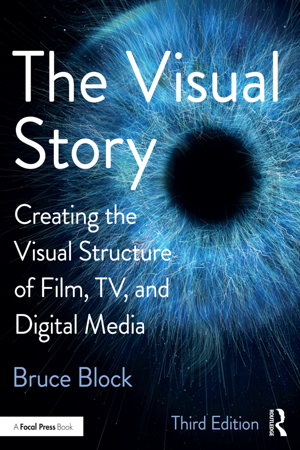

# This Visual Story

This updated edition of a best-selling classic shows you how to structure your visuals as carefully as a writer structures a story or composers structure their music. *The Visual Story* teaches you how to design and control the structure of your production using the basic visual components of space, line, shape, tone, color, movement, and rhythm. You can use these components to effectively convey moods and emotions, create a visual style, and utilize the important relationship between the visual and the story structures.

Using over 700 color illustrations, author Bruce Block explains how understanding the connection between story and visual structures will guide you in the selection of camera angles, lenses, actor staging, composition, set design and locations, lighting, storyboard planning, camera coverage, and editing.

*The Visual Story* is an ideal blend of theory and practice. The concepts and examples in this new edition will benefit students learning cinematic production, as well as professional writers, directors, cinematographers, art directors, animators, game designers, and anyone working in visual media who wants a better understanding of visual structure.

**Bruce Block** has worked in a creative capacity on dozens of feature films, television shows, commercials, and animated productions. His feature film producing credits include *Something’s Gotta Give, What Women Want, America’s Sweethearts, The Parent Trap*, and *Father of the Bride I* and *II*. He served as a creative consultant on *Spanglish, As Good As It Gets, Stuart Little*, and many other film and television productions. He is a tenured professor at the University of Southern California’s School of Cinematic Arts and holds the Sergei Eisenstein Endowed Chair in Cinematic Design. Mr. Block gives seminars at a variety of studios including Blue Sky Studios, Cartoon Network, Disney Feature and Television Animation, Dreamworks Animation, Industrial Light & Magic, Laika, LucasFilm, Nickelodeon Animation Studios, Pixar Animation Studios, and a wide range of European and American film schools including AFI and Cal Arts. Mr. Block also conducts seminars for digital game designers and companies including Activision-Blizzard, Blur Studio, Google, Hulu, and Tencent. He is a member of the Director’s Guild of America, the Art Director’s Guild, and co-author of the book *3D Storytelling* (Focal Press).

[www.bruceblock.com](http://www.bruceblock.com)

# The Visual Story

BRUCE BLOCK

THIRD EDITION

Creating the Visual Structure of Film, TV, and Digital Media

Third edition published 2021

by Routledge

52 Vanderbilt Avenue, New York, NY 10017

and by Routledge

2 Park Square, Milton Park, Abingdon, Oxon, OX14 4RN

Routledge is an imprint of the Taylor & Francis Group, an informa business

© 2021 Bruce Block

The right of Bruce Block to be identified as author of this work has been asserted by him in accordance with sections 77 and 78 of the Copyright, Designs and Patents Act 1988.

All rights reserved. No part of this book may be reprinted or reproduced or utilised in any form or by any electronic, mechanical, or other means, now known or hereafter invented, including photocopying and recording, or in any information storage or retrieval system, without permission in writing from the publishers.

Trademark notice: Product or corporate names may be trademarks or registered trademarks, and are used only for identification and explanation without intent to infringe.

First edition published by Focal Press 2001

Second edition published by Focal Press 2008

Library of Congress Cataloging-in-Publication Data

Names: Block, Bruce, author.

Title: The visual story : creating the visual structure of film, tv and

digital media / Bruce Block.

Description: Third edition. | London ; New York : Routledge, 2020. |

Includes bibliographical references and index.

Identifiers: LCCN 2020004571 (print) | LCCN 2020004572 (ebook)

| ISBN 9780367499693 (hardback) | ISBN 9781138014152

(paperback) | ISBN 9781315794839 (ebook)

Subjects: LCSH: Cinematography. | Video recording.

Classification: LCC TR850 .B514 2020 (print) | LCC TR850 (ebook) |

DDC 777–dc23

LC record available at [https://lccn.loc.gov/2020004571](https://lccn.loc.gov)

LC ebook record available at [https://lccn.loc.gov/2020004572](https://lccn.loc.gov)

ISBN: 978-0-367-49969-3 (hbk)

ISBN: 978-1-138-01415-2 (pbk)

ISBN: 978-1-315-79483-9 (ebk)

Typeset in ITC Novarese by Alex Lazarou

# CONTENTS

[*Acknowledgements*](acknowledgement.xhtml)

[*Introduction*](fm-Ch01.xhtml)

[**CHAPTER ONE**
THE BASIC VISUAL COMPONENTS](Ch01.xhtml#Ch01)

[**CHAPTER TWO**
CONTRAST & AFFINITY](Ch02.xhtml#Ch02)

[**CHAPTER THREE**](Ch03.xhtml#Ch03)

[SPACE: PART ONE](Ch03.xhtml#sec3_1)

[SPACE: PART TWO](Ch03.xhtml#sec3_2)

[**CHAPTER FOUR**
LINE & SHAPE](Ch04.xhtml#Ch04)

[**CHAPTER FIVE**
TONE](Ch05.xhtml#Ch05)

[**CHAPTER SIX**
COLOR](Ch06.xhtml#Ch06)

[**CHAPTER SEVEN**
MOVEMENT](Ch07.xhtml#Ch07)

[**CHAPTER EIGHT**
RHYTHM](Ch08.xhtml#Ch08)

[**CHAPTER NINE**
STORY & VISUAL STRUCTURES](Ch09.xhtml#Ch09)

[**CHAPTER TEN**
PRACTICE, NOT THEORY](Ch10.xhtml#Ch10)

[APPENDIX](app1.xhtml#app1)

[BIBLIOGRAPHY](bibliography.xhtml#r001001)

[*Illustration Credits*](sec0005.xhtml#sec0005)

[*Index*](index1.xhtml#sec0006)

1. [Cover](Cover.xhtml)
2. [Half Title](halftitle.xhtml#halftitle)
3. [Title Page](titlepage.xhtml)
4. [Copyright Page](copyright.xhtml)
5. [Contents](content.xhtml)
6. [Acknowledgements](acknowledgement.xhtml)
7. [Introduction](fm-Ch01.xhtml)
8. [Dedication Page](dedication.xhtml)
9. [Chapter One The Basic Visual Components](Ch01.xhtml#Ch01)
10. [Chapter Two Contrast & Affinity](Ch02.xhtml#Ch02)
11. [Chapter Three Space](Ch03.xhtml#Ch03)
    1. [Space: Part One](Ch03.xhtml#sec3_1)
    2. [Space: Part Two](Ch03.xhtml#sec3_2)
12. [Chapter Four Line & Shape](Ch04.xhtml#Ch04)
13. [Chapter Five Tone](Ch05.xhtml#Ch05)
14. [Chapter Six Color](Ch06.xhtml#Ch06)
15. [Chapter Seven Movement](Ch07.xhtml#Ch07)
16. [Chapter Eight Rhythm](Ch08.xhtml#Ch08)
17. [Chapter Nine Story & Visual Structures](Ch09.xhtml#Ch09)
18. [Chapter Ten Practice, Not Theory](Ch10.xhtml#Ch10)
19. [Appendix](app1.xhtml#app1)
20. [Bibliography](bibliography.xhtml#r001001)
21. [Illustration Credits](sec0005.xhtml#sec0005)
22. [Index](index1.xhtml#sec0006)

1. [i](halftitle.xhtml#pgi)
2. [ii](titlepage.xhtml#pgii)
3. [iii](titlepage.xhtml#pgiii)
4. [iv](copyright.xhtml#pgiv)
5. [v](content.xhtml#pgv)
6. [vi](acknowledgement.xhtml#pgvi)
7. [vii](fm-Ch01.xhtml#pgvii)
8. [viii](dedication.xhtml#pgviii)
9. [ix](dedication.xhtml#pgix)
10. [x](Ch01.xhtml#pgx)
11. [1](Ch01.xhtml#pg1)
12. [2](Ch01.xhtml#pg2)
13. [3](Ch01.xhtml#pg3)
14. [4](Ch01.xhtml#pg4)
15. [5](Ch01.xhtml#pg5)
16. [6](Ch01.xhtml#pg6)
17. [7](Ch01.xhtml#pg7)
18. [8](Ch01.xhtml#pg8)
19. [9](Ch01.xhtml#pg9)
20. [10](Ch02.xhtml#pg10)
21. [11](Ch02.xhtml#pg11)
22. [12](Ch02.xhtml#pg12)
23. [13](Ch02.xhtml#pg13)
24. [14](Ch02.xhtml#pg14)
25. [15](Ch03.xhtml#pg15)
26. [16](Ch03.xhtml#pg16)
27. [17](Ch03.xhtml#pg17)
28. [18](Ch03.xhtml#pg18)
29. [19](Ch03.xhtml#pg19)
30. [20](Ch03.xhtml#pg20)
31. [21](Ch03.xhtml#pg21)
32. [22](Ch03.xhtml#pg22)
33. [23](Ch03.xhtml#pg23)
34. [24](Ch03.xhtml#pg24)
35. [25](Ch03.xhtml#pg25)
36. [26](Ch03.xhtml#pg26)
37. [27](Ch03.xhtml#pg27)
38. [28](Ch03.xhtml#pg28)
39. [29](Ch03.xhtml#pg29)
40. [30](Ch03.xhtml#pg30)
41. [31](Ch03.xhtml#pg31)
42. [32](Ch03.xhtml#pg32)
43. [33](Ch03.xhtml#pg33)
44. [34](Ch03.xhtml#pg34)
45. [35](Ch03.xhtml#pg35)
46. [36](Ch03.xhtml#pg36)
47. [37](Ch03.xhtml#pg37)
48. [38](Ch03.xhtml#pg38)
49. [39](Ch03.xhtml#pg39)
50. [40](Ch03.xhtml#pg40)
51. [41](Ch03.xhtml#pg41)
52. [42](Ch03.xhtml#pg42)
53. [43](Ch03.xhtml#pg43)
54. [44](Ch03.xhtml#pg44)
55. [45](Ch03.xhtml#pg45)
56. [46](Ch03.xhtml#pg46)
57. [47](Ch03.xhtml#pg47)
58. [48](Ch03.xhtml#pg48)
59. [49](Ch03.xhtml#pg49)
60. [50](Ch03.xhtml#pg50)
61. [51](Ch03.xhtml#pg51)
62. [52](Ch03.xhtml#pg52)
63. [53](Ch03.xhtml#pg53)
64. [54](Ch03.xhtml#pg54)
65. [55](Ch03.xhtml#pg55)
66. [56](Ch03.xhtml#pg56)
67. [57](Ch03.xhtml#pg57)
68. [58](Ch03.xhtml#pg58)
69. [59](Ch03.xhtml#pg59)
70. [60](Ch03.xhtml#pg60)
71. [61](Ch03.xhtml#pg61)
72. [62](Ch03.xhtml#pg62)
73. [63](Ch03.xhtml#pg63)
74. [64](Ch03.xhtml#pg64)
75. [65](Ch03.xhtml#pg65)
76. [66](Ch03.xhtml#pg66)
77. [67](Ch03.xhtml#pg67)
78. [68](Ch03.xhtml#pg68)
79. [69](Ch03.xhtml#pg69)
80. [70](Ch03.xhtml#pg70)
81. [71](Ch03.xhtml#pg71)
82. [72](Ch03.xhtml#pg72)
83. [73](Ch03.xhtml#pg73)
84. [74](Ch03.xhtml#pg74)
85. [75](Ch03.xhtml#pg75)
86. [76](Ch03.xhtml#pg76)
87. [77](Ch03.xhtml#pg77)
88. [78](Ch03.xhtml#pg78)
89. [79](Ch03.xhtml#pg79)
90. [80](Ch03.xhtml#pg80)
91. [81](Ch03.xhtml#pg81)
92. [82](Ch03.xhtml#pg82)
93. [83](Ch03.xhtml#pg83)
94. [84](Ch03.xhtml#pg84)
95. [85](Ch03.xhtml#pg85)
96. [86](Ch03.xhtml#pg86)
97. [87](Ch03.xhtml#pg87)
98. [88](Ch03.xhtml#pg88)
99. [89](Ch03.xhtml#pg89)
100. [90](Ch03.xhtml#pg90)
101. [91](Ch03.xhtml#pg91)
102. [92](Ch03.xhtml#pg92)
103. [93](Ch03.xhtml#pg93)
104. [94](Ch03.xhtml#pg94)
105. [95](Ch03.xhtml#pg95)
106. [96](Ch04.xhtml#pg96)
107. [97](Ch04.xhtml#pg97)
108. [98](Ch04.xhtml#pg98)
109. [99](Ch04.xhtml#pg99)
110. [100](Ch04.xhtml#pg100)
111. [101](Ch04.xhtml#pg101)
112. [102](Ch04.xhtml#pg102)
113. [103](Ch04.xhtml#pg103)
114. [104](Ch04.xhtml#pg104)
115. [105](Ch04.xhtml#pg105)
116. [106](Ch04.xhtml#pg106)
117. [107](Ch04.xhtml#pg107)
118. [108](Ch04.xhtml#pg108)
119. [109](Ch04.xhtml#pg109)
120. [110](Ch04.xhtml#pg110)
121. [111](Ch04.xhtml#pg111)
122. [112](Ch04.xhtml#pg112)
123. [113](Ch04.xhtml#pg113)
124. [114](Ch04.xhtml#pg114)
125. [115](Ch04.xhtml#pg115)
126. [116](Ch04.xhtml#pg116)
127. [117](Ch04.xhtml#pg117)
128. [118](Ch04.xhtml#pg118)
129. [119](Ch04.xhtml#pg119)
130. [120](Ch04.xhtml#pg120)
131. [121](Ch04.xhtml#pg121)
132. [122](Ch04.xhtml#pg122)
133. [123](Ch04.xhtml#pg123)
134. [124](Ch04.xhtml#pg124)
135. [125](Ch04.xhtml#pg125)
136. [126](Ch04.xhtml#pg126)
137. [127](Ch05.xhtml#pg127)
138. [128](Ch05.xhtml#pg128)
139. [129](Ch05.xhtml#pg129)
140. [130](Ch05.xhtml#pg130)
141. [131](Ch05.xhtml#pg131)
142. [132](Ch05.xhtml#pg132)
143. [133](Ch05.xhtml#pg133)
144. [134](Ch05.xhtml#pg134)
145. [135](Ch05.xhtml#pg135)
146. [136](Ch05.xhtml#pg136)
147. [137](Ch05.xhtml#pg137)
148. [138](Ch05.xhtml#pg138)
149. [139](Ch05.xhtml#pg139)
150. [140](Ch05.xhtml#pg140)
151. [141](Ch05.xhtml#pg141)
152. [142](Ch05.xhtml#pg142)
153. [143](Ch05.xhtml#pg143)
154. [144](Ch05.xhtml#pg144)
155. [145](Ch06.xhtml#pg145)
156. [146](Ch06.xhtml#pg146)
157. [147](Ch06.xhtml#pg147)
158. [148](Ch06.xhtml#pg148)
159. [149](Ch06.xhtml#pg149)
160. [150](Ch06.xhtml#pg150)
161. [151](Ch06.xhtml#pg151)
162. [152](Ch06.xhtml#pg152)
163. [153](Ch06.xhtml#pg153)
164. [154](Ch06.xhtml#pg154)
165. [155](Ch06.xhtml#pg155)
166. [156](Ch06.xhtml#pg156)
167. [157](Ch06.xhtml#pg157)
168. [158](Ch06.xhtml#pg158)
169. [159](Ch06.xhtml#pg159)
170. [160](Ch06.xhtml#pg160)
171. [161](Ch06.xhtml#pg161)
172. [162](Ch06.xhtml#pg162)
173. [163](Ch06.xhtml#pg163)
174. [164](Ch06.xhtml#pg164)
175. [165](Ch06.xhtml#pg165)
176. [166](Ch06.xhtml#pg166)
177. [167](Ch06.xhtml#pg167)
178. [168](Ch06.xhtml#pg168)
179. [169](Ch06.xhtml#pg169)
180. [170](Ch06.xhtml#pg170)
181. [171](Ch06.xhtml#pg171)
182. [172](Ch06.xhtml#pg172)
183. [173](Ch06.xhtml#pg173)
184. [174](Ch06.xhtml#pg174)
185. [175](Ch06.xhtml#pg175)
186. [176](Ch06.xhtml#pg176)
187. [177](Ch06.xhtml#pg177)
188. [178](Ch06.xhtml#pg178)
189. [179](Ch06.xhtml#pg179)
190. [180](Ch06.xhtml#pg180)
191. [181](Ch06.xhtml#pg181)
192. [182](Ch06.xhtml#pg182)
193. [183](Ch06.xhtml#pg183)
194. [184](Ch06.xhtml#pg184)
195. [185](Ch06.xhtml#pg185)
196. [186](Ch06.xhtml#pg186)
197. [187](Ch06.xhtml#pg187)
198. [188](Ch06.xhtml#pg188)
199. [189](Ch06.xhtml#pg189)
200. [190](Ch06.xhtml#pg190)
201. [191](Ch06.xhtml#pg191)
202. [192](Ch07.xhtml#pg192)
203. [193](Ch07.xhtml#pg193)
204. [194](Ch07.xhtml#pg194)
205. [195](Ch07.xhtml#pg195)
206. [196](Ch07.xhtml#pg196)
207. [197](Ch07.xhtml#pg197)
208. [198](Ch07.xhtml#pg198)
209. [199](Ch07.xhtml#pg199)
210. [200](Ch07.xhtml#pg200)
211. [201](Ch07.xhtml#pg201)
212. [202](Ch07.xhtml#pg202)
213. [203](Ch07.xhtml#pg203)
214. [204](Ch07.xhtml#pg204)
215. [205](Ch07.xhtml#pg205)
216. [206](Ch07.xhtml#pg206)
217. [207](Ch07.xhtml#pg207)
218. [208](Ch07.xhtml#pg208)
219. [209](Ch07.xhtml#pg209)
220. [210](Ch07.xhtml#pg210)
221. [211](Ch07.xhtml#pg211)
222. [212](Ch07.xhtml#pg212)
223. [213](Ch07.xhtml#pg213)
224. [214](Ch07.xhtml#pg214)
225. [215](Ch07.xhtml#pg215)
226. [216](Ch07.xhtml#pg216)
227. [217](Ch07.xhtml#pg217)
228. [218](Ch07.xhtml#pg218)
229. [219](Ch07.xhtml#pg219)
230. [220](Ch07.xhtml#pg220)
231. [221](Ch07.xhtml#pg221)
232. [222](Ch08.xhtml#pg222)
233. [223](Ch08.xhtml#pg223)
234. [224](Ch08.xhtml#pg224)
235. [225](Ch08.xhtml#pg225)
236. [226](Ch08.xhtml#pg226)
237. [227](Ch08.xhtml#pg227)
238. [228](Ch08.xhtml#pg228)
239. [229](Ch08.xhtml#pg229)
240. [230](Ch08.xhtml#pg230)
241. [231](Ch08.xhtml#pg231)
242. [232](Ch08.xhtml#pg232)
243. [233](Ch08.xhtml#pg233)
244. [234](Ch08.xhtml#pg234)
245. [235](Ch08.xhtml#pg235)
246. [236](Ch08.xhtml#pg236)
247. [237](Ch08.xhtml#pg237)
248. [238](Ch08.xhtml#pg238)
249. [239](Ch08.xhtml#pg239)
250. [240](Ch08.xhtml#pg240)
251. [241](Ch08.xhtml#pg241)
252. [242](Ch08.xhtml#pg242)
253. [243](Ch08.xhtml#pg243)
254. [244](Ch09.xhtml#pg244)
255. [245](Ch09.xhtml#pg245)
256. [246](Ch09.xhtml#pg246)
257. [247](Ch09.xhtml#pg247)
258. [248](Ch09.xhtml#pg248)
259. [249](Ch09.xhtml#pg249)
260. [250](Ch09.xhtml#pg250)
261. [251](Ch09.xhtml#pg251)
262. [252](Ch09.xhtml#pg252)
263. [253](Ch09.xhtml#pg253)
264. [254](Ch09.xhtml#pg254)
265. [255](Ch09.xhtml#pg255)
266. [256](Ch09.xhtml#pg256)
267. [257](Ch09.xhtml#pg257)
268. [258](Ch09.xhtml#pg258)
269. [259](Ch09.xhtml#pg259)
270. [260](Ch09.xhtml#pg260)
271. [261](Ch09.xhtml#pg261)
272. [262](Ch09.xhtml#pg262)
273. [263](Ch09.xhtml#pg263)
274. [264](Ch09.xhtml#pg264)
275. [265](Ch09.xhtml#pg265)
276. [266](Ch09.xhtml#pg266)
277. [267](Ch09.xhtml#pg267)
278. [268](Ch09.xhtml#pg268)
279. [269](Ch09.xhtml#pg269)
280. [270](Ch09.xhtml#pg270)
281. [271](Ch09.xhtml#pg271)
282. [272](Ch09.xhtml#pg272)
283. [273](Ch09.xhtml#pg273)
284. [274](Ch09.xhtml#pg274)
285. [275](Ch09.xhtml#pg275)
286. [276](Ch09.xhtml#pg276)
287. [277](Ch09.xhtml#pg277)
288. [278](Ch09.xhtml#pg278)
289. [279](Ch09.xhtml#pg279)
290. [280](Ch09.xhtml#pg280)
291. [281](Ch09.xhtml#pg281)
292. [282](Ch09.xhtml#pg282)
293. [283](Ch09.xhtml#pg283)
294. [284](Ch09.xhtml#pg284)
295. [285](Ch09.xhtml#pg285)
296. [286](Ch09.xhtml#pg286)
297. [287](Ch09.xhtml#pg287)
298. [288](Ch10.xhtml#pg288)
299. [289](Ch10.xhtml#pg289)
300. [290](Ch10.xhtml#pg290)
301. [291](Ch10.xhtml#pg291)
302. [292](Ch10.xhtml#pg292)
303. [293](Ch10.xhtml#pg293)
304. [294](Ch10.xhtml#pg294)
305. [295](Ch10.xhtml#pg295)
306. [296](Ch10.xhtml#pg296)
307. [297](Ch10.xhtml#pg297)
308. [298](Ch10.xhtml#pg298)
309. [299](Ch10.xhtml#pg299)
310. [300](Ch10.xhtml#pg300)
311. [301](Ch10.xhtml#pg301)
312. [302](Ch10.xhtml#pg302)
313. [303](Ch10.xhtml#pg303)
314. [304](Ch10.xhtml#pg304)
315. [305](Ch10.xhtml#pg305)
316. [306](Ch10.xhtml#pg306)
317. [307](app1.xhtml#pg307)
318. [308](app1.xhtml#pg308)
319. [309](app1.xhtml#pg309)
320. [310](app1.xhtml#pg310)
321. [311](app1.xhtml#pg311)
322. [312](app1.xhtml#pg312)
323. [313](app1.xhtml#pg313)
324. [314](app1.xhtml#pg314)
325. [315](app1.xhtml#pg315)
326. [316](bibliography.xhtml#pg316)
327. [317](bibliography.xhtml#pg317)
328. [318](bibliography.xhtml#pg318)
329. [319](bibliography.xhtml#pg319)
330. [320](sec0005.xhtml#pg320)
331. [321](sec0005.xhtml#pg321)
332. [322](sec0005.xhtml#pg322)
333. [323](sec0005.xhtml#pg323)
334. [324](sec0005.xhtml#pg324)
335. [325](sec0005.xhtml#pg325)
336. [326](sec0005.xhtml#pg326)
337. [327](sec0005.xhtml#pg327)
338. [328](sec0005.xhtml#pg328)
339. [329](sec0005.xhtml#pg329)
340. [330](sec0005.xhtml#pg330)
341. [331](sec0005.xhtml#pg331)
342. [332](index1.xhtml#pg332)
343. [333](index1.xhtml#pg333)
344. [334](index1.xhtml#pg334)
345. [335](index1.xhtml#pg335)
346. [336](index1.xhtml#pg336)
347. [337](index1.xhtml#pg337)
348. [338](index1.xhtml#pg338)
349. [339](index1.xhtml#pg339)
350. [340](Back_Adv.xhtml#pg340)

## Guide

1. [Cover](Cover.xhtml)
2. [Half Title](halftitle.xhtml)
3. [Title Page](titlepage.xhtml)
4. [Copyright Page](copyright.xhtml)
5. [Contents](content.xhtml)
6. [Acknowledgements](acknowledgement.xhtml)
7. [Introduction](fm-Ch01.xhtml)
8. [Dedication Page](dedication.xhtml)
9. [Start of Content](Ch01.xhtml)
10. [Appendix](app1.xhtml)
11. [Bibliography](bibliography.xhtml)
12. [Illustration Credits](sec0005.xhtml)
13. [Index](index1.xhtml)

# [Acknowledgements](content.xhtml#bck_acknowledgement)

I want to thank my students at the University of Southern California’s School of Cinematic Arts and the thousands of other students and working professionals who have attended my seminars at universities, film academies, advertising and design companies, and motion picture studios throughout the world. This book has emerged because of our interaction.

No one finds his or her way alone. My teachers Word Baker, Lawrence Carra, Byron Friedman, Sulie and Pearl Harand, Dave Johnson, Bernard Kantor, Eileen Kneuven, Mordecai Lawner, William Nelson, Neil Newlon, Lester Novros, Woody Omens, Gene Peterson, Mel Sloan, Glenn Voltz, Jewell Walker, and Mort Zarkoff have inspired me and continue to do so. Thanks to Alan Mandel for the use of his script in the discussion of directorial beats and to Calder Block for his editorial skills.

The practical aspects of making pictures that I discuss in this book are the outgrowth of working with talented professionals on commercials, documentaries, digital games, animated and live-action television shows and feature films. The experiences we shared have been critical to the maturation of the ideas presented in this book. I am particularly grateful to Bill Fraker, Neal Israel, and Charles Shyer who helped give me my start in Hollywood.

Much encouragement and support has come from Chris Huntley, Richard Jewell, Jane Kagon, Ken Marschall, Billy Pittard, Adam Joyce Ramirez, Ronnie Rubin, my close friends Alan Dressler, Eric Sears, and my brother David Block.

A special thanks to Suzanne Dizon.

**Bruce A. Block**

Los Angeles, California 2020

# [INTRODUCTION](content.xhtml#bck_fm-Ch01)

In Russia, on an icy winter night in 1928, an eager group of film students waited in a poorly heated classroom at the Soviet GIK. The building, located on the Leningrad Chaussée, had once been the exclusive restaurant Yar, but was now the Russian Film Institute. Its main dining room with floor-to-ceiling mirrors and tall, white columns had become a lecture hall. The students had gathered to hear the filmmaker and teacher Sergei Eisenstein who, along with Vsevolod Pudovkin and Alexander Dovchenko, were among the first to develop formal theories about film’s visual structure.

Eisenstein’s ideas and filmmaking talents would take him all over the world. In 1933 he spoke at Hollywood’s Motion Picture Academy of Arts & Science and lectured at the University of Southern California. Eisenstein was only 50 when he died in 1948 in Russia. He never met Slavko Vorkapich, a Yugoslavian filmmaker, who was directing Hollywood montages at MGM, RKO, and Warner Bros. In the early 1950s Vorkapich briefly became chairman of the film department at USC. In his classes Vorkapich advanced Eisenstein’s filmic ideas and developed ground-breaking theories about movement and editing. Vorkapich, with his charming, humorous teaching style, introduced fundamental cinematic concepts to new generations of filmmakers. He lectured internationally until his death in 1976.

In 1955 Lester Novros, a Disney studio artist, began teaching a class at USC about the visual aspects of motion pictures. His class was based on fine art theories and the writings of Eisenstein and Vorkapich. I took over teaching the course. My goal was to bring the theories of cinematic structure into the present, make them practical, and link visual structure to story structure. I wanted to remove the gap between theory and practice so that visual structure would be easy to understand and use.

This book is the result of my professional experience in film and digital production, coupled with my teaching and research. What you’ll read in these pages can be used immediately in the preparation, production, and postproduction of theatrical motion pictures, television, streaming programs, digital media, documentaries, music videos, commercials, and digital games, be it live action, animated, or computer-generated. Whether you create images for a large, small, or tiny screen, the visual structure of your pictures is as important as the story you tell.

The concepts in this book will benefit writers, directors, photographers, production designers, art directors, storyboard artists, and editors who are constantly confronted by the same visual problems that have faced every picture maker. The students who sat in Eisenstein’s cold Russian classroom had the same basic goal as we do today: “To make a good picture.” This book will teach you how to achieve that goal.

This book is dedicated to my parents

Stanley and Helene Block

# [CHAPTER 1 The Basic Visual Components](content.xhtml#bck_Ch01)

## The Cast of Visual Characters

Everywhere we go, we’re confronted by pictures. We look at pictures in books, magazines, at museums, theatres, on television, computer screens, and personal devices. The pictures are different sizes, moving or still, in color or black and white—but they are all pictures.

Pictures usually communicate moods, emotions, or ideas to the viewer. We can call these pictures cinematic images. There are three ways that cinematic images communicate with an audience.

1. *Story*: The viewer becomes involved in the picture because it tells a story. The fundamental building blocks of story are plot, conflict, and character development.
2. *Sound*: The viewer becomes involved in the picture because of the sound. The fundamental building blocks of sound are dialogue, music, and sound effects.
3. *Visuals*: The viewer becomes involved in the picture because of the visuals. What are the building blocks of the visuals? Scenery? Actors? Costumes? No. These answers are too limited. The fundamental building blocks of visuals are the *basic visual components.*

## The Basic Visual Components

The seven basic visual components are *space, line, shape, tone, color, movement*, and *rhythm*.

These components are found in every moving or still picture we see. Actors, locations, scenery, costumes, and props are made of these visual components. A visual component communicates moods, emotions, and ideas, and, most importantly, creates the visual structure. This book discusses these basic visual components in relation to the cinematic story telling experience, although these components appear in any picture.

### SPACE

There are three ways to categorize visual *space*: First, the physical space in front of the camera; second, the space as it appears on a screen; and third, the size and shape of the screen itself.

### LINE & SHAPE

*Line* is the result of tonal contrast. Line’s visual partner is *shape* because all shapes appear to be constructed from lines. Line is an important visual component because it also contributes to the control of space, movement, and rhythm.

### TONE

*Tone* refers to the brightness of objects. Tone does not refer to the tone of a scene (sarcastic, excited, etc.), or audio tone (treble and bass). Tone, sometimes referred to as “value,” is an important factor in both black & white and color photography.

### COLOR

*Color*, a powerful visual component, is also the most misunderstood. This book will explain the complex component of color and make it simpler to use.

### MOVEMENT

*Movement* is the visual component that first attracts the audience’s attention. There are three ways to create movement. Objects create movement, the camera creates movement, and the audience’s point-of-attention creates movement as they watch the screen.

### RHYTHM

We’re most familiar with *rhythm* we can hear, but there’s also rhythm we can see. Rhythm is found in stationary (non-moving) objects, moving objects, and editing.

## Controlling the Visual Components

This book will explain visual structure and show you how to use it. The components of space, line, shape, tone, color, movement, and rhythm are your production’s visual cast members. You may be more familiar with the other cast called actors, but both casts are critical to creating great work. Once production begins, the visual component cast will appear on-camera with the actors in every shot. Both casts—the visual components and the actors—will communicate moods, emotions, and ideas to the audience. That’s why understanding and controlling the visual components is so important.

Whether it’s an actor, the story, the sound, or the visual components, audiences react emotionally to what they see and hear. Music can communicate moods or emotions. Alfred Hitchcock’s *Psycho* or Steven Spielberg’s *Jaws* demonstrate how well music generates fear in an audience. In *Psycho* it’s the screech of the violins, and in *Jaws* it’s the pounding notes of the bass that prompts the fear. In both cases, the filmmaker introduces the musical theme when the murderous character first appears and then, by repeating that theme, rekindles the audiences’ fear, tension, and horror.

The same communication can occur using a visual component. Certain visual components already have emotional characteristics associated with them, although most of these visual stereotypes are easily changed. “Red means danger” is a visual stereotype. In fact, any color can indicate danger or its opposite: safety. Although stereotypes effectively prove that visual components can communicate with an audience, the stereotype is not the only choice. Visual stereotypes can be derivative, dated, or inappropriate. Any visual component can communicate a wide range of emotions or ideas in new and interesting ways. The possibilities are only limited by the picture maker’s talent, imagination, and ability to control the components.

Can you decide not to control the visual components in your production? Yes, of course. Shooting in black & white eliminates color, but even a blank screen contains most of the components, so the screen is never empty. The picture maker who disregards the components is making an unfortunate mistake because the audience can’t ignore the visual components they see on screen. The components are always communicating moods, emotions, and ideas to the audience. Left uncontrolled, the visual components can inadvertently contradict the story telling, mislead the audience, or simply bore them.

Understanding the visual components opens the door to controlling the visual structure of your pictures. It’s the key to staging actors, choosing the lens and camera angle, location selection, art direction choices, and editorial decisions.

Remember, though, that any study, if blindly adhered to, can be misleading. It’s not the purpose of this book to leave you with a set of rigid textbook definitions. If visual structure were that predictable a computer algorithm could produce perfect pictures. Visual structure isn’t math. Fortunately, there are some concepts, guidelines, and even some rules that will help you solve the problems of producing great images. The key is understanding the visual components.

In this book each visual component will be explained and illustrated. Most importantly the process for assigning moods, emotions, ideas, and meanings to the components will be discussed. The purpose of this book is to enable you to control visual structure and use it to support the story you want to tell.

## Terms

This book introduces some new terminology and ideas. Here are a few terms that need defining now:

### THE REAL WORLD & THE SCREEN WORLD

The *real world* is the environment in which we live. It’s the three-dimensional place we inhabit every day.

The *screen world* refers to the two-dimensional screens where we watch pictures. It’s the high-tech picture world we create with cameras and computers, and the lowtech picture world we create with pencils and brushes. This includes movie screens, television and computer screens, screens on hand-held devices, screens inside headsets, the canvases hanging in museums, and the pages in books and magazines that display photographs and drawings. All of these two-dimensional surfaces are part of the screen world.

### THE PICTURE PLANE

The *picture plane* is the two-dimensional surface where our pictures exist. The picture plane is usually surrounded by a “window.”

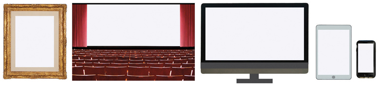

In an art museum, the picture plane’s window is the actual frame. In a movie theatre, curtains frame the two-dimensional picture plane. On a television, computer or hand-held device, the picture plane is framed by the plastic edges of the screen.

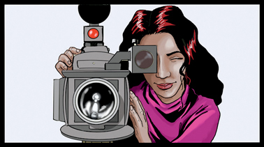
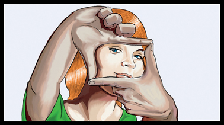

When we compose a shot using a camera’s viewfinder or use our hands, we look through a picture plane.

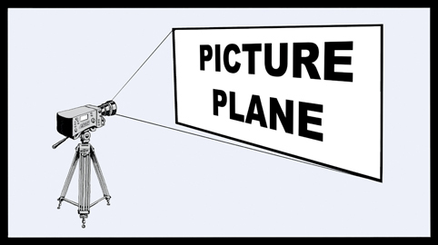

There is also a picture plane that exists as an imaginary window in front of the camera. The size of the picture plane depends on the lens and the distance of the scene from the camera. The picture plane is the two-dimensional window within which all of our images exist.

### FOREGROUND, MIDGROUND, & BACKGROUND

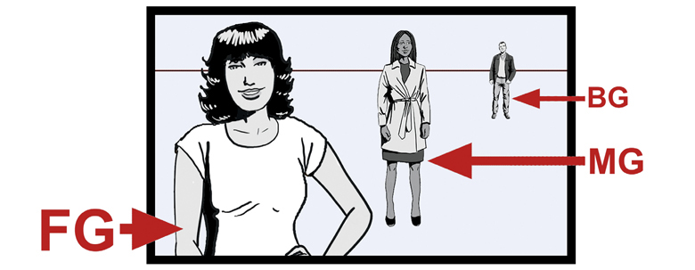

This book will use the term *foreground* abbreviated as FG (objects close to the camera), *midground* or MG (objects that are farther away from the camera), and *background* or BG (objects that are farthest away).

### VISUAL PROGRESSION

The exploration of structure often leads to discussions about progressions. A progression begins as one thing and changes to something else. For example, a story begins with one simple situation and, as the story progresses, becomes more complex. Music can also make a progression from slow to fast, or from one melody to another. There are also visual progressions.

This visual progression begins with the simplest object we can place on a screen: *a point*.

The point can be pulled across the screen creating a *line*. The line is visually more complicated than the point.

The line is pulled down and creates a *plane*.

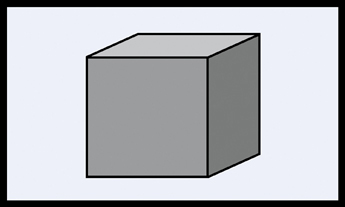

If the plane is expanded, the most complicated level of this visual progression is created: a *volume*.

This is a visual progression. From a simple point, to a line, to a plane, to a complex volume. Visual structure can use progressions in the same way that a story progresses and develops from beginning to end. The visual progression’s path should support and enhance the story’s progression.

## Practice, Not Theory

Right now you might be thinking that this book has made a sudden turn off the path of practicality. The introduction promised to help you create good pictures. So what’s all this “point, line, plane” stuff? Why is everything sounding more like aesthetic theory and less like filmmaking?

Wait. Don’t let these terms disillusion you. Learning about visual structure won’t force you into over-thinking your ideas or killing your creative instincts. Understanding visual structure is actually going to make your ideas work better and give you a language to communicate with your collaborators.

Good picture making has always used progressions. Watch any Fred Astaire or Busby Berkeley musical or a great music video and you’ll see visual progressions as the musical numbers increase in intensity. Watch the visual progression as the plane attacks in the crop duster sequence from Alfred Hitchcock’s *North by Northwest*.

Look at the progressive build of intensity in Francis Ford Coppola’s *The Godfather I and II* as Michael Corleone reluctantly takes control of the family business. Carefully planned visual progressions make the action sequences in *The Incredibles* build in intensity.

Watch Martin Scorsese’s *Raging Bull*. You’ll see that each boxing sequence is part of a progression that moves from simple to complex and builds in story, sound, and visual intensity. In fact, every Scorsese film is structured around visual progressions that support the intensifying story. Take a look at Kathryn Bigelow’s *The Hurt Locker* or Edgar Wright’s *Baby Driver* and see how they use progressions and visual structure to tell their stories.

Automobile commercials can make a vehicle appear faster than the competition because the visual progressions are working. Visual progressions make advanced levels in digital games more challenging and exciting. If you know what to look for, good story telling and visual progressions always work together.

Progressions are fundamental to story or musical structure, and they’re fundamental to visual structure. Visual structure is controlled using the basic visual components, and once these building blocks are explained we’ll explore the critical link between the visuals and the story.

The first step is to define our cast of characters called “the visual components.” It’s a cast that we’re stuck with, but they’re an incredibly talented group. In fact, these seven visual cast members are capable of playing any part, any mood, any emotion, and they’re great on a small screen or the big screen in live-action or animation. They’re the most sought-after (and least understood) players around.

Space, line, shape, tone, color, movement, and rhythm. Many picture makers don’t even know what the visual components are, yet they’ve appeared in every film, television show, theatre performance, digital game, photograph, and drawing ever made. The visual components don’t have lawyers or managers, work for free, receive no residuals, and never arrive late. What better cast could you ask for?

Using the basic visual components requires an understanding of a key principle upon which all structure is based. This extraordinary concept is the *Principle of Contrast & Affinity*, which is discussed in the next chapter.

# [CHAPTER 2 Contrast & Affinity](content.xhtml#bck_Ch02)

## The Key to Visual Structure

Visual structure uses the *Principle of Contrast & Affinity*. This principle can be applied to all seven basic visual components. But before the principle can be explained, the terms “contrast” and “affinity” must be defined.

What is *contrast*? Contrast means difference.

Contrast can be explained using tone, which is one of the seven basic visual components. Tone refers to brightness, so the gray scale is an excellent way to organize the tonal range and illustrate contrast of tone. Maximum contrast of tone means two shades of gray that are extremely different in terms of brightness.

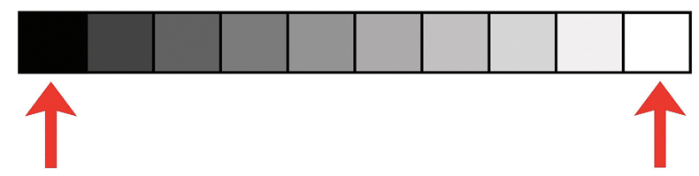

The two gray tones with maximum contrast are black and white.

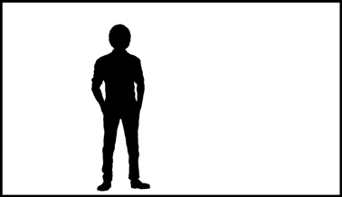

This picture is an example of maximum contrast of tone. The picture only uses jet black and bright white tones. There aren’t any middle grays in the shot.

What is affinity? Affinity means similarity.

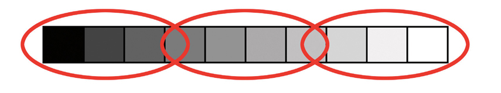

On the gray scale, any group of similar gray tones has affinity. This gray scale has been divided into three brightness ranges: dark, medium, and bright. A picture illustrating affinity of tone uses only one small portion of the gray scale.

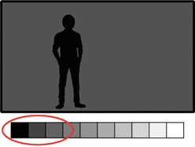
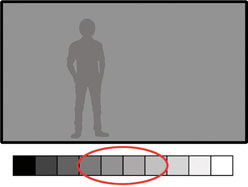
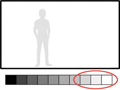

Each of these three shots is an example of tonal affinity. One shot uses only dark grays, another only the middle grays, and the third only bright grays.

Now we can define the Principle of Contrast & Affinity.

The Principle of Contrast & Affinity states:

* **The greater the contrast in a visual component, the more the visual intensity of the picture *increases*.**
* **The greater the affinity in a visual component, the more the visual intensity of the picture *decreases*.**

More simply stated:

* **Contrast = Greater Visual Intensity**
* **Affinity = Less Visual Intensity**

What does “visual intensity” mean? A high-speed roller coaster ride is intense; a sleeping kitten is not intense. A wild action sequence in a great movie is intense; a calm ocean shore on a mild, overcast day is not. A computer game can be exciting or dull. A television commercial can be agitating or soothing. A documentary can be alarming or reassuring. These emotional reactions are based on the intensity or dynamic of the audience’s experience as they see a movie, watch a video, read a book, or ride a roller coaster. The audience’s reaction can be emotional (they cry, laugh, or scream), and physical (their heart rate increases or they fall asleep). Usually the more intense the visual stimulus, the more intense the audience’s reaction.

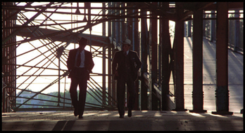
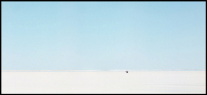

The Principle of Contrast & Affinity can be demonstrated with a pair of photos. Without knowing the story or characters, which one of these pictures is more intense based solely on its visual structure? The photo on the left is visually intense because it uses contrast of line, shape, and rhythm. The photo on the right, with only one, faint line, has visual affinity and lacks intensity. The two pictures are visual opposites.

The Principle of Contrast & Affinity can be used within a shot, from shot to shot, or from sequence to sequence. Once the basic visual components and the Principle of Contrast & Affinity are understood, using visual structure to tell a story becomes possible.

Good writers carefully chose and structure their words to communicate dramatic intensity to the audience. For the same reason good composers carefully structure their music. A director, cinematographer, production designer, or editor can create a visual structure that communicates dramatic intensity by applying the Principle of Contrast & Affinity to the seven basic visual components.

The next six chapters define the basic visual components. It is critical to understand how to see the components, control them in practical production, and, most importantly, use them to create a visual structure that supports the story.

# [CHAPTER 3 Space](content.xhtml#bck_Ch03)

Space is a complex visual component. Defining space is the first step in understanding how to control visual structure. Space not only defines the screen where the other six visual components are seen, but space itself can make important contributions to the overall visual structure of your production. This chapter is divided into two parts. [Part One](#sec3_1) defines the four basic types of space: deep, flat, limited, and ambiguous. [Part Two](#sec3_2) discusses aspect ratio, surface divisions, and open and closed space.

## [**PART ONE**](content.xhtml#bck_sec3_1)

It’s important for picture makers to understand the choices they have in controlling the visual components. For example, we have choices when picking colors. Different colors will communicate different moods and emotions to the audience. How we light a scene involves a variety of choices about tone and brightness. Visual space has its own variety of choices that will communicate different moods, emotions, and ideas to the audience. Understanding space affects the staging of actors, decisions about camera angle and lenses, the lighting, the locations, and the set design. The more a filmmaker knows about the types of visual space, the easier it is to make the best choices for a production.

### Deep Space

The real world where we live is three-dimensional, having height, width, and depth. But the screen world is only two-dimensional. Movie, television, and computer screens are flat surfaces that have height and width but, practically speaking, have no actual depth. The challenge is to portray our three-dimensional world on a two-dimensional screen surface and have the result look convincingly three-dimensional.

*Deep space* is the illusion of depth on a two-dimensional screen surface.

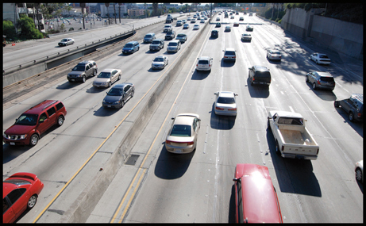

This photograph could be described as a busy freeway that extends from the foreground (FG) into the depth of the distant background (BG). This description seems correct, but it’s completely wrong. The photograph is presented on a page in a book or on a digital screen, both of which are two-dimensional surfaces. But something about this picture convinces us that we’re seeing depth. This picture appears deep because it uses the *depth cues*.

#### THE DEPTH CUES

Depth cues create the illusion of three-dimensional depth on a two-dimensional surface.

##### **1.** **Convergence**

The most effective depth cue is *convergence*.

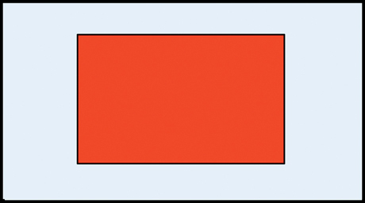

Here’s the two-dimensional plane that was introduced in [Chapter One](Ch01.xhtml). When discussing space we’ll call this a *frontal plane*. The plane’s horizontal top and bottom lines are parallel and its vertical left and right side lines are also parallel. The frontal plane lacks depth. It appears as flat as the surface of this page or a screen.

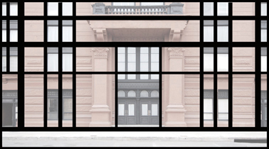

This building is also a frontal plane. The building’s horizontal lines are parallel and its vertical lines are parallel. For visual space purposes, this building lacks depth.

The depth cue of convergence can be activated by changing the camera angle.

**One-point convergence**:

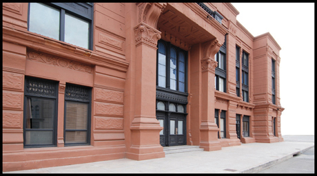

From a different camera angle, the building’s horizontal lines are no longer parallel.

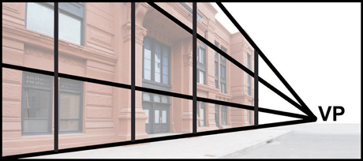

The building’s horizontal lines now appear to *converge*, or meet, at a single point called a *vanishing point*, or VP.

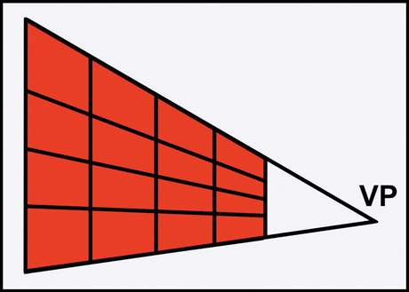

The building is no longer a frontal plane. It is now a *longitudinal plane*. Convergence, which creates and defines the longitudinal plane, is the most important depth cue in creating the illusion of depth on a two-dimensional surface.

**Two-point convergence**: Additional converging lines and vanishing points can enhance the depth cue and the illusion of depth.

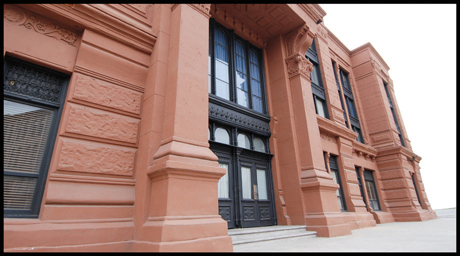

Changing the height of the camera can add more convergence. In this example the camera has been lowered.

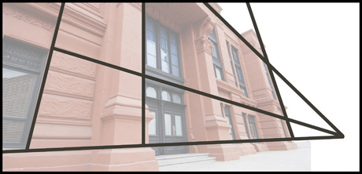

There are now two sets of converging lines.

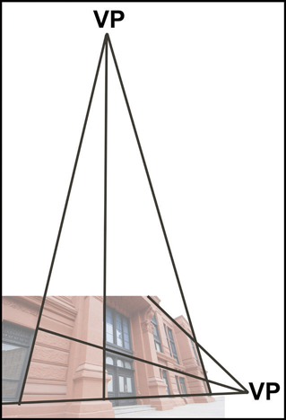
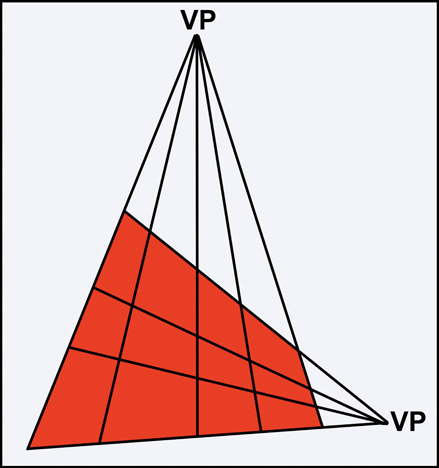

The longitudinal plane’s horizontal lines converge to a vanishing point located to the right of the frame. The vertical lines of the longitudinal plane converge to a second vanishing point located above the frame. If the camera position is raised instead of lowered, the vertical sides of the longitudinal plane will converge below the frame.

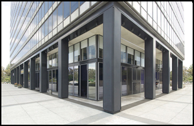
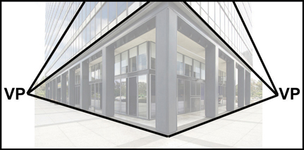

Two-point convergence can also be created using two longitudinal planes.

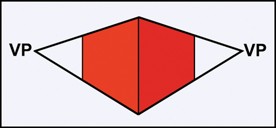

The horizontal lines of each longitudinal plane converge to separate vanishing points.

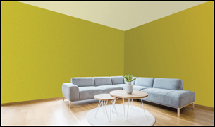
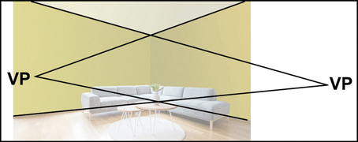

Inverting the two longitudinal planes also creates two-point convergence. This occurs when looking into the corner of a room, for example.

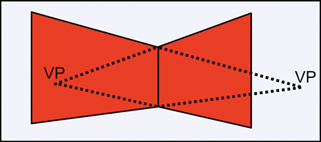

Because the vanishing points may be hidden behind the longitudinal planes, the converging lines aren’t as visible and the illusion of depth may be reduced or go unnoticed.

**Three-point convergence**: A third set of converging lines can further enhance the illusion of depth.

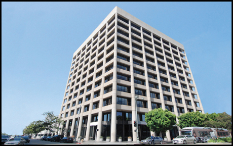

This building’s lines converge to one of three vanishing points.

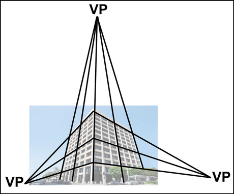

One vanishing point appears above the building. The second and third vanishing points are to the building’s left and right.

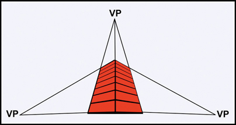
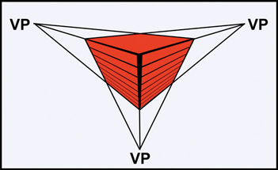

Three sets of converging lines can be created by a low camera angle looking up or a high camera angle looking down.

Convergence, longitudinal planes, and perspective can be applied to any object, including actors.

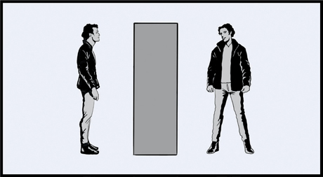

When the camera is at eye level, an actor is like a flat, frontal plane.

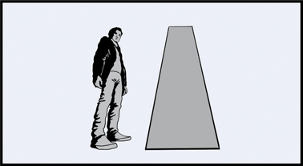
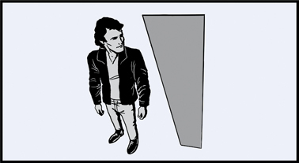

When the camera is lowered and tilted up, the actor becomes a longitudinal plane. This also occurs when the camera is raised and tilted down at the actor.

Convergence and on-screen vanishing points attract the audience’s attention.

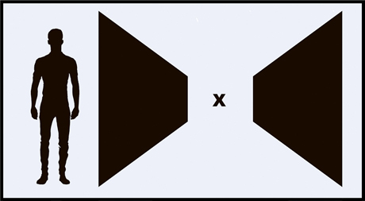

In this illustration, the audience’s attention is drawn to the actor, but also to the vanishing point (indicated by the X) between the two longitudinal planes.

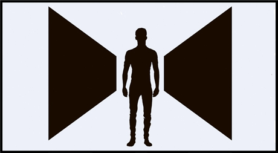

When the subject is positioned at the vanishing point, it can direct and keep the audience’s attention on the subject.

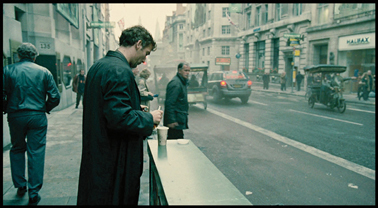
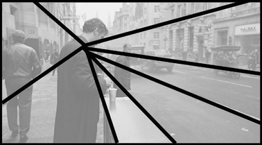
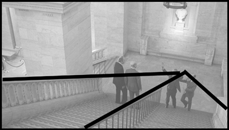
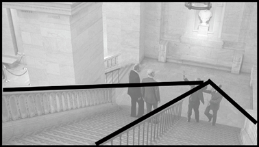

Should the subject always be located on the vanishing point? Absolutely not. But as these two examples reveal, it’s important to know that on-screen vanishing points will attract the audience’s attention and can be used to control where the audience is looking.

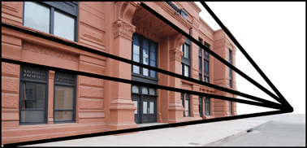
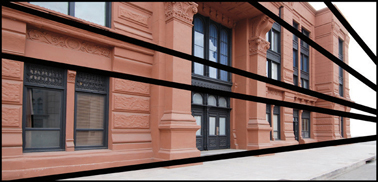

The audience’s attention will be drawn to an on-camera vanishing point. As a vanishing point moves out of frame, its ability to attract the audience’s attention decreases or becomes ineffective.

All things being equal, the more vanishing points the greater the illusion of depth. One-point convergence can look deep. Two-point convergence can appear deeper, and three-point convergence can look deepest. It’s possible to have more than three vanishing points in a picture. Four, five, ten, or more vanishing points are possible in a single shot. But an audience generally won’t notice more than three vanishing points. This limitation is an advantage for the picture maker because it means there are only three levels of illusory depth possible when using the depth cue of convergence.

Remember that no matter how many vanishing points are added, there isn’t any real depth. The photographs used here to illustrate deep space exist on a flat, two-dimensional surface. All of the depth is an illusion.

##### **2.** **Size Change**

The second most important depth cue is *size change*. As an object of known size gets smaller, it seems farther away. As an object of known size gets larger, it appears closer.

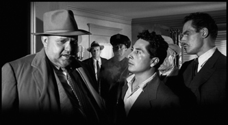
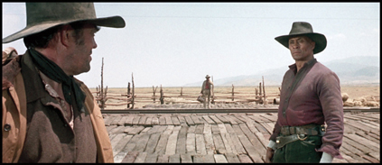

These shots appear to have depth because the actors are staged at different distances from the camera. Using actors, this depth cue is sometimes called “staging in depth.” Staging objects in the FG, MG, and BG increases their size difference and enhances the illusion of depth.

##### **3.** **Textural Diffusion**

Depth created by differences in detail is called *textural diffusion*. This is the third most important depth cue. Objects with more texture and detail seem closer. Objects with less textural detail seem farther away.

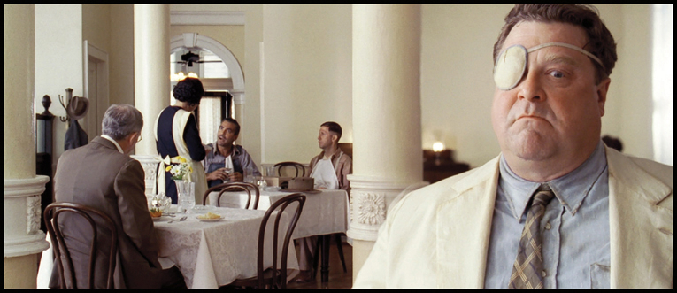

The detailed texture in the FG actor’s costume and face makes him appear closer to the camera when compared to the BG actors. This picture also uses the depth cue of size change.

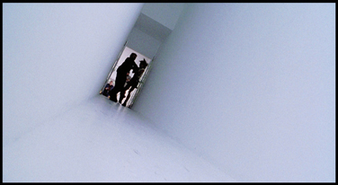

The walls in the white hallway lack texture and detail. Even though the walls are longitudinal surfaces, the absence of depth cues, especially textural diffusion and convergence, keeps the hallway from looking deep. The dark, wallpapered hallway shot on the right has many depth cues including textural diffusion. The wallpapered hallway has more apparent depth because the changes in textural detail make the walls appear closer and farther from the viewer.

The spectators in the FG of this shot have individual textures and details. The BG spectators are reduced to tiny dots and lack individual textural detail.

##### **4.** **Movement**

The illusion of depth can be enhanced using *object movement* and *camera movement*.

##### **4A.** **Object Movement**

Before we define movement in the screen world, let’s first define real world movement. Object movement in the real world is anything in front of the camera that moves: a person, an animal, a car, a drifting cloud, a beam of light are examples of moving objects.

In the real world, there are two basic directions that an object can move in front of the camera—*perpendicular* or *parallel* to the picture plane.

**Object movement perpendicular to the picture plane**:

The picture plane is the two-dimensional window that frames our pictures.

Illusory depth is created when an object moves perpendicular to the picture plane. Movement perpendicular to the picture plane is toward or away from the camera.

As an object moves at a constant rate of speed toward the camera, the object appears to speed up. Conversely, as an object moves away from the camera, it appears to slow down. This apparent speed change is the depth cue. Object movement perpendicular to the picture plane also activates the depth cues of size change and textural diffusion.

**Object movement parallel to the picture plane**:

Objects can also move parallel to the picture plane—horizontal (left-right), vertical (up-down), or diagonal. The movement can be in a straight line or in a circular direction.

A single object moving parallel to the picture plane in any direction does not create depth.

However, depth can be created when two or more objects, at different distances from the camera, move parallel to the picture plane. This creates the depth cue called *relative movement*. Relative movement is the apparent speed difference between objects moving in the FG, MG, and BG.

This example of relative movement shows three track runners (one each in the FG, MG, and BG) at a starting line. All three will begin running at the same time. Even though they actually travel the same distance and move at the same speed, the FG runner will appear to move fastest, the MG runner will seem to move slower, and the BG runner slowest.

Adding a vanishing point and converging lines reveals the apparent speed and distance differences between the FG, MG, and BG runners that creates the relative movement. With relative movement, the FG always moves fastest and the BG moves slowest.

##### **4B. Camera Movement**

There are three camera moves that create *relative movement* and contribute to the illusion of depth. These moves are the *dolly in/out*, the *track left/right*, and the *crane up/down*. It doesn’t matter how the camera is being moved (by dolly, car, aircraft, mechanical rigs, or hand-held); the same depth cue applies.

A *dolly in/out* moves the camera closer or farther from a subject. The dolly activates the depth cue of relative movement.

In this example, the camera uses a wide-angle lens. As the camera dollies in, the FG actor gets larger faster than the two actors in the BG. The relative movement is due to the different distances of the FG and BG actors from the camera.

These diagrams explain why the relative movement occurs. The camera begins 5 feet from the FG actor and 100 feet from the BG actors.

The camera dollies forward 3 feet. Now the camera is only 2 feet from the FG actor creating a medium close-up. The BG actors began 100 feet away and ended 97 feet from the camera (only 3% closer), so the BG actors’ size change is minimal and may even go unnoticed. The radical size change in the FG actor and the very minor size change in the BG actors create relative movement. When the camera dollies away from the subject, the same relative movement is created. The FG actor quickly decreases in size and the BG actors barely change size at all.

Relative movement can also be created when the camera moves laterally left and right, often called a *tracking shot*.

This shot uses a FG actor and two BG actors. The camera tracks from left to right.

A ground plan map diagrams the camera movement. As the camera moves from left to right, the FG actor moves faster and farther than the two BG actors. An audience interprets the relative movement between the FG and the BG as depth.

The third camera move that creates relative movement is a *crane shot*. The camera is raised or lowered, usually on a mechanical arm.

As the camera cranes up, the FG actor moves quickly toward the bottom of the frame. The BG actors move less distance and more slowly.

The difference in speed and distance traveled between the FG and BG objects creates the relative movement.

##### **5.** **Aerial Diffusion**

The depth cue of *aerial diffusion* depends on particles in the air. These particles can be fog, rain, smog, snow, smoke, dust, or anything suspended in the air that obscures the view of the distance.

Aerial diffusion causes three visual changes that create the illusion of depth. First, it causes a premature loss of detail and texture. Second, it condenses the picture’s tonal range. And third, aerial diffusion changes the color of the picture to the color of the aerial diffusion itself.

Here’s a photo example taken on an extremely clear day without aerial diffusion. All of the buildings’ details, individual textures, and colors are easy to see and differentiate.

On another day, the same scene has aerial diffusion (falling snow) which increases the apparent depth of the shot. The textural details in the BG buildings have been eradicated so the buildings seem farther away. The aerial diffusion has also condensed the picture’s darkest and lightest tones into the middle range of the gray scale. Additionally, most of the buildings’ color has been replaced with the color of off-white snow.

In this interior scene, the aerial diffusion is smoke. Notice how the FG actor on the right has the most textural detail and tonal contrast. The MG actor has less detail and lower tonal contrast. The two BG actors lack texture and tonal contrast due to the thick aerial diffusion. Adding a thin layer of smoke to interior scenes makes the space appear larger because the aerial diffusion activates a depth cue that usually does not occur indoors.

The loss of textural detail due to aerial diffusion seems similar to the depth cue of textural diffusion, but there is a difference. Textural diffusion relies on actual distance from the camera to produce a loss in detail. Aerial diffusion does not rely on actual distance but rather on particles in the air, which prematurely obscure textural detail and create the illusion that the affected area is farther away.

##### **6.** **Tonal Separation**

Tone refers to the gray scale. The gray scale is a series of tonal steps from black to white.

*Tonal separation* deals with a viewer’s perception of depth based on the brightness of objects. Usually, brighter objects appear closer and darker objects farther away.

Even with two objects of identical size, a viewer usually sees the brighter object as closer and the darker object as farther away.

##### **7.** **Color Separation**

Colors can be used as a depth cue. *Color separation* deals with the perception of depth based on warm and cool colors. The warm colors are red, orange, and yellow and the cool colors are blue and green. Warm colors usually appear closer and cool colors seem farther away. [Chapter Six](Ch06.xhtml) elaborates on the warm/cool classification and explains the complexities of color more fully.

The red rectangle seems closer and the blue rectangle appears farther away, even though both are the same brightness and size.

##### **8.** **Up/Down Position**

The *up/down position* uses an object’s vertical location in relation to the horizon line to create depth. When positioning objects based below the horizon line, objects lower in the frame seem closer and objects higher in the frame appear farther away.

These squares have their bases below the horizon line. In the left picture both squares appear to be the same distance from the camera even though one square is smaller. In the picture on the right, the small square higher in the frame seems farther away.

This depth cue reverses when objects are based above the horizon line. Objects higher in the frame seem closer and objects lower in the frame seem farther away.

The up/down position depth cue can be summarized as: objects based closer to the horizon line seem farther away and objects based farther from the horizon appear nearer.

These photos illustrate how an object’s base position above and below the horizon line affects the apparent depth.

##### **9.** **Shape Change**

As an object appears to *change shape*, it becomes a cue to illusory depth. Shape change can occur on moving or non-moving objects. To find the basic shape of any object, reduce it to a silhouette.

From table height, a cup’s silhouette is a rectangular shape. But the silhouette can change radically if the cup is turned in three-dimensional space or if the camera moves its position.

Now the cup’s shape is a circle. The shape change from a rectangle to a circle can only occur if the object moves in three-dimensions, which is the depth cue.

As a car turns, its shape or silhouette makes a radical change. This shape change on a two-dimensional screen surface creates the illusion of depth.

Shape change can also occur without any camera or object movement. This picture of a building appears deep because it has convergence, size change (the windows get smaller), and because the windows change shape. Every window in this building is actually the same size and shape, but the lower windows appear as tall rectangles, and the upper windows appear more square.

##### **10.** **Overlap**

*Overlap* is a minor depth cue, so it’s the last cue on the list.

In the left diagram, the circle appears closer because it partially covers the square. The space is less deep on the right diagram because the circle and square are side by side, eliminating the overlap. The effectiveness of overlap depends on the contribution of the other depth cues.

If overlap is combined with the depth cues of tonal separation, color separation, size change, and up/down position the illusion of depth increases.

The camera angle and actor placement creates overlap. This adds an additional layer of depth to the shot.

##### **11.** **Focus**

*Focus* refers to the sharpness of objects in a picture.

Depth cues are visually effective when they are in focus. As a depth cue becomes blurred, it loses its ability to create illusory depth. A blurry BG may separate itself from an in-focus FG, but the result is not necessarily deep space.

This picture from *Sideways* uses many depth cues. The BG has convergence, size change, textural diffusion, and up/down position. But none of those depth cues create any useful visual depth because they’re out of focus.

##### **12.** **3-D Pictures**

The first stereoscopic pictures, drawings actually, appeared in the early 1830s. The first 3-D movie was shown in 1915, and since then producers and exhibitors have used 3-D with a variety of viewing techniques. When properly presented, 3-D creates a remarkable illusion of depth.

*3-D pictures* and movies work best when used in conjunction with the traditional deep space depth cues. Without these depth cues, the 3-D experience can be unsatisfying. Our real world reliance on the depth cues is so strong that when they’re removed, the sense of deep space is diminished, even in a 3-D movie.

Here are two 3-D photos that demonstrate the importance of the traditional depth cues. To view the photos properly you’ll need a pair of anaglyph 3-D glasses with one red lens and one blue lens. Both photos have the identical amount of 3-D depth. But the photo of the grocery store aisle looks much deeper because it exploits the traditional depth cues.

### Flat Space

*Flat space* is the visual opposite of deep space. Flat space emphasizes the actual two-dimensionality of the screen surface.

#### THE FLAT CUES

Just as there are depth cues, flat space has its own set of cues. In creating flat space, the depth cues should be eliminated and replaced with flat space cues.

##### **1.** **Frontal Planes**

The most effective flat space cue is the *frontal plane*.

Here is the frontal plane that was introduced earlier in this chapter. Perspective, converging lines, longitudinal planes, and vanishing points have been eliminated.

From the correct camera angle, this building becomes a flat, frontal plane. The building’s horizontal lines remain parallel and its vertical lines remain parallel. Each of its doors and windows are frontal planes that emphasize the two-dimensionality of the screen surface.

Both of these flat space shots eliminate longitudinal surfaces and emphasize frontal, two-dimensional surfaces.

##### **2.** **Size Consistency**

Keeping similarly sized objects the *same size* will emphasize the flatness or two-dimensionality of the screen.

In each example the people are the same size. The single frontal plane created by the actors, architecture, and camera angle emphasizes the flat, two-dimensional screen surface.

##### **3.** **Textural Diffusion**

A flatter space is created when all objects have the same amount of *textural detail*. Manipulating textures on actors or other subjects can be impractical in live-action photography. This flat space cue is an interesting idea, but actually controlling individual textures is not always possible.

The overall texture in the shot is similar throughout which helps to maintain flat space. This shot also uses the flat space cues of size constancy and a frontal surface created by the arrangement of the construction workers and their vehicle.

##### **4.** **Movement**

Both *object movement* and *camera movement* can be used to create flat space.

##### **4A.** **Object Movement**

As mentioned earlier, the picture plane is the two-dimensional window that frames our pictures. Objects moving parallel to the picture plane emphasize flat space.

Movement parallel to the picture plane can be horizontal (left-right), vertical (up-down), diagonal, or in a straight line or a circular direction.

The moving objects must remain on one plane to avoid creating the depth cue of relative movement.

This line of people, all moving on the same plane and parallel to the picture plane, maintains flat space.

When creating flat space, movement perpendicular to the picture plane (toward or away from the camera) should be avoided because it activates too many depth cues. However, there is one exception to this rule. It is possible to maintain flat space when an object moves perpendicular to the picture plane, but there are restrictions on the lens and the distance of the object from the camera.

In this first example, the camera uses a wide-angle lens. An actor, in a full shot, begins 30 feet from the camera and runs directly at the lens. As the actor moves, the depth cues of size, textural detail, and speed change are activated to create deep space.

This second example uses a telephoto lens. The actor begins the shot with the same image size as the wide-angle shot. Due to the telephoto lens, the actor must be positioned much farther away from the camera. Again, the actor runs 30 feet directly at the lens. But this time the space appears flat because the depth cues are not activated. There won’t be any noticeable size, texture, or speed changes because the actor remains so far away from the camera. This choice of lens and the subject’s greater distance from the camera can create flat space.

This shot uses a wide-angle lens. A car moves perpendicular to the picture plane. As the car drives away it adds depth because the movement activates the depth cues of size change, textural diffusion, and speed change.

This shot uses a telephoto lens. The actors walk perpendicular to the picture plane towards the camera. The space remains flat because none of the depth cues are activated. The distance of the actors from the camera is so great that they barely change size, gain detail, or increase in speed as they move towards the camera.

##### **4B.** **Camera Movement**

A camera’s *pan, tilt*, and *zoom* can emphasize flat space because these moves do not add the depth cue of relative movement.

Panning means rotating the camera to the left or right on its horizontal axis. Tilting rotates the camera on a vertical axis. When the camera pans or tilts, all objects in the shot maintain their relative positions to one another. There is little or no discernable relative movement.

A zoom is not really a camera move, but it is the flat space equivalent of the deep space dolly in/out. Many cinematographers and directors dislike the zoom. Often the zoom is dismissed as a quick, unattractive imitation of a dolly shot. It’s true that a zoom takes less time to prepare than a dolly, but the difference is not just practical or economical. The visual difference is the type of space that the dolly or zoom creates.

A dolly move creates the depth cue of relative movement. The zoom eliminates relative movement. During a zoom, the FG, MG, and BG change size in unison, which reduces the depth of the shot to a flat plane. A zoom also alters the focal length of the lens. During a zoom-in, the depth of field decreases and areas of the shot go out of focus. As any object blurs, its depth cues are eradicated and the shot appears more flat. A zoom-in can also exclude depth cues that were visible in the wide-angle start of the shot. A zoom-out increases the depth of field and may bring depth cues into the shot but the lack of relative movement during the zoom will still emphasize flat space.

These illustrations compare the visual differences between the zoom and dolly shots. In the zoom-in, the lack of relative movement makes the FG and BG enlarge at the same rate. The dolly-in creates relative movement increasing the FG size while the BG appears unchanged.

Creating flat space requires the elimination of the deep space camera moves (dolly in/out, tracking left/right, and crane up/down). However, there is one exception where a tracking shot or a crane shot maintains flat space.

In this diagram and photograph, actors (A) walk along a flat wall and the camera tracks right-to-left with the actors. The tracking move keeps the camera’s picture plane parallel to the wall’s frontal surface which maintains flat space. The same situation occurs if the camera cranes up/down remaining parallel to the frontal plane of a vertical wall.

##### **5.** **Aerial Diffusion**

*Aerial diffusion* refers to particles in the air that obscure our view of the distance. Aerial diffusion can be a flat space cue if it overwhelms and hides the depth cues.

Here, the aerial diffusion (fog) is so thick that it hides any BG depth cues that could undermine the flat space.

##### **6.** **Tonal Reduction**

As mentioned earlier, tone refers to the *gray scale*.

Flat space can be emphasized when a picture’s tonal range is confined to only one third of the gray scale. The more narrow the range of grays in a shot, the flatter the space will appear.

This picture looks flatter because almost all of its tones are in the upper third of the gray scale.

The use of only darker tones in this picture helps to maintain flat space.

##### **7.** **Color Reduction**

Reducing a shot’s *color range* to only warm or only cool colors can emphasize flat space. The warm colors are red, orange, and yellow. The cool colors are blue and green.

These examples emphasize flat space by limiting the colors within the shot to either all warm or all cool.

##### **8.** **Staging on One Plane**

Composing all objects on the same horizontal plane enhances the flat space.

This example stages all of the actors on the same horizontal line parallel to the picture plane. This eliminates the depth cue of up/down position.

##### **9.** **Shape Constancy**

In creating a strictly flat space, objects should never change shape due to three-dimensional object movement or camera moves. A flat, graphic, animated film can accomplish this, but eliminating shape changes in live-action filmmaking is an unrealistic task.

##### **10.** **Overlap**

Eliminating the depth cue of *overlap* in the creation of flat space is impossible. Every shot has a background and any object appearing in front of that background creates overlap. Fortunately, overlap is usually a minor depth cue so it rarely interferes with the creation of flat space.

##### **11.** **Focus**

Out-of-focus areas of the frame appear flat regardless of the depth cues they may contain. It doesn’t matter if the blur is in the FG, MG, or BG.

The BG of this shot contains a variety of depth cues that become flat because of the blur. There may be a visual separation between the in-focus FG and the out-of-focus BG, but the depth cues are unrecognizable.

Out-of-focus objects on multiple planes will often merge into one flat plane, leaving the subject as the only in-focus frontal surface. In this shot, the blurred FG and BG foliage merge into one plane.

##### **12.** **Reversing the Depth Cues**

Rather than eliminating the *depth cues*, certain depth cues can be reversed and used to create flat space.

1. *Tonal Separation*. The depth cue of tonal separation suggests that brighter objects appear closer and darker objects appear farther away. Reversing this rule by placing brighter objects in the BG and darker objects in the FG flattens the space.

   

   

   In the above photograph and diagram, the brighter BG will visually advance and the darker FG objects will recede. When the FG recedes and the BG advances, the space flattens.
2. *Color Separation*. Once again, as a depth cue, warmer colors advance or appear closer, and cooler colors recede or seem farther away. Placing warmer colors in the BG and cooler colors in the FG can flatten the space.

   

   

   In this example the bluer FG wall recedes and the warmer BG store interior advances to strengthen the flat space.
3. *Size Difference*. This important depth cue relies on larger objects seeming closer and smaller objects appearing farther away.

   

   

   Larger objects placed in the BG will visually advance and smaller objects in the FG may recede making the space appear flatter. In the above example, the large wall portraits pull the BG forward to meet the FG.
4. *Textural Diffusion*. Objects with more textural detail appear closer. If the BG is given more textural detail than the FG, the BG tends to move forward or advance toward the FG. This helps to flatten the space.

   

   

   Reversing texture usually involves adding detail to the BG so it will appear closer and flatten the space. Removing FG texture and detail is often impractical in live-action production. This extraordinary example removes the FG detail and increases the BG texture to flatten the space.

### Limited Space

Limited space is a specific combination of deep and flat space cues. Limited space uses all of the depth cues except two:

1. No convergence. The most important depth cue, longitudinal planes created by converging lines, must be eliminated and replaced with flat, frontal planes.
2. No object movement perpendicular to the picture plane. Movement toward or away from the camera should be avoided. Objects should only move parallel to the picture plane.

Limited space is a challenging spatial plan to use, but it has a unique visual quality that sets it apart from deep and flat space.

This shot is an excellent example of limited space. There are many depth cues including size change, textural diffusion, tonal separation, up/down position, and overlap. But any longitudinal planes and converging lines have been eliminated.

The shot has three frontal planes in the FG, MG, and BG. Due to the actors’ size change and placement, each plane is visually well separated from the other planes. The largest actors define the FG, the smaller actor delineates the MG, and the smallest actors define the BG.

The shot can be further reduced to reveal only three frontal planes.

The visual concept of limited space is similar to looking through three visually well-separated sheets of glass as FG, MG, and BG frontal planes.

Here’s an example of limited space from *The Shawshank Redemption*. This shot contains many depth cues including size change, textural diffusion, up/down position, and overlap. But the converging lines and longitudinal planes have been replaced with frontal planes.

Each plane is visually well separated from the other plane because of the size difference between the actors.

*The Shawshank Redemption* shot uses only two frontal planes. Limited space can include as few as two frontal planes or as many as three. When there are more than three frontal planes, it becomes difficult to visually separate the planes. The best way to guarantee a strong visual separation between the frontal planes is by using similar objects of known size on each plane.

The visual separation between the MG and BG planes is obvious because of the difference in the actors’ sizes. When the BG actor and other minor depth cues are removed, the BG wall is no longer visually separated from the MG and the limited space becomes flat space.

The following three shots are examples of limited space. The converging lines and longitudinal planes have been replaced with frontal surfaces. The actors’ size change creates the critical visual separation between the frontal planes.

### Recognizable & Ambiguous Space

Pictures usually contain enough visual information to reveal the subject, the size of space, and the camera’s position in relation to the subject. This kind of picture is called *recognizable space*. Most photographs and pictures are recognizable space.

There is nothing confusing about this picture of an ocean shoreline. The shot’s size and spatial cues are easy to define. It is recognizable space. *Ambiguous space* occurs when the viewer is unable to understand the size of the location, the spatial relationships of the objects in the shot, or the position of the camera. Ambiguous space creates tension, disorientation, or confusion in an audience. Thrillers and horror films use ambiguous space to enhance the emotional mood of the story.

Ambiguous space uses any combination of the flat and deep space cues. There are several ways ambiguous space can be created.

1. *Objects of unknown size*. The size relationship between objects can be manipulated to confuse the viewer. This shot is deep and ambiguous.
   
2. *Camouflage due to lighting patterns*. Lighting and shadows can hide the recognizable aspect of a space. This shot has strong converging lines but is also ambiguous because its size and spatial cues are unreliable.
   
3. *Disorienting camera angles*. An unusual camera angle can disguise the actual space of familiar objects or locations. The shot is deep and ambiguous.
   
4. *Mirrors and reflections*. Multiple images can disorient the viewer, making it difficult to understand the physical location of objects. The use of mirrors creates spatial ambiguity both for the characters in the scene and the audience. This space is flat and ambiguous.

   
   

   Ambiguous space can be difficult to maintain. Once a person or object of known size enters a shot, it usually gives the audience enough visual information to transform an ambiguous shot into a recognizable shot. The ambiguity of the shot on the left is eliminated when the actor appears in the shot on the right.

### Comparing the Four Space Types

Any shot can be composed using one of the four basic types of space. These pictures illustrate four ways to structure the space of a subway location.

The first illustration is deep space. The picture gives the illusion of depth because it emphasizes so many depth cues. There is one-point convergence, several longitudinal planes (the floor, the ceiling, the subway maps, and the train), size change (the FG and BG actors and the columns), textural diffusion (the floor, the actors, and the train), tonal separation (the FG is brighter and the BG is darker), color separation (the FG is warm and the BG is cool), up/down position (the BG actor is higher in the frame), shape change (the floor tiles and the train windows), and overlap. Additionally, relative movement can be created with a dolly or crane camera move and the BG actor walking perpendicular to the picture plane.

This shot is flat space. The depth cues have been eliminated or reversed. The converging lines and longitudinal walls have been replaced with frontal planes. The actors are staged on the same horizontal plane. They are the same size and they have the same amount of detail. Movement is parallel to the picture plane. The camera may zoom or track laterally, parallel to the frontal plane of the train. The back wall behind the train is brighter which pulls the BG closer to camera and flattens the space.

This third version is limited space. The many depth cues include size change, textural diffusion, and color and tonal separation, but the longitudinal planes are replaced with frontal surfaces. The FG and BG frontal surfaces have excellent visual separation because the actors have been staged to emphasize size change.

The fourth illustration is ambiguous space. The size and spatial relationships of the objects are confusing because their relative size and visual relationship are disorienting. The unreliability of the spatial cues makes this space ambiguous.

Each of these four versions of the subway location brings the story to life. Each picture is visually unique. What type of space is most appropriate for your production? Will deep space best visualize the ideas in your story, or would flat space be better? Would a combination of flat and deep space be the best plan? [Chapter Nine](Ch09.xhtml) explains why and how to choose a particular type of space.

### Controlling Space During Production

#### CREATING DEEP SPACE

1. *Eliminate the Flat Space Cues.* Don’t use flat cues that can weaken the depth.
2. *Emphasize Converging Lines*. Any wall, floor or ceiling can create a longitudinal plane.
3. *Stage Objects Perpendicular to the Picture Plane*. This is commonly called “staging in depth.” Arrange your compositions to emphasize size change. Don’t ignore the FG. Larger objects emphasize the FG and make BG objects appear farther away.
4. *Object Movement*. Use movement perpendicular to the picture plane to induce size change and textural diffusion.
5. *Camera Movement*. Get the camera moving. Use dolly, tracking, and crane moves that create relative movement. It doesn’t matter how the camera is being moved (by dolly, car, aircraft, mechanical rigs, or hand-held); the same depth cue applies. Be sure to motivate the camera move by linking it to object movement or dramatic purpose.
6. *Use Tonal/Color Separation*. Light your shots with the knowledge that brighter, warmer objects look closer and darker, cooler objects seem farther away.
7. *Use Wide-Angle Lenses*. A wide-angle lens sees a wider field of view and has the ability to include more depth cues in the shot. Close-ups with a wide-angle lens force the actor to come very close to the camera, which accentuates the depth cues of size change and textural diffusion.
8. *Focus and Depth of Field*. Try to keep everything in focus. When a depth cue is blurry it loses its ability to create depth.

#### CREATING FLAT SPACE

1. *Eliminate the Deep Space Cues.* Don’t use depth cues that can weaken the flat space.
2. *Emphasize Frontal Surfaces*. Emphasize the most important flat space cue.
3. *Arrange Objects Parallel to The Picture Plane*. Keep objects on a single, frontal plane so that they remain the same size. This is sometimes called “flat staging.” Only use object movement parallel to the picture plane.
4. *Camera Movement*. Don’t dolly unless it tracks parallel to the picture plane. A tripod may be all you need because the camera should only tilt and pan to eliminate relative movement and maintain flat space. Zooming will keep the space flat but if you dislike the zoom lens, don’t use it.
5. *Reduce Tonal/Color Separation*. It’s important to reduce tonal contrast and condense the gray scale. Color should be limited to all warm or all cool colors.
6. *Use Telephoto Lenses*. A telephoto lens excludes depth cues because of the lens’s narrow field of view. A longer lens requires objects to be staged farther from the camera and helps to eliminate the depth cues of size difference and textural diffusion. Don’t be fooled into thinking that a telephoto lens optically flattens the image. It can’t. Emphasizing the flat space cues, not a lens, creates flat space.
7. *Focus and Depth of Field*. A shallow depth of field will allow the backgrounds to go out of focus. Blurred spaces and objects eliminate depth and emphasize flat space.
8. *Reverse the Depth Cues*. Many of the depth cues can be reversed and used to create flat space.

## [**PART TWO**](content.xhtml#bck_sec3_2)

There are some secondary concepts that make space more visually useful. This includes aspect ratio (defining the physical proportion of the frame), surface divisions (dividing the frame), and closed & open space (creating space outside of the frame).

### Aspect Ratio

Every picture has a shape, usually a rectangle. This includes movies, television, computer screens, advertising billboards, and pictures in frames, magazines, or books. Aspect ratio is not the picture’s actual dimensions. Aspect ratio is a pair of numbers indicating the proportional relationship between the width and height of any rectangular picture.

This frame has an aspect ratio of 1.5:1. It was determined by measuring the height (usually given the measurement of 1), and then comparing the height to the width. The width is one-and-a-half times greater than the height, so the aspect ratio is 1.5:1.

Most of the standard aspect ratios in use today were inherited from motion pictures photographed and projected on film. The most common aspect ratio for today’s theatrical motion pictures is 1.85:1. The height of the frame is 1 and the width of the frame is about seven-eights wider or 1.85.

“Wide screen” movies on film used an aspect ratio that was approximately 2.40:1. This aspect ratio is almost two-and-a-half times as wide as it is high. A nearly identical aspect ratio of 2.39:1 is still in use today.

Digital television adopted the aspect ratio of 1.78:1. Again, the height is 1 and the width is about three-quarters times larger. This is similar to and almost as wide as 1.85.

The 1.78:1 aspect ratio can also be expressed as 16x9. The height is 9 units and the width is 16 (of the same units) in length.

### Surface Divisions

The screen is a flat surface that can be divided into smaller areas using *surface divisions*. These divisions provide a useful tool for visual storytelling. There are several ways to divide the frame.

1. *Halves*. The simplest way to divide the frame is through the middle.

   

   The division of the middle can be horizontal, vertical, or diagonal.
2. *Thirds*. The frame can be divided into thirds.

   

   Most often, the divisions are vertical, but they can also be horizontal. In fine art, the vertical division of thirds is called a triptych.
3. *Grids*. The frame can be divided into fourths, fifths, sixths, or more. All of these divisions are called *grids*.

   

   The grid encompasses a wide range of surface divisions that can be created with straight or circular lines.

   
4. *Square on a Rectangle*. This is a unique surface division that generates a square within the rectangular frame.

   Every rectangle has a square hidden within it. This surface division reveals the imaginary line that creates the square. The square can be placed on the left or right side of the overall rectangular frame.
5. *The Golden Section*. Dividing a frame using this system is fairly complex.

   

   This frame has been divided using the Golden Section system. No two divisions are the same size yet each division always relates proportionately to the overall frame. An explanation of the Golden Section is included in the Appendix [Part A](app1.xhtml#sec_app1_1).

### The Purpose of Surface Divisions

The actual line that divides the frame can be almost anything in the shot. Architectural features including walls, doorways, windows, patterns of light or shadow, and objects in nature like trees can all be used as surface divisions. The following examples show the range of objects that can create the division and how the surface divisions can be used to communicate moods, emotions, and ideas.

1. A surface division forces the viewer to compare or contrast each area of the divided frame.

   

   In this shot from *Closer*, a surface division separates the two actors. The dividing line is the edge of a background wall. The surface division helps to express the story’s theme which is alienation and isolation between the characters.

   

   The importance of the surface division becomes obvious when it’s removed. Without the surface division, the actors gain an intimacy that is inappropriate for the story.

   

   A narrow band of light coming through a partially opened door creates this vertical division of the middle from *There Will Be Blood*. The surface division emphasizes the emotional separation between the father and son.

   

   This division of the middle from *Traffic* is a doorway. The surface division visually emphasizes the lack of communication between the controlling father and the rebellious daughter.

   

   In *Lawrence of Arabia* the conflict between Lawrence and Ali is emphasized by staging their argument in a single shot that is divided in half by a tent pole.

   

   The doorway in this scene from *Radio Days* creates a square on the rectangle surface division. The division separates two characters who have opposite lifestyles.

   

   In this shot from *Klute* the surface division is a standing actor who separates the two women applying for the same job. The woman on the left is rejected and the woman on the right is accepted.

   

   The split screen from *Kill Bill Vol. 1* is an excellent example of a mechanical surface division created in postproduction. The shot simultaneously shows the victim and her approaching killer. Showing both characters heightens the intensity of the conflict and allows the audience to choose their subject.

   

   The surface division of the middle in *Saving Private Ryan* almost looks like a split screen, but it uses the doorway as a surface division. It tells the story of a close-knit family on the right side’s interior and the tragedy of war on the left side’s exterior.
2. Surface divisions can direct and confine the audience’s attention to one portion of the frame.

   

   In this example from *Run, Lola, Run*, the surface division acts like a visual fence that confines the viewer’s attention to the right side of the picture. The audience concentrates on the actor and ignores the other area of the frame.
3. A surface division can change the aspect ratio of the on-screen image. Imagine an art museum where all the paintings are exactly the same size and shape. That could become monotonous and boring. The same is true for a screen. One consistent aspect ratio is not necessarily correct for every shot. Changing the aspect ratio with surface divisions can contribute to the storytelling and also provide visual variety to the overall production.

   

   The horizon line in this shot from *The Last Picture Show* is a division of the middle. The upper half of the frame is empty which creates a new aspect ratio that forces the composition into the lower half of the frame. This adds loneliness and desolation to the story’s mood.

   

   In *Klute* the main character feels trapped and forgotten. In this scene she sits in the middle corner of a division of thirds. The surface division emphasizes her isolation and loneliness.

   

   In *Café Society* the surface divisions add visual variety to the movie’s aspect ratio.

   
   

   As mentioned earlier, surface divisions can be created by architecture or patterns of light and shadow. These grids divide the frame into many smaller areas which add rhythmic intensity and variety to the visual structure.

   Modern theatrical films are projected digitally which allows filmmakers to choose or create any aspect ratio during photography or in postproduction. The aspect ratio can even change during the film.

   
   

   *Grand Budapest Hotel* uses different aspect ratios to indicate different time periods. The present tense is wide screen and the flashbacks use a more narrow aspect ratio.

   
   

   In *Mommy*, the aspect ratio changes with the emotional moods of the main character. When the boy feels trapped the aspect ratio is almost a square, but it widens when the boy feels liberated.

   Digital projection, computers, hand-held digital devices, and the internet are constantly exploring and using a variety of alternative aspect ratios.

### Closed & Open Space

Almost every picture we see is *closed space* because it’s physically enclosed by a frame. Museums display art in frames that create a closed border around the picture. In a magazine or book, the frame lines are the borders of the picture itself or the edges of the page. Plastic frames enclose the screens on televisions, computers, and personal devices. Curtains are the frame surrounding movie theatre screens.

Not only does the frame create closed space, but the picture’s lines reinforce the frame lines and make the space even more closed. In closed space, pictures exist inside the frame, not outside the frame.

*Open space* occurs when the picture seems to extend beyond the enclosing frame lines. Open space has nothing to do with the location. The wide-open spaces of the desert or interstellar space may be geographically large, but they’re not open space. Getting the visual space to open and extend beyond the frame is difficult but possible. The impediment to open space is the ever-present frame lines. Open space can be created when the frame lines are weakened, overpowered, or removed.

Because open space is so difficult to produce, and rarely occurs, it usually generates intense emotional and visceral responses from the audience. The importance of this intensity is discussed in [Chapter Nine](Ch09.xhtml).

There are several factors that can help create open space.

#### 1. LARGE SCREEN SIZE

A picture’s frame lines are usually well within the audience’s view. The frame lines keep the space closed. As the screen size increases, the frame lines move beyond the audience’s peripheral vision so that their view is filled with a frameless picture. Without frame lines to enclose it, the picture and the visual space opens.

Open space is fragile and difficult to maintain with normal screen sizes in standard viewing situations. As the screen size shrinks, the ability to create open space diminishes. Standard television and computer screens can’t display open space because they have overwhelming frame lines that a viewer cannot ignore. Giant theatre screens provide the best opportunity for eliminating the frame lines and creating open space. The closer you sit to the screen, the less the frame lines are within your field of view, which promotes open space.

#### 2. MOVEMENT

Movement is a critical visual component in creating open space. The screen’s frame lines are immobile visual borders that enclose the picture. Object movement that is visually stronger than the stationary frame lines can promote open space. There are three kinds of movement that can overwhelm the frame lines and create open space.

**2A.** Random, multi-directional movements that fill the frame can have enough visual intensity to overwhelm the frame lines and open the space.

**2B.** Movement in or out of the frame may also promote open space. The movement must be large in relation to the frame. The opening shot of *Star Wars: Episode IV A New Hope* is an example of open space. When the enormous space ship enters, the upper frame line temporarily disappears and the space opens. The audience feels that the ship is not only on screen but also outside the frame above the audience in the theatre. Once the ship is completely in frame, the top frame line closes the space.

Open space is also created when space ships in *Star Wars* travel at “light speed.” The sudden stretching of the stars creates movement that is visually more powerful than the frame lines. So for that light speed moment the space opens.

An object entering frame won’t necessarily create open space because the object is usually too small or is moving at the wrong speed. If an object enters too slowly, the movement is not intense enough to overpower the frame lines. If the object moves too fast, it may not have time to overwhelm the frame line and open the space.

**2C.** Some camera moves can create open space. The individual movements of a pan, tilt, tracking, or crane won’t be multi-directional but may open the space if used simultaneously. Random camera movement including a roll (rotations on the lens axis), dolly in/out, and zooms may be enough to overpower the frame lines and open the space.

#### 3. ELIMINATION OF STATIONARY LINES IN THE SHOT

Although object movement can create open space, any non-moving lines in the shot will instantly negate the open space and reinforce closed space. Even a simple horizon line can prevent a space from opening regardless of the object movement (which is why an empty desert isn’t open space). The more stationary lines in a shot, the more closed the space becomes. Open space requires the removal of stationary lines.

#### 4. ELIMINATION OF THE FRAME LINES

If frame lines around a picture keep it closed, the best way to create open space is to permanently remove the frame lines. Virtual reality (VR) viewing goggles create open space because there aren’t any frame lines at all. The entire experience is open space. VR systems are designed to fill the viewer’s entire field of view and eliminate frame lines. VR audiences describe these open space experiences as unusually immersive. Viewers feel they’re inside the scene instead of outside a window watching the images through a closed, stationary frame.

### Contrast & Affinity

The various aspects of visual space discussed in this chapter can be related to the Principle of Contrast & Affinity. Remember, contrast and affinity can occur within the shot, from shot to shot, and from sequence to sequence.

This is an example of affinity of space within the shot. A surface division divides the frame, and both spaces are flat. The overall visual intensity of the picture is low.

In this example of contrast of space within the shot the surface division (the wall corner) separates the deep and flat areas of the picture. Visual contrast adds visual intensity.

This pair of pictures is an example of affinity of space from shot to shot because both shots are flat. They are low in visual intensity because of their visual affinity.

These flat and deep pictures illustrate contrast of space from shot to shot. The visual intensity between the two shots is high.

Affinity from sequence to sequence occurs when all shots in two or more sequences use the same type of space. Contrast of space from sequence to sequence occurs when one group of scenes is uniformly flat and the next group is uniformly deep.

The Principle of Contrast & Affinity can also be applied to ambiguous & recognizable space, open & closed space, and all of the other basic visual components.

Picture makers often comment that deep space looks interesting and flat space looks dull. That’s a generalization which is easy to reverse, but the comment is understandable. Deep space is inherently more intense because it uses visual contrasts. Most of the important depth cues require visual contrasts such as large/small (size change), detail/lack of detail (textural diffusion), bright/dark (tonal separation), and warm/cool (color separation). Using the depth cues automatically adds more visual contrast so the space gains intensity or seems more interesting.

Flat space tends to be less intense than deep space. Flat space is created with affinities which lack visual intensity. Flat space cues require objects of the same size, similar tones, colors, and textures. The affinity required to create flat space reduces visual intensity.

Is flat space always less intense than deep space? No. Each of the seven visual components affects the others. A low intensity flat space can be made more intense by adding contrasting lines, tones, or colors, for example. Controlling all of the components and their interaction gives picture makers the freedom to create unique visual structures and vary the visual intensity of a shot, sequence, or an entire production.

Space is a complex visual component. When you take photographs, view pictures in a museum, or watch a film, learn to recognize the visual space. Is it flat, deep, limited, or perhaps a combination of spaces? Learn to define the space you see, determine what you want, and then control it when looking through your camera’s viewfinder.

Are there only four types of space? No. Deep, flat, limited, and ambiguous space offer a wide range of visual possibilities, but hybrid spaces exist.

A chart from flat to deep displays the available spatial variations. Define your own visual space. Mix and match the deep and flat cues to create a space that best suits you and your story. Perhaps you prefer space that uses all of the depth cues but the colors are always cool. Maybe you prefer limited space but you need movement perpendicular to the picture plane. Fine. Use it. Make visual rules that satisfy your requirements, but whatever you decide, adhere to your rules. Your choices will give your production visual unity, a unique visual style, communicate moods, emotions, and ideas, and, most important, help tell your story.

### Films to Watch

It helps to see space in use. There are brilliant examples in movies, on television, and on all of our digital screens and devices. Talented picture makers all over the world are constantly capturing images with interesting space. Which ones should you view? You should watch the ones that you like the best. Explore old and new films from every source you can find. You’ll see visual choices that tell a story and inspire you.

If you’ve never seen the films listed below, watch them. If you like the film, view it again with the sound off. The more times you watch a film silently, the more you’ll learn about its visual structure.

The wonderful advantage to studying pictures is that there are no secrets. The ingredients in food, for example, can be hidden. You eat a delicious meal but can’t guess the secret recipe. A picture’s visual structure can’t hide because everything is visible on the screen. The more times you watch a film, the more the visual ingredients will reveal themselves.

The films listed below are excellent examples of well-controlled space.

### ***Touch of Evil* (1958)**

* Directed by Orson Welles
* Written by Orson Welles
* Photographed by Russell Metty
* Art Direction by Robert Clatworthy

This film noir classic is a catalog of deep space cues and how to use them for maximum effect. Of course most of Welles’ films are excellent examples of deep space. Yes, the films are old, but you will not find a filmmaker who understood deep space better than Welles. The above shot uses the depth cues of convergence, size change, textural diffusion, movement, up/down position, and overlap.

### ***The Shining* (1980)**

* Directed by Stanley Kubrick
* Written by Stanley Kubrick & Diane Johnson
* Photographed by John Alcott
* Production Design by Roy Walker

Deep space is a main character symbolizing inescapable evil in Kubrick’s remarkably simple film. This shot uses eight of the ten depth cues. Notice the convergence, size change, textural diffusion, tonal separation, movement perpendicular to the picture plane, up/down position, shape change, and overlap.

### ***The Favourite* (2018)**

* Directed by Yorgos Lanthimos
* Written by Deborah Davis & Tony McNamara
* Photographed by Robbie Ryan
* Production Design by Fiona Crombie

The size of the locations are exaggerated by the use of depth cues to enhance the paradox of a personal conflict played against the magnitude of 18th century English politics.

### ***Klute* (1971)**

* Directed by Alan Pakula
* Written by Andy & Dave Lewis
* Photographed by Gordon Willis
* Art Direction by George Jenkins

### ***Manhattan* (1979)**

* Directed by Woody Allen
* Written by Woody Allen & Marshall Brickman
* Photographed by Gordon Willis
* Production Design by Mel Bourne

*Klute* is an elegant example of consistent flat space which creates the film’s extraordinary visual style. Equally brilliant is *Manhattan* which uses flat space and surface divisions to isolate the incommunicative characters.

### ***Witness* (1985)**

* Directed by Peter Weir
* Written by Earle Wallace & William Kelley
* Photographed by John Seale
* Production Design by Stan Jolley

*Witness* visualizes the difference between the rural Amish community (flat space) and the urban police (deep space). Watch how the filmmakers use both types of space to tell the story and build a visual conflict.

### ***American Beauty* (1999)**

* Directed by Sam Mendes
* Written by Alan Ball
* Photographed by Conrad L. Hall
* Production Design by Naomi Shohan

The spatial structure of this film is a constant flat space. It emphasizes frontal surfaces and closed space created by walls, windows, and doorways. This visual scheme creates a world for the main characters’ inner conflicts.

### ***In the Mood for Love* (2000)**

* Directed by Kar-Wai Wong
* Written by Kar-Wai Wong
* Photographed by Christopher Doyle
* Production Design by William Chang

The simple spatial rules of this remarkable film give it visual unity and emphasize its strong visual style.

### ***Fanny and Alexander* (1982)**

* Directed by Ingmar Bergman
* Written by Ingmar Bergman
* Photographed by Sven Nykvist
* Production Design by Anna Asp

Bergman and Nykvist are masters at using flat and limited space in all of their cinematic collaborations.

### ***Don’t Look Now* (1973)**

* Directed by Nicolas Roeg
* Written by Allan Scott & Chris Bryant
* Photographed by Anthony Richmond
* Art Direction by Giovanni Soccol

The characters in *Don’t Look Now* are swept up in a story of suspicion and the supernatural. Ambiguous space adds tension and anxiety to the story.

# [CHAPTER 4 Line & Shape](content.xhtml#bck_Ch04)

## Line

Line is an extremely important visual component because it communicates visual intensity and is also critical to the visual components of space, shape, movement, and rhythm.

How do we see lines? We see lines because of tonal contrast. For a line to be visually useful, it needs to stand out from its background. Any line can be revealed or hidden depending on its tonal relationship with the background.

These three horizontal lines and their backgrounds demonstrate how tonal contrast is required to see line. Line #1 is black, so it disappears on a black background. Obviously, the tonal affinity of black-on-black hides the line. The black line is most visible when it’s surrounded by a white background creating tonal contrast. Of course the gray Line #2 disappears when its background is the same gray. The gray line is most visible when it contrasts tonally with the white or black background. The white Line #3 is revealed by the black background and disappears when its background is white. Although it’s obvious that lines require tonal contrast to be seen, this critical concept is constantly overlooked or ignored in practical production. Many picture makers incorrectly believe that every line, regardless of its tonality, will be visually useful and apparent to the audience.

These two shots, taken from different scenes of *Do The Right Thing*, reveal the importance of tonal contrast in making lines visually useful. In the left photo the diagonal curb does not create a line because it lacks tonal contrast. In the right photo the same diagonal curb becomes visually useful because the dark water has tonal contrast with the light gray sidewalk.

Tonal contrast explains *how* we see lines. There are seven ways that explain *where* we see lines.

### 1. EDGE

We see lines around the borders of two-dimensional objects. This is called *edge*.

This drawing of four lines represents a piece of paper. The paper has height and width, but no depth, so the paper is a two-dimensional object. When you look at this drawing of four lines you imagine a piece of paper. We know paper doesn’t have any actual lines around it, but we accept this drawing of four lines as a representation of the edges of a two-dimensional piece of paper.

When the white paper is placed on a dark background the tonal contrast makes it easy to see the edges, or what we perceive as four lines, of the paper. When the same paper is placed on a white background, the tonal affinity causes the paper’s lines to disappear. Without tonal contrast, lines don’t exist.

A shadow cast onto the two-dimensional surface of a wall is an example of edge. The dark shadows have tonal contrast with the bright wall so the shadow’s vertical and diagonal lines are easy to see.

### 2. CONTOUR

The apparent line around the border of three-dimensional objects is called *contour*. Most objects in the real world are three-dimensional, having height, width and depth. We see lines when there’s tonal contrast between the three-dimensional object and its background.

When a black ball is placed on a white background the tonal contrast makes the ball’s circular line visible and visually useful. A gray ball on a gray background creates tonal affinity so the circular line and the ball almost disappear. There aren’t any visually useful lines in the shot with tonal affinity.

The three-dimensional objects in this shot create strong lines because their contours have tonal contrast with their backgrounds.

### 3. CLOSURE

Primary points of interest in a picture can cause the viewer to add imaginary lines between the points. Creating these imaginary lines is called *closure*.

Although this is a drawing of four dots, the viewer connects the dots with imaginary lines and sees a square. These primary points are usually people’s faces or other important subjects that attract the viewer’s attention. To create closure, the primary points need tonal contrast with their background.

Here, the primary points are the actors’ heads. The closure creates a triangle and a diagonal line. Notice the tonal contrast between the actors’ faces and the background.

### 4. INTERSECTION OF PLANES

When two planes meet or *intersect*, they can create a line.

Intersection of two planes occurs most often in architecture and manufactured objects. The corners of walls, floors, ceilings, structural beams, windows, and doorways create lines if there is tonal contrast between the two planes.

The BG vertical lines are created by the intersection of two planes. The tonal contrast between the planes emphasizes the lines and makes them visually useful.

### 5. AXIS

Many objects have an invisible line or *axis* that runs through them, which can be perceived as a line.

These actors each have a vertical axis. The axis is obvious because of the tonal contrast between the dark costumes and the bright hallway. The actors also create vertical lines due to contour.

In this example the actors’ axis and contours both create diagonal lines. The hillside’s contour adds an additional diagonal. The lines are emphasized by the tonal contrast of the bright sky behind the actors and hillside.

Here, the horizontal axis on the actor is difficult to define and not visually useful because of the tonal affinity between the object and its background. Tonal affinity will always weaken or remove lines.

Not all objects have an axis. A square and a circle have no definite axis. A rectangle and oval have an obvious axis (indicated with dotted lines).

### 6. IMITATION THROUGH DISTANCE

When an object is far away its shape will be reduced and may appear to *imitate* a line.

Electrical towers are constructed with wide steel beams, but when viewed from a distance the beams look like lines. The same is true for the partially constructed building which appears to be a collection of vertical and horizontal lines. These lines will only be visually useful if they have tonal contrast with their background.

### 7. TRACK

*Track* is the path of a moving object. As any object moves, it creates a track or line. There are two types of tracks: actual and virtual.

### 7A. ACTUAL TRACKS

When some objects move, they create a visible track or line.

A skywriting airplane leaves behind a track of smoke. A skier moving down a snowy mountain makes a track in the snow. The plane’s smoke and the skier’s tracks in the snow are also examples of imitation through distance.

### 7B. VIRTUAL TRACKS

Most moving objects don’t create a visible track, but they do generate a *virtual* or imaginary track.

A flying bird generates a virtual track. The line left behind by the bird exists only in the viewer’s imagination. A moving car, a running person, and a bouncing ball are examples of objects that create virtual tracks.

## Linear Motif

Any picture can be reduced to its basic lines, which reveals the *linear motif*. Seeing and understanding linear motif is critical to organizing the visual structure of lines in your production. A picture’s linear motif can be any combination of circular, straight, vertical, horizontal, or diagonal lines.

A picture’s linear motif is found by emphasizing its tonal contrasts. A high-contrast version of this shot from *Hollywood Story* reveals its vertical linear motif.

There are two ways to reduce any picture to its linear motif. Many cinematographers use a contrast-viewing glass. Looking at a shot through a contrast-viewing glass increases the image’s contrast, eliminates distracting details, and reveals the linear motif. Another method for revealing the linear motif is to squint at the picture. Squinting also eliminates details and exaggerates the tonal contrasts of an image.

Although this shot already has strong tonal contrast, squinting at the photo makes the diagonal linear motif even more obvious.

If you squint correctly, you should see something like this high-contrast version of the shot. When you squint, the gray concrete darkens, the people disappear, and the brighter diagonal lines are emphasized.

## Contrast & Affinity

Lines can create contrast or affinity in three ways: orientation, direction, and quality. Remember that contrast and affinity can occur within the shot, from shot to shot, and from sequence to sequence.

### 1. ORIENTATION

*Orientation* is the angle or position of lines created by non-moving, stationary objects. Most linear motifs are due to orientation. Architecture, furniture, paved streets, tree trunks, and natural terrain are examples of non-moving objects that can create lines using orientation. Orientation lines can be horizontal, vertical, diagonal, or circular.

Squint at this shot and see which lines survive and which lines disappear. The linear motif in this example is almost entirely verticals and horizontals.

The lines in these shots are created by orientation. Squint at the pictures. The linear motif of each shot is revealed in the lower set of diagrams. Each shot is an example of affinity of line orientation within the shot. The horizontal line is the least intense, the vertical line is more intense, and the diagonal line is the most dynamic or intense.

Maximum contrast of line orientation within the shot occurs when the linear motif uses only diagonal and horizontal lines.

These two pictures illustrate shot-to-shot linear motifs that have maximum contrast of line orientation. The horizontal motif (least intense) has maximum contrast with the diagonal (most intense).

Maximum affinity of line orientation from shot to shot is illustrated by these pictures with the same vertical linear motif. The affinity can be horizontal, vertical, or diagonal.

A linear motif can be created by lighting or by the object’s tonal range. In the left photo the diagonal lines are due to the cinematographer’s lighting and shadows. In the right photo the diagonal motif is created by the art director’s selection of paint.

### 2. DIRECTION

*Direction* is the angle or position of lines created by moving objects. These lines are called *tracks*.

The arrows indicate the track made by moving objects. Notice that all of the object movement is parallel to the picture plane. There can’t be any actual movement in depth because screens are only two-dimensional.

The tracks of these moving objects are horizontal, vertical, and diagonal.

Affinity of line direction within the shot is created when two or more objects move in the same direction.

Horizontal and vertical movements within the shot have maximum visual contrast or intensity.

A similar visual intensity is created by horizontal and vertical movement from shot to shot.

### 3. QUALITY

*Quality* refers to a line being straight or circular.

Lines 1 and 2 have affinity of quality of line. Lines 1 and 4 have maximum contrast because one is straight and the other circular.

A shot’s linear motif incorporates orientation, quality, and, if there’s object movement, direction. When defining a linear motif it’s essential that you evaluate the lines in terms of the two-dimensional screen world, not as you understand the lines in the real, three-dimensional world.

In the real world this fountain has two circular bowls. But in the screen world the bowls are not circular.

Adding tonal contrast reveals the shot’s linear motif. On a two-dimensional surface, the upper circular fountain bowl is almost a straight line. The lower bowl lacks tonal contrast and disappears in the tonal affinity. The only visually useful circular lines are the arches in the background.

This shot from *Traffic* illustrates affinity of line quality within the shot. All of the lines are straight. The affinity keeps the visual intensity low.

Another scene from the same film, using straight and circular lines, illustrates contrast of line quality within the shot. This contrast in the linear motif creates visual intensity.

Both of these shots use only straight lines and illustrate affinity of line quality from shot to shot. The affinity keeps the visual intensity low.

What moods, emotions, or ideas can lines communicate to an audience? Horizontal lines are the least intense and are often associated with these adjectives: calm, quiet, weak, and simple. Verticals are described as confrontational, strong, ordered, and bold. Diagonals are associated with movement, aggression, and conflict. Generally speaking a straight line is associated with these characteristics: direct, strong, artificial, ordered, and rigid. A circular line is: indirect, childlike, romantic, soft, organic, and flexible. These moods, ideas, and emotional characteristics are only a general guide and may create predictable stereotypes. Your own feelings about lines will affect how you use them and what they can communicate.

There are other ways to apply the Principle of Contrast & Affinity to line. Lines can be thick & thin, continuous & intermittent, long & short, and in-focus & out-of-focus. These variations in lines are important considerations in a drawing class, but it’s too difficult for an audience to detect these aspects of line during a story filled with moving images and sound. Line orientation, direction, and quality, however, are useful to the cinematic picture maker because lines with tonal contrast are easy to perceive.

## Shape

Shapes are created by lines and lines require tonal contrast to be visually useful. The same is true for shape.

These triangular shapes require tonal contrast to be seen. Tonal affinity erases shapes and tonal contrast emphasizes shapes.

Just as there are basic types of lines, there are basic shapes. Since shapes exist in flat or deep space, they can be categorized as two-dimensional (flat space) or three-dimensional (deep space).

The circle, square, and equilateral triangle are the two-dimensional basic shapes. Most ovals are classified as circles. Squares include rectangles.

The sphere, cube, and three-sided pyramid are the three-dimensional basic shapes.

Many other shapes, including the cylinder and cone, are often incorrectly classified as basic shapes. When viewed from below, they appear identical and offer no clue that one is pointed. This disqualifies them as basic shapes because they can hide their true shape identities depending on how they are viewed.

Each of the three basic shapes can be classified in terms of its inherent visual intensity. The circle lacks a top, bottom, or sides. It doesn’t have a direction so its visual intensity is low. A square shape possesses a visual stability, weight, and immobility that’s lacking in the other shapes. The square is more intense than a circle but not as intense as the triangle. The triangle is an arrow. It points in a particular direction, which is something the square and circle can’t do. The triangle is the most dynamic of the three basic shapes because it’s the only shape that contains at least one diagonal line.

## Basic Shape Recognition

The real world seems to be filled with so many differently shaped objects that it would be impossible to classify them all. But we can organize shapes by simplifying them and ignoring their details. For example, an audience won’t notice the shape difference between a three-sided pyramid and a four-sided pyramid. They both look like triangles.

The basic shape of any object can be revealed by reducing it to a silhouette. An object, no matter how apparently unique, can be categorized into one of the three basic shapes.

The silhouettes of these cars make their basic shapes easy to identify.

Faces, when reduced to silhouettes, can be categorized into one of the three basic shapes.

Trees and most other objects in nature come in three basic shapes

Furniture, architecture, and almost any other object can be classified into one, two, or all three of the basic shapes.

Light and shadow can be used to create circles, squares, and triangles. The emotional quality of a shot or scene can be enhanced or contradicted by the lines and shapes created by the lighting.

The same emotional characteristics associated with circular and straight lines can be linked to round, square, and triangular shapes. Circular shapes are often described as friendly, passive, romantic, pertaining to nature, soft, and childlike. Square shapes are direct, industrial, ordered, artificial, adult, and rigid. Because of their diagonal lines, triangular shapes are often described as aggressive, dynamic, menacing, scary, chaotic, disorienting, and disorganized. These emotional associations are not rules and can lead to stereotypes. [Chapter Nine](Ch09.xhtml) explains how a wider range of emotional characteristics can be attached to almost any line or shape.

## Contrast & Affinity

Like space and line, shape can be used to create visual contrast and affinity. Remember, contrast and affinity can occur within the shot, from shot to shot, and from sequence to sequence.

Among the two-dimensional shapes, the circle and triangle have maximum contrast. Using only three-dimensional shapes, the sphere and the pyramid have maximum contrast. If all six shapes are considered as a group, maximum contrast is created by the sphere & triangle or the circle & pyramid. These two pairs create contrast in their basic shape, as well as in their two- or three-dimensional properties.

This shot from *Closer* illustrates affinity of shape within the shot. The linear motif is horizontal and vertical straight lines and the shape motif is squares. The story, about alienation, is picturized by characters each living in their own, square, isolated world.

In *The Crow*, circles are associated with the hero’s safe sanctuary, and squares are associated with the murderous villain’s headquarters. The shape contrast helps the audience recognize the locations.

Squint at this shot. The linear motif is diagonal. The shape motif is squares and triangles. The diagonal lines and triangular shapes add visual intensity to the shot.

In *Stranger Than Fiction*, circles represent meaningful relationships and squares and triangles represent alienation.

## Controlling Line & Shape During Production

How can you control line and shape in production?

1. *Squint.* Find the linear motif by squinting or use a contrast-viewing glass to reveal the lines and shapes in your shot. Evaluate the scenery, the location, and where you place the camera. Horizontal and vertical lines create squares and rectangles. Diagonal lines create triangles.
2. *Squint Again.* Evaluate and control the lighting. Lines and shapes only exist because of tonal contrasts. Light and shadow can add, emphasize, diminish, or erase the lines and shapes in your shots.
3. *Control Movement*. When an object moves it creates a horizontal, vertical, or diagonal track. The staging of actors and placement of the camera will determine the direction of the track created by any moving object.
4. *Create a Linear Motif Storyboard.* Line and shape are important factors in planning a shot, a sequence, or an entire production. As you prepare your production, consider the overall linear motif created by orientation, direction, and quality of line. Find a linear motif that supports your story.

   The linear motif can decrease or increase the visual intensity of any sequence. It doesn’t matter if the sequence is a violent car chase or a quiet conversation. The contrast or affinity of line can support the storytelling.

   

   These storyboards are not the conventional drawings of people walking and talking. This storyboard reveals the linear motif of a 16-shot scene. The most intense shot in this storyboard is the diagonal #14. The linear motif’s shot-to-shot contrast in shot #13 (horizontal), shot #14 (diagonal), and shot #15 (horizontal) creates the visual intensity.
5. *Simplify Your Plan*. Lines and shapes work best when it’s easy for the audience to see them. Keep your choices simple and be sure the lines and shapes are emphasized by tonal contrast.

## Films to Watch

### ***Natural Born Killer* (1994)**

* Directed by Oliver Stone
* Written by Quentin Tarantino & David Veloz
* Photographed by Robert Richardson
* Production Design by Victor Kempster

Much of the film uses a diagonal linear motif to visualize the main characters’ psychotic view of the world.

### ***We Need to Talk About Kevin* (2011)**

* Directed by Lynne Ramsay
* Written by Lynne Ramsay & Rory Stewart Kinnear
* Photographed by Seamus McGarvey
* Production Design by Judy Becker

The house interior uses horizontal and vertical lines and square shape motifs to emphasize the tension in the family.

### ***The Conformist* (1970)**

* Directed by Bernardo Bertolucci
* Written by Bernardo Bertolucci
* Photographed by Vittorio Storaro
* Production Design by Ferdinando Scarfiotti

Almost every sequence uses a different linear or shape motif to express a variety of moods, emotions, and ideas related to the story’s conflict.

### ***Sexy Beast* (2000)**

* Directed by Jonathan Glazer
* Written by Louis Mellis & David Scinto
* Photographed by Ivan Bird
* Production Design by Jan Houllevigue

The interior’s square, dark woodwork has tonal contrast with the white plaster walls. The circular arches have tonal contrast with the bright BG sky. The architecture creates a square shape motif that is associated with the victimized main characters. Circles are linked to the villain.

The following three films use tonal contrast to create a variety of linear and shape motifs to support the story.

### ***The Third Man* (1949)**

* Directed by Carol Reed
* Written by Graham Greene
* Photographed by Robert Krasker
* Set Design by Vincent Korda

This noir classic relies on diagonal lines to create a strong visual style.

### ***Oldboy* (2003)**

* Directed by Chan-wook Park
* Written by Chan-wook Park, Joon-hyung Lim, & Jo-yun Hwang
* Photographed by Chung-hoon Chung
* Production Design by Seong-hie Ryu

The lines and shapes play an important role in the visual variety of the film and the emotional qualities associated with each scene.

### ***Casino Royale* (2006)**

* Directed by Martin Campbell
* Written by Neil Purvis, Robert Wade & Paul Haggis
* Photographed by Phil Meheux
* Production Design by Peter Lamont

Diagonal lines are used to give additional visual intensity to the amazing action sequences.

# [CHAPTER 5 Tone](content.xhtml#bck_Ch05)

Tone is the easiest visual component to explain and understand. Tone refers to the brightness of objects.

The range of tones from black to white can be organized on a gray scale. Controlling the brightness of objects is critical when shooting in black & white or color. In fact, color photography can distract you from the important visual contributions that tone makes in a picture.

Tonal control can help direct the audience’s attention to a specific area of the picture. If there isn’t any movement in a shot, the audience will usually look at the brightest object first. The tonal range of a picture can also affect its mood and emotional feeling as well as increase or reduce the visual intensity.

## Controlling Tone

There are three ways to control the tone or brightness of objects in a shot: art direction (reflective control), lighting (incident control), and exposure (camera and lens adjustments).

### 1. ART DIRECTION (REFLECTIVE CONTROL)

The brightness range of a picture can be controlled by the actual reflectance value of the objects in the shot. This puts the tonal control entirely in the hands of the art director and costume designer. If a production requires a dark look, paint the scenery dark, wear dark clothing, and remove all the bright objects from the shot. The production will look dark because everything on camera is actually dark.

This picture is primarily dark because the actors are wearing black and the walls and drapes are dark gray. The shot’s overall tonal range, controlled by art direction, is limited to the lower third of the gray scale.

This tonal range is primarily in the upper third of the gray scale. Almost every object in the shot is bright due to the actual reflectance value of the object itself.

Art direction adds contrast to this tonal range because the actors are wearing black costumes and the location is painted white. Most of the middle gray tones have been eliminated.

If the tonal range is being controlled by art direction, the lighting must be shadowless because the gray scale is being controlled only by the actual brightness of objects, not by the lighting.

The tonal range of television situation comedies and talk shows is usually controlled by art direction. In these examples the set is lighted evenly to give the actors freedom of movement and to accommodate any possible camera angle. The art director and costume designer control the tonal range of the production.

Outdoor photography in overcast weather provides an overall even light. In these circumstances, the art department controls the gray scale. The tonal range of the scene is controlled by the actual brightness of the props, set dressing, and location, not the lighting.

### 2. LIGHTING (INCIDENT CONTROL)

The second method of controlling the tonal range of a picture is lighting. Now the photographer, not the art director, controls the gray scale. The brightness range of the shot depends on the amount of light falling on objects, not the actual brightness of the objects themselves.

Using light and shadow, bright objects can appear dark, and dark objects can appear bright.

The tonal contrast in this shot is controlled by the lighting. Most of the actor’s face is in shadow and there isn’t any light on the background.

The general brightness range of this shot is limited to the upper third of the gray scale. Objects that are actually dark now look bright because of the lighting and the lens exposure.

The tonal range of this shot is almost entirely in the lower third of the gray scale. Objects that are actually bright appear dark because they’re in shadow and the under-exposure pushes their tones into the lower third of the gray scale.

Here are two shots of the same location. The photo on the left uses art direction to control the gray scale. The room is lit evenly so the tonal range of the scene is controlled by art direction and the actual reflectance value of the objects. The tiles are mostly white, and the actor’s robe is very dark. The photo on the right uses lighting to control the tonal range of the shot. The light and shadow completely reorganizes the location’s tonal range. Now the tiles and the robe are both dark. The brightest areas are the sinks, the window, and small areas of the floor.

### 3. EXPOSURE

The third method for controlling the tonal range of a shot uses the camera or lens.

The tonal range of these pictures was modified by adjusting the lens aperture. This method will not allow selective control of one object or area but will affect the tonal range of the entire shot.

All three of these methods for controlling the tonal range can be used individually or as a group.

The tonal range in the above shot is controlled by art direction. Everything in the shot is painted white. The entire scene uses shadowless, even lighting. The lines and shapes are difficult to see because the tonal range lacks contrast.

This photo is the identical scene. The lighting and camera exposure were not adjusted, but the art direction is changed. The columns and background behind the windows have been painted black. The set’s lines and shapes are obvious because of the tonal contrast. The set’s tonal range is still being controlled only by the art direction.

In this third version of the same scene, the entire set has been painted white. The lens exposure has not been adjusted, but the lighting is changed. The lines and shapes are easy to see because of the tonal contrast added by the lighting and shadows. The tonal range is now being controlled by the photographer.

In this fourth example, the tonal range is controlled by the art direction, lighting, and lens exposure. The wall of windows and the columns are painted white and the background behind the windows is painted black. The lighting has added additional shadows and highlights. The lens exposure has been adjusted to alter the scene’s overall tonal range.

## Coincidence & Non-Coincidence

Coincidence and non-coincidence of tone refers to the relationship between the subject and the tonal organization of the shot. Coincidence of tone occurs when the tonal range reveals the subject. Non-coincidence occurs when the tonal range hides the subject. To determine if a shot is coincidence or non-coincidence, the picture maker must first identify the specific subject of the shot.

The subject of an actor’s close-up is the face. Generally, in a close-up an audience looks specifically at the actor’s eyes. In Shot #1 the subject (the face) is clearly revealed by the tonal organization. The audience can easily see the actor’s eyes and facial expression. The subject and the tonal organization coincide, so Shot #1 is *coincidence* of tone. In Shot #2 the tonal organization hides the subject (the face). We know there’s a person but we cannot see the eyes or the facial expression. The subject and the tonal organization do not coincide, so Shot #2 is *non-coincidence* of tone.

The subject of Shot #3 is “a person” standing in the doorway. The subject is not the face, it’s the entire person. The tonal organization of Shot #3 reveals the person so it’s coincidence of tone. Shot #4 is non-coincidence of tone because the person, who is still standing in the doorway, is obscured. The subject, a person, is hidden by the tonal organization.

Identifying and using coincidence or non-coincidence of tone can be confusing unless you have clearly identified the specific subject of your shot. Physically hiding the subject behind another object isn’t non-coincidence of tone. The obscuring of the subject must be accomplished through the control of tone using light or shadow.

These two shots are both coincidence of tone. Coincidence of tone makes it easy for the audience to follow the subject. How a filmmaker uses coincidence of tone depends on the story and their personal preferences.

The actor’s face, the subject of this shot, is obscured by the non-coincidence of tone. The identity of the character (the informant in *All The President’s Men*) is being withheld from the audience by keeping the actor’s face in shadow.

NON-COINCIDENCE DUE TO DARKNES

These two shots are both non-coincidence of tone. The audience cannot see the subject of the shot (in this case, the faces of the actors). Non-coincidence of tone can be achieved by hiding the subject in darkness (the Kurtz character in *Apocalypse Now*) or obscuring it with tonal brightness and over-exposure (the psychotic title character in *Mr. Brooks*).

In this scene from *Whiplash* the music teacher is introduced in a shot that begins as non-coincidence and then, when the actor steps into the light, becomes coincidence. The teacher’s expository entrance foreshadows his menacing personality.

A key ingredient in horror, mystery, and suspense films often involves hiding the subject from the audience. Obscuring the subject can make the audience feel anxious, curious, or frightened. Because non-coincidence of tone conceals the visual subject, it makes the audience more aware of the sound. When there is less to watch, the audience will pay more attention to the dialogue, sound effects, and music.

## Contrast & Affinity

To be visually useful, contrast or affinity of tone must be extreme. Remember that contrast and affinity can occur within the shot, from shot to shot, and from sequence to sequence.

Contrast & affinity of tone are easy to understand because the gray scale organizes tone so perfectly. Maximum contrast of tone is jet black and bright white. Contrast of any visual component creates visual intensity.

This picture uses contrast of tone within the shot to support the intensity of the story situation. The tonal range emphasizes black and white with almost all of the middle grays removed.

Maximum affinity of tone is any small group of similar grays. The more similar the grays, the stronger the affinity. Reducing the tonal range to only one third of the gray scale is a good approach to creating tonal affinity. Limiting the tonal range to the upper or lower half of the gray scale doesn’t create enough tonal affinity for the audience to notice. Using affinity for any visual component reduces the visual intensity.

This shot is an example of affinity of tone. The tonal range is condensed into the lower third of the gray scale. The upper and middle portions of the gray scale have been greatly reduced or eliminated.

This picture also illustrates affinity of tone. The tonal range is condensed into the middle third of the gray scale. The upper and lower portions of the gray scale have been reduced or eliminated.

## Controlling Tone in Production

You can control the tonal range or brightness of your production through art direction, lighting, camera exposure, or a combination of these three methods.

1. *Use Art Direction.* If you control the actual brightness range of the scenery, locations, set dressing, props, and costumes, you can exercise the most specific control over the tonal range of your production.
2. *Use Lighting*. Although it’s not as specific as art direction, light and shadow allow the picture makers to radically change the brightness range of a shot or sequence.
3. *Define the Subject*. Use tone to control where the audience looks. If there is no movement, viewers will usually watch the brightest area of the frame.
4. *Hide or Reveal Objects.* Use tone to emphasize important objects and hide unimportant ones. Consider how non-coincidence of tone might be used to obscure the subject of a shot and create visual intensity.
5. *Don’t Confuse Color With Tone.* You are probably shooting in color but evaluate your lighting by ignoring the color. Shoot black & white tests, use a contrast-viewing glass, or watch a black & white monitor to evaluate the tonal range of your shots.

## Films to Watch

### ***T-Men* (1947) *Raw Deal* (1948)**

* Directed by Anthony Mann
* Written by John Higgins
* Photographed by John Alton
* Art Direction by Edward Jewell (*T-Men*)
* Art Direction by Edward Ilou (*Raw Deal*)

These two genre films make full use of lighting to control the tonal range. The tonal contrasts add tension and visual style to the films.

### ***Repulsion* (1965)**

* Directed by Roman Polanski
* Written by Roman Polanski
* Photographed by Gilbert Taylor
* Art Direction by Seamus Flannery

The tonal scheme for this film parallels the emotional breakdown of the main character. The tonal control progresses from art direction to lighting.

### ***Kill Bill Vol. I* (2003)**

* Directed by Quentin Tarantino
* Written by Quentin Tarantino & Uma Thurman
* Photographed by Robert Richardson
* Production Design by Yohei Taneda & David Wasco

The film uses a wide range of lighting styles and tonal changes to give each sequence a unique look.

### ***Munich* (2005)**

* Directed by Steven Spielberg
* Written by Tony Kushner & Eric Roth
* Photographed by Janusz Kaminski
* Production Design by Rick Carter

This film’s visual structure has superb examples of tonal ranges controlled by art direction and lighting. The changes give the story visual variety and help to delineate the location changes of countries, continents, and time periods.

The following three films use art direction, lighting, and lens exposure to control the tonal range of each scene and sequence.

### ***In Cold Blood* *(1967)***

* Directed by Richard Brooks
* Written by Richard Brooks
* Photographed by Conrad Hall
* Art Direction by Robert Boyle

### ***JFK* (1991)**

* Directed by Oliver Stone
* Written by Oliver Stone & Zachary Sklar
* Photographed by Robert Richardson
* Production Design by Victor Kempster

### ***Minority Report* (2002)**

* Directed by Steven Spielberg
* Written by Scott Frank & Jon Cohen
* Photographed by Janusz Kaminski
* Production Design by Alex McDowell

# [CHAPTER 6 Color](content.xhtml#bck_Ch06)

Color is the most misunderstood visual component probably because of the confusing color education we received as children. For that reason, let’s begin with the color basics.

## Color Systems

There are two basic systems for organizing and mixing color called additive and subtractive. These two systems share terms and certain characteristics but each one must be considered separately.

### THE ADDITIVE SYSTEM

The *additive system* of color mixing uses colored light. Each color of light has a unique wavelength. When different colors of light illuminate the same surface the colors overlap, and *add* their wavelengths together to produce a new color.

For example, red and blue spotlights are aimed at a white floor. The wavelengths of the red and blue lights overlap or add together, and the result is magenta. The additive system is most often used in theatrical lighting situations like stage shows, music concerts, and nightclubs. Television and computer screens use a system called optical mixing which is explained in the Appendix [Part B](app1.xhtml#sec_app1_2).

**The Additive Color Wheel**

The primary colors in the additive system are red, green, and blue.

When the three additive primary colors are mixed together equally, they add their wavelengths together and produce white light.

Combining two primary colors creates the secondary colors.

* **RED + GREEN = YELLOW**
* **GREEN + BLUE = CYAN**
* **RED + BLUE = MAGENTA**

These six colors of light make the basic additive color wheel.

Colors opposite one another on the color wheel are called *complementary colors*. In the additive system, the complementary pairs are cyan & red, green & magenta, and blue & yellow.

### THE SUBTRACTIVE SYSTEM

The *subtractive system* of color is completely separate from the additive system, even though the two systems share the same terms. The subtractive system is used in the mixing of colored pigments, which includes paint and dye. Color mixing in the subtractive system is as easy as pouring one color of paint into another. When pigments are mixed together, they *subtract* their wavelengths from each other and a new color is produced.

For example, when red and yellow paint are mixed together, the result is orange. The red and yellow paints *subtract* their wavelengths from each other, leaving only the orange wavelengths.

Almost everything in our daily life has been painted, dyed, or pigmented using the subtractive system. Every type of paint, fabric dye, printing ink, and almost all of the colors occurring in nature use the subtractive system.

**The Subtractive Color Wheel**

The primary colors in the subtractive system are magenta, yellow, and cyan.

When the three subtractive primaries are mixed together equally, they subtract their wavelengths from each other and the result is black.

Combining two primary colors creates the secondary colors.

* **MAGENTA + YELLOW = RED**
* **YELLOW + CYAN = GREEN**
* **CYAN + MAGENTA = BLUE**

These six colors of pigment make the basic subtractive color wheel.

Colors opposite one another on the subtractive color wheel are called complementary colors. In the subtractive system, the complementary pairs are magenta & green, blue & yellow, and red & cyan.

Glass or plastic colored filters used on lights and camera lenses are part of the subtractive system.

Colored filters can be mixed by overlapping them. Here are the three primary subtractive colors (magenta, yellow, and cyan) as glass filters. Overlapping a cyan and a magenta filter creates a blue color. Overlapping magenta and yellow filters creates red. Overlapping cyan and yellow filters creates green. When all three filters overlap, each filter subtracts its wavelength from the other two and the result is black.

The additive and subtractive color systems are often misunderstood because they’re incorrectly combined into a single confusing system. Many people mistakenly believe that there’s only one set of primary colors that include red, green, yellow, or blue. It’s critical that the additive (light) and subtractive (pigment) systems of mixing color be understood as separate systems.

This chapter is not an instructional text for artists who mix watercolors, acrylics, or oil paints. The practicalities of mixing artists’ colors vary depending on the artist’s choice of paint manufacturer and style of working. The purpose of this chapter is to identify, organize, and control color so it can communicate moods, emotions, and ideas to the audience.

## The Basic Components of Color

Talking about color is difficult because it’s impossible to accurately describe a color using words. What color is “sky blue”?

Any one of these colors could be called “sky blue” depending on where you live and the time of day.

Interior decorators use words like “mushroom” or “sand,” which may create a visual image but aren’t very specific. Commercial paint stores use meaningless words like “chateau” or “sorrento” to describe colors in their catalogue. Sometimes colors are given names like “sea-calm” or “romance,” which tells more about the emotion the paint manufacturer hopes to evoke than the identity of the color itself.

The only accurate way to describe a specific color is to have an actual sample of the color in hand. Commercially available systems, like the Pantone Color System and the Munsell Color System, provide color samples that are accepted worldwide. These excellent systems specify a color based on numbered charts and actual swatches of color, rather than an ambiguous verbal description.

Unfortunately, with or without color samples we constantly use words to describe color. So we need some basic terminology to help us talk about color. This discussion of color terms will use the subtractive color system because we control most of our color with pigments. There are three terms that we can use to verbally describe a color. These terms are hue, brightness and saturation.

### HUE

*Hue* is the position of a color on the color wheel. There are only eight hues: red, orange, yellow, green, cyan, blue, violet (or purple) and magenta. That’s it. Pink, brown, turquoise and beige are not hues. The best way to begin describing a color is to identify its hue. Every color begins with one of the eight basic hues. Simply put, lemons are yellow, blood is red, and grass is green.

### BRIGHTNESS

The second term used to describe any color is *brightness* (sometimes called value or lightness). Brightness is the addition of white or black to the hue. Adding white to a red hue creates a bright red (often called pink). Adding black to a red hue produces a dark red (often called maroon or burgundy).

Brightness is the tone of a color in relation to the gray scale. The colors in column A are dark red, dark green, and dark blue. The column B colors are all a middle brightness. The colors in column C are bright red, green, and blue and relate to the lighter tones on the gray scale.

### SATURATION

The third term used to describe a color is *saturation* (sometimes called chroma or intensity). A saturated hue is very pure or vivid. The colors on any standard color wheel are always saturated.

The opposite of saturation is desaturation. In the above illustration, the red on the left is fully saturated. As the red color moves to the right it desaturates or turns gray. The red color on the far right is completely desaturated.

A hue is desaturated by adding its complementary color. Complementary colors are opposite each other on the color wheel. Adding red to cyan desaturates the cyan. Adding cyan to red desaturates the red. Magenta and green desaturate each other. Adding yellow desaturates blue and adding blue desaturates yellow.

This diagram illustrates the desaturations that occur when complementary color pairs are mixed together. When mixed equally, complementary pairs create middle gray.

Hue, brightness, and saturation are the only terms needed to generally describe a color. These three terms can never precisely describe colors, but using the terms is better than names found on designer paints like “sea-calm” or “liberty.” The only way to accurately describe a color is to have an actual sample of the color in hand.

There are a few other terms frequently used to describe color. “Tint” or “pastel” means adding white to a hue. “Shade” usually means adding the complementary color, although sometimes it means adding black. To avoid miscommunication, don’t use these terms.

Look around you and try to describe the color of objects in terms of hue, brightness, and saturation. Describing colors using these three terms is important to discussing and using color.

This diagram illustrates the range of colors that were created by adding black, white, or cyan to a fully saturated red.

Any one of the color rectangles can be generally described in terms of hue, brightness, and saturation. The red rectangle on the left is fully saturated. The red colors desaturate as they move to the right, become brighter as they move up, and darker as they move down.

This same diagram can be created for each of the basic hues on the color wheel. These diagrams help to simplify and organize hue, brightness, and saturation.

### BRIGHTNESS VS. SATURATION

A standard color wheel always displays the hues in their most saturated, vivid state. But the brightness of these saturated hues on the standard color wheel are very different.

On the left is a standard subtractive color wheel. All of its hues are fully saturated. On the right is the identical color wheel reproduced in black & white. The black & white wheel reveals the actual brightness of the saturated colors on the color wheel. Yellow is the brightest saturated color. The saturated red, green, and cyan appear as middle gray. Blue and magenta are the darkest saturated colors on the color wheel.

Understanding the inherent brightness of each saturated hue is important. A saturated yellow will always attract the viewer’s eye first, not only because it’s saturated but because it’s very bright. A saturated blue will always appear dark because blue is inherently dark when it’s fully saturated. The brightness level of the blue can be raised by adding white, but that brighter blue won’t retain its saturation. It is impossible to create a color wheel where all the hues are simultaneously of equal saturation and equal brightness.

The upper row of colors is the saturated hues found on a standard color wheel. The lower row is gray swatches revealing the brightness of each of the saturated hues in the upper row.

Here, the hues in the upper row have been adjusted to the same brightness. But equalizing the brightness has affected the saturation of the upper row hues. The only hue that remains fully saturated at this brightness is the yellow.

These hues have been adjusted to the same dark tone. The only hue that can be saturated at this dark tonal range is blue. The yellow appears brown because it has been darkened to the same tonal value as the blue. The yellow and blue are now of equal brightness but are very different in saturation. It’s impossible for all of the color wheel’s hues to simultaneously be equal in brightness and saturation.

## Contrast & Affinity

There are four ways to apply contrast or affinity to color. Color can be used to reveal similarities or differences between characters, events, and locations. Color can define the production’s visual style. Using contrast and affinity of color can also communicate moods, emotions, and ideas. Remember, contrast and affinity can occur within the shot, from shot to shot, and from sequence to sequence.

### 1. HUE

Contrast of *hue* occurs when more than one hue is used. The colors should be saturated so that their hue contrast or difference is visually obvious.

The hue contrast in this picture is due to the saturated red, green, and blue appearing together in the same shot. The hue contrast sets the mood of this scene and helps to emphasize the frivolous personalities of these characters.

The most extreme contrast of hue uses one complementary pair. In *The Piano*, the main character, Ada, is involved with two different men. The contrast of orange and blue hues is used to indicate the emotional change Ada feels as each romantic relationship evolves. The orange signifies warmth and respect and the blue represents inhumanity and hostility.

Affinity of hue occurs when all colors in the picture are based on a single hue. Although the brightness and saturation varies, every color in this shot is based on a red hue.

### 2. BRIGHTNESS

*Brightness* refers only to the tonal range of the colors.

This example from *Minority Report* illustrates contrast of brightness within the shot. The tonal range is limited to the very dark and very bright portions of the gray scale. The tonal contrast adds visual intensity to this standoff between the hero and villain.

A scene that uses only a small portion of the gray scale illustrates affinity of brightness. The tonal range of this picture from *Dark City* is limited to the lower third of the gray scale. This emphasizes the dramatic, bleak emotional mood of the story. The tonal affinity also reduces the overall visual intensity.

### 3. SATURATION

A shot, sequence, or an entire production can use contrast and/or affinity of *saturation*.

A picture with both saturated and desaturated colors illustrates contrast of saturation. The contrast can be used to emphasize objects in the shot by being saturated and also represent different characters’ personalities. In this shot from *Eternal Sunshine of the Spotless Mind*, the saturated red jacket and green hair are in contrast with the desaturated scene. The saturated color is associated with a life affirming character and in direct contrast to the desaturated, confused world of the story.

All of the colors in this shot from *The Conformist* have affinity of desaturation. The desaturation in this dramatically critical scene gives it visual contrast with the rest of the story.

These pictures from *Moulin Rouge!* illustrate contrast of saturation from shot to shot. The sudden contrast from saturation to desaturation gives emphasis to the dramatic entrance of the story’s key character. The saturation change also delineates the beginning of a new directorial beat.

### 4. WARM/COOL

The color wheel divides the hues into *warm* and *cool* colors. The warm hues are red-magenta, red, orange, and yellow. The cool hues are blue-magenta, blue, cyan, green, and yellow-green. Magenta can appear warm or cool depending on its proportion of red and blue. Yellow is a warm hue, but when mixed with a small amount of green it appears to quickly lose its warmth and looks cool.

Here are examples of affinity of warm and cool colors within each shot. The affinity gives each scene visual unity and reduces the visual intensity.

This scene illustrates contrast of warm/cool within the shot. The two characters represent opposite approaches to life. She wears red throughout the film and symbolizes love and compassion. He always wears blue and personifies loneliness and isolation. The contrast constantly reminds the audience of the personality difference between the characters.

Although this example is subtle, the warm and cool side lighting on the face adds visual contrast and intensity to the scene.

## Interaction of Color

In his extraordinary color studies at Yale University the artist Josef Albers demonstrated and defined what is called *color interaction*.

Albers’ studies clarified theories about how colors appear to change their hue, brightness, or saturation when placed next to each other. His demonstrations, based on his personal work and the work of his students, developed into a set of rules that accurately predict how colors interact with each other and appear to change.

Making a color change its appearance requires two ingredients:

1. *The susceptible color*—a color that appears to change.
2. *The catalyst*—a color or tone that activates the change in the susceptible color.

There are three basic rules of color interaction.

### RULE 1: HUE + BLACK OR WHITE

Applying the first rule of color interaction changes the apparent brightness of a color. When a susceptible color is surrounded by black or white (the catalyst), the susceptible color can appear lighter or darker. The interaction results vary depending on the proportions of the susceptible color and the catalyst.

This example uses red as the susceptible color and black or white as the catalyst. When a large area of white surrounds a small area of red, the red looks darker. Surrounding the same red with a large area of black makes the red look lighter. The smaller susceptible color changes in opposition to the larger catalyst’s brightness. Stare at the X in the middle of the picture to see the red circles change brightness depending on the background.

When the proportions of the black or white catalyst and the susceptible color are reversed, the opposite result occurs. This visual phenomenon is called the Bezold Effect. In this example there’s a large area of blue (the susceptible color) and a small area of black or white (the catalyst). The same susceptible blue color appears brighter with a white background and darker with a black background. The susceptible color adopts the brightness of its surrounding tone. These interactions are called *simultaneous contrast* because the visual change occurs within a single picture or shot.

### RULE 2: COMPLEMENTARY COLORS

The second rule of color interaction involves *complementary colors*. Using this rule changes the apparent saturation of the susceptible color.

Complementary colors are opposite from one another on the color wheel. Magenta & green, red & cyan, and yellow & blue are complementary pairs. When a complementary pair of colors is placed next to each other their saturation increases.

This example uses a red and cyan. If the two colors are of equal proportion, they are both susceptible. The cyan makes the red appear more saturated and the red makes the cyan appear more saturated.

As the proportion of the two colors change, the smaller color remains susceptible and the larger color becomes the catalyst. In this example the red catalyst makes the smaller susceptible cyan appear more saturated. These interactions are called *simultaneous contrast* because the interaction occurs within a single picture or shot.

This picture demonstrates that complementary colors increase saturation. Identical magenta swatches are placed on gray and green backgrounds. Stare at the X. The susceptible magenta swatch on the green background appears more saturated than the identical magenta swatch on the gray background.

The red coat appears more saturated because it’s surrounded by cyan/green colors.

The same interaction can be created from shot to shot, which is called *successive contrast*. In successive contrast, the catalyst is the color in the first shot and the susceptible color is in the second shot.

This example uses the complementary pair of red and cyan. The viewer is shown a red color (the catalyst) in Shot 1 and then a cyan (the susceptible color) in Shot 2. The cyan appears more saturated because it is preceded by the red.

This apparent saturation change occurs because of the way our brain processes color. A simple visual experiment offers some interesting clues into how our brain and vision system contribute to color interaction.

Position this book about 12 inches from your eyes. Be sure the page is properly illuminated. Get comfortable. Stare at the dot in the cyan rectangle for a full minute, and then shift your eyes to the dot in the white rectangle.

You should see red appear briefly within the white rectangle. The appearance of the red color is commonly called an afterimage. The afterimage appears for a number of reasons but the important lesson here is that your vision system was looking for neutral white light.

At the same time, your vision system was bombarded by a cyan color. Your brain is conditioned to prefer a range of colors, not one unusually saturated hue. So your brain and vision system tried to adjust the cyan to a neutral gray. The only way to neutralize the cyan is by adding the complementary red. Mixing any complementary pair of colors together creates neutral gray. Your vision system added the red color attempting to neutralize the cyan. When your attention shifted to the neutral white circle, you saw the red color your vision system had added in an attempt to make the cyan appear neutral.

These two shots are from the opening sequences of *The Last Boy Scout*. The first sequence, all blue, forces the audience to add yellow which then makes the second sequence, all orange, look much warmer than it really is. The radical color difference between the two scenes emphasizes the location and time changes in the story.

### RULE 3: ANALOGOUS COLORS

*Analogous colors* are next to each other on the color wheel. For example, red and orange are analogous. This third rule of color interaction changes the apparent hue of a color.

When analogous colors are placed next to one another, they appear to move apart or separate in their position on the color wheel. The color wheel above diagrams this interaction.

Placing equal areas of red and orange next to each other in a single shot creates this interaction. Both hues are susceptible. The red looks more magenta and the orange looks more yellow.

In this example orange is the susceptible color. The red and yellow backgrounds are the catalysts. The red background pushes the orange toward yellow. The yellow background pushes the orange toward red. If you stare at the X in the middle of the picture the apparent hue difference in the two identical orange swatches becomes obvious.

## Light

We use sunlight or artificial lighting (candles and various electric lights) to illuminate our environments. Naively, we might say that sunlight is “neutral white light” because it doesn’t seem to change the color of objects. A white car parked outside in the sun still looks white, so sunlight is not reddish, greenish, or bluish. Sunlight appears to be “neutral white light.”

The same white car parked outside at night and illuminated with only a green light appears changed. The car looks green. The green light is obviously not “normal white light.” But sunlight is not normal either.

What color is sunlight? When a beam of sunlight passes through a glass prism, the light is refracted into a rainbow, or the visible spectrum: red, orange, yellow, green, blue, and violet. The prism reveals that sunlight is made up of all of the hues but is predominantly blue.

Any light source can be split into its visible spectrum. The light from a candle also produces a visible spectrum that reveals the candle contains more red-orange color than the sunlight.

Here are four visible spectra, each produced by a different light source. A candle produces a predominantly reddish light; a traditional 60-watt incandescent household light bulb has an orangish light; the green light only emits greenish light and omits the other colors; daylight is predominantly blue. Although none of these light sources produce “neutral white light,” our human vision system has the ability to adjust and make them appear as “normal white light.” The exception here is the green light (or light of any single hue) because it’s beyond the range of our vision’s color correction ability.

This is an important factor in the evaluation of colors in our daily life and when we view pictures on a screen. Your own vision and the audience’s vision are constantly adjusting the color. Color interaction and our human vision system will change the hue, brightness, and saturation of colors within a shot and from shot to shot in an attempt to make them appear “normal.”

### COLOR SCHEMES

A color scheme is a color plan used to help tell a story. Color is complex, so finding a simple plan is critical to making color useful for communicating moods, emotions, and ideas. A well-controlled color scheme considers all three aspects of color: hue, brightness, and saturation. When searching for a color scheme, a good place to begin is the color wheel because it organizes the hues into a simple circle. Although it’s a critical commitment, picking the hue is fairly simple because there are a limited number of choices. Here are some basic color schemes using hue.

1. *One Hue*. Sometimes called a monochromatic color scheme, this involves using a single hue for an entire production. Often the simplest solution is the best approach because it limits the choices, gives visual unity to the story, and is easy for the audience to see and understand.

The *Matrix* movies limit the main hue to green. Green represents the evil, dystopian world of mind control.

*The Shining* uses the color red. The red represents the relentless, intensifying threat to the family.

2. *Complementary Hues*. A pair of complementary hues opposite on the color wheel can be chosen as the basic color scheme. The most commonly used complementary color scheme is blue/orange. The pair of hues can be assigned to any aspect of a production.

In *Take This Waltz* red is assigned to the wife and cyan is assigned to her husband. The contrasting hues illustrate the conflicting needs between the couple. Complementary color pairs create the most intense contrast of hue.

The complementary colors in *Traffic* separate the story’s main locations. The yellow and blue colors communicate the story’s mood. The harsh yellow hue makes Mexico feel hotter and more desolate. The cold blue makes the city environment feel more dehumanized.

3. *Three-way Split*. This more complex color scheme uses any three hues equidistant around the color wheel.

The film *The Man in the Moon* takes full advantage of a combination of orange, blue, and green. It uses three hues (approximately equidistant) to give unity and beauty to the visual structure of this film.

4. *Four-way Split*. This color scheme involves four hues equidistant around the color wheel.

An excellent example of this color scheme is Disney’s classic animated feature *Sleeping Beauty*. Magenta and green are assigned to the evil characters, and orange and blue/cyan are used for the good characters.

After you’ve selected the hues for your color scheme, you must decide on the brightness and saturation. An excellent approach to finding the brightness range for a color scheme is to return to the color wheel.

The middle color wheel in this illustration is the standard, fully saturated wheel. The wheel on the left has black added to the hues. The wheel on the right has white added. Shifting the standard color wheel by adding black or white immediately reveals entirely new ranges of color that may be more appropriate for your production.

The color wheel can also be adjusted for saturation. The wheel on the left uses the standard, saturated colors. The other two wheels are different levels of desaturation. The desaturated wheels offer an entirely different range of the basic hues.

The film *Up In The Air* uses a complementary color scheme. The first two acts of the story use desaturated blue and green colors. The third act introduces a saturated red. The cool, desaturated colors represent the cold depersonalized business world, and the saturated red color represents the warmth of family.

The color for most of *Saving Private Ryan* is desaturated yellow, orange, green, and cyan. The colors help to convey the bleak, tragic world that is created by war.

As a color scheme for any production develops, it will become impossible to accurately describe colors using words. The solution is a color script. This eliminates inaccurate verbal descriptions and makes color communication easier and more precise.

This simple color script displays the cool, darker, desaturated colors for an entire production. Verbally describing these colors would be impossible.

Here, the color script divides the color scheme into acts. Notice the shift to warm colors in Act 3.

More complex color scripts can specify color schemes for different sequences, scenes, or even shots. This color script looks like a storyboard, but it’s only for color, not narrative storytelling. These drawings specify the color range for each of the four sequences in a production. Notice how the color scheme changes hue and saturation as the story progresses.

## Controlling Color During Production

Don’t underestimate color’s importance as a visual component. Audiences notice color immediately and respond to it emotionally. Here are some methods for controlling color in any type of production.

1. *The Color Palette*. The best way to control color is to limit the color palette itself. The palette is the actual color of the on-camera objects (sets, locations, costumes, props, etc.). If you want your production to be red and desaturated, then only put desaturated red objects in front of the camera. Decide what colors are correct for your production and remove all of the other colors.

An experienced production designer knows how to control color. It’s not just costumes and wall colors. The color of every object in every shot should be carefully chosen. This can be overwhelming, so limiting the color palette makes control simpler.

In *Peggy Sue Got Married* the nostalgic, romanticized color look of vintage Kodachrome film was duplicated by the art department. The grass and trees were spray painted an unusually saturated green and the concrete sidewalks and streets were painted purple.

In *The Red Desert* everything in a street scene, including fruits and vegetables on a cart, was painted gray. The completely desaturated color contributed to the story’s desolate mood.

The color scheme for *The Godfather* is basically black, white, and red. So sets, locations, costumes, and props were selected and painted with this specific color scheme in mind.

The plot of *Chinatown* is about municipal water rights. This movie uses a color scheme based on the color of plants that died from lack of water. The film is desaturated yellow/orange colors. Blue and green only appear if there is water in the shot.

Audiences have a poor color memory. If viewers are asked to remember a specific color, they will be unable to select it from a group of similar but different colors. This lack of color memory can be an advantage in the control of color. The hue, brightness, and saturation of an object’s color can be altered from sequence to sequence, and the audience will be unaware of the color manipulation. Lighting and camera exposure changes the brightness or saturation of colors from sequence to sequence and sometimes from shot to shot. This same kind of manipulation can occur with paint.

A color may photograph differently from the way it looks in real life. This problem is called *color localization* and occurs when colors are reproduced using digital systems, photochemical processes, or printing inks and dyes. Localization can affect the hue, brightness, or saturation of colors. Variations in colors can be ignored, making different colors appear identical or unpredictably shifting colors in hue, brightness, or saturation. In critical situations colors must be tested to check for localization problems.

2. *Filters.* Placing colored filters over the camera lens or the light source can control color. All filters are part of the subtractive system. A filter will always subtract or absorb its complementary color and transmit its own color. The use of lens filters requires exposure compensation in photography.

Adding a yellow filter to the camera lens makes objects appear more yellow, but the filter isn’t adding yellow. The filter is removing the blue color (complement of yellow), and the remaining yellow color appears dominant.

Standard color lens filters manufactured specifically for photography are available from a variety of manufacturers. These filters are extremely reliable and affect the color’s hue, brightness, and saturation in specific, predictable ways.

Colored filters can also be placed on lights. Several companies manufacture a wide range of colored plastic sheets called gels that can withstand the heat from lights and are available in a wide range of colors. Placing gels on lights uses the subtractive system. Whenever a gel is placed over a light, the output of the light decreases. The colored gel absorbs its complementary color and transmits its own color.

3. *Time/Location*. Color can be controlled by the time of day, weather conditions, and the color of the physical environment.

The color of daylight changes as the sun moves across the sky. A sunrise tends to deliver a more lavender light, noon daylight is bluer, and a sunset is more red. Filming during “magic hour” (periods of daylight when the sun is just below the horizon) produces a unique quality of shadowless, blue daylight.

Weather conditions can affect the color of daylight. On an overcast day, the direct rays from the sun (which include red) are held back by the clouds making the overcast daylight more blue.

The environment can affect color. Objects in any location become reflectors and, depending on their size, can change the color of the light. Photographing near red brick walls adds red to the general color of the light. In a forest, light filters through the trees’ leaves and reflects off the foliage making the daylight more green.

At any exterior location daylight reflects off the ground’s surface. In a desert the daylight reflects off the sand making the daylight more yellow/orange. Clouds can also act like giant reflectors and bounce back the color of an exterior location. The under-side of clouds over a desert are a different color from clouds over an ocean.

4. *Digital Photography.* Digital cameras offer traditional exposure control plus many more electronic choices. Depending on the camera the hue, brightness, saturation, contrast, exposure latitude, and many other variables can be altered at the time of photography. These electronic settings, called a LUT (Look Up Table), can radically affect the color of the image captured by the camera. Many photographers do not use LUTs. Instead they prefer to capture a “raw” image that records all of the color data in an uncompressed digital file. In postproduction these files can be used as the basis for altering the original image’s color in an infinite number of ways.

5. *Film Photography*. Color can be controlled by the choice of the film stock and the method by which it is exposed and developed. Different film stocks have different color characteristics. Generally, the lower the film’s ISO (sensitivity to light), the more saturated the colors will appear. Some film stocks look warmer or cooler, more or less saturated, have better shadow detail, or appear more contrasty. The only way to determine which film stock is best for your project is to test it.

6. *Color Grading*. Color grading, or “timing,” refers to the color correction of images on film, captured digitally or transferred from film to a digital file. Color grading in digital postproduction can independently manipulate hue, brightness, saturation, contrast, and many other aspects of the image.

## Films to Watch

### ***Tucker: The Man and His Dream* (1988)**

* Directed by Francis Ford Coppola
* Written by Arnold Schulman & David Seidler
* Photographed by Vittorio Storaro
* Production Design by Dean Tavoularis

This romantic drama uses the entire color palette to portray the moods, emotions, and conflicts in the story.

### ***Cries and Whispers* (1972)**

* Directed by Ingmar Bergman
* Written by Ingmar Bergman
* Photographed by Sven Nykvist
* Production Design by Marik Vos-Lundh

Bergman said that this film was inspired by a dream about three women dressed in white, standing in a red room. The saturated color creates an unforgettable visual style and a world of internal and external conflict.

### ***Three Color Trilogy* (1993–1994)**

* Directed by Krzysztof Kieslowski
* Written by Krzysztof Kieslowski & Krzysztof Piesiewicz
* Photographed by Slawomir Idziak (Blue), Edward Klosinski (White), Piotr Sobocinski (Red)
* Production Design by Claude Lenoir (Blue, White, Red) & Halina Dobrowolska (White)

This trilogy of films intertwines its stories and characters to create a remarkably beautiful saga. The color gives each film an individual look but also unites them.

The following group of films relies on carefully controlled color to communicate moods, emotions, and idea to support the story. Art direction, lighting, and post-production color correction techniques are used to make the color unique.

### ***Women on the Verge of a Nervous Breakdown* (1988)**

* Directed by Pedro Almodóvar
* Written by Pedro Almodóvar
* Photographed by José Luis Alcaine

### ***Do the Right Thing* (1989)**

* Directed by Spike Lee
* Written by Spike Lee
* Photographed by Ernest Dickerson
* Production Design by Wynn Thomas

### ***Amélie* (2001)**

* Directed by Jean-Pierre Jeunet
* Written by Guillaume Laurant & Jean-Pierre Jeunet
* Photographed by Bruno Delbonnel
* Production Design by Aline Bonetto

### ***Far From Heaven* (2002)**

* Directed by Todd Haynes
* Written by Todd Haynes
* Photographed by Edward Lachman
* Production Design by Mark Friedberg

### ***The Grand Budapest Hotel* (2014)**

* Directed by Wes Anderson
* Written by Wes Anderson & Hugo Guinness
* Photographed by Robert D. Yeoman
* Production Design by Adam Stockhausen

### ***O Brother, Where Art Thou?* (2000)**

* Directed by Joel Coen
* Written by Ethan Coen & Joel Coen
* Photographed by Roger Deakins
* Production Design by Dennis Gassner

An extraordinary early use of digital color correction to remove a range of hues and give the movie a unique look.

### ***Sin City* (2005)**

* Directed by Frank Miller, Robert Rodriguez, & Quentin Tarantino
* Written by Frank Miller
* Photographed by Robert Rodriguez
* Art Direction by Steve Joyner & Jeanette Scott

Photographed almost entirely in front of green screens, the backgrounds and color were digitally created or modified in postproduction. Color is used to accent the graphic film noir visual style.

# [CHAPTER 7 Movement](content.xhtml#bck_Ch07)

Movement in the screen world can be very different from movement in the real world. There are four types of movement that need to be defined.

## Actual Movement

*Actual movement* only occurs in the real world. Almost everything that moves in our three-dimensional world is classified in this category. Walking people, flying birds drifting clouds, and moving cars are examples of the constant, actual movement we see every day.

## Induced Movement

*Induced movement* occurs in the real world when a moving object transfers its movement to a nearby stationary object. The stationary object appears to move in the opposite direction and the moving object appears immobile.

The actual movement is the black circle and the green circle is stationary. Induced movement occurs if the green circle appears to move and the black circle appears stationary. Usually the induced movement appears in the smaller and/or brighter object.

Clouds moving over a stationary moon are a good example of induced movement. Often the moon appears to move and the clouds appear stationary. The moon’s induced movement is in the opposite direction of the cloud’s actual movement.

## Apparent Movement

*Apparent movement* occurs when one stationary object is replaced by another stationary object. The physical change between the two stationary objects is perceived as the movement of a single object.

Digital capture, video, and film rely on this principle. When real-world actual movement is photographed it’s transformed into a series of still images. When these still images are played back at a rapid speed they appear to move. But the movement is apparent because there’s no actual movement at all, only a series of rapidly changing stationary images. To prove it, we can “freeze frame” or “step” through the images and see each one individually.

Animation that is hand drawn, computer generated, or stop-motion creates a series of individual images which, when played back at a rapid speed, appear to move.

Apparent movement occurs in the real world, too. A series of stationary arrows on a neon sign can give the appearance of a single moving arrow. If each arrow is lit for a short time in rapid succession (indicated by the numbers 1–8), the arrow appears to move from left to right.

## Relative Movement

*Relative movement* occurs when an object’s movement is gauged by its changing position relative to a stationary object.

In the screen world, visually useful movement only occurs when an object moves relative to the stationary frame lines. When moving objects do not move in relation to the frame, there’s no visually useful movement.

Two airplanes fly together side-by-side through a cloudless sky. Both planes fly at the same speed. Airplane B has a video camera that photographs Airplane A. The camera keeps Airplane A centered in the camera frame.

When the video is viewed, Airplane A remains stationary in the frame because the subject and the camera moved at the same speed. There is no relative movement between the moving airplane and the frame lines, so in terms of visual structure the airplane is not moving.

To create visually useful movement, the subject must move in relation to the frame line. That means the subject airplane must move at a speed different from the camera. In this example the subject moves faster than the camera so the plane passes through the frame from left to right. The object movement is now visually useful because there is relative movement between the plane and the stationary frame.

In the screen world there are three things that can move:

1. An object.
2. The camera.
3. The audience’s point-of-attention as they watch the screen.

## Object Movement

In the screen world anything that moves in relation to the frame line is a moving object. As discussed in [Chapter Four](Ch04.xhtml), every moving object generates a *track*. A track is the path of a moving object. There are two types of tracks: actual and virtual. There are three ways to categorize the track of a moving object.

### 1. DIRECTION

An object can only move in a limited number of directions on a screen, because the screen is two-dimensional.

An object can move horizontally, vertically, or diagonally (in either direction).

### 2. QUALITY

The movement of an object can be straight, circular, or a combination of the two. Since moving objects generate a track or line, the same adjectives and emotional responses associated with straight and circular lines can be assigned to straight and circular movement.

Generally, the track created by straight, linear object movement can be associated with these characteristics: direct, strong, conservative, ordered, artificial, and rigid. Tracks created by circular movement can be associated with: indirect, childlike, romantic, organic, soft, and flexible. These characteristics may create predictable stereotypes and are only a general guide. Your own feelings about straight and circular tracks will determine how you define them.

### 3. SIMPLE & COMPOUND MOVEMENT

In our real, everyday, three-dimensional world, actual movement occurs in all three dimensions. This is often called movement on the X, Y, and Z axes. Objects in the real world move in any direction—left or right, up or down, diagonally, and toward or away from us. These movements can be straight or circular.

But the screen world is only two-dimensional so there cannot be any real, actual movement toward or away from the audience (on the Z axis). In the screen world actual object movement is limited to horizontal, vertical, diagonal, or circular. These are called the *simple* moves.

However, objects on the screen often appear to move in depth, toward, or away from the viewer. This movement on the Z axis is an illusion of depth created by the depth cues discussed in [Chapter Three](Ch03.xhtml). Object movement that appears to move in depth on a flat screen is called *compound movement* because it combines the simple moves onto a single moving object.

For example, in the real world a car can actually move in three dimensions toward the camera. In the screen world the car can’t actually move toward the viewer because the screen is only two-dimensional. When an object on screen appears to move in depth, it combines the simple moves into a compound movement. The simple vertical movements are the top of the car moving up and the car’s bottom moving down. The simple horizontal movements are the sides of the car moving left and right. The illusion of depth and the degree of visual intensity increases as more simple moves are combined onto a single object’s compound movement.

## Camera Movement

An audience only sees camera movement by its effect on the objects in frame. There are two basic ways to classify camera movement.

### 1. DIRECTION

A camera can move in two or three dimensions. The two-dimensional camera moves are the pan, tilt, and zoom. The three-dimensional camera moves are the dolly in/out (perpendicular to the picture plane), the track left/right (parallel to the picture plane), and the crane or boom up/down (usually parallel to the picture plane).

The audience perceives the camera movement because it is transferred to the objects in the shot. Objects will move in the opposite direction of the camera move. When the camera pans right, all objects in the picture move to the left. A tilt up causes objects in frame to move downward. The same transfer occurs with three-dimensional camera moves. A camera tracking to the left makes objects in frame move to the right and a crane up makes objects move down.

### 2. SPEED

Camera movement can occur at slow, medium, or fast speeds. There are exceptions, but usually a very slow camera move does not create visual intensity because changes in the visual components may be difficult to notice. Faster camera moves can produce rapid, contrasting changes in the visual components, which generates more visual intensity.

Distinct visual differences occur in the speed of FG, MG, and BG objects during two- and three-dimensional camera moves. In a pan, tilt, or zoom (two-dimensional moves) all objects in the frame move at the same rate of speed. There is no relative movement. When the camera pans to the right, FG, MG, and BG objects will move in unison to the left. Tilting down causes all objects, regardless of their distance from the camera, to move upward at the same speed. A zoom in or out increases or decreases the size of all objects in frame at exactly the same rate of speed.

The dolly, tracking, and crane shot (three-dimensional camera moves) create relative movement so the FG will move faster than the BG. The reverse occurs when a camera dollies in a circular move around an object. The FG object moves slowly and the BG moves much faster.

## Point-of-Attention Movement

The third type of movement, *point-of-attention*, refers to the audience’s eye movement as they watch the screen. Although humans have peripheral vision which enables us to be aware of a wide field of view, we’re only able to focus our attention on one small area of our visual field.

Try to look at both the X and the O at the same time. You can’t. This simple example demonstrates how our vision system can only concentrate on one small area of our visual field at a time.

Watching a screen is no different. Although an audience is aware of the entire picture, they can only focus their attention on one small area of the screen. This is fortunate because it allows picture makers to predict and control what part of the shot the audience is watching.

Where does the audience want to look in any picture? What attracts the audience’s eye?

The most reliable way to attract the audience’s attention is with object movement. If there isn’t any movement, the viewer’s point-of-attention is usually attracted to the brightest object in the shot. When the audience is looking at an actor’s face, their point-of-attention is usually drawn to the actor’s eyes. An on-screen vanishing point created by convergence will attract the viewer’s attention. The audience’s attention is also drawn to the newest object in the frame. This can be an unfamiliar or new actor entering the shot or an important object revealed in a camera move.

Generally speaking, an audience’s point-of-attention is attracted by contrasts or differences in any of the visual components.

In each of the above pictures the viewer’s attention is drawn to the object with visual component contrast. Differences in movement, shape, color, or tone can attract the audience’s attention.

The audience’s eye movement can be categorized in three ways.

1. *Direction*. As the audience moves their point-of-attention around the frame, their eye movement creates a track. Remember, track is the path of a moving object, and here the moving object is the audience’s point-of-attention.

Since the screen is two-dimensional there are only three directions the audience’s point-of-attention can move: horizontal, vertical, or diagonal (in either direction).

2. *Quality*. The audience’s point-of-attention movement can be straight or circular as it moves within the frame.

As the audience moves their point-of-attention between stationary objects, they will always take the shortest path which is a straight line. If the audience is watching a moving object the track can be straight or circular depending on the path of the on-screen object.

## Contrast & Affinity

Since the movement of objects, the camera, and the audience’s point-of-attention create tracks or lines, there are many ways to use contrast and affinity. Remember, contrast and affinity can occur within a shot, from shot-to-shot, and from sequence to sequence.

### OBJECT MOVEMENT

A moving object generates a track or line. The visual intensity of an object’s movement can be determined by analyzing its track.

1.*Movement / No Movement*. The greatest contrast to object movement is no object movement. It is possible to make an entire production using stationary objects. Montages and documentaries are often made using still photographs that lack movement. In live-action a lack of object movement is sometimes called *tableau staging* where object movement is minimized in favor of the arrangement of stationary objects in the frame.

2. *Direction*.

An object can move in three directions on the screen: horizontal, vertical, or diagonal. When using these moves separately the horizontal track has the least visual intensity, the vertical track is more intense, and the diagonal track is most intense. The vertical and diagonal moves can create varying levels of intensity when used in direct conjunction with the horizontal track.

Shot 1 has two objects moving in the same horizontal direction. This is obviously an example of maximum affinity of object movement within the shot. The visual intensity is low.

Shot 2 is an example of maximum contrast of object movement within the shot. Even though the diagonal line is individually most intense, it’s the vertical move that has maximum contrast with the horizontal move.

3. *Quality*. Object movement can generate straight or circular tracks.

Shot 3 illustrates affinity of quality of object movement within the shot because all of the moves are circular. Shot 4 illustrates contrast of line quality within the shot because the objects make straight and circular moves. Shot 4 is more intense than Shot 3.

4. *Speed*. A moving object can have a slow, medium, or fast speed. Object speed is determined by recognizing the relative movement between the object and the frame lines. If all objects move at the same speed, affinity is produced and the intensity is low. If objects move at different speeds, contrast is created, which generates visual intensity.

### MOVEMENT OF AN OBJECT WITH A BACKGROUND

The relationship between a track generated by a moving object and the background’s linear motif can increase or reduce the visual intensity. Linear motif is the shot reduced to its basic lines. See [Chapter Four](Ch04.xhtml) for a complete explanation of linear motif.

The red arrow represents the track of a FG moving object, and the blue lines are the background’s linear motif. When the FG and BG are combined, a visual relationship is created based on the Principle of Contrast & Affinity.

The least intense combination of FG object movement and BG linear motif within the shot is illustrated in Shot 7. A horizontally moving object and a horizontal BG motif have maximum affinity so the visual intensity is low.

Shot 8 is somewhat more intense because verticals are more dynamic than horizontals. However, the parallel FG movement and BG linear motif have affinity, keeping the visual intensity fairly low.

Shots 9 and 10 each illustrate contrast within the shot using only horizontal and vertical lines. The FG object movement contrasts with the BG linear motif. As examples of contrast within the shot, these examples have moderate visual intensity.

Shot 11 creates more visual intensity because it uses diagonals. Even though there’s diagonal affinity between the FG object movement and the BG linear motif, the intensity is high because the diagonal is inherently so intense.

Shot 12 has the most visual intensity because it uses opposing diagonal lines. The shot exploits the intensity inherent in diagonal lines and the contrasting diagonals of the FG object movement against the BG linear motif.

These diagrams are only a general guide to the complex interactions that can occur between the FG movement and BG linear motif. The specific subject, speed, size, tone, and color of the FG object and the BG can alter the intensity in their visual relationship.

### CAMERA MOVEMENT

Movement of the camera can use the Principle of Contrast & Affinity to increase or reduce visual intensity. Remember, contrast and affinity can occur within a shot, from shot-to-shot, or from sequence to sequence.

* 1. *Movement / No Movement*. The greatest contrast to camera movement is no camera movement at all. A moving camera is always visually more intense than a stationary camera. An entire production can be photographed using only a stationary camera or, at the other extreme, a constantly moving camera.
* 2. *2D / 3D Moves*. Once again, the two-dimensional camera moves are the pan, tilt, and zoom. The three-dimensional camera moves are the dolly, the tracking, and the crane. The visual difference between the 2D and 3D moves is significant. Only three-dimensional camera moves create relative movement which is almost always more intense than two-dimensional moves.

The one exception is the two-dimensional “snap zoom” which is an extremely rapid zoom in or out. A snap zoom will add visual intensity because it produces sudden contrasts in size and movement speed that are difficult to achieve with conventional camera movement.

* 3. *Level / Non-Level*. A tripod or dolly usually holds the camera level to the horizon, which keeps the shot’s vertical and horizontal lines parallel to the frame lines. When the camera is not level the shot’s horizontal and vertical lines become diagonals. Diagonal lines are more intense than horizontal or vertical lines.

A hand-held camera creates additional movement as the camera operator attempts to hold the camera level, or in some cases not level. Any shifting movement from level to not level creates visual contrast and translates into an increase in visual intensity because the linear motif constantly varies from vertical/horizontal to diagonal.

* 4. *Scale of Movement*. Generally, the larger the camera move, the greater the visual intensity, and the smaller the camera move, the less the visual intensity.

A stabilized, completely immobile camera removes visual contrast. Lines remain steady (verticals remain perfectly vertical and horizontals remain perfectly horizontal). The linear motif doesn’t change because the camera is completely stabilized or fixed.

As the camera becomes destabilized, (a moving camera on a dolly or even a pan or tilt) the linear motif may change and the audience’s point-of-attention may move within the shot. A moving camera (dolly, boom, pan, tilt) is a destabilized movement so it adds intensity to a shot.

When the camera is on a Steadicam type rig, the linear motif changes can be different from a pan, tilt, or dolly. Although a Steadicam’s mechanical system is designed to keep the camera level to the horizon (and mimic a dolly), depending on the operator and the needs of the shot, the camera can get destabilized on any axis. This additional destabilization may add more changes to the linear motif, such as taking a vertical and horizontal linear motif and making it all diagonal. This result adds more visual intensity.

Finally, there’s hand-held. All things being equal, the hand-held camera operator can, if needed, use the complete destabilization of the camera to add linear motif changes or audience point-of-attention contrast to the shot. Almost any hand-held movement can instantly destabilize the linear motif. Verticals and horizontals can become diagonal and vice versa. That’s a lot of possible contrast due to camera movement. Also, the hand-held destabilization can move the audience’s point-of-attention around the frame in an aggressive manner which would be difficult to achieve with a locked off or stabilized camera.

A non-moving, stabilized camera tends to *reduce* intensity by adding visual affinity (the visual components remain unchanged by the camera movement). Destabilization of the camera tends to *add* contrast which increases visual intensity (the camera movement can change the visual components).

## Point-of-Attention Movement

Controlling where the audience is looking and how their point-of-attention moves from one area of the screen to another is called *continuum of movement*. Like any visual component, contrast of continuum increases the visual intensity and affinity of continuum decreases the visual intensity.

To indicate which area of the screen the audience is watching, a nine-area grid can be drawn over the screen or frame. This is called a *continuum grid*.

For easy reference, each area or quadrant of the grid is given a number. Continuum of movement can be used within a shot or from shot to shot.

### CONTINUUM WITHIN THE SHOT

Affinity of continuum within a shot can be created without any camera or object movement.

Here are two people engaged in a conversation. As the dialogue alternates between them, the audience’s point-of-attention will shift from one person’s face to the other. When the continuum grid is superimposed over the shot, it reveals that the audience’s point-of-attention remains in Quadrant 2 (Q2). This creates affinity of continuum of movement within the shot because the audience keeps their point-of-attention in the same area of the screen as they watch the conversation.

Now the two people are farther apart. Contrast of continuum of movement is created because the viewer’s point-of-attention must shift between Q1 and Q3. The audience’s eye movement is not guided by a moving object on screen but by the changes in directorial emphasis from one actor to the other.

As the distance between the two people expands, the contrast of continuum of movement increases. In this wide-screen frame, the audience must shift their point-of-attention an even greater distance.

These two shots from *The Hateful Eight* demonstrate the available range of contrast and affinity of continuum of movement within the shot. In this case, the film was shot in Ultra Panavision 70 which provides a very wide aspect ratio of 2.76:1.

As the screen size decreases, the degree of possible contrast of continuum diminishes. Hand-held digital devices with screens measuring only a few inches can’t take advantage of contrast of continuum of movement.

Contrast or affinity of continuum also occurs with moving objects. Object movement can attract the viewer’s attention and guide them within the shot. In this example of affinity of continuum, a man walks to a waiting woman, the man stops next to the woman, and after a moment the woman walks away.

A diagram reveals the affinity of continuum of movement. The audience’s point-of-attention is attracted to the first moving object (the man in Q3). The man walks to the woman (in Q1), the audience transfers their point-of-attention to the woman and follows her as she walks away (in Q6). This affinity of continuum guides the audience’s point-of-attention from Q3 to Q1 to Q6.

Contrast of continuum of movement using moving objects can occur within a shot.

In this example there are two moving objects. First, the BG woman enters and stops. Then, after a moment, a FG dog enters the frame.

The audience’s point-of-attention begins on the woman in Q3. When the dog enters, the audience’s point-of-attention moves diagonally from Q3 to the dog in Q7. The woman’s movement does not lead the audience’s attention to the dog. The audience jumps their point-of-attention from Q3 to Q7, which creates contrast of continuum of movement within the shot.

### CONTINUUM FROM SHOT TO SHOT

Continuum of movement becomes even more important when shots are edited together.

Here are two pictures. One is a wide shot of a woman standing in a doorway. The second is a close-up of the same woman. In the wide shot, the audience’s point-of-attention is on the woman in the doorway. In the close-up the point-of-attention is on her eyes.

If the two shots are superimposed, the different points-of-attention are obvious. Editing these two shots together will create contrast of continuum of movement because on the cut, the audience’s attention jumps from Q1 to Q3.

Affinity of continuum can be created by recomposing either one of the two shots.

Superimposing the shots reveals how the points-of-attention match. On the cut from shot-to-shot the audience’s point-of-attention remains in the same quadrant, creating affinity of continuum.

In this scene from *The King’s Speech*, the audience must move their point-of-attention on each editorial cut. The awkwardness of the characters’ encounter is emphasized by the contrast of continuum.

The same contrast occurs in this scene from *Me, Earle and the Dying Girl*. As the scene cuts back and forth between the two teenagers, the audience moves their point-of-attention across the frame. The contrast of continuum communicates a distance or uncomfortable relationship between the two characters.

These two shots from *Klute* are intercut for a series of long dialogue scenes. The shots emphasize affinity of continuum from shot to shot. The affinity makes the editorial cut more invisible and creates a visual and emotional connection between the two characters.

Another dialogue scene from the same movie uses affinity of continuum from shot to shot. Even though the actors’ screen direction looks are incorrect (both are looking screen right at each other), the affinity of continuum connects the two actors and camouflages the stage line jump.

### CONTROLLING CONTINUUM OF MOVEMENT DURING PRODUCTION

The structure of continuum of movement within a shot or from shot to shot can be planned in a storyboard. The arrows in these storyboards indicate the movement of an object in the frame.

In Storyboard 1, examine the affinity of continuum of movement from shot to shot. The circular movement in each shot begins where the movement ended in the previous shot.

Combining all eight shots in Storyboard 1 into a single frame reveals the linear motif created by the objects’ tracks. The audience’s point-of-attention movement is choreographed around the frame creating a circular track or line. The affinity of continuum makes the editorial cuts smoother and more invisible.

STORYBOARD 2

Storyboard 2 also illustrates affinity of continuum of movement. The object in this storyboard moves in straight lines.

When the eight shots in Storyboard 2 are combined into a single frame, the sequence’s linear motif is revealed. Although Storyboard 1 and 2 both illustrate affinity of continuum of movement, Storyboard 2’s straight tracks are more intense than the circular linear motif created by Storyboard 1.

STORYBOARD 3

Storyboard 3 uses contrasts. The shot-to-shot moving objects create contrast of line direction, line quality, and continuum of movement. On each editorial cut the audience must shift their point-of-attention to another quadrant to find and follow the moving object.

This is the linear motif created by the shots in Storyboard 3. The eight shots have been combined into a single storyboard, creating a total of 15 lines. There are eight lines generated by the tracks of the moving objects in the shots. There are an additional seven lines created by the track of the audience’s points-of-attention as they move to different screen quadrants each time there’s an editorial cut.

Based only on visual structure, Storyboard 1 is least intense because it uses circular lines and affinity of continuum. Storyboard 3 is the most intense because it contrasts line quality, direction, and continuum of movement.

The visual intensity of montages, action sequences, and even dialogue scenes can benefit from careful structuring of contrast & affinity of continuum of movement from shot to shot.

STORYBOARD 4

Storyboard 4 begins with affinity and progresses to contrast of continuum of movement. This plan builds visual intensity into the edited sequence. Storyboard panels 1–5 are composed and edited using affinity of continuum. Panels 6–8 introduce contrast of continuum. The visual composition of each shot is not important when viewed individually. The compositions are designed to create affinity and contrast of continuum when edited together.

Continuum of movement becomes a critical issue when designing split-screen sequences. Remember that an audience can only look at one small area of the screen at a time. If more than one split-screen panel simultaneously displays critical visual information, the audience will miss information because they can’t look at two places at the same time.

This split-screen sequence from *Sideways* is part of a montage that introduces the Central California wine country. In this four-way split-screen shot the audience can watch any image because each screen has the same visual information. No particular screen contains unique, critical information.

Later in the same montage the main characters are reintroduced in one panel of the split screen. Notice how the other split-screen panels have mundane, almost abstract images which don’t distract the audience from looking at the main characters. The filmmakers knew which area of the screen was most important, so they used images that would not distract the audience from watching the correct panel.

Controlling where the audience is looking is a basic storytelling directorial challenge. Continuum of movement should be planned by the director and cinematographer but also comes under the control of the editor. Once in the editing room, it’s easy to determine where the audience is looking in any shot. Watch the scenes on a large screen. Your visual intuition will take over and direct your eye to the same area or quadrant of the screen that will attract the audience.

Contrast and affinity of continuum of movement affects the intensity of edited sequences. Visual intensity increases as more contrast of continuum is used, and visual intensity diminishes when using affinity of continuum of movement. Obviously, the editor’s continuum control is limited by the shots produced during production, but an editor can exploit contrast and affinity of continuum of movement to further manipulate the intensity of scenes and sequences.

Affinity of continuum of movement improves visual continuity. It is such a powerful visual tool that affinity of continuum can hide visual errors including continuity mistakes and screen direction problems. Affinity of continuum of movement within the shot and from shot to shot makes edited sequences and transitions appear more continuous and smooth.

Affinity of continuum of movement from shot to shot permits a faster editorial cutting pattern because the audience does not have to change their point-of-attention between shots. The audience can easily follow complex action if they don’t have to shift their point-of-attention across the frame searching for the next shot’s subject.

Contrast of continuum of movement can be visually jarring and abrupt. The audience can become agitated or excited when forced to quickly move their attention to different quadrants of the screen. Contrast of continuum of movement separates subjects and actions and interrupts transitions. Continuum contrast can confuse or disorient the audience. The intensity created by contrast of continuum can make movement more abrupt and aggressive. As the contrast of continuum increases, so will the visual intensity of the sequence. In extreme situations contrast of continuum can be so aggressive that it pushes the audience out of the experience.

## Films to Watch

All of these films demonstrate how movement can support or enhance the visual intensity of the story. Viewing these movies with the sound off helps to reveal directorial control of object, camera, and continuum of movement.

### ***Das Boot* (1981)**

* Directed by Wolfgang Petersen
* Written by Wolfgang Petersen
* Photographed by Jost Vacano
* Edited by Hannes Nikel

### ***The Verdict* (1982)**

* Directed by Sidney Lumet
* Written by David Mamet
* Photographed by Andrzej Bartkowiak
* Edited by Peter Frank

### ***The Matrix Trilogy* (1999–2003)**

* Directed by The Wachowski Brothers
* Written by The Wachowski Brothers
* Photographed by Bill Pope
* Edited by Zach Staenberg

### ***Cloverfield* (2008)**

* Directed by Matt Reeves
* Written by Drew Goddard
* Photographed by Michael Bonvillain
* Edited by Kevin Stitt

### ***Baby Driver* (2017)**

* Directed by Edgar Wright
* Written by Edgar Wright
* Photographed by Bill Pope
* Edited by Jonathan Amos & Paul Machliss

The three dissimilar films listed below share a common visual component because their cameras don’t move. The elimination of camera movement greatly simplifies the visual structure. It gives more emphasis to the placement of actors and their movement in relation to the frame.

### ***Tokyo Story* (1953)**

* Directed by Yasujirô Ozu
* Written by Kogo Noda & Yasujirô Ozu
* Photographed by Yuharu Atsuta
* Edited by Yoshiyasu Hamamura

### ***Napoleon Dynamite* (2004)**

* Directed by Jared Hess
* Written by Jared Hess & Jerusha Hess
* Photographed by Munn Powell
* Edited by Jeremy Coon

### ***Cold War* (2018)**

* Directed by Pawel Pawlikowski
* Written by Pawel Pawlikowski
* Photographed by Lukasz Zal
* Edited by Jaroslaw Kaminski

The following films are excellent examples of contrast & affinity of continuum of movement.

### ***Goodfellas* (1990)**

* Directed by Martin Scorsese
* Written by Martin Scorsese & Nicholas Pileggi
* Photographed by Michael Ballhaus
* Edited by James Kwei & Thelma Schoonmaker

### ***Chicago* (2002)**

* Directed by Rob Marshall
* Written by Bill Condon
* Photographed by Dion Beebe
* Edited by Martin Walsh

Although *Mad Max* is packed with violent action sequences, the photography employs affinity of continuum of movement and keeps the audience’s point-of-attention centered in the frame.

### ***Mad Max Fury Road* (2015)**

* Directed by George Miller
* Written by George Miller, Brendan McCarthy, & Nick Lathouris
* Photographed by John Seale
* Edited by Margaret Sixel

This film is mostly two-person dialogue scenes, but it uses an intense contrast of continuum of movement.

### ***The King’s Speech* (2010)**

* Directed by Tom Hooper
* Written by David Seidler
* Photographed by Danny Cohen
* Edited by Tariq Anwar

# [CHAPTER 8 Rhythm](content.xhtml#bck_Ch08)

Rhythm is easy to experience, but it can be difficult to define or use. Rhythm is perceived in three different ways: we hear it, we feel it, and we see it. We’re most familiar with rhythm we can hear, so we’ll define rhythm using a drum. Beating on a drum creates sounds that we recognize as rhythm. Every rhythm is made up of three sub-components: alternation, repetition, and tempo.

## Alternation

A drum’s rhythm exists because there’s a beat sound followed by a moment of silence. The *alternation* between sound and silence creates the rhythm. The sounds of walking feet or a bouncing ball reveal their rhythms because of the alternation.

There are many types of alternation. In addition to sound and silence, there’s also alternation between high and low-pitched sounds or loud and quiet sounds, for example. White noise, like the sound of a humming motor or a waterfall, doesn’t have rhythm because it lacks alternation.

## Repetition

The sound of a single drumbeat does not create rhythm. The drumbeat must *repeat*. “Sound-silence-sound-silence-sound” creates a rhythm.

We can’t recognize the rhythm of walking feet if the person only takes one step. If a ball only bounces once, it won’t create a rhythm.

## Tempo

A drumbeat’s rate of repetition is called *tempo*. The drumbeats can occur slowly or quickly. The rhythmic difference between walking and running is tempo. Walking has a slow tempo and running has a fast tempo. A tempo can also be regular or irregular. A ticking clock has a regular tempo that always remains constant. An irregular rhythm’s tempo changes as it speeds up or slows down.

The same components of alternation, repetition, and tempo apply to visual rhythm. There are three ways that visual rhythm is created:

1. Stationary objects
2. Moving objects
3. Editing.

## Rhythm of Stationary Objects

A shot is often composed of stationary or non-moving objects. The stationary objects create lines. These lines create the linear motif. The linear motif is the shot reduced to its basic lines. The linear motif is the key to seeing and controlling visual rhythm. Read [Chapter Four](Ch04.xhtml) for a complete explanation of linear motif. Most visual rhythms are created by stationary objects.

This picture, an empty frame, is the visual equivalent of white noise. The image lacks a visual rhythm because there isn’t a linear motif.

A stationary object, an actor, has been added and now the shot has a visual rhythm. The object creates a visual relationship between itself and the frame. The first step in defining visual rhythm is to find the shot’s basic lines or linear motif.

This shot’s linear motif is created by the actor’s axis. It’s a single vertical line in the middle of the frame. That vertical line creates a relationship between itself and the two vertical frame lines. These three stationary lines create the visual rhythm.

That shot’s visual rhythm is diagramed here and reveals the alternation, repetition, and tempo. There is alternation because the actor’s axis line alternates with the space on either side of the axis line (space-line-space). There is repetition because there are three lines (the two vertical frame lines and the actor’s axis line). The shot has a slow, regular tempo because there are three equally spaced lines.

If we could hear that visual rhythm, the lines would be drumbeats, and the spaces would be the silence between the beats. So the rhythm we hear is: beat—silence—beat—silence—beat.

A visual rhythm’s tempo can be *regular* or *irregular*. The amount of irregularity depends on the position of the lines created by the stationary objects.

The linear motif reveals the *regularity* and irregularity of the two shots. Shot 1 has a regular rhythm because the lines divide the frame into equal areas. The equal areas have visual affinity which creates a regular rhythm. Shot 2 divides the frame into unequal areas and creates an irregular rhythm. Unequal areas create visual contrast. Like every visual component, affinity reduces visual intensity and contrast increases visual intensity.

This shot has a medium tempo. There are three actors or lines in this shot. Coupled with the vertical frame lines, there are five beats. The lines that create the linear motif are evenly spaced so this is a medium speed, regular rhythm.

Adding people increases the number of lines. The linear motif of this shot has 12 lines. The visual rhythm is fast and regular.

This shot’s rhythm is medium tempo and irregular because the spacing between the lines is inconsistent.

The lines that create rhythm do not, of course, have to be made by people. All of the ways we create lines (as discussed in [Chapter Four](Ch04.xhtml)) contribute to the visual rhythm. Here is a shot from *The Shawshank Redemption* and a diagram revealing its linear motif created by the tonal contrast in the windows. The stationary objects create a fast tempo and mostly regular rhythm.

The diagram of this shot from *Stakeout* reveals that the linear motif divides the frame into many areas of different sizes. The visual rhythm is fast and irregular to support the story’s conflict.

The choice of location for this scene contributes an extremely fast, irregular rhythm. This adds visual intensity to the climactic action sequence in *Bad Boys*.

When the linear motif provided by the location is removed, the shot’s visual rhythm simplifies and slows down, reducing the visual intensity. The location no longer provides an intense linear motif, and the visual rhythm needed to support the story’s climax disappears.

## Rhythm of Moving Objects

Rhythm can be created by object movement, but don’t confuse movement and rhythm. Most moving objects don’t create rhythm because they lack alternation, repetition, or tempo.

For example, this car speeding along a road does not create visual rhythm. A viewer might incorrectly say that the car has a fast rhythm. The car has a fast speed, but its movement lacks alternation and repetition so there isn’t any visual rhythm.

Under certain circumstances a moving object can create rhythm. This rhythm can be primary or secondary. *Primary rhythm* refers to the movement of an entire object. *Secondary rhythm* occurs when a part of the primary object creates its own independent rhythm.

### MOVING OBJECTS—PRIMARY RHYTHM

There are four ways a moving object can create a primary visual rhythm:

1. Entering and exiting the frame.
2. Moving past other objects.
3. Changing speed.
4. Changing direction.

* 1. *Entering and Exiting the Frame*. When an object crosses one frame line (entering or exiting a shot), a single visual beat is created.

  

  A moving object’s entrance only or exit only creates just one beat so the important ingredient of repetition is missing and no visual rhythm is created.

  

  If the object enters *and* exits the frame, two visual beats are produced as the object crosses the two lines. This creates repetition, alternation, and tempo.

  

  If several objects enter and exit the frame simultaneously, a more complicated visual rhythm is created. Each object’s entrance and exit can produce visual rhythmic beats. The visual rhythm in this shot, created by many moving objects randomly entering and exiting frame, is fast and irregular.
* 2. *Moving Past Other Objects*. A visual beat may be created when a moving object passes in front of or behind other objects.

  

  A rhythmic beat is not created when a moving object passes one object. Moving past a single object only creates one visual beat so there’s no repetition.

  

  If a moving object passes two or more objects, repetition and tempo are created. In this example, a fast, irregular rhythm is created as the object moves past several other objects.
* 3. *Changing Speed.* A visual rhythm can be created if an object repeatedly changes speed or, in the extreme, starts and stops.

  

  As this object moves across the frame, it stops and starts three times. The stopping and starting creates alternation, repetition, and tempo.
* 4. *Changing Direction*. A change in a moving object’s direction, if it happens more than once, creates visual rhythm.

  

  Each change in the object’s direction of movement produces visual alternation, repetition, and tempo.

### MOVING OBJECTS—SECONDARY RHYTHM

The movement of part of a primary object can generate a secondary rhythm.

There is a primary rhythm as the actor walks in a circle repeatedly changing direction, and there is a secondary rhythm produced by the moving legs. The legs have an alternation, repetition, and tempo that is completely separate from the primary rhythm of the actor’s direction change. The simultaneous use of primary and secondary rhythms is usually more intense than only primary rhythms.

## Editorial Rhythm

Each time the editor cuts to the next shot, a new rhythmic beat may be produced. Like all rhythm, editorial rhythm requires alternation, repetition, and tempo.

The editorial cutting between shots creates the rhythm’s beat. Each shot’s duration between the cuts is the alternation. Repetition occurs each time the editor cuts to a new shot. That repetition of edits can be slow, medium, or fast, which creates the tempo. The tempo of the edits can be regular (each shot is the same duration) or irregular (each shot is a different duration).

Editorial rhythm can occur each time the editor makes a cut. The strength of that editorial beat is dependent upon the shot-to-shot contrast or affinity of the visual components.

Visual contrast from shot to shot strengthens the editorial rhythm. The greater the visual component contrast from shot to shot, the stronger the beat produced by the editorial cut.

These alternating shots have strong contrast of tone, color, and movement. One image has tonal affinity (all dark), no movement, and is blue. The other shot has tonal contrast, BG movement, and red and green colors. When intercut, the visual contrasts between the shots emphasize the editorial rhythm’s alternation, repetition and tempo. The sequence’s shot-to-shot editorial rhythm is intense.

The same is true for this series of intercuts. One shot has tonal contrast and the other has tonal affinity. Intercutting these two contrasting shots emphasizes the editorial rhythm.

Affinity or similarity in the visual components from shot to shot reduces or, in extreme cases, eradicates the editorial rhythm.

This series of intercut shots from *Saving Private Ryan* have affinity of space, line, tone, and color. Their visual similarity makes the editorial rhythmic beats less intense. The reduced editorial rhythm is a calm visual interlude between the intense editorial rhythms of the action sequences.

The movement of the audience’s point-of-attention can also create visual rhythm. When carefully controlled, this movement creates alternation, repetition, and tempo.

In this series of eight shots, the contrast of continuum of movement creates a visual rhythm. Each editorial cut forces the viewers to move their point-of-attention back and forth between the two actors. The audience’s point-of-attention movement creates alternation, repetition, and tempo, producing a visual rhythm.

## The Event

A single shot, a scene, a group of scenes, or an entire film can be called an *event*. The event can be simple (a hand opens a door) or complex (a person is born, lives a long life, and dies). Any event can be broken down into a list of sub-events.

As an example, here’s a simple event: “a hand opens a door.” Below is a list of sub-events that occur during this event:

1. A hand reaches for the doorknob.
2. The hand grasps the knob.
3. The hand turns the knob.
4. The door latch retracts.
5. The door begins to open.
6. The hand releases the knob.
7. The door fully opens.

These seven sub-events can be organized on a timeline.

Breaking down an event into sub-events helps the picture maker find the event’s story structure and also discover the best way to photograph it. Any event can be photographed continuously or fragmented.

### THE CONTINUOUS EVENT

When an event is photographed in a continuous manner, there are no camera cuts. As the event progresses from the first sub-event to the last, the camera runs continuously. The camera can remain stationary or it can move, but the event and all its sub-events are photographed in one continuous shot. When the event ends, the camera is turned off. Scenes, sequences, and entire productions have been photographed using this continuous technique.

In the continuous event, editing is unnecessary because the entire event is captured in one shot. The editor will not have control over the rhythm or any other aspect of the event. The visual rhythm and all of the other visual components must be controlled as the event is being photographed.

### THE FRAGMENTED EVENT

Alternatively, an event can be photographed in a fragmented manner where each sub-event is given its own shot or shots. This is usually called “shooting coverage” and typically incorporates a variety of camera angles including a master shot, over-the-shoulder shots, medium shots, close-ups, inserts, and cutaways. When edited together, these shots reconstruct the sub-events into a single event.

Picture makers using fragmentation may have greater control over their visual structure. Each shot’s visual intensity can be increased by using more visual contrast or decreased by using more visual affinity. A skilled editor who understands visual structure can pick the fragmented sub-events most appropriate for the reconstruction of the event.

Continuous and fragmented events are opposite techniques, and both have advantages and disadvantages. You must evaluate the nature of each scene and decide which method will best serve the story. Below are some directorial and editorial ideas to consider when planning the use of continuous and fragmented techniques.

* 1. *Directorial and Editorial Event Controls*. Would the story intent be clearer if it was captured continuously or fragmented? These two techniques allow the picture makers to adhere to or violate the unities of time, place, and action. As defined by the Greek playwrights, a correctly written story must adhere to the classic unities of time, place, and action. The story of a well-made play must take place in no more than one day and often in real time. The action must take place in one location, and the story’s action must have one plot line. Shooting continuously does not violate the unities. The audience watches the story take place in real time, in a single location, and with one story-telling purpose.

Does a sequence require the intertwining of different locations and actions? This would probably require fragmenting. A fragmented event allows the editor to violate all of the unities. Events that take years can be condensed into seconds or instantaneous events can be extended and last for hours. Locations can change from city to city or from one universe to another. Violating the unities of time, place, and action allows each sub-event to be altered in any manner to fit the story.

The entire story, a sequence, or a scene can suggest a continuous or fragmented approach. The most important question is: Which approach will be best for telling the story? A scene that relies on real-time events might be better played as a continuous shot. Sometimes an event is so complicated that it can only be understood when the sub-events are fragmented. Other times, a complex event is easier to understand if it is filmed continuously, without any editorial manipulation.

Is understanding the physical layout of a location critical to the story? Is the collaborative interaction of characters important? These would be good reasons to use continuous shooting.

* 2. *Contrast & Affinity Control*. Extremely specific control of the visual component contrast and affinity is difficult when shooting continuously because the camera can’t be turned off during the event. A fragmented sequence makes control of contrast and affinity easier. Since fragmenting allows an event to be broken down into a series of separate shots, the picture makers can change the contrast or affinity for any visual component in every shot. In postproduction the editor can further rearrange the fragmented shots to improve the story and emphasize the visual contrast or affinity.
* 3. *Editorial Rhythmic Control*. Fragmenting permits the rhythm of a scene to be altered. The tempo of sub-events can be increased or decreased through editing.
* 4. *Visual Emphasis*. Each type of event technique emphasizes the other. Fragmentation will gain visual intensity when it follows a continuous sequence. Conversely, a continuously filmed sequence will gain emphasis when it follows a fragmented sequence.
* 5. *Visual Variety*. Continuous and fragmented shooting is an important factor in the overall visual variety of a production. Sometimes a movie is over-fragmented or over-cut, so it might be helpful to add some visual variety and use the continuous technique. A story might require continuous/fragmented variations just to keep the visual structure from becoming monotonous or boring.
* 6. *Discovering a Rhythm*. Fragmenting an event can be difficult for actors who are trying to find the rhythm of a scene or sequence. The continuous event allows the actors to develop rhythms that might not emerge during short, fragmented sub-events.
* 7. *Financial Issues*. The production budget may be so limited that the only way to stay on schedule is to capture an entire scene or sequence in one continuous camera take. Filmmakers may use continuous shots because it’s the only practical way to stay on budget.

## Rhythmic Patterns

Different stories have different rhythms. It’s possible to draw a flow-line to represent the rhythms of a story that can help you discover the visual rhythms for a production.

This flow-line represents the rhythms of stories that alternate between great rhythmic peaks and valleys. *The Godfather, Ran, Raging Bull, Lawrence of Arabia*, and *Citizen Kane* are examples of this type of overall visual rhythm.

This staccato rhythm represents a faster, more energetic rhythm often used in physical comedies. *A Night at the Opera, His Girl Friday, Airplane*, and *Baby Driver* have visual rhythms suggested by this flow-line.

This slowly undulating flow-line has a rhythm that makes gradual, milder changes. *Howard’s End, Hannah and Her Sisters, Wings of the Dove*, and *The Sixth Sense* follow this rhythmic pattern.

Every story has a rhythmic flow-line pattern. It may be a combination of these examples or a different line altogether. In the days of silent films, orchestras often played music during filming to help actors create the proper rhythm and mood of a scene. Today, because we record sound, the use of music during filming is difficult, but it’s possible to rehearse with music or even a metronome. Using a metronome can help control the rhythm of dialogue, or movement during production.

## Contrast & Affinity

There are two ways that rhythm can create contrast or affinity. Remember that contrast and affinity can occur within the shot, from shot to shot, and from sequence to sequence.

### 1. TEMPO

A rhythm’s tempo can range in speed from slow to fast. Stationary objects, moving objects, or the editorial cutting pattern can produce the tempo.

A faster tempo may communicate happiness, excitement, or emotional intensity. A slower tempo may suggest tragedy, calm, tension, or introspection. Assigning emotional definitions or rules to any visual component may lead to stereotypes. If properly defined in the exposition, almost any meaning can be associated with any rhythmic tempo.

These are examples of slow and fast visual rhythms using stationary objects within the shot. The rhythms are created by the lines with the most tonal contrast.

### 2. REGULARITY

Rhythm can be regular or irregular. When the tempo remains constant, the rhythm is regular. If the tempo changes often enough, the rhythm becomes irregular.

Because regularity has a predictable pattern, it usually communicates affinity or lack of intensity. An irregular rhythm generally increases the contrast and produces greater visual intensity.

The more regular rhythm in the left photo has less visual intensity than the irregular rhythm in the right photo.

### CONTROLLING RHYTHM DURING PRODUCTION

Rhythm is created by the linear motif. The linear motif is the shot reduced to its basic lines. You must “see” the shot as lines so you can find the visual rhythm. The lines can be created by stationary objects, moving objects, or the movement of the audience’s point-of-attention as they watch the screen. If there are very few lines in a shot, the rhythm is slow. If there are many lines, the rhythm is fast. The rhythm’s tempo increases as more lines are added. If the lines are equally spaced, it’s a regular rhythm. If the lines are unequally spaced, the rhythm is irregular. The more uneven or unequal the spacing of lines, the more irregular the visual rhythm,

* 1. *Watch the Lines*. Once you see the linear motif (using all of the methods described in [Chapter Four](Ch04.xhtml)) use it to create the visual rhythm.
* 2. *Don’t Confuse Movement with Rhythm*. A moving object can have a slow or fast speed but that has little or nothing to do with alternation, repetition, or tempo, which are required to create rhythm. A fast movement may not have a fast rhythm (or any rhythm at all).
* 3. *Use Sound*. In a dialogue scene, find the verbal rhythm first and then let it define the visual rhythm. If there is no dialogue, other sounds or music can help you discover the visual rhythm.
* 4. *Plan the Editing*. Decide how much editing will be involved in a scene or sequence. This will affect the amount of fragmentation or coverage you’ll need in editing.

## Films to Watch

Each of these films has a distinct rhythmic control of the sound and visual components. Watch the films with the sound on, and then again with the sound off. The visual rhythmic structure of the editing and linear motif will become obvious. These films use continuous and fragmented techniques to create a variety of visual rhythms.

### ***Rashomon* (1950)**

* Directed by Akira Kurosawa
* Written by Akira Kurosawa
* Photographed by Kazuo Miyagawa
* Production Design by Takashi Matsuyama
* Edited by Akira Kurosawa

### ***Raging Bull* (1980)**

* Directed by Martin Scorsese
* Written by Paul Schrader & Mardik Martin
* Photographed by Michael Chapman
* Production Design by Gene Rudolph
* Edited by Thelma Schoonmaker

### ***Rumble Fish* (1983)**

* Directed by Francis Ford Coppola
* Written by Francis Ford Coppola
* Photographed by Steve Burum
* Production Design by Dean Tavoularis
* Edited by Barry Malkin

### **The Continuous & Fragmented Event**

### ***Run, Lola, Run* (1998)**

* Directed by Tom Tykwer
* Written by Tom Tykwer
* Photographed by Frank Griebe
* Production Design by Alexander Manasse
* Edited by Mathilde Bonnefoy

### ***Traffic* (2000)**

* Directed by Steven Soderbergh
* Written by Stephen Gaghan
* Photographed by Steven Soderburgh
* Production Design by Philip Messina
* Edited by Stephan Mirrione

### ***The Russian Ark* (2002)**

* Directed by Alexander Sokurov
* Written by Anatoli Nikiforov
* Photographed by Tilman Büttner
* Art Direction by Natalya Kochergina

### ***Collateral* (2004)**

* Directed by Michael Mann
* Written by Stuart Beattie
* Photographed by Dion Beebe & Paul Cameron
* Production Design by David Wasco
* Edited by Jim Miller and Paul Rubell

### ***Man on Fire* (2004)**

* Directed by Tony Scott
* Written by Brian Helgeland
* Photographed by Paul Cameron
* Production Design by Benjamin Fernandez & Chris Seagers
* Edited by Christian Wagner

### ***Atonement* (2007)**

* Directed by Joe Wright
* Written by Christopher Hampton
* Photographed by Seamus McGarvey
* Production Design by Sarah Greenwood
* Edited by Paul Tothill

### ***Whiplash* (2014)**

* Directed by Damien Chazelle
* Written by Damien Chazelle
* Photographed by Sharone Meir
* Production Design by Melanie Jones
* Edited by Tom Cross

### ***Moonlight* (2016)**

* Directed by Barry Jenkins
* Written by Barry Jenkins & Tarell Alvin McCraney
* Photographed by James Laxton
* Production Design by Hannah Beachler
* Edited by Joi McMillon & Nat Sanders

# [CHAPTER 9 Story & Visual Structures](content.xhtml#bck_Ch09)

## The Key Relationship

Picture makers must understand story structure or they may never be able to correctly use visual structure. This chapter explains the basic concepts that are foundational to the key relationship between story and visual structures.

The rewards to linking these two structures together are great. Filmmakers are better prepared to create and control the visual structure when they understand the basic parts of the story they want to tell.

A story has three basic parts: the beginning or *exposition*, the middle or *conflict*, and the end or *resolution*. Let’s start at the beginning.

### EXPOSITION

*Exposition* can be defined as “the facts needed to begin the story.” These facts include (but are not limited to) the identity and personalities of the characters, the plot, the location, and the time period. More facts may be added, but the basic information needed to begin the story should be established in the exposition. If the audience is not given the facts they need to begin the story, they can never become involved in the story because they’re distracted looking for the missing exposition.

The fundamentals of exposition were first formalized in the ancient Greek theatre as early as 500 BC. Throughout history, storytellers from every civilization and culture developed various techniques for presenting a story’s exposition. In its short history, films have found ways to deal with exposition, too.

Early silent movies depended on title cards for most of its exposition. This card from Buster Keaton’s 1926 film *The General* gives the audience important exposition that would be difficult to convey without words. The title card is still in use today.

These title cards, from *Boyz n the Hood* and *The Untouchables*, give the audience story exposition for location, time period, and the politics in Chicago.

In a film directed by Sergio Leone each of the three main characters is introduced with story exposition and a title card labeling them *The Good, The Bad and The Ugly.*

As a story develops, additional exposition may be needed to introduce new characters, facts, or situations. In *North by Northwest* the Intelligence Agency is used throughout the story to reveal additional exposition. The Harry Potter films reveal new information with expositional scenes throughout the stories.

Another common technique for exposition is narration. *Casablanca* begins with a map of Europe and a voice-over lesson in geography and politics. Orson Welles narrated some of his films (a convention he brought from radio) to give the audience the facts they needed to begin a story. In *The Shawshank Redemption* Morgan Freeman narrates the entire story adding new exposition as needed. Other examples of expository narration include films from Billy Wilder, Woody Allen, Martin Scorsese, the Coen Brothers, and Wes Anderson, as well as the films *A Clockwork Orange, Fight Club*, and *Apocalypse Now*, to name just a few. In *Ferris Bueller’s Day Off* and *Alfie* the main character talks directly to the camera, offering exposition and commentary on the story situation.

### CONFLICT

The middle part of a story is called the *conflict*. When a story begins, there’s often little or no conflict, but one quickly develops because it is the conflict that drives the story forward. When a conflict begins, the main characters encounter obstacles that prevent them from reaching their goal. As the story develops, the obstacles become more difficult and the conflict becomes more intense.

A conflict can be internal or external. An internal conflict involves an emotional struggle. *Remains of the Day* is about a British butler whose internal conflict keeps him in denial of a changing world. In *Serpico*, the policeman’s internal conflict is a moral dilemma between corruption and honesty. The tragic main character in *Up in the Air* struggles with a conflict between personal isolation and companionship. In *The Apartment* the main character has two internal conflicts. One is his anxiety about personal integrity, and the second is his attempt to advance his romantic life.

An external conflict involves a physical situation. The external conflict in *Jaws* is trying to stop a menacing shark that’s killing vacationing swimmers. In *Cloverfield*, the external conflict is people trying to escape an alien monster.

A story conflict can be both internal and external. In *Casablanca* the internal conflict involves Rick’s love for Ilsa. The external conflict is finding safe transportation out of Morocco. Martin Scorsese’s *The Departed* has an internal conflict about personal morality and an external conflict of finding the double-crossing informant. In Guillermo del Toro’s *The Shape of Water* the internal conflict is a love story and the external conflict is preventing the Amphibian Man from being killed.

The conflict builds in intensity as the obstacles confronting the main characters become more difficult to overcome. The most intense part of the conflict is the *climax*. At the climax the main character must do something to end the conflict. The climax of *Jaws* is the final action sequence when the shark is killed. In *The Apartment* the climax is the main character quitting his unethical job and admitting he’s in love. In *The Shape of Water* the climax is the villain’s death.

### RESOLUTION

The last part of a story is the *resolution*. It provides time for the characters, relationships, and plot details to fully complete their stories. *Casablanca*’s resolution occurs at the airport. Ilsa and Victor have escaped by plane and the conflict is over. Rick and Captain Renault walk off into the fog, and it’s business as usual. The resolution in *Jaws* is quick and simple. The shark has been killed and the remaining characters safely swim to shore. In *The Shape of Water* the lovers are reunited in the film’s resolution.

The external conflict in *Citizen Kane* appears to end without an explanation for the mysterious word “Rosebud.” But the resolution’s final shots reveal the symbol of Kane’s lost childhood and his sled “Rosebud” as it burns in an incinerator and is gone forever.

When a resolution requires more information, filmmakers may use title cards as in *Catch Me If You Can* and *Boyz n the Hood*. Other examples of title card resolutions include *Hotel Rwanda, The King’s Speech, Moneyball, American Graffiti*, and *Animal House.* Sometimes a longer resolution is required using narration as in *The Shawshank Redemption, Double Indemnity, American Beauty, Trainspotting*, or *Father of the Bride*.

Every story, no matter how simple or complex, has an exposition, conflict, climax, and resolution. The story can be a book, a multi-part episodic series, a feature-length movie, a television program, a documentary, a digital game, an animated cartoon, or a commercial.

Stories usually exist as printed words. That’s fine if you’re reading a book or a script, but a more visual format can help picture makers understand a story’s structure and connect it to the visual structure.

## The Story Structure Graph

The structure of any story can be diagrammed on a graph.

### GRAPH A

This is the story structure graph. The vertical axis on the left represents the *story conflict intensity* from 0–25–50–75–100. The more intense the story conflict becomes, the higher the number. The horizontal axis indicates the *time length* of the story (120 minutes in this example).

### GRAPH B

A red line drawn on the graph represents the story’s conflict intensity. The story begins with the exposition (labeled EX). The story conflict intensity is at zero because it hasn’t started. Once the conflict begins, the intensity builds and the red story line moves upward from zero to 25, 50, 75. At the story climax, which is the most intense part of the conflict, the intensity reaches 100 on the graph. In the resolution (labeled RES), the conflict is over, the intensity drops to zero, and the story ends.

Graph B is a good, generic example of a story’s structure. Graph B suggests that stories begin at zero intensity, steadily increase in intensity during the conflict, reach 100 or maximum intensity at the climax, and then drop to zero intensity in the resolution. But not all stories are alike. When the details of any story are carefully examined, a more specific graph can be created. It’s critical that the story structure graph reflects the specific structural details of the story you’re telling.

Here is an example of a specific story and its graph. This story, only 30 minutes long, has an extremely simple exposition, conflict, climax, and resolution. The story, entitled *The Meeting*, is about Alex who wants to meet Jordan. The story’s conflict is the increasingly difficult obstacles that keep them apart. Alex tries three times to meet Jordan. The first two attempts fail, but finally, against all odds, the third attempt is successful. In the resolution, Alex and Jordan become friends.

### GRAPH C

This is the story conflict intensity graph for *The Meeting*. The red story line now moves up and down depending on the specifics of the story conflict intensity. The three rises in the red line indicate Alex’s three attempts to meet Jordan. To fully understand the specifics of this story graph, *The Meeting* can be outlined in a Story Sequence List. Each sequence in the story has been categorized as exposition, conflict, climax, or resolution.

### *THE MEETING*—STORY SEQUENCE LIST

1. EXPOSITION: Alex and Jordan are strangers.
2. EXPOSITION: Alex sees Jordan and wants to meet.
3. CONFLICT: Attempt 1 Alex tries to meet Jordan.
4. CONFLICT: Attempt 1 Alex fails.
5. CONFLICT: Attempt 2 Alex tries a second time to meet Jordan.
6. CONFLICT: Attempt 2 Alex fails again.
7. CONFLICT: Attempt 3 Alex tries a third time to meet Jordan.
8. CLIMAX: Attempt 3 Meeting is a success.
9. RESOLUTION: Alex and Jordan become friends.

To give the story graph more clarity, it can be labeled with a brief description of each sequence based on the Story Sequence List. The circled numbers relate to the numbers in the Story Sequence List. *The Meeting* graph visually charts the specific intensities of the story exposition (EX), conflict, climax (CX), and resolution (R).

The exposition begins at zero intensity because the conflict has not begun. The conflict begins five minutes into the story as Alex tries to meet Jordan. Each new meeting attempt increases the story intensity. The third attempt, the climax, is successful. In the resolution, Alex and Jordan have met and the story conflict intensity returns to zero.

*The Meeting* story example is extremely simple but it illustrates the purpose of the graph. The story’s specific structure has been transferred from the script’s words on a page to a visual graph.

The generic story structure line can be superimposed over *The Meeting*’s specific story red line. Although the story’s structure has unique variations, its fundamental organization still builds from zero to 100 and then returns to zero.

The story conflict intensity graph can accommodate any variation in a story’s structure. One common variation is adding intensity during the exposition. In this version of *The Meeting* Alex and Jordan are separately introduced to the audience at a raucous New Year’s party that is disbanded by the police. This new opening sequence creates an *intensity spike* which has been added to the graph in the exposition. After the expository spike the story intensity drops to zero and a traditional conflict, climax, and resolution follow. Although the exposition’s spike is intense, the graph’s most dynamic sequence is still the climax. Action and horror movies often begin with an intense expositional sequence.

Every story, with any kind of structural variations can be graphed using this technique. Alfred Hitchcock’s *North by Northwest* is an excellent story structure example because the intensifying events are extremely clear. You must be familiar with *North by Northwest* to understand the following Story Sequence List. If you’ve not seen this film, you should view it now.

Each sequence in *North by Northwest* has been categorized as exposition, conflict, climax, or resolution.

* EX = Exposition
* CO = Conflict
* CX = Climax
* R = Resolution

### *NORTH BY NORTHWEST*—STORY SEQUENCE LIST

1. EX: Introduce Roger Thornhill as a busy executive.
2. CO: Thornhill is kidnapped.
3. EX: Thornhill meets Vandamm at mansion.
4. CO: Drunk driving.
5. CO: Police station and return to mansion.
6. CO: Thornhill finds hotel room and escapes.
7. CO: United Nations.
8. EX: Introduce Professor and Intelligence Headquarters.
9. CO: Grand Central Station.
10. CO: Thornhill meets Kendall on train.
11. CO: Chicago train station.
12. CO: Crop duster.
13. CO: Chicago hotel.
14. CO: Auction.
15. EX: The Professor intervenes.
16. CO: Mt. Rushmore Visitors’ Center.
17. CO: Kendall and Thornhill reunite.
18. CO: Thornhill in hospital.
19. CO: Vandamm’s house.
20. CO: Walk to Vandamm’s plane.
21. CX: Mt. Rushmore.
22. R: Thornhill and Kendall reunite on the train.

The *North by Northwest* Story Sequence List is used to create a specific story conflict intensity graph.

The graph is a visual map of the changes in the story’s external conflict as Thornhill evades Vandamm’s assassins. As the story sequences gain intensity, the graph’s story line rises. The numbers on the graph’s red line refer to the numbered sequences on the *North by Northwest* Story Sequence List.

The story’s exposition (sequence 1) introduces Roger Thornhill, and lacks intensity. Thornhill is kidnapped (2) and the story conflict intensity begins to increase. The intensity builds (3–4) as a drunk Thornhill drives a car down a dangerous road. Thorn-hill recovers at the police station, and the story conflict intensity diminishes (5). As the story progresses, the graph indicates the increases and decreases in the conflict intensity as Vandamm tries to kill Thornhill. The most intense conflict of the story is the climax at Mt. Rushmore (21).

You may disagree with this interpretation of the conflict intensity changes in *North by Northwest*. Depending on your ideas about story structure and character, you might locate the intensity changes at different places in the story. That’s fine. The interpretation of intensity can differ depending on the story and the filmmakers’ interpretation of conflict. The graph can illustrate the story intensities in any way that you wish. The important concept is to find your story’s conflict and graph its intensity changes. If you don’t understand the plot and conflict structure, you won’t be able to develop a visual structure that supports the story.

An intensity graph can be created for an entire story or a sequence within a story. The *North by Northwest* Crop Duster sequence, like every sequence in the movie, has its own intensity build with an exposition, conflict, climax, and resolution. The conflict is external: Thornhill is trying to avoid being killed. The specifics of this sequence can be listed and used to create a graph.

### CROP DUSTER—STORY SEQUENCE LIST

* EX = Exposition
* CO = Conflict
* CX = Climax
* R = Resolution

1. EX: Thornhill arrives by bus.
2. CO: Two cars and a truck pass by.
3. CO: Local man arrives and departs on a bus.
4. CO: Plane attack 1.
5. CO: Plane attack 2 with machine guns.
6. CO: Thornhill fails to stop a passing car.
7. CO: Plane attack 3 with machine guns.
8. CO: Thornhill runs and hides in the cornfield.
9. CO: Plane attack 4.
10. CO: Plane attack 5 with crop dusting chemicals.
11. CX: Plane and truck explode.
12. R: Thornhill escapes.

The numbers along the red story line refer to the numbered events on the Crop Duster Story Sequence List. Notice how the structure remains at zero intensity for the first five minutes of the sequence. Hitchcock keeps the story and visual conflict intensities low until the plane arrives. The conflict intensifies each time the plane attacks. The climax (11) is the explosion. Thornhill escaping in a stolen truck (12) is the resolution.

Here are a Story Sequence List and intensity graph for Jordan Peele’s *Get Out*. Each sequence in the film has been categorized as exposition, conflict, climax, or resolution. This Story Sequence List and graph are based on the external conflict of Chris trying to avoid becoming the next victim of a bizarre medical procedure. You must be familiar with *Get Out* to understand the following Story Sequence List. If you’ve not seen this film, you should view it now.

### *GET OUT*—STORY SEQUENCE LIST

* EX = Exposition
* CO = Conflict
* CX = Climax
* R = Resolution

1. CO: Logan is abducted.
2. EX: Chris and Rose pack for a trip and drive; Rod is introduced.
3. CO: Car hits a deer; police confrontation.
4. EX: Armitage house; meet Missy, Dean, Walter, Georgina, and Jeremy.
5. CO: Dinner. Jeremy becomes belligerent.
6. CO: Chris can’t sleep; encounters Walter and Georgina.
7. CO: Missy with teacup hypnotizes Chris.
8. CO: Next day; Chris talks with Walter and Rose.
9. CO: Auction guests arrive; Chris takes flash photo of Logan.
10. CO: Silent auction; Chris and Rose decide to leave.
11. CO: Auction guests exit; Chris finds Rose’s photos.
12. CO: The family attacks Chris; teacup hypnosis activated.
13. CO: Rod is unable to contact Chris.
14. EX: Chris sees Armitage family video.
15. CO: Rod consults TSA supervisors.
16. CO: Rod tells Rose he’s contacted the police.
17. EX: Chris is told about the transplant procedure.
18. CO: Chris escapes and kills Dean, Missy, and Jeremy; Georgina dies.
19. CX: Chris uses a camera flash; Walter kills Rose and commits suicide.
20. R: Rod arrives and exits with Chris.

*Get Out* begins with an intensity spike (1 on the graph) as Logan is abducted. Then the story intensity drops to zero with conventional exposition for Chris and Rose (2). The story exposition continues at the Armitage residence, and the conflict builds (4, 5, 6). When Missy hypnotizes Chris the conflict jumps in intensity (7). Chris’ flash photo of Logan (9) intensifies the conflict further. When the family attacks Chris (12) the story conflict gains even more intensity. The comedic scene with Rod and his TSA supervisors (15) reduces the conflict intensity. The fights, murders, and car crash sequences (17, 18 and 19) increase the story intensity to a climax (19). In the resolution (20) Rod arrives and escapes with Chris.

## Visual Structure

The terms *exposition, conflict, climax*, and *resolution* are traditionally applied to the story structure, but these same terms can be applied to the visual structure.

### VISUAL EXPOSITION

There is story exposition and there is visual exposition. The *story* exposition defines the characters, the conflict, the location, and the time period. The *visual* exposition defines how space, line, shape, tone, color, movement, and rhythm will be used to support the story.

Exposition gives the audience the facts they need to begin the story. A story begins: “Once upon a time there was a cautious, unhappy family.” This exposition could be expanded to include the visual structure: “Once upon a time there was a cautious, unhappy family who lived in flat space with square shapes and cool colors.” Now there are two expositions, one for the story and another for the visuals. The visual exposition establishes rules for using the basic visual components and defines what they mean.

In *Jaws* the story, musical, and visual expositions occur simultaneously in the film’s opening sequence. The audience watches the shark kill an innocent swimmer (the story exposition), the audience hears ominous music (the shark’s theme song exposition), and an underwater camera looks for victims (the shark’s eye view visual exposition).

These shots from the beginning of *Jaws* are the visual exposition for the shark’s underwater view of its victims.

The expository rules established in *Jaws* are followed throughout the story. The exposition has taught the audience to associate the music and camera angle with the shark so it becomes unnecessary to show the shark. The music or the camera angle automatically prompt fear in the audience.

The visual exposition should define the structure for all seven basic visual components. Each visual component can be assigned to an emotion, mood, idea, situation, or character. The exposition teaches the audience the story, visual, sound, and musical facts they need to begin the story.

For example, a green color can represent danger. Therefore, in the visual exposition, the story’s first dangerous event will occur using green. If presented consistently, the audience will learn that a green color communicates danger.

In the exposition of *Don’t Look Now*, red is defined as the symbol of danger and death. Red is then assigned to various characters in the story to add conflict, suspicion, and visual intensity to the movie. In *Precious*, a harsh orange color indicates the abusive domestic relationship between a mother and daughter. The color’s meaning is set up in the expository scene between the two characters. Once the rule is defined, the orange color immediately communicates to the audience both the location and the characters’ ongoing toxic relationship.

The rules defined in the visual exposition become the guidelines for everyone involved in the production. The expository choices made for space, line, shape, tone, color, movement, and rhythm will determine the correct lenses, camera angles, staging of actors, and art direction for your production. Visual rules give a production unity, style, and visual structure that can support the story telling.

### VISUAL CONFLICT & CLIMAX

A writer uses words to create *story* intensity. A composer uses an orchestra to create *musical* intensity, and a picture maker uses space, line, shape, tone, color, movement, and rhythm to create *visual* intensity. The seven basic visual components can be structured using the Principle of Contrast & Affinity to increase or reduce visual intensity and build toward a visual climax.

The Principle of Contrast & Affinity states:

* **The greater the contrast in a visual component, the more the visual intensity of the picture *increases*.**
* **The greater the affinity in a visual component, the more the visual intensity of the picture *decreases*.**

More simply stated:

* **CONTRAST = GREATER VISUAL INTENSITY**
* **AFFINITY = LESS VISUAL INTENSITY**

A scene, sequence, or an entire story can benefit from a carefully controlled visual structure that creates a cinematic experience and supports the story. As the story conflict intensifies, the visual structure can also intensify by using the Principle of Contrast & Affinity. The most intense part of the story conflict is the climax. The Principle of Contrast & Affinity can create a visual climax that supports the intensity of the story climax.

In *Matchpoint* the main character’s story conflict is intensified by changes in the visual rhythm and line. The affinity of a vertical linear motif early in the story (left picture) lacks intensity. Later in the film (right picture) the linear motif changes to intense contrasting diagonal lines which communicate the character’s internal stress and conflict.

The linear motif increases the story conflict intensity in *Klute*. The changes from horizontal to vertical and diagonal lines connect the visual structure to the increasing intensity of the story conflict.

The tonal, color, rhythm, and camera movement changes in each sequence of *Sicario* support the intensity changes in the main character’s situation and conflict. Different visual components add intensity to each sequence which gives the film extraordinary visual variation.

### VISUAL RESOLUTION

The end of a story is the resolution, and the visual structure has a resolution, too. In a story’s resolution the conflict is over and the intensity decreases. The visual intensity can also decrease using affinity of the visual components.

The resolution in *Collateral* makes a dramatic shift from a fast, intense visual rhythm (in the close-up of Jamie Foxx) to a slow, almost non-existent rhythm (in the wide shot of Tom Cruise). This rhythm change reduces the visual intensity and creates the slow tempo needed for the resolution.

The visual structure can be planned using graphs that diagram the story structure and the visual structure.

## The Visual Structure Graph

The first graph to consider and draw is the story structure graph.

### GRAPH 1

This story graph for *The Meeting* diagrams the specifics of the exposition (EX), conflict (CO), climax (CX), and resolution (R).

### GRAPH 2

A second graph is added directly below the story graph. The second graph can be used to plan the structure for any of the visual components. In this example the second graph is used to plan the visual component of space, specifically flat and deep. The second graph asks the picture maker an important question: How will space be used to help tell the story?

This critical question can be answered with one of three choices:

1. A visual component can be used as a Constant.
2. A visual component can be used as a Progression.
3. A visual component can be used with Contrast & Affinity.

### CHOICE 1: THE CONSTANT

Choosing a *constant* means that a visual component remains unchanged throughout the production.

A line drawn into the second graph indicates that every shot in this production of *The Meeting* will be flat space. Keeping a visual component as an unchanging constant creates a specific visual world and ensures visual unity for the entire production. This flat space choice was made because the story of *The Meeting* takes place in a small town where life is simple and there aren’t any external obstacles preventing Alex from meeting Jordan. The source of the story’s conflict is Alex’s obsessive, self-defeating personality. The constant, simple flat space is used to visualize the unsophisticated small town and as a counterpoint to Alex’s complex personal problems.

The choice for space or any visual component should be based on an understanding of the story. What moods or emotions is the story trying to communicate and which visual components can best communicate those ideas? Perhaps a story conflict is about a person trapped in a toxic lifestyle. Entrapment may best be communicated by a constant flat space because it feels claustrophobic or enclosed. Using affinity of flat space throughout a story helps to visualize a trapped situation. This is the visual structure for Alan Pakula’s film *Klute*.

*Klute* is entirely flat space which gives the film visual unity and a feeling of being confined or trapped. The audience understands that flat space means trapped because it’s established in the story and the visual expositions. The main character is seen in a variety of situations where she’s marginalized, ignored, or literally trapped, and it all occurs in flat space.

Does flat space always communicate being trapped? No. Any type of space can communicate entrapment if it’s established in the exposition.

Stanley Kubrick’s *The Shining* is about a family trapped in a haunted hotel. A majority of this film is consistently photographed in deep space. The audience understands that deep space means trapped because it’s defined in the story exposition. Characters constantly discuss the snowstorm that isolates the hotel and traps its inhabitants. The story conflict intensifies as the family struggles with their situation, and it all happens in deep space. The exposition in *Klute* and *The Shining* gives the audience the story facts, the visual facts, and the definition of what they mean.

A story about the complicated life of a reclusive media tycoon might use deep space to visualize the complexity of this billionaire’s inner soul. To see how one filmmaker used a constant deep space to communicate this complex personality, watch Orson Welles’ *Citizen Kane*.

### CHOICE 2: THE PROGRESSION

Instead of keeping a visual component consistent and unchanged for an entire story, a visual component can make a gradual change or *progression*.

The first graph is always the story, in this example *The Meeting*. The second graph, for space, is a progression from flat to deep. The progression is motivated by the story structure. Alex’s three attempts to meet Jordan progressively increase in story conflict intensity. The visual progression from a simple flat space to a complex deep space supports the increasing complications in Alex’s plans and the story’s conflict.

In *The Shining* there are two visual components that use a progression. The space begins with less depth and becomes extremely deep. The dominant red color progresses from a desaturated pink to a saturated red. These progressions can be planned and illustrated using the graphs.

The first graph is a simplified diagram of the story conflict intensity in *The Shining*. The story conflict gains intensity as Jack Nicholson’s character becomes progressively more dangerous. This character progression is supported by the visual progressions of space and color. The second graph shows the progressive change in space from minor depth to extreme depth. The third graph diagrams the progressive change in the red color’s saturation. The progression of space and color saturation supports the increasing intensity in the story conflict.

### CHOICE 3: CONTRAST & AFFINITY

The third choice for controlling a visual component uses the Principle of Contrast & Affinity. This gives the picture maker the most specific control of the visual structure. Using contrast and affinity, the visual intensity in a shot, a scene, or sequence can be structured and controlled with a precise relationship to the story’s structure.

In *The Meeting* there are three increasingly intense moments in the story conflict indicated by numbered Xs on the graph. These three moments are the results of Alex’s attempts to meet Jordan. The first attempt is a small failure, the second is a bigger failure, and the third attempt appears to be the biggest failure but is successful. The Principle of Contrast & Affinity can be used to visually intensify each attempt.

The plan for space is shown in the second graph and uses the Principle of Contrast & Affinity. The “spikes” or changes from flat to deep occur at the conclusion of each of the three attempted meetings. Each one becomes more intense by increasing the visual contrast between flat and deep space. The most intense sequence is the third, surprisingly successful attempt. To give that climax the greatest intensity, there is repeated visual contrast from shot to shot alternating between deep and flat space.

In Ernst Lubitsch’s 1939 movie *Ninotchka* there is an extraordinary example of the Principle of Contrast & Affinity that demonstrates its visual power. Lubitsch uses visual contrast to give the film’s star, Greta Garbo, a unique entrance.

This story graph is for *Ninotchka*. The X is Garbo’s entrance. The entire film is flat space except for one shot.

The picture on the left is a shot representative of the consistent flat space staging for the entire film. The shot on the right is Garbo’s deep space entrance. It is the only deep space shot in the film.

Stanley Kubrick uses the Principle of Contrast & Affinity in a similar way in *The Shining*. In the story exposition, the son is warned to stay out of room 237. Eventually the father enters that room and makes a shocking discovery. Kubrick uses contrast from sequence to sequence to create visual intensity.

A majority of *The Shining* is photographed using deep space, red hues, and square and triangular shapes. Room 237 is flat space, a green color, and circular shapes.

The contrast of visual components foreshadows and emphasizes the conflict that occurs in room 237.

## Using the Graphs

Drawing graphs can help you plan the visual structure for an entire production, a sequence, one scene, or even just a single shot. The motivation for using any visual component is always found in the story structure.

If you don’t understand the story’s structure and conflict, it will be extremely difficult to find an appropriate visual structure. Aligning the visual structure graphs under the story graph will always remind you of the critical story/visual relationship.

It’s important that you consider the space, line, shape, tone, color, movement, and rhythm in your production. Whether you have a plan for the visual components or not, the components will be photographed, and they will communicate moods, emotions, and ideas to your audience. As a visual storyteller, you want to ensure that the visual structure supports the story. Creating graphs is a constant reminder that the visual components should relate to the story structure.

The labels on the visual component graphs can be organized in whatever way works best for your production. By flipping the deep and flat labels on the space graph, the entire structure of the space has been reversed. The graphs allow quick reorganization of visual ideas. The visual component’s structure always relates back to the story because the graphs are located directly below each other.

Graphs are usually created in preproduction when you’re planning your film. During postproduction the graphs and the structural concepts they represent can be equally important. The visual contrast and affinity created by editing may or may not be supporting the story properly. Graphing your edited work can uncover errors in planning or production and help you correct them in postproduction.

Drawing a graph encourages the picture maker to consider how a visual component could contribute to the storytelling. Any aspect of a story’s plot, conflict, or character can be graphed. The following graphs are examples of how the basic visual components can be used to support the story.

### EXAMPLE 1

This story is about a child who has nightmares (labeled 1, 2, and 3 on the story graph). The second graph shows how recognizable and ambiguous space support the story. Recognizable space is used as a constant. Contrasting ambiguous space is employed at different levels of ambiguity during the three nightmare sequences. Just as Spielberg used ominous music for the shark in *Jaws*, this story uses ambiguous space during the child’s dreams.

The degree of ambiguity and length of time ambiguous space is used changes as the story evolves. The quick first dream is ambiguous space. The second dream is less important so keeping its ambiguity low supports the story and will make the third dream more intense. The most intense ambiguous sequence occurs during the third dream (the story’s climax) when the space alternates from shot to shot between extremely ambiguous and recognizable spaces. This maximum contrast of space increases the visual intensity in support of the story. The story structure and the visual structure are now linked together.

### EXAMPLE 2

The first graph diagrams the conflict of an action story about a detective trying to capture an escaped convict. The second graph indicates that this production will be entirely limited space. The third graph is the plan for the linear motif. It combines a progression with contrast & affinity. The linear motif begins with vertical lines. As the motif becomes diagonal, the visual structure gains intensity to support the story. At the climax the linear motif changes to contrast from shot to shot, alternating between horizontal and diagonal lines. This contrast creates the most intense linear motif to support the story’s climax when the convict is captured. In the resolution, the conflict is over and the linear motif becomes horizontal, which is least intense.

Here is the same story with a different visual structure. The space is flat and the shapes are squares. The visual structure changes during the story climax to deep space and triangular shapes which are inherently intense. This gives the climax more intensity.

### EXAMPLE 3

This story is a romantic, coming-of-age portrait of rural life in the late 1800s. Two children run away from home and become lost in a forest. Through a series of conflicts the children discover their inner strength and return home with a new self-confidence.

The first graph is, of course, the story structure. The five visual component graphs below it illustrate the plan for hue, brightness, saturation, and tone.

* HUE: Constant warm colors. Contrast of warm and cool at the climax.
* BRIGHTNESS: Progression from affinity to contrast at the climax.
* SATURATION: Constant saturated colors.
* TONAL CONTROL: Progressions of art direction and lighting.
* TONE: Constant coincidence. Contrast of non-coincidence at climax.

This story begins at sunrise with affinity of warm, saturated colors, a middle range of tones, the gray scale controlled by art direction and coincidence of tone. The climax of the story is a midnight chase in the woods during a lightning storm that contrasts warm and cool colors, the tonal range, and coincidence & non-coincidence of tone. The resolution returns to affinity of warm, saturated colors (another sunrise), midrange tones controlled by art direction, and coincidence of tone.

Since the graph for hue only specifies “warm and cool,” a color script can be created to avoid any verbal miscommunication. The hue range is the warm colors used throughout the story. The blue adds the hue contrast needed for the intense climax.

### EXAMPLE 4

The graphs can be used to plan the visual structure for a single scene. Any scene can be divided into directorial beats. A Beat List reveals a scene’s structure, which can be used to plan the visual components. A definition of directorial beats and the script for the following graph can be found in the Appendix [Part C](app1.xhtml#sec_app1_3).

* BEAT 1: Jim is shy and Maisy is hostile.
* BEAT 2: Jim timidly persists.
* BEAT 3: Jim becomes assertive.
* BEAT 4: Maisy concedes.
* BEAT 5: Maisy flirts with Jim.

Numbers indicating the directorial beats have been placed along the horizontal line of the story conflict intensity graph. The hue, tone, and camera movement graphs indicate where the visual components will change to delineate the directorial beats and help tell the story.

### EXAMPLE 5

Contrasting visual components may not always occur during the most intense parts of the story.

Some stories have conflicts or character relationships which may be best served if the visual components gain affinity, not contrast. This example is about two hostile characters who cannot cooperate. As the story develops, the conflict between them is slowly resolved.

This visual component plan uses warm colors for one character and cool colors for the other. As the story progresses, the two characters begin to compromise and work together. The color scheme slowly changes from contrast of warm and cool hues to affinity of warm colors. In the resolution of the story, the characters unite which is visualized by the affinity of warm colors.

### EXAMPLE 6

This story is a courtroom drama. A lawyer must defend a client who is being framed by a corrupt corporation. At the climax the client is found innocent.

All of the visual components use a constant. There won’t be any change in the deep space, square shapes, cool desaturated colors, horizontal movement, and darker tones throughout the entire production.

Keeping all, or most, of the visual components as an unchanging constant can create an excellent visual structure if it fulfills the needs of the story. In this example, the actors, the sound, and the music convey the story’s intensifying conflict. The unchanging visual structure creates a passive, consistent environment for the actors’ performances. The visual components will simply give the production a visual style.

If all of the visual components remain constant throughout a production, graphs aren’t really necessary. A list of the visual rules is all you need because the rules don’t change.

### EXAMPLE 7

A digital game can have a story with a traditional exposition, conflict, climax, and resolution or use an unconventional story structure. Often, each game level increases the degree of conflict or alters the story to create variety for the game player. Controlling the visual components is extremely important in games and works the same way as it does in any picture making.

The series of graphs on the next page are for a digital game with only five levels. Most games have many more levels, but these graphs demonstrate how visual structure can be applied to these complex productions.

The game is structured so each new level increases in player difficulty (story conflict intensity) and in the visual component intensity. Level five, the most difficult in the game, has the most intense visual structure.

Consider each visual component when creating game environments and action. For example, if an object explodes, should the track of the debris move horizontally, vertically, or diagonally?

Perhaps the explosions on the game’s early levels should use horizontal movement. More intense explosions on later levels would use diagonal tracks, and the most intense explosions on the game’s final levels would use objects moving in all three directions.

Controlling the visual components within each level and from level to level has many advantages. The game can have an overall visual style that makes it unique. Or each game level can have its own rules that add visual variety. Each level, sequence, or scene in the game can build in visual intensity as the game itself gets more difficult, complex, and intense.

### EXAMPLE 8

An advertisement can appear anywhere there’s a screen, from a tiny screen in the palm of your hand to giant screens in public places. A successful advertisement should stand out from its overwhelming competition and compel a consumer to purchase a particular product or service. Visuals in a commercial often take precedence over the story content. In fact, it’s common for the visuals to become the content. These visuals must be carefully structured because it’s not the visuals supporting a story, it’s just visuals for the sake of visuals. In these situations the visual component choices are critical because they are the only messengers of the advertisement’s content.

The visual component concepts can be applied to any product or service. The Principle of Contrast & Affinity will always add or reduce visual intensity and can make anything appear aggressive or passive.

The commercial for this exciting product exploits contrast for all seven basic visual components.

* SPACE: deep and flat.
* LINE: diagonals and horizontals.
* SHAPE: circles and triangles.
* TONE: light and dark.
* COLOR: hue and saturation.
* OBJECT MOVEMENT: vertical and horizontal.
* CAMERA MOVEMENT: no movement and dolly movement.
* RHYTHM: slow and fast.

All of the basic visual components gain contrast as the advertisement progresses. The result is a series of shots that communicate the intensity of the product and demand the constant attention of the viewer.

The same product or service could be portrayed as soothing, quiet and calm by exploiting visual affinity.

* SPACE: flat.
* LINE: horizontal.
* SHAPE: circles.
* TONE: middle third of the gray scale.
* COLOR: desaturated cool colors.
* OBJECT MOVEMENT: affinity of continuum.
* CAMERA MOVEMENT: none or only horizontal.
* RHYTHM: affinity of a slow, regular rhythm.

The visual graph for this version of the advertisement is all affinity. Any story, product, or service can have any amount of intensity based on how the Principle of Contrast & Affinity is applied to the seven basic visual components.

Here is a list of the visual components you can consider in finding a visual structure.

1. STORY: The story’s conflict intensity.
2. SPACE: Flat/deep.
3. SPACE: Ambiguous/recognizable.
4. SPACE: Open/closed.
5. SPACE: Surface divisions.
6. LINE: Orientation.
7. LINE: Direction.
8. LINE: Quality.
9. SHAPE: Circle, square, triangle.
10. COLOR: Hue.
11. COLOR: Brightness.
12. COLOR: Saturation.
13. COLOR: Warm/cool.
14. TONE: Control by art direction or lighting.
15. TONE: Coincidence/non-coincidence.
16. MOVEMENT (object): Direction.
17. MOVEMENT (object): Fast/slow.
18. MOVEMENT: Continuum of movement.
19. MOVEMENT (camera): 2D/3D.
20. RHYTHM (stationary objects): Fast/slow.
21. RHYTHM(stationary objects): Regular/irregular.
22. RHYTHM (moving objects): Fast/slow.
23. RHYTHM (moving objects): Regular/irregular.
24. RHYTHM (editorial): Fast/slow.
25. RHYTHM (editorial): Regular/irregular.
26. RHYTHM: Continuous/fragmented.

The first graph is always the story. The visuals are being used to help tell the story, so understanding and diagramming the story conflict intensity is always the first critical step. The examples in this chapter vary in complexity to demonstrate different approaches, but the best approach is usually the simplest one.

Although every visual component must be controlled, many can remain constant. Your graphs might only indicate the visual components that change as the story unfolds. The unchanging, constant components can simply be a list. Visual progressions and the Principle of Contrast & Affinity are important tools that should be used sparingly. An overly elaborate visual structure can be difficult to control and too complex for an audience to understand. Visual structure is a useful tool that should support the story, not overwhelm the crew and distract the audience from the storytelling.

# [CHAPTER 10 Practice, Not Theory](content.xhtml#bck_Ch10)

## Point-of-View

Think about visual structure, but more importantly use it. Select visual components that help you tell the story. This requires a point-of-view.

The term *point-of-view* has a variety of meanings. Often it refers to the camera angle but in this book point-of-view refers to how the filmmakers want the audience to feel emotionally about the subject and story.

For example, if a writer creates a detective, the story will be written with a particular point-of-view in mind. Here are four different points-of-view about that subject: A Detective.

1. Detective as an intellectual genius

   —Sherlock Holmes as played by Basil Rathbone in *The Hounds of the Baskervilles* (1939).

   
2. Detective as a cynical, troubled loner

   —Sam Spade as played by Humphrey Bogart in *The Maltese Falcon* (1948).

   
3. Detective as an inappropriate, infantile pest

   —Ace Ventura as played by Jim Carrey in *Ace Ventura Pet Detective* (2002).

   
4. Detective as a calculating, romantic action figure

   —Sherlock Holmes as played by Robert Downey Jr. in *Sherlock Holmes* (2009).

   

The audience feels differently about each of these detectives because the authors had different points-of-view.

Specific points-of-view can be found in any good story. In *The Grifters*, con artists are portrayed as vulnerable loners and in *The Sting* con artists are dapper gentlemen. War is a hallucinogenic nightmare in *Apocalypse Now* and a positive, patriotic duty in *The Green Berets*. Being a professional boxer can have different points-of-view. In *Rocky* fighting makes Rocky Balboa a romantic hero and in *Raging Bull* fighting portrays Jake LaMotta as a self-destructive animal.

Advertisements always have a carefully conceived point-of-view:

1. A product makes you socially desirable.
2. A product makes you a great athlete.
3. A product alleviates a problem.

Digital games have points-of-view:

1. Conflicts are intellectual puzzles.
2. Conflicts are cute.
3. Conflicts are violent.

Documentaries have points-of-view:

1. A person, event or idea is good.
2. A person, event or idea is bad.

These points-of-view have been reduced to a few words. A well-developed point-of-view requires additional detail. The more specific the point-of-view, the more correctly the picture makers can bring their story to the screen because they understand what emotions their work should evoke from the audience.

## Choosing Components

Once a point-of-view is established, the picture maker can choose visual components that communicate that point-of-view. The worst choice you can make is to ignore the visual components. Remember that if you choose not to control the visual components, they will structure themselves anyway, and the audience will react to that accidental structure based on the Principle of Contrast & Affinity. The resulting uncontrolled visual structure usually works against the story you’re trying to tell.

Here are four approaches for controlling the visual components based on a point-of-view.

### 1. ANALYTIC CHOICE

Read the script. Use your analysis of the story to discover the writer’s point-of-view and let that inspire the visual structure. A good clue to discovering the author’s point-of-view is understanding your own emotional reaction to the story. The characters, dialogue, and conflict should communicate moods and emotions that the author wanted you and the audience to feel.

### 2. RESEARCHED CHOICE

Search for your visual structure in the work of others.

* A. Find artwork and photographs that feel correct for the visuals in your production. Don’t limit yourself to pictures that only deal with your subject. Explore all kinds of pictures. Visit art museums and look at the art in person. If the visual components in certain pictures appeal to you and communicate your point-of-view, ask yourself why. What is there about the space, line, shape, tone, and color in someone else’s pictures that can convey the same moods, emotions, and ideas for your production? Borrow structure and recreate it. Make a scrapbook (often called a “Look-Book”) of pictures that inspire your visual component choices. Give a copy of that scrapbook to your key crew members so they can see what you have in mind.
* B. Don’t limit yourself to picture references. Read everything you can find on your project’s subject. You’ll discover information that will inspire new ideas for creating visuals. Use the internet, but also go to libraries, browse the shelves, and discover what you didn’t know exists. You’ll find amazing visual and written material that is not available anywhere else. Visit the locations of your production, take pictures and talk to people.
* C. Watch movies. There are thousands of movies you haven’t seen. Do some exploring. Old movies have great visual ideas to borrow or enhance. If a movie looks promising for research, watch it without sound. The more times you watch a movie, the more you’ll discover about its visual structure.
* D. Hire an artist to draw concept art. Work with visually creative people and allow them to imagine how your production might look. Study their drawings because that will help you discover the visual structure for your production. In animation, dozens of artists create hundreds of conceptual drawings as they explore ways to structure the visual components. Experiment. Draw something and see how it looks.

### 3. INSTINCTIVE CHOICE

There are many picture makers who control visual structure using their instincts. Great instincts are an inexplicable unique inner voice that can offer a rare pathway to discovering a visual structure that supports the story. That’s when instincts are great. Use them.

Some picture makers avoid planning anything and find a visual structure on the set. This works well if you’re unusually talented, fast, and clever. There’s nothing more exciting than the moment-to-moment collaboration of cast and crew, but there’s nothing more potentially disastrous as well. Spontaneity can create interesting visuals, but that technique can be difficult to sustain and problematic for the crew. Instinctive choices may look good at the moment but can be disappointing in retrospect.

### 4. ARBITRARY CHOICE

Even though you understand visual structure, you may be unable to decide which visual components work best for your story. If this is the problem, make a decision anyway. Choose something even if you have no idea why. Make that arbitrary choice the basis of your visual structure.

In preparing a production with an arbitrarily chosen visual structure, you’ll usually realize if your choices need adjusting. Making a decision, arbitrary or not, suggests actor staging, camera placement, lens choice, and how you’ll use the basic visual components. An arbitrary decision still guarantees that your production will have a visual style.

Whatever approach you use, make a list of the seven basic visual components and consider each one as a question. What moods, emotions, or ideas should you attach to the visual components? What type of space is suggested by the story? The author writes scenes in hallways, which might indicate deep space. Another location might be written as a cramped, tiny room, which suggests flat space. What kind of lines and shapes would work best? A story about social outcasts might use vertical lines to create surface divisions between the characters. Is there a color scheme suggested by the story? What hue, brightness, and saturation should your production use and how will you define the color’s meaning in the exposition?

Once you’ve determined a point-of-view and planned your visual structure, you have the task of bringing your ideas to the screen. Consider the important concept of *visual economy*. As you look through the camera’s viewfinder your first question is, usually, “What should I *include* in the shot?”. To answer this question you’ll arrange the actors and the camera to create the correct composition. But there’s a second question you should ask: “What should I *remove* from the shot?”. In other words, what things are in the shot that don’t need to be there because they’re distracting, misleading, redundant, or wrong? The “things” include scenery, set dressing, props, lighting, and sometimes actors. The audience assumes that everything in a shot is there for a reason. Visual economy asks you, “How much can you remove from a shot and still fully communicate your mood, emotion or idea?” If you remove anything redundant or misleading, the remaining objects will have more meaning for the audience. An editor deletes dialogue or scenes if they’re misleading, redundant, or wrong. You should have the same philosophy when composing your shots and arranging the visual components.

The process of reading a script and finding its visual components can be daunting. Although every visual component should be controlled, the structure of each component can be kept simple. To choose visual components, begin by answering three questions:

1. What is the story and conflict?
2. What is the point-of-view?
3. Where is the story’s location?

The screenplay for director Jason Reitman’s film *Up in the Air* is an excellent example of a story that provides the answers to these important questions. The script was written by Jason Reitman and Sheldon Turner based upon a novel by Walter Kirn.

The story and conflict in *Up in the Air* is about Ryan, a man who has built a lifestyle based on personal isolation. Ryan has an unusual job. He flies across the United States visiting companies that are downsizing and fires employees from their jobs. He moves quickly and remains emotionally detached from the misfortune of others. Ryan tries to teach his philosophy of detachment to Natalie, a co-worker. Natalie ultimately resists Ryan’s ideas and leaves. Ryan also becomes romantically involved with Alex, a woman who seems to share his detached style, but their relationship ends disastrously. The exits of Natalie and Alex devastate Ryan who becomes even more isolated and alone.

The conflict is an argument about lifestyles: Is it better to live an isolated existence or is it better to have family, love, and companionship?

The story’s distressing premise is: Isolation leads to abandonment.

The story’s point-of-view is that Ryan’s isolated lifestyle is a tragically bad choice. His world is dehumanizing, detached, and leaves him doomed to a lonely existence. The story is a cautionary tale about the negative effects of personal isolation. Here are some quotes from the script about Ryan’s lifestyle that clearly reveal the author’s point-of-view:

* “You’re awfully isolated the way you live.”
* “You tell people to avoid commitment.”
* “What if you pack all of your belongings and friends into a backpack and throw the backpack away?”
* “Do you hate people or just the baggage they come with?”
* “You have set up a way of life that basically makes it impossible for you to have any kind of human connection.”
* “You haven’t been around much. Basically you don’t exist to us.”
* “You’re a break from our normal life. You’re a parenthesis.”

The locations for *Up in the Air* are primarily airports and mid-level hotels and corporate offices. The only departure is in the story’s third act which takes place at a wedding.

The author’s point-of-view and the story’s mood, emotions, and ideas are communicated through the actor’s performances, the music, and the choice of visual components.

The visual space in *Up in the Air* is primarily flat. The offices, hotels, and airports used throughout the movie are almost entirely photographed using frontal surfaces. The consistent flat space gives the movie visual unity and emphasizes the repetitive nature of Ryan’s lifestyle and his lack of human depth. Ryan’s life is two-dimensional. No matter where the main characters travel, the space is consistently flat.

The vertical surface divisions change the aspect ratio and make Ryan’s world small and isolated.

The lines and shapes are almost entirely horizontal, vertical, and square. The squares and rectangles visualize the compartmentalized life that Ryan has created for himself. In the voice-over narration Ryan says he had to “spend forty-three miserable days at home.” The dialogue gives obvious clues to the story’s point-of-view and inspires specific visual component choices. Ryan’s lonely life is visualized by his empty, flat, square apartment.

An opportunity for contrast of color and shape occurs in the middle of the story. The corporate party sequence allows the main character to step out of his depersonalized life and experience an emotional relationship. This is the sequence where Ryan falls in love with Alex. The party introduces warm colors, diagonal lines, triangles and circles as a visual break from the monotonous, cold squares that represent the story’s impersonal world.

*Up in the Air* is a constant of cool colors. All of the locations in every city are green and blue which helps to emphasize the cold, dehumanizing life that Ryan has created for himself.

Red is reintroduced when Ryan brings Alex to attend the family wedding and revisit his childhood high school. This sequence represents all of the emotional values that Ryan has abandoned. Ryan temporarily leaves his cold, isolated life and reluctantly steps into the warmth of relationships and family. This cool/warm color change emphasizes the contrast of these two worlds.

There is also a contrast of camera technique. Most of the story is photographed using steady, carefully staged compositions, but the party crasher sequence and the wedding are photographed with a documentary-style, hand-held camera. The destabilized hand-held camera gives these sequences a spontaneous feeling that emphasizes the difference between Ryan’s rigid corporate world and the informality of real relationships.

The visual structure of *Up in the Air* uses affinity and contrast. The affinity is the endless, lonely, flat, cold, square world that Ryan has created for himself. There is contrast of color and camera style when Ryan enters the world of his family and a possible relationship with Alex. In the film’s resolution Ryan returns to his old habits, and the affinity of cold, flat, square, stabilized visual components reappears.

The strongest shot-to-shot contrast in the movie occurs when Ryan is told that Natalie has abruptly quit her job and left town. Ryan is shocked. His close-up is inter-cut with Natalie’s exit. There is shot-to-shot contrast of subject size (close-up and wide shot), flat and deep space, no movement (Ryan), and movement (Natalie). This visual contrast emphasizes Ryan’s realization that he’ll never escape the lonely lifestyle that Natalie has chosen to avoid.

The film begins and ends with clouds. The visual exposition introduces the cold colors of Ryan’s life. The resolution’s final cloud shot is even colder. Ryan begins in a blue world of isolation and ends in an even colder world of rejection and self-banishment. Ryan, the man who terminated people from their jobs, has had the same thing happen to him. Tragically, Ryan has dismissed himself from life.

A story graph can be drawn to visualize each intensity change in Ryan’s conflict. Each visual component could then be structured to support those story changes. However, the visual components are used in a more general way in this film.

The visual structure of *Up in the Air* is based on four constants: flat space, squares, cool colors and stable camera compositions. The space remains almost entirely flat with a contrast of deep space for Natalie’s exit. Horizontals and verticals create square shapes except for the circular and triangular contrast at the corporate party. The movie is green and blue except for the red contrast in the corporate party and wedding sequences. The camera is very traditional and steady except for the contrasting hand-held photography in the corporate party and wedding sequences. The visual structure creates one environment for a world of unhappy isolation and an opposite world for the romantic and family relationships. This well-controlled simplicity gives the movie a visual structure that fully supports the story.

Here are some examples of films that structure their visual components based on a strong point-of-view and understanding of the story.

1. *Story*: An honest, impulsive reporter tries to expose a covert organization of assassins but underestimates them and is murdered.
2. *Point-of-View*: A tragic, paranoid thriller. The audience will be concerned for the reporter and wary of the assassins.
3. *Story Location*: Present day, a big city.

*The Visual Component Plan*: Create a claustrophobic, insecure environment.

* *Space*: What type of space creates a bleak, evil environment that makes the viewer feel trapped and overwhelmed? The answer is: flat, deep, or limited. Any one of these spaces can be defined for the audience as “suspicious and overwhelming” in the exposition. This particular story uses flat space.
* *Line & Shape*: What kinds of lines and shapes seem bleak and cold? How can line and shape convey the idea of an omnipresent assassin? The story’s location is a big city with a horizontal and vertical linear motif. Triangles and diagonals are used with the assassins to add visual intensity.
* *Tone*: This story is a tragedy. Darker tones can emphasize a dramatic, evil mood. The tonal range of this production will be limited to the lower half of the gray scale and non-coincidence of tone whenever possible.
* *Color*: A color scheme for this story might use only blue and green, desaturated colors to create a cold environment and bleak mood.
* *Movement*: A lack of camera movement can make the characters and the audience feel trapped. Since the visual space is flat, the actors are physically confined, never moving in depth. Most object movement will be parallel to the picture plane.
* *Rhythm*: A slow, deliberate rhythm can create anxiety. A sudden shift of rhythm from slow to fast creates visual intensity and can be used to shock the audience.

The results of this visual structure can be seen in Alan Pakula’s outstanding thriller *The Parallax View.*

Here’s another example where the story’s point-of-view suggests the visual component choices.

1. *Story*: An urban police detective protects a rural farm boy who accidently witnesses a murder.
2. *Point-of-View*: Dramatic. Except for the detective, the police are corrupt and the farmers are honest.
3. *Story Location*: A rural farm and a big city.

*The Visual Component Plan*: The story’s two locations represent opposing morals so contrasting visual components are assigned to the farm and the city. The audience should be comfortable on the farm and agitated in the city. The visual components gain the most intensity at the climax when the police confront the farmers.

* *Farm*: Flat space; horizontal lines; simple shapes; tonal affinity; desaturated colors; slow or no camera movement; slow rhythms.
* *City*: Deep space; contrasting vertical, horizontal and diagonal lines; complex, contrasting shapes; saturated colors; tonal contrast; hand-held camera; fast rhythms.

This story and visual structure are from Peter Weir’s film *Witness*.

1. *Story*: An honest cop uncovers corruption in a small town.
2. *Point-of-View*: A film noir melodrama. All of the characters are corrupt and doomed except for one honest policeman.
3. *Location*: A sleazy border town between the United States and Mexico.

*The Visual Component Plan*: Use the components in an exaggerated manner to create a unique visual style.

* *Space*: A consistent deep space represents the town’s corruption.
* *Line & Shape*: Intense diagonal lines and shape differences are emphasized.
* *Tone*: Adhering to the visual style of film noir, the lighting exploits tonal contrasts and non-coincidence of tone.
* *Rhythm*: The visual rhythm of lines and the editing technique use contrast from sequence to sequence. The film uses continuous takes and highly fragmented sequences. The contrasting rhythm adds visual variety and intensity to each sequence.

The results of this plan can be seen in Orson Welles’ classic *Touch of Evil.* Notice the use of wide lenses to take advantage of the depth cues.

1. *Story*: An obsessive college student struggles with self-awareness and professional aspirations.
2. *Point-of-View*: A drama. The naive, well-meaning student struggles in a toxic environment.
3. *Location*: A large city.

*The Visual Component Plan*: The student’s emotional intensity is reflected in the extreme contrast of shape, movement and rhythm.

* *Space*: Primarily flat. Deep is used for visual variety and intensity.
* *Line & Shape*: Mostly squares in contrast with circles used at the climax.
* *Tone*: Primarily dark and contrasty.
* *Color*: A scheme of orange and cyan hues.
* *Movement*: Extreme contrasts of object and camera movement.
* *Rhythm*: Extreme editorial and linear motif contrasts of fast and slow, regular and irregular.

To see this visual structure beautifully used to support an excellent story, watch *Whip-lash*, directed by Damien Chazelle.

The warm/cool contrasts of color give the movie a unique look and visual unity. Color also differentiates locations and is used to define the conflict’s abusive situation.

## Using Visual Structure

Different picture makers work in a variety of ways to discover and create a visual structure for their production. Here are some suggestions for finding a method that works for you.

* 1. *Read the Script*. If the script inspires an idea for a visual component, write a note to yourself in the margins of the page. Directors often make notes about an actor’s emotional state or the staging of a scene. Do the same thing for the visual components. Notes about the seven basic visual components will remind you to implement your ideas in preparation and production.
* 2. *Draw Storyboards*. The main purpose of storyboards is to remind yourself what to capture with the camera. If storyboards are to be of any use, they can’t be taken lightly. Well-conceived storyboards are as important a commitment as the script. Be prepared to redraw the storyboards many times just as a writer rewrites the script. Taking still photos in the actual locations provides you with pictures that are easy to create and more accurate than storyboards.
* 3. *Rehearse*. Assemble your actors and rehearse your production as if it were a theatre play. This gives you the unique opportunity to see the entire story uninterrupted from beginning to end. You won’t have this overview again until you’re in the editing room. During the rehearsals you can concentrate on the story and the actors without the distractions of camera, lighting, and sound. You can find the best actor staging, refine the story’s point-of-view, and develop ideas for structuring the visual components. As the rehearsals mature, key crewmembers can be invited to watch and collaborate on the visual structure. Camera angles can be discussed and you can record the rehearsals with a video camera.

  You can take this rehearsal process even further. Shoot all the necessary camera angles, edit the footage, and review the results. If the actors are unavailable, bring friends to your locations and shoot a test version of your production.
* 4. *Pre-visualization*. Previz computer software provides a virtual studio that allows you to build scenery, add actors, choose lenses and camera positions, and edit the shots into a version of your finished film. Complex action sequences are usually completely staged and choreographed using elaborate previz systems so that problems can be solved before production begins.

### DON’T GO CRAZY

It’s easy to overthink visual structure and get lost in its complexities. Don’t let that happen. Keep it simple and well defined. The clearer your plan is for the visual components, the easier it will be for your crew to help you and for the audience to see the structure you’ve created.

Remember that during a movie an audience is being bombarded by a story, dialogue, actors, music, sound, and, of course, visuals. It’s impossible for them to be fully aware of all of this input at once.

This problem doesn’t occur in fine art. When viewing a painting in an art museum we can examine the picture for as long as we like and study the details in the artist’s creation. In a movie, time is not on the audience’s side. The filmmaker has the ability to replace one picture with another (editing) so the audience’s viewing time is brief. If we really want the audience to see the visual structure, it may be necessary to simplify the visual components.

Is visual simplicity always a requirement? No. Sometimes more visual intensity is needed and occasionally an avalanche of visual component complexity is necessary to support the story. Sometimes “less is more,” but other times “more is more.” Simple or complex, having a plan and a set of visual rules makes a production better.

Visual rules are a framework. You won’t get arrested for breaking a visual rule, but you should understand how violating a rule affects the audience. Disregarding your visual rules may emphasize the wrong aspects of the story and confuse or bore the audience. If there are no rules, then there isn’t any foundational plan to guide the visual choices for your production.

Creating rules helps the audience in two ways. When you use rules, the production takes on a specific look or visual style. Visual style is nothing more than a specific arrangement of the basic visual components. The audience enjoys the experience of unique visual choices no matter how simple or complex. Secondly, visual rules that unite the story and visual structures give the audience a unique cinematic experience. If it lasts 20 seconds or 20 hours, the audience wants a good experience, and that requires structure—not just story structure but visual structure, too.

Think about memorable pictures you’ve seen on a screen. Remember that a “screen” is a page in a book or magazine, a canvas in a museum, a hand-held device, a television, a computer monitor, or a movie screen. The foundation of all of those pictures is the seven basic visual components.

Some artists, writers, directors, photographers, designers, and editors cannot explain how they selected certain visual components. Others know exactly why they made specific choices. Which method is best? Actually, it doesn’t matter. Whether the choice was accidental, instinctive, or carefully premeditated, it appears on screen and hopefully communicates the correct moods, emotions, and ideas to the audience.

A writer makes choices when creating a story. An actor makes choices when performing a role, and a composer makes choices when writing music. The picture maker must make choices when creating images. The basic visual components coupled with the Principle of Contrast & Affinity allow you to communicate moods, emotions, and ideas to the audience. Visual structure is the key to making great pictures that support the story.

# [Appendix](content.xhtml#bck_app1)

## PART A GOLDEN SECTION

Used in fine art more than filmmaking, the Golden Section divides the frame in an elegant and unique manner.

This example uses a screen aspect ratio of 2:1 although the same technique works on any rectangular shape.

Draw a diagonal line from A to C.

Then, using a drafting compass, measure the length of C–B and transfer it to the diagonal line creating C–X.

Using the compass, measure the length of A–X and transfer that measurement to line A–B. This creates point E.

A vertical line drawn from point E divides the frame into the Golden Section. The division can be used to compose the linear motif of the shot or to place actors.

The frame can be further divided using the same technique and maintain the Golden Section. From E, measure E–B and transfer it to create point F.

From F, measure A–F and transfer it to create point G.

Draw vertical lines from F, G, and E. These lines proportion the frame into the Golden Section.

The proportions can be used to arrange the linear motif or to place objects in a shot.

## PART B MIXING COLOR ON MONITORS

Many people incorrectly believe that televisions, computer screens, and hand-held digital devices use the additive system of color mixing. The color we see on these screens is due to optical mixing which is similar to but different from the traditional additive system. Examining these screens with a magnifying glass reveals that the image is comprised of rows of almost microscopic red, blue, and green *pixels*. In diagramatic form these pixels look roughly like this:

Depending on the manufacturer and use, the pixels can be almost any rectangular or round shape. The pixels can be arranged in horizontal, vertical, or diagonal rows with more or less space between them and in a variety of repeating patterns.

When a red color appears on screen, only the red pixels light up. When a magenta color appears on the screen, both the red and blue pixels brighten. When white appears on screen all the pixels light up. The red, blue, and green pixels are tightly packed together but they do not overlap. The pixels are so small that our eyes mix or blend them together to produce color mixtures. The traditional additive system requires colors to truly overlap when mixing. Since the pixels never overlap on a television or computer screen, we can’t call this additive mixing; we call it optical mixing. New technology has been introduced that sandwiches the three colors together. This new technique would be part of the additive system because the three primary colors actually overlap.

## PART C THE DIRECTORIAL BEAT

“Beat” sounds like a term describing rhythm but in this case, it’s not. A scene can be divided into directorial beats. Each beat signals a change in the characters’ relationships or intentions within the scene.

Here’s a short scene that demonstrates the use of directorial beats. It takes place backstage of a theatre where Jim Schreiber, a college student, looks for a rock singer named Maisy Adams.

### **BEAT 1**

INT. THEATRE DRESSING ROOM AND HALLWAY

*Jim stands in the dressing room and looks around. The door to the hallway is open and Maisy enters.*

MAISY: Who are you…?!

JIM: I…uh…came to see Miss Adams. Uh…the door was open.

MAISY: It still is. Close it on your way out.

JIM: Who’re you?

MAISY: Her hairdresser. Now do I have to call the cops?

*Jim reluctantly leaves and closes the door behind him.*

### **BEAT 2**

*Maisy sits down at her dressing table, turns on the mirror lights, and begins her make-up routine. There’s a quiet knock at the door.*

JIM: (OS, through the door)

I can’t leave until she honors her commitment.

MAISY: What?

JIM: (OS, through the door)

I have to tell Miss Adams: (reciting from memory) You were scheduled to do a concert at our university’s Homecoming, then your manager canceled. Maybe you’ve received a more financially remunerative offer, but we’ve already advanced $7,500 for the arena and the printing of tickets. The student body and faculty are counting on me to come through. I have a responsibility to them.

MAISY: Well, you’ve got a real problem, kid. What makes you think I’ll help you out?

### **BEAT 3**

*Slowly the door opens and Jim peeks in. He realizes she’s Maisy Adams without her trademark green hair.*

JIM: *You’re* Maisy Adams?

*Maisy stands and begins organizing her costumes for the show.*

MAISY: Right. Listen, I’ve got a show to do.

JIM: But what about the hair?

MAISY: I’m not a natural green. Look, why did you think I’d help you, anyway?

*Jim steps into the room.*

JIM: Desperation…and your lyrics. They’re about treating people with love and respect and honesty. I figured you were sensitive and could understand that a decent human being could die.

MAISY: Who?

JIM: Me!

### **BEAT 4**

*Maisy stops, sits at her dressing table, turns off the mirror lights and turns to Jim.*

MAISY: Look, uh….

JIM: Jim. Jim Schreiber

MAISY: You’ve got me feeling guilty if I sing at the other show. Then again, how do you think they’ll feel if I canceled?

JIM: I feel badly for them. But not as badly as I’d feel for myself.

MAISY: I suppose my manager could handle it. He’s great in a mess; especially one he’s created. You got a contract or what?

### **BEAT 5**

*Jim hands Maisy the contract and victoriously paces around her.*

JIM: I can’t tell you how happy this makes me.

MAISY: Yeah, I picked up on those vibes.

Maisy signs the contract and hands it back to Jim.

MAISY: You know they want me to keep my real identity secret from the public.

*Jim goes to the door.*

JIM: I won’t tell a soul.

*Jim exits the dressing room and turns back to Maisy.*

JIM: Well, I’ll see you next week.

MAISY: Enjoy tonight’s show.

JIM: I…uh…didn’t have time to purchase a ticket.

*Maisy picks up a backstage pass from the dressing table. She walks into the hallway where Jim stands. Seductively, she pins the pass onto his shirt.*

MAISY: Then watch from the wings.

*Maisy smiles and Jim blushes.*

### **END**

This scene is divided into five directorial beats. Each new beat indicates a change in the intention or relationship between Jim and Maisy.

* BEAT 1: Jim is shy and Maisy is hostile.
* BEAT 2: Jim timidly persists.
* BEAT 3: Jim becomes assertive.
* BEAT 4: Maisy concedes.
* BEAT 5: Maisy flirts with Jim.

Directorial beats organize a scene’s story structure and reveal relationship changes. There are several ways a director can delineate the beats.

1. *Acting*. An audience becomes aware of changes in character relationships when each beat is properly performed by the actors.
2. *Staging*. The director can move the actors into new positions (sitting, standing, etc.) in relation to each other. Changes in the actors’ staging reveal relationship changes. This is often called “picturization.”
3. *Camera*. The camera can indicate beat changes by moving to a new angle for each beat.
4. *Editing*. The editor can be supplied with many different shots (master, two-shot, over-the-shoulder, close-ups, etc.) of the entire scene. Each beat can be delineated by using different camera angles.
5. *Visual Component*. A beat change can be defined by a rearrangement of the visual components.

In Beat 1 the dressing room is flat space and cool colors. The wall behind Maisy is covered in colorful posters with diagonal lines. The wall behind Jim is plain grey plaster. These backgrounds will create visual contrast in the linear motif when the coverage of the actors is intercut.

In Beat 4 when Maisy agrees to sign the contract, Jim moves to Maisy’s side of the room so that there is visual affinity in the linear motif. The linear motif contrast supports the conflict between the characters. The affinity in the linear motif shows Maisy’s decision to help Jim.

In Beat 2, there is a lighting/tonal change when Maisy turns on the mirror lights and ignores Jim. In Beat 4 Maisy realizes that Jim is correct and turns the dressing table lights off. The tonal contrast indicates Maisy’s emotional change towards Jim.

In Beat 5, Maisy walks into the hallway which is lighted with warm colors and a horizontal linear motif. Maisy gets aggressively close to Jim when she gives him his backstage pass. The warm colors and horizontal motif indicate that Maisy has changed her opinion of Jim.

# [Bibliography](content.xhtml#bck_r001001)

* Albers, Josef. *The Interaction of Color*. New Haven, CT: Yale University Press, 1963.
* Alton, John. *Painting with Light*. New York: Macmillan & Co., 1949.
* Arnheim, Rudolph. *Art and Visual Perception*. Berkeley, CA: University of California Press, 1954.
* Arnhein, Rudolph. *The Power of the Center*. Berkeley, CA: University of California Press, 1988.
* Arnheim, Rudolph. *Visual Thinking*. Berkeley, CA: University of California Press, 1969.
* Barda, Yon. *Eisenstein: The Growth of a Cinematic Genius*. Bloomington, Indiana: Indiana University Press, 1973.
* Block, Bruce, and McNally, Philip. *3D Storytelling*. New York: Focal Press, 2013.
* Bloomer, Carolyn M. *Principles of Visual Perception*. New York: Design Press, 1976.
* Bouleau, Charles. *The Painter’s Secret Geometry*. New York: Harcourt Brace & World, 1963.
* Brook, Peter. *The Empty Space*. New York: Atheneum, 1969.
* Campbell, Joseph. *The Hero with a Thousand Faces*. New York: Pantheon Books, 1949.
* Charlot, Jean. Unpublished lectures given at the Disney Studios, 1938, collection of the Disney Studio Archives.
* Dean, Alexander, and Carra, Lawrence. *Fundamentals of Play Directing*. New York: Holt Reinhart, and Winston, 1947.
* Dewey, John. *Art As Experience*. New York: Putnam, 1958.
* Dewey, John. *Experience and Nature*. London: Allen & Unwin, 1929.
* Dewey, John. *How We Think*. Boston: D.C. Heath, 1919.
* Eisenstein, Sergei. *Film Form*. New York: Harcourt Brace & World, 1949.
* Eisenstein, Sergei. *The Film Sense*. New York: Harcourt Brace & World, 1947.
* Eisenstein, Sergei. *Notes of a Film Director*. London: Lawrence & Wishart, 1959.
* Evans, Ralph M. *Eye, Film, and Camera in Color Photography*. London: John Wiley & Sons, 1959.
* Evans, Ralph. *An Introduction to Color*. London: John Wiley & Sons, 1948.
* Gibson, James J. *Perception of the Visual World*. Boston: Houghton Mifflin Co., 1950.
* Gombrich, E.H. *Art and Illusion*. Princeton, NJ: Princeton University Press, 1969.
* Gombrich, E.H. *The Image and the Eye*. Oxford: Phaedon Press, 1981.
* Graham, Donald. *Composing Pictures*. New York: Van Reinhold Co., 1970.
* Itten, Johannes. *The Art of Color*. New York: Van Nostrand Reinholt Co., 1961.
* Kandinsky, Wassily. *The Art of Spiritual Harmony*. London: Constable and Co., 1914.
* Katz, David. *The World of Colour*. London: Kegan Paul, Trench, Trubner & Co., 1935.
* Kepes, Gyorgy, editor. *Module, Proportion, Symmetry, Rhythm*. New York: George Brazillier, 1966.
* Kepes, Gyorgy, editor. *The Nature of Art and Motion*. New York: George Brazillier, 1965.
* Klee, Paul. *The Thinking Eye*. New York: Wittenbourn, 1956.
* Küppers, Harald. *Color*. New York: Van Nostrand Reinhold, 1972.
* Langer, Suzanne. *Problems of Art*. New York: Simon & Schuster, 1957.
* Lumet, Sidney. *Making Movies*. New York: Alfred A. Knopf, 1995.
* Manoogian, Haig P. *The Film-Maker’s Art*. New York: Basic Books, 1966.
* Merleau-Ponty, M. *Phenomenology of Perception*. London: Routledge & Kegan Paul, 1962.
* Munsell, A.H. A *Color Notation*. Boston: G.H. Elis Co., 1905.
* *Munsell Book of Color*. Glossy & Matte editions, Munsell Corporation, 1976.
* Nilsen, Vladimir. *The Cinema as a Graphic Art*. London: George Newnes Ltd., 1936.
* Nizhny, Vladimir. *Lessons with Eisenstein*. London: Allen & Unwin, 1962.
* Ostwald, Wilhelm. *Colour Science*. London: Windsor & Newton, 1933.
* Plochere, Gustov, and Plochere, Gladys. *Plochere Color System*. Los Angeles, 1948.
* Scharf, Aaron. *Art and Photography*. London: Jarrold & Sons Ltd., 1968.
* Scientific American editors. *Communication*. San Francisco: W.H. Freeman, 1972.
* Scientific American editors. *Image, Object, and Illusion*. San Francisco: W.H. Freeman and Co., 1974.
* Scientific American editors. Scientific American. *Perception: Mechanisms and Models*. San Francisco: W.H. Freeman and Co., 1972.
* Scientific American editors. *Recent Progress in Perception*. San Francisco: W.H. Freeman and Co., 1976.
* Seton, Marie. *Sergei M. Eisenstein*. New York: A.A. Wyn Inc., 1952.
* Sylbert, Richard, and Townsend, Sylvia. *Designing Movies*. Connecticut: Praeger, 2006.
* Truffaut, Francois. *Hitchcock: A Definitive Study*. New York: Simon & Schuster, 1967.
* Vernon, M.D. *A Further Study of Visual Perception*. Cambridge: Cambridge University Press, 1952.
* Vorkapich, Slavko. Unpublished notes, 1950–1972, collection of University of Southern California Library.
* Vorkapich, Slavko. Audio recordings, 1968–1972, collection of University of Southern California Library.
* White, John. *The Birth and Rebirth of Pictorial Space*. Boston: Boston Books, 1967.

# [ILLUSTRATION CREDITS](content.xhtml#bck_sec0005)

All drawings by Eddie Houchins unless otherwise noted.

## **CHAPTER 1**

None

## **CHAPTER 2**

**PAGE 14**

*The Natural*; Courtesy of TriStar Pictures; 1984; Barry Levinson, director.

*Lawrence of Arabia*; Courtesy of Columbia Pictures; 1962; David Lean, director.

## **CHAPTER 3**

**PAGE 20**

Room photo by [Photographee.eu/Shutterstock.com](http://photographee.eu).

**PAGE 23**

*Children of Men*; Courtesy of Universal Pictures; 2006; Alfonso Cuaron, director.

*Network*; Courtesy of MGM; 1976; Sidney Lumet, director.

**PAGE 24**

*Touch of Evil*; Courtesy of Universal International Pictures 1958; Orson Welles, director.

*Once Upon a Time in the West*; Courtesy of Paramount Pictures; 1968; Sergio Leone, director.

**PAGE 25**

*O Brother, Where Art Thou?;* Courtesy of Touchstone Pictures and Universal Pictures; 2000; Joel Coen, director.

*Bad Boys*; Courtesy of Columbia Pictures; 1995; Michael Bay, director.

*Barton Fink*; Courtesy of Circle Films and Working Title Films; 1991; Joel and Ethan Coen, directors.

**PAGE 27**

*Run Lola Run*; Courtesy of X-Filme Creative Pool, Arte Deutschland TV, Westdeutscher Rundfunk, ARTE and WDR Fernsehen; 1998; Tom Tykwer, director.

**PAGE 34**

*Attack the Block*; Courtesy of Screen Gems and StudioCanal; 2011; Joe Cornish, director.

**PAGE 35**

*Revolutionary Road*; Courtesy of DreamWorks Pictures and BBC Films; 2008; Sam Mendes, director.

**PAGE 37**

Desert highway photo by EB Adventure Photography/[Shutterstock.com](http://Shutterstock.com).

Elevators photo by August 0802/[Shutterstock.com](http://Shutterstock.com).

**PAGE 39**

*Munich*; Courtesy of DreamWorks Pictures, Universal Pictures and Amblin Entertainment; 2005; Steven Spielberg, director.

**PAGE 40**

*Sideways*; Courtesy of Fox Searchlight Pictures; 2004; Alexander Payne, director.

**PAGE 43**

*Ladybird*; Courtesy of IAC Films, Scott Rudin Productions and Entertainment 360; 2017; Greta Gerwig, director.

*Mother*; Courtesy of CJ Entertainment and Barunson E&A; 2009; Bong Joon Ho, director.

**PAGE 44**

*Fargo*; Courtesy of PolyGram Filmed Entertainment and Working Title Films; 1996; Ethan and Joel Coen, directors.

*Parallax View*; Courtesy of Doubleday Productions and Harbor Productions; 1974; Alan Pakula, director.

**PAGE 45**

*Flashdance*; Courtesy of Paramount Pictures, PolyGram Filmed Entertainment and Simpson Bruckheimer Films; 1983; Adrian Lyne, director.

**PAGE 46**

*Empire of the Sun*; Courtesy of Amblin Entertainment and Warner Bros.; 1987; Steven Spielberg, director.

**PAGE 48**

*Tinker, Tailor, Soldier, Spy*; Courtesy of StudioCanal; 2011; Tomas Alfredson, director.

**PAGE 49**

*Up in the Air;* Courtesy of The Montecito Picture Company and Paramount Pictures; 2009; Jason Reitman, director.

**PAGE 50**

*The Conformist*; Courtesy of Mars Films and Marianne Productions; 1970; Bernardo Bertolucci, director.

**PAGE 51**

*Days of Heaven*; Courtesy of Paramount Pictures; 1978; Terrence Malick, director.

*Dark City;* Courtesy of New Line Cinema and Mystery Clock Cinema; 1998; Alex Proyas, director.

**PAGE 52**

*The Royal Tenenbaums;* Courtesy of Touchstone Pictures and American Empirical Pictures; 2001; Wes Anderson, director.

*Minority Report*; Courtesy of Twentieth Century Fox and DreamWorks; 2002; Steven Spielberg, director.

*Fanny and Alexander*; Courtesy of Cinematograph AB, Svenska Filminstitutet, Gaumont, Personafilm, Sveriges Television (SVT) and Tobisfilm; 1982; Ingmar Bergman, director.

**PAGE 53**

*The Right Stuff*; Courtesy of The Ladd Company; 1983; Philip Kaufman, director.

**PAGE 54**

*Eternal Sunshine of the Spotless Mind*; Courtesy of Focus Features, Anonymous Content and This is That Productions; 2004; Michel Gondry, director.

**PAGE 55**

*Million Dollar Baby*; Courtesy of Warner Bros., Lakeshore Entertainment, Malpaso Productions and Albert S. Ruddy Productions; 2004; Clint Eastwood, director.

**PAGE 56**

*The Conformist*; Courtesy of Mars Films and Marianne Productions; 1970; Bernardo Bertolucci, director.

**PAGE 57**

*Klute*; Courtesy of Warner Bros. and Gus Productions; 1971; Alan Pakula, director.

**PAGE 58**

*Tinker, Tailor, Soldier, Spy*; Courtesy of StudioCanal; 2011; Tomas Alfredson, director.

**PAGE 59**

*Carnal Knowledge*; Courtesy of AVCO Embassy Pictures; 1971; Mike Nichols, director.

**PAGES 61–62**

*Shawshank Redemption*; Courtesy of Castle Rock Entertainment; 1994; Frank Darabont, director.

**PAGE 63**

*Ronin*; Courtesy of FGM Entertainment and United Artists Pictures; 1998; John Frankenheimer, director.

*The Godfather*; Courtesy of Paramount Pictures and Alfran Productions; 1972; Francis Ford Coppola, director.

*Far from Heaven*; Courtesy of Focus Features, Vulcan Productions, Killer Films, John Welles Productions and Section Eight; 2002; Todd Haynes, director.

**PAGE 64**

*Café Society*; Courtesy of Gravier Productions, Perdido Productions and FilmNation Entertainment; 2016; Woody Allen, director.

**PAGE 65**

*The Trial*; Courtesy of Paris-Europa Productions, Hisa-Film and Finanziaria Cinematographica Italiana; 1962; Orson Welles, director.

**PAGE 66**

*The Lady from Shanghai*; Courtesy Mercury Productions; 1947; Orson Welles, director.

**PAGE 67**

*Parallax View*; Courtesy of Doubleday Productions and Harbor Productions; 1974; Alan Pakula, director.

**PAGES 67–69**

Drawings by Jed Diffenderfer.

**PAGE 74**

*Closer*; Courtesy of Paramount Pictures; 2004; Mike Nichols, director.

**PAGE 75**

*Closer*; Courtesy of Paramount Pictures; 2004; Mike Nichols, director.

*There Will Be Blood*; Courtesy of Paramount Vintage, Miramax and Ghoulardi Film Company; 2007; Paul Thomas Anderson, director.

**PAGE 76**

*Traffic*; Courtesy of Compulsion Inc., IEG, Splendid Medien AG; The Bedford Falls Company and USA Films; 2000; Steven Soderbergh, director.

*Lawrence of Arabia*; Courtesy Columbia Pictures; 1962; David Lean, director.

**PAGE 77**

*Radio Days*; Jack Rollins & Charles H. Joffe Productions; 1987; Woody Allen, director.

*Klute*; Courtesy of Warner Bros. and Gus Productions; 1971; Alan Pakula, director.

**PAGE 78**

*Kill Bill Vol. 1*; Courtesy of Miramax, A Band Apart, Super Cool Manchu and Shaw Brothers; 2003; Quentin Tarantino, director.

*Saving Private Ryan*; Courtesy of DreamWorks, Paramount Pictures, Amblin Entertainment, Mutual Film Company and H2L Media Group; 1998; Steven Spielberg, director.

**PAGE 79**

*Run Lola Run*; Courtesy of X-Filme Creative Pool, Arte Deutschland TV, Westdeutscher Rundfunk, ARTE and WDR Fernsehen; 1998; Tom Tykwer, director.

**PAGE 80**

*The Last Picture Show*; Courtesy of Columbia Pictures, BBS Productions and Last Picture Show Productions; 1971; Peter Bogdanovich, director.

*Klute*; Courtesy of Warner Bros. and Gus Productions; 1971; Alan Pakula, director.

**PAGE 81**

*Café Society*; Courtesy of Gravier Productions, Perdido Productions and FilmNation Entertainment; 2016; Woody Allen, director.

*Pennies from Heaven*; Courtesy of MGM, SLM Production Group and Hera Productions; 1981; Herbert Ross, director.

*Pandora’s Box*; Courtesy of Nero-Film AG; 1929; Georg Pabst, director.

**PAGE 82**

*The Grand Budapest Hotel*; Courtesy of Fox Searchlight Pictures, Indian Paintbrush, Studio Babelsberg, American Empirical Pictures and TSG Entertainment; 2014; Wes Anderson, director.

*Mommy*; Courtesy of Les Films Seville, Metafilms and Sons of Manual; 2014; Xavier Dolan, director.

**PAGE 83**

*The Conformist*; Courtesy of Mars Films and Marianne Productions; 1970; Bernardo Bertolucci, director.

**PAGE 89**

*Touch of Evil*; Courtesy Universal International Pictures 1958; Orson Welles, director.

*The Shining*; Courtesy of Warner Bros., Hawk Films, Peregrine and Producers Circle; 1980; Stanley Kubrick, director.

**PAGE 90**

*The Favourite*; Courtesy of Fox Searchlight Pictures, Waypoint Entertainment, Element Pictures and Scarlet Films; 2018; Yorgos Lanthimos, director.

**PAGE 91**

*Klute*; Courtesy of Warner Bros. and Gus Productions; 1971; Alan Pakula, director.

*Manhattan*; Courtesy of Jack Rollins and Charles H. Joffe Productions; 1979; Woody Allen, director.

**PAGE 92**

*Witness*; Courtesy of Paramount Pictures and Edward S. Feldman Productions; 1985; Peter Weir, director.

**PAGE 93**

*American Beauty*; Courtesy of DreamWorks and Jinks/Cohen Company; 1999; Sam Mendes, director.

*In the Mood for Love*; Courtesy of Block 2 Pictures, Jet Tone Production and Paradis Films; 2000; Kar-Wai Wong, director.

**PAGE 94**

*Fanny and Alexander*; Courtesy of Cinematograph AB, Svenska Filminstitutet, Gaumont, Personafilm, Sveriges Television (SVT) and Tobisfilm; 1982; Ingmar Bergman, director.

**PAGE 95**

*Don’t Look Now*; Courtesy of Casey Productions, Eldorado Films and D.L.N. Ventures Partnership; 1973; Nicolas Roeg, director.

## **CHAPTER 4**

**PAGE 99**

*Do the Right Thing*; Courtesy of 40 Acres & A Mule Filmworks; 1989; Spike Lee, director.

**PAGE 100**

*Taxi Driver*; Courtesy of Columbia Pictures, Bill/Phillips and Italo/Judeo Productions; 1976; Martin Scorsese, director.

**PAGE 101**

*Mr. Brooks*; Courtesy of MGM, Eden Rock Media, Element Films, Relativity Media and Tig Productions; 2007; Bruce Evans, director.

**PAGE 102**

*Touch of Evil*; Courtesy Universal International Pictures; 1958; Orson Welles, director.

*Arbitrage*; Courtesy of Lionsgate, Green Room Films and Treehouse Pictures; 2012; Nicholas Jarecki, director.

**PAGE 103**

*Angel Heart*; Courtesy of Carolco International, Winkast Film Productions, Union; 1987; Alan Parker, director.

**PAGE 104**

*Arbitrage*; Courtesy of Lionsgate, Green Room Films and Treehouse Pictures; 2012; Nicholas Jarecki, director.

*Babel*; Courtesy of Paramount Pictures, Anonymous Content, Zeta Film, Central Films and Media Rights Capital; 2006; Alejandro G. Iñárritu, director.

**PAGE 105**

*Taxi Driver*; Courtesy of Columbia Pictures, Bill/Phillips and Italo/Judeo Productions; 1976; Martin Scorsese, director.

**PAGE 106**

Ski photo by Magnus Bjermo/[Shutterstock.com](http://Shutterstock.com).

**PAGE 107**

*Hollywood Ending*; Courtesy of DreamWorks, Gravier Productions and Perdido Productions; 2002; Woody Allen, director.

**PAGE 109**

*Babel*; Courtesy of Paramount Pictures, Anonymous Content, Zeta Film, Central Films and Media Rights Capital; 2006; Alejandro G. Iñárritu, director.

*Empire of the Sun*; Courtesy of Amblin’ Entertainment and Warner Bros.; 1987; Steven Spielberg, director.

*Point Blank*; Courtesy of MGM and Winkler Films; 1967; John Boorman, director.

*Saving Private Ryan*; Courtesy of DreamWorks, Paramount Pictures, Amblin Entertainment, Mutual Film Company and H2L Media Group; 1998; Steven Spielberg, director.

**PAGE 110**

*Lawrence of Arabia*; Courtesy Columbia Pictures; 1962; David Lean, director.

*In the Mood for Love*; Courtesy of Block 2 Pictures, Jet Tone Production and Paradis Films; 2000; Kar-Wai Wong, director.

**PAGE 111**

*Die Hard*; Courtesy of Twentieth Century Fox, Gordon Company and Silver Pictures; 1988; John McTiernan, director.

*Bad Boys*; Courtesy of Columbia Pictures; 1995; Michael Bay, director.

*The Conformist*; Courtesy of Mars Films and Marianne Productions; 1970; Bernardo Bertolucci, director.

*Fargo*; Courtesy of PolyGram Filmed Entertainment and Working Title Films; 1996; Ethan and Joel Coen, directors.

*Run Lola Run*; Courtesy of X-Filme Creative Pool, Arte Deutschland TV, Westdeutscher Rundfunk, ARTE and WDR Fernsehen; 1998; Tom Tykwer, director.

**PAGE 112**

*Casino Royale*; Courtesy of Columbia Pictures, Eon Productions, Danjaq and United Artists; 2006; Martin Campbell, director.

**PAGE 113**

*Angel Heart*; Courtesy of Carolco International, Winkast Film Productions and Union; 1987; Alan Parker, director.

**PAGE 114**

*Traffic*; Courtesy of Compulsion Inc., IEG, Splendid Medien AG; The Bedford Falls Company and USA Films; 2000; Steven Soderbergh, director.

**PAGE 115**

*Traffic*; Courtesy of Compulsion Inc., IEG, Splendid Medien AG, The Bedford Falls Company and USA Films; 2000; Steven Soderbergh, director.

*In the Mood for Love*; Courtesy of Block 2 Pictures, Jet Tone Production and Paradis Films; 2000; Kar-Wai Wong, director.

**PAGE 119**

*Don’t Look Now*; Courtesy of Casey Productions, Eldorado Films and D.L.N. Ventures Partnership; 1973; Nicolas Roeg, director.

**PAGE 120**

*Closer*; Courtesy of Paramount Pictures; 2004; Mike Nichols, director.

**PAGE 121**

*The Crow*; Courtesy of CrowVision Inc., Edward R. Pressman Film, Entertainment Media Investment Corp, Jeff Most Productions and Miramax; 1994; Alex Proyas, director.

*Parallax View*; Courtesy of Doubleday Productions and Harbor Productions; 1974; Alan Pakula, director.

*Stranger than Fiction*; Courtesy of Columbia Pictures, Mandate Pictures, Three Strange Angels, Crick Pictures and Ebeling Group; 2006; Marc Forster, director.

**PAGE 123**

*Natural Born Killer*; Courtesy of Warner Bros., Regency Enterprises, Alcor Films, Ixtlan, New Regency Pictures, JD Productions; 1994; Oliver Stone, director.

*We Need to Talk About Kevin*; Courtesy of BBC Films, UK Film Council and Independent; 2011; Lynne Ramsay, director.

**PAGE 124**

*The Conformist*; Courtesy of Mars Films and Marianne Productions; 1970; Bernardo Bertolucci, director.

*Sexy Beast*; Courtesy of Recorded Picture Company and FilmFour; 2000; Jonathan Glazer, director.

**PAGE 125**

*The Third Man*; Courtesy of London Film Productions; 1949; Carol Reed, director.

*Oldboy*; Courtesy of CJ Entertainment, Moho Films, Stone Comics Entertainment and TMS Entertainment; 2003; Chan-wook Park, director.

**PAGE 126**

*Casino Royale*; Courtesy of Columbia Pictures, Eon Productions, Danjaq and United Artists; 2006; Martin Campbell, director.

## **CHAPTER 5**

**PAGE 128**

*Little Women*; Courtesy of Columbia Pictures and DiNovi Pictures; 1994; Gillian Armstrong, director.

**PAGE 129**

*Umbrellas of Cherbourg*; Courtesy of Parc Film, Madeleine Films and Berta Film; 1964; Jacques Demy, director.

*The Bliss of Mrs. Blossom*; Courtesy of Paramount Pictures; 1968; Joseph McGrath, director.

*The Big Bang Theory*; Courtesy of Chuck Lorre Productions and Warner Bros. Television.

*The Late Show with Stephen Colbert*; Courtesy of Spartina Productions and CBS Television Studios.

**PAGE 130**

*Radio Days*; Jack Rollins & Charles H. Joffe Productions; 1987; Woody Allen, director.

*Dark City;* Courtesy of New Line Cinema and Mystery Clock Cinema; 1998; Alex Proyas, director.

**PAGE 131**

*Minority Report*; Courtesy of Twentieth Century Fox and DreamWorks; 2002; Steven Spielberg, director.

*Dark City;* Courtesy of New Line Cinema and Mystery Clock Cinema; 1998; Alex Proyas, director.

*8 1/2*; Courtesy of Cineriz and Francinex; 1963; Federico Fellini, director.

**PAGE 136**

*Get Out*; Courtesy of Universal Studios and Blumhouse Productions; 2017; Jordan Peele, director.

*Sicario*; Courtesy of Lionsgate, Black Label Media, Thunder Road Pictures, Emperor Motion Pictures and Redrum; 2015; Denis Villeneuve, director.

*All The President’s Men*; Courtesy of *Wildwood Enterprises; 1976; Alan Pakula, director.*

**PAGE 137**

*Apocalypse Now*; Courtesy of Zoetrope; 1979; Francis Ford Coppola, director.

*Mr. Brooks*; Courtesy of MGM, Eden Rock Media, Element Films, Relativity Media and Tig Productions; 2007; Bruce Evans, director.

*Whiplash*; Courtesy of Bold Films, Blumhouse Productions, Right of Way Films and Sierra/Affinity; 2014; Damien Chazelle, director.

**PAGE 138**

*Munich*; Courtesy of DreamWorks Pictures, Universal Pictures and Amblin’ Entertainment; 2005; Steven Spielberg, director.

**PAGE 139**

*The Thin Red Line*; Courtesy of Fox 2000 Pictures, Geisler-Roberdeau and Phoenix Pictures; 1998; Terrence Malik, director.

**PAGE 140**

*Road To Perdition;* Courtesy of DreamWorks, Twentieth Century Fox and The Zanuck Company; 2002; Sam Mendes, director.

**PAGE 141**

*T-Men*; Courtesy of Edward Small Productions and Bryan Foy Productions; 1947; Anthony Mann, director.

*Repulsion*; Courtesy of Compton Films; 1965; Roman Polanski, director.

**PAGE 142**

*Kill Bill Vol. 1*; Courtesy of Miramax, A Band Apart, Super Cool Manchu and Shaw Brothers; 2003; Quentin Tarantino, director.

*Munich*; Courtesy of DreamWorks Pictures, Universal Pictures and Amblin Entertainment; 2005; Steven Spielberg, director.

**PAGE 143**

*In Cold Blood*; Courtesy of Columbia Pictures and Pax Enterprises; 1967; Richard Brooks, director.

*JFK*; Courtesy of Warner Bros., Le Studio Canal+, Regency Enterprises, Alcor Films and Ixtlan; 1991; Oliver Stone, director.

**PAGE 144**

*Minority Report*; Courtesy of Twentieth Century Fox and DreamWorks; 2002; Steven Spielberg, director.

## **CHAPTER 6**

**PAGE 159**

*Goodfellas*; Courtesy of Warner Bros. and Irwin Winkler Productions; 1990; Martin Scorsese, director.

**PAGE 160**

*The Piano*; Courtesy of CiBy 2000 and Jan Chapman Productions; 1993; Jane Campion, director.

*Hero*; Courtesy of Beijing New Picture Film Co., China Film, Elite Group Enterprises, Sil-Metropole Organisation and Zhang Yimou Studio; 2002; Yimou Zhang, director.

**PAGE 161**

*Minority Report*; Courtesy of Twentieth Century Fox and DreamWorks; 2002; Steven Spielberg, director.

**PAGE 162**

*Dark City;* Courtesy of New Line Cinema and Mystery Clock Cinema; 1998; Alex Proyas, director.

**PAGE 163**

*Eternal Sunshine of the Spotless Mind*; Courtesy of Focus Features, Anonymous Content and This is That Productions; 2004; Michel Gondry, director.

*The Conformist*; Courtesy of Mars Films and Marianne Productions; 1970; Bernardo Bertolucci, director.

**PAGE 164**

*Moulin Rouge!*; Courtesy of Twentieth Century Fox and Bazmark Films; 2001; Baz Luhrman, director.

**PAGE 165**

*The Black Stallion*; Courtesy of Omni Zoetrope; 1979; Carroll Ballard, director.

*Notes on a Scandal*; Courtesy of Fox Searchlight Pictures, DNA Films and Scott Rudin Productions; 2006; Richard Eyre, director.

*Punch Drunk Love*; Courtesy of New Line Cinema, Revolution Studios and Ghoulardi Film Company; 2002; Paul Thomas Anderson, director.

*The Bourne Ultimatum*; Courtesy of Universal Pictures and The Kennedy/Marshall Company; 2007; Paul Greengrass, director.

**PAGE 169**

*Minority Report*; Courtesy of Twentieth Century Fox and DreamWorks; 2002; Steven Spielberg, director.

**PAGE 172**

*The Last Boy Scout*; Courtesy of Warner Bros., Geffen Pictures and Silver Pictures; 1991; Tony Scott, director.

**PAGE 176**

*The Matrix*; Courtesy of Warner Bros. and Silver Pictures; 1999; The Wachowski Brothers, directors.

**PAGE 177**

*The Shining*; Courtesy of Warner Bros., Hawk Films, Peregrine and Producers Circle; 1980; Stanley Kubrick, director.

*Take this Waltz*; Courtesy of Joe’s Daughter; 2011; Sarah Polley, director.

**PAGE 178**

*Traffic*; Courtesy of Compulsion Inc., IEG, Splendid Medien AG, The Bedford Falls Company and USA Films; 2000; Steven Soderbergh, director.

*The Man in the Moon*; Courtesy of MGM; 1991; Robert Mulligan, director.

**PAGE 179**

*Sleeping Beauty*; Courtesy of Walt Disney Productions; 1959; Clyde Geronimi, supervising director.

**PAGE 180**

*Up in the Air*; Courtesy of The Montecito Picture Company and Paramount Pictures; 2009; Jason Reitman, director.

**PAGE 181**

*Saving Private Ryan*; Courtesy of DreamWorks, Paramount Pictures, Amblin Entertainment, Mutual Film Company and H2L Media Group; 1998; Steven Spielberg, director.

**PAGE 183**

*Peggy Sue Got Married*; Courtesy of TriStar Pictures, Rastar Pictures, Zoetrope Studios and Delphi V Productions; 1986; Francis Ford Coppola, director.

*Red Desert*; Courtesy of Film Duemila, Federiz and Francoriz Production; 1964; Michelangelo Antonioni, director.

**PAGE 184**

*The Godfather*; Courtesy of Paramount Pictures and Alfran Productions; 1972; Francis Ford Coppola, director.

*Chinatown*; Courtesy of Paramount Pictures, Penthouse Video, Long Road Productions and Robert Evans Company; 1974; Roman Polanski, director.

**PAGE 185**

*Day of the Locust*; Courtesy of Paramount Pictures and Long Road Productions; 1975; John Schlesinger, director.

**PAGE 187**

*Tucker: A Man and His Dream*; Courtesy of Lucas Film; 1988; Francis Ford Coppola, director.

*Cries and Whispers*; Courtesy of Cinematograph AB and Svenska Filminstitutet; 1972; Ingmar Bergman, director.

**PAGE 188**

*Tri-color Trilogy*; *Blue, White, Red*: Courtesy of MK2 Productions, CED Productions, France 3 Cinema, CAB Productions, Zespol Filmowy, Canal+ and Fonds Eurimages du Conseil de l’Europe; 1993; Krzysztof Kieslowski, director.

*Women on the Verge of a Nervous Breakdown*; Courtesy of Laurenfilm and El Deseo; 1988; Pedro Almodóvar, director.

**PAGE 189**

*Do the Right Thing*; Courtesy of 40 Acres & A Mule Filmworks; 1989; Spike Lee, director.

*Amelie*; Courtesy of Claudie Ossard Productions and Union Generale Cinematographique; 2001; Jean-Pierre Jeunet, director.

**PAGE 190**

*Far from Heaven*; Courtesy of Focus Features, Vulcan Productions, Killer Films, John Welles Productions and Section Eight; 2002; Todd Haynes, director.

*The Grand Budapest Hotel*; Courtesy of Fox Searchlight Pictures, Indian Paintbrush, Studio Babelsberg, American Empirical Pictures and TSG Entertainment; 2014; Wes Anderson, director.

**PAGE 191**

*O Brother, Where Art Thou?;* Courtesy of Touchstone Pictures and Universal Pictures; 2000; Joel Coen director.

*Sin City;* Courtesy of Dimension Films and Troublemaker Studios; 2005; Robert Rodriguez, director.

## **CHAPTER 7**

**PAGE 195**

Moon photo by Natalia Gabriela Pizzi/[Shutterstock.com](http://Shutterstock.com).

Animation series of drawings by David Block.

**PAGE 196**

Motel Sign photo by Karin Hildebrand Lay/[Shutterstock.com](http://Shutterstock.com).

**PAGE 210**

*The Hateful Eight*; Courtesy of Visiona Romantica, Double Feature Films and FilmColony; 2015; Quentin Tarantino, director.

**PAGE 113**

*The King’s Speech*; Courtesy of The Weinstein Company, See-Saw Films and UK Film Council; 2010; Tom Hooper, director.

*Me, Earl and the Dying Girl*; Courtesy of Indian Paintbrush; 2015; Alfonso Gomez-Rejon, director.

**PAGE 114**

*Klute*; Courtesy of Warner Bros. and Gus Productions; 1971; Alan Pakula, director.

**PAGES 217–218**

*Sideways*; Courtesy of Fox Searchlight Pictures; 2004; Alexander Payne, director.

## **CHAPTER 8**

**PAGE 228**

*Shawshank Redemption*; Courtesy of Castle Rock Entertainment; 1994; Frank Darabont, director.

*Stakeout*; Courtesy of Touchstone Pictures, Silver Screen Partners II and Cinderella; 1987; John Badham, director.

*Bad Boys*; Courtesy of Columbia Pictures; 1995; Michael Bay, director.

**PAGE 229**

*Road to Perdition;* Courtesy of DreamWorks, Twentieth Century Fox and The Zanuck Company; 2002; Sam Mendes, director.

**PAGE 233**

*Ordinary People*; Courtesy of Paramount Pictures and Wildwood Enterprises; 1980; Robert Redford, director.

*The Lives of Others*; Courtesy of Wiedemann & Berg Filmproduktion, Bayerischer Rundfunk (BR), ARTE, Creado Film; 2006; Florian Henckel von Donnersmarck, director.

**PAGE 234**

*Saving Private Ryan*; Courtesy of DreamWorks, Paramount Pictures, Amblin Entertainment, Mutual Film Company and H2L Media Group; 1998; Steven Spielberg, director.

**PAGE 239**

*Slumdog Millionaire*; Courtesy of Warner Bros., Celador Films and Film4; 2008; Danny Boyle, director; Loveleen Tandan (co-director India).

*Hero*; Courtesy of Beijing New Picture Film Co.; China Film Co-Production Corp., Elite Group Ent., Sil-Metropole Org. and Zhang Yimou Studio; 2002; Yimou Zhang, director.

*Bad Boys*; Courtesy of Columbia Pictures; 1995; Michael Bay, director.

## **CHAPTER 9**

**PAGE 246**

*The General*; Courtesy of Buster Keaton Productions and Joseph M. Schenck Productions; 1926; Buster Keaton and Clyde Bruckman, directors.

**PAGE 247**

*Boyz in the Hood*; Courtesy of Columbia Pictures; 1991; John Singleton, director.

*The Untouchables*; Courtesy of Paramount Pictures; 1987; Brian De Palma, director.

*The Good, the Bad and the Ugly*; Courtesy of Produzioni Europee Associate, Arturo Gonzalez Producciones Cinematograficas and Constantin Film; 1966; Sergio Leone, director.

**PAGE 249**

Citizen Kane; Courtesy of RKO Radio Pictures and Mercury Productions; 1941; Orson Welles, director.

*Catch Me if You Can*; Courtesy of DreamWorks, Kemp Company, Splendid Pictures, Parks/MacDonald Image Nation, Amblin Entertainment and Muse Entertainment Enterprises; 2002; Steven Spielberg, director.

*Boyz in the Hood*; Courtesy of Columbia Pictures; 1991; John Singleton, director.

**PAGE 259**

*Jaws*; Courtesy of Zanuck/Brown Productions and Universal Pictures; 1975; Steven Spielberg, director.

**PAGE 260**

*Don’t Look Now*; Courtesy of Casey Productions, Eldorado Films and D.L.N. Ventures Partnership; 1973; Nicolas Roeg, director.

*Precious*; Courtesy of Lionsgate, Lee Daniels Entertainment and Smokewood Entertainment Group; 2009; Lee Daniels, director.

**PAGE 261**

*Match Point*; Courtesy of BBC Films, Thema Production and Jada Productions; 2005; Woody Allen, director.

*Klute*; Courtesy of Warner Bros. and Gus Productions; 1971; Alan Pakula, director.

*Sicario*; Courtesy of Lionsgate, Black Label Media, Thunder Road Pictures, Emperor Motion Pictures and Redrum; 2015; Denis Villeneuve, director.

**PAGE 262**

*Collateral*; Courtesy of Paramount Pictures, DreamWorks, Parkes/MacDonald Image Nation, Edge City and Caffeination; 2004; Michael Mann, director.

**PAGE 265**

*Klute*; Courtesy of Warner Bros. and Gus Productions; 1971; Alan Pakula, director.

*The Shining*; Courtesy of Warner Bros., Hawk Films, Peregrine and Producers Circle; 1980; Stanley Kubrick, director.

**PAGE 267**

*The Shining*; Courtesy of Warner Bros., Hawk Films, Peregrine and Producers Circle; 1980; Stanley Kubrick, director.

**PAGE 270**

*Ninotchka*; Courtesy of MGM; 1939; Ernst Lubitsch, director.

**PAGE 271**

*The Shining*; Courtesy of Warner Bros., Hawk Films, Peregrine and Producers Circle; 1980; Stanley Kubrick, director.

## **CHAPTER 10**

**PAGE 290**

*The Hound of the Baskervilles*; Courtesy of Twentieth Century Fox; 1939; Sidney Lanfield, director.

*Maltese Falcon*; Courtesy of Warner Bros.; 1941; John Huston, director.

*Ace Ventura Pet Detective*; Courtesy of Morgan Creek Entertainment; 1994; Tom Shadyac, director.

*Sherlock Holmes*; Courtesy of Warner Bros., Village Roadshow Pictures, Silver Pictures and Wigram Productions; 2009; Guy Ritchie, director.

**PAGES 295–298**

*Up in the Air*; Courtesy of The Montecito Picture Company and Paramount Pictures; 2009; Jason Reitman, director.

**PAGE 300**

*Parallax View*; Courtesy of Doubleday Productions and Harbor Productions; 1974; Alan Pakula, director.

**PAGE 301**

*Witness*; Courtesy of Paramount Pictures and Edward S. Feldman Productions; 1985; Peter Weir, director.

**PAGE 302**

*Touch of Evil*; Courtesy Universal International Pictures; 1958; Orson Welles, director.

**PAGE 303**

*Whiplash*; Courtesy of Bold Films, Blumhouse Productions, Right of Way Films and Sierra/Affinity; 2014; Damien Chazelle, director.

# [INDEX](content.xhtml#bck_sec0006)

**A**

*Ace Ventura Pet Detective* [290](Ch10.xhtml#pg290_65)

actual movement [194](Ch07.xhtml#pg194_65), [199](Ch07.xhtml#pg199_65)

additive system of color [146–8](Ch06.xhtml#pg146)

advertisements [284–5](Ch09.xhtml#pg284), [286–7](Ch09.xhtml#pg286), [291](Ch10.xhtml#pg291)

aerial diffusion [32–4](Ch03.xhtml#pg32_65), [50](Ch03.xhtml#pg50_65)

affinity *see* [contrast and affinity](#i0039)

afterimage [172](Ch06.xhtml#pg172_65)

*Airplane* [238](Ch08.xhtml#pg238_65)

Albers, Josef [166](Ch06.xhtml#pg166)

*Alfie* [247](Ch09.xhtml#pg247_65)

Allen, Woody [247](Ch09.xhtml#pg247)

*All the President’s Men* [136](Ch05.xhtml#pg136_66)

alternation [224](Ch08.xhtml#pg224_66), [226](Ch08.xhtml#pg226_66)

ambiguous space [64–5](Ch03.xhtml#pg64_66), [66](Ch03.xhtml#pg66), [67](Ch03.xhtml#pg67_66), [69](Ch03.xhtml#pg69_66)

*Amélie* [189](Ch06.xhtml#pg189_66)

*American Beauty* [93](Ch03.xhtml#pg93_66), [249](Ch09.xhtml#pg249_66)

*American Graffiti* [249](Ch09.xhtml#pg249_67)

Anderson, Wes [247](Ch09.xhtml#pg247)

*Animal House* [249](Ch09.xhtml#pg249_68)

*Apartment, The* [248](Ch09.xhtml#pg248)

*Apocalypse Now* [137](Ch05.xhtml#pg137_68), [247](Ch09.xhtml#pg247_68), [291](Ch10.xhtml#pg291)

art direction [128–9](Ch05.xhtml#pg128_68), [132](Ch05.xhtml#pg132_68), [133](Ch05.xhtml#pg133_68)

aspect ratio [71](Ch03.xhtml#pg71_68), [72](Ch03.xhtml#pg72_68), [79–82](Ch03.xhtml#pg79_68)

Astaire, Fred [8](Ch01.xhtml#pg8)

*Atonement* [242](Ch08.xhtml#pg242_68)

**B**

*Baby Driver* [8](Ch01.xhtml#pg8_68), [220](Ch07.xhtml#pg220_68), [238](Ch08.xhtml#pg238_68)

background (BG) [6](Ch01.xhtml#pg6), [17](Ch03.xhtml#pg17_68)

*Bad Boys* [228](Ch08.xhtml#pg228_68)

beats *see* [directorial beats](#i0162)

Becker, Judy [123](Ch04.xhtml#pg123)

Berkeley, Busby [8](Ch01.xhtml#pg8)

Bigelow, Kathryn [8](Ch01.xhtml#pg8)

Bogart, Humphrey [290](Ch10.xhtml#pg290)

*Boyz n the Hood* [247](Ch09.xhtml#pg247_69), [249](Ch09.xhtml#pg249_69)

brightness [128](Ch05.xhtml#pg128_69), [130](Ch05.xhtml#pg130_69), [153–4](Ch06.xhtml#pg153_69), [161–2](Ch06.xhtml#pg161_69)

**C**

*Café Society* [81](Ch03.xhtml#pg81_69)

camera movement

contrast and affinity [206–7](Ch07.xhtml#pg206_69_74)

crane shot [29](Ch03.xhtml#pg29), [31–2](Ch03.xhtml#pg31_69_74), [49](Ch03.xhtml#pg49_69_74)

to create open space [85](Ch03.xhtml#pg85)

destabilized [207](Ch07.xhtml#pg207_69_74)

direction [200](Ch07.xhtml#pg200_69_74)

dolly in/out [29–30](Ch03.xhtml#pg29_69_74), [48](Ch03.xhtml#pg48_69_74), [49](Ch03.xhtml#pg49)

elimination of [206](Ch07.xhtml#pg206), [220](Ch07.xhtml#pg220_70_75)

flat space cues [48–49](Ch03.xhtml#pg48)

hand-held [206](Ch07.xhtml#pg206_70_75), [207](Ch07.xhtml#pg207_70_75)

level / non-level [206](Ch07.xhtml#pg206_71_75)

pan [48](Ch03.xhtml#pg48_71_75), [206](Ch07.xhtml#pg206_72_75)

scale [207](Ch07.xhtml#pg207_72_75)

speed [201](Ch07.xhtml#pg201_72_75)

stabilized [207](Ch07.xhtml#pg207_73_75)

tilt [48](Ch03.xhtml#pg48_73_75), [206](Ch07.xhtml#pg206_73_75)

tracking shot [29](Ch03.xhtml#pg29), [30–1](Ch03.xhtml#pg30_73_75), [49](Ch03.xhtml#pg49_73_75)

two- and three-dimensional [200](Ch07.xhtml#pg200), [201](Ch07.xhtml#pg201_73_75), [206](Ch07.xhtml#pg206)

zoom [48–9](Ch03.xhtml#pg48_74_75), [206](Ch07.xhtml#pg206_74_75)

Carrey, Jim [290](Ch10.xhtml#pg290)

*Casablanca* [247](Ch09.xhtml#pg247_75), [248](Ch09.xhtml#pg248_75), [249](Ch09.xhtml#pg249_75)

*Casino Royale* [126](Ch04.xhtml#pg126_75)

*Catch Me If You Can* [249](Ch09.xhtml#pg249_76)

Chazelle, Damien [303](Ch10.xhtml#pg303)

*Chicago* [221](Ch07.xhtml#pg221_76)

*Chinatown* [184](Ch06.xhtml#pg184_76)

*Citizen Kane* [238](Ch08.xhtml#pg238_76), [249](Ch09.xhtml#pg249_77), [266](Ch09.xhtml#pg266_77)

*Clockwork Orange, A* [247](Ch09.xhtml#pg247)

closed space [71](Ch03.xhtml#pg71), [83](Ch03.xhtml#pg83_77)

*Closer* [74](Ch03.xhtml#pg74_77), [120](Ch04.xhtml#pg120_77)

*Cloverfield* [219](Ch07.xhtml#pg219_77), [248](Ch09.xhtml#pg248_77)

*Cold War* [220](Ch07.xhtml#pg220_77)

*Collateral* [242](Ch08.xhtml#pg242_77)

color [3](Ch01.xhtml#pg3_77), [146–91](Ch06.xhtml#pg146_77)

additive system of [146–7](Ch06.xhtml#pg146), [148](Ch06.xhtml#pg148), [151](Ch06.xhtml#pg151)

aerial diffusion [32](Ch03.xhtml#pg32_78_82)

analogous [172–3](Ch06.xhtml#pg172_78_82)

basic components [152–8](Ch06.xhtml#pg152_78_82)

brightness [153–4](Ch06.xhtml#pg153_78_82), [157–8](Ch06.xhtml#pg157_78_82)

catalyst [166](Ch06.xhtml#pg166_78_82), [167](Ch06.xhtml#pg167_78_82)

complementary [151](Ch06.xhtml#pg151_78_82), [155](Ch06.xhtml#pg155_78_82), [167–70](Ch06.xhtml#pg167_79_82), [172](Ch06.xhtml#pg172_79_82)

contrast and affinity [159–65](Ch06.xhtml#pg159_79_82)

control [182–6](Ch06.xhtml#pg182_79_82)

emotions associated with [176](Ch06.xhtml#pg176), [177](Ch06.xhtml#pg177)

hue [152–3](Ch06.xhtml#pg152_79_82), [157–8](Ch06.xhtml#pg157_79_82), [164–5](Ch06.xhtml#pg164_79_82)

interaction [166–73](Ch06.xhtml#pg166_79_82)

mixing [149](Ch06.xhtml#pg149_79_82), [150](Ch06.xhtml#pg150), [151–2](Ch06.xhtml#pg151_79_82), [155](Ch06.xhtml#pg155), [164](Ch06.xhtml#pg164), [172](Ch06.xhtml#pg172_80_83), [311](app1.xhtml#pg311_80_83)

on monitors [311](app1.xhtml#pg311_81_83)

overlap [151](Ch06.xhtml#pg151_81_83), [311](app1.xhtml#pg311_82_83)

in photography [186](Ch06.xhtml#pg186)

saturation [154–8](Ch06.xhtml#pg154_82_83)

shade [155](Ch06.xhtml#pg155)

subtractive system [149–52](Ch06.xhtml#pg149_82_83)

sunlight [174](Ch06.xhtml#pg174_82_83)

susceptible [166](Ch06.xhtml#pg166_82_83), [167](Ch06.xhtml#pg167_82_83)

tint [155](Ch06.xhtml#pg155)

warm/cool [164–5](Ch06.xhtml#pg164_82_83)

color grading [186](Ch06.xhtml#pg186_83)

color localization [185](Ch06.xhtml#pg185_83)

color memory [182](Ch06.xhtml#pg182), [184](Ch06.xhtml#pg184_83)

color palette [182–5](Ch06.xhtml#pg182_83)

color schemes [176](Ch06.xhtml#pg176_83), [177–8](Ch06.xhtml#pg177), [179](Ch06.xhtml#pg179), [180–1](Ch06.xhtml#pg180)

color script [181–2](Ch06.xhtml#pg181_83)

color separation [35](Ch03.xhtml#pg35_83), [56](Ch03.xhtml#pg56_83)

color wheel [176](Ch06.xhtml#pg176_84)

complex event [235](Ch08.xhtml#pg235)

*Conformist, The* [124](Ch04.xhtml#pg124), [163](Ch06.xhtml#pg163)

continuous techniques [235](Ch08.xhtml#pg235), [236](Ch08.xhtml#pg236), [237](Ch08.xhtml#pg237), [241](Ch08.xhtml#pg241)

continuum grid [208](Ch07.xhtml#pg208_84), [209](Ch07.xhtml#pg209_84)

continuum of movement

contrast and affinity [209](Ch07.xhtml#pg209), [210](Ch07.xhtml#pg210_85_86), [211](Ch07.xhtml#pg211), [214](Ch07.xhtml#pg214), [215](Ch07.xhtml#pg215), [217–19](Ch07.xhtml#pg217), [221](Ch07.xhtml#pg221)

control [214–18](Ch07.xhtml#pg214_85_87)

definition [208](Ch07.xhtml#pg208)

effect on visual intensity [218](Ch07.xhtml#pg218)

within a shot [209–11](Ch07.xhtml#pg209_85_87)

from shot to shot [212–14](Ch07.xhtml#pg212_85_87), [216](Ch07.xhtml#pg216_85_87)

split-screen sequences [217–18](Ch07.xhtml#pg217_85_87)

storyboards [214–17](Ch07.xhtml#pg214_86_87)

contrast and affinity

definition [12](Ch02.xhtml#pg12), [13](Ch02.xhtml#pg13)

hue [159–60](Ch06.xhtml#pg159_87_87)

line direction [112](Ch04.xhtml#pg112_87_87)

line orientation [110–11](Ch04.xhtml#pg110_87_87)

object movement [204](Ch07.xhtml#pg204_87_87)

quality of line [113](Ch04.xhtml#pg113_87_87), [114](Ch04.xhtml#pg114), [115](Ch04.xhtml#pg115)

shape [120–1](Ch04.xhtml#pg120_87_87)

simultaneous [167](Ch06.xhtml#pg167_87_87), [168](Ch06.xhtml#pg168_87_87)

space [86](Ch03.xhtml#pg86_87_87), [87](Ch03.xhtml#pg87_87_87)

successive [169](Ch06.xhtml#pg169_87_87)

tone [138–40](Ch05.xhtml#pg138_87_87)

warm/cool [165](Ch06.xhtml#pg165_87_87)

convergence [17–24](Ch03.xhtml#pg17_87)

Coppola, Francis Ford [8](Ch01.xhtml#pg8)

*Cries and Whispers* [187](Ch06.xhtml#pg187_87)

*Crow, The* [121](Ch04.xhtml#pg121)

**D**

*Dark City* [162](Ch06.xhtml#pg162_87)

*Das Boot* [219](Ch07.xhtml#pg219_87)

deep space [16–17](Ch03.xhtml#pg16_87), [67](Ch03.xhtml#pg67_87), [69–70](Ch03.xhtml#pg69_87), [87](Ch03.xhtml#pg87_88), [265](Ch09.xhtml#pg265_88)

*Departed, The* [248](Ch09.xhtml#pg248)

depth [24](Ch03.xhtml#pg24_88)

depth cues [17–41](Ch03.xhtml#pg17_88)

aerial diffusion [32–4](Ch03.xhtml#pg32_88_90)

camera movement [29–32](Ch03.xhtml#pg29_88_90)

color separation [35](Ch03.xhtml#pg35_88_90)

convergence [17–24](Ch03.xhtml#pg17_89_90)

focus [40](Ch03.xhtml#pg40_89_90), [54](Ch03.xhtml#pg54_89_90)

longitudinal plane [18](Ch03.xhtml#pg18_89_90), [19](Ch03.xhtml#pg19_89_90), [20](Ch03.xhtml#pg20_89_90), [22](Ch03.xhtml#pg22_89_90)

object movement [26–9](Ch03.xhtml#pg26_89_90)

overlap [39](Ch03.xhtml#pg39_89_90)

relative movement [28](Ch03.xhtml#pg28_89_90)

shape change [37–8](Ch03.xhtml#pg37_89_90)

size change [24](Ch03.xhtml#pg24_89_90)

textural diffusion [25–6](Ch03.xhtml#pg25_89_90)

3-D [40–1](Ch03.xhtml#pg40_90_90)

tonal separation [34–5](Ch03.xhtml#pg34_90_90)

up/down position [36–7](Ch03.xhtml#pg36_90_90)

desaturations [154–5](Ch06.xhtml#pg154)

digital games

levels [281](Ch09.xhtml#pg281_90_92), [283](Ch09.xhtml#pg283_90_92)

point-of-view [291](Ch10.xhtml#pg291)

story structure [249](Ch09.xhtml#pg249), [281](Ch09.xhtml#pg281_91_92)

visual components [283](Ch09.xhtml#pg283_91_92)

visual structure graph [281–2](Ch09.xhtml#pg281)

digital photography [186](Ch06.xhtml#pg186_92)

directorial beats [312–15](app1.xhtml#pg312_92)

documentaries [291](Ch10.xhtml#pg291)

*Don’t Look Now* [95](Ch03.xhtml#pg95_92), [260](Ch09.xhtml#pg260_92)

*Do the Right Thing* [99](Ch04.xhtml#pg99_92)

*Double Indemnity* [249](Ch09.xhtml#pg249_92)

Downey, Robert, Jr. [290](Ch10.xhtml#pg290)

**E**

edge [99–100](Ch04.xhtml#pg99_93)

*Eternal Sunshine of the Spotless Mind* [163](Ch06.xhtml#pg163_93)

events [235](Ch08.xhtml#pg235), [236–7](Ch08.xhtml#pg236_93)

exposition [246–7](Ch09.xhtml#pg246_93)

eye movement [202](Ch07.xhtml#pg202_93)

**F**

*Fanny and Alexander* [94](Ch03.xhtml#pg94_93)

*Far from Heaven* [190](Ch06.xhtml#pg190_93)

*Father of the Bride* [249](Ch09.xhtml#pg249_93)

*Favourite, The* [90](Ch03.xhtml#pg90)

*Ferris Bueller’s Day Off* [247](Ch09.xhtml#pg247_93)

*Fight Club* [247](Ch09.xhtml#pg247_94)

film photography [186](Ch06.xhtml#pg186_94)

flat space [42](Ch03.xhtml#pg42_94), [68](Ch03.xhtml#pg68_94), [70](Ch03.xhtml#pg70_94), [87–8](Ch03.xhtml#pg87_94)

flat space cues

aerial diffusion [50](Ch03.xhtml#pg50_94_96)

camera movement [48–9](Ch03.xhtml#pg48_94_96)

color reduction [52](Ch03.xhtml#pg52_94_96)

focus [54](Ch03.xhtml#pg54_94_96)

frontal plane [42–3](Ch03.xhtml#pg42_95_96)

object movement [45–8](Ch03.xhtml#pg45_95_96)

overlap [53](Ch03.xhtml#pg53_95_96)

reversed [55–8](Ch03.xhtml#pg55_95_96)

shape constancy [53](Ch03.xhtml#pg53_96_96)

staging on one plane [52](Ch03.xhtml#pg52_96_96)

textual diffusion [44–5](Ch03.xhtml#pg44), [58](Ch03.xhtml#pg58)

tonal reduction [50–1](Ch03.xhtml#pg50_96_96)

focus [40](Ch03.xhtml#pg40_96), [54](Ch03.xhtml#pg54_96)

foreground (FG) [6](Ch01.xhtml#pg6), [17](Ch03.xhtml#pg17_96)

fragmented event [236–7](Ch08.xhtml#pg236_96), [241](Ch08.xhtml#pg241_96)

Freeman, Morgan [247](Ch09.xhtml#pg247)

frontal plane [17–18](Ch03.xhtml#pg17_97), [42–43](Ch03.xhtml#pg42_97), [59–62](Ch03.xhtml#pg59_97), [68](Ch03.xhtml#pg68_97), [70](Ch03.xhtml#pg70_97)

**G**

Garbo, Greta [269](Ch09.xhtml#pg269), [270](Ch09.xhtml#pg270)

*General, The* [246](Ch09.xhtml#pg246)

*Get Out* [257–8](Ch09.xhtml#pg257_97)

*Godfather, The* [8](Ch01.xhtml#pg8), [184](Ch06.xhtml#pg184), [238](Ch08.xhtml#pg238)

Golden Section [308–11](app1.xhtml#pg308_97)

*Goodfellas* [221](Ch07.xhtml#pg221_97)

*Good, The Bad and The Ugly, The* [247](Ch09.xhtml#pg247)

*Grand Budapest Hotel, The* [82](Ch03.xhtml#pg82), [190](Ch06.xhtml#pg190)

graphs *see* [story structure graphs](#i0416); [visual structure graphs](#i0482)

gray scale [34](Ch03.xhtml#pg34_97), [50–1](Ch03.xhtml#pg50_97)

*Green Berets, The* [291](Ch10.xhtml#pg291)

*Grifters, The* [291](Ch10.xhtml#pg291)

**H**

*Hannah and Her Sisters* [238](Ch08.xhtml#pg238_97)

Harry Potter films [247](Ch09.xhtml#pg247_97)

*Hateful Eight, The* [210](Ch07.xhtml#pg210)

*His Girl Friday* [238](Ch08.xhtml#pg238_98)

Hitchcock, Alfred [3](Ch01.xhtml#pg3), [8](Ch01.xhtml#pg8), [254](Ch09.xhtml#pg254)

*Hollywood Story* [107](Ch04.xhtml#pg107_98)

*Hotel Rwanda* [249](Ch09.xhtml#pg249_98)

*Hounds of the Baskervilles, The* [290](Ch10.xhtml#pg290)

*Howard’s End* [238](Ch08.xhtml#pg238_99)

hue [152](Ch06.xhtml#pg152_99), [153](Ch06.xhtml#pg153_99), [159–60](Ch06.xhtml#pg159_99), [164–5](Ch06.xhtml#pg164_99)

*Hurt Locker, The* [8](Ch01.xhtml#pg8)

**I**

*In Cold Blood* [143](Ch05.xhtml#pg143_99)

*Incredibles, The* [8](Ch01.xhtml#pg8)

induced movement [194–5](Ch07.xhtml#pg194_99)

internal conflict [248](Ch09.xhtml#pg248_99)

intersection of planes [103](Ch04.xhtml#pg103_99)

*In the Mood for Love* [93](Ch03.xhtml#pg93_99)

**J**

*Jaws* [3](Ch01.xhtml#pg3_99), [248](Ch09.xhtml#pg248_100), [249](Ch09.xhtml#pg249_100)

*JFK* [143](Ch05.xhtml#pg143_100)

**K**

Keaton, Buster [246](Ch09.xhtml#pg246)

*Kill Bill Vol. 1* [78](Ch03.xhtml#pg78_100), [142](Ch05.xhtml#pg142)

*King’s Speech, The* [213](Ch07.xhtml#pg213), [221](Ch07.xhtml#pg221), [249](Ch09.xhtml#pg249)

Kirn, Walter [294](Ch10.xhtml#pg294)

*Klute* [80](Ch03.xhtml#pg80_101), [91](Ch03.xhtml#pg91_101), [214](Ch07.xhtml#pg214_101), [261](Ch09.xhtml#pg261_101), [264–5](Ch09.xhtml#pg264_101)

Kubrick, Stanley [265](Ch09.xhtml#pg265), [270](Ch09.xhtml#pg270)

**L**

*Last Boy Scout, The* [172](Ch06.xhtml#pg172)

*Last Picture Show, The* [80](Ch03.xhtml#pg80)

*Lawrence of Arabia* [76](Ch03.xhtml#pg76_102), [238](Ch08.xhtml#pg238_102)

Leone, Sergio [247](Ch09.xhtml#pg247)

light [174–5](Ch06.xhtml#pg174_102)

limited space [16](Ch03.xhtml#pg16), [59–62](Ch03.xhtml#pg59_102), [63](Ch03.xhtml#pg63), [68](Ch03.xhtml#pg68_102)

line

axis [104–5](Ch04.xhtml#pg104_102_103)

contour [101](Ch04.xhtml#pg101_102_103)

contrast and affinity [109–11](Ch04.xhtml#pg109_102_103)

control [121–2](Ch04.xhtml#pg121_102_103)

definition [2](Ch01.xhtml#pg2), [7](Ch01.xhtml#pg7)

direction [111–12](Ch04.xhtml#pg111_102_103), [115](Ch04.xhtml#pg115_102_103)

edge [99–100](Ch04.xhtml#pg99_102_103)

emotions associated with [115](Ch04.xhtml#pg115)

imaginary [102](Ch04.xhtml#pg102_103_103)

imitation [105](Ch04.xhtml#pg105_103_103)

intersection of two planes [103](Ch04.xhtml#pg103_103_103)

orientation [109–10](Ch04.xhtml#pg109_103_103)

quality [113–15](Ch04.xhtml#pg113_103_103)

tonal contrast [98](Ch04.xhtml#pg98_103_103), [99](Ch04.xhtml#pg99_103_103)

tracks [106](Ch04.xhtml#pg106_103_103), [111](Ch04.xhtml#pg111_103_103)

linear motif [107–8](Ch04.xhtml#pg107_103), [114](Ch04.xhtml#pg114_103), [115](Ch04.xhtml#pg115_103), [122](Ch04.xhtml#pg122_103), [123](Ch04.xhtml#pg123_103), [204](Ch07.xhtml#pg204_103), [225](Ch08.xhtml#pg225_103), [227](Ch08.xhtml#pg227_103), [228](Ch08.xhtml#pg228_103)

Lubitsch, Ernst [269](Ch09.xhtml#pg269)

**M**

*Mad Max Fury Road* [221](Ch07.xhtml#pg221_103)

*Maltese Falcon, The* [290](Ch10.xhtml#pg290)

*Manhattan* [91](Ch03.xhtml#pg91_103)

*Man in the Moon, The* [178](Ch06.xhtml#pg178)

*Man on Fire* [242](Ch08.xhtml#pg242_103)

*Matchpoint* [261](Ch09.xhtml#pg261_103)

*Matrix Trilogy, The* [176](Ch06.xhtml#pg176), [219](Ch07.xhtml#pg219)

*Me, Earle and the Dying Girl* [213](Ch07.xhtml#pg213_103)

*Meeting, The* [262](Ch09.xhtml#pg262), [263](Ch09.xhtml#pg263), [266](Ch09.xhtml#pg266), [268](Ch09.xhtml#pg268)

midground (MG) [6](Ch01.xhtml#pg6)

*Minority Report* [144](Ch05.xhtml#pg144_103), [161](Ch06.xhtml#pg161_103)

*Mommy* [82](Ch03.xhtml#pg82_103)

*Moneyball* [249](Ch09.xhtml#pg249_103)

*Moonlight* [243](Ch08.xhtml#pg243_103)

motif storyboard [122](Ch04.xhtml#pg122_104)

*Moulin Rouge!* [164](Ch06.xhtml#pg164_104)

movement [3](Ch01.xhtml#pg3_104), [84](Ch03.xhtml#pg84_104), [194–221](Ch07.xhtml#pg194_104)

actual [194](Ch07.xhtml#pg194_105_108), [195](Ch07.xhtml#pg195), [199](Ch07.xhtml#pg199_105_108)

apparent [195–6](Ch07.xhtml#pg195)

induced [194–5](Ch07.xhtml#pg194_106_108)

in/out of the frame [85](Ch03.xhtml#pg85)

random [84](Ch03.xhtml#pg84_106_108)

real world [26](Ch03.xhtml#pg26_106_108), [194](Ch07.xhtml#pg194_107_108), [195](Ch07.xhtml#pg195), [196](Ch07.xhtml#pg196_107_108), [199–200](Ch07.xhtml#pg199_107_108)

relative [28–9](Ch03.xhtml#pg28_107_108), [196–7](Ch07.xhtml#pg196_108_108)

screen world [194](Ch07.xhtml#pg194_108_108), [198](Ch07.xhtml#pg198_108_108)

*vs.* visual rhythm [240](Ch08.xhtml#pg240)

*see also* [camera movement](#i0038); [object movement](#i0121)

*Mr. Brooks* [137](Ch05.xhtml#pg137_108)

*Munich* [142](Ch05.xhtml#pg142_108)

music [3](Ch01.xhtml#pg3_108), [6](Ch01.xhtml#pg6_108), [238](Ch08.xhtml#pg238_108), [240](Ch08.xhtml#pg240_108), [259](Ch09.xhtml#pg259_108), [260](Ch09.xhtml#pg260_108)

**N**

*Napoleon Dynamite* [220](Ch07.xhtml#pg220_108)

*Natural Born Killer* [123](Ch04.xhtml#pg123_108)

*Night at the Opera* [238](Ch08.xhtml#pg238_109)

*Ninotchka* [269](Ch09.xhtml#pg269_109), [270](Ch09.xhtml#pg270_109)

*North by Northwest* [8](Ch01.xhtml#pg8_109), [247](Ch09.xhtml#pg247_109), [254–7](Ch09.xhtml#pg254_109)

**O**

object movement

with a background [204–6](Ch07.xhtml#pg204_109_113)

compound movement [199](Ch07.xhtml#pg199_109_113)

contrast and affinity [203–6](Ch07.xhtml#pg203_109_113)

direction [198](Ch07.xhtml#pg198_109_113), [199](Ch07.xhtml#pg199_110_113), [204](Ch07.xhtml#pg204)

flat space cues [45–8](Ch03.xhtml#pg45_110_113)

parallel to the picture plane [26–7](Ch03.xhtml#pg26), [28](Ch03.xhtml#pg28_110_113), [45–6](Ch03.xhtml#pg45_111_113)

perpendicular to the picture plane [26–7](Ch03.xhtml#pg26_111_113), [47–8](Ch03.xhtml#pg47_111_113)

quality [198](Ch07.xhtml#pg198_111_113), [204](Ch07.xhtml#pg204_111_113)

simple movement [199](Ch07.xhtml#pg199), [200](Ch07.xhtml#pg200)

speed [204](Ch07.xhtml#pg204_112_113)

tableau staging [203](Ch07.xhtml#pg203_112_113)

tracks [198](Ch07.xhtml#pg198_112_113), [203–4](Ch07.xhtml#pg203_113_113)

*O Brother, Where Art Thou?* [191](Ch06.xhtml#pg191_113)

*Oldboy* [125](Ch04.xhtml#pg125_113)

open space [71](Ch03.xhtml#pg71_113), [83](Ch03.xhtml#pg83_113), [84–5](Ch03.xhtml#pg84_113), [86](Ch03.xhtml#pg86_113)

overlap [39](Ch03.xhtml#pg39_113), [53](Ch03.xhtml#pg53_113), [89](Ch03.xhtml#pg89_113), [146](Ch06.xhtml#pg146_113), [151](Ch06.xhtml#pg151_113), [311](app1.xhtml#pg311_113)

**P**

Pakula, Alan [264](Ch09.xhtml#pg264), [300](Ch10.xhtml#pg300)

pan [48](Ch03.xhtml#pg48_113), [70](Ch03.xhtml#pg70_113), [85](Ch03.xhtml#pg85_113), [200](Ch07.xhtml#pg200_113), [201](Ch07.xhtml#pg201_113), [206](Ch07.xhtml#pg206_113), [207](Ch07.xhtml#pg207_113)

*Parallax View, The* [300](Ch10.xhtml#pg300)

Peele, Jordan [257](Ch09.xhtml#pg257)

*Peggy Sue Got Married* [183](Ch06.xhtml#pg183_113)

picture plane [5](Ch01.xhtml#pg5_113), [6](Ch01.xhtml#pg6_113), [200](Ch07.xhtml#pg200_114)

pixels [311](app1.xhtml#pg311_114)

plane [7](Ch01.xhtml#pg7_114), [8](Ch01.xhtml#pg8_114), [17](Ch03.xhtml#pg17_114), [103](Ch04.xhtml#pg103_114)

*see also* [frontal plane](#i0186)

point [6](Ch01.xhtml#pg6), [8](Ch01.xhtml#pg8_115)

*see also* [vanishing point (VP)](#i0465)

point-of-attention [22–4](Ch03.xhtml#pg22), [201–2](Ch07.xhtml#pg201_115), [208–19](Ch07.xhtml#pg208_115)

point-of-view [290–1](Ch10.xhtml#pg290_115), [300](Ch10.xhtml#pg300_115)

*Precious* [260](Ch09.xhtml#pg260_115)

Principle of Contrast and Affinity [9](Ch01.xhtml#pg9), [12–14](Ch02.xhtml#pg12), [86](Ch03.xhtml#pg86), [87](Ch03.xhtml#pg87), [115](Ch04.xhtml#pg115), [204](Ch07.xhtml#pg204), [260](Ch09.xhtml#pg260), [261](Ch09.xhtml#pg261), [268](Ch09.xhtml#pg268), [284](Ch09.xhtml#pg284), [287](Ch09.xhtml#pg287)

progression *see* [visual progression](#i0470)

*Psycho* [3](Ch01.xhtml#pg3_116)

**R**

*Radio Days* [77](Ch03.xhtml#pg77_116)

*Raging Bull* [7](Ch01.xhtml#pg7), [241](Ch08.xhtml#pg241_116), [291](Ch10.xhtml#pg291)

*Ran, Raging Bull* [238](Ch08.xhtml#pg238_116)

*Rashomon* [241](Ch08.xhtml#pg241_117)

Rathbone, Basil [290](Ch10.xhtml#pg290)

*Raw Deal* [141](Ch05.xhtml#pg141_117)

real world [5](Ch01.xhtml#pg5_117), [16](Ch03.xhtml#pg16_117), [41](Ch03.xhtml#pg41_117), [118](Ch04.xhtml#pg118_117)

recognizable space [64–5](Ch03.xhtml#pg64_117)

*Red Desert, The* [183](Ch06.xhtml#pg183)

Reitman, Jason [294](Ch10.xhtml#pg294)

relative movement [28–32](Ch03.xhtml#pg28_117), [48–9](Ch03.xhtml#pg48_117), [67](Ch03.xhtml#pg67_117), [69](Ch03.xhtml#pg69_117), [196–8](Ch07.xhtml#pg196_117), [201](Ch07.xhtml#pg201_117)

*Remains of the Day* [248](Ch09.xhtml#pg248_117)

repetition [224](Ch08.xhtml#pg224_117), [226](Ch08.xhtml#pg226_117)

*Repulsion* [141](Ch05.xhtml#pg141_118)

resolution [246](Ch09.xhtml#pg246_118), [249](Ch09.xhtml#pg249_118), [262](Ch09.xhtml#pg262_118)

rhythm [3](Ch01.xhtml#pg3_118), [224–43](Ch08.xhtml#pg224_118)

alternation [226](Ch08.xhtml#pg226_118_122)

contrast & affinity [239](Ch08.xhtml#pg239_118_122)

control [240](Ch08.xhtml#pg240_118_122)

editorial [233–4](Ch08.xhtml#pg233_118_122)

*vs.* movement [240](Ch08.xhtml#pg240)

moving objects [229–32](Ch08.xhtml#pg229_119_122)

pattern [238](Ch08.xhtml#pg238_119_122)

primary [229](Ch08.xhtml#pg229_120_122), [230–2](Ch08.xhtml#pg230_120_122)

regularity [227](Ch08.xhtml#pg227_120_122), [228](Ch08.xhtml#pg228), [239](Ch08.xhtml#pg239_120_123)

repetition [224](Ch08.xhtml#pg224_120_123), [226](Ch08.xhtml#pg226_120_123)

secondary [229](Ch08.xhtml#pg229_121_123), [232](Ch08.xhtml#pg232_121_123)

of stationary objects [225–9](Ch08.xhtml#pg225_121_123)

sub-components [224](Ch08.xhtml#pg224_121_123)

tempo [224](Ch08.xhtml#pg224_122_123), [226](Ch08.xhtml#pg226_122_123), [227](Ch08.xhtml#pg227_122_123), [228](Ch08.xhtml#pg228_122_123), [239](Ch08.xhtml#pg239_122_123)

visual intensity [229](Ch08.xhtml#pg229_122_123)

*Rocky* [291](Ch10.xhtml#pg291)

*Rumble Fish* [241](Ch08.xhtml#pg241_123)

*Run, Lola, Run* [79](Ch03.xhtml#pg79_123), [241](Ch08.xhtml#pg241_124)

*Russian Ark, The* [242](Ch08.xhtml#pg242)

**S**

saturation [154–7](Ch06.xhtml#pg154_124), [163–4](Ch06.xhtml#pg163_124)

*Saving Private Ryan* [78](Ch03.xhtml#pg78_124), [181](Ch06.xhtml#pg181_124), [234](Ch08.xhtml#pg234_124)

Scorsese, Martin [7](Ch01.xhtml#pg7), [247](Ch09.xhtml#pg247), [248](Ch09.xhtml#pg248)

screen world [5](Ch01.xhtml#pg5_124), [16](Ch03.xhtml#pg16_124), [113](Ch04.xhtml#pg113_124), [194](Ch07.xhtml#pg194_124), [196](Ch07.xhtml#pg196_124), [198](Ch07.xhtml#pg198_124), [199–200](Ch07.xhtml#pg199_124)

*Serpico* [248](Ch09.xhtml#pg248_124)

*Sexy Beast* [124](Ch04.xhtml#pg124_124)

shape [3](Ch01.xhtml#pg3_124), [116–22](Ch04.xhtml#pg116_124)

basic shape [116](Ch04.xhtml#pg116_125_126), [117](Ch04.xhtml#pg117_125_126), [118–19](Ch04.xhtml#pg118_125_126)

contrast & affinity [120–1](Ch04.xhtml#pg120_125_126)

control [121–2](Ch04.xhtml#pg121_125_126)

emotions associated with [119](Ch04.xhtml#pg119)

reduced to silhouettes [118–19](Ch04.xhtml#pg118_126_126)

two- and three-dimensional [116](Ch04.xhtml#pg116), [117](Ch04.xhtml#pg117), [120](Ch04.xhtml#pg120)

visual intensity [117](Ch04.xhtml#pg117_126_127)

*Shape of Water, The* [248](Ch09.xhtml#pg248), [249](Ch09.xhtml#pg249)

*Shawshank Redemption, The* [61](Ch03.xhtml#pg61), [62](Ch03.xhtml#pg62), [228](Ch08.xhtml#pg228), [237](Ch08.xhtml#pg237), [249](Ch09.xhtml#pg249)

*Sherlock Holmes* [290](Ch10.xhtml#pg290_127)

*Shining, The* [89](Ch03.xhtml#pg89), [177](Ch06.xhtml#pg177), [265](Ch09.xhtml#pg265), [267](Ch09.xhtml#pg267), [270–1](Ch09.xhtml#pg270)

shooting coverage [236](Ch08.xhtml#pg236)

*Sicario* [261](Ch09.xhtml#pg261_127)

*Sideways* [40](Ch03.xhtml#pg40_127), [217](Ch07.xhtml#pg217_127), [*218*](Ch07.xhtml#pg218)

silent movies [246](Ch09.xhtml#pg246_127)

simple event [235](Ch08.xhtml#pg235_127)

simultaneous contrast [167](Ch06.xhtml#pg167_127), [168](Ch06.xhtml#pg168_127)

*Sin City* [191](Ch06.xhtml#pg191_127)

*Sixth Sense, The* [238](Ch08.xhtml#pg238)

size change [24](Ch03.xhtml#pg24_127), [25](Ch03.xhtml#pg25_127)

*Sleeping Beauty* [179](Ch06.xhtml#pg179_127)

space [2](Ch01.xhtml#pg2_127), [15–88](Ch03.xhtml#pg15_127)

ambiguous [16](Ch03.xhtml#pg16_127_132), [64–5](Ch03.xhtml#pg64_127_132), [66](Ch03.xhtml#pg66_127_132), [67](Ch03.xhtml#pg67_127_132), [69](Ch03.xhtml#pg69_127_132)

closed [71](Ch03.xhtml#pg71_127_132), [83](Ch03.xhtml#pg83_127_132)

contrast and affinity [86](Ch03.xhtml#pg86_127_132), [87](Ch03.xhtml#pg87)

deep [16–41](Ch03.xhtml#pg16_128_132), [67](Ch03.xhtml#pg67_128_132), [69–70](Ch03.xhtml#pg69_128_132), [87](Ch03.xhtml#pg87_128_132), [265](Ch09.xhtml#pg265_128_132)

flat [16](Ch03.xhtml#pg16_129_132), [42](Ch03.xhtml#pg42_129_132), [68](Ch03.xhtml#pg68_129_132), [70](Ch03.xhtml#pg70_129_132), [87–8](Ch03.xhtml#pg87_129_132)

limited [16](Ch03.xhtml#pg16_130_132), [59–62](Ch03.xhtml#pg59_130_132), [63](Ch03.xhtml#pg63), [68](Ch03.xhtml#pg68_130_132)

open [71](Ch03.xhtml#pg71_130_132), [83](Ch03.xhtml#pg83_130_132), [84–5](Ch03.xhtml#pg84_130_132), [86](Ch03.xhtml#pg86_130_132)

recognizable [64–5](Ch03.xhtml#pg64_130_132)

types [16](Ch03.xhtml#pg16_131_132), [67–9](Ch03.xhtml#pg67_131_132), [88](Ch03.xhtml#pg88_131_132)

visual [16](Ch03.xhtml#pg16_132_132)

Spielberg, Steven [3](Ch01.xhtml#pg3), [273](Ch09.xhtml#pg273)

split screen [78](Ch03.xhtml#pg78_132), [217–18](Ch07.xhtml#pg217)

*Stakeout* [228](Ch08.xhtml#pg228_132)

*Star Wars: Episode IV* [85](Ch03.xhtml#pg85_132)

Steadicam’s mechanical system [207](Ch07.xhtml#pg207_132)

*Sting, The* [291](Ch10.xhtml#pg291)

story [2](Ch01.xhtml#pg2_132), [246–58](Ch09.xhtml#pg246_132)

basic parts [246](Ch09.xhtml#pg246_133_136)

climax [248](Ch09.xhtml#pg248_133_136)

conflict [246](Ch09.xhtml#pg246_134_136), [248](Ch09.xhtml#pg248_134_136), [249](Ch09.xhtml#pg249_134_136)

exposition [246](Ch09.xhtml#pg246_135_136)

resolution [246](Ch09.xhtml#pg246_136_136), [249](Ch09.xhtml#pg249_136_136)

sequence list [251–8](Ch09.xhtml#pg251_136_136)

story structure graphs [250–8](Ch09.xhtml#pg250)

conflict intensity [250–1](Ch09.xhtml#pg250_136_137), [253](Ch09.xhtml#pg253_136_137)

*Get Out* [257–8](Ch09.xhtml#pg257_136_137)

*The Meeting* [251](Ch09.xhtml#pg251_137_137), [252–3](Ch09.xhtml#pg252_137_137)

*North by Northwest* [254–6](Ch09.xhtml#pg254_137_137)

time length [250](Ch09.xhtml#pg250_137_137)

*Stranger Than Fiction* [121](Ch04.xhtml#pg121_137)

sub-events [235](Ch08.xhtml#pg235_137)

successive contrast [169](Ch06.xhtml#pg169_137)

surface divisions [71](Ch03.xhtml#pg71_137), [73–82](Ch03.xhtml#pg73_137)

**T**

*Take This Waltz* [177](Ch06.xhtml#pg177_137)

telephoto lens [47](Ch03.xhtml#pg47_137)

tempo [224](Ch08.xhtml#pg224_137), [226](Ch08.xhtml#pg226_137), [227](Ch08.xhtml#pg227_137), [228](Ch08.xhtml#pg228_137), [239](Ch08.xhtml#pg239_137)

textural diffusion [25–6](Ch03.xhtml#pg25_137)

texture [25](Ch03.xhtml#pg25_138), [26](Ch03.xhtml#pg26_138), [33](Ch03.xhtml#pg33_138), [34](Ch03.xhtml#pg34_138), [44–5](Ch03.xhtml#pg44_138), [58](Ch03.xhtml#pg58_138)

*There Will Be Blood* [75](Ch03.xhtml#pg75_138)

*Third Man, The* [125](Ch04.xhtml#pg125)

3-D movies [40](Ch03.xhtml#pg40)

*Three Color Trilogy* [188](Ch06.xhtml#pg188_138)

tilt [48](Ch03.xhtml#pg48_138), [200](Ch07.xhtml#pg200_138), [201](Ch07.xhtml#pg201_138), [206](Ch07.xhtml#pg206_138), [207](Ch07.xhtml#pg207_138)

title cards [246–7](Ch09.xhtml#pg246_138), [249](Ch09.xhtml#pg249_138)

*T-Men* [141](Ch05.xhtml#pg141_138)

*Tokyo Story* [220](Ch07.xhtml#pg220_138)

tone [3](Ch01.xhtml#pg3_138), [34](Ch03.xhtml#pg34_139), [50](Ch03.xhtml#pg50_139)

coincidence and non-coincidence [134](Ch05.xhtml#pg134_139_140), [135](Ch05.xhtml#pg135), [136](Ch05.xhtml#pg136), [137](Ch05.xhtml#pg137)

contrast and affinity [98](Ch04.xhtml#pg98), [99](Ch04.xhtml#pg99), [100](Ch04.xhtml#pg100), [101](Ch04.xhtml#pg101), [102](Ch04.xhtml#pg102), [138–40](Ch05.xhtml#pg138_139_140)

exposure [132–4](Ch05.xhtml#pg132_139_140), [140](Ch05.xhtml#pg140_139_140)

incident control [130–1](Ch05.xhtml#pg130), [140](Ch05.xhtml#pg140)

reflective control [128–30](Ch05.xhtml#pg128), [131](Ch05.xhtml#pg131), [133](Ch05.xhtml#pg133), [140](Ch05.xhtml#pg140)

separation [34–5](Ch03.xhtml#pg34_140_140), [55](Ch03.xhtml#pg55_140_140)

Toro, Guillermo del [248](Ch09.xhtml#pg248)

*Touch of Evil* [89](Ch03.xhtml#pg89_140), [302](Ch10.xhtml#pg302_140)

tracking shot [30–31](Ch03.xhtml#pg30_140), [49](Ch03.xhtml#pg49_140)

tracks [106](Ch04.xhtml#pg106_140), [111](Ch04.xhtml#pg111_140)

*Traffic* [76](Ch03.xhtml#pg76_140), [114–15](Ch04.xhtml#pg114_140), [178](Ch06.xhtml#pg178_140), [242](Ch08.xhtml#pg242_140)

*Trainspotting* [249](Ch09.xhtml#pg249_140)

*Tucker: The Man and His Dream* [187](Ch06.xhtml#pg187_140)

Turner, Sheldon [294](Ch10.xhtml#pg294)

**U**

*Untouchables, The* [247](Ch09.xhtml#pg247)

up/down position [36–7](Ch03.xhtml#pg36_140)

*Up in the Air*

camera technique [298](Ch10.xhtml#pg298_140_142)

color scheme [180](Ch06.xhtml#pg180_140_142), [297](Ch10.xhtml#pg297)

graph [298–9](Ch10.xhtml#pg298_141_142)

locations [295](Ch10.xhtml#pg295_141_142), [297](Ch10.xhtml#pg297_141_142)

point-of-view [294–5](Ch10.xhtml#pg294_141_142)

story and conflict [248](Ch09.xhtml#pg248), [294](Ch10.xhtml#pg294_142_142)

visual space [295–6](Ch10.xhtml#pg295_142_142)

visual structure [298](Ch10.xhtml#pg298_142_142), [299](Ch10.xhtml#pg299_142_142)

**V**

vanishing point (VP) [18](Ch03.xhtml#pg18), [19](Ch03.xhtml#pg19), [20](Ch03.xhtml#pg20), [21](Ch03.xhtml#pg21), [24](Ch03.xhtml#pg24)

*Verdict, The* [219](Ch07.xhtml#pg219)

visual components [2–3](Ch01.xhtml#pg2_142), [4](Ch01.xhtml#pg4_142), [9](Ch01.xhtml#pg9_142), [291–4](Ch10.xhtml#pg291), [300–6](Ch10.xhtml#pg300_142)

visual economy [293–4](Ch10.xhtml#pg293_142)

visual intensity [13](Ch02.xhtml#pg13_142), [218](Ch07.xhtml#pg218_142), [229](Ch08.xhtml#pg229_142), [260](Ch09.xhtml#pg260_142), [261](Ch09.xhtml#pg261)

visual progression [6–8](Ch01.xhtml#pg6_142), [266–8](Ch09.xhtml#pg266_142), [274](Ch09.xhtml#pg274), [287](Ch09.xhtml#pg287_142)

visual rhythm *see* [rhythm](#i0344)

visual rules [88](Ch03.xhtml#pg88_142), [260](Ch09.xhtml#pg260_143), [281](Ch09.xhtml#pg281_143), [305](Ch10.xhtml#pg305_143)

visual space [2](Ch01.xhtml#pg2), [16](Ch03.xhtml#pg16_143), [17](Ch03.xhtml#pg17_143), [86](Ch03.xhtml#pg86_143), [88](Ch03.xhtml#pg88_143), [295](Ch10.xhtml#pg295_143)

visual stereotypes [4](Ch01.xhtml#pg4_143)

visual structure

complexity [305](Ch10.xhtml#pg305_144_144)

control [4](Ch01.xhtml#pg4_144_144), [8](Ch01.xhtml#pg8_144_144), [291](Ch10.xhtml#pg291)

methods of creation [304–5](Ch10.xhtml#pg304)

visual conflict and climax [260–1](Ch09.xhtml#pg260)

visual exposition [259–60](Ch09.xhtml#pg259_144_144)

visual resolution [262](Ch09.xhtml#pg262)

visual structure graphs [262–87](Ch09.xhtml#pg262)

for an advertisement [284–7](Ch09.xhtml#pg284)

brightness [276](Ch09.xhtml#pg276), [277](Ch09.xhtml#pg277_144_148)

camera movement [278](Ch09.xhtml#pg278_144_148)

conflict intensity [276](Ch09.xhtml#pg276), [278](Ch09.xhtml#pg278_145_148), [279](Ch09.xhtml#pg279)

constant visual components [264–6](Ch09.xhtml#pg264), [280–1](Ch09.xhtml#pg280)

for a digital game [281–3](Ch09.xhtml#pg281_145_148)

hue [276](Ch09.xhtml#pg276), [278](Ch09.xhtml#pg278_146_148), [279](Ch09.xhtml#pg279_146_148)

linear motif [274](Ch09.xhtml#pg274_146_148)

*The Meeting* [262](Ch09.xhtml#pg262_146_148), [264](Ch09.xhtml#pg264_146_148), [266](Ch09.xhtml#pg266_146_148), [268–9](Ch09.xhtml#pg268_146_148)

*Ninotchka* [270](Ch09.xhtml#pg270_146_148)

organization of labels [272](Ch09.xhtml#pg272)

Principle of Contrast and Affinity [268–71](Ch09.xhtml#pg268)

saturation [276](Ch09.xhtml#pg276), [277](Ch09.xhtml#pg277_147_148)

shapes [271](Ch09.xhtml#pg271_147_148), [275](Ch09.xhtml#pg275_147_148)

*The Shining* [267](Ch09.xhtml#pg267_147_148), [271](Ch09.xhtml#pg271_148_148)

space [273](Ch09.xhtml#pg273_148_148), [274](Ch09.xhtml#pg274_148_148), [275](Ch09.xhtml#pg275_148_148)

tone [276](Ch09.xhtml#pg276), [277](Ch09.xhtml#pg277_148_148), [278](Ch09.xhtml#pg278_148_148)

**W**

Weir, Peter [301](Ch10.xhtml#pg301)

Welles, Orson [247](Ch09.xhtml#pg247), [266](Ch09.xhtml#pg266), [302](Ch10.xhtml#pg302)

*We Need to Talk About Kevin* [123](Ch04.xhtml#pg123_148)

*Whiplash* [137](Ch05.xhtml#pg137_148), [243](Ch08.xhtml#pg243_148), [303](Ch10.xhtml#pg303)

Wilder, Billy [247](Ch09.xhtml#pg247)

*Wings of the Dove* [238](Ch08.xhtml#pg238_148)

*Witness* [92](Ch03.xhtml#pg92_148), [301](Ch10.xhtml#pg301_148)

*Women on the Verge of a Nervous Breakdown* [188](Ch06.xhtml#pg188_148)

Wright, Edgar [8](Ch01.xhtml#pg8)

**Z**

zoom [48–9](Ch03.xhtml#pg48_148), [206](Ch07.xhtml#pg206_148)

